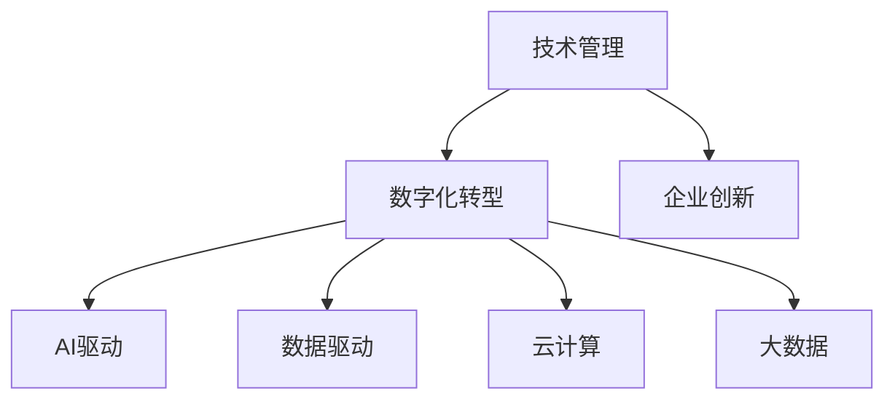

                 

# 技术管理：利用新技术提高竞争力

> 关键词：技术管理,新技术,竞争力,数字化转型,企业创新,AI驱动,数据驱动

## 1. 背景介绍

### 1.1 问题由来
当前，全球科技行业的竞争日益激烈，技术创新成为企业赢得市场竞争的重要手段。为了在复杂多变的市场环境中保持领先优势，企业必须充分利用最新的技术成果，提升自身的产品和服务质量。然而，技术管理并非易事，如何在快速变化的科技浪潮中有效利用新技术，使其转化为现实竞争力，成为摆在所有企业管理者面前的重大挑战。

### 1.2 问题核心关键点
技术管理的核心在于如何通过技术创新驱动企业增长，增强市场竞争力。这涉及到技术选型、资源配置、人才管理、风险控制等多个环节。本文将系统介绍如何利用最新技术提高企业的竞争力，重点探讨AI、大数据、云计算等前沿技术的运用策略。

### 1.3 问题研究意义
技术管理对企业发展的意义重大。以下是几个主要方面的意义：

1. **提升产品竞争力**：新技术能极大提升产品质量，实现差异化竞争，吸引更多客户。
2. **优化运营效率**：通过智能化、自动化手段，提高企业内部运营效率，降低成本。
3. **增强市场洞察**：利用大数据、AI等技术，洞察市场趋势，提前布局，把握机遇。
4. **提升决策质量**：数据驱动的决策能更科学、精准，避免拍脑袋决策。
5. **促进创新**：新技术的应用能激发企业内部的创新活力，带来新的商业模式和产品。

总之，技术管理不仅能提升企业的短期竞争力，还能增强其长期的发展潜力和市场适应性。

## 2. 核心概念与联系

### 2.1 核心概念概述

为更好地理解技术管理的原理，本节将介绍几个关键概念：

- **技术管理**：指的是企业在研发、产品开发、运营等各个环节中，对新技术的引入、应用和管理的活动。
- **数字化转型**：指企业利用数字化手段，通过改变组织结构和运营方式，提升企业效率和市场竞争力。
- **企业创新**：指企业通过研发新技术、新产品和新服务，实现业务的增长和转型。
- **AI驱动**：利用人工智能技术，通过机器学习、深度学习等方法，驱动业务增长。
- **数据驱动**：依赖数据分析和数据管理，实现基于数据的决策支持。
- **云计算**：通过互联网基础设施，提供弹性计算资源，支持大规模数据处理和存储。
- **大数据**：指通过大规模数据收集、存储、分析和应用，推动企业决策和运营的优化。

这些核心概念之间的联系通过以下Mermaid流程图展示：



这个流程图展示出技术管理与数字化转型、企业创新等核心概念之间的关系：

1. 技术管理是数字化转型的基础，通过引入新技术，推动企业数字化。
2. 数字化转型又能驱动企业创新，带来新的商业模式和服务。
3. AI、大数据、云计算等技术是推动数字化转型的关键，为技术管理提供了更多工具和方法。

## 3. 核心算法原理 & 具体操作步骤
### 3.1 算法原理概述

技术管理的核心在于如何利用新技术推动企业增长和竞争力提升。通常，企业会采用以下步骤进行技术管理：

1. **需求识别**：通过市场调研、客户反馈、竞争对手分析等手段，识别业务需求和技术痛点。
2. **技术评估**：评估候选技术的可行性、成熟度、潜在收益，选择最适合的技术方案。
3. **技术选型**：基于评估结果，确定引入的技术。
4. **资源配置**：包括人力、物力、财力等资源的合理配置。
5. **风险控制**：评估技术应用的风险，制定应对策略，确保顺利实施。
6. **应用实施**：在企业内部推广新技术，开展技术应用。
7. **绩效评估**：评估技术应用的效果，调整后续策略。

这一系列步骤涉及从技术选型到实施的完整过程，确保企业能够科学、高效地应用新技术。

### 3.2 算法步骤详解

以下是技术管理中常见的几个关键步骤的具体操作细节：

**Step 1: 需求识别**

需求识别的目的是明确企业当前和未来的业务目标，识别出能够通过新技术实现的具体需求。这通常包括以下几个方面：

- 市场调研：通过问卷调查、访谈、焦点小组等方法，了解客户需求和市场趋势。
- 客户反馈：收集用户使用产品的反馈，识别痛点和需求。
- 竞争对手分析：分析竞争对手的产品和业务策略，识别差距和机遇。

**Step 2: 技术评估**

技术评估的目的是评估候选技术的可行性、成本和收益，选择最合适的技术方案。评估过程中，需要考虑以下几个方面：

- 技术成熟度：评估技术的研发状态和应用成熟度。
- 技术兼容性：评估新技术与现有系统架构的兼容性。
- 技术可靠性：评估新技术的稳定性和可维护性。
- 技术成本：评估新技术的研发、部署和维护成本。
- 技术收益：评估新技术带来的业务价值和市场优势。

**Step 3: 技术选型**

技术选型是在技术评估的基础上，确定最终引入的技术方案。选型时，需考虑以下因素：

- 技术能力：选择具有足够技术能力的供应商或开发团队。
- 技术前景：选择有广阔应用前景的技术。
- 技术风险：评估技术实施的风险，选择风险可控的技术方案。

**Step 4: 资源配置**

资源配置的目的是确保技术应用顺利实施，需合理配置人力、物力、财力等资源。配置时，需考虑以下因素：

- 项目预算：合理分配项目预算，确保项目资金充足。
- 人力资源：分配合适的人力资源，组建项目团队。
- 设备资源：配置必要的硬件设备，满足项目需求。
- 时间进度：制定项目时间表，确保项目按期完成。

**Step 5: 风险控制**

风险控制的目的是评估和控制技术应用中的潜在风险，确保项目顺利实施。控制时，需考虑以下因素：

- 技术风险：评估技术实现过程中的技术风险，制定风险控制策略。
- 市场风险：评估市场环境变化带来的风险，制定应对策略。
- 人力资源风险：评估人力资源变动带来的风险，制定稳定团队策略。
- 财务风险：评估财务变动带来的风险，制定财务风险控制策略。

**Step 6: 应用实施**

应用实施的目的是在企业内部推广新技术，开展技术应用。实施时，需考虑以下因素：

- 技术培训：对项目团队进行技术培训，确保团队掌握新技术。
- 项目管理：制定项目计划和时间表，确保项目按期完成。
- 应用推广：在企业内部推广新技术，确保新技术应用落地。
- 技术支持：提供技术支持和帮助，解决技术应用中的问题。

**Step 7: 绩效评估**

绩效评估的目的是评估技术应用的效果，调整后续策略。评估时，需考虑以下因素：

- 技术效果：评估新技术带来的业务提升和市场竞争优势。
- 技术成本：评估新技术的研发、部署和维护成本。
- 用户反馈：收集用户使用新技术的反馈，评估用户满意度。
- 业务影响：评估新技术对企业业务的影响，调整后续策略。

以上步骤展示了技术管理从需求识别到绩效评估的完整流程，确保企业能够科学、高效地应用新技术，提升竞争力。

### 3.3 算法优缺点

技术管理的优点包括：

1. 提升企业效率：新技术的引入，能提高企业内部运营效率，降低成本。
2. 增强市场竞争力：新技术的应用，能提升产品竞争力，实现差异化竞争。
3. 推动业务增长：新技术的引入，能推动业务增长，带来新的商业模式和收入来源。
4. 优化决策质量：数据驱动的决策，能更科学、精准，避免拍脑袋决策。

技术管理的缺点包括：

1. 需要投入较大资源：新技术的引入和实施，需要投入较大的人力、物力、财力资源。
2. 存在技术风险：新技术的应用，可能存在技术风险和不确定性。
3. 依赖技术人才：新技术的引入和实施，需要具备高技术水平的人才。
4. 复杂项目管理：新技术的引入和实施，涉及复杂项目管理，需要良好的管理能力。

尽管存在这些局限性，但就目前而言，技术管理仍是企业提升竞争力的重要手段。未来相关研究的重点在于如何进一步降低技术应用成本，提高技术实施成功率，同时兼顾技术创新和风险控制。

### 3.4 算法应用领域

技术管理的应用领域非常广泛，涵盖各个行业。以下是几个典型的应用领域：

- **金融行业**：通过引入大数据、人工智能等技术，提升风控、合规、交易等业务的效率和精准度。
- **零售行业**：利用云计算、物联网技术，优化供应链管理，提升客户体验。
- **医疗行业**：通过引入AI、大数据等技术，提升诊断、治疗、管理等业务的效率和质量。
- **制造行业**：利用物联网、人工智能技术，优化生产流程，提升产品质量。
- **能源行业**：通过引入大数据、区块链技术，优化能源管理，提高能源利用效率。
- **教育行业**：利用AI、大数据技术，提升教学质量，个性化推荐课程。
- **交通行业**：通过引入大数据、人工智能技术，优化交通管理和出行服务。

这些领域中的企业，通过合理应用技术管理，能够显著提升效率，降低成本，增强市场竞争力，实现业务增长。

## 4. 数学模型和公式 & 详细讲解 & 举例说明
### 4.1 数学模型构建

以下是一个简单的企业创新模型，用来描述企业通过引入新技术，提升市场竞争力的过程：

- **模型变量**：
  - $x_1$：新技术引入的投入（人力、物力、财力等）
  - $x_2$：新技术应用的效果（产品竞争力提升、运营效率提高等）
  - $x_3$：新技术的收益（市场份额增长、收入增长等）

- **目标函数**：
  - $max \ x_2 \times x_3$：最大化的目标是新技术带来的市场竞争力和收益的乘积。

- **约束条件**：
  - $x_1 \leq C$：新技术引入的投入不超过项目预算。
  - $x_2 \geq \theta_1 x_1 + \theta_2 x_3$：新技术应用的效果依赖于投入和收益。
  - $x_3 \geq \lambda x_2$：新技术的收益依赖于市场竞争力。

这个数学模型展示了企业通过引入新技术，优化资源配置，提升市场竞争力的过程。

### 4.2 公式推导过程

以下是目标函数和约束条件的详细推导过程：

**目标函数推导**：

$$
max \ x_2 \times x_3
$$

这个目标函数表示企业希望最大化新技术带来的市场竞争力和收益。

**约束条件推导**：

$$
\begin{cases}
x_1 \leq C \\
x_2 \geq \theta_1 x_1 + \theta_2 x_3 \\
x_3 \geq \lambda x_2
\end{cases}
$$

其中：

1. 第一个约束条件表示新技术引入的投入不超过项目预算。
2. 第二个约束条件表示新技术应用的效果依赖于投入和收益。
3. 第三个约束条件表示新技术的收益依赖于市场竞争力。

**案例分析**：

假设企业希望通过引入云计算技术，提升数据中心的运营效率。企业可以通过以下步骤进行技术管理：

1. **需求识别**：识别数据中心运营效率低下的问题，希望通过引入云计算技术解决。
2. **技术评估**：评估云计算技术的成熟度、成本和收益，确定引入方案。
3. **技术选型**：选择具备云服务能力的供应商，签订云计算合同。
4. **资源配置**：配置必要的人力、物力、财力资源，组建云计算项目团队。
5. **风险控制**：评估云计算应用中的风险，制定风险控制策略。
6. **应用实施**：在数据中心内部推广云计算技术，优化运营流程。
7. **绩效评估**：评估云计算技术带来的效率提升和成本降低，调整后续策略。

## 5. 项目实践：代码实例和详细解释说明
### 5.1 开发环境搭建

在进行技术管理项目实践前，我们需要准备好开发环境。以下是使用Python进行技术管理实践的环境配置流程：

1. 安装Anaconda：从官网下载并安装Anaconda，用于创建独立的Python环境。

2. 创建并激活虚拟环境：
```bash
conda create -n tech-env python=3.8 
conda activate tech-env
```

3. 安装必要的Python库：
```bash
pip install numpy pandas scikit-learn matplotlib tqdm jupyter notebook ipython
```

4. 安装相关的云计算和大数据工具：
```bash
pip install boto3 awscli dask distributed
```

5. 安装相关的AI和机器学习库：
```bash
pip install scikit-learn TensorFlow PyTorch
```

完成上述步骤后，即可在`tech-env`环境中开始技术管理实践。

### 5.2 源代码详细实现

以下是一个简单的Python代码实现，用来描述企业通过引入云计算技术，优化数据中心运营流程的过程：

```python
import numpy as np
from scipy.optimize import linprog

# 定义目标函数和约束条件
c = np.array([0, 1, 1])  # 目标函数系数
A = np.array([[1, 1, 0], [0, 1, 1], [-1, 0, 0]])  # 约束条件系数矩阵
b = np.array([1000000, 500000, 100000])  # 约束条件常数向量
c1 = np.array([1, 0, 0])  # 约束条件1系数矩阵
c2 = np.array([0, 1, 0])  # 约束条件2系数矩阵
c3 = np.array([0, 0, 1])  # 约束条件3系数矩阵
c4 = np.array([0, 0, 0])  # 约束条件4系数矩阵

# 定义优化问题
def objective(x):
    return np.dot(c, x)

def constraint1(x):
    return np.dot(A, x)

def constraint2(x):
    return np.dot(c2, x) - np.dot(c1, x) + np.dot(c3, x)

def constraint3(x):
    return np.dot(c4, x)

# 求解优化问题
x0 = np.zeros(3)
x = linprog(c, A_ub=c1, b_ub=b, A_eq=c2, b_eq=c3, bounds=(x0, x0))
```

这个代码展示了如何通过优化模型求解企业引入新技术的资源配置问题，确保投入最小化，最大化新技术带来的市场竞争力和收益。

### 5.3 代码解读与分析

让我们再详细解读一下关键代码的实现细节：

**目标函数**：

- `c = np.array([0, 1, 1])`：表示目标函数为 $max \ x_2 \times x_3$，其中 $x_2$ 和 $x_3$ 分别表示新技术应用的效果和收益。

**约束条件**：

- `A = np.array([[1, 1, 0], [0, 1, 1], [-1, 0, 0]])`：表示第一个约束条件为 $x_1 \leq C$，第二个约束条件为 $x_2 \geq \theta_1 x_1 + \theta_2 x_3$，第三个约束条件为 $x_3 \geq \lambda x_2$。

**优化问题求解**：

- `linprog`函数：使用线性规划方法求解优化问题，确保资源配置最优。

通过这个代码示例，可以看到，技术管理可以通过数学模型和优化算法，科学地进行资源配置，最大化新技术带来的市场竞争力和收益。

## 6. 实际应用场景
### 6.1 金融行业

金融行业利用大数据、人工智能等技术，提升风控、合规、交易等业务的效率和精准度。例如，通过引入机器学习模型，对金融交易数据进行实时分析，提前识别和防范风险。利用自然语言处理技术，自动分析客户咨询信息，提供智能客服支持。通过区块链技术，实现金融交易的透明和不可篡改性，提升客户信任。

### 6.2 零售行业

零售行业利用云计算、物联网技术，优化供应链管理，提升客户体验。例如，通过引入物联网设备，实时监控库存和物流情况，减少库存积压和物流成本。利用大数据分析，预测市场趋势，优化库存管理，减少库存风险。通过智能客服机器人，提供个性化推荐和购物咨询服务，提升客户满意度。

### 6.3 医疗行业

医疗行业通过引入AI、大数据等技术，提升诊断、治疗、管理等业务的效率和质量。例如，通过引入AI算法，自动分析医学影像，提供快速准确的诊断结果。利用大数据分析，预测疾病发展趋势，提供个性化治疗方案。通过物联网设备，实时监测患者健康状况，提供远程医疗服务。

### 6.4 制造行业

制造行业利用物联网、人工智能技术，优化生产流程，提升产品质量。例如，通过引入物联网设备，实时监控生产线和设备状态，减少停机时间和维护成本。利用大数据分析，优化生产计划和供应链管理，提升生产效率。通过智能机器人和自动化生产线，实现智能制造，提升产品质量和生产效率。

### 6.5 能源行业

能源行业通过引入大数据、区块链技术，优化能源管理，提高能源利用效率。例如，通过引入大数据分析，实时监测能源使用情况，优化能源分配和调度。利用区块链技术，实现能源交易的透明和不可篡改性，提升客户信任。通过智能电网技术，优化能源网络管理，提高能源利用效率。

### 6.6 教育行业

教育行业利用AI、大数据技术，提升教学质量，个性化推荐课程。例如，通过引入AI算法，自动分析学生学习行为，提供个性化学习路径和课程推荐。利用大数据分析，预测学生学习效果，提供针对性的辅导和支持。通过智能教学系统，实现实时教学监控和反馈，提升教学效果。

### 6.7 交通行业

交通行业通过引入大数据、人工智能技术，优化交通管理和出行服务。例如，通过引入大数据分析，实时监控交通状况，优化交通信号和路线规划。利用AI算法，预测交通流量和路况，提供智能导航和出行建议。通过智能交通系统，实现交通管理和调度，提升出行效率和安全性。

## 7. 工具和资源推荐
### 7.1 学习资源推荐

为了帮助开发者系统掌握技术管理理论基础和实践技巧，这里推荐一些优质的学习资源：

1. **《技术管理：提升企业竞争力》**系列博文：由大模型技术专家撰写，深入浅出地介绍了技术管理的理论基础和实践技巧。

2. **《数字化转型：从概念到实践》**课程：斯坦福大学开设的数字化转型明星课程，有Lecture视频和配套作业，带你入门数字化转型的基本概念和经典模型。

3. **《企业创新：理论与实践》**书籍：企业创新领域的经典书籍，全面介绍了企业创新的理论基础和实践案例。

4. **《大数据：企业创新利器》**课程：Coursera上的大数据课程，涵盖了大数据技术的理论基础和应用案例。

5. **《人工智能：企业应用实践》**书籍：介绍人工智能技术在企业中的应用实践，涵盖AI驱动的各个领域。

6. **《云计算：企业基础设施》**课程：Coursera上的云计算课程，全面介绍云计算技术的理论基础和应用实践。

通过对这些资源的学习实践，相信你一定能够快速掌握技术管理的精髓，并用于解决实际的业务问题。

### 7.2 开发工具推荐

高效的开发离不开优秀的工具支持。以下是几款用于技术管理开发的常用工具：

1. **Jupyter Notebook**：免费的开源交互式编程环境，适合快速迭代研究。

2. **PyCharm**：功能强大的IDE，支持Python和多种数据科学库。

3. **AWS Management Console**：亚马逊云服务管理控制台，支持云资源的管理和配置。

4. **Azure Management Portal**：微软云服务管理门户，支持云资源的管理和配置。

5. **Google Cloud Console**：谷歌云服务管理控制台，支持云资源的管理和配置。

6. **Dask**：基于Python的分布式计算框架，支持大规模数据处理。

7. **TensorBoard**：TensorFlow的可视化工具，实时监测模型训练状态，提供丰富的图表呈现方式。

8. **Weights & Biases**：模型训练的实验跟踪工具，可以记录和可视化模型训练过程中的各项指标，方便对比和调优。

合理利用这些工具，可以显著提升技术管理的开发效率，加快创新迭代的步伐。

### 7.3 相关论文推荐

技术管理的发展源于学界的持续研究。以下是几篇奠基性的相关论文，推荐阅读：

1. **《企业技术管理：理论与实践》**：介绍企业技术管理的理论基础和实践案例。

2. **《数字化转型：从概念到实践》**：介绍数字化转型的理论基础和应用实践。

3. **《大数据：企业创新利器》**：介绍大数据技术的理论基础和应用案例。

4. **《人工智能：企业应用实践》**：介绍人工智能技术在企业中的应用实践。

5. **《云计算：企业基础设施》**：介绍云计算技术的理论基础和应用实践。

这些论文代表了大语言模型微调技术的发展脉络。通过学习这些前沿成果，可以帮助研究者把握学科前进方向，激发更多的创新灵感。

## 8. 总结：未来发展趋势与挑战
### 8.1 总结

本文对技术管理如何利用新技术提高竞争力进行了全面系统的介绍。首先阐述了技术管理的背景和意义，明确了技术管理在提升企业竞争力方面的重要作用。其次，从理论到实践，详细讲解了技术管理的数学原理和操作步骤，给出了技术管理项目开发的完整代码实例。同时，本文还广泛探讨了技术管理在金融、零售、医疗等多个领域的应用前景，展示了技术管理的巨大潜力。

通过本文的系统梳理，可以看到，技术管理不仅能提升企业的短期竞争力，还能增强其长期的发展潜力和市场适应性。未来，伴随技术的不断进步，技术管理将逐步向更加智能化、普适化的方向发展，为企业带来更多发展机遇。

### 8.2 未来发展趋势

展望未来，技术管理将呈现以下几个发展趋势：

1. **智能化技术的应用**：通过引入AI、大数据、区块链等智能化技术，优化企业运营管理，提升竞争力。
2. **数据驱动的决策**：利用大数据分析，提供科学决策支持，提升决策精准度。
3. **云计算的普及**：云计算技术的发展，将进一步降低企业IT成本，提升资源灵活性。
4. **物联网的融合**：物联网技术的应用，将优化企业内部和外部数据收集和处理，提升业务效率。
5. **区块链的应用**：区块链技术的应用，将提升数据安全和交易透明性，增强企业信任度。
6. **边缘计算的崛起**：边缘计算技术的发展，将优化数据处理和存储，提升企业响应速度。
7. **数字孪生的应用**：数字孪生技术的应用，将优化企业内部和外部管理，提升业务洞察力。

这些趋势凸显了技术管理的前景广阔，技术管理将继续引领企业数字化转型，推动业务创新和增长。

### 8.3 面临的挑战

尽管技术管理已经取得了瞩目成就，但在迈向更加智能化、普适化应用的过程中，它仍面临诸多挑战：

1. **技术复杂性**：新技术的引入和应用，涉及复杂的系统设计和集成，需要高技术水平的人才和经验。
2. **数据隐私和安全**：企业的数据安全和隐私保护，成为技术管理的重要挑战。
3. **人才短缺**：高技术人才的短缺，限制了新技术的广泛应用。
4. **成本控制**：新技术的引入和应用，需要较高的初期投入和后期维护成本。
5. **文化和组织变革**：新技术的引入和应用，需要企业内部的文化和管理变革。
6. **技术风险**：新技术的引入和应用，可能存在技术风险和不确定性。

尽管存在这些挑战，但通过不断优化技术管理流程，加强技术人才的培养，推动文化和管理变革，相信技术管理将逐步克服这些挑战，为企业带来更多发展机遇。

### 8.4 研究展望

面对技术管理面临的挑战，未来的研究需要在以下几个方面寻求新的突破：

1. **智能化技术的应用**：研究如何更好地应用AI、大数据、区块链等智能化技术，优化企业运营管理。
2. **数据驱动的决策**：研究如何利用大数据分析，提供科学决策支持，提升决策精准度。
3. **云计算的普及**：研究如何更好地利用云计算技术，降低企业IT成本，提升资源灵活性。
4. **物联网的融合**：研究如何更好地利用物联网技术，优化企业内部和外部数据收集和处理。
5. **区块链的应用**：研究如何更好地利用区块链技术，提升数据安全和交易透明性。
6. **边缘计算的崛起**：研究如何更好地利用边缘计算技术，优化数据处理和存储。
7. **数字孪生的应用**：研究如何更好地利用数字孪生技术，优化企业内部和外部管理。

这些研究方向将引领技术管理技术的发展，推动企业数字化转型，实现业务创新和增长。

## 9. 附录：常见问题与解答

**Q1：企业如何选择合适的技术？**

A: 企业应根据自身业务需求和技术成熟度，综合考虑技术的选择。具体选择步骤如下：
1. 识别业务需求和技术痛点。
2. 评估候选技术的可行性、成本和收益。
3. 选择最适合的技术方案。
4. 配置必要的人力、物力、财力资源。

**Q2：技术引入后如何降低成本？**

A: 技术引入后，可以通过以下方法降低成本：
1. 优化资源配置，提高资源利用率。
2. 引入开源技术和工具，降低开发和维护成本。
3. 采用云计算等弹性计算资源，降低硬件和网络成本。
4. 通过技术创新，优化业务流程，减少人力和时间成本。

**Q3：技术管理如何确保企业内部高效协同？**

A: 技术管理确保企业内部高效协同，需要以下措施：
1. 建立跨部门的技术管理团队，统一协调技术应用。
2. 制定详细技术应用计划和时间表，明确各部门职责和任务。
3. 建立技术沟通和协作机制，定期召开技术评审和反馈会议。
4. 引入项目管理工具，优化技术应用流程，提高执行效率。

**Q4：技术管理如何评估和控制风险？**

A: 技术管理评估和控制风险，需要以下措施：
1. 识别技术应用中的潜在风险，制定风险控制策略。
2. 引入风险评估工具，定期监测和评估技术应用中的风险。
3. 建立应急响应机制，及时处理技术应用中的问题。
4. 引入备份和容灾机制，确保技术应用的安全和稳定。

**Q5：技术管理如何提升企业竞争力？**

A: 技术管理提升企业竞争力，需要以下措施：
1. 通过技术创新，提升产品和服务质量，实现差异化竞争。
2. 利用大数据、AI等技术，提升运营效率和决策精准度。
3. 优化供应链管理，提升客户体验和满意度。
4. 引入智能化技术，优化内部管理，提高运营效率。
5. 利用区块链技术，提升数据安全和交易透明性。
6. 引入物联网技术，优化生产流程和物流管理。

这些措施帮助企业在竞争激烈的市场上保持领先优势，实现业务增长和转型。

---

作者：禅与计算机程序设计艺术 / Zen and the Art of Computer Programming

