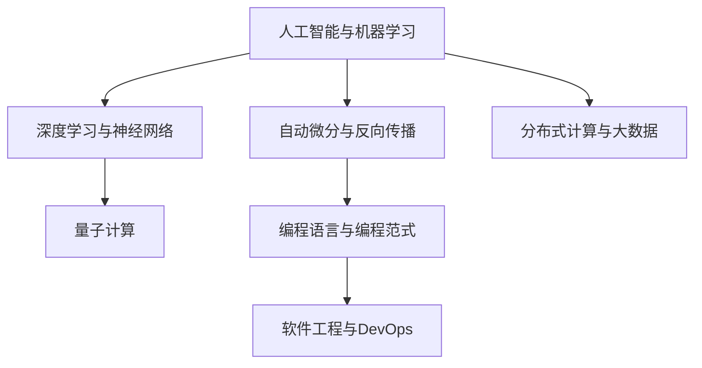

                 

# 技能和培训：为人类计算时代做好准备

## 1. 背景介绍

### 1.1 问题由来
随着人工智能(AI)技术的飞速发展，计算机开始逐渐从简单的信息处理机器，转型为具有高度智能的"智能计算"设备。这一转变不仅意味着计算能力的提升，更代表着计算模式和计算思维方式的重塑。作为新时代的计算从业者，不仅需要掌握最新的技术工具和算法，还需要适应全新的计算范式和工作方式。这无疑给计算领域的人才培养和培训带来了巨大的挑战。

### 1.2 问题核心关键点
在计算机学界和业界，如何为未来的计算时代培养适应性强、知识全面的计算机人才，是当前一个重要议题。这不仅包括对现有技术的深度理解，也包括对新兴计算范式的快速适应。培训和技能提升将成为计算从业人员持续发展的重要驱动力。

### 1.3 问题研究意义
本文聚焦于探讨未来计算时代所需的关键技能和培训策略，旨在为计算领域的教育者和学习者提供一个清晰的方向和可操作的指南，帮助他们更好地应对未来计算环境的变迁。

## 2. 核心概念与联系

### 2.1 核心概念概述

为更好地理解未来计算时代的人才需求，本节将介绍几个紧密相关的核心概念：

- 人工智能与机器学习：以AI为核心的计算模式，通过数据驱动和算法创新，使得计算机具备智能决策和自我学习的能力。
- 深度学习与神经网络：一种模拟人脑神经元计算的高级算法，广泛应用于图像识别、自然语言处理等复杂任务。
- 自动微分与反向传播：深度学习中的核心技术，用于高效计算模型的梯度，驱动模型参数更新。
- 分布式计算与大数据：通过分布式计算框架（如Spark、Hadoop等）处理海量数据，提升计算效率。
- 量子计算：一种基于量子力学原理的计算范式，有望在某些特定领域超越经典计算。
- 编程语言与编程范式：编程语言及其特有的编程范式（如面向对象、函数式、并发等），对计算任务的实现具有重要影响。
- 软件工程与DevOps：通过敏捷开发和持续集成等技术，提升软件质量和开发效率。

这些核心概念之间的逻辑关系可以通过以下Mermaid流程图来展示：



这个流程图展示了人工智能与机器学习技术对深度学习、自动微分、分布式计算、编程语言、软件工程等诸多计算领域的深刻影响。

## 3. 核心算法原理 & 具体操作步骤
### 3.1 算法原理概述

在人工智能和机器学习中，算法原理和操作步骤是理解这些技术的关键。以下我们将对几个核心的算法进行概述：

- 监督学习：通过有标注的数据集训练模型，使其能够预测新数据标签的技术。
- 无监督学习：仅利用无标注数据，通过数据的分布特征学习模型的技术。
- 半监督学习：结合少量标注数据和大量无标注数据，提升模型学习能力的策略。
- 强化学习：通过与环境互动，根据奖励信号训练模型，使其逐步优化决策策略的技术。

### 3.2 算法步骤详解

**监督学习算法步骤**：
1. 数据准备：收集和清洗有标注的数据集。
2. 模型选择：选择合适的模型结构（如线性回归、决策树、神经网络等）。
3. 模型训练：通过优化算法（如梯度下降）更新模型参数。
4. 模型评估：使用测试集评估模型性能。
5. 模型应用：将训练好的模型应用于新数据，进行预测或分类。

**无监督学习算法步骤**：
1. 数据准备：准备大量无标注的数据集。
2. 模型选择：选择合适的模型结构（如K-means、PCA等）。
3. 模型训练：通过优化算法更新模型参数，使数据分布特征得到优化。
4. 模型应用：将训练好的模型应用于新数据，进行数据降维、聚类等任务。

**强化学习算法步骤**：
1. 环境构建：设计任务环境，定义状态空间和奖励函数。
2. 策略选择：选择合适的策略（如Q-learning、SARSA等）。
3. 模型训练：通过与环境互动，根据奖励信号更新策略参数。
4. 模型应用：将训练好的模型应用于新任务，进行决策预测。

### 3.3 算法优缺点

监督学习、无监督学习和强化学习各有其优缺点：

**监督学习的优点**：
- 通过标注数据指导学习过程，模型能够快速收敛到理想状态。
- 在已有大量标注数据的情况下，效果显著。

**监督学习的缺点**：
- 对标注数据的需求较高，获取标注数据成本大。
- 标注数据可能存在偏差，影响模型性能。

**无监督学习的优点**：
- 不需要标注数据，适用于数据获取困难的情况。
- 能发现数据中的潜在结构，挖掘隐藏知识。

**无监督学习的缺点**：
- 无法直接获得明确的输出标签，需要进一步处理。
- 数据质量对模型性能影响较大。

**强化学习的优点**：
- 适用于无法明确标注的数据集。
- 通过与环境互动不断优化，适应性强。

**强化学习的缺点**：
- 训练过程复杂，容易陷入局部最优。
- 奖励函数设计困难，模型性能依赖于奖励策略。

### 3.4 算法应用领域

监督学习、无监督学习和强化学习在众多领域中都有广泛应用：

**监督学习应用领域**：
- 图像分类：通过标注数据训练模型，识别图片中的物体或场景。
- 自然语言处理：通过标注数据训练模型，完成文本分类、情感分析、命名实体识别等任务。
- 预测分析：通过标注数据训练模型，预测股票价格、用户行为等。

**无监督学习应用领域**：
- 数据降维：通过无监督学习算法进行数据压缩和降维，减少数据维度。
- 聚类分析：通过无监督学习算法进行数据聚类，发现数据中的自然分组。
- 异常检测：通过无监督学习算法发现数据中的异常点，用于欺诈检测、故障诊断等。

**强化学习应用领域**：
- 机器人控制：通过强化学习训练机器人，使其在复杂环境中完成任务。
- 游戏AI：通过强化学习训练游戏AI，提升游戏智能水平。
- 自适应系统：通过强化学习训练系统，使其能够动态调整参数以适应环境变化。

## 4. 数学模型和公式 & 详细讲解 & 举例说明
### 4.1 数学模型构建

在人工智能和机器学习中，数学模型是理解这些技术的基础。以下是几个核心数学模型的构建：

**线性回归模型**：
$$
y = \theta_0 + \sum_{i=1}^n \theta_i x_i
$$
其中，$\theta$ 为模型参数，$x_i$ 为输入特征，$y$ 为输出标签。

**决策树模型**：
$$
Tree(T, x) = \begin{cases}
c_r, & \text{if node } r \text{ is a leaf node} \\
Tree(T_r, x), & \text{if node } r \text{ is not a leaf node}
\end{cases}
$$
其中，$T$ 为决策树，$x$ 为输入数据，$c_r$ 为叶子节点的分类结果。

**神经网络模型**：
$$
y = f(Wx + b)
$$
其中，$f$ 为激活函数，$W$ 为权重矩阵，$b$ 为偏置向量。

### 4.2 公式推导过程

以下我们将详细推导几个核心数学模型的公式。

**线性回归损失函数**：
$$
L(\theta) = \frac{1}{2m} \sum_{i=1}^m (y_i - \hat{y}_i)^2
$$
其中，$m$ 为样本数量，$\hat{y}_i$ 为模型预测输出。

**决策树熵**：
$$
H(Y) = -\sum_{y} P(y) \log_2 P(y)
$$
其中，$H(Y)$ 为熵，$P(y)$ 为样本$y$的概率。

**神经网络反向传播算法**：
$$
\frac{\partial L}{\partial w} = \frac{1}{m} \sum_{i=1}^m (y_i - \hat{y}_i) \cdot \frac{\partial \hat{y}_i}{\partial w}
$$
其中，$\frac{\partial L}{\partial w}$ 为损失函数对权重$w$的梯度，$\frac{\partial \hat{y}_i}{\partial w}$ 为激活函数对权重$w$的梯度。

### 4.3 案例分析与讲解

**线性回归案例**：
假设有一组数据点 $(x_1, y_1), (x_2, y_2), \dots, (x_n, y_n)$，利用最小二乘法求解线性回归模型参数 $\theta$：
$$
\theta = \mathop{\arg\min}_{\theta} \sum_{i=1}^n (y_i - \hat{y}_i)^2
$$
其中，$\hat{y}_i = \theta_0 + \sum_{j=1}^n \theta_j x_{ij}$。

**决策树案例**：
构建一棵决策树，以以下数据集为例：
$$
\begin{array}{ccc}
x_1 & x_2 & y \\
0.1 & 0.4 & 0 \\
0.4 & 0.1 & 0 \\
0.5 & 0.8 & 1 \\
0.8 & 0.5 & 1 \\
\end{array}
$$
通过贪心算法构建决策树，可以得到如下结构：

```
x_1 < 0.5 -> 
|
v
x_2 < 0.5 -> 0
|
v
x_2 > 0.5 -> 1
```

**神经网络案例**：
假设有一组训练数据 $(x_1, y_1), (x_2, y_2), \dots, (x_n, y_n)$，其中 $x_i$ 为输入向量，$y_i$ 为输出标签，使用反向传播算法训练一个简单的神经网络：

```
input layer: x_1, x_2
hidden layer: x_3, x_4
output layer: y_1, y_2
```

其中，激活函数使用ReLU，损失函数为均方误差损失。训练过程如下：

1. 前向传播：计算输入层到输出层的每个节点的值。
2. 反向传播：计算损失函数对每个节点值的梯度，并回传至输入层。
3. 更新权重：根据梯度更新权重和偏置。

## 5. 项目实践：代码实例和详细解释说明
### 5.1 开发环境搭建

在进行机器学习项目实践前，我们需要准备好开发环境。以下是使用Python进行TensorFlow开发的环境配置流程：

1. 安装Anaconda：从官网下载并安装Anaconda，用于创建独立的Python环境。

2. 创建并激活虚拟环境：
```bash
conda create -n tf-env python=3.8 
conda activate tf-env
```

3. 安装TensorFlow：根据CUDA版本，从官网获取对应的安装命令。例如：
```bash
conda install tensorflow -c tensorflow -c conda-forge
```

4. 安装numpy、scikit-learn等各类工具包：
```bash
pip install numpy pandas scikit-learn matplotlib tqdm jupyter notebook ipython
```

完成上述步骤后，即可在`tf-env`环境中开始机器学习项目的开发。

### 5.2 源代码详细实现

下面我们以线性回归为例，给出使用TensorFlow进行机器学习模型开发的PyTorch代码实现。

```python
import tensorflow as tf
import numpy as np

# 定义数据
x = np.array([[1.0, 2.0], [2.0, 4.0], [3.0, 6.0], [4.0, 8.0]])
y = np.array([1.0, 3.0, 5.0, 7.0])

# 定义模型
x_placeholder = tf.placeholder(tf.float32, shape=[None, 2])
y_placeholder = tf.placeholder(tf.float32, shape=[None, 1])

W = tf.Variable(tf.zeros([2, 1]), name='weight')
b = tf.Variable(tf.zeros([1]), name='bias')

y_predict = tf.matmul(x_placeholder, W) + b

# 定义损失函数和优化器
loss = tf.losses.mean_squared_error(y_placeholder, y_predict)
optimizer = tf.train.GradientDescentOptimizer(learning_rate=0.01)

# 定义训练过程
with tf.Session() as sess:
    sess.run(tf.global_variables_initializer())
    for i in range(1000):
        sess.run(optimizer.minimize(loss), feed_dict={x_placeholder: x, y_placeholder: y})
    
    # 测试模型
    predict_y = sess.run(y_predict, feed_dict={x_placeholder: x})
    print("预测结果：", predict_y)
```

### 5.3 代码解读与分析

**代码解释**：
- 定义数据：使用NumPy创建输入向量 $x$ 和输出标签 $y$。
- 定义模型：使用TensorFlow定义输入占位符、权重变量 $W$、偏置变量 $b$，并计算预测值 $y_{predict}$。
- 定义损失函数和优化器：使用均方误差损失函数定义损失 $loss$，使用梯度下降优化器 $optimizer$。
- 定义训练过程：创建TensorFlow会话，初始化变量，迭代训练模型，并测试模型预测结果。

**训练过程**：
1. 创建会话：使用 `tf.Session()` 创建TensorFlow会话。
2. 初始化变量：使用 `tf.global_variables_initializer()` 初始化所有变量。
3. 迭代训练：使用 `optimizer.minimize(loss)` 迭代优化模型参数，最小化损失函数。
4. 测试模型：使用 `sess.run(y_predict, feed_dict={x_placeholder: x})` 进行模型测试，输出预测结果。

## 6. 实际应用场景
### 6.1 智慧医疗

智慧医疗的兴起离不开人工智能技术的支撑。人工智能不仅可以辅助医生进行疾病诊断、治疗方案推荐，还能通过数据分析，预测患者疾病发展趋势，提升医疗服务的质量和效率。

在具体实现上，可以通过收集患者的电子病历、体检报告等数据，使用机器学习算法训练模型，预测疾病风险、推荐治疗方案等。此外，还可以利用图像识别技术，自动分析医学影像，辅助医生进行诊断决策。

### 6.2 金融风控

金融行业面临的风险多种多样，包括信用风险、市场风险、操作风险等。通过机器学习算法，可以有效识别和预测金融风险，提前预警，规避潜在损失。

例如，可以使用分类算法训练模型，识别客户的信用风险等级；使用回归算法预测股票价格波动；使用异常检测算法，及时发现金融数据中的异常行为。

### 6.3 智能制造

智能制造是制造业转型升级的关键方向。通过人工智能技术，可以实现设备状态监测、质量控制、生产调度等功能的自动化和智能化。

例如，可以使用图像识别技术检测产品缺陷；使用预测模型预测设备故障；使用优化算法进行生产调度优化。这些技术的结合，可以实现智能制造的全流程智能化。

### 6.4 未来应用展望

随着人工智能技术的不断发展，其在各个领域的应用将越来越广泛。未来，人工智能将成为各行各业的重要工具，改变我们的工作和生活方式。

**医疗领域**：人工智能将进一步深化与医疗领域的结合，提升诊疗效率和诊断准确率，降低医疗成本。

**金融领域**：人工智能将通过风险预警、智能投顾等手段，提升金融服务的安全性和智能化水平，带来更公平、更高效的金融服务。

**制造业**：智能制造将通过机器学习、图像识别等技术，实现生产过程的智能化和自动化，提升生产效率和产品质量。

**交通运输**：无人驾驶、智能交通等技术的普及，将极大改变我们的出行方式，提升交通系统的效率和安全性。

## 7. 工具和资源推荐
### 7.1 学习资源推荐

为了帮助开发者系统掌握机器学习和人工智能的理论基础和实践技巧，这里推荐一些优质的学习资源：

1. 《深度学习》课程：斯坦福大学开设的深度学习入门课程，有Lecture视频和配套作业，带你进入深度学习的世界。
2. Coursera的机器学习专项课程：由斯坦福大学Andrew Ng教授主讲，涵盖机器学习基础、监督学习、无监督学习等核心内容。
3. Kaggle竞赛：参与Kaggle上的机器学习竞赛，通过实际项目锻炼算法和模型优化能力。
4. GitHub开源项目：通过GitHub浏览机器学习开源项目，学习最新的研究进展和实际应用。
5. DeepLearning.AI的深度学习课程：黄仁伟教授主讲的深度学习课程，涵盖深度学习基础和核心算法。

通过对这些资源的学习实践，相信你一定能够快速掌握机器学习和人工智能的核心知识，并用于解决实际的计算问题。

### 7.2 开发工具推荐

高效的开发离不开优秀的工具支持。以下是几款用于机器学习开发的常用工具：

1. TensorFlow：由Google主导开发的开源深度学习框架，生产部署方便，适合大规模工程应用。
2. PyTorch：基于Python的开源深度学习框架，灵活动态的计算图，适合快速迭代研究。
3. Scikit-learn：基于Python的机器学习库，提供了丰富的机器学习算法和模型评估工具。
4. Keras：基于TensorFlow和Theano的高级深度学习框架，简单易用，适合初学者。
5. Jupyter Notebook：交互式的代码编写和运行环境，适合进行数据探索和模型验证。

合理利用这些工具，可以显著提升机器学习项目的开发效率，加快创新迭代的步伐。

### 7.3 相关论文推荐

机器学习和人工智能的发展源于学界的持续研究。以下是几篇奠基性的相关论文，推荐阅读：

1. Deep Learning（《深度学习》）：Goodfellow、Bengio、Courville三位学者合著，全面介绍了深度学习的基本概念和核心算法。
2. A Survey of Machine Learning Techniques for Predictive Maintenance（《预测性维护中的机器学习方法综述》）：Lei Yang等学者，系统回顾了机器学习在预测性维护中的应用。
3. Revisiting Efficient Estimation of Uncertainty in Deep Neural Networks（《重新审视深度神经网络中不确定性估计的有效性》）：Hirsh et al.，探讨了在深度神经网络中有效估计不确定性的方法。
4. Biometric Information Privacy Preserving Scheme Based on Machine Learning（《基于机器学习的生物信息隐私保护方案》）：Zhang et al.，研究了如何保护生物信息数据隐私的机器学习方法。
5. Generative Adversarial Nets（《生成对抗网络》）：Ian Goodfellow等学者，提出了一种通过对抗训练生成逼真图像的深度学习模型。

这些论文代表了大数据、机器学习等领域的研究方向，通过学习这些前沿成果，可以帮助研究者把握学科前进方向，激发更多的创新灵感。

## 8. 总结：未来发展趋势与挑战
### 8.1 总结

本文对未来计算时代所需的关键技能和培训策略进行了全面系统的介绍。首先，详细阐述了人工智能和机器学习的核心概念和算法原理，明确了这些技术对计算领域的重要影响。其次，从理论到实践，详细讲解了机器学习模型构建、训练和应用的全过程，给出了机器学习项目开发的完整代码实例。同时，本文还广泛探讨了机器学习技术在医疗、金融、智能制造等多个行业领域的应用前景，展示了机器学习技术的巨大潜力。最后，本文精选了机器学习技术的各类学习资源，力求为计算领域的学习者和教育者提供全方位的技术指引。

通过本文的系统梳理，可以看到，机器学习和人工智能技术正在成为计算领域的重要驱动力，极大地拓展了计算应用的可能性。未来，伴随机器学习技术的不断进步，计算系统将变得越来越智能、高效，为各行各业带来深远的变革。

### 8.2 未来发展趋势

展望未来，机器学习和人工智能技术将呈现以下几个发展趋势：

1. 深度学习模型的复杂性将继续提升。深度神经网络的结构将更加复杂，参数量将不断增加，性能也将逐步提升。
2. 强化学习技术将得到广泛应用。机器人在自动驾驶、智能控制、虚拟助手等领域将发挥重要作用。
3. 自动微分技术将更加高效。自动微分工具和算法将进一步优化，提升深度学习模型的训练效率。
4. 跨领域知识融合将取得突破。人工智能技术将与物联网、区块链、云计算等新兴技术结合，形成更加全面的智能系统。
5. 量子计算技术将逐步成熟。量子计算技术将在某些特定领域展现出超越经典计算的优势，进一步推动计算技术的创新。
6. 机器学习模型的可解释性将得到提升。模型解释和推理工具将逐步成熟，帮助用户理解模型内部工作机制。
7. 数据隐私和安全将得到更多重视。如何保护数据隐私和安全，防止数据滥用，将成为未来机器学习应用的重要课题。

以上趋势凸显了机器学习和人工智能技术的广阔前景。这些方向的探索发展，必将进一步提升计算系统的性能和应用范围，为人类社会带来更深刻的变革。

### 8.3 面临的挑战

尽管机器学习和人工智能技术已经取得了瞩目成就，但在迈向更加智能化、普适化应用的过程中，它们仍面临着诸多挑战：

1. 数据质量问题。机器学习模型的性能很大程度上依赖于数据质量，数据缺失、噪声等问题将影响模型效果。
2. 算法复杂度问题。深度神经网络等模型的复杂度越来越高，训练和优化难度增大，计算资源需求也大幅提升。
3. 模型可解释性问题。现有机器学习模型大多为黑盒模型，难以解释内部决策过程，用户难以信任和使用。
4. 数据隐私问题。机器学习模型的应用需要大量数据，数据隐私和安全问题将引发广泛关注。
5. 伦理和法律问题。机器学习技术的广泛应用将带来伦理和法律上的挑战，如何规范应用行为，保护用户权益，成为重要课题。

### 8.4 研究展望

面对机器学习和人工智能技术面临的挑战，未来的研究需要在以下几个方面寻求新的突破：

1. 数据清洗和预处理技术。开发更加高效的数据清洗和预处理工具，提升数据质量，降低噪声影响。
2. 模型压缩和加速技术。开发更加高效和轻量级的模型压缩和加速方法，提升模型训练和推理效率。
3. 模型解释和可视化工具。开发更加透明的模型解释和可视化工具，提升模型可解释性和用户信任度。
4. 数据隐私保护技术。开发更加有效的数据隐私保护技术，确保数据安全。
5. 伦理和法律框架。制定更加完善的伦理和法律框架，规范机器学习技术的应用行为，保护用户权益。

这些研究方向的探索，必将引领机器学习和人工智能技术迈向更高的台阶，为构建安全、可靠、可解释、可控的智能系统铺平道路。面向未来，机器学习和人工智能技术还需要与其他新兴技术进行更深入的融合，如量子计算、物联网等，多路径协同发力，共同推动智能计算的发展。只有勇于创新、敢于突破，才能不断拓展计算技术的应用边界，让机器学习技术更好地服务于人类社会。

## 9. 附录：常见问题与解答

**Q1：机器学习与人工智能的区别是什么？**

A: 机器学习是人工智能的子领域，通过数据驱动的方式训练模型，使机器能够从数据中学习规律，自动完成特定任务。而人工智能更广泛，涵盖了机器学习、知识工程、自然语言处理等多个方向，目标是使机器具备类似人类的智能能力。

**Q2：如何处理数据缺失和噪声问题？**

A: 数据缺失和噪声是机器学习中常见的问题，处理方法包括：
1. 数据补全：通过插值、均值填充等方法填补缺失值。
2. 数据清洗：删除噪声数据、处理异常值等。
3. 数据增强：通过对数据进行扩充和增强，减少噪声影响。
4. 特征选择：选择与任务相关的特征，减少噪声干扰。

**Q3：如何选择机器学习算法？**

A: 选择机器学习算法需要考虑数据类型、任务类型、数据量等多个因素。一般有以下几种方法：
1. 监督学习：适用于有标注数据的任务，如分类、回归等。
2. 无监督学习：适用于无标注数据的任务，如聚类、降维等。
3. 半监督学习：适用于少量标注数据的任务，通过少量标注数据引导模型学习。
4. 强化学习：适用于需要与环境互动的任务，如游戏、控制等。

**Q4：机器学习模型在实际应用中需要注意哪些问题？**

A: 机器学习模型在实际应用中需要注意以下问题：
1. 模型泛化能力：模型需要具备良好的泛化能力，能够在新数据上取得良好效果。
2. 模型鲁棒性：模型需要具备良好的鲁棒性，对噪声数据和异常情况具备良好的抗干扰能力。
3. 模型可解释性：模型需要具备良好的可解释性，用户能够理解模型内部工作机制。
4. 数据隐私问题：模型需要具备良好的数据隐私保护能力，防止数据滥用和泄露。

**Q5：如何评估机器学习模型的性能？**

A: 评估机器学习模型的性能通常使用以下指标：
1. 准确率：模型预测正确的样本占总样本的比例。
2. 召回率：模型正确预测的正样本占真实正样本的比例。
3. F1分数：准确率和召回率的调和平均数。
4. ROC曲线：绘制真阳性率与假阳性率之间的关系，用于评估分类模型的性能。
5. 混淆矩阵：用于评估分类模型的具体预测结果。

这些指标能够帮助用户全面了解模型性能，并根据具体任务需求选择最优模型。

---

作者：禅与计算机程序设计艺术 / Zen and the Art of Computer Programming

