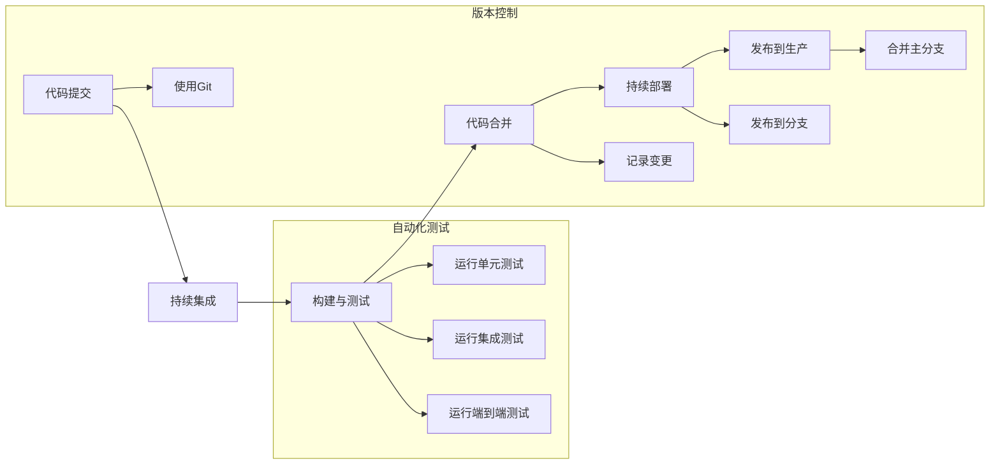

                 

# 持续集成和持续部署：自动化软件发布

> 关键词：持续集成,持续部署,自动化,CI/CD,DevOps,软件发布

## 1. 背景介绍

在当今快速变化的数字化时代，软件开发模式已经从传统的瀑布模型向敏捷和迭代模型转变。企业需要更频繁地发布软件更新，以保持竞争力和用户满意度。持续集成和持续部署（Continuous Integration and Continuous Deployment，CI/CD）成为软件开发过程中不可或缺的一环，它通过自动化测试和部署，快速交付高质量的软件变更，显著提高了软件发布效率和质量。

本文将深入探讨CI/CD的核心概念与原理，详细解析其实现步骤与优缺点，并结合实际应用场景介绍具体的CI/CD工具与技术，为软件开发团队的持续集成和持续部署提供全面的指导。

## 2. 核心概念与联系

### 2.1 核心概念概述

持续集成和持续部署（CI/CD）是一种软件开发实践，旨在通过自动化构建、测试和部署流程，缩短从代码提交到软件发布的时间周期，提高软件质量和可靠性。CI/CD将软件开发的各个阶段紧密集成，实现持续迭代和优化，最终快速响应市场和用户需求。

CI/CD的核心概念包括：

- **持续集成**：集成开发团队成员的代码，频繁构建、测试和验证软件变更，确保代码的完整性和稳定性。
- **持续部署**：将通过测试的软件变更快速部署到生产环境，降低手动部署的风险和成本，加速交付速度。
- **自动化测试**：通过构建自动化测试工具链，持续验证代码质量，避免回归问题，提高软件质量。
- **版本控制**：使用如Git等版本控制系统，记录代码变更历史，方便追踪和回滚，实现协作开发。

### 2.2 核心概念原理和架构的 Mermaid 流程图



该流程图展示了CI/CD的基本流程：

1. 开发者将代码提交到版本控制系统，如Git。
2. 持续集成系统自动触发构建和测试，包括单元测试、集成测试和端到端测试。
3. 若测试通过，则将代码合并到主分支，并通过持续部署系统将其部署到生产环境。
4. 自动化测试持续运行，确保代码质量和稳定性。

## 3. 核心算法原理 & 具体操作步骤

### 3.1 算法原理概述

CI/CD的实现基于自动化工具链，通过构建脚本、测试框架和部署管道，自动执行软件开发的全流程。CI/CD的算法原理包括以下几个核心步骤：

1. **版本控制**：通过Git等版本控制系统记录代码变更，实现协作开发。
2. **构建与测试**：通过自动化构建工具（如Jenkins、Travis CI等），自动执行代码构建和测试流程，包括编译、打包和自动化测试。
3. **持续集成**：通过集成开发环境的持续集成工具（如Jenkins、GitLab CI等），定期或手动触发构建与测试流程，确保代码变更的及时检测。
4. **持续部署**：通过持续部署工具（如Jenkins、Ansible等），自动将通过测试的软件变更部署到生产环境。
5. **监控与反馈**：通过日志分析和监控系统（如ELK Stack、Prometheus等），实时监测系统性能和错误，收集用户反馈，持续优化软件发布流程。

### 3.2 算法步骤详解

以下是CI/CD的详细步骤详解：

**Step 1: 初始化开发环境**

- 配置版本控制系统（如Git），确保所有开发者可以使用。
- 安装持续集成工具（如Jenkins、GitLab CI等），并根据项目需求配置任务。

**Step 2: 编写构建脚本**

- 使用自动化构建工具（如Jenkinsfile、Travis CI等），编写构建脚本，定义构建流程，包括编译、测试和打包等步骤。
- 确保构建脚本在环境变动时仍能正常运行，并输出构建日志。

**Step 3: 配置持续集成**

- 在持续集成工具中配置构建脚本和测试流程。
- 设置触发机制，如代码变更触发构建或定时任务。
- 配置构建后的处理流程，如失败时的告警和报告。

**Step 4: 执行构建与测试**

- 当代码变更提交到版本控制库时，持续集成工具自动触发构建流程。
- 构建工具执行构建脚本，生成可部署的包或容器镜像。
- 自动化测试工具链（如JUnit、Selenium等）执行测试脚本，验证软件变更的正确性。

**Step 5: 代码合并与部署**

- 若测试通过，持续部署工具自动将变更部署到生产环境。
- 部署过程可包含环境变量配置、数据库迁移、服务重启等步骤。
- 部署后，运行自动化测试确保软件变更无问题。

**Step 6: 持续监控与反馈**

- 部署完成后，监控系统（如ELK Stack、Prometheus等）实时监测系统性能和错误。
- 收集用户反馈，通过日志分析和用户反馈进行持续优化。

### 3.3 算法优缺点

**优点**：

1. **加速发布周期**：通过自动化构建、测试和部署，大大缩短从代码提交到软件发布的时间周期，快速响应市场和用户需求。
2. **提高软件质量**：自动化测试工具链持续验证代码质量，减少手动测试的误漏，确保软件变更的稳定性和可靠性。
3. **降低发布风险**：持续集成和持续部署系统减少了手动部署的风险和成本，确保软件变更的安全性。
4. **提高团队协作效率**：版本控制系统记录代码变更历史，便于协作开发和问题追踪。

**缺点**：

1. **初期投入高**：需要配置和维护持续集成和持续部署工具链，初始投入较高。
2. **复杂度增加**：自动化流程的配置和维护相对复杂，需要一定技术积累。
3. **依赖系统稳定**：自动化流程的顺利执行依赖于系统和网络的稳定性，一旦出现故障，可能导致生产环境的中断。

### 3.4 算法应用领域

CI/CD技术广泛应用于软件开发、测试、部署和运维等各个环节，以下是具体应用场景：

- **软件开发**：通过CI/CD实现快速迭代和持续改进，提升代码质量和开发效率。
- **测试**：自动化测试工具链持续执行代码测试，确保软件变更的正确性和稳定性。
- **部署**：自动化部署工具链将通过测试的软件变更快速部署到生产环境，提高交付速度。
- **运维**：持续监控和反馈系统性能，及时处理错误，确保系统稳定运行。

## 4. 数学模型和公式 & 详细讲解

### 4.1 数学模型构建

在CI/CD中，构建和测试流程的自动化实现依赖于数学模型，用于描述和优化构建和测试过程。以下是一个简单的数学模型示例：

- **构建时间模型**：假设构建过程需要$t_{build}$时间，测试过程需要$t_{test}$时间，则总时间$T$可以表示为：
  $$
  T = t_{build} + t_{test}
  $$

- **任务并行模型**：当构建和测试任务可以并行执行时，总时间$T$可以表示为：
  $$
  T = \max(t_{build}, t_{test})
  $$

### 4.2 公式推导过程

- **构建时间模型推导**：总时间$T$为构建时间和测试时间之和，可以简单表示为：
  $$
  T = t_{build} + t_{test}
  $$

- **任务并行模型推导**：在并行执行的情况下，总时间$T$为构建和测试时间中的最大值，可以表示为：
  $$
  T = \max(t_{build}, t_{test})
  $$

### 4.3 案例分析与讲解

- **案例1: 连续集成**：假设每小时提交10次代码变更，每次变更需要10分钟构建和测试。则持续集成的构建和测试频率为：
  $$
  F_{build} = 60 / 10 = 6 \text{次/小时}
  $$
  $$
  F_{test} = 60 / 10 = 6 \text{次/小时}
  $$

- **案例2: 持续部署**：假设构建时间为20分钟，测试时间为30分钟，则持续部署的每个周期时间为：
  $$
  T_{deploy} = \max(20, 30) = 30 \text{分钟}
  $$

## 5. 项目实践：代码实例和详细解释说明

### 5.1 开发环境搭建

在进行CI/CD实践前，首先需要搭建一个完整且稳定的开发环境。以下是典型的开发环境配置步骤：

1. **版本控制配置**：
   - 安装Git，配置本地仓库和远程仓库。
   - 创建项目目录，并初始化Git仓库。

2. **持续集成工具配置**：
   - 安装Jenkins或GitLab CI，并配置源码仓库。
   - 安装构建工具链，如Maven、Gradle等。
   - 配置构建和测试脚本。

3. **持续部署工具配置**：
   - 安装Ansible或Kubernetes，并配置生产环境。
   - 编写部署脚本，定义环境配置和应用部署。
   - 配置日志记录和告警系统。

### 5.2 源代码详细实现

下面以Jenkins和GitLab CI为例，展示具体的CI/CD流程实现：

**Jenkins**：
- 在Jenkins中创建项目，并配置源码仓库。
- 编写Jenkinsfile，定义构建和测试步骤。
- 配置触发机制，如代码变更触发构建。

```groovy
pipeline {
    agent any
    stages {
        stage('Build') {
            steps {
                sh 'mvn package'
            }
        }
        stage('Test') {
            steps {
                sh 'mvn test'
            }
        }
        stage('Deploy') {
            steps {
                sh 'mvn spring-boot:deploy'
            }
        }
    }
}
```

**GitLab CI**：
- 在GitLab仓库中创建.gitlab-ci.yml文件，定义构建和测试流程。
- 配置触发机制，如代码变更触发构建。

```yaml
stages:
  - build
  - test
  - deploy

build:
  stage: build
  script:
    - echo "Building project..."
    - mvn package

test:
  stage: test
  script:
    - echo "Running tests..."
    - mvn test

deploy:
  stage: deploy
  script:
    - echo "Deploying project..."
    - mvn spring-boot:deploy
```

### 5.3 代码解读与分析

**Jenkinsfile**：
- Jenkinsfile是Jenkins的配置文件，使用Groovy编写。
- 定义了构建、测试和部署的各个步骤，每个步骤执行指定的命令。

**.gitlab-ci.yml**：
- .gitlab-ci.yml是GitLab CI的配置文件，使用YAML编写。
- 定义了构建、测试和部署的各个阶段，每个阶段执行指定的命令。

### 5.4 运行结果展示

- **构建结果**：构建工具链自动执行构建脚本，生成可部署的包或容器镜像，并输出构建日志。
- **测试结果**：自动化测试工具链执行测试脚本，验证软件变更的正确性，并输出测试报告。
- **部署结果**：持续部署工具链自动将变更部署到生产环境，并运行自动化测试，确保软件变更无问题。
- **监控结果**：监控系统实时监测系统性能和错误，收集用户反馈，并输出监控报告。

## 6. 实际应用场景

### 6.4 未来应用展望

持续集成和持续部署（CI/CD）技术在软件开发领域的应用前景广阔，以下是未来应用展望：

1. **云计算和微服务架构**：CI/CD系统在云平台和微服务架构中的应用越来越广泛，提升了应用的弹性和可伸缩性。
2. **DevOps文化**：CI/CD与DevOps文化紧密结合，推动了软件开发流程的标准化和自动化。
3. **容器化和自动化运维**：容器化和自动化运维工具（如Docker、Kubernetes等）与CI/CD系统结合，实现了应用的无缝部署和运维。
4. **持续学习和优化**：基于机器学习和A/B测试，持续优化CI/CD流程，提升软件发布效率和质量。
5. **区块链和智能合约**：区块链和智能合约的应用中，CI/CD系统保障了代码的安全性和可靠性，加速了智能合约的开发和部署。

## 7. 工具和资源推荐

### 7.1 学习资源推荐

为了帮助开发者深入理解CI/CD的核心概念和实现细节，推荐以下学习资源：

1. **《CI/CD DevOps实践》**：详细介绍了CI/CD的基本原理、工具链和最佳实践。
2. **《Jenkins权威指南》**：Jenkins是常用的持续集成工具，本书介绍了Jenkins的安装、配置和维护。
3. **《Kubernetes实战》**：Kubernetes是常用的容器编排工具，本书介绍了Kubernetes的安装、配置和应用场景。
4. **《DevOps文化与实践》**：介绍DevOps文化的基本概念、工具链和持续改进方法。
5. **《CI/CD最佳实践》**：总结了CI/CD的最佳实践，包括版本控制、持续集成和持续部署。

### 7.2 开发工具推荐

以下是几款常用的CI/CD工具：

1. **Jenkins**：开源的持续集成工具，支持广泛的插件生态，功能强大且易于配置。
2. **GitLab CI**：GitLab集成的持续集成工具，与GitLab无缝集成，支持CI/CD管道和GitLab Pages。
3. **Travis CI**：基于云的持续集成工具，支持多种编程语言和构建环境。
4. **Jenkinsfile**：Jenkins的配置文件，使用Groovy编写，支持脚本化的构建流程。
5. **.gitlab-ci.yml**：GitLab CI的配置文件，使用YAML编写，支持复杂的流程定义。

### 7.3 相关论文推荐

以下是几篇具有代表性的CI/CD相关论文，推荐阅读：

1. **Continuous Integration: A Software Engineering Discipline**：介绍了持续集成的基本概念、工具链和最佳实践。
2. **Continuous Deployment: A Survey**：综述了持续部署的实现方法和工具，总结了持续部署的挑战和解决方案。
3. **DevOps: The Culture of Collaboration and Integration**：讨论了DevOps文化的基本概念、工具链和持续改进方法。
4. **CI/CD Pipelines: A Guide**：介绍了CI/CD的基本原理、工具链和最佳实践，提供了详细的示例代码。
5. **Kubernetes: Principles and Practices**：介绍了Kubernetes的基本原理、架构和最佳实践，提供了详细的部署和应用指南。

## 8. 总结：未来发展趋势与挑战

### 8.1 研究成果总结

本文对持续集成和持续部署（CI/CD）的核心概念、原理、实现步骤和优缺点进行了详细介绍，并通过具体的项目实践，展示了CI/CD的实际应用场景。通过这些介绍，读者可以全面理解CI/CD的基本原理和技术细节。

### 8.2 未来发展趋势

持续集成和持续部署（CI/CD）技术将在未来继续发展和完善，其发展趋势包括：

1. **云原生CI/CD**：随着云原生技术的普及，CI/CD系统将更加云化，支持弹性伸缩、自动扩容和故障恢复。
2. **自动化运维**：CI/CD与自动化运维工具（如Kubernetes、Ansible等）结合，实现应用的无缝部署和运维。
3. **微服务架构**：微服务架构的应用将促进CI/CD系统的进一步优化，提升应用的弹性和可伸缩性。
4. **机器学习和A/B测试**：基于机器学习和A/B测试，持续优化CI/CD流程，提升软件发布效率和质量。
5. **区块链和智能合约**：区块链和智能合约的应用中，CI/CD系统保障了代码的安全性和可靠性，加速了智能合约的开发和部署。

### 8.3 面临的挑战

尽管CI/CD技术已经取得了显著进展，但在实际应用中仍面临一些挑战：

1. **复杂性管理**：CI/CD系统的复杂性随着应用的增加而增加，需要有效的管理工具和最佳实践。
2. **依赖性问题**：CI/CD系统依赖于多个工具和组件，任何一个环节出现问题都可能导致系统中断。
3. **性能瓶颈**：构建和测试流程的自动化执行需要高效的硬件和网络环境，存在性能瓶颈。
4. **安全性和合规性**：CI/CD系统需要严格的安全措施和合规性管理，保障代码变更的安全性和合规性。

### 8.4 研究展望

针对CI/CD面临的挑战，未来的研究将集中在以下几个方面：

1. **管理工具**：开发更高效的管理工具，简化CI/CD系统的配置和维护。
2. **性能优化**：优化构建和测试流程的执行效率，提高CI/CD系统的响应速度。
3. **自动化运维**：将自动化运维工具与CI/CD系统结合，实现应用的无缝部署和运维。
4. **安全性和合规性**：加强CI/CD系统的安全性措施和合规性管理，保障代码变更的安全性和合规性。
5. **新技术融合**：将CI/CD系统与其他新技术（如区块链、智能合约、边缘计算等）结合，拓展应用场景和能力。

这些研究方向的探索，将引领CI/CD技术迈向更高的台阶，为软件开发和运维带来新的突破。

## 9. 附录：常见问题与解答

### Q1: 什么是持续集成和持续部署（CI/CD）？

A: 持续集成和持续部署（CI/CD）是一种软件开发实践，通过自动化构建、测试和部署流程，加速软件发布周期，提高软件质量和可靠性。

### Q2: 持续集成和持续部署（CI/CD）的主要优点是什么？

A: 持续集成和持续部署（CI/CD）的主要优点包括：

- 加速发布周期
- 提高软件质量
- 降低发布风险
- 提高团队协作效率

### Q3: 持续集成和持续部署（CI/CD）的主要缺点是什么？

A: 持续集成和持续部署（CI/CD）的主要缺点包括：

- 初期投入高
- 复杂度增加
- 依赖系统稳定

### Q4: 如何配置持续集成和持续部署（CI/CD）系统？

A: 配置持续集成和持续部署（CI/CD）系统需要以下步骤：

1. 安装版本控制工具（如Git）。
2. 安装持续集成工具（如Jenkins、GitLab CI等），并配置源码仓库。
3. 安装构建工具链（如Maven、Gradle等），并编写构建和测试脚本。
4. 配置持续集成工具，设置触发机制和处理流程。
5. 安装持续部署工具（如Ansible、Kubernetes等），并编写部署脚本。
6. 配置日志记录和告警系统。

### Q5: 持续集成和持续部署（CI/CD）系统如何处理失败的任务？

A: 持续集成和持续部署（CI/CD）系统处理失败的任务需要以下步骤：

1. 定义失败处理策略，如标记问题、发送告警等。
2. 配置失败后的处理流程，如自动回滚、手动处理等。
3. 使用日志和监控系统，记录和分析失败原因。
4. 持续优化构建和测试流程，减少失败率。

---

作者：禅与计算机程序设计艺术 / Zen and the Art of Computer Programming

