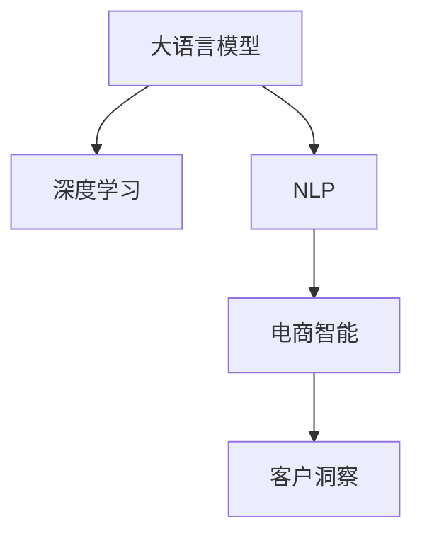

                 

# 探索基于大模型的电商智能客户洞察系统

> 关键词：
> 大语言模型, 电商客户洞察, 深度学习, 机器学习, 自然语言处理(NLP), 神经网络, 电商智能, 客户行为分析

## 1. 背景介绍

### 1.1 问题由来
在电商领域，准确洞察客户行为，理解客户需求，预测客户行为趋势，已经成为电商企业提升用户体验、优化运营策略、增加销售额的重要手段。传统的客户洞察方法依赖于数据分析、调查问卷、用户反馈等人工手段，耗时长、成本高，且难以全面、实时地掌握客户信息。

随着大数据和人工智能技术的不断发展，基于大语言模型和深度学习算法的客户洞察系统逐渐成为电商行业的关注焦点。这类系统可以通过自然语言处理技术，自动分析客户评论、社交媒体、搜索日志等文本数据，深度挖掘其中的情感倾向、购买动机、行为模式等关键信息，辅助企业制定更加精准的营销策略和运营计划。

### 1.2 问题核心关键点
本节将详细阐述构建基于大语言模型的电商智能客户洞察系统的关键问题：
- 如何高效地获取、处理和分析大量的电商文本数据？
- 如何在大规模数据上训练和优化大语言模型？
- 如何将预训练的大语言模型应用到客户洞察任务中，并实现效果优化？

这些问题需要从算法、数据、模型和应用等多个层面进行综合考虑，才能构建出高效、准确的电商智能客户洞察系统。

### 1.3 问题研究意义
构建基于大语言模型的电商智能客户洞察系统，对电商企业具有重要意义：

1. 降低成本：相比传统的问卷调查和人工分析，大语言模型可以自动处理海量文本数据，显著降低数据收集和分析的成本。
2. 提升效率：自动化的数据处理和分析，加速了客户洞察的速度，使企业能够及时响应市场变化，调整营销策略。
3. 精准洞察：深度学习模型能够从大量文本中提取出细微的情感、意图和行为模式，提供更深入的客户洞察。
4. 预测能力：通过分析历史数据和趋势，大语言模型可以预测客户未来的行为，帮助企业预判市场动向，制定前瞻性策略。
5. 数据驱动：智能客户洞察系统基于数据驱动，能够持续优化模型，适应客户需求的变化。

## 2. 核心概念与联系

### 2.1 核心概念概述

为了更好地理解如何构建基于大语言模型的电商智能客户洞察系统，本节将介绍几个核心概念及其间的联系：

- **大语言模型(Large Language Model, LLM)**：指基于Transformer架构的深度学习模型，如GPT、BERT等，通过在大规模无标签文本数据上进行预训练，学习到了丰富的语言知识和常识。
- **深度学习(Deep Learning)**：指使用多层神经网络模型进行数据处理的机器学习方法，能够从大量数据中学习到复杂的特征和规律。
- **自然语言处理(NLP)**：指使用计算机对自然语言进行理解和生成的技术，涵盖了文本分析、语音识别、机器翻译等多个子领域。
- **电商智能**：指将人工智能技术应用于电商领域，实现客户行为分析、商品推荐、价格优化等目标，提升电商运营效率和用户体验。
- **客户洞察**：指通过数据分析和机器学习技术，理解客户行为和需求，为企业制定针对性的营销策略和运营计划。

这些核心概念之间的逻辑关系可以通过以下Mermaid流程图来展示：



该流程图展示了大语言模型、深度学习、自然语言处理和电商智能、客户洞察之间的联系。

## 3. 核心算法原理 & 具体操作步骤
### 3.1 算法原理概述

基于大语言模型的电商智能客户洞察系统，核心算法原理包括以下几个关键点：

1. **数据收集与预处理**：从电商平台收集客户评论、社交媒体、搜索日志等文本数据，并进行文本清洗、去重、分词、标注等预处理操作，为后续建模提供数据支持。

2. **预训练大语言模型**：使用大规模无标签文本数据训练预训练大语言模型，学习到通用的语言表示，为微调任务提供初始化参数。

3. **客户洞察任务定义**：定义具体的客户洞察任务，如情感分析、意图识别、行为预测等，确定模型输出格式和评估指标。

4. **任务适配与微调**：在预训练模型的基础上，对模型进行任务适配，添加特定的输出层和损失函数，并通过标注数据对模型进行微调，优化模型在特定任务上的性能。

5. **效果评估与优化**：在微调后的模型上，使用验证集和测试集评估模型性能，根据评估结果调整超参数，进一步优化模型效果。

### 3.2 算法步骤详解

以下详细介绍基于大语言模型的电商智能客户洞察系统的具体算法步骤：

**Step 1: 数据收集与预处理**

- 从电商平台收集客户评论、社交媒体、搜索日志等文本数据，使用API接口进行数据抓取。
- 对文本数据进行清洗，去除无意义符号、特殊字符和停用词。
- 对文本进行分词和标注，提取关键词和实体。
- 对标注数据进行分割，划分为训练集、验证集和测试集。

**Step 2: 预训练大语言模型**

- 选择适合的预训练大语言模型，如BERT、GPT等，使用大规模无标签文本数据进行预训练。
- 在预训练过程中，可以使用自监督学习任务（如掩码语言模型、次序预测等），学习到丰富的语言表示。
- 将预训练模型的权重作为初始化参数，保存在本地或云存储中。

**Step 3: 任务适配与微调**

- 根据客户洞察任务，设计合适的输出层和损失函数。例如，情感分析任务可以使用二分类交叉熵损失函数，行为预测任务可以使用回归损失函数。
- 将预训练模型的顶层作为任务适配层的输入，添加新的输出层和损失函数。
- 使用标注数据对模型进行微调，优化模型在特定任务上的性能。微调过程中，可以设置学习率、批大小、迭代轮数等超参数，使用正则化技术（如L2正则、Dropout等）避免过拟合。
- 在微调过程中，可以使用梯度下降等优化算法，更新模型参数，使其逐渐适应特定任务。

**Step 4: 效果评估与优化**

- 在验证集上评估微调后的模型性能，使用准确率、召回率、F1值等指标进行评估。
- 根据验证集的结果，调整模型超参数，进行模型优化。
- 在测试集上评估最终模型的性能，输出最终的客户洞察结果。

### 3.3 算法优缺点

基于大语言模型的电商智能客户洞察系统具有以下优点：

1. **处理能力强大**：大语言模型能够处理大规模文本数据，自动从海量文本中提取关键信息，提升客户洞察的速度和准确性。
2. **结果全面**：大语言模型能够分析多种文本数据，如评论、社交媒体、搜索日志等，提供全面的客户洞察视角。
3. **适应性强**：大语言模型可以适应不同电商平台的客户行为模式，进行跨平台的客户洞察。
4. **可解释性高**：大语言模型具备可解释性，能够通过分析模型输出，理解客户行为和需求的原因。

同时，该系统也存在一些局限性：

1. **标注成本高**：客户洞察任务通常需要大量标注数据进行训练和微调，标注成本较高。
2. **隐私风险**：客户评论和社交媒体数据可能涉及隐私，需要采取严格的数据保护措施。
3. **结果解读难度**：大语言模型的输出通常较为复杂，解读难度较大，需要结合业务经验进行解释。
4. **模型复杂度高**：大语言模型参数较多，训练和推理过程较为复杂，需要较高的计算资源。

### 3.4 算法应用领域

基于大语言模型的电商智能客户洞察系统，主要应用于以下几个领域：

1. **情感分析**：分析客户评论和社交媒体中的情感倾向，帮助企业了解客户满意度和情绪变化，及时调整服务策略。
2. **意图识别**：识别客户在搜索和评论中的购买意图，提供个性化的推荐和广告，提升客户转化率。
3. **行为预测**：预测客户未来的购买行为，优化库存管理和促销活动，提高销售额。
4. **需求分析**：分析客户的搜索历史和浏览记录，了解客户的需求和偏好，优化商品推荐和个性化服务。

## 4. 数学模型和公式 & 详细讲解 & 举例说明

### 4.1 数学模型构建

本节将使用数学语言对基于大语言模型的电商智能客户洞察系统的核心数学模型进行详细阐述。

**输入数据表示**：假设客户评论文本为 $x$，长度为 $n$，表示为 $x=[x_1,x_2,...,x_n]$。

**预训练大语言模型的表示**：假设预训练大语言模型的表示为 $M_{\theta}(x)$，其中 $\theta$ 为预训练模型的参数。

**任务适配层的表示**：假设任务适配层的表示为 $L_{\alpha}(x)$，其中 $\alpha$ 为适配层的参数。

**微调后的模型表示**：假设微调后的模型表示为 $M_{\hat{\theta}}(x)$，其中 $\hat{\theta}$ 为微调后的模型参数。

**损失函数**：假设客户洞察任务的损失函数为 $\mathcal{L}$，表示为 $\mathcal{L}(M_{\hat{\theta}}(x),y)$，其中 $y$ 为任务标签。

### 4.2 公式推导过程

以下详细介绍基于大语言模型的电商智能客户洞察系统的数学模型和公式推导过程。

**输入数据预处理**：假设客户评论文本 $x$ 经过分词和标注，转换为向量表示 $x=[\mathbf{x}_1,\mathbf{x}_2,...,\mathbf{x}_n]$，其中 $\mathbf{x}_i$ 为第 $i$ 个词语的向量表示。

**预训练大语言模型的表示**：假设预训练大语言模型的表示为 $M_{\theta}(x)=[\mathbf{h}_1,\mathbf{h}_2,...,\mathbf{h}_n]$，其中 $\mathbf{h}_i$ 为第 $i$ 个词语在预训练模型中的表示。

**任务适配层的表示**：假设任务适配层的表示为 $L_{\alpha}(\mathbf{h})=[\mathbf{u}_1,\mathbf{u}_2,...,\mathbf{u}_n]$，其中 $\mathbf{u}_i$ 为第 $i$ 个词语在任务适配层中的表示。

**微调后的模型表示**：假设微调后的模型表示为 $M_{\hat{\theta}}(x)=[\mathbf{v}_1,\mathbf{v}_2,...,\mathbf{v}_n]$，其中 $\mathbf{v}_i$ 为第 $i$ 个词语在微调后的模型中的表示。

**任务适配层的损失函数**：假设任务适配层的损失函数为 $\mathcal{L}_{L_{\alpha}}(\mathbf{u},y)$，其中 $\mathbf{u}=[\mathbf{u}_1,\mathbf{u}_2,...,\mathbf{u}_n]$ 为适配层的表示，$y$ 为任务标签。

**微调后的模型损失函数**：假设微调后的模型损失函数为 $\mathcal{L}_{M_{\hat{\theta}}}(\mathbf{v},y)$，其中 $\mathbf{v}=[\mathbf{v}_1,\mathbf{v}_2,...,\mathbf{v}_n]$ 为微调后的模型表示，$y$ 为任务标签。

**总体损失函数**：假设总体损失函数为 $\mathcal{L}(\mathbf{v},y)$，将微调后的模型表示和任务标签作为输入，计算损失。

**微调算法**：假设微调算法为梯度下降算法，更新模型参数 $\theta$ 和 $\alpha$，公式为：

$$
\begin{aligned}
\theta \leftarrow \theta - \eta \nabla_{\theta}\mathcal{L}_{M_{\hat{\theta}}}(\mathbf{v},y) - \eta\lambda\theta \\
\alpha \leftarrow \alpha - \eta \nabla_{\alpha}\mathcal{L}_{L_{\alpha}}(\mathbf{u},y) - \eta\lambda\alpha
\end{aligned}
$$

其中 $\eta$ 为学习率，$\lambda$ 为正则化系数。

### 4.3 案例分析与讲解

假设构建一个电商平台的客户评论情感分析系统，具体步骤如下：

**Step 1: 数据收集与预处理**

- 从电商平台收集客户评论数据，使用API接口抓取。
- 对评论文本进行清洗，去除无意义符号和特殊字符。
- 对评论进行分词和标注，提取关键词和实体。
- 将标注数据划分为训练集、验证集和测试集。

**Step 2: 预训练大语言模型**

- 选择BERT作为预训练大语言模型，使用大规模无标签评论数据进行预训练。
- 在预训练过程中，使用掩码语言模型进行自监督学习。
- 将预训练模型的权重作为初始化参数，保存在本地或云存储中。

**Step 3: 任务适配与微调**

- 添加情感分类输出层，使用二分类交叉熵损失函数。
- 将预训练模型的顶层作为任务适配层的输入，添加新的输出层和损失函数。
- 使用标注数据对模型进行微调，优化模型在情感分类任务上的性能。
- 设置学习率为1e-5，批大小为64，迭代轮数为5，使用L2正则和Dropout等正则化技术。

**Step 4: 效果评估与优化**

- 在验证集上评估微调后的模型性能，使用准确率和召回率等指标进行评估。
- 根据验证集的结果，调整模型超参数，进行模型优化。
- 在测试集上评估最终模型的性能，输出情感分析结果。

## 5. 项目实践：代码实例和详细解释说明

### 5.1 开发环境搭建

在进行项目实践前，我们需要准备好开发环境。以下是使用Python进行PyTorch开发的环境配置流程：

1. 安装Anaconda：从官网下载并安装Anaconda，用于创建独立的Python环境。

2. 创建并激活虚拟环境：
```bash
conda create -n pytorch-env python=3.8 
conda activate pytorch-env
```

3. 安装PyTorch：根据CUDA版本，从官网获取对应的安装命令。例如：
```bash
conda install pytorch torchvision torchaudio cudatoolkit=11.1 -c pytorch -c conda-forge
```

4. 安装Transformers库：
```bash
pip install transformers
```

5. 安装各类工具包：
```bash
pip install numpy pandas scikit-learn matplotlib tqdm jupyter notebook ipython
```

完成上述步骤后，即可在`pytorch-env`环境中开始项目实践。

### 5.2 源代码详细实现

下面以电商客户评论情感分析为例，给出使用Transformers库对BERT模型进行微调的PyTorch代码实现。

首先，定义情感分类任务的数据处理函数：

```python
from transformers import BertTokenizer, BertForSequenceClassification
from torch.utils.data import Dataset
import torch

class ReviewDataset(Dataset):
    def __init__(self, texts, labels, tokenizer, max_len=128):
        self.texts = texts
        self.labels = labels
        self.tokenizer = tokenizer
        self.max_len = max_len
        
    def __len__(self):
        return len(self.texts)
    
    def __getitem__(self, item):
        text = self.texts[item]
        label = self.labels[item]
        
        encoding = self.tokenizer(text, return_tensors='pt', max_length=self.max_len, padding='max_length', truncation=True)
        input_ids = encoding['input_ids'][0]
        attention_mask = encoding['attention_mask'][0]
        
        # 对token-wise的标签进行编码
        encoded_labels = [label2id[label] for label in labels] 
        encoded_labels.extend([label2id['O']] * (self.max_len - len(encoded_labels)))
        labels = torch.tensor(encoded_labels, dtype=torch.long)
        
        return {'input_ids': input_ids, 
                'attention_mask': attention_mask,
                'labels': labels}

# 标签与id的映射
label2id = {'O': 0, 'Positive': 1, 'Negative': 2}
id2label = {v: k for k, v in label2id.items()}

# 创建dataset
tokenizer = BertTokenizer.from_pretrained('bert-base-cased')

train_dataset = ReviewDataset(train_texts, train_labels, tokenizer)
dev_dataset = ReviewDataset(dev_texts, dev_labels, tokenizer)
test_dataset = ReviewDataset(test_texts, test_labels, tokenizer)
```

然后，定义模型和优化器：

```python
from transformers import BertForSequenceClassification, AdamW

model = BertForSequenceClassification.from_pretrained('bert-base-cased', num_labels=len(label2id))

optimizer = AdamW(model.parameters(), lr=2e-5)
```

接着，定义训练和评估函数：

```python
from torch.utils.data import DataLoader
from tqdm import tqdm
from sklearn.metrics import classification_report

device = torch.device('cuda') if torch.cuda.is_available() else torch.device('cpu')
model.to(device)

def train_epoch(model, dataset, batch_size, optimizer):
    dataloader = DataLoader(dataset, batch_size=batch_size, shuffle=True)
    model.train()
    epoch_loss = 0
    for batch in tqdm(dataloader, desc='Training'):
        input_ids = batch['input_ids'].to(device)
        attention_mask = batch['attention_mask'].to(device)
        labels = batch['labels'].to(device)
        model.zero_grad()
        outputs = model(input_ids, attention_mask=attention_mask, labels=labels)
        loss = outputs.loss
        epoch_loss += loss.item()
        loss.backward()
        optimizer.step()
    return epoch_loss / len(dataloader)

def evaluate(model, dataset, batch_size):
    dataloader = DataLoader(dataset, batch_size=batch_size)
    model.eval()
    preds, labels = [], []
    with torch.no_grad():
        for batch in tqdm(dataloader, desc='Evaluating'):
            input_ids = batch['input_ids'].to(device)
            attention_mask = batch['attention_mask'].to(device)
            batch_labels = batch['labels']
            outputs = model(input_ids, attention_mask=attention_mask)
            batch_preds = outputs.logits.argmax(dim=2).to('cpu').tolist()
            batch_labels = batch_labels.to('cpu').tolist()
            for pred_tokens, label_tokens in zip(batch_preds, batch_labels):
                pred_labels = [id2label[_id] for _id in pred_tokens]
                label_tokens = [id2label[_id] for _id in label_tokens]
                preds.append(pred_labels[:len(label_tokens)])
                labels.append(label_tokens)
                
    print(classification_report(labels, preds))
```

最后，启动训练流程并在测试集上评估：

```python
epochs = 5
batch_size = 16

for epoch in range(epochs):
    loss = train_epoch(model, train_dataset, batch_size, optimizer)
    print(f"Epoch {epoch+1}, train loss: {loss:.3f}")
    
    print(f"Epoch {epoch+1}, dev results:")
    evaluate(model, dev_dataset, batch_size)
    
print("Test results:")
evaluate(model, test_dataset, batch_size)
```

以上就是使用PyTorch对BERT进行电商客户评论情感分析任务微调的完整代码实现。可以看到，得益于Transformers库的强大封装，我们可以用相对简洁的代码完成BERT模型的加载和微调。

### 5.3 代码解读与分析

让我们再详细解读一下关键代码的实现细节：

**ReviewDataset类**：
- `__init__`方法：初始化文本、标签、分词器等关键组件。
- `__len__`方法：返回数据集的样本数量。
- `__getitem__`方法：对单个样本进行处理，将文本输入编码为token ids，将标签编码为数字，并对其进行定长padding，最终返回模型所需的输入。

**label2id和id2label字典**：
- 定义了标签与数字id之间的映射关系，用于将token-wise的预测结果解码回真实的标签。

**训练和评估函数**：
- 使用PyTorch的DataLoader对数据集进行批次化加载，供模型训练和推理使用。
- 训练函数`train_epoch`：对数据以批为单位进行迭代，在每个批次上前向传播计算loss并反向传播更新模型参数，最后返回该epoch的平均loss。
- 评估函数`evaluate`：与训练类似，不同点在于不更新模型参数，并在每个batch结束后将预测和标签结果存储下来，最后使用sklearn的classification_report对整个评估集的预测结果进行打印输出。

**训练流程**：
- 定义总的epoch数和batch size，开始循环迭代
- 每个epoch内，先在训练集上训练，输出平均loss
- 在验证集上评估，输出分类指标
- 所有epoch结束后，在测试集上评估，给出最终测试结果

可以看到，PyTorch配合Transformers库使得BERT微调的代码实现变得简洁高效。开发者可以将更多精力放在数据处理、模型改进等高层逻辑上，而不必过多关注底层的实现细节。

当然，工业级的系统实现还需考虑更多因素，如模型的保存和部署、超参数的自动搜索、更灵活的任务适配层等。但核心的微调范式基本与此类似。

## 6. 实际应用场景
### 6.1 智能客服系统

基于大语言模型的电商智能客户洞察系统，可以应用于构建智能客服系统。智能客服系统能够根据客户的咨询意图和情感倾向，自动推荐最合适的解决方案，提高客户满意度和服务效率。

在技术实现上，可以收集企业内部的历史客服对话记录，将问题和最佳答复构建成监督数据，在此基础上对预训练对话模型进行微调。微调后的对话模型能够自动理解客户意图，匹配最合适的答案模板进行回复。对于客户提出的新问题，还可以接入检索系统实时搜索相关内容，动态组织生成回答。如此构建的智能客服系统，能大幅提升客户咨询体验和问题解决效率。

### 6.2 个性化推荐系统

当前的推荐系统往往只依赖用户的历史行为数据进行物品推荐，无法深入理解用户的真实兴趣偏好。基于大语言模型微调技术，个性化推荐系统可以更好地挖掘用户行为背后的语义信息，从而提供更精准、多样的推荐内容。

在实践中，可以收集用户浏览、点击、评论、分享等行为数据，提取和用户交互的物品标题、描述、标签等文本内容。将文本内容作为模型输入，用户的后续行为（如是否点击、购买等）作为监督信号，在此基础上微调预训练语言模型。微调后的模型能够从文本内容中准确把握用户的兴趣点。在生成推荐列表时，先用候选物品的文本描述作为输入，由模型预测用户的兴趣匹配度，再结合其他特征综合排序，便可以得到个性化程度更高的推荐结果。

### 6.3 金融舆情监测

金融机构需要实时监测市场舆论动向，以便及时应对负面信息传播，规避金融风险。传统的人工监测方式成本高、效率低，难以应对网络时代海量信息爆发的挑战。基于大语言模型微调的文本分类和情感分析技术，为金融舆情监测提供了新的解决方案。

具体而言，可以收集金融领域相关的新闻、报道、评论等文本数据，并对其进行主题标注和情感标注。在此基础上对预训练语言模型进行微调，使其能够自动判断文本属于何种主题，情感倾向是正面、中性还是负面。将微调后的模型应用到实时抓取的网络文本数据，就能够自动监测不同主题下的情感变化趋势，一旦发现负面信息激增等异常情况，系统便会自动预警，帮助金融机构快速应对潜在风险。

### 6.4 未来应用展望

随着大语言模型微调技术的不断发展，基于微调范式将在更多领域得到应用，为传统行业带来变革性影响。

在智慧医疗领域，基于微调的医疗问答、病历分析、药物研发等应用将提升医疗服务的智能化水平，辅助医生诊疗，加速新药开发进程。

在智能教育领域，微调技术可应用于作业批改、学情分析、知识推荐等方面，因材施教，促进教育公平，提高教学质量。

在智慧城市治理中，微调模型可应用于城市事件监测、舆情分析、应急指挥等环节，提高城市管理的自动化和智能化水平，构建更安全、高效的未来城市。

此外，在企业生产、社会治理、文娱传媒等众多领域，基于大语言模型微调的人工智能应用也将不断涌现，为经济社会发展注入新的动力。相信随着技术的日益成熟，微调方法将成为人工智能落地应用的重要范式，推动人工智能技术在垂直行业的规模化落地。总之，微调需要开发者根据具体任务，不断迭代和优化模型、数据和算法，方能得到理想的效果。

## 7. 工具和资源推荐
### 7.1 学习资源推荐

为了帮助开发者系统掌握基于大语言模型的电商智能客户洞察系统的理论基础和实践技巧，这里推荐一些优质的学习资源：

1. 《深度学习》系列博文：由大模型技术专家撰写，深入浅出地介绍了深度学习的基本原理和应用场景。

2. 《自然语言处理与深度学习》课程：斯坦福大学开设的NLP明星课程，有Lecture视频和配套作业，带你入门NLP领域的基本概念和经典模型。

3. 《Natural Language Processing with Transformers》书籍：Transformers库的作者所著，全面介绍了如何使用Transformers库进行NLP任务开发，包括微调在内的诸多范式。

4. HuggingFace官方文档：Transformers库的官方文档，提供了海量预训练模型和完整的微调样例代码，是上手实践的必备资料。

5. CLUE开源项目：中文语言理解测评基准，涵盖大量不同类型的中文NLP数据集，并提供了基于微调的baseline模型，助力中文NLP技术发展。

通过对这些资源的学习实践，相信你一定能够快速掌握基于大语言模型的电商智能客户洞察系统的精髓，并用于解决实际的NLP问题。
###  7.2 开发工具推荐

高效的开发离不开优秀的工具支持。以下是几款用于电商智能客户洞察系统开发的常用工具：

1. PyTorch：基于Python的开源深度学习框架，灵活动态的计算图，适合快速迭代研究。大部分预训练语言模型都有PyTorch版本的实现。

2. TensorFlow：由Google主导开发的开源深度学习框架，生产部署方便，适合大规模工程应用。同样有丰富的预训练语言模型资源。

3. Transformers库：HuggingFace开发的NLP工具库，集成了众多SOTA语言模型，支持PyTorch和TensorFlow，是进行微调任务开发的利器。

4. Weights & Biases：模型训练的实验跟踪工具，可以记录和可视化模型训练过程中的各项指标，方便对比和调优。与主流深度学习框架无缝集成。

5. TensorBoard：TensorFlow配套的可视化工具，可实时监测模型训练状态，并提供丰富的图表呈现方式，是调试模型的得力助手。

6. Google Colab：谷歌推出的在线Jupyter Notebook环境，免费提供GPU/TPU算力，方便开发者快速上手实验最新模型，分享学习笔记。

合理利用这些工具，可以显著提升电商智能客户洞察系统的开发效率，加快创新迭代的步伐。

### 7.3 相关论文推荐

大语言模型和微调技术的发展源于学界的持续研究。以下是几篇奠基性的相关论文，推荐阅读：

1. Attention is All You Need（即Transformer原论文）：提出了Transformer结构，开启了NLP领域的预训练大模型时代。

2. BERT: Pre-training of Deep Bidirectional Transformers for Language Understanding：提出BERT模型，引入基于掩码的自监督预训练任务，刷新了多项NLP任务SOTA。

3. Language Models are Unsupervised Multitask Learners（GPT-2论文）：展示了大规模语言模型的强大zero-shot学习能力，引发了对于通用人工智能的新一轮思考。

4. Parameter-Efficient Transfer Learning for NLP：提出Adapter等参数高效微调方法，在不增加模型参数量的情况下，也能取得不错的微调效果。

5. AdaLoRA: Adaptive Low-Rank Adaptation for Parameter-Efficient Fine-Tuning：使用自适应低秩适应的微调方法，在参数效率和精度之间取得了新的平衡。

6. Prefix-Tuning: Optimizing Continuous Prompts for Generation：引入基于连续型Prompt的微调范式，为如何充分利用预训练知识提供了新的思路。

这些论文代表了大语言模型微调技术的发展脉络。通过学习这些前沿成果，可以帮助研究者把握学科前进方向，激发更多的创新灵感。

## 8. 总结：未来发展趋势与挑战

### 8.1 总结

本文对基于大语言模型的电商智能客户洞察系统进行了全面系统的介绍。首先阐述了该系统的背景和意义，明确了微调在大模型应用中的独特价值。其次，从原理到实践，详细讲解了微调的核心算法步骤和实现细节，提供了完整的代码示例。同时，本文还探讨了微调技术在电商、金融、教育、智慧城市等多个领域的应用前景，展示了微调范式的广泛适用性。最后，精选了微调技术的各类学习资源，力求为读者提供全方位的技术指引。

通过本文的系统梳理，可以看到，基于大语言模型的电商智能客户洞察系统在提升客户洞察精度和效率方面具有重要价值，是电商企业数字化转型升级的重要工具。未来，伴随预训练语言模型和微调方法的持续演进，基于微调范式将在更多领域得到应用，为各行各业带来变革性影响。

### 8.2 未来发展趋势

展望未来，基于大语言模型的电商智能客户洞察系统将呈现以下几个发展趋势：

1. **数据驱动**：随着数据的不断积累和标注成本的降低，基于大语言模型的电商智能客户洞察系统将更加依赖数据驱动，利用更多的客户行为数据和外部信息，提升洞察的全面性和准确性。

2. **多模态融合**：未来的系统将不仅仅依赖文本数据，而是融合图像、视频、语音等多模态信息，提供更加全面、立体的客户洞察。

3. **实时性提升**：为了满足客户即时响应需求，未来的系统需要具备更高的实时性，能够在秒级时间范围内完成情感分析、意图识别、行为预测等任务。

4. **模型优化**：随着模型规模的不断增大，如何优化模型结构、提升推理效率、降低计算资源消耗，成为重要的研究方向。

5. **跨领域应用**：基于大语言模型的客户洞察系统不仅适用于电商领域，还将在金融、医疗、教育等多个领域发挥重要作用，推动各行业的智能化升级。

以上趋势凸显了基于大语言模型的电商智能客户洞察系统的广阔前景。这些方向的探索发展，必将进一步提升系统的性能和应用范围，为电商企业的数字化转型升级提供新的技术路径。

### 8.3 面临的挑战

尽管基于大语言模型的电商智能客户洞察系统已经取得了显著成果，但在迈向更加智能化、普适化应用的过程中，它仍面临诸多挑战：

1. **数据隐私问题**：客户评论、社交媒体数据可能涉及隐私，如何保障数据安全、合规使用，是系统开发的重要问题。

2. **标注成本高**：客户洞察任务通常需要大量标注数据进行训练和微调，标注成本较高。如何降低标注成本，利用更少的数据获得满意的性能，是亟待解决的问题。

3. **模型鲁棒性不足**：客户评论和社交媒体数据可能存在噪声和异常，如何提高模型的鲁棒性，避免过拟合和灾难性遗忘，是系统优化中的关键。

4. **结果解读难度**：大语言模型的输出通常较为复杂，如何从模型输出中提取有用信息，提供易于理解的洞察报告，是系统应用中的重要挑战。

5. **跨平台兼容性**：不同电商平台、不同行业的应用场景可能存在差异，如何构建通用性较强的系统，适配不同的应用环境，是系统开发的难点。

6. **实时性要求高**：电商场景中，客户需求瞬息万变，系统需要具备实时处理和响应能力，这对模型的计算速度和系统架构提出了更高要求。

### 8.4 研究展望

面对基于大语言模型的电商智能客户洞察系统所面临的挑战，未来的研究需要在以下几个方面寻求新的突破：

1. **自监督预训练**：利用更多无标签数据进行自监督预训练，提高模型的泛化能力和鲁棒性。

2. **少样本学习**：利用大模型的零样本和少样本学习能力，在标注数据不足的情况下，仍能提供有用的客户洞察。

3. **跨领域迁移**：通过跨领域迁移学习，将电商领域的客户洞察技术迁移到其他领域，提升系统跨领域适应性。

4. **模型压缩**：通过模型压缩、量化加速等技术，降低模型推理开销，提高系统实时性。

5. **多模态融合**：融合多模态数据，提升客户洞察的全面性和准确性。

6. **实时处理**：优化模型结构和算法，提升实时处理能力，满足客户即时响应需求。

7. **自动化标注**：利用半监督学习和弱监督学习技术，降低标注成本，提高标注效率。

这些研究方向的探索，必将引领基于大语言模型的电商智能客户洞察系统迈向更高的台阶，为电商企业的数字化转型升级提供新的技术支持。面向未来，系统需要不断优化模型性能、提升用户体验、保障数据安全，才能真正实现商业价值和社会效益的双重提升。

## 9. 附录：常见问题与解答

**Q1：基于大语言模型的电商智能客户洞察系统是否适用于所有电商平台？**

A: 基于大语言模型的电商智能客户洞察系统通常需要适配不同平台的客户评论和社交媒体数据格式，因此可能存在一定的适应性问题。但是，通过定制化数据处理和模型适配，可以在大部分电商平台中应用。

**Q2：微调过程中如何优化模型参数？**

A: 微调过程中，可以使用梯度下降等优化算法，如AdamW、SGD等，更新模型参数。同时，可以设置学习率、批大小、迭代轮数等超参数，使用正则化技术（如L2正则、Dropout等）避免过拟合。此外，可以使用梯度积累、混合精度训练等技术，提高模型的计算效率。

**Q3：如何提高基于大语言模型的电商智能客户洞察系统的鲁棒性？**

A: 提高模型的鲁棒性可以从数据处理、模型设计和算法优化多个方面入手。例如，对数据进行去噪和清洗，使用多任务学习、自适应学习等方法，引入对抗样本进行鲁棒性训练，优化模型结构，使用自适应学习率等技术。

**Q4：如何降低基于大语言模型的电商智能客户洞察系统的开发成本？**

A: 降低开发成本可以从数据收集、模型训练、模型部署等多个方面入手。例如，利用开放数据集进行预训练，使用预训练模型的迁移学习技术，进行模型压缩和量化，优化模型结构，减少推理资源消耗。同时，采用分布式训练和自动调参技术，提高开发效率。

**Q5：如何保障基于大语言模型的电商智能客户洞察系统的数据隐私？**

A: 保障数据隐私可以从数据加密、匿名化、访问控制等多个方面入手。例如，对客户评论数据进行加密处理，使用匿名化技术对数据进行处理，设置访问权限和权限审计机制，确保数据的安全性和合规性。

通过本文的系统梳理，可以看到，基于大语言模型的电商智能客户洞察系统在提升客户洞察精度和效率方面具有重要价值，是电商企业数字化转型升级的重要工具。未来，伴随预训练语言模型和微调方法的持续演进，基于微调范式将在更多领域得到应用，为各行各业带来变革性影响。

---

作者：禅与计算机程序设计艺术 / Zen and the Art of Computer Programming

