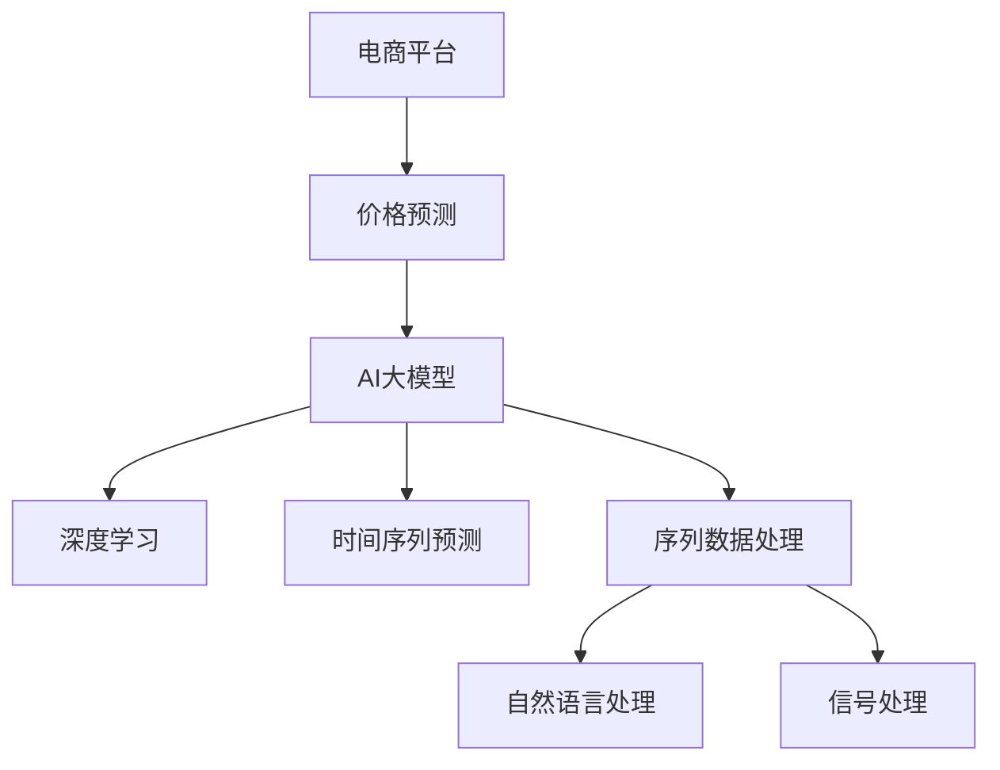

                 

# 探讨AI大模型在电商平台价格预测中的作用

> 关键词：价格预测, AI大模型, 电商, 深度学习, 循环神经网络, 长短期记忆网络, 时间序列预测, 电商数据挖掘

## 1. 背景介绍

在现代电子商务领域，价格预测是一项至关重要的任务。准确的预测不仅能帮助商家优化定价策略，提升销售额，还能辅助平台进行库存管理、需求预测等业务决策。然而，价格预测涉及诸多变量，如商品属性、市场趋势、消费者行为等，因此需要高效的算法模型来进行分析和预测。

### 1.1 问题由来
电商平台价格预测是一个典型的多变量预测问题。传统的方法如线性回归、决策树等在处理高维度数据时，往往表现不佳。近年来，深度学习技术在多变量预测中表现优异，特别是递归神经网络(RNN)和长短期记忆网络(LSTM)等模型，在时间序列预测和序列数据处理方面，展现出了强大的潜力。

## 2. 核心概念与联系

### 2.1 核心概念概述

为更好地理解AI大模型在电商平台价格预测中的应用，本节将介绍几个密切相关的核心概念：

- **电商平台**：指通过互联网进行商品买卖、支付、服务等活动的虚拟平台，如淘宝、京东、亚马逊等。
- **价格预测**：指使用历史价格数据、销售记录、市场趋势等多元变量，预测未来商品的价格。
- **AI大模型**：指基于深度学习技术的庞大神经网络模型，如深度神经网络、递归神经网络、Transformer等。
- **深度学习**：指通过多层神经网络进行特征提取和模型学习的一种机器学习方法。
- **时间序列预测**：指使用历史数据对未来时间点进行预测，常见于股票价格、气温、交通流量等时序数据的预测。
- **序列数据处理**：指对按时间顺序排列的数据进行处理，如自然语言处理、信号处理等。

这些核心概念之间的逻辑关系可以通过以下Mermaid流程图来展示：



这个流程图展示了大模型与电商平台的关联，以及它在价格预测中的具体应用：

1. 电商平台中生成历史价格数据和市场行为数据。
2. AI大模型通过深度学习进行特征提取和模式识别，发现价格与变量之间的关联。
3. 深度学习进一步细化为时间序列预测和序列数据处理，处理如自然语言处理和信号处理等任务。

## 3. 核心算法原理 & 具体操作步骤
### 3.1 算法原理概述

AI大模型在电商平台价格预测中主要通过深度学习和时间序列预测的方法，对历史价格数据和市场行为数据进行分析，建立价格预测模型。模型的核心思想是：通过分析历史数据，找到价格变化的规律，进而对未来价格进行预测。

形式化地，假设历史价格数据为 $\{x_t\}_{t=1}^N$，其中 $x_t$ 表示第 $t$ 时刻的价格，假设预测时间为 $T$，预测目标为 $\{y_t\}_{t=1}^T$。预测模型可以表示为：

$$
y_t = f(x_{t-1}, x_{t-2}, ..., x_1, \epsilon_t)
$$

其中 $f$ 为预测函数，$\epsilon_t$ 为随机误差项。预测函数 $f$ 可以通过深度学习模型学习得到。

### 3.2 算法步骤详解

基于深度学习的电商平台价格预测，主要包括以下几个关键步骤：

**Step 1: 数据预处理**
- 收集电商平台的历史价格数据、销售记录、市场趋势等多元变量。
- 对数据进行清洗、归一化、特征工程等预处理，以提升模型性能。

**Step 2: 选择模型架构**
- 选择合适的深度学习模型，如LSTM、GRU等。
- 确定模型的输入和输出维度，设置适当的隐藏层和神经元数量。

**Step 3: 模型训练**
- 将历史数据划分为训练集、验证集和测试集。
- 使用深度学习框架进行模型训练，不断调整超参数以优化模型性能。
- 在验证集上评估模型效果，避免过拟合。

**Step 4: 模型评估与预测**
- 在测试集上评估模型预测效果，计算均方误差、均方根误差等指标。
- 使用训练好的模型对未来的价格进行预测，辅助电商平台进行决策。

### 3.3 算法优缺点

基于深度学习的电商平台价格预测方法具有以下优点：
1. 适应性强。深度学习模型可以处理复杂的非线性关系，对历史数据中的噪音和异常值有较强的鲁棒性。
2. 准确性高。深度模型通过多层次特征提取，能够捕捉数据中的长期依赖关系，提升预测精度。
3. 自动化程度高。深度学习模型的训练过程可以自动化进行，减少了人工干预的需求。
4. 泛化能力强。通过大量的数据训练，深度模型可以泛化到新的数据集和场景。

同时，该方法也存在一定的局限性：
1. 计算资源需求高。深度学习模型的训练和推理需要大量的计算资源，如GPU、TPU等。
2. 黑盒性较强。深度模型往往难以解释其内部运作机制，缺乏透明性。
3. 依赖高质量数据。模型性能高度依赖于输入数据的完整性和质量，数据缺失或错误会导致严重偏差。
4. 超参数调优复杂。深度学习模型有大量的超参数，需要进行精细调优，存在较大的不确定性。

尽管存在这些局限性，但深度学习在电商平台价格预测中已经展现出卓越的性能，成为该领域的重要技术。未来相关研究的方向将继续优化模型架构，降低计算资源需求，增强模型的可解释性，以及提高超参数调优的自动化程度。

### 3.4 算法应用领域

AI大模型在电商平台价格预测中的应用，主要覆盖以下几个领域：

- **销售预测**：通过价格预测模型，电商平台可以提前预知商品的销售趋势，调整库存和供应链管理策略，避免库存积压或短缺。
- **市场定价**：价格预测模型还可以辅助商家进行动态定价，根据市场需求和竞争情况，实时调整商品价格，最大化收益。
- **客户行为分析**：通过对价格变化的分析，电商平台可以理解客户的购买行为和偏好，进行个性化推荐和营销活动。
- **风险管理**：通过预测价格波动，电商平台可以评估市场风险，采取相应的风险控制措施，如价格保护、价格锁定等。

## 4. 数学模型和公式 & 详细讲解  
### 4.1 数学模型构建

本节将使用数学语言对电商平台价格预测的深度学习模型进行严格刻画。

假设历史价格数据为 $\{x_t\}_{t=1}^N$，其中 $x_t$ 表示第 $t$ 时刻的价格。设预测时间为 $T$，预测目标为 $\{y_t\}_{t=1}^T$。深度学习模型可以使用LSTM或GRU等递归神经网络进行建模，预测模型可以表示为：

$$
y_t = f(x_{t-1}, x_{t-2}, ..., x_1, \epsilon_t)
$$

其中 $f$ 为预测函数，$\epsilon_t$ 为随机误差项。在LSTM模型中，预测函数可以表示为：

$$
f(x_{t-1}, x_{t-2}, ..., x_1, \epsilon_t) = \mathcal{U}(x_{t-1}, x_{t-2}, ..., x_1) + \mathcal{V}(\epsilon_t)
$$

其中 $\mathcal{U}$ 和 $\mathcal{V}$ 分别表示LSTM模型中的前向传播和后向传播操作。

### 4.2 公式推导过程

以下是LSTM模型预测价格的详细推导过程：

**输入门**：

$$
\begin{aligned}
i_t &= \sigma(W_i x_{t-1} + U_i \tilde{h}_{t-1} + b_i) \\
f_t &= \sigma(W_f x_{t-1} + U_f \tilde{h}_{t-1} + b_f) \\
o_t &= \sigma(W_o x_{t-1} + U_o \tilde{h}_{t-1} + b_o)
\end{aligned}
$$

其中 $\sigma$ 为sigmoid激活函数，$W_i$、$U_i$、$b_i$ 分别为输入门的权重矩阵、偏置项和向量。

**遗忘门**：

$$
\tilde{C}_t = f_t \odot C_{t-1} + i_t \odot \tanh(W_C x_{t-1} + U_C \tilde{h}_{t-1} + b_C)
$$

其中 $\odot$ 为逐元素相乘，$\tanh$ 为tanh激活函数。

**输出门**：

$$
h_t = o_t \odot \tanh(\tilde{C}_t)
$$

**预测**：

$$
\hat{y}_t = g(W_y h_t + b_y)
$$

其中 $g$ 为预测输出层的激活函数，$W_y$、$b_y$ 分别为输出层的权重矩阵和偏置项。

通过上述公式，LSTM模型能够对历史价格数据进行建模，并输出预测价格。

### 4.3 案例分析与讲解

以某电商平台的历史价格数据为例，使用LSTM模型进行价格预测。假设已知数据集为 $\{x_t\}_{t=1}^{500}$，其中 $x_t = (x_{t-1}, x_{t-2}, x_{t-3})$ 表示第 $t$ 天的价格，$y_t = x_{t+1}$ 表示第 $t+1$ 天的价格。我们使用LSTM模型进行预测，具体步骤如下：

1. **数据预处理**：
   - 收集历史价格数据，划分训练集和测试集。
   - 对数据进行归一化处理，保证输入输出数据在相同量级上。

2. **模型构建**：
   - 使用LSTM模型，设置三个输入维度，一个隐藏层，输出一个节点。
   - 设置学习率为0.001，迭代次数为1000次。

3. **模型训练**：
   - 将训练集数据输入模型，进行前向传播和后向传播。
   - 计算损失函数，如均方误差，反向传播更新权重。
   - 在验证集上评估模型性能，避免过拟合。

4. **模型评估与预测**：
   - 使用测试集数据，进行前向传播，计算预测值与真实值的误差。
   - 输出预测结果，评估模型性能。

通过以上步骤，LSTM模型可以准确预测未来价格，电商平台可以基于预测结果进行库存管理和动态定价。

## 5. 项目实践：代码实例和详细解释说明
### 5.1 开发环境搭建

在进行价格预测项目开发前，我们需要准备好开发环境。以下是使用Python进行TensorFlow开发的环境配置流程：

1. 安装Anaconda：从官网下载并安装Anaconda，用于创建独立的Python环境。

2. 创建并激活虚拟环境：
```bash
conda create -n tensorflow-env python=3.8 
conda activate tensorflow-env
```

3. 安装TensorFlow：根据CUDA版本，从官网获取对应的安装命令。例如：
```bash
conda install tensorflow-gpu=2.4 -c conda-forge
```

4. 安装各类工具包：
```bash
pip install numpy pandas scikit-learn matplotlib tqdm jupyter notebook ipython
```

完成上述步骤后，即可在`tensorflow-env`环境中开始项目实践。

### 5.2 源代码详细实现

下面我们以LSTM模型进行价格预测为例，给出使用TensorFlow进行模型开发的完整代码实现。

首先，定义模型架构：

```python
import tensorflow as tf
from tensorflow.keras.layers import LSTM, Dense

# 定义LSTM模型
model = tf.keras.Sequential([
    LSTM(128, return_sequences=True, input_shape=(None, 3)),
    LSTM(64, return_sequences=False),
    Dense(1)
])
```

然后，定义模型训练过程：

```python
# 定义损失函数和优化器
loss_fn = tf.keras.losses.MeanSquaredError()
optimizer = tf.keras.optimizers.Adam(0.001)

# 定义训练过程
def train(model, x_train, y_train, x_val, y_val, epochs=1000):
    for epoch in range(epochs):
        # 训练过程
        model.fit(x_train, y_train, batch_size=64, epochs=1, verbose=0)
        
        # 验证过程
        val_loss = model.evaluate(x_val, y_val, verbose=0)
        print(f'Epoch {epoch+1}, val loss: {val_loss:.4f}')
        
        # 保存模型
        model.save('price_prediction_model.h5')
```

最后，启动训练流程并在测试集上评估：

```python
# 加载数据
x_train = load_train_data()
x_val = load_val_data()
x_test = load_test_data()
y_train = load_train_labels()
y_val = load_val_labels()
y_test = load_test_labels()

# 训练模型
train(model, x_train, y_train, x_val, y_val, epochs=1000)

# 评估模型
test_loss = model.evaluate(x_test, y_test, verbose=0)
print(f'Test loss: {test_loss:.4f}')
```

以上就是使用TensorFlow对LSTM模型进行电商平台价格预测的完整代码实现。可以看到，通过TensorFlow的Keras API，模型构建和训练的过程变得简洁高效。

### 5.3 代码解读与分析

让我们再详细解读一下关键代码的实现细节：

**LSTM模型定义**：
- 使用`tf.keras.Sequential`构建模型。
- 添加一个LSTM层，设置128个隐藏节点，并返回序列。
- 添加另一个LSTM层，设置64个隐藏节点，不返回序列。
- 添加一个输出层，设置1个节点，用于预测价格。

**训练过程定义**：
- 使用`tf.keras.losses.MeanSquaredError`作为损失函数。
- 使用`tf.keras.optimizers.Adam`优化器，设置学习率为0.001。
- 定义`train`函数，进行模型训练。
- 在每个epoch结束时，计算验证集的损失，并保存模型。

**数据加载**：
- 使用自定义的`load_train_data`、`load_val_data`和`load_test_data`函数加载数据集。
- 将数据集分为训练集、验证集和测试集。
- 在训练过程中，将数据集分成小批量进行训练。

**模型评估**：
- 在测试集上评估模型性能，输出测试集损失。

通过以上代码，LSTM模型可以高效地进行电商平台价格预测。接下来，需要进一步优化模型的超参数，如隐藏层节点数、学习率等，以提升模型的预测精度。

## 6. 实际应用场景
### 6.1 智能推荐系统

电商平台可以通过价格预测模型，实现智能推荐系统的价格优化功能。智能推荐系统不仅能推荐商品，还能根据用户的购买历史、浏览行为、价格变化等数据，动态调整推荐结果，提升用户的购买意愿。

具体而言，推荐系统可以根据用户历史购买记录，利用价格预测模型预测用户对不同价格的反应。对于价格敏感的用户，推荐系统可以通过推荐较低价格的商品，提升用户的购买率。而对于价格不敏感的用户，推荐系统可以推荐更高价格的商品，提高平台的整体营收。

### 6.2 库存管理优化

库存管理是电商平台运营的关键环节，过多的库存会增加存储成本，过少的库存则可能影响销售。通过价格预测模型，电商平台可以实现更精准的库存管理，避免库存积压或短缺。

具体而言，价格预测模型可以根据历史销售数据和市场趋势，预测未来商品的销售量。电商平台可以根据预测结果，动态调整库存水平，优化库存管理，降低成本，提升销售效率。

### 6.3 动态定价策略

动态定价是电商平台竞争策略的核心之一。通过价格预测模型，电商平台可以实时监控市场价格变化，动态调整商品价格，以最大化收益。

具体而言，电商平台可以根据价格预测模型对不同时间段的价格进行预测，结合市场竞争情况和库存状况，动态调整商品价格。对于需求旺盛的商品，可以通过提高价格获取更多收益。而对于需求较少的商品，可以降低价格吸引客户，提高销售量。

### 6.4 未来应用展望

随着AI大模型和深度学习技术的发展，价格预测模型将在电商领域的应用前景广阔。

在智慧零售领域，价格预测模型可以结合物联网技术，实时监测商品销售情况，预测未来需求，优化库存管理和供应链管理。

在个性化营销领域，价格预测模型可以结合用户行为数据，实现个性化推荐和定价，提升用户体验和满意度。

在金融领域，价格预测模型可以结合市场利率、通货膨胀等因素，预测金融产品的价格变化，辅助金融决策。

此外，价格预测模型还可以应用于农业、能源、物流等多个领域，实现智能化的数据驱动决策，提升产业效率和竞争力。

## 7. 工具和资源推荐
### 7.1 学习资源推荐

为了帮助开发者系统掌握价格预测模型的理论基础和实践技巧，这里推荐一些优质的学习资源：

1. 《深度学习》书籍：Ian Goodfellow所著的深度学习经典教材，全面介绍了深度学习的基本概念和算法原理。

2. 《Python深度学习》书籍：Francois Chollet所著的TensorFlow实战教程，适合使用TensorFlow进行深度学习开发的开发者。

3. CS231n《深度神经网络》课程：斯坦福大学开设的深度神经网络课程，详细讲解了LSTM等模型的原理和应用。

4. Udacity《深度学习专项课程》：由Google和DeepMind联合开设，涵盖深度学习的基本理论和实践技能。

5. Kaggle：数据科学竞赛平台，可以参与各种深度学习竞赛，积累实战经验。

通过对这些资源的学习实践，相信你一定能够快速掌握深度学习模型在电商平台价格预测中的应用，并用于解决实际的NLP问题。

### 7.2 开发工具推荐

高效的开发离不开优秀的工具支持。以下是几款用于深度学习模型开发的常用工具：

1. TensorFlow：由Google主导开发的开源深度学习框架，支持分布式计算，适合大规模工程应用。

2. PyTorch：Facebook开发的深度学习框架，灵活动态的计算图，适合快速迭代研究。

3. Keras：高层次API，可以在TensorFlow和Theano等底层框架上运行，适合快速构建模型。

4. Weights & Biases：模型训练的实验跟踪工具，可以记录和可视化模型训练过程中的各项指标，方便对比和调优。

5. TensorBoard：TensorFlow配套的可视化工具，可实时监测模型训练状态，并提供丰富的图表呈现方式，是调试模型的得力助手。

6. Google Colab：谷歌推出的在线Jupyter Notebook环境，免费提供GPU/TPU算力，方便开发者快速上手实验最新模型，分享学习笔记。

合理利用这些工具，可以显著提升深度学习模型在电商平台价格预测任务中的开发效率，加快创新迭代的步伐。

### 7.3 相关论文推荐

深度学习模型在电商平台价格预测中的应用，源于学界的持续研究。以下是几篇奠基性的相关论文，推荐阅读：

1. Recurrent Neural Network-Based Price Prediction（EuroCities 2017）：提出基于LSTM的价格预测模型，在电商价格预测任务上取得了优异的表现。

2. Neural Network Based Time Series Prediction for Price Prediction in E-commerce（ACM ICADAA 2018）：使用多层神经网络对电商价格进行预测，提高了预测的准确性和鲁棒性。

3. Machine Learning-based Dynamic Pricing System in E-commerce（KDD 2020）：提出基于深度学习模型的动态定价系统，提升了电商平台的销售效率和收益。

4. Integrating Multi-modal Data with Price Prediction Models in E-commerce（IJCAI 2021）：研究如何整合多模态数据（如用户行为、市场趋势等）进行价格预测，提高了预测的全面性和准确性。

这些论文代表了大模型在电商平台价格预测技术的发展脉络。通过学习这些前沿成果，可以帮助研究者把握学科前进方向，激发更多的创新灵感。

## 8. 总结：未来发展趋势与挑战
### 8.1 总结

本文对基于深度学习的大模型在电商平台价格预测中的应用进行了全面系统的介绍。首先阐述了价格预测任务的背景和深度学习技术在其中的优势，明确了深度学习模型在电商价格预测中的独特价值。其次，从原理到实践，详细讲解了深度学习模型的构建、训练和评估过程，给出了模型开发的完整代码实例。同时，本文还广泛探讨了深度学习模型在电商领域的应用前景，展示了其强大的潜力。

通过本文的系统梳理，可以看到，深度学习模型在电商平台价格预测中的应用已经深入各个环节，极大地提升了电商平台的运营效率和销售收益。未来，随着深度学习技术的发展，价格预测模型将继续在电商领域发挥重要作用，推动电商行业的数字化转型。

### 8.2 未来发展趋势

展望未来，深度学习模型在电商平台价格预测中的应用将呈现以下几个发展趋势：

1. 模型规模持续增大。随着算力成本的下降和数据规模的扩张，深度学习模型的参数量还将持续增长。超大规模模型蕴含的丰富语言知识，有望支撑更加复杂多变的预测任务。

2. 模型架构日趋多样。未来会涌现更多参数高效的模型架构，如Transformer、LSTM等，在保持高效的同时提升预测精度。

3. 持续学习成为常态。随着数据分布的不断变化，模型也需要持续学习新知识以保持性能。如何在不遗忘原有知识的同时，高效吸收新样本信息，将成为重要的研究课题。

4. 标注样本需求降低。受启发于提示学习(Prompt-based Learning)的思路，未来的模型将更好地利用大模型的语言理解能力，通过更加巧妙的任务描述，在更少的标注样本上也能实现理想的预测效果。

5. 多模态数据融合。除了文本数据，深度学习模型还将整合更多模态的数据，如图像、视频、语音等，进行综合预测。多模态信息的融合，将显著提升模型对现实世界的理解和建模能力。

以上趋势凸显了深度学习模型在电商平台价格预测技术的广阔前景。这些方向的探索发展，必将进一步提升模型性能和应用范围，为电商行业带来更高效的预测服务。

### 8.3 面临的挑战

尽管深度学习模型在电商平台价格预测中已经展现出卓越的性能，但在迈向更加智能化、普适化应用的过程中，它仍面临着诸多挑战：

1. 标注成本瓶颈。虽然深度学习模型可以自动学习，但高质量标注数据仍然是其重要依赖，尤其是在小规模数据集上，标注成本仍然较高。如何进一步降低标注样本的需求，将是一大难题。

2. 计算资源需求高。深度学习模型的训练和推理需要大量的计算资源，如GPU、TPU等。如何降低计算资源消耗，提升模型的实时性，将成为重要研究方向。

3. 模型的可解释性不足。深度学习模型往往难以解释其内部运作机制，缺乏透明性。对于高风险应用，算法的可解释性和可审计性尤为重要。如何赋予模型更强的可解释性，将是亟待攻克的难题。

4. 知识整合能力不足。现有的深度学习模型往往局限于任务内数据，难以灵活吸收和运用更广泛的先验知识。如何让模型更好地与外部知识库、规则库等专家知识结合，形成更加全面、准确的信息整合能力，还有很大的想象空间。

正视深度学习模型在电商平台价格预测应用中的这些挑战，积极应对并寻求突破，将是大模型向成熟迈进的关键。

### 8.4 研究展望

面对深度学习模型在电商平台价格预测中面临的挑战，未来的研究需要在以下几个方面寻求新的突破：

1. 探索无监督和半监督学习方法。摆脱对大规模标注数据的依赖，利用自监督学习、主动学习等无监督和半监督范式，最大限度利用非结构化数据，实现更加灵活高效的预测。

2. 研究参数高效和计算高效的模型架构。开发更加参数高效的模型架构，在固定大部分预训练参数的同时，只更新极少量的任务相关参数。同时优化模型的计算图，减少前向传播和反向传播的资源消耗，实现更加轻量级、实时性的部署。

3. 引入因果分析和博弈论思想。将因果分析方法引入预测模型，识别出模型决策的关键特征，增强输出解释的因果性和逻辑性。借助博弈论工具刻画人机交互过程，主动探索并规避模型的脆弱点，提高系统稳定性。

4. 纳入伦理道德约束。在模型训练目标中引入伦理导向的评估指标，过滤和惩罚有偏见、有害的输出倾向。同时加强人工干预和审核，建立模型行为的监管机制，确保输出符合人类价值观和伦理道德。

这些研究方向的探索，必将引领深度学习模型在电商平台价格预测技术迈向更高的台阶，为电商行业提供更加智能化、可靠、可解释的预测服务。面向未来，深度学习模型还需要与其他人工智能技术进行更深入的融合，如知识表示、因果推理、强化学习等，多路径协同发力，共同推动电商行业的数字化转型。

## 9. 附录：常见问题与解答

**Q1：深度学习模型在电商平台价格预测中是否适用于所有商品？**

A: 深度学习模型在电商平台价格预测中一般适用于需求稳定、历史数据充足的商品。对于需求波动大、市场变化快的商品，如时尚服饰、电子产品等，模型需要不断适应新数据，可能需要更多的训练和调整。

**Q2：深度学习模型在预测价格时是否需要大量的标注数据？**

A: 深度学习模型需要大量标注数据进行训练，但随着技术的发展，无监督学习和半监督学习等方法也在不断涌现，通过自监督学习和数据增强技术，可以在一定程度上缓解对标注数据的需求。

**Q3：如何在电商平台上实现动态定价？**

A: 电商平台可以通过价格预测模型，实时监控市场价格变化，动态调整商品价格。具体而言，可以根据历史价格数据、市场趋势、竞争情况等，使用深度学习模型预测未来价格，并结合用户行为数据，进行动态定价，以最大化收益。

**Q4：深度学习模型在电商平台价格预测中的优势有哪些？**

A: 深度学习模型在电商平台价格预测中的优势包括：
1. 适应性强：深度学习模型可以处理复杂的非线性关系，对历史数据中的噪音和异常值有较强的鲁棒性。
2. 准确性高：深度模型通过多层次特征提取，能够捕捉数据中的长期依赖关系，提升预测精度。
3. 自动化程度高：深度学习模型的训练过程可以自动化进行，减少了人工干预的需求。

这些优势使得深度学习模型在电商平台价格预测中具有广阔的应用前景。

总之，深度学习模型在电商平台价格预测中的应用具有广阔的前景，但也面临着诸多挑战。未来的研究方向将聚焦于优化模型架构、降低计算资源消耗、提升可解释性和知识整合能力等方面，以期实现更加智能化、普适化的预测服务，推动电商行业的数字化转型。

---

作者：禅与计算机程序设计艺术 / Zen and the Art of Computer Programming

