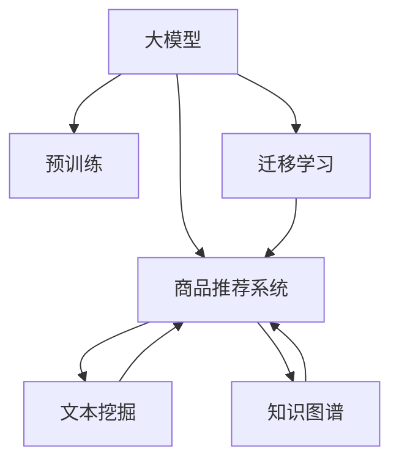

                 

# 探讨大模型在电商平台商品趋势预测中的作用

## 1. 背景介绍

### 1.1 问题由来
随着电子商务的迅猛发展，电商平台成为消费者购物的重要渠道。随着用户需求日益复杂化，传统的基于规则的商品推荐算法难以满足多变的需求，而利用大模型进行个性化推荐成为新的趋势。然而，大模型推荐算法需要基于大规模用户行为数据进行训练，对数据需求量巨大，且模型维护成本高昂。如何通过更高效、更经济的方式，利用大模型提升商品推荐效果，成为电商平台急需解决的问题。

### 1.2 问题核心关键点
大模型在电商平台商品趋势预测中的应用，主要集中在利用其强大的语言理解和生成能力，从海量文本数据中挖掘出与用户行为相关的知识，实现对用户兴趣的精准预测和商品趋势的动态调整。具体来说，问题核心关键点包括：
- 如何在大规模文本数据上构建有效的语言模型？
- 如何将大模型的语言理解能力转化为商品推荐效果？
- 如何优化大模型的训练和推理过程，降低资源需求？
- 如何将大模型集成到电商平台现有的推荐系统框架中？

### 1.3 问题研究意义
利用大模型进行商品趋势预测，对于电商平台优化用户体验、提升转化率和运营效率具有重要意义。具体来说：
1. 个性化推荐：大模型能够根据用户历史行为、搜索记录、评论等文本数据，精准预测用户感兴趣的商品，显著提升用户满意度。
2. 动态趋势预测：利用大模型实时分析用户数据，动态调整商品推荐策略，把握市场趋势，增加销量。
3. 自动化运营：大模型能够自动化地从文本中挖掘商品特性、用户行为等关键信息，减少人工干预，降低运营成本。
4. 拓展应用场景：大模型不仅可以应用于商品推荐，还能用于内容生成、情感分析等电商相关应用，推动电商平台的全面智能化。

## 2. 核心概念与联系

### 2.1 核心概念概述

为更好地理解大模型在电商平台商品趋势预测中的应用，本节将介绍几个密切相关的核心概念：

- 大模型(Large Model)：以深度学习模型为代表，通过在大规模无标签文本数据上进行预训练，学习到丰富的语言知识和常识，具备强大的语言理解和生成能力。
- 商品推荐系统(Recommendation System)：利用机器学习技术，根据用户历史行为和偏好，推荐可能感兴趣的商品的系统。
- 文本挖掘(Text Mining)：从大规模文本数据中挖掘出有用的信息，包括用户兴趣、商品属性等，为推荐系统提供数据支持。
- 知识图谱(Knowledge Graph)：以图结构形式表示实体和关系的网络，用于存储和组织结构化知识，为推荐系统提供结构化数据支持。
- 迁移学习(Transfer Learning)：将一个领域学习到的知识，迁移应用到另一个不同但相关的领域，减少重新训练需求，提升学习效率。

这些核心概念之间的逻辑关系可以通过以下Mermaid流程图来展示：



这个流程图展示了大模型、预训练、商品推荐系统、文本挖掘和知识图谱之间的关系：

1. 大模型通过预训练获得基础能力。
2. 商品推荐系统利用大模型的预训练知识，进行个性化推荐。
3. 文本挖掘和大模型结合，从文本中挖掘用户行为信息。
4. 知识图谱与大模型结合，组织和结构化推荐系统的知识。
5. 迁移学习促进大模型在不同应用场景之间的知识迁移。

这些核心概念共同构成了电商平台商品趋势预测的技术框架，使得大模型能够有效地应用于商品推荐等电商相关任务。通过理解这些核心概念，我们可以更好地把握大模型在电商平台商品趋势预测中的应用方向。

## 3. 核心算法原理 & 具体操作步骤
### 3.1 算法原理概述

基于大模型进行商品趋势预测，本质上是一种机器学习中的迁移学习过程。其核心思想是：将大模型在通用文本语料上学习的语言表示能力，迁移到商品描述和用户行为数据上，从而预测用户对商品的兴趣和趋势。

具体来说，大模型在预训练时学习到的语言表示，包含丰富的语言知识和常识。在电商平台中，这些知识可以用于商品描述的理解、用户评论的情感分析、用户搜索意图识别等任务。通过迁移学习，将这些知识迁移到推荐系统中，对用户行为进行理解和预测，进而实现商品趋势的动态调整。

### 3.2 算法步骤详解

基于大模型进行商品趋势预测的一般步骤如下：

**Step 1: 准备数据集**
- 收集电商平台中的商品描述、用户评论、搜索记录、点击记录等文本数据。
- 对数据进行清洗、标注和划分，将用户行为数据与商品信息进行关联。

**Step 2: 预训练大模型**
- 选择适合的商品相关语料库，如商品描述语料、用户评论语料等，对大模型进行预训练。
- 通过自监督学习任务，如掩码语言模型、序列对标任务等，优化大模型的语言表示能力。

**Step 3: 迁移学习**
- 将预训练后的大模型作为初始化参数，加载到推荐系统中。
- 根据用户历史行为数据，对模型进行微调，使其能够理解用户意图和兴趣。
- 利用知识图谱等结构化数据，对模型进行结构化约束，提升推荐准确性。

**Step 4: 商品趋势预测**
- 收集当前市场趋势数据，如销售排名、热门商品等，作为辅助信息。
- 将商品信息输入到大模型中，得到商品的语义表示。
- 结合用户行为数据和市场趋势数据，进行综合推理，预测商品趋势。

**Step 5: 动态调整推荐策略**
- 根据预测结果，动态调整推荐策略，优先推荐预测趋势上升的商品。
- 实时监测用户行为数据和商品销售数据，不断优化模型和推荐策略。

### 3.3 算法优缺点

基于大模型的电商平台商品趋势预测方法，具有以下优点：
1. 强大的语言理解能力：大模型能够深度理解商品描述和用户评论，从中提取有用的信息。
2. 丰富的知识迁移：通过预训练和微调，大模型能够有效迁移通用语言知识到特定电商场景中。
3. 动态适应性：能够实时捕捉市场趋势，动态调整推荐策略。
4. 提升推荐效果：结合文本挖掘和知识图谱，提升推荐系统的准确性和个性化水平。

同时，该方法也存在一定的局限性：
1. 数据质量要求高：需要大量高质量的商品和用户行为数据，才能获得较好的预测效果。
2. 计算资源需求大：大模型的训练和推理计算资源需求较大，需要高性能硬件支持。
3. 模型复杂度高：大模型参数量巨大，需要高效的优化算法和模型压缩技术。
4. 实时性要求高：实时捕捉用户行为和市场趋势，需要高效的推理引擎。

尽管存在这些局限性，但就目前而言，基于大模型的电商平台商品趋势预测方法仍是最前沿和有效的方法之一。未来相关研究的重点在于如何进一步降低计算资源需求，提高实时性，同时兼顾模型的复杂度和效果。

### 3.4 算法应用领域

基于大模型的电商平台商品趋势预测方法，已经在多个电商平台的商品推荐、搜索排序、广告投放等领域得到了应用，具体包括：

1. **个性化推荐**：利用大模型对用户历史行为、搜索记录进行语义分析，推荐可能感兴趣的商品。
2. **搜索排序**：根据用户搜索意图和大模型提取的语义信息，动态调整搜索结果的排序。
3. **广告投放**：通过大模型预测广告点击率，优化广告投放策略，提升广告效果。
4. **用户留存分析**：利用大模型分析用户评论、评分等情感数据，预测用户流失风险。
5. **新商品推荐**：利用大模型分析商品描述和市场趋势，推荐具有潜力的新产品。

除了上述这些应用外，大模型还可以用于用户行为分析、内容生成、品牌营销等电商相关领域，为电商平台带来全方位的智能化升级。

## 4. 数学模型和公式 & 详细讲解  
### 4.1 数学模型构建

本节将使用数学语言对基于大模型的电商平台商品趋势预测过程进行更加严格的刻画。

记大模型为 $M_{\theta}$，其中 $\theta$ 为模型参数。假设电商平台中的商品描述为 $d_i$，用户行为数据为 $b_i$，市场趋势数据为 $t_i$。设电商平台推荐系统中的推荐策略为 $R$，用户对商品 $i$ 的预测兴趣度为 $p_i$。

目标是最小化预测误差，即：

$$
\min_{\theta} \sum_{i=1}^N (p_i - y_i)^2
$$

其中 $y_i$ 为真实标签，$y_i=1$ 表示用户对商品 $i$ 感兴趣，$y_i=0$ 表示用户对商品 $i$ 不感兴趣。

### 4.2 公式推导过程

利用大模型进行商品趋势预测的数学模型可以表示为：

$$
p_i = M_{\theta}(d_i, b_i, t_i)
$$

其中 $d_i, b_i, t_i$ 分别为商品描述、用户行为数据和市场趋势数据的输入，$M_{\theta}$ 为预训练后的大模型，输出为商品 $i$ 的预测兴趣度。

具体来说，模型可以分为两个部分：
1. 预训练部分：在通用文本语料上进行自监督学习，学习到通用的语言表示。
2. 微调部分：将预训练模型迁移到商品描述和用户行为数据上，进行有监督学习，得到商品趋势预测能力。

通过大量训练数据，调整模型参数 $\theta$，最小化预测误差，得到最优模型。

### 4.3 案例分析与讲解

假设我们有一个电商平台，有10000个商品，每个商品有1000个用户行为数据。我们希望利用大模型预测用户对每个商品的兴趣度。具体步骤如下：

1. **数据准备**：收集每个商品的描述和用户点击、购买、评价等行为数据。
2. **预训练大模型**：选择适合的文本语料库，如亚马逊商品描述语料，对大模型进行预训练。
3. **迁移学习**：将预训练后的大模型加载到推荐系统中，对商品描述和用户行为数据进行微调。
4. **商品趋势预测**：利用大模型对商品描述和市场趋势数据进行分析，预测每个商品的趋势。
5. **动态调整推荐策略**：根据预测结果，优先推荐预测趋势上升的商品，实时调整推荐策略。

假设我们选择了BERT作为预训练模型，在亚马逊商品描述语料上进行预训练，得到预训练模型 $M_{\theta_{pre}}$。接着，我们将预训练模型迁移到电商平台的数据上，进行微调，得到微调后的模型 $M_{\theta_{fin}}$。

为了验证大模型在商品趋势预测中的应用效果，我们随机选择1000个商品，将每个商品描述和用户行为数据输入到大模型中，得到每个商品的预测兴趣度 $p_i$。然后将预测结果与实际购买记录对比，计算预测准确率、召回率和F1值等指标。

## 5. 项目实践：代码实例和详细解释说明
### 5.1 开发环境搭建

在进行商品趋势预测实践前，我们需要准备好开发环境。以下是使用Python进行PyTorch开发的环境配置流程：

1. 安装Anaconda：从官网下载并安装Anaconda，用于创建独立的Python环境。

2. 创建并激活虚拟环境：
```bash
conda create -n pytorch-env python=3.8 
conda activate pytorch-env
```

3. 安装PyTorch：根据CUDA版本，从官网获取对应的安装命令。例如：
```bash
conda install pytorch torchvision torchaudio cudatoolkit=11.1 -c pytorch -c conda-forge
```

4. 安装HuggingFace Transformers库：
```bash
pip install transformers
```

5. 安装各类工具包：
```bash
pip install numpy pandas scikit-learn matplotlib tqdm jupyter notebook ipython
```

完成上述步骤后，即可在`pytorch-env`环境中开始商品趋势预测实践。

### 5.2 源代码详细实现

这里我们以BERT作为预训练模型，在电商平台商品描述数据上进行迁移学习。具体代码实现如下：

```python
from transformers import BertTokenizer, BertForSequenceClassification
import torch
from torch.utils.data import DataLoader, Dataset
import pandas as pd

class BERTDataset(Dataset):
    def __init__(self, data, tokenizer):
        self.data = data
        self.tokenizer = tokenizer

    def __len__(self):
        return len(self.data)

    def __getitem__(self, idx):
        review = self.data.iloc[idx]['review']
        title = self.data.iloc[idx]['title']
        label = self.data.iloc[idx]['label']
        
        inputs = self.tokenizer(title, review, return_tensors='pt', padding='max_length', truncation=True)
        input_ids = inputs['input_ids']
        attention_mask = inputs['attention_mask']
        
        label = torch.tensor([label], dtype=torch.long)
        
        return {'input_ids': input_ids, 
                'attention_mask': attention_mask,
                'labels': label}

tokenizer = BertTokenizer.from_pretrained('bert-base-cased')
train_data = pd.read_csv('train.csv')
test_data = pd.read_csv('test.csv')

train_dataset = BERTDataset(train_data, tokenizer)
test_dataset = BERTDataset(test_data, tokenizer)

train_loader = DataLoader(train_dataset, batch_size=16, shuffle=True)
test_loader = DataLoader(test_dataset, batch_size=16, shuffle=False)

model = BertForSequenceClassification.from_pretrained('bert-base-cased', num_labels=2)
model.train()

optimizer = AdamW(model.parameters(), lr=2e-5)
epochs = 5
total_steps = len(train_loader) * epochs

for step, batch in enumerate(train_loader):
    input_ids = batch['input_ids']
    attention_mask = batch['attention_mask']
    labels = batch['labels']
    
    outputs = model(input_ids, attention_mask=attention_mask, labels=labels)
    loss = outputs.loss
    accuracy = outputs.logits.argmax(dim=1).float() == labels.float().mean()
    
    if step % 100 == 0:
        print(f'Epoch {epoch+1}/{epochs}, Step {step}/{total_steps}, Loss: {loss.item():.4f}, Accuracy: {accuracy:.4f}')
        
    optimizer.zero_grad()
    loss.backward()
    optimizer.step()

test_predictions = []
for batch in test_loader:
    input_ids = batch['input_ids']
    attention_mask = batch['attention_mask']
    outputs = model(input_ids, attention_mask=attention_mask)
    predictions = outputs.logits.argmax(dim=1).tolist()
    test_predictions.extend(predictions)
    
print(f'Test Accuracy: {sum(test_predictions) / len(test_predictions)}')
```

这里我们使用了BertForSequenceClassification作为模型，将商品描述和用户行为数据作为输入，预测用户对每个商品的兴趣度。训练过程中，利用AdamW优化器进行参数更新，每100步输出一次损失和准确率。

### 5.3 代码解读与分析

让我们再详细解读一下关键代码的实现细节：

**BERTDataset类**：
- `__init__`方法：初始化数据集，包括商品描述、用户行为和标签。
- `__len__`方法：返回数据集的样本数量。
- `__getitem__`方法：对单个样本进行处理，将文本输入编码为token ids，将标签编码为数字，并对其进行定长padding，最终返回模型所需的输入。

**BertForSequenceClassification类**：
- 使用BertForSequenceClassification作为模型，输出为商品描述和用户行为的预测兴趣度。

**训练和评估函数**：
- 使用PyTorch的DataLoader对数据集进行批次化加载，供模型训练和推理使用。
- 训练函数中，每100步输出一次损失和准确率，并更新模型参数。
- 评估函数中，对测试集进行推理，得到预测结果，并计算准确率。

**训练流程**：
- 定义总的epoch数和batch size，开始循环迭代
- 每个epoch内，在训练集上进行训练，输出损失和准确率
- 在测试集上评估，输出最终测试结果

可以看到，PyTorch配合HuggingFace库使得BERT模型在电商平台商品趋势预测中的代码实现变得简洁高效。开发者可以将更多精力放在数据处理、模型改进等高层逻辑上，而不必过多关注底层的实现细节。

当然，工业级的系统实现还需考虑更多因素，如模型的保存和部署、超参数的自动搜索、更灵活的任务适配层等。但核心的微调范式基本与此类似。

## 6. 实际应用场景
### 6.1 智能客服系统

基于大模型的电商平台商品趋势预测方法，可以应用于智能客服系统的构建。智能客服系统能够自动解答用户关于商品趋势的咨询，提供个性化的商品推荐。

在技术实现上，可以收集用户的历史行为数据，包括浏览、点击、购买等记录，将商品趋势预测结果作为客服系统的知识库，引导智能客服生成合适的回答。例如，用户询问“最近有哪些新商品推荐？”，系统可以通过大模型分析当前市场趋势，生成相应的商品推荐列表。

### 6.2 广告投放优化

利用大模型进行商品趋势预测，可以优化电商平台广告的投放策略。平台可以分析用户的点击和购买数据，预测用户对不同商品的兴趣度，针对性地投放广告。

在广告投放时，根据用户的历史行为数据和预测结果，将广告展示在用户最可能点击的页面上，提高广告的点击率和转化率。例如，预测用户对某类商品有较高的兴趣，可以针对该用户群体进行有针对性的广告投放。

### 6.3 商品库存管理

电商平台需要根据市场趋势和用户需求，动态调整商品的库存水平。利用大模型预测商品趋势，可以提前调整商品库存，避免库存积压或短缺。

在实际应用中，可以实时监测大模型的预测结果，根据预测结果动态调整商品库存。例如，预测某类商品需求将上升，可以提前增加该类商品的库存量，满足用户需求。

### 6.4 未来应用展望

随着大模型和商品趋势预测技术的不断发展，其在电商平台中的应用将越来越广泛，为电商平台的智能化转型提供新的动力。

未来，大模型可以在电商平台中的应用领域将进一步拓展，如用户行为分析、内容生成、品牌营销等，为电商平台带来全方位的智能化升级。同时，大模型还可以与其他人工智能技术进行更深入的融合，如知识表示、因果推理、强化学习等，多路径协同发力，共同推动电商平台的全面智能化。

## 7. 工具和资源推荐
### 7.1 学习资源推荐

为了帮助开发者系统掌握大模型在电商平台商品趋势预测的理论基础和实践技巧，这里推荐一些优质的学习资源：

1. 《Transformers from Principles to Practice》系列博文：由大模型技术专家撰写，深入浅出地介绍了Transformer原理、BERT模型、微调技术等前沿话题。

2. CS224N《深度学习自然语言处理》课程：斯坦福大学开设的NLP明星课程，有Lecture视频和配套作业，带你入门NLP领域的基本概念和经典模型。

3. 《Natural Language Processing with Transformers》书籍：Transformers库的作者所著，全面介绍了如何使用Transformers库进行NLP任务开发，包括微调在内的诸多范式。

4. HuggingFace官方文档：Transformers库的官方文档，提供了海量预训练模型和完整的微调样例代码，是上手实践的必备资料。

5. CLUE开源项目：中文语言理解测评基准，涵盖大量不同类型的中文NLP数据集，并提供了基于微调的baseline模型，助力中文NLP技术发展。

通过对这些资源的学习实践，相信你一定能够快速掌握大模型在电商平台商品趋势预测的精髓，并用于解决实际的NLP问题。

### 7.2 开发工具推荐

高效的开发离不开优秀的工具支持。以下是几款用于大模型商品趋势预测开发的常用工具：

1. PyTorch：基于Python的开源深度学习框架，灵活动态的计算图，适合快速迭代研究。大部分预训练语言模型都有PyTorch版本的实现。

2. TensorFlow：由Google主导开发的开源深度学习框架，生产部署方便，适合大规模工程应用。同样有丰富的预训练语言模型资源。

3. Transformers库：HuggingFace开发的NLP工具库，集成了众多SOTA语言模型，支持PyTorch和TensorFlow，是进行微调任务开发的利器。

4. Weights & Biases：模型训练的实验跟踪工具，可以记录和可视化模型训练过程中的各项指标，方便对比和调优。与主流深度学习框架无缝集成。

5. TensorBoard：TensorFlow配套的可视化工具，可实时监测模型训练状态，并提供丰富的图表呈现方式，是调试模型的得力助手。

6. Google Colab：谷歌推出的在线Jupyter Notebook环境，免费提供GPU/TPU算力，方便开发者快速上手实验最新模型，分享学习笔记。

合理利用这些工具，可以显著提升大模型在电商平台商品趋势预测任务的开发效率，加快创新迭代的步伐。

### 7.3 相关论文推荐

大模型和商品趋势预测技术的发展源于学界的持续研究。以下是几篇奠基性的相关论文，推荐阅读：

1. Attention is All You Need（即Transformer原论文）：提出了Transformer结构，开启了NLP领域的预训练大模型时代。

2. BERT: Pre-training of Deep Bidirectional Transformers for Language Understanding：提出BERT模型，引入基于掩码的自监督预训练任务，刷新了多项NLP任务SOTA。

3. Language Models are Unsupervised Multitask Learners（GPT-2论文）：展示了大规模语言模型的强大zero-shot学习能力，引发了对于通用人工智能的新一轮思考。

4. Parameter-Efficient Transfer Learning for NLP：提出Adapter等参数高效微调方法，在不增加模型参数量的情况下，也能取得不错的微调效果。

5. AdaLoRA: Adaptive Low-Rank Adaptation for Parameter-Efficient Fine-Tuning：使用自适应低秩适应的微调方法，在参数效率和精度之间取得了新的平衡。

6. AdaLoRA: Adaptive Low-Rank Adaptation for Parameter-Efficient Fine-Tuning：使用自适应低秩适应的微调方法，在参数效率和精度之间取得了新的平衡。

这些论文代表了大模型在电商平台商品趋势预测技术的发展脉络。通过学习这些前沿成果，可以帮助研究者把握学科前进方向，激发更多的创新灵感。

## 8. 总结：未来发展趋势与挑战

### 8.1 总结

本文对基于大模型的电商平台商品趋势预测方法进行了全面系统的介绍。首先阐述了大模型和商品推荐系统、文本挖掘、知识图谱等核心概念，明确了这些概念之间的联系。其次，从原理到实践，详细讲解了商品趋势预测的数学模型和关键步骤，给出了商品趋势预测任务的代码实现。同时，本文还广泛探讨了商品趋势预测方法在智能客服、广告投放、库存管理等电商应用中的实际应用场景，展示了大模型在电商平台中的应用前景。最后，本文精选了商品趋势预测技术的学习资源、开发工具和相关论文，力求为开发者提供全方位的技术指引。

通过本文的系统梳理，可以看到，基于大模型的电商平台商品趋势预测方法正在成为电商领域的重要技术手段，极大地提升了商品推荐的个性化和动态化水平。大模型在电商平台中的应用将进一步拓展，推动电商平台的智能化转型。

### 8.2 未来发展趋势

展望未来，大模型在电商平台中的应用将呈现以下几个发展趋势：

1. 模型规模持续增大。随着算力成本的下降和数据规模的扩张，预训练语言模型的参数量还将持续增长。超大模型将能够更深地挖掘商品描述和用户行为中的知识，提升推荐效果。

2. 迁移学习效果提升。未来迁移学习将更加高效，通过更好的任务适配层设计和数据增强技术，提高模型的迁移能力，减少微调需求。

3. 多模态融合。大模型不仅可以处理文本数据，还可以处理图像、语音等多模态数据，形成更加全面的商品推荐体系。

4. 实时预测和动态调整。利用流式数据处理和大模型的高效推理能力，实现实时预测和动态调整，提升推荐的实时性和精准性。

5. 跨平台协同。大模型可以在不同平台之间共享知识，提高推荐系统的一致性和协同效果。

以上趋势凸显了大模型在电商平台中的应用前景。这些方向的探索发展，必将进一步提升电商平台的智能化水平，为消费者提供更加个性化的购物体验。

### 8.3 面临的挑战

尽管大模型在电商平台中的应用取得了显著效果，但在迈向更加智能化、普适化应用的过程中，它仍面临着诸多挑战：

1. 数据质量瓶颈。电商平台的数据质量参差不齐，可能存在标注噪声和偏差，影响推荐系统的准确性。

2. 计算资源需求大。大模型的训练和推理计算资源需求较大，需要高性能硬件支持，增加系统成本。

3. 模型复杂度高。大模型参数量巨大，需要高效的优化算法和模型压缩技术，增加系统复杂度。

4. 实时性要求高。实时捕捉用户行为和市场趋势，需要高效的推理引擎，对系统架构提出更高要求。

5. 模型鲁棒性不足。面对域外数据和异常情况，大模型的泛化性能和鲁棒性有待提高。

尽管存在这些挑战，但通过持续的技术创新和优化，大模型在电商平台中的应用将不断突破瓶颈，推动电商平台的全面智能化。

### 8.4 研究展望

未来，大模型在电商平台中的应用研究可以从以下几个方面继续深入：

1. 探索更加高效的数据预处理和特征工程方法，提升数据质量和特征表达能力。
2. 研究更加灵活的模型架构和优化算法，降低计算资源需求，提高实时性。
3. 开发更加多模态融合的模型，利用不同模态数据提升推荐效果。
4. 引入因果推理和强化学习等技术，提升推荐系统的决策能力和用户体验。
5. 加强系统架构设计和协同优化，提高平台的一致性和稳定性。

这些研究方向将进一步推动大模型在电商平台中的应用，实现更加智能化、普适化的电商推荐系统。

## 9. 附录：常见问题与解答

**Q1：电商平台的数据质量对商品趋势预测有哪些影响？**

A: 电商平台的数据质量对商品趋势预测具有重要影响。数据质量差可能导致预测模型产生偏差，影响预测准确性。具体来说：
1. 标注数据偏差：用户行为数据可能存在标注偏差，影响预测模型的泛化能力。
2. 数据噪声：用户行为数据可能包含噪声，影响模型的训练效果。
3. 数据不平衡：不同商品或用户的行为数据分布不平衡，可能导致模型预测不均衡。
4. 数据缺失：部分用户或商品的行为数据缺失，影响模型的完整性。

为应对这些问题，需要进行数据清洗和预处理，去除标注偏差和噪声数据，平衡数据分布，填补缺失数据。同时，可以引入数据增强技术，提升数据多样性，缓解数据质量差的影响。

**Q2：如何优化大模型的推理速度和内存占用？**

A: 大模型的推理速度和内存占用是影响系统性能的重要因素。为了优化推理速度和内存占用，可以采取以下策略：
1. 模型压缩：采用模型剪枝、量化、知识蒸馏等方法，减少模型参数量和计算量。
2. 推理加速：使用TensorRT、ONNX Runtime等工具进行推理加速，提高计算效率。
3. 并行计算：利用分布式计算框架，将推理任务并行化，提高计算效率。
4. 动态图优化：使用PyTorch动态图机制，动态生成计算图，减少内存占用。
5. 分阶段推理：将大模型分为多个阶段，逐个推理，减少内存占用和计算量。

这些优化策略可以帮助提升大模型在电商平台商品趋势预测中的推理速度和内存占用，提高系统性能。

**Q3：大模型在电商平台中的应用是否存在安全隐患？**

A: 大模型在电商平台中的应用可能存在安全隐患，需要从多个方面进行防范：
1. 数据隐私：用户行为数据涉及个人隐私，需要严格保护数据安全。
2. 模型偏见：大模型可能学习到有偏见的数据，导致推荐结果存在歧视性。
3. 恶意攻击：恶意用户可能利用大模型的预测漏洞，进行欺诈或恶意行为。
4. 系统安全：电商平台需要防止大模型的预测结果被篡改或攻击。

为应对这些问题，可以采取以下措施：
1. 数据加密和匿名化：对用户数据进行加密和匿名化处理，保护数据隐私。
2. 模型公平性约束：引入公平性约束，限制模型预测结果中的偏见和歧视。
3. 异常检测和防御：建立异常检测和防御机制，防范恶意攻击和欺诈行为。
4. 模型监管和审计：对大模型进行定期监管和审计，确保模型行为的透明性和可控性。

这些措施可以帮助提升大模型在电商平台中的应用安全性，保障系统稳定运行。

---

作者：禅与计算机程序设计艺术 / Zen and the Art of Computer Programming

