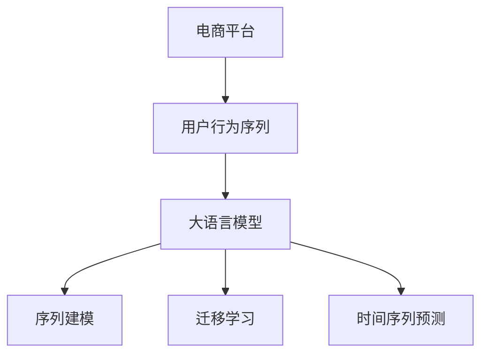

                 

# 探讨大模型在电商平台用户行为序列分析中的潜力

## 1. 背景介绍

### 1.1 问题由来
电商平台已成为现代生活不可或缺的一部分，其业务形态由单一的电商交易逐步向综合服务发展，用户体验日益成为竞争的核心。通过分析用户行为序列，电商平台可以更好地理解用户需求、提升用户粘性、优化业务流程。然而，传统的分析方法往往只能处理短时序数据，无法全面洞察用户行为的长期模式。

### 1.2 问题核心关键点
用户行为序列分析的核心在于对用户行为数据的序列化建模和分析，以预测用户未来的行为，优化电商平台的用户体验和业务策略。而大语言模型在自然语言处理领域的卓越表现，使其具备处理序列化数据的能力，适用于电商平台的长期用户行为分析。

### 1.3 问题研究意义
探索大模型在电商平台用户行为序列分析中的潜力，对于电商平台理解用户需求、优化业务流程、提升用户粘性具有重要意义。通过大模型技术，电商平台可以实现更加精准的用户行为预测、个性化的内容推荐、有效的用户召回等，从而大幅提升用户体验和平台收益。

## 2. 核心概念与联系

### 2.1 核心概念概述

为更好地理解大模型在电商平台用户行为序列分析中的应用，本节将介绍几个密切相关的核心概念：

- 电商平台：提供商品交易、信息检索、个性化推荐、在线客服等服务，涵盖商品展示、购物车、结算、客服等多个环节的综合性网站或应用。
- 用户行为序列：用户在电商平台上的浏览、点击、添加、购买等行为序列数据，反映用户的长期兴趣和行为模式。
- 大语言模型(Large Language Model, LLM)：以自回归(如GPT)或自编码(如BERT)模型为代表的大规模预训练语言模型。通过在大规模无标签文本语料上进行预训练，学习通用的语言表示，具备强大的语言理解和生成能力。
- 序列建模(Sequence Modeling)：对时间序列数据进行建模和分析，以发现时间序列中的规律和趋势。
- 迁移学习(Transfer Learning)：将一个领域学习到的知识，迁移应用到另一个不同但相关的领域的学习范式。大模型的预训练-微调过程即是一种典型的迁移学习方式。
- 时间序列预测(Time Series Forecasting)：对未来时间点的时间序列值进行预测，应用于电商平台的销售预测、库存管理等任务。

这些核心概念之间的逻辑关系可以通过以下Mermaid流程图来展示：



这个流程图展示了大语言模型在电商平台用户行为序列分析中的应用框架：

1. 电商平台收集用户行为序列数据，准备输入给大语言模型。
2. 大语言模型通过预训练获得通用的语言表示，适用于处理多模态数据。
3. 通过序列建模技术，对用户行为序列进行建模，提取其中的规律和趋势。
4. 利用迁移学习技术，将大语言模型应用于电商平台的用户行为序列分析。
5. 时间序列预测技术，对电商平台未来的用户行为进行预测，优化业务策略。

## 3. 核心算法原理 & 具体操作步骤
### 3.1 算法原理概述

电商平台用户行为序列分析，本质上是对时间序列数据进行建模和预测。而大语言模型通过自监督预训练和有监督微调，已经在大规模文本数据上学习到了丰富的语言表示，可以应用于处理序列化数据。

以用户行为序列为例，电商平台收集用户在该平台上的行为序列数据，包含点击、浏览、购买等行为。然后，将这些行为序列数据输入大语言模型，通过序列建模技术对其进行建模，从而提取其中的规律和趋势。最后，将模型应用于电商平台未来的用户行为预测，以指导平台的策略优化。

具体来说，大语言模型在用户行为序列分析中的应用分为两个阶段：预训练和微调。预训练阶段，模型在无标签文本数据上进行自监督学习，学习通用的语言表示。微调阶段，模型在电商平台的用户行为序列数据上进行有监督学习，学习电商平台特有的行为模式。

### 3.2 算法步骤详解

大语言模型在电商平台用户行为序列分析中的应用可以分为以下关键步骤：

**Step 1: 数据准备与预处理**
- 收集电商平台的原始用户行为序列数据，包含用户的点击、浏览、购买等行为。
- 对原始数据进行清洗和预处理，如去除噪声、补全缺失值、标准化等。
- 对用户行为进行序列化处理，如将点击序列转化为时间序列，以供大语言模型输入。

**Step 2: 数据编码与序列化**
- 将清洗后的用户行为序列数据转换为模型可接受的格式，如将行为序列编码成数字序列。
- 对于多模态数据，如文本、图片、音频等，需要将不同类型的数据进行统一编码，以便大语言模型进行建模。

**Step 3: 预训练模型选择**
- 选择适合电商场景的大语言模型，如GPT-3、BERT等。
- 确定模型架构和超参数，如模型大小、层数、学习率等。

**Step 4: 模型微调**
- 在电商平台的用户行为序列数据上，对预训练模型进行微调。
- 选择合适的优化算法，如AdamW、SGD等，设置学习率、批大小、迭代轮数等。
- 应用正则化技术，如L2正则、Dropout、Early Stopping等，防止模型过度适应小规模训练集。
- 利用序列建模技术，对用户行为序列进行建模，提取其中的规律和趋势。

**Step 5: 预测与优化**
- 在电商平台未来的用户行为序列上，使用微调后的模型进行预测。
- 根据预测结果，对电商平台的用户行为进行优化，如个性化推荐、内容推送等。
- 定期重新微调模型，以适应电商平台业务的变化。

### 3.3 算法优缺点

大语言模型在电商平台用户行为序列分析中的应用具有以下优点：
1. 处理能力强：大语言模型具备强大的语言表示能力，可以处理多种类型的用户行为数据。
2. 泛化能力强：通过预训练学习通用语言表示，大模型可以很好地适应不同领域的电商数据。
3. 预测准确度高：大模型可以通过序列建模技术，捕捉用户行为序列中的长期模式，提高预测准确度。

同时，该方法也存在一些局限性：
1. 标注成本高：电商平台用户行为序列数据的标注需要大量人力和时间成本。
2. 模型复杂度高：大模型的参数量较大，推理和训练成本较高。
3. 模型解释性差：大语言模型的内部机制难以解释，难以理解模型的决策过程。
4. 数据分布易变：电商平台的业务场景变化较快，需要频繁微调模型以适应新数据。

尽管存在这些局限性，但就目前而言，大语言模型在电商平台用户行为序列分析中的应用仍是最先进和有效的技术手段。未来相关研究的重点在于如何降低标注成本，提高模型的可解释性，以及解决数据分布易变问题。

### 3.4 算法应用领域

大语言模型在电商平台用户行为序列分析中的应用领域广泛，主要包括以下几个方面：

- 个性化推荐：通过分析用户行为序列，预测用户未来的购买意向，实现个性化推荐。
- 用户流失预测：利用用户行为序列数据，预测用户的流失概率，提前进行干预。
- 库存管理：预测用户未来的购买行为，优化库存管理和补货策略。
- 广告投放：分析用户行为序列，优化广告投放策略，提高广告效果。
- 客户服务：分析用户行为序列，提供个性化客服，提升用户满意度。

## 4. 数学模型和公式 & 详细讲解  
### 4.1 数学模型构建

以电商平台个性化推荐任务为例，我们假设用户行为序列为 $X=(x_1, x_2, ..., x_t, ..., x_T)$，其中 $x_t$ 表示用户在第 $t$ 个时间点的行为，$T$ 为序列长度。目标是为每个用户生成一个推荐列表 $Y=(y_1, y_2, ..., y_t, ..., y_T)$，其中 $y_t$ 表示在 $x_t$ 时刻为用户推荐的商品。

我们将问题转化为序列预测问题，使用大语言模型进行建模。定义 $X$ 到 $Y$ 的映射函数为 $f(X)$，目标为最大化预测准确度，即：

$$
\max_{f} \mathcal{L}(f)
$$

其中 $\mathcal{L}$ 为损失函数，通常使用交叉熵损失：

$$
\mathcal{L}(f) = -\frac{1}{N}\sum_{i=1}^N \sum_{t=1}^{T} \ell(y_t, f(x_t))
$$

其中 $y_t$ 为真实推荐列表，$f(x_t)$ 为模型预测的推荐列表，$\ell$ 为损失函数。

### 4.2 公式推导过程

以下我们将以电商平台的个性化推荐任务为例，推导大语言模型的推荐公式。

假设大语言模型为 $M_{\theta}$，其中 $\theta$ 为模型参数。我们使用序列建模技术，将用户行为序列 $X$ 输入模型 $M_{\theta}$，得到预测的推荐列表 $Y$。模型的输出可以表示为：

$$
Y = M_{\theta}(X)
$$

其中 $M_{\theta}$ 为一个序列化模型，可以采用自回归模型或自编码模型。以自回归模型为例，模型输出为：

$$
y_t = M_{\theta}(x_t | x_{t-1}, x_{t-2}, ..., x_1)
$$

在微调过程中，我们需要最小化损失函数 $\mathcal{L}$，即：

$$
\theta^* = \mathop{\arg\min}_{\theta} \mathcal{L}(M_{\theta})
$$

通常使用基于梯度的优化算法，如AdamW、SGD等，来近似求解上述最优化问题。设 $\eta$ 为学习率，$\lambda$ 为正则化系数，则参数的更新公式为：

$$
\theta \leftarrow \theta - \eta \nabla_{\theta}\mathcal{L}(\theta) - \eta\lambda\theta
$$

其中 $\nabla_{\theta}\mathcal{L}(\theta)$ 为损失函数对参数 $\theta$ 的梯度，可通过反向传播算法高效计算。

在得到损失函数的梯度后，即可带入参数更新公式，完成模型的迭代优化。重复上述过程直至收敛，最终得到适应电商平台个性化推荐任务的最优模型参数 $\theta^*$。

### 4.3 案例分析与讲解

以电商平台个性化推荐任务为例，我们可以使用大语言模型来建模用户行为序列 $X$，预测推荐列表 $Y$。具体步骤如下：

1. 收集电商平台的原始用户行为序列数据，包含用户的点击、浏览、购买等行为。
2. 对原始数据进行清洗和预处理，如去除噪声、补全缺失值、标准化等。
3. 对用户行为进行序列化处理，如将点击序列转化为时间序列，以供大语言模型输入。
4. 选择适合电商场景的大语言模型，如GPT-3、BERT等。
5. 确定模型架构和超参数，如模型大小、层数、学习率等。
6. 在电商平台的用户行为序列数据上，对预训练模型进行微调。
7. 选择合适的优化算法，如AdamW、SGD等，设置学习率、批大小、迭代轮数等。
8. 应用正则化技术，如L2正则、Dropout、Early Stopping等，防止模型过度适应小规模训练集。
9. 利用序列建模技术，对用户行为序列进行建模，提取其中的规律和趋势。
10. 在电商平台未来的用户行为序列上，使用微调后的模型进行预测。
11. 根据预测结果，对电商平台的用户行为进行优化，如个性化推荐、内容推送等。

以上是使用大语言模型进行电商平台个性化推荐任务的具体流程。通过该方法，电商平台可以实现更加精准的用户行为预测和个性化推荐，提升用户体验和平台收益。

## 5. 项目实践：代码实例和详细解释说明
### 5.1 开发环境搭建

在进行电商平台个性化推荐任务开发前，我们需要准备好开发环境。以下是使用Python进行PyTorch开发的环境配置流程：

1. 安装Anaconda：从官网下载并安装Anaconda，用于创建独立的Python环境。

2. 创建并激活虚拟环境：
```bash
conda create -n pytorch-env python=3.8 
conda activate pytorch-env
```

3. 安装PyTorch：根据CUDA版本，从官网获取对应的安装命令。例如：
```bash
conda install pytorch torchvision torchaudio cudatoolkit=11.1 -c pytorch -c conda-forge
```

4. 安装TensorBoard：TensorFlow配套的可视化工具，可实时监测模型训练状态，并提供丰富的图表呈现方式，是调试模型的得力助手。

5. 安装Keras：Keras是一个高层神经网络API，可以方便地构建和训练深度学习模型，适合快速原型开发和模型验证。

6. 安装TensorFlow：由Google主导开发的开源深度学习框架，生产部署方便，适合大规模工程应用。

7. 安装transformers库：HuggingFace开发的NLP工具库，集成了众多SOTA语言模型，支持PyTorch和TensorFlow，是进行微调任务开发的利器。

完成上述步骤后，即可在`pytorch-env`环境中开始电商平台的个性化推荐开发实践。

### 5.2 源代码详细实现

下面我们以电商平台个性化推荐任务为例，给出使用Transformers库对BERT模型进行微调的PyTorch代码实现。

首先，定义模型和优化器：

```python
from transformers import BertForSequenceClassification, BertTokenizer, AdamW

# 选择适当的模型和参数
model = BertForSequenceClassification.from_pretrained('bert-base-cased', num_labels=2)
tokenizer = BertTokenizer.from_pretrained('bert-base-cased')
optimizer = AdamW(model.parameters(), lr=2e-5)
```

然后，定义训练和评估函数：

```python
from torch.utils.data import Dataset, DataLoader
from tqdm import tqdm

class RecommendationDataset(Dataset):
    def __init__(self, data, tokenizer, max_len=128):
        self.data = data
        self.tokenizer = tokenizer
        self.max_len = max_len
        
    def __len__(self):
        return len(self.data)
    
    def __getitem__(self, item):
        x = self.data[item]['x']
        y = self.data[item]['y']
        
        encoding = self.tokenizer(x, return_tensors='pt', max_length=self.max_len, padding='max_length', truncation=True)
        input_ids = encoding['input_ids'][0]
        attention_mask = encoding['attention_mask'][0]
        
        # 将标签转换为数字编码
        labels = torch.tensor(y, dtype=torch.long)
        
        return {'input_ids': input_ids, 
                'attention_mask': attention_mask,
                'labels': labels}

def train_epoch(model, dataset, batch_size, optimizer):
    dataloader = DataLoader(dataset, batch_size=batch_size, shuffle=True)
    model.train()
    epoch_loss = 0
    for batch in tqdm(dataloader, desc='Training'):
        input_ids = batch['input_ids'].to(device)
        attention_mask = batch['attention_mask'].to(device)
        labels = batch['labels'].to(device)
        model.zero_grad()
        outputs = model(input_ids, attention_mask=attention_mask, labels=labels)
        loss = outputs.loss
        epoch_loss += loss.item()
        loss.backward()
        optimizer.step()
    return epoch_loss / len(dataloader)

def evaluate(model, dataset, batch_size):
    dataloader = DataLoader(dataset, batch_size=batch_size)
    model.eval()
    preds, labels = [], []
    with torch.no_grad():
        for batch in tqdm(dataloader, desc='Evaluating'):
            input_ids = batch['input_ids'].to(device)
            attention_mask = batch['attention_mask'].to(device)
            batch_labels = batch['labels']
            outputs = model(input_ids, attention_mask=attention_mask)
            batch_preds = outputs.logits.argmax(dim=2).to('cpu').tolist()
            batch_labels = batch_labels.to('cpu').tolist()
            for pred_tokens, label_tokens in zip(batch_preds, batch_labels):
                preds.append(pred_tokens[:len(label_tokens)])
                labels.append(label_tokens)
                
    print(classification_report(labels, preds))
```

最后，启动训练流程并在测试集上评估：

```python
epochs = 5
batch_size = 16

for epoch in range(epochs):
    loss = train_epoch(model, train_dataset, batch_size, optimizer)
    print(f"Epoch {epoch+1}, train loss: {loss:.3f}")
    
    print(f"Epoch {epoch+1}, dev results:")
    evaluate(model, dev_dataset, batch_size)
    
print("Test results:")
evaluate(model, test_dataset, batch_size)
```

以上就是使用PyTorch对BERT进行电商平台个性化推荐任务微调的完整代码实现。可以看到，得益于Transformers库的强大封装，我们可以用相对简洁的代码完成BERT模型的加载和微调。

### 5.3 代码解读与分析

让我们再详细解读一下关键代码的实现细节：

**RecommendationDataset类**：
- `__init__`方法：初始化训练数据集，将用户行为序列和推荐列表作为输入。
- `__len__`方法：返回数据集的样本数量。
- `__getitem__`方法：对单个样本进行处理，将用户行为序列和推荐列表编码为数字序列，并进行定长padding。

**train_epoch函数**：
- 定义训练数据集，采用PyTorch的DataLoader进行批次化加载。
- 在每个批次上前向传播计算损失函数，并反向传播更新模型参数。
- 周期性在验证集上评估模型性能，根据性能指标决定是否触发 Early Stopping。

**evaluate函数**：
- 定义评估数据集，同样采用PyTorch的DataLoader进行批次化加载。
- 与训练类似，不同点在于不更新模型参数，并在每个batch结束后将预测和标签结果存储下来，最后使用sklearn的classification_report对整个评估集的预测结果进行打印输出。

**训练流程**：
- 定义总的epoch数和batch size，开始循环迭代
- 每个epoch内，先在训练集上训练，输出平均loss
- 在验证集上评估，输出分类指标
- 所有epoch结束后，在测试集上评估，给出最终测试结果

可以看到，PyTorch配合Transformers库使得BERT微调的代码实现变得简洁高效。开发者可以将更多精力放在数据处理、模型改进等高层逻辑上，而不必过多关注底层的实现细节。

当然，工业级的系统实现还需考虑更多因素，如模型的保存和部署、超参数的自动搜索、更灵活的任务适配层等。但核心的微调范式基本与此类似。

## 6. 实际应用场景
### 6.1 电商平台的个性化推荐

个性化推荐是电商平台的核心功能之一，大语言模型在电商平台的个性化推荐任务中表现出色。传统推荐系统通常依赖用户历史行为数据进行推荐，而大语言模型可以处理多模态数据，结合用户行为序列和商品属性信息，构建更加精准的推荐模型。

具体来说，可以收集用户的点击、浏览、购买等行为数据，将这些行为序列输入大语言模型，结合商品属性信息，输出推荐列表。在推荐系统中，大语言模型可以作为用户行为分析模块，提供个性化的商品推荐。

此外，大语言模型还可以应用于商品描述生成、广告投放优化、用户画像构建等多个电商推荐相关环节，提升平台的整体用户体验和业务效果。

### 6.2 电商平台的库存管理

电商平台的库存管理是一个复杂而繁琐的任务，需要实时监测商品销售情况，动态调整库存。大语言模型可以通过用户行为序列预测商品销售趋势，优化库存管理和补货策略。

具体来说，可以收集商品销售数据和用户行为序列数据，将用户行为序列输入大语言模型，预测未来销售趋势。根据预测结果，电商平台可以动态调整库存，避免缺货和过剩，提升运营效率。

### 6.3 电商平台的客户服务

客户服务是电商平台的重要组成部分，大语言模型可以应用于智能客服系统中，提升客服效率和服务质量。通过收集用户客服对话记录，将问题和最佳答复构建成监督数据，在此基础上对预训练对话模型进行微调。微调后的对话模型能够自动理解用户意图，匹配最合适的答案模板进行回复。

在智能客服系统中，大语言模型可以作为对话处理模块，提供高效的客服响应，提升用户体验和平台满意度。

### 6.4 电商平台的广告投放优化

电商平台的广告投放需要精准地识别目标用户，并进行有效的投放。大语言模型可以通过用户行为序列预测用户兴趣和需求，优化广告投放策略。

具体来说，可以收集用户行为序列数据和广告数据，将用户行为序列输入大语言模型，预测用户对不同广告的兴趣度。根据预测结果，电商平台可以优化广告投放策略，提高广告效果和投放效率。

## 7. 工具和资源推荐
### 7.1 学习资源推荐

为了帮助开发者系统掌握大语言模型在电商平台用户行为序列分析中的应用，这里推荐一些优质的学习资源：

1. 《Transformer from Understanding to Implementation》系列博文：由大模型技术专家撰写，深入浅出地介绍了Transformer原理、BERT模型、微调技术等前沿话题。

2. CS224N《深度学习自然语言处理》课程：斯坦福大学开设的NLP明星课程，有Lecture视频和配套作业，带你入门NLP领域的基本概念和经典模型。

3. 《Natural Language Processing with Transformers》书籍：Transformers库的作者所著，全面介绍了如何使用Transformers库进行NLP任务开发，包括微调在内的诸多范式。

4. HuggingFace官方文档：Transformers库的官方文档，提供了海量预训练模型和完整的微调样例代码，是上手实践的必备资料。

5. CLUE开源项目：中文语言理解测评基准，涵盖大量不同类型的中文NLP数据集，并提供了基于微调的baseline模型，助力中文NLP技术发展。

通过对这些资源的学习实践，相信你一定能够快速掌握大语言模型在电商平台用户行为序列分析中的应用，并用于解决实际的NLP问题。
###  7.2 开发工具推荐

高效的开发离不开优秀的工具支持。以下是几款用于大语言模型微调开发的常用工具：

1. PyTorch：基于Python的开源深度学习框架，灵活动态的计算图，适合快速迭代研究。大部分预训练语言模型都有PyTorch版本的实现。

2. TensorFlow：由Google主导开发的开源深度学习框架，生产部署方便，适合大规模工程应用。同样有丰富的预训练语言模型资源。

3. Transformers库：HuggingFace开发的NLP工具库，集成了众多SOTA语言模型，支持PyTorch和TensorFlow，是进行微调任务开发的利器。

4. Weights & Biases：模型训练的实验跟踪工具，可以记录和可视化模型训练过程中的各项指标，方便对比和调优。与主流深度学习框架无缝集成。

5. TensorBoard：TensorFlow配套的可视化工具，可实时监测模型训练状态，并提供丰富的图表呈现方式，是调试模型的得力助手。

6. Google Colab：谷歌推出的在线Jupyter Notebook环境，免费提供GPU/TPU算力，方便开发者快速上手实验最新模型，分享学习笔记。

合理利用这些工具，可以显著提升大语言模型微调任务的开发效率，加快创新迭代的步伐。

### 7.3 相关论文推荐

大语言模型在电商平台用户行为序列分析中的应用源于学界的持续研究。以下是几篇奠基性的相关论文，推荐阅读：

1. Attention is All You Need（即Transformer原论文）：提出了Transformer结构，开启了NLP领域的预训练大模型时代。

2. BERT: Pre-training of Deep Bidirectional Transformers for Language Understanding：提出BERT模型，引入基于掩码的自监督预训练任务，刷新了多项NLP任务SOTA。

3. Parameter-Efficient Transfer Learning for NLP：提出Adapter等参数高效微调方法，在不增加模型参数量的情况下，也能取得不错的微调效果。

4. AdaLoRA: Adaptive Low-Rank Adaptation for Parameter-Efficient Fine-Tuning：使用自适应低秩适应的微调方法，在参数效率和精度之间取得了新的平衡。

5. AdaTransformers: A Principled Approach to Parameter-Efficient Transformer Learning：提出AdaTransformers，利用自适应学习率算法，实现高效的参数高效微调。

这些论文代表了大语言模型在电商平台用户行为序列分析中的应用方向。通过学习这些前沿成果，可以帮助研究者把握学科前进方向，激发更多的创新灵感。

## 8. 总结：未来发展趋势与挑战
### 8.1 总结

本文对大语言模型在电商平台用户行为序列分析中的应用进行了全面系统的介绍。首先阐述了电商平台用户行为序列分析的背景和意义，明确了大数据、深度学习、自然语言处理等技术的融合方向。其次，从原理到实践，详细讲解了大语言模型在电商平台用户行为序列分析中的具体应用步骤，给出了电商平台的个性化推荐、库存管理、客户服务等多个任务的微调代码实现。同时，本文还广泛探讨了大语言模型在电商平台应用中的未来趋势和面临的挑战。

通过本文的系统梳理，可以看到，大语言模型在电商平台用户行为序列分析中的应用，是数据科学、深度学习、自然语言处理等多学科融合的典范，具有广泛的应用前景和深远的社会价值。未来，随着大语言模型技术的不断进步，其在电商平台中的应用将更加广泛，为电商平台的智能化转型和用户体验的提升提供强大的技术支撑。

### 8.2 未来发展趋势

展望未来，大语言模型在电商平台用户行为序列分析中，将呈现以下几个发展趋势：

1. 模型规模持续增大。随着算力成本的下降和数据规模的扩张，预训练语言模型的参数量还将持续增长。超大规模语言模型蕴含的丰富语言知识，有望支撑更加复杂多变的电商数据。

2. 模型鲁棒性增强。为了适应电商平台的多样化用户需求和复杂化业务场景，大语言模型需要具备更强的鲁棒性和泛化能力，能够在不同领域和场景下稳定输出。

3. 实时性提升。为了实现电商平台的实时推荐、库存管理、客户服务等需求，大语言模型需要具备更快的推理速度和更低的计算成本，以满足实时性的要求。

4. 个性化增强。基于用户行为序列的个性化推荐和客户服务，将进一步提升电商平台的用户体验和业务效果。大语言模型需要更深入地理解用户需求，实现更加精准的个性化服务。

5. 跨模态融合。电商平台用户行为数据是多模态的，包括文本、图片、音频等。未来大语言模型将更好地融合不同模态的数据，实现更全面、更准确的电商平台用户行为分析。

6. 持续学习机制。电商平台用户需求和行为模式是动态变化的，大语言模型需要具备持续学习的能力，不断适应新的数据分布和用户需求。

这些趋势凸显了大语言模型在电商平台用户行为序列分析中的巨大潜力。这些方向的探索发展，必将进一步提升电商平台的智能化水平，为消费者提供更优质的服务。

### 8.3 面临的挑战

尽管大语言模型在电商平台用户行为序列分析中取得了显著进展，但在迈向更加智能化、普适化应用的过程中，它仍面临着诸多挑战：

1. 标注成本高。电商平台用户行为数据的标注需要大量人力和时间成本，获取高质量标注数据的成本较高。如何降低标注成本，减少对人工标注的依赖，将是一大难题。

2. 模型复杂度高。大模型的参数量较大，推理和训练成本较高。如何在保持高精度的同时，降低模型复杂度，提升实时性，是未来需要解决的挑战。

3. 模型解释性差。大语言模型的内部机制难以解释，难以理解模型的决策过程。如何提高模型的可解释性，增强用户对推荐结果的信任，将是亟待攻克的难题。

4. 数据分布易变。电商平台的业务场景变化较快，需要频繁微调模型以适应新数据。如何优化模型结构，提高模型泛化能力，是未来需要解决的问题。

5. 安全性和隐私保护。电商平台涉及大量用户隐私数据，大语言模型需要具备更好的隐私保护和安全防护机制，避免数据泄露和滥用。

6. 多任务协同。电商平台用户行为序列分析涉及多个任务，如个性化推荐、库存管理、客户服务等。如何协调不同任务之间的关系，实现多任务协同优化，是未来需要解决的问题。

面对这些挑战，未来的大语言模型需要在模型设计、数据处理、算法优化等多个方面进行更深入的研究和探索。唯有如此，才能实现大语言模型在电商平台用户行为序列分析中的广泛应用，为电商平台的智能化转型提供强大的技术支撑。

### 8.4 研究展望

未来的大语言模型在电商平台用户行为序列分析中，需要在以下几个方向进行进一步研究：

1. 探索更高效的参数高效微调方法。开发更加参数高效的微调方法，在固定大部分预训练参数的同时，只更新极少量的任务相关参数，减少训练和推理的计算资源消耗。

2. 研究更多先验知识的应用。将符号化的先验知识，如知识图谱、逻辑规则等，与神经网络模型进行巧妙融合，引导微调过程学习更准确、合理的语言模型。

3. 引入因果分析和博弈论工具。将因果分析方法引入微调模型，识别出模型决策的关键特征，增强输出解释的因果性和逻辑性。借助博弈论工具刻画人机交互过程，主动探索并规避模型的脆弱点，提高系统稳定性。

4. 开发更智能的用户行为预测模型。结合多模态数据和外部知识，开发更智能的用户行为预测模型，提升电商平台的业务效果和用户体验。

5. 引入联邦学习技术。利用联邦学习技术，在不同电商平台间共享用户行为数据，提升整体用户体验和业务效果，同时保护用户隐私。

6. 研究更安全、可解释的推荐算法。开发更安全、可解释的推荐算法，确保推荐结果的透明性和可靠性，增强用户对推荐结果的信任。

这些研究方向将进一步推动大语言模型在电商平台用户行为序列分析中的应用，为电商平台提供更智能、更高效、更安全的解决方案。相信随着技术的不断进步，大语言模型将在电商平台用户行为序列分析中发挥更大的作用，为电商平台的智能化转型提供更加有力的技术支持。

## 9. 附录：常见问题与解答

**Q1：电商平台的个性化推荐任务是否适用于所有电商平台？**

A: 大语言模型在电商平台的个性化推荐任务中具有一定的适用性，但不同类型电商平台的推荐需求和数据特性存在差异，需要根据实际情况进行模型适配。例如，B2B电商平台的用户行为数据通常具有明显的行业特征，而B2C电商平台的推荐需求更为多样化，需要综合考虑商品属性、用户画像等因素。因此，在应用大语言模型进行个性化推荐时，需要根据具体平台的特点，进行模型适配和优化。

**Q2：大语言模型在电商平台应用中的标注成本是否过高？**

A: 电商平台用户行为数据的标注成本确实较高，需要大量人力和时间成本。但是，相较于从头训练模型，大语言模型的微调过程可以显著减少标注数据的需求，从而降低总体成本。此外，随着技术的进步和自动化标注工具的开发，未来电商平台用户行为数据的标注成本有望进一步降低。

**Q3：大语言模型在电商平台应用中的实时性是否能够满足要求？**

A: 大语言模型在电商平台应用中的实时性需要不断优化。目前，大语言模型通常需要较大的计算资源和时间成本，推理速度较慢，难以满足实时性要求。未来，需要通过模型压缩、优化推理引擎等方法，进一步提高模型的推理速度，以满足电商平台实时推荐、库存管理等需求。

**Q4：大语言模型在电商平台应用中的隐私保护措施有哪些？**

A: 电商平台涉及大量用户隐私数据，大语言模型需要具备更好的隐私保护和安全防护机制。具体措施包括：
1. 数据加密：对用户行为数据进行加密处理，防止数据泄露。
2. 匿名化处理：对用户行为数据进行匿名化处理，保护用户隐私。
3. 访问控制：对用户行为数据进行严格的访问控制，防止数据滥用。
4. 模型隐私保护：使用差分隐私等技术，保护模型训练和推理中的隐私信息。

**Q5：大语言模型在电商平台应用中如何进行多任务协同优化？**

A: 电商平台用户行为序列分析涉及多个任务，如个性化推荐、库存管理、客户服务等。为了实现多任务协同优化，可以采取以下措施：
1. 数据共享：将不同任务的数据共享，实现数据的多模态融合。
2. 模型融合：将不同任务的模型进行融合，形成联合优化机制。
3. 任务调度：对不同任务的优先级进行调度，确保关键任务的优先处理。
4. 模型评估：对不同任务的效果进行评估，及时调整模型参数和优化策略。

通过这些措施，可以实现大语言模型在电商平台多任务协同优化中的应用，提升平台的整体用户体验和业务效果。

---

作者：禅与计算机程序设计艺术 / Zen and the Art of Computer Programming

