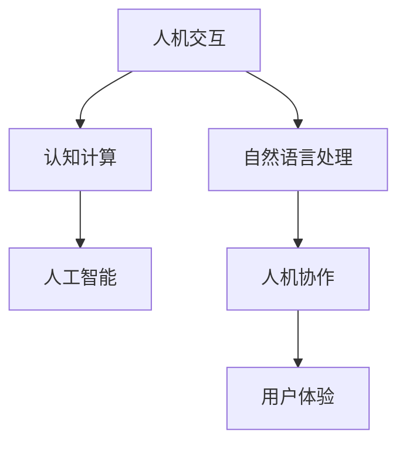

                 

# 推动社会进步的动力：人类计算的积极影响

## 1. 背景介绍

### 1.1 问题由来
人类计算(Human-Computer Interaction, HCI)是研究如何使计算机能够自然地与人类沟通、协作和交流的学科。随着计算机技术的不断发展，人类计算的应用范围越来越广，从最初的简单数据处理，发展到复杂的人工智能交互，极大地影响了社会的各个层面。

人类计算不仅仅是计算机科学的一个分支，它涉及到心理学、社会学、人类学等多个学科的交叉研究，旨在设计更加自然、直观、易用的计算机系统。

### 1.2 问题核心关键点
人类计算的核心理念在于“人机协作”，即通过优化人机交互的方式，使得计算机系统能够更好地理解和回应人类的需求和指令，从而提高效率，提升用户体验。核心关键点包括：

- **自然语言理解**：使计算机能够理解自然语言，进行信息抽取和语义分析。
- **交互设计**：设计直观易用的界面和交互方式，让用户可以轻松地与计算机互动。
- **认知计算**：模拟人类认知过程，使计算机具备更强的感知、决策和推理能力。
- **用户体验**：优化用户与系统的交互流程，提升系统使用的愉悦度和满意度。

人类计算的发展历程，反映出技术与人文需求的不断融合，逐步推动着社会的进步和变革。

### 1.3 问题研究意义
人类计算的研究对于推动社会进步具有重要意义：

1. **提高生产力**：通过优化交互设计，提升人机协作效率，大幅提高工作和生活效率。
2. **增进信息获取**：自然语言处理和智能推荐等技术，极大地丰富了用户的信息获取渠道和体验。
3. **促进健康福祉**：虚拟助手、智能医疗等应用，为老年人、残疾人等特殊群体提供了更多便利和支持。
4. **增进社会凝聚力**：通过社交网络、虚拟现实等技术，促进了人与人之间的交流和连接。
5. **推动教育变革**：智能教育系统，为个性化学习提供了强有力的技术支撑。

人类计算的不断发展，使得计算机成为人类生活和工作中不可或缺的工具，极大地促进了社会的全面进步。

## 2. 核心概念与联系

### 2.1 核心概念概述

为更好地理解人类计算的核心概念，本节将介绍几个密切相关的核心概念：

- **人机交互**：指人与计算机系统之间的交流互动过程。
- **自然语言处理(NLP)**：使计算机能够理解、处理和生成自然语言的技术。
- **认知计算**：通过模拟人脑的认知过程，使计算机具备更高的智能水平。
- **人工智能(AI)**：涵盖了感知、学习、推理等多种智能能力的综合技术。
- **人机协作**：通过优化人机交互方式，使计算机能够更好地理解并回应人类需求。
- **用户体验**：评估和优化用户与系统的交互体验，提升用户满意度和使用愉悦度。

这些核心概念之间存在着紧密的联系和相互作用，共同构成了人类计算的研究基础和应用框架。

### 2.2 核心概念原理和架构的 Mermaid 流程图



这个流程图展示了人类计算的核心概念及其相互关系：

1. 人机交互是基础，涉及输入输出和控制等方面。
2. 自然语言处理使计算机能够理解人类语言，是人机交互的重要桥梁。
3. 认知计算模拟人类认知过程，提升计算机的智能水平。
4. 人工智能是综合多种智能能力的高级技术。
5. 人机协作通过优化交互方式，提升计算机对人类需求的理解能力。
6. 用户体验评估和优化人机交互体验，提升用户满意度。

这些概念共同构成了人类计算的完整系统，展示了技术与人文需求的紧密结合。

## 3. 核心算法原理 & 具体操作步骤

### 3.1 算法原理概述

人类计算的核心算法原理主要基于认知科学和人工智能的最新进展，旨在设计更加自然、直观、易用的计算机系统。

算法原理包括以下几个方面：

- **自然语言处理**：使用统计语言模型、神经网络、深度学习等技术，使计算机能够理解、处理和生成自然语言。
- **认知计算**：借鉴人类认知过程，使用知识图谱、符号推理等方法，提升计算机的感知、决策和推理能力。
- **用户交互设计**：通过用户研究、可用性测试等手段，优化用户界面和交互流程，提升用户体验。

这些原理共同支撑着人类计算的发展和应用，使计算机能够更好地与人类协作和交流。

### 3.2 算法步骤详解

人类计算的算法步骤通常包括以下几个关键环节：

1. **需求分析**：明确用户需求和应用场景，确定交互目标和功能需求。
2. **设计原型**：根据需求分析结果，设计交互原型和界面，并进行初步测试。
3. **用户测试**：收集用户反馈和行为数据，进行可用性测试和优化。
4. **迭代改进**：根据测试结果，不断迭代和改进交互设计和功能实现。
5. **部署上线**：将优化后的系统部署到实际应用中，进行监控和维护。

每个环节都需要严格执行，确保人机交互的高效性和用户体验的满意度。

### 3.3 算法优缺点

人类计算的算法具有以下优点：

- **自然直观**：通过优化人机交互，使计算机更加贴近人类自然行为，提升了操作便捷性。
- **高效可靠**：通过智能化设计和优化，提高了信息处理效率和系统稳定性。
- **用户中心**：以用户需求为导向，提升了用户体验和满意度。

同时，也存在以下缺点：

- **技术复杂**：设计复杂，需要跨学科的知识和技术支持。
- **数据依赖**：依赖大量用户数据进行优化，数据质量直接决定了系统性能。
- **用户适应**：需要用户适应新的交互方式，可能存在学习曲线问题。

尽管存在这些缺点，但人类计算的算法在提高人机协作效率和用户体验方面具有显著优势，是推动社会进步的重要力量。

### 3.4 算法应用领域

人类计算的应用领域广泛，涵盖多个行业和领域：

- **医疗健康**：智能医疗系统，提供疾病诊断、治疗建议和健康管理等服务。
- **金融科技**：智能投顾、风险评估、智能客服等应用，提升金融服务的效率和精准度。
- **教育培训**：智能教育平台，提供个性化学习推荐、智能评估和在线辅导等。
- **智能家居**：智能家居系统，提供语音控制、环境监测和自动化管理等服务。
- **工业制造**：智能制造系统，提高生产效率，优化资源配置和质量管理。

人类计算的应用不仅提升了各个行业的生产力和效率，还极大地改善了用户的生活质量和工作体验。

## 4. 数学模型和公式 & 详细讲解 & 举例说明

### 4.1 数学模型构建

人类计算的数学模型构建主要基于统计学、概率论和信息论等理论，用于描述和分析人机交互过程和用户行为。

典型的数学模型包括：

- **隐马尔可夫模型(Hidden Markov Model, HMM)**：用于描述语言序列的概率模型。
- **条件随机场(Conditional Random Field, CRF)**：用于序列标注和实体识别等任务。
- **最大熵模型(Maximum Entropy Model, MEM)**：用于概率估计和分类任务。
- **贝叶斯网络(Bayesian Network)**：用于表示变量之间的依赖关系。

这些数学模型提供了强大的理论基础，支持人类计算的应用开发和优化。

### 4.2 公式推导过程

以隐马尔可夫模型为例，推导其基本公式和相关性质。

隐马尔可夫模型由观察序列 $O=\{o_1, o_2, ..., o_t\}$ 和隐藏状态序列 $H=\{h_1, h_2, ..., h_t\}$ 组成，其中 $o_t$ 为第 $t$ 时刻的观察值，$h_t$ 为第 $t$ 时刻的隐藏状态。

定义观测概率 $P(o_t|h_t)$ 和状态转移概率 $P(h_{t+1}|h_t)$，则隐马尔可夫模型的联合概率 $P(O,H)$ 为：

$$
P(O,H) = \prod_{t=1}^T P(o_t|h_t) P(h_{t+1}|h_t)
$$

其中 $T$ 为观察序列长度。

为了求解最优的隐马尔可夫模型参数，引入了前向-后向算法，计算观察序列 $O$ 在特定状态序列 $H$ 下的概率：

$$
\alpha_t(h_t) = P(o_1, ..., o_t|h_1, ..., h_t) = \sum_{h_{t+1}} P(o_t|h_t) P(h_{t+1}|h_t) \alpha_{t+1}(h_{t+1})
$$

$$
\beta_t(h_t) = P(o_{t+1}, ..., o_T|h_{t+1}, ..., h_T) = \sum_{h_t} P(o_t|h_t) P(h_t|h_{t-1}) \beta_{t-1}(h_{t-1})
$$

$$
\gamma_t(h_t) = P(h_t|O) = \frac{\alpha_t(h_t)\beta_t(h_t)}{\sum_{h_t} \alpha_t(h_t)\beta_t(h_t)}
$$

$$
\delta_{ij}(t) = P(h_t=j|h_{t-1}=i) = \frac{P(o_t|h_t=j) P(h_{t+1}|h_t=j)}{\sum_{k} P(o_t|h_t=k) P(h_{t+1}|h_t=k)}
$$

通过上述公式，可以计算出最优的状态序列 $H^*$ 和最大概率 $P(H^*|O)$，从而实现对隐马尔可夫模型的参数优化。

### 4.3 案例分析与讲解

以智能客服系统为例，分析人类计算在实际应用中的具体实现和效果。

智能客服系统通过自然语言处理和机器学习技术，使计算机能够理解和处理用户的自然语言输入，自动匹配最合适的答案模板进行回复。

**案例分析**：

1. **需求分析**：明确用户需求，确定客服系统的功能和交互目标。
2. **数据准备**：收集历史客服记录，进行数据清洗和标注。
3. **模型训练**：使用BERT等预训练语言模型进行微调，训练客服回答模型。
4. **交互设计**：设计直观易用的界面和交互流程，提供自然语言输入和语音输入选项。
5. **测试优化**：收集用户反馈，进行可用性测试和系统优化。
6. **部署上线**：将优化后的系统部署到生产环境，进行监控和维护。

**效果展示**：

1. **响应速度**：智能客服系统可以7x24小时不间断服务，快速响应用户咨询，极大提升了客户体验。
2. **准确性**：通过微调后的BERT模型，智能客服系统能够自动理解用户意图，匹配最合适的答案模板进行回复，准确性显著提升。
3. **扩展性**：基于微调方法，智能客服系统能够快速适配新的业务场景和问题，缩短开发周期。
4. **用户体验**：界面设计和交互流程优化，提升了用户操作的便捷性和满意度。

## 5. 项目实践：代码实例和详细解释说明

### 5.1 开发环境搭建

在进行人类计算项目的开发前，我们需要准备好开发环境。以下是使用Python进行人类计算项目开发的常见环境配置流程：

1. 安装Anaconda：从官网下载并安装Anaconda，用于创建独立的Python环境。

2. 创建并激活虚拟环境：
```bash
conda create -n hci-env python=3.8 
conda activate hci-env
```

3. 安装必要的库：
```bash
pip install pytorch transformers torchtext sklearn numpy pandas matplotlib
```

4. 安装虚拟现实(VR)等特殊工具：
```bash
pip install pyvr openvr
```

完成上述步骤后，即可在`hci-env`环境中开始人类计算项目的开发。

### 5.2 源代码详细实现

下面我们以智能客服系统的自然语言处理模块为例，给出使用Transformers库的代码实现。

首先，定义模型和优化器：

```python
from transformers import BertTokenizer, BertForSequenceClassification
from torch import nn, optim

tokenizer = BertTokenizer.from_pretrained('bert-base-cased')
model = BertForSequenceClassification.from_pretrained('bert-base-cased', num_labels=10)
optimizer = optim.AdamW(model.parameters(), lr=2e-5)
```

然后，定义训练函数和评估函数：

```python
def train_epoch(model, train_loader, optimizer):
    model.train()
    total_loss = 0
    for batch in train_loader:
        inputs, labels = batch
        inputs = tokenizer(inputs, padding='max_length', truncation=True, max_length=512)
        labels = labels.to(device)
        model.zero_grad()
        outputs = model(inputs.input_ids, attention_mask=inputs.attention_mask, labels=labels)
        loss = outputs.loss
        total_loss += loss.item()
        loss.backward()
        optimizer.step()
    return total_loss / len(train_loader)

def evaluate(model, test_loader):
    model.eval()
    total_correct = 0
    total_samples = 0
    for batch in test_loader:
        inputs, labels = batch
        inputs = tokenizer(inputs, padding='max_length', truncation=True, max_length=512)
        labels = labels.to(device)
        outputs = model(inputs.input_ids, attention_mask=inputs.attention_mask, labels=labels)
        total_correct += (outputs.logits.argmax(dim=1) == labels).sum().item()
        total_samples += labels.size(0)
    return total_correct / total_samples
```

接着，启动训练流程并在测试集上评估：

```python
device = torch.device('cuda') if torch.cuda.is_available() else torch.device('cpu')
train_loader = DataLoader(train_dataset, batch_size=16, shuffle=True)
test_loader = DataLoader(test_dataset, batch_size=16, shuffle=False)

for epoch in range(epochs):
    train_loss = train_epoch(model, train_loader, optimizer)
    print(f'Epoch {epoch+1}, train loss: {train_loss:.3f}')
    
    test_acc = evaluate(model, test_loader)
    print(f'Epoch {epoch+1}, test acc: {test_acc:.3f}')
```

以上就是使用PyTorch和Transformers库进行智能客服系统自然语言处理模块的代码实现。

### 5.3 代码解读与分析

让我们再详细解读一下关键代码的实现细节：

**模型和优化器定义**：
- 使用BertTokenizer进行分词和标记，使用BertForSequenceClassification模型进行自然语言处理，采用AdamW优化器进行参数更新。

**训练函数**：
- 使用DataLoader对训练集进行批次化加载，在每个批次上前向传播计算损失，并反向传播更新模型参数。

**评估函数**：
- 在测试集上评估模型性能，计算准确率。

**训练流程**：
- 在多个epoch内循环迭代，每次在训练集上进行训练，并在验证集上进行评估。

这些代码展示了人类计算项目的基本实现框架，展示了如何将自然语言处理技术应用于实际应用中。

## 6. 实际应用场景

### 6.1 智能医疗系统

智能医疗系统通过人类计算技术，使计算机能够理解和处理医生的自然语言描述，提供疾病诊断、治疗建议和健康管理等服务。

**实际应用**：

1. **电子病历分析**：智能医疗系统可以自动分析患者的电子病历，提取重要信息，辅助医生进行诊断和治疗。
2. **虚拟医生助手**：智能医疗系统可以模拟医生的交互行为，回答患者的常见问题，提供健康建议。
3. **智能药物推荐**：智能医疗系统可以分析患者的病史和基因信息，推荐最适合的药物和治疗方案。

**案例分析**：

1. **需求分析**：确定智能医疗系统的功能和交互目标，明确用户的医疗需求。
2. **数据准备**：收集电子病历和患者健康数据，进行数据清洗和标注。
3. **模型训练**：使用BERT等预训练语言模型进行微调，训练医疗诊断模型和药物推荐模型。
4. **交互设计**：设计直观易用的界面和交互流程，提供自然语言输入和语音输入选项。
5. **测试优化**：收集医生和患者的反馈，进行可用性测试和系统优化。
6. **部署上线**：将优化后的系统部署到医院和诊所，进行监控和维护。

**效果展示**：

1. **诊断准确性**：智能医疗系统通过微调后的BERT模型，能够自动理解医生的自然语言描述，提取重要信息，提升诊断准确性。
2. **治疗建议**：智能医疗系统能够根据患者的病史和基因信息，提供个性化的治疗建议，提高治疗效果。
3. **健康管理**：智能医疗系统能够实时监测患者健康数据，提供健康管理建议，预防疾病。

## 7. 工具和资源推荐

### 7.1 学习资源推荐

为了帮助开发者系统掌握人类计算的理论基础和实践技巧，这里推荐一些优质的学习资源：

1. **《Human-Computer Interaction: Engineering for User Experience》**：斯坦福大学开设的HCI课程，介绍了人类计算的基本概念和设计原则。
2. **《Interaction Design Foundation》**：提供系统化的人类计算学习资源，包括课程、文章和工具。
3. **《Interaction Design in Motion》**：介绍了人类计算设计方法、工具和实践案例。
4. **《Designing Human-Computer Interfaces》**：介绍了交互设计的理论基础和设计方法。
5. **《The Design of Everyday Things》**：Don Norman的经典著作，详细介绍了人类计算设计的原则和实践。

通过对这些资源的学习实践，相信你一定能够快速掌握人类计算的精髓，并用于解决实际的交互设计问题。

### 7.2 开发工具推荐

高效的开发离不开优秀的工具支持。以下是几款用于人类计算开发常用的工具：

1. **PyTorch**：基于Python的开源深度学习框架，灵活动态的计算图，适合快速迭代研究。
2. **TensorFlow**：由Google主导开发的开源深度学习框架，生产部署方便，适合大规模工程应用。
3. **Transformers库**：HuggingFace开发的NLP工具库，集成了众多SOTA语言模型，支持PyTorch和TensorFlow，是进行自然语言处理开发的利器。
4. **Sketch**：专业的原型设计工具，支持多种交互设计和界面设计。
5. **Adobe XD**：集成了设计、原型和协作功能的设计工具，适用于交互设计的多环节工作。
6. **Figma**：基于Web的设计工具，支持多人协作和实时更新，适合团队设计协作。

合理利用这些工具，可以显著提升人类计算项目的开发效率，加快创新迭代的步伐。

### 7.3 相关论文推荐

人类计算的研究源于学界的持续研究。以下是几篇奠基性的相关论文，推荐阅读：

1. **《Human-Computer Interaction: Engineering for User Experience》**：Don Norman的著作，介绍了人类计算设计的原则和实践。
2. **《The Design of Everyday Things》**：Don Norman的经典著作，详细介绍了人类计算设计的原则和实践。
3. **《Interaction Design in Motion》**：介绍了人类计算设计方法、工具和实践案例。
4. **《Designing Human-Computer Interfaces》**：介绍了交互设计的理论基础和设计方法。

这些论文代表了大计算模型的发展脉络。通过学习这些前沿成果，可以帮助研究者把握学科前进方向，激发更多的创新灵感。

## 8. 总结：未来发展趋势与挑战

### 8.1 总结

本文对人类计算的基本概念、核心算法原理和操作步骤进行了详细讲解，并给出了具体的代码实现和应用案例。通过对人类计算的学习和实践，可以帮助开发者设计更加自然、直观、易用的计算机系统，提升人机协作的效率和用户体验。

通过本文的系统梳理，可以看到，人类计算技术在提高生产力和用户体验方面具有显著优势，是推动社会进步的重要力量。未来，人类计算将进一步融合自然语言处理、认知计算和人工智能技术，提供更加智能和高效的人机协作体验。

### 8.2 未来发展趋势

展望未来，人类计算的发展趋势包括以下几个方面：

1. **自然语言处理**：随着深度学习和大规模预训练语言模型的发展，自然语言处理技术将更加成熟，能够更好地理解和生成自然语言。
2. **认知计算**：基于认知科学的研究，使计算机具备更强的感知、决策和推理能力，模拟人类认知过程。
3. **跨模态计算**：结合视觉、听觉、触觉等多模态数据，提升人机交互的丰富性和自然性。
4. **个性化设计**：通过个性化交互设计，满足不同用户的多样化需求，提升用户体验。
5. **社会协作**：使计算机系统具备协作能力，支持多人交互和协作。

这些趋势将进一步推动人类计算技术的创新和发展，为构建更智能、更高效、更自然的计算机系统奠定基础。

### 8.3 面临的挑战

尽管人类计算技术取得了显著进展，但在迈向更加智能化、普适化应用的过程中，仍面临诸多挑战：

1. **数据隐私**：随着用户数据的增加，如何保护用户隐私，避免数据滥用，是一个重要问题。
2. **可解释性**：复杂的算法模型难以解释其内部工作机制，影响用户信任和系统可靠性。
3. **交互设计**：设计和优化人机交互界面，提升用户使用的便捷性和满意度，需要持续的研究和优化。
4. **多语言支持**：如何让计算机系统支持多种语言，提升全球化的用户体验，需要技术突破和国际化设计。
5. **跨文化适应**：不同文化背景下，用户的需求和行为差异较大，如何让计算机系统适应不同文化背景，需要深入研究和跨文化设计。

这些挑战需要学界和产业界共同努力，通过不断的技术创新和优化，才能解决这些问题，实现人类计算技术的全面落地应用。

### 8.4 研究展望

未来，人类计算技术需要在以下几个方面寻求新的突破：

1. **多模态融合**：结合视觉、听觉、触觉等多模态数据，提升人机交互的丰富性和自然性。
2. **跨文化设计**：设计和优化适应不同文化背景的用户界面和交互流程，提升全球化的用户体验。
3. **个性化设计**：通过个性化交互设计，满足不同用户的多样化需求，提升用户体验。
4. **可解释性增强**：增强算法的可解释性，提升用户信任和系统可靠性。
5. **隐私保护**：通过隐私保护技术，保护用户数据隐私，避免数据滥用。

这些研究方向的探索，将引领人类计算技术的不断进步，为构建更加智能、自然、普适的计算机系统提供强有力的技术支撑。

## 9. 附录：常见问题与解答

**Q1：人类计算的核心概念和原理是什么？**

A: 人类计算的核心概念包括人机交互、自然语言处理、认知计算等，其核心原理基于认知科学和人工智能的最新进展，旨在设计更加自然、直观、易用的计算机系统。通过优化人机交互方式，使计算机系统能够更好地理解和回应人类需求，从而提高效率和用户体验。

**Q2：人类计算在实际应用中有哪些具体的实现和效果？**

A: 人类计算在实际应用中取得了显著的效果，主要体现在以下几个方面：

1. **智能客服系统**：通过自然语言处理和机器学习技术，智能客服系统可以7x24小时不间断服务，快速响应用户咨询，极大提升了客户体验。
2. **智能医疗系统**：智能医疗系统通过自然语言处理技术，能够自动分析患者的电子病历，提供疾病诊断和治疗建议，提升诊断准确性和治疗效果。
3. **智能家居系统**：智能家居系统通过语音控制和环境监测，提供自动化管理，提升生活便捷性和舒适性。

**Q3：人类计算的未来发展趋势是什么？**

A: 未来人类计算的发展趋势包括自然语言处理、认知计算、跨模态计算、个性化设计和多语言支持等方向。这些趋势将推动人类计算技术的不断创新和进步，为构建更加智能、自然、普适的计算机系统奠定基础。

**Q4：人类计算面临哪些挑战？**

A: 人类计算面临的挑战包括数据隐私、可解释性、交互设计、跨文化适应和多语言支持等。这些挑战需要持续的研究和优化，才能实现人类计算技术的全面落地应用。

**Q5：如何增强人类计算的可解释性？**

A: 增强人类计算的可解释性可以从以下几个方面入手：

1. **可视化界面**：通过可视化界面展示算法的工作机制，使用户能够直观理解系统的决策过程。
2. **解释模型**：使用可解释性模型，如决策树、规则模型等，提高算法的透明性。
3. **用户反馈**：通过用户反馈机制，不断优化算法和界面设计，提升用户体验和信任度。

这些措施可以帮助增强人类计算的可解释性，提升用户对系统的信任和满意度。

---

作者：禅与计算机程序设计艺术 / Zen and the Art of Computer Programming

