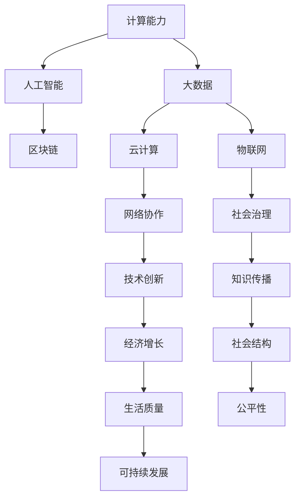

                 

# 推动社会进步的动力：人类计算的积极影响

## 1. 背景介绍

### 1.1 问题由来

在当今信息时代，计算能力已成为驱动社会进步的关键力量。从互联网的普及到大数据的挖掘，从人工智能的突破到区块链的应用，计算技术在各个领域中发挥着越来越重要的作用。特别是在全球范围内，计算技术的迅速发展不仅极大地改变了人们的生产生活方式，也深刻影响了经济、政治、文化等多方面的社会结构和发展。

### 1.2 问题核心关键点

计算技术在社会进步中的作用体现在以下几个方面：

1. **信息时代的开启**：计算技术的发展加速了信息处理和传输的速度，使得数据能够更迅速地被收集、存储、分析和利用。这不仅推动了互联网和电子商务的繁荣，也为科学研究提供了新的数据资源和分析手段。

2. **智能化的推动**：通过计算技术实现的智能系统，如机器学习、自然语言处理、计算机视觉等，能够在各个领域中提供高效、准确的决策支持，优化资源配置，提升生产效率。

3. **协作的深化**：计算技术提供了高效的网络协作平台，使全球范围内的研究者、工程师和开发者能够跨越地理和时间的限制，进行更紧密的合作，加速技术创新和知识传播。

4. **社会治理的智能化**：通过计算技术实现的智能监控、数据分析等手段，能够提高社会治理的效率和精准度，例如智能交通系统、智慧城市建设、公共安全管理等。

### 1.3 问题研究意义

深入理解计算技术在推动社会进步中的作用，不仅有助于我们更好地利用技术，提升生活质量，还能够帮助制定更为科学合理的社会发展策略，引导和推动社会进步向更加可持续、高效、公平的方向发展。

## 2. 核心概念与联系

### 2.1 核心概念概述

- **计算能力**：指计算机系统处理数据和执行指令的能力，通常以每秒执行指令数（FLOPS）或每秒执行的操作数（OPS）来衡量。计算能力是推动技术进步和社会发展的核心驱动力之一。

- **大数据**：指在传统数据处理应用软件无法处理的、以原有方式处理需要大量时间和资源的、具有新型的数据管理技术的海量、高速、多样化的信息资产。大数据技术为计算技术的应用提供了广阔的空间。

- **人工智能**：通过计算机技术实现的人类智能水平的模拟和延伸，包括机器学习、自然语言处理、计算机视觉等多个领域。人工智能技术的应用使计算能力更加强大和智能化。

- **区块链**：一种去中心化的分布式账本技术，基于密码学原理确保数据的安全、透明和不可篡改。区块链技术在金融、供应链、政府等领域具有广泛的应用前景。

- **云计算**：通过互联网提供按需扩展的计算服务，包括硬件资源、软件资源和数据资源。云计算降低了企业IT投入和运营成本，提高了IT资源利用率。

- **物联网**：通过互联网将各种物品和设备连接起来，实现智能化管理和控制。物联网技术使得计算能力更加广泛地应用于物理世界，提升了人类与环境、设备的互动水平。

这些核心概念之间的逻辑关系可以通过以下Mermaid流程图来展示：



这个流程图展示了计算技术在社会进步中的作用及其与其他技术之间的关联：

1. 计算能力是大数据、人工智能、区块链、云计算和物联网等技术的基础。
2. 大数据、人工智能、区块链、云计算和物联网等技术共同推动了网络协作、社会治理、技术创新和知识传播等领域的进步。
3. 技术进步和经济增长、社会结构优化、生活质量提升、公平性和可持续发展等方面相辅相成，共同推动社会进步。

## 3. 核心算法原理 & 具体操作步骤

### 3.1 算法原理概述

计算技术的核心原理在于其能够高效地处理和分析数据，从而提供解决方案和决策支持。这一过程通常涉及以下几个步骤：

1. **数据收集与存储**：通过传感器、网络、用户输入等方式收集数据，并将其存储在计算系统中。
2. **数据预处理**：清洗、去噪、标准化等操作，为后续分析奠定基础。
3. **数据处理与分析**：运用算法和技术对数据进行计算、模拟、预测、识别等操作，提取有价值的信息和模式。
4. **模型训练与优化**：构建和训练模型，优化算法，提高分析精度和效率。
5. **结果应用与反馈**：将分析结果应用于决策、控制、管理等实际场景中，并通过反馈机制不断改进算法和模型。

### 3.2 算法步骤详解

以下是计算技术在推动社会进步中的具体操作步骤：

**Step 1: 数据收集与存储**
- 收集各类数据，包括文本、图像、视频、传感器数据等。
- 利用大数据技术将数据存储在分布式文件系统中，如Hadoop、Spark等。

**Step 2: 数据预处理**
- 清洗数据，去除噪声、重复、异常值等。
- 进行数据标准化、归一化、特征提取等操作，准备输入模型。

**Step 3: 数据处理与分析**
- 使用机器学习算法、深度学习模型、统计分析方法等对数据进行处理。
- 通过模型训练，提取数据的模式和规律。

**Step 4: 模型训练与优化**
- 选择合适的模型架构和算法，构建计算模型。
- 使用训练数据对模型进行训练，通过反向传播、优化算法等进行模型参数优化。
- 在验证数据集上评估模型性能，调整参数和架构。

**Step 5: 结果应用与反馈**
- 将训练好的模型应用于实际场景中，进行预测、分类、推荐等操作。
- 根据实际结果与预期目标的偏差，进行模型反馈和迭代优化。

### 3.3 算法优缺点

计算技术在推动社会进步中的优缺点如下：

**优点**：
1. **高效性**：能够快速处理和分析大量数据，提高决策效率。
2. **精确性**：通过复杂的算法和模型，提高分析精度和可靠性。
3. **可扩展性**：分布式计算和云计算提供了强大的扩展能力，适应数据量和计算量的变化。
4. **智能性**：人工智能技术使得计算系统具备自我学习和适应的能力。

**缺点**：
1. **数据隐私**：大规模数据收集和存储可能侵犯用户隐私，需要严格的监管和管理。
2. **资源消耗**：高计算需求可能带来巨大的能源和硬件成本。
3. **算法复杂性**：复杂的算法和模型增加了开发和维护的难度。
4. **误导性**：数据偏差和模型错误可能导致误导性决策，影响社会稳定和公平。

### 3.4 算法应用领域

计算技术在多个领域中得到广泛应用，包括但不限于：

- **金融科技**：通过计算技术进行风险评估、算法交易、智能投顾等，提升金融服务的效率和准确性。
- **医疗健康**：通过计算技术进行疾病预测、基因分析、个性化医疗等，提高医疗服务的精准性和可及性。
- **交通运输**：通过计算技术进行交通流量预测、智能调度、自动驾驶等，优化交通管理和运营效率。
- **环境保护**：通过计算技术进行环境监测、资源管理、气候预测等，支持可持续发展和环境保护。
- **教育培训**：通过计算技术进行个性化学习、智能评估、教育数据分析等，提升教育质量和资源分配效率。
- **公共安全**：通过计算技术进行犯罪预测、情报分析、应急响应等，提高公共安全管理水平。

## 4. 数学模型和公式 & 详细讲解 & 举例说明

### 4.1 数学模型构建

假设我们有一组历史数据 $\{(x_i, y_i)\}_{i=1}^N$，其中 $x_i$ 是特征向量，$y_i$ 是标签。我们的目标是通过计算技术建立一个模型 $M(x)$，使得在给定新的特征 $x$ 时，能够准确预测标签 $y$。

### 4.2 公式推导过程

我们将问题建模为回归问题，其中 $y$ 是连续值，如房价预测。我们假设模型 $M(x)$ 为线性模型，即 $M(x) = wx + b$，其中 $w$ 是权重向量，$b$ 是偏置。我们的目标是最小化预测误差，即：

$$
\min_{w, b} \sum_{i=1}^N (y_i - wx_i - b)^2
$$

通过求解上述优化问题，我们可以得到最优的权重向量 $w$ 和偏置 $b$。

### 4.3 案例分析与讲解

以房价预测为例，我们可以构建一个简单的线性回归模型：

- **数据收集与存储**：从房地产市场收集历史交易数据，包括房屋面积、地理位置、房屋类型等特征，以及对应的房价。
- **数据预处理**：清洗数据，去除缺失值、异常值，进行特征标准化。
- **数据处理与分析**：使用线性回归模型对数据进行训练和预测。
- **模型训练与优化**：使用梯度下降等优化算法最小化预测误差，调整权重和偏置。
- **结果应用与反馈**：根据模型预测结果进行房价评估和推荐，并根据实际结果进行模型反馈和优化。

## 5. 项目实践：代码实例和详细解释说明

### 5.1 开发环境搭建

在进行计算技术应用开发前，我们需要准备好开发环境。以下是使用Python进行TensorFlow开发的环境配置流程：

1. 安装Anaconda：从官网下载并安装Anaconda，用于创建独立的Python环境。

2. 创建并激活虚拟环境：
```bash
conda create -n tf-env python=3.8 
conda activate tf-env
```

3. 安装TensorFlow：根据CUDA版本，从官网获取对应的安装命令。例如：
```bash
conda install tensorflow -c pytorch -c conda-forge
```

4. 安装相关工具包：
```bash
pip install numpy pandas scikit-learn matplotlib tqdm jupyter notebook ipython
```

完成上述步骤后，即可在`tf-env`环境中开始计算技术应用开发。

### 5.2 源代码详细实现

下面我们以房价预测为例，给出使用TensorFlow对线性回归模型进行训练和预测的PyTorch代码实现。

首先，定义数据集：

```python
import numpy as np
import pandas as pd
from sklearn.model_selection import train_test_split
from sklearn.preprocessing import StandardScaler

data = pd.read_csv('housing.csv')
features = data[['area', 'location', 'type']]
target = data['price']

# 数据标准化
scaler = StandardScaler()
features = scaler.fit_transform(features)

# 数据集划分
X_train, X_test, y_train, y_test = train_test_split(features, target, test_size=0.2, random_state=42)
```

然后，定义模型和优化器：

```python
import tensorflow as tf

model = tf.keras.models.Sequential([
    tf.keras.layers.Dense(64, activation='relu', input_shape=(features.shape[1],)),
    tf.keras.layers.Dense(1)
])

optimizer = tf.keras.optimizers.Adam(learning_rate=0.01)
```

接着，定义训练和评估函数：

```python
def train_epoch(model, dataset, batch_size, optimizer):
    for batch in dataset:
        features, labels = batch
        with tf.GradientTape() as tape:
            predictions = model(features)
            loss = tf.reduce_mean(tf.square(predictions - labels))
        gradients = tape.gradient(loss, model.trainable_variables)
        optimizer.apply_gradients(zip(gradients, model.trainable_variables))

def evaluate(model, dataset):
    features, labels = dataset
    predictions = model(features)
    mse = tf.reduce_mean(tf.square(predictions - labels))
    print('Mean Squared Error:', mse)
```

最后，启动训练流程并在测试集上评估：

```python
epochs = 100

for epoch in range(epochs):
    train_epoch(model, (X_train, y_train), batch_size=32, optimizer=optimizer)
    evaluate(model, (X_test, y_test))
```

以上就是使用TensorFlow对线性回归模型进行房价预测训练和预测的完整代码实现。可以看到，TensorFlow提供了强大的计算框架和工具库，使得模型的开发和训练过程变得简洁高效。

### 5.3 代码解读与分析

让我们再详细解读一下关键代码的实现细节：

**数据集定义**：
- 使用Pandas读取CSV格式的数据集，提取特征和目标变量。
- 使用sklearn进行数据标准化和划分。

**模型定义**：
- 使用TensorFlow的Sequential模型定义多层神经网络，包括输入层、隐藏层和输出层。
- 隐藏层使用ReLU激活函数，输出层使用默认激活函数。

**优化器定义**：
- 使用Adam优化器，设置学习率。

**训练函数定义**：
- 使用TensorFlow的GradientTape记录梯度，计算损失函数。
- 使用优化器更新模型参数。

**评估函数定义**：
- 计算测试集的均方误差，输出评估结果。

**训练流程**：
- 定义总的训练轮数，循环迭代训练过程。
- 在每个epoch中，使用训练数据进行前向传播和反向传播，更新模型参数。
- 在测试集上进行评估，输出均方误差。

可以看到，TensorFlow的计算框架使得模型的实现变得简洁高效，开发者可以更加专注于算法和模型的设计。

## 6. 实际应用场景

### 6.1 智能城市交通管理

计算技术在智能城市交通管理中的应用非常广泛。通过实时收集和分析交通流量数据，可以预测交通拥堵，优化交通信号灯和路线规划，提高道路利用效率和通行速度。

例如，某智能交通系统通过部署在路面和车内的传感器收集交通数据，利用计算技术进行数据分析和模型训练，实现了实时交通流量预测和优化。系统可以根据预测结果调整信号灯和车速，减少交通拥堵，提高通行效率。

### 6.2 智慧医疗

计算技术在智慧医疗中的应用同样重要。通过计算技术对医疗数据进行分析，可以实现疾病的早期预测、个性化治疗和智能诊断。

例如，某智能诊断系统通过收集和分析患者的电子健康记录、基因数据等，利用机器学习模型进行疾病预测和个性化治疗推荐。系统能够根据患者的历史健康数据和基因特征，预测潜在疾病风险，并提供个性化的治疗方案，显著提高了诊断和治疗的精准性和效率。

### 6.3 环境保护

计算技术在环境保护中的应用包括环境监测、资源管理和气候预测等。通过计算技术对环境数据进行分析，可以实现更精准的环境管理和保护。

例如，某环境监测系统通过部署在各地的传感器和摄像头，收集环境数据，利用计算技术进行数据分析和模型训练，实现了实时空气质量监测和污染源识别。系统可以根据监测数据预测未来的污染趋势，并采取相应的环境保护措施。

## 7. 工具和资源推荐

### 7.1 学习资源推荐

为了帮助开发者系统掌握计算技术的应用原理和实践技巧，这里推荐一些优质的学习资源：

1. 《深度学习》系列书籍：由深度学习领域的知名专家撰写，全面介绍了深度学习的基本原理和应用实例。

2. CS231n《深度学习计算机视觉》课程：斯坦福大学开设的计算机视觉明星课程，提供了丰富的课程视频和代码示例。

3. 《TensorFlow实战》书籍：由TensorFlow团队成员撰写，详细介绍了TensorFlow的使用方法和实践案例。

4. Kaggle：全球最大的数据科学竞赛平台，提供了大量数据集和竞赛，帮助开发者提升计算技术的应用能力。

5. GitHub：开源社区，聚集了大量计算技术的代码库和项目，方便开发者学习和分享。

通过对这些资源的学习实践，相信你一定能够快速掌握计算技术的应用精髓，并用于解决实际的计算问题。

### 7.2 开发工具推荐

高效的开发离不开优秀的工具支持。以下是几款用于计算技术应用的常用工具：

1. TensorFlow：由Google主导开发的开源深度学习框架，提供了丰富的API和工具，方便开发者进行模型训练和推理。

2. PyTorch：Facebook开发的开源深度学习框架，灵活高效，适合研究和实验。

3. OpenCV：开源计算机视觉库，提供了丰富的图像处理和计算机视觉算法。

4. SciPy：Python科学计算库，提供了大量的科学计算和数据处理工具。

5. R：开源统计分析软件，适用于数据分析和统计建模。

6. Weights & Biases：模型训练的实验跟踪工具，可以记录和可视化模型训练过程中的各项指标，方便对比和调优。

7. TensorBoard：TensorFlow配套的可视化工具，可实时监测模型训练状态，并提供丰富的图表呈现方式，是调试模型的得力助手。

合理利用这些工具，可以显著提升计算技术应用的开发效率，加快创新迭代的步伐。

### 7.3 相关论文推荐

计算技术在推动社会进步中的研究得到了广泛的关注和深入的探索。以下是几篇奠基性的相关论文，推荐阅读：

1. Deep Learning（深度学习）：Ian Goodfellow等撰写，全面介绍了深度学习的理论基础和实践应用。

2. TensorFlow: A System for Large-Scale Machine Learning：Jeff Dean等撰写，介绍了TensorFlow的设计理念和实现细节。

3. Learning Deep Architectures for AI：Yoshua Bengio等撰写，探讨了深度神经网络的结构和学习算法。

4. ImageNet Classification with Deep Convolutional Neural Networks：Alex Krizhevsky等撰写，介绍了使用深度卷积神经网络进行图像分类的方法。

5. An overview of Google's machine learning systems：John Giannakoglou等撰写，介绍了Google在机器学习方面的应用和系统架构。

这些论文代表了大计算技术的发展脉络。通过学习这些前沿成果，可以帮助研究者把握学科前进方向，激发更多的创新灵感。

## 8. 总结：未来发展趋势与挑战

### 8.1 总结

本文对计算技术在推动社会进步中的作用进行了全面系统的介绍。首先阐述了计算能力、大数据、人工智能、区块链、云计算和物联网等核心概念及其相互联系，明确了计算技术在推动社会进步中的独特价值。其次，从原理到实践，详细讲解了计算技术的核心算法和操作步骤，给出了计算技术应用开发的完整代码实例。同时，本文还广泛探讨了计算技术在智能城市交通管理、智慧医疗、环境保护等多个行业领域的应用前景，展示了计算技术应用的巨大潜力。此外，本文精选了计算技术的各类学习资源，力求为读者提供全方位的技术指引。

通过本文的系统梳理，可以看到，计算技术在推动社会进步中的作用巨大，其高效性、精确性、可扩展性和智能性等特点使其在各个领域中发挥着越来越重要的作用。未来，随着计算技术的不断进步，其应用范围将进一步扩大，为社会进步带来更大的推动力。

### 8.2 未来发展趋势

展望未来，计算技术在推动社会进步中的发展趋势如下：

1. **技术融合加速**：计算技术将与其他技术进行更深入的融合，如量子计算、生物计算等，推动技术创新和应用拓展。

2. **计算平台多样化**：云计算、边缘计算、雾计算等计算平台将提供更加灵活多样的计算资源，满足不同场景的需求。

3. **数据驱动决策**：计算技术将更加注重数据的收集、分析和应用，推动数据驱动的决策和创新。

4. **智能化的进一步提升**：人工智能技术将进一步发展和应用，使得计算系统更加智能化、自适应，能够处理更复杂、更精细的任务。

5. **计算模型的演化**：计算模型将不断演化和优化，以适应更加复杂和多样化的应用场景。

6. **计算能力的增强**：随着算力硬件的进步，计算能力将进一步增强，推动计算技术在更多领域中发挥更大作用。

以上趋势凸显了大计算技术的广阔前景。这些方向的探索发展，必将进一步提升计算技术在各个领域中的应用价值，为社会进步带来更大的推动力。

### 8.3 面临的挑战

尽管计算技术在推动社会进步中发挥着重要作用，但在其应用和发展过程中，仍面临一些挑战：

1. **数据隐私和安全**：大规模数据收集和存储可能带来数据隐私和安全问题，需要严格的监管和管理。

2. **算力成本高**：高计算需求可能带来巨大的能源和硬件成本，需要寻求更高效的计算方式。

3. **算法复杂性**：复杂的算法和模型增加了开发和维护的难度，需要更多的技术积累和人才支持。

4. **误导性决策**：数据偏差和模型错误可能导致误导性决策，影响社会稳定和公平。

5. **伦理和社会问题**：计算技术的应用可能引发伦理和社会问题，需要制定相应的政策和规范。

6. **技术壁垒**：计算技术的应用需要较高的技术门槛，可能限制其在某些领域的应用。

正视计算技术在推动社会进步中的挑战，积极应对并寻求突破，将是大计算技术走向成熟的必由之路。

### 8.4 研究展望

面对计算技术在推动社会进步中面临的挑战，未来的研究需要在以下几个方面寻求新的突破：

1. **数据隐私保护**：开发新的数据保护技术，如联邦学习、差分隐私等，保护数据隐私和安全性。

2. **高效的计算资源管理**：研究和应用更高效的计算资源管理方式，如混合计算、边缘计算等，降低计算成本。

3. **简化计算模型**：探索更简洁、高效的计算模型，如深度学习压缩、模型蒸馏等，提升模型的应用效率。

4. **透明和可解释的计算**：研究透明和可解释的计算方法，提升计算系统的可信度和可控性。

5. **跨学科合作**：加强跨学科合作，融合计算技术与其他学科的知识，推动技术的创新和应用。

这些研究方向的探索，必将引领计算技术迈向更高的台阶，为社会进步带来更大的推动力。面向未来，计算技术需要在技术创新、资源管理、伦理规范等方面不断突破，才能更好地服务于社会进步。

## 9. 附录：常见问题与解答

**Q1：计算技术在推动社会进步中的作用有哪些？**

A: 计算技术在推动社会进步中的作用主要体现在以下几个方面：

1. **信息时代的开启**：计算技术加速了信息处理和传输的速度，推动了互联网和电子商务的繁荣，并为科学研究提供了新的数据资源和分析手段。

2. **智能化的推动**：计算技术使得人工智能技术得以广泛应用，提升了各领域的智能化水平，如智能客服、医疗诊断、自动驾驶等。

3. **协作的深化**：计算技术提供了高效的网络协作平台，促进了全球范围内的研究者、工程师和开发者的合作，加速了技术创新和知识传播。

4. **社会治理的智能化**：计算技术支持智能交通系统、智慧城市建设、公共安全管理等，提高了社会治理的效率和精准度。

5. **经济增长和产业升级**：计算技术推动了各行业的数字化转型，提升了生产效率和经济效益。

6. **生活质量的提升**：计算技术在教育、娱乐、健康等领域的广泛应用，提升了人们的生活质量。

7. **环境保护和可持续发展**：计算技术支持环境监测、资源管理、气候预测等，推动了可持续发展。

**Q2：计算技术在应用中面临的主要挑战有哪些？**

A: 计算技术在推动社会进步中面临的主要挑战如下：

1. **数据隐私和安全**：大规模数据收集和存储可能侵犯用户隐私，需要严格的监管和管理。

2. **算力成本高**：高计算需求可能带来巨大的能源和硬件成本，需要寻求更高效的计算方式。

3. **算法复杂性**：复杂的算法和模型增加了开发和维护的难度，需要更多的技术积累和人才支持。

4. **误导性决策**：数据偏差和模型错误可能导致误导性决策，影响社会稳定和公平。

5. **伦理和社会问题**：计算技术的应用可能引发伦理和社会问题，需要制定相应的政策和规范。

6. **技术壁垒**：计算技术的应用需要较高的技术门槛，可能限制其在某些领域的应用。

**Q3：如何提升计算技术在社会进步中的应用价值？**

A: 提升计算技术在社会进步中的应用价值可以从以下几个方面入手：

1. **数据隐私保护**：开发新的数据保护技术，如联邦学习、差分隐私等，保护数据隐私和安全性。

2. **高效的计算资源管理**：研究和应用更高效的计算资源管理方式，如混合计算、边缘计算等，降低计算成本。

3. **简化计算模型**：探索更简洁、高效的计算模型，如深度学习压缩、模型蒸馏等，提升模型的应用效率。

4. **透明和可解释的计算**：研究透明和可解释的计算方法，提升计算系统的可信度和可控性。

5. **跨学科合作**：加强跨学科合作，融合计算技术与其他学科的知识，推动技术的创新和应用。

6. **伦理和法规建设**：制定和完善伦理和法规，引导计算技术的应用方向，保障社会公平和道德底线。

**Q4：如何应对计算技术在推动社会进步中的挑战？**

A: 应对计算技术在推动社会进步中的挑战可以从以下几个方面入手：

1. **数据隐私保护**：采用数据匿名化、加密等技术，保护数据隐私和安全。

2. **高效的计算资源管理**：研究和应用更高效的计算资源管理方式，如混合计算、边缘计算等，降低计算成本。

3. **算法简化和优化**：优化算法结构和参数，提升计算效率和准确性。

4. **透明和可解释的计算**：开发透明和可解释的计算方法，提升计算系统的可信度和可控性。

5. **伦理和社会问题**：制定和完善伦理和社会规范，引导计算技术的应用方向，保障社会公平和道德底线。

**Q5：如何利用计算技术推动社会进步？**

A: 利用计算技术推动社会进步可以从以下几个方面入手：

1. **智能城市建设**：利用计算技术进行交通流量预测、智能调度、自动驾驶等，优化交通管理和运营效率。

2. **智慧医疗**：利用计算技术进行疾病预测、个性化治疗和智能诊断，提高医疗服务的精准性和可及性。

3. **环境保护**：利用计算技术进行环境监测、资源管理和气候预测，支持可持续发展和环境保护。

4. **教育培训**：利用计算技术进行个性化学习、智能评估和教育数据分析，提升教育质量和资源分配效率。

5. **公共安全管理**：利用计算技术进行犯罪预测、情报分析、应急响应等，提高公共安全管理水平。

通过这些应用，计算技术可以在各个领域中发挥重要作用，推动社会进步和经济发展。

---

作者：禅与计算机程序设计艺术 / Zen and the Art of Computer Programming

