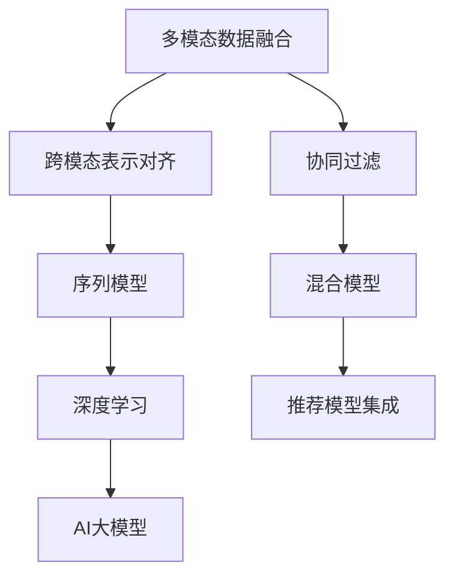

                 

# 推荐系统中的多模态融合：AI大模型的新frontier

> 关键词：多模态融合, 推荐系统, 深度学习, AI大模型, 数据融合, 协同过滤, 序列模型, 混合模型

## 1. 背景介绍

### 1.1 问题由来
推荐系统(Recommendation System)是信息时代的基石，广泛应用于电商、社交、新闻、视频等诸多领域。它通过精准预测用户的行为，为用户推荐感兴趣的物品，大大提升了用户体验和平台转化率。传统推荐系统主要包括基于内容的推荐和协同过滤两类方法。前者直接根据物品属性特征进行相似度计算；后者则通过用户行为数据构建用户画像，进行行为匹配推荐。

然而，随着用户行为数据的多样化、复杂化和异构化，单一的推荐模型已难以捕捉全面且深层次的用户需求。近年来，多模态推荐系统(Multimodal Recommendation System)成为热门研究主题。它通过融合用户在不同模态下的行为数据，如文本、图像、音频等，更全面地刻画用户画像，提高推荐的精度和多样性。

为了构建多模态推荐系统，研究人员开发了大量模型，如GAT、LSTM、CNN等。然而，这些模型往往依赖手工设计的特征工程，难以自适应复杂多变的数据特征。AI大模型的发展为多模态推荐带来了新的突破。

AI大模型如GPT-3、BERT等，通过海量数据预训练学习到通用的语言和知识表示，在推荐系统中的应用正在开启新的篇章。利用大模型的预训练知识，结合用户的多模态行为数据，能够实现更加高效、精准和多样化的推荐效果。

### 1.2 问题核心关键点
多模态推荐系统与AI大模型的融合，主要涉及以下几个关键点：

- 多模态数据融合：如何将不同模态的数据进行深度融合，实现全局视图的全局优化。
- 跨模态表示对齐：如何将不同模态的数据进行高维空间中的对齐，建立跨模态的语义映射。
- 多模态模型优化：如何设计合适的多模态模型，最大化地利用不同模态的冗余信息。
- 推荐模型集成：如何综合利用多个推荐模型的输出，获得更鲁棒和精确的推荐结果。

这些核心问题贯穿多模态推荐系统，成为学术界和工业界长期研究的重点和难点。

## 2. 核心概念与联系

### 2.1 核心概念概述

为了更好地理解多模态推荐系统与AI大模型的融合方法，本节将介绍几个密切相关的核心概念：

- 多模态数据融合(Multimodal Data Fusion)：将不同模态的数据融合在一起，进行深度学习和优化，最大化地利用数据的互补性和冗余性。
- 跨模态表示对齐(Cross-modal Representation Alignment)：将不同模态的语义信息进行映射对齐，建立统一的多维空间表示。
- 协同过滤(Collaborative Filtering)：通过用户行为数据构建用户画像，进行相似度匹配推荐，常用的方法有基于用户的协同过滤和基于物品的协同过滤。
- 序列模型(Sequence Model)：通过序列数据(如时间序列、文本序列)进行预测，常用的模型有RNN、LSTM、GRU等。
- 混合模型(Hybrid Model)：结合多种模型进行融合，通过综合利用不同模型的优势，提升推荐效果。
- 深度学习(Deep Learning)：利用神经网络进行深度特征学习，常用的模型有CNN、RNN、Transformer等。

这些核心概念之间的逻辑关系可以通过以下Mermaid流程图来展示：



这个流程图展示了大语言模型的核心概念及其之间的关系：

1. 多模态数据融合通过将不同模态的数据进行融合，获取全面的用户画像。
2. 跨模态表示对齐将不同模态的数据进行语义映射，形成统一的表示空间。
3. 协同过滤通过用户行为数据构建用户画像，进行相似度匹配推荐。
4. 序列模型通过序列数据进行预测，能够捕捉时间序列特征。
5. 混合模型结合多种模型进行融合，提升推荐效果。
6. 深度学习利用神经网络进行深度特征学习，学习更为丰富的语义表示。
7. AI大模型融合深度学习和语言知识，提供强大的语言理解和生成能力。

这些概念共同构成了多模态推荐系统的学习框架，使得系统能够充分利用不同模态的数据，提升推荐的准确性和多样性。

## 3. 核心算法原理 & 具体操作步骤
### 3.1 算法原理概述

多模态推荐系统与AI大模型的融合，本质上是通过深度学习技术将不同模态的数据进行融合和优化，最大化地利用数据的互补性和冗余性。其核心思想是：将多模态数据进行编码表示，然后送入AI大模型进行特征提取和预测。

形式化地，假设多模态数据集为 $D=\{(x_i, y_i)\}_{i=1}^N$，其中 $x_i$ 表示多模态数据，$y_i$ 表示用户行为标签。AI大模型为 $M_{\theta}$，其中 $\theta$ 为模型参数。多模态推荐系统的目标是最小化损失函数，即：

$$
\hat{\theta}=\mathop{\arg\min}_{\theta} \mathcal{L}(M_{\theta},D)
$$

其中 $\mathcal{L}$ 为针对推荐任务设计的损失函数，用于衡量模型预测输出与真实标签之间的差异。常见的损失函数包括均方误差损失、交叉熵损失等。

通过梯度下降等优化算法，模型不断更新参数 $\theta$，最小化损失函数 $\mathcal{L}$，使得模型输出逼近真实标签。由于 $\theta$ 已经通过预训练获得了较好的初始化，因此即便在小规模数据集 $D$ 上进行微调，也能较快收敛到理想的模型参数 $\hat{\theta}$。

### 3.2 算法步骤详解

多模态推荐系统与AI大模型的融合，一般包括以下几个关键步骤：

**Step 1: 准备数据集**
- 收集多模态数据集 $D=\{(x_i, y_i)\}_{i=1}^N$，其中 $x_i$ 包含不同模态的数据，如文本、图像、音频等。
- 划分为训练集、验证集和测试集。

**Step 2: 编码表示**
- 根据不同模态数据的类型，选择合适的编码方法，如文本嵌入、图像编码、音频编码等。
- 将不同模态的数据进行编码表示，并拼接为一个高维向量。

**Step 3: 送入大模型进行预测**
- 将拼接后的向量送入AI大模型 $M_{\theta}$，进行特征提取和预测。
- 使用全连接层或其他线性模型进行解码，输出预测结果。

**Step 4: 优化损失函数**
- 根据预测结果和真实标签，计算损失函数。
- 使用优化算法（如Adam、SGD等）更新模型参数 $\theta$。

**Step 5: 评估模型效果**
- 在验证集和测试集上评估模型性能，对比微调前后的精度提升。
- 使用ROC-AUC、MSE、RMSE等指标评估模型效果。

**Step 6: 集成多种推荐模型**
- 通过集成多个推荐模型，综合利用不同模型的优势，提高推荐精度和鲁棒性。
- 常用的集成方法包括Bagging、Boosting、Stacking等。

### 3.3 算法优缺点

多模态推荐系统与AI大模型的融合，具有以下优点：

1. 信息丰富：融合多模态数据，获取全面且多样化的用户画像。
2. 表示强大：利用大模型的强大表征能力，提取高层次的语义信息。
3. 适应性强：通过数据融合和模型集成，提升推荐系统对不同场景的适应能力。
4. 模型高效：大模型可并行化处理，快速进行特征提取和预测。

同时，该方法也存在一些局限性：

1. 计算量大：融合不同模态数据和送入大模型进行预测，计算量较大，需要高效算力支持。
2. 特征工程复杂：多模态数据的编码表示需要精心设计，涉及领域知识较多。
3. 泛化能力差：不同模态数据在语义上存在较大差异，模型泛化能力有待提高。
4. 可解释性不足：融合模型结构复杂，难以解释推荐决策过程。

尽管存在这些局限性，但就目前而言，多模态推荐系统与AI大模型的融合方法仍是最主流的推荐模型范式。未来相关研究的重点在于如何进一步降低计算资源消耗，简化特征工程，提高模型的泛化能力和可解释性。

### 3.4 算法应用领域

多模态推荐系统与AI大模型的融合方法，在推荐系统领域已经得到了广泛的应用，覆盖了几乎所有常见推荐任务，例如：

- 电商推荐：通过融合用户浏览、点击、购买等数据，推荐用户可能感兴趣的商品。
- 内容推荐：如文章、视频、新闻等内容的推荐。融合用户行为和内容属性，推荐相关内容。
- 社交推荐：推荐用户可能感兴趣的朋友、群组等社交关系。
- 广告推荐：推荐用户可能感兴趣的产品广告。
- 音乐推荐：融合用户听歌历史和音乐属性，推荐用户可能喜欢的歌曲。
- 游戏推荐：根据用户的游戏行为数据，推荐用户可能感兴趣的游戏。
- 医疗推荐：推荐与用户病情相关的药品、治疗方案等。

除了上述这些经典任务外，多模态推荐系统与AI大模型的融合方法也被创新性地应用到更多场景中，如可控推荐、推荐系统优化、推荐系统公平性等，为推荐系统技术的发展提供了新的方向。

## 4. 数学模型和公式 & 详细讲解
### 4.1 数学模型构建

本节将使用数学语言对多模态推荐系统与AI大模型的融合过程进行更加严格的刻画。

记多模态数据集为 $D=\{(x_i, y_i)\}_{i=1}^N$，其中 $x_i$ 表示多模态数据，$y_i$ 表示用户行为标签。AI大模型为 $M_{\theta}$，其中 $\theta$ 为模型参数。

定义模型 $M_{\theta}$ 在输入 $x$ 上的预测结果为 $\hat{y}=M_{\theta}(x)$，表示模型预测输出。多模态推荐系统的目标是最小化损失函数：

$$
\mathcal{L}(\theta) = \frac{1}{N}\sum_{i=1}^N \ell(M_{\theta}(x_i),y_i)
$$

其中 $\ell$ 为损失函数，常用的损失函数包括均方误差损失、交叉熵损失等。

通过梯度下降等优化算法，模型不断更新参数 $\theta$，最小化损失函数 $\mathcal{L}$，使得模型输出逼近真实标签。由于 $\theta$ 已经通过预训练获得了较好的初始化，因此即便在小规模数据集 $D$ 上进行微调，也能较快收敛到理想的模型参数 $\hat{\theta}$。

### 4.2 公式推导过程

以下我们以均方误差损失函数为例，推导多模态推荐系统与AI大模型的融合过程。

假设模型 $M_{\theta}$ 在输入 $x$ 上的预测结果为 $\hat{y}=M_{\theta}(x)$，真实标签为 $y_i$，则均方误差损失函数定义为：

$$
\ell(M_{\theta}(x),y_i) = (\hat{y}-y_i)^2
$$

将其代入经验风险公式，得：

$$
\mathcal{L}(\theta) = \frac{1}{N}\sum_{i=1}^N (\hat{y}_i-y_i)^2
$$

根据链式法则，损失函数对参数 $\theta_k$ 的梯度为：

$$
\frac{\partial \mathcal{L}(\theta)}{\partial \theta_k} = \frac{2}{N}\sum_{i=1}^N (\hat{y}_i-y_i) \frac{\partial M_{\theta}(x_i)}{\partial \theta_k}
$$

其中 $\frac{\partial M_{\theta}(x_i)}{\partial \theta_k}$ 可进一步递归展开，利用自动微分技术完成计算。

在得到损失函数的梯度后，即可带入优化算法，完成模型的迭代优化。重复上述过程直至收敛，最终得到适应推荐任务的最优模型参数 $\theta^*$。

## 5. 项目实践：代码实例和详细解释说明
### 5.1 开发环境搭建

在进行多模态推荐系统与AI大模型融合实践前，我们需要准备好开发环境。以下是使用Python进行PyTorch开发的环境配置流程：

1. 安装Anaconda：从官网下载并安装Anaconda，用于创建独立的Python环境。

2. 创建并激活虚拟环境：
```bash
conda create -n pytorch-env python=3.8 
conda activate pytorch-env
```

3. 安装PyTorch：根据CUDA版本，从官网获取对应的安装命令。例如：
```bash
conda install pytorch torchvision torchaudio cudatoolkit=11.1 -c pytorch -c conda-forge
```

4. 安装Transformers库：
```bash
pip install transformers
```

5. 安装各类工具包：
```bash
pip install numpy pandas scikit-learn matplotlib tqdm jupyter notebook ipython
```

完成上述步骤后，即可在`pytorch-env`环境中开始多模态推荐系统与AI大模型融合实践。

### 5.2 源代码详细实现

下面我们以电商推荐系统为例，给出使用Transformers库对BERT模型进行融合的PyTorch代码实现。

首先，定义电商推荐系统的数据处理函数：

```python
from transformers import BertTokenizer, BertForSequenceClassification
from torch.utils.data import Dataset, DataLoader
import torch

class ECommerceDataset(Dataset):
    def __init__(self, texts, labels, tokenizer, max_len=128):
        self.texts = texts
        self.labels = labels
        self.tokenizer = tokenizer
        self.max_len = max_len
        
    def __len__(self):
        return len(self.texts)
    
    def __getitem__(self, item):
        text = self.texts[item]
        label = self.labels[item]
        
        encoding = self.tokenizer(text, return_tensors='pt', max_length=self.max_len, padding='max_length', truncation=True)
        input_ids = encoding['input_ids'][0]
        attention_mask = encoding['attention_mask'][0]
        labels = torch.tensor(label, dtype=torch.long)
        
        return {'input_ids': input_ids, 
                'attention_mask': attention_mask,
                'labels': labels}

# 标签与id的映射
label2id = {'buy': 1, 'ignore': 0}
id2label = {v: k for k, v in label2id.items()}

# 创建dataset
tokenizer = BertTokenizer.from_pretrained('bert-base-cased')

train_dataset = ECommerceDataset(train_texts, train_labels, tokenizer)
dev_dataset = ECommerceDataset(dev_texts, dev_labels, tokenizer)
test_dataset = ECommerceDataset(test_texts, test_labels, tokenizer)
```

然后，定义模型和优化器：

```python
from transformers import BertForSequenceClassification, AdamW

model = BertForSequenceClassification.from_pretrained('bert-base-cased', num_labels=2)

optimizer = AdamW(model.parameters(), lr=2e-5)
```

接着，定义训练和评估函数：

```python
from tqdm import tqdm
from sklearn.metrics import accuracy_score

device = torch.device('cuda') if torch.cuda.is_available() else torch.device('cpu')
model.to(device)

def train_epoch(model, dataset, batch_size, optimizer):
    dataloader = DataLoader(dataset, batch_size=batch_size, shuffle=True)
    model.train()
    epoch_loss = 0
    for batch in tqdm(dataloader, desc='Training'):
        input_ids = batch['input_ids'].to(device)
        attention_mask = batch['attention_mask'].to(device)
        labels = batch['labels'].to(device)
        model.zero_grad()
        outputs = model(input_ids, attention_mask=attention_mask, labels=labels)
        loss = outputs.loss
        epoch_loss += loss.item()
        loss.backward()
        optimizer.step()
    return epoch_loss / len(dataloader)

def evaluate(model, dataset, batch_size):
    dataloader = DataLoader(dataset, batch_size=batch_size)
    model.eval()
    preds, labels = [], []
    with torch.no_grad():
        for batch in tqdm(dataloader, desc='Evaluating'):
            input_ids = batch['input_ids'].to(device)
            attention_mask = batch['attention_mask'].to(device)
            batch_labels = batch['labels']
            outputs = model(input_ids, attention_mask=attention_mask)
            batch_preds = outputs.logits.argmax(dim=1).to('cpu').tolist()
            batch_labels = batch_labels.to('cpu').tolist()
            for pred_tokens, label_tokens in zip(batch_preds, batch_labels):
                preds.append(pred_tokens)
                labels.append(label_tokens)
                
    print('Accuracy:', accuracy_score(labels, preds))
```

最后，启动训练流程并在测试集上评估：

```python
epochs = 5
batch_size = 16

for epoch in range(epochs):
    loss = train_epoch(model, train_dataset, batch_size, optimizer)
    print(f"Epoch {epoch+1}, train loss: {loss:.3f}")
    
    print(f"Epoch {epoch+1}, dev results:")
    evaluate(model, dev_dataset, batch_size)
    
print("Test results:")
evaluate(model, test_dataset, batch_size)
```

以上就是使用PyTorch对BERT进行电商推荐系统融合的完整代码实现。可以看到，得益于Transformers库的强大封装，我们可以用相对简洁的代码完成BERT模型的加载和融合。

### 5.3 代码解读与分析

让我们再详细解读一下关键代码的实现细节：

**ECommerceDataset类**：
- `__init__`方法：初始化文本、标签、分词器等关键组件。
- `__len__`方法：返回数据集的样本数量。
- `__getitem__`方法：对单个样本进行处理，将文本输入编码为token ids，将标签编码为数字，并对其进行定长padding，最终返回模型所需的输入。

**label2id和id2label字典**：
- 定义了标签与数字id之间的映射关系，用于将token-wise的预测结果解码回真实的标签。

**训练和评估函数**：
- 使用PyTorch的DataLoader对数据集进行批次化加载，供模型训练和推理使用。
- 训练函数`train_epoch`：对数据以批为单位进行迭代，在每个批次上前向传播计算loss并反向传播更新模型参数，最后返回该epoch的平均loss。
- 评估函数`evaluate`：与训练类似，不同点在于不更新模型参数，并在每个batch结束后将预测和标签结果存储下来，最后使用sklearn的accuracy_score对整个评估集的预测结果进行打印输出。

**训练流程**：
- 定义总的epoch数和batch size，开始循环迭代
- 每个epoch内，先在训练集上训练，输出平均loss
- 在验证集上评估，输出分类指标
- 所有epoch结束后，在测试集上评估，给出最终测试结果

可以看到，PyTorch配合Transformers库使得BERT融合的代码实现变得简洁高效。开发者可以将更多精力放在数据处理、模型改进等高层逻辑上，而不必过多关注底层的实现细节。

当然，工业级的系统实现还需考虑更多因素，如模型的保存和部署、超参数的自动搜索、更灵活的任务适配层等。但核心的融合范式基本与此类似。

## 6. 实际应用场景
### 6.1 智能推荐系统

基于多模态推荐系统与AI大模型的融合方法，智能推荐系统正迅速崛起。传统推荐系统主要依赖单一的特征工程和模式识别技术，难以处理复杂多变的用户行为数据。多模态推荐系统通过融合用户的多模态行为数据，能够更全面地刻画用户画像，提供更加精准的推荐服务。

在技术实现上，可以收集用户的多模态行为数据，如浏览记录、购买记录、评价记录等，并通过AI大模型提取高层次的语义信息，进行预测推荐。融合模型可以灵活结合不同模态的数据，捕捉用户兴趣的全方位变化。在生成推荐列表时，融合模型可以充分利用不同模态的冗余信息，提升推荐的效果和多样性。

### 6.2 广告推荐系统

广告推荐系统是推荐系统的重要应用场景，其目标是提高广告投放的精准度和转化率。传统广告推荐系统主要依赖用户的历史行为数据进行推荐，难以处理新鲜数据。基于多模态推荐系统与AI大模型的融合方法，广告推荐系统可以更高效地进行实时推荐。

在技术实现上，可以收集用户的广告点击、浏览、反馈等行为数据，并结合用户的历史行为数据，进行多模态数据融合。融合后的数据可以输入到AI大模型中，提取高层次的语义信息，进行广告投放的实时推荐。融合模型可以灵活结合不同模态的数据，捕捉用户兴趣的全方位变化，提高广告的精准度和转化率。

### 6.3 个性化推荐引擎

个性化推荐引擎是推荐系统的重要应用场景，其目标是向用户推荐个性化内容，提升用户体验。传统个性化推荐引擎主要依赖用户的历史行为数据进行推荐，难以处理新鲜数据。基于多模态推荐系统与AI大模型的融合方法，个性化推荐引擎可以更高效地进行实时推荐。

在技术实现上，可以收集用户的多模态行为数据，如浏览记录、点击记录、评价记录等，并通过AI大模型提取高层次的语义信息，进行推荐预测。融合模型可以灵活结合不同模态的数据，捕捉用户兴趣的全方位变化，提升推荐的效果和多样性。

### 6.4 金融风控系统

金融风控系统是推荐系统的重要应用场景，其目标是防范金融风险，保障金融安全。传统金融风控系统主要依赖单一的风险评分模型，难以处理复杂多变的风险数据。基于多模态推荐系统与AI大模型的融合方法，金融风控系统可以更高效地进行风险评估和防范。

在技术实现上，可以收集用户的金融交易数据、信用数据、行为数据等，并进行多模态数据融合。融合后的数据可以输入到AI大模型中，提取高层次的语义信息，进行风险评估和防范。融合模型可以灵活结合不同模态的数据，捕捉用户行为的全方位变化，提高风险评估的准确性和鲁棒性。

### 6.5 健康医疗系统

健康医疗系统是推荐系统的重要应用场景，其目标是提升医疗服务的质量和效率。传统健康医疗系统主要依赖单一的医疗数据，难以处理复杂多变的医疗信息。基于多模态推荐系统与AI大模型的融合方法，健康医疗系统可以更高效地进行医疗推荐。

在技术实现上，可以收集用户的健康数据、行为数据、医疗记录等，并进行多模态数据融合。融合后的数据可以输入到AI大模型中，提取高层次的语义信息，进行医疗推荐。融合模型可以灵活结合不同模态的数据，捕捉用户健康状态的全方位变化，提高医疗推荐的准确性和个性化程度。

## 7. 工具和资源推荐
### 7.1 学习资源推荐

为了帮助开发者系统掌握多模态推荐系统与AI大模型的融合技术，这里推荐一些优质的学习资源：

1. 《深度学习与多模态数据融合》系列博文：由深度学习专家撰写，深入浅出地介绍了多模态数据融合的理论基础和实践技巧。

2. 《多模态推荐系统》课程：由斯坦福大学开设的多模态推荐系统在线课程，涵盖了多模态数据融合、跨模态表示对齐等核心概念。

3. 《多模态深度学习》书籍：介绍多模态深度学习的原理、算法和应用，是深入学习多模态推荐系统的必备参考书。

4. CS224S《深度学习在计算机视觉中的应用》课程：由斯坦福大学开设的多模态深度学习课程，涵盖图像、音频、文本等多模态数据的深度学习算法。

5. Weights & Biases：模型训练的实验跟踪工具，可以记录和可视化模型训练过程中的各项指标，方便对比和调优。与主流深度学习框架无缝集成。

6. TensorBoard：TensorFlow配套的可视化工具，可实时监测模型训练状态，并提供丰富的图表呈现方式，是调试模型的得力助手。

通过对这些资源的学习实践，相信你一定能够快速掌握多模态推荐系统与AI大模型的融合精髓，并用于解决实际的推荐系统问题。
### 7.2 开发工具推荐

高效的开发离不开优秀的工具支持。以下是几款用于多模态推荐系统与AI大模型融合开发的常用工具：

1. PyTorch：基于Python的开源深度学习框架，灵活动态的计算图，适合快速迭代研究。大部分的预训练语言模型都有PyTorch版本的实现。

2. TensorFlow：由Google主导开发的开源深度学习框架，生产部署方便，适合大规模工程应用。同样有丰富的预训练语言模型资源。

3. Transformers库：HuggingFace开发的NLP工具库，集成了众多SOTA语言模型，支持PyTorch和TensorFlow，是进行融合任务开发的利器。

4. Weights & Biases：模型训练的实验跟踪工具，可以记录和可视化模型训练过程中的各项指标，方便对比和调优。与主流深度学习框架无缝集成。

5. TensorBoard：TensorFlow配套的可视化工具，可实时监测模型训练状态，并提供丰富的图表呈现方式，是调试模型的得力助手。

6. Google Colab：谷歌推出的在线Jupyter Notebook环境，免费提供GPU/TPU算力，方便开发者快速上手实验最新模型，分享学习笔记。

合理利用这些工具，可以显著提升多模态推荐系统与AI大模型融合任务的开发效率，加快创新迭代的步伐。

### 7.3 相关论文推荐

多模态推荐系统与AI大模型的融合技术的发展源于学界的持续研究。以下是几篇奠基性的相关论文，推荐阅读：

1. Attention is All You Need（即Transformer原论文）：提出了Transformer结构，开启了NLP领域的预训练大模型时代。

2. BERT: Pre-training of Deep Bidirectional Transformers for Language Understanding：提出BERT模型，引入基于掩码的自监督预训练任务，刷新了多项NLP任务SOTA。

3. Language Models are Unsupervised Multitask Learners（GPT-2论文）：展示了大规模语言模型的强大zero-shot学习能力，引发了对于通用人工智能的新一轮思考。

4. Multimodal Deep Learning for Recommendation Systems：介绍了多模态深度学习在推荐系统中的应用，详细讨论了数据融合、表示对齐等关键问题。

5. Deep Fusion: Maximizing Multimodal Information Use in Recommendation Systems：提出Deep Fusion方法，通过多模态深度融合，最大化地利用不同模态的冗余信息，提升了推荐的效果和鲁棒性。

6. Enhancing Recommendation System Performance through Multimodal Fusion: A Survey：综述了多模态推荐系统的研究现状和未来方向，为进一步研究提供了丰富的参考。

这些论文代表了大语言模型微调技术的发展脉络。通过学习这些前沿成果，可以帮助研究者把握学科前进方向，激发更多的创新灵感。

## 8. 总结：未来发展趋势与挑战
### 8.1 总结

本文对多模态推荐系统与AI大模型的融合方法进行了全面系统的介绍。首先阐述了多模态推荐系统与AI大模型的研究背景和意义，明确了融合范式在拓展预训练模型应用、提升推荐系统性能方面的独特价值。其次，从原理到实践，详细讲解了多模态推荐系统与AI大模型的融合数学原理和关键步骤，给出了融合任务开发的完整代码实例。同时，本文还广泛探讨了融合方法在智能推荐、广告推荐、个性化推荐、金融风控、健康医疗等多个领域的应用前景，展示了融合范式的巨大潜力。此外，本文精选了融合技术的各类学习资源，力求为读者提供全方位的技术指引。

通过本文的系统梳理，可以看到，多模态推荐系统与AI大模型的融合方法正在成为推荐系统的重要范式，极大地拓展了预训练语言模型的应用边界，催生了更多的落地场景。受益于大规模语料的预训练和深度特征学习，融合模型能够捕捉到更多维度的用户兴趣和行为信息，提升推荐的精度和多样化程度。未来，伴随预训练语言模型和深度学习技术的不断发展，多模态推荐系统必将在推荐系统领域发挥更大的作用，提升用户的满意度和转化率。

### 8.2 未来发展趋势

展望未来，多模态推荐系统与AI大模型的融合技术将呈现以下几个发展趋势：

1. 模型规模持续增大。随着算力成本的下降和数据规模的扩张，预训练语言模型的参数量还将持续增长。超大规模语言模型蕴含的丰富语言知识，有望支撑更加复杂多变的推荐任务。

2. 融合方法日趋多样。除了传统的特征工程和深度学习融合外，未来会涌现更多融合方法，如混合特征、多模态表示学习等，在提升融合效果的同时，降低计算资源消耗。

3. 模型泛化能力增强。随着数据融合和模型集成技术的发展，推荐系统能够更好地应对不同场景下的推荐需求，提升模型的泛化能力和鲁棒性。

4. 知识引导融合。未来的融合方法将更好地融合外部知识，如知识图谱、逻辑规则等，提升推荐系统的高层次语义理解和建模能力。

5. 隐私保护成为重点。随着用户隐私保护意识的增强，未来的推荐系统需要在数据融合和隐私保护之间找到平衡，确保用户数据的安全性和隐私性。

6. 推荐系统的社会影响。未来的推荐系统不仅要考虑个体用户体验，还要考虑社会影响，如公平性、透明性、安全性等，确保推荐系统的公正性和可信度。

以上趋势凸显了多模态推荐系统与AI大模型融合技术的广阔前景。这些方向的探索发展，必将进一步提升推荐系统的性能和应用范围，为人工智能技术在推荐领域的落地应用提供新的动力。

### 8.3 面临的挑战

尽管多模态推荐系统与AI大模型的融合技术已经取得了显著成就，但在迈向更加智能化、普适化应用的过程中，它仍面临着诸多挑战：

1. 计算资源瓶颈。多模态数据融合和AI大模型推理都需要强大的计算资源支持，在当前计算成本的限制下，难以应对海量数据的实时处理需求。如何降低计算资源消耗，提高推荐系统的实时性，是一个重要的研究方向。

2. 数据质量问题。多模态数据源的不一致性和不完整性，导致融合后的数据质量下降，影响推荐系统的效果。如何设计高效的数据融合方法，提升数据质量，是未来研究的一个重要课题。

3. 隐私保护问题。多模态推荐系统涉及用户的多样化行为数据，数据隐私保护成为一个重要问题。如何在推荐系统设计中，保障用户隐私的同时，最大化利用数据价值，需要更多的研究和技术手段。

4. 模型解释性不足。多模态融合模型通常结构复杂，难以解释其内部的决策过程。对于金融、医疗等高风险应用，算法的可解释性和可审计性尤为重要。如何赋予模型更强的可解释性，将是亟待攻克的难题。

5. 安全防护问题。融合模型可能会学习到有偏见、有害的信息，通过推荐系统传递到用户，造成误导性、歧视性的输出，给实际应用带来安全隐患。如何从数据和算法层面消除模型偏见，避免恶意用途，确保推荐系统的安全性，也将是重要的研究方向。

6. 多样性和公平性问题。尽管多模态推荐系统提升了推荐效果，但也存在潜在的偏见和不公平问题。如何设计公平、公正的推荐算法，消除推荐系统中的偏见，提升推荐系统对不同用户群体的覆盖，是未来研究的重要方向。

这些挑战需要我们在未来的研究中不断克服，才能使多模态推荐系统与AI大模型的融合技术走向成熟，实现更大规模的落地应用。

### 8.4 研究展望

面对多模态推荐系统与AI大模型融合技术所面临的种种挑战，未来的研究需要在以下几个方面寻求新的突破：

1. 探索高效的数据融合方法。通过更高效的数据融合算法，减少计算资源消耗，提高推荐系统的实时性。例如，引入基于深度学习的融合方法，通过神经网络学习多模态数据之间的关联关系，提升数据融合的效果。

2. 研究跨模态表示对齐技术。通过设计跨模态表示对齐算法，提升不同模态数据之间的语义一致性，提升融合模型的效果和鲁棒性。例如，引入基于注意力机制的对齐方法，通过学习不同模态数据之间的相互关系，进行多模态数据的高维空间映射。

3. 开发高层次的知识引导融合方法。通过引入外部知识，如知识图谱、逻辑规则等，指导多模态数据融合，提升推荐系统的高层次语义理解和建模能力。例如，引入基于规则的知识库，指导多模态数据的融合，提升推荐系统的语义理解和建模能力。

4. 加强隐私保护和公平性研究。在推荐系统设计中，引入隐私保护技术，如差分隐私、联邦学习等，确保用户数据的安全性和隐私性。同时设计公平、公正的推荐算法，消除推荐系统中的偏见，提升推荐系统对不同用户群体的覆盖。

5. 研究推荐系统的社会影响。在推荐系统设计中，引入社会影响评估机制，确保推荐系统的公正性和可信度。同时设计公平、公正的推荐算法，消除推荐系统中的偏见，提升推荐系统对不同用户群体的覆盖。

6. 引入社会认知科学。推荐系统不仅涉及技术问题，还涉及社会认知科学问题。在推荐系统设计中，引入社会认知科学知识，提升推荐系统的社会影响和用户满意度。

这些研究方向将为多模态推荐系统与AI大模型的融合技术提供新的突破，推动推荐系统技术的不断进步。面向未来，多模态推荐系统与AI大模型的融合技术将带来更多创新，推动人工智能技术在推荐领域的落地应用。

## 9. 附录：常见问题与解答
**Q1：多模态推荐系统与AI大模型融合的计算资源需求大吗？**

A: 多模态推荐系统与AI大模型的融合，对计算资源的需求较大。融合多模态数据和送入AI大模型进行推理，计算量较大，需要高效算力支持。然而，随着预训练模型和深度学习技术的不断发展，推荐系统对计算资源的需求正在逐渐降低，未来有望通过硬件优化和模型压缩等手段，提升推荐系统的实时性和鲁棒性。

**Q2：多模态推荐系统与AI大模型融合的数据质量问题如何解决？**

A: 多模态推荐系统与AI大模型融合的数据质量问题可以通过以下方法解决：
1. 数据预处理：清洗和归一化数据，去除噪声和异常值。
2. 数据增强：通过数据增强技术，扩充数据集的多样性，减少数据偏差。
3. 数据融合算法：选择高效的数据融合算法，提升数据融合效果。

**Q3：多模态推荐系统与AI大模型融合的隐私保护问题如何解决？**

A: 多模态推荐系统与AI大模型融合的隐私保护问题可以通过以下方法解决：
1. 差分隐私：通过差分隐私技术，保护用户隐私，防止数据泄露。
2. 联邦学习：通过联邦学习技术，在分布式数据环境下进行模型训练，保护用户数据隐私。
3. 数据匿名化：对用户数据进行匿名化处理，防止用户身份信息泄露。

**Q4：多模态推荐系统与AI大模型融合的可解释性问题如何解决？**

A: 多模态推荐系统与AI大模型融合的可解释性问题可以通过以下方法解决：
1. 模型简化：通过模型简化技术，降低模型复杂度，提高可解释性。
2. 特征可视化：通过特征可视化技术，展示模型内部的特征重要性，帮助理解模型决策过程。
3. 可解释模型：设计可解释模型，如线性模型、规则模型等，提高模型可解释性。

**Q5：多模态推荐系统与AI大模型融合的安全防护问题如何解决？**

A: 多模态推荐系统与AI大模型融合的安全防护问题可以通过以下方法解决：
1. 模型监控：通过模型监控技术，及时发现和修复模型的漏洞，防止模型被攻击。
2. 安全认证：通过安全认证技术，确保用户身份的真实性，防止恶意用户攻击。
3. 数据加密：对用户数据进行加密处理，防止数据泄露。

这些问题的解决，将为多模态推荐系统与AI大模型的融合技术提供新的突破，推动推荐系统技术的不断进步。面向未来，多模态推荐系统与AI大模型的融合技术将带来更多创新，推动人工智能技术在推荐领域的落地应用。

---

作者：禅与计算机程序设计艺术 / Zen and the Art of Computer Programming

