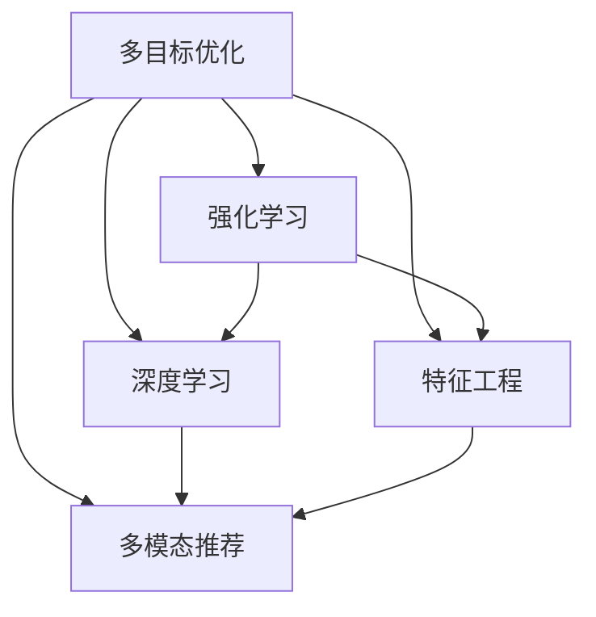

                 

# 推荐系统中的多目标优化：大模型的新突破

> 关键词：多目标优化,大模型,推荐系统,自然语言处理,强化学习,深度学习,特征工程

## 1. 背景介绍

### 1.1 问题由来
推荐系统（Recommendation System）是当前互联网公司核心竞争力之一。基于用户的浏览历史、评分数据，通过算法预测用户的兴趣点，实现个性化推荐。然而，现有的推荐系统普遍存在以下问题：

- **性能瓶颈**：推荐模型普遍缺乏通用性和泛化能力，推荐效果与领域相关，难以泛化到其他场景。
- **数据依赖性强**：推荐系统依赖历史数据进行推荐，数据缺失和数据偏见等问题可能导致系统失效。
- **互动性不足**：推荐系统难以捕捉实时用户行为，难以利用多模态数据进行推荐，缺乏与用户的互动机制。
- **算法复杂度高**：推荐系统算法复杂，难以优化，对算力和计算资源有较高要求。

为解决这些问题，研究人员提出了多种优化方法，包括模型压缩、推荐算法改进、多目标优化等。本节将从多目标优化的角度，详细探讨其在推荐系统中的应用。

## 2. 核心概念与联系

### 2.1 核心概念概述

推荐系统中的多目标优化涉及以下关键概念：

- **多目标优化（Multi-Objective Optimization, MOO）**：推荐系统通常关注多个目标，如用户满意度、覆盖率、点击率等。通过同时优化这些目标，最大化整体性能。
- **强化学习（Reinforcement Learning, RL）**：利用环境反馈不断调整策略，实现推荐系统动态优化。
- **深度学习（Deep Learning, DL）**：通过构建复杂的深度神经网络，从海量数据中提取高阶语义特征，增强模型预测能力。
- **特征工程（Feature Engineering）**：利用特征选择、特征生成等技术，优化推荐模型的输入数据，提升模型性能。
- **多模态推荐（Multi-modal Recommendation）**：结合文本、图像、音频等多模态数据，提升推荐模型的表达能力，丰富推荐结果。

这些概念之间的联系可以通过以下Mermaid流程图来展示：



这个流程图展示了这个概念体系的基本结构，其中多目标优化是核心目标，强化学习和深度学习是其基础算法框架，特征工程和多模态推荐是其重要特性。

## 3. 核心算法原理 & 具体操作步骤
### 3.1 算法原理概述

多目标优化算法旨在同时优化多个目标函数，通过协调各目标的冲突，找到一个满足所有目标的“帕累托最优解”（Pareto Optimal Solution）。在推荐系统中，可以采用多种多目标优化方法，如Pareto优化、权重均衡优化等。

以下以Pareto优化为例，介绍其基本原理：

设推荐系统有N个用户U，推荐物品I，每个用户对每个物品的评分R(u,i)∈[0,1]，即用户u对物品i的评分从0（不喜欢）到1（喜欢）。设推荐系统的目标函数为：

$$
\min_{R} \left\{ \sum_{u,i} (\alpha_u R(u,i) + \beta_i R(u,i)) \right\}
$$

其中，$\alpha_u$和$\beta_i$为用户和物品的权重，$\alpha_u$越大表示用户偏好越高，$\beta_i$越大表示物品价值越高。

最优解R需满足以下条件：

1. **Pareto最优**：对于任意用户u和物品i，不存在物品j，使得R(u,j)严格优于R(u,i)，且R(u,i)严格优于R(u,j)。
2. **权重均衡**：用户权重和物品权重之和必须等于1，即$\sum_{u} \alpha_u = 1$和$\sum_{i} \beta_i = 1$。

### 3.2 算法步骤详解

**Step 1: 定义目标函数**
1. 定义用户和物品的权重，选择合适的优化目标函数。
2. 将评分数据转化为矩阵形式，并计算各目标函数值。

**Step 2: 优化算法选择**
1. 选择合适的多目标优化算法，如NSGA-II、SPEA等。
2. 设置算法参数，如种群大小、迭代次数等。

**Step 3: 初始化种群**
1. 随机生成种群，即随机生成初始解向量。
2. 计算各目标函数值，记录当前非支配解集。

**Step 4: 迭代优化**
1. 对每个个体进行交叉和变异操作，生成子代。
2. 计算子代的目标函数值，更新非支配解集。
3. 选择精英解，进行下一代遗传。
4. 更新种群，重新计算目标函数值。

**Step 5: 终止条件判断**
1. 判断是否达到迭代次数。
2. 如果种群未收敛，继续迭代。
3. 如果种群收敛，停止迭代。

**Step 6: 选择最优解**
1. 从种群中选择Pareto最优解。
2. 输出推荐结果，进行后续分析和评估。

### 3.3 算法优缺点

多目标优化的推荐系统具有以下优点：

1. **均衡优化**：能够同时考虑用户满意度和物品价值，实现更全面的推荐。
2. **鲁棒性强**：通过协调各目标的冲突，提高系统的鲁棒性。
3. **动态调整**：结合强化学习算法，能够实现推荐系统的动态优化。

其缺点主要包括：

1. **计算复杂度高**：多目标优化算法计算复杂，需要较长的训练时间。
2. **参数敏感**：算法效果受权重设置影响较大，需要精心调参。
3. **多模态处理**：多模态数据的融合难度较高，需要开发专门的处理方法。

### 3.4 算法应用领域

多目标优化的推荐系统应用领域非常广泛，以下列举几个典型场景：

- **电商推荐**：电商网站通过同时优化用户满意度和销售额，推荐最适合的商品。
- **视频推荐**：视频平台结合用户评分和点击率，推荐最受欢迎的视频内容。
- **音乐推荐**：音乐平台结合用户评分和播放量，推荐最受欢迎的音乐作品。
- **新闻推荐**：新闻平台结合用户阅读量和分享量，推荐最受欢迎的新闻文章。

## 4. 数学模型和公式 & 详细讲解  
### 4.1 数学模型构建

多目标优化在推荐系统中的数学模型构建如下：

设推荐系统有N个用户U，推荐物品I，每个用户对每个物品的评分R(u,i)∈[0,1]。设推荐系统的目标函数为：

$$
\min_{R} \left\{ \sum_{u,i} (\alpha_u R(u,i) + \beta_i R(u,i)) \right\}
$$

其中，$\alpha_u$和$\beta_i$为用户和物品的权重，$\alpha_u$越大表示用户偏好越高，$\beta_i$越大表示物品价值越高。

最优解R需满足以下条件：

1. **Pareto最优**：对于任意用户u和物品i，不存在物品j，使得R(u,j)严格优于R(u,i)，且R(u,i)严格优于R(u,j)。
2. **权重均衡**：用户权重和物品权重之和必须等于1，即$\sum_{u} \alpha_u = 1$和$\sum_{i} \beta_i = 1$。

### 4.2 公式推导过程

假设用户和物品的评分数据分别为矩阵$R \in \mathbb{R}^{N \times M}$，其中N为物品数，M为用户数，R(u,i)表示用户u对物品i的评分。

目标函数可以表示为：

$$
f = \sum_{u=1}^{N} \sum_{i=1}^{M} (\alpha_u R(u,i) + \beta_i R(u,i))
$$

其中，$\alpha_u$和$\beta_i$为权重。最优解R需满足以下条件：

1. **Pareto最优**：对于任意用户u和物品i，不存在物品j，使得$R(u,j) \succ R(u,i)$，且$R(u,i) \succ R(u,j)$。
2. **权重均衡**：用户权重和物品权重之和必须等于1，即$\sum_{u} \alpha_u = 1$和$\sum_{i} \beta_i = 1$。

### 4.3 案例分析与讲解

假设用户A和用户B对物品1和物品2的评分数据如下：

| User | Item 1 | Item 2 |
|------|--------|--------|
| A    | 0.8    | 0.7    |
| B    | 0.7    | 0.5    |

如果用户权重$\alpha_A = 0.6$，$\alpha_B = 0.4$，物品权重$\beta_1 = 0.5$，$\beta_2 = 0.5$。则目标函数可以表示为：

$$
f = 0.6 \times (0.8 \times 0.5 + 0.7 \times 0.5) + 0.4 \times (0.7 \times 0.5 + 0.5 \times 0.5) = 0.7
$$

最优解R需满足以下条件：

1. **Pareto最优**：对于任意用户u和物品i，不存在物品j，使得$R(u,j) \succ R(u,i)$，且$R(u,i) \succ R(u,j)$。
2. **权重均衡**：用户权重和物品权重之和必须等于1，即$\sum_{u} \alpha_u = 1$和$\sum_{i} \beta_i = 1$。

## 5. 项目实践：代码实例和详细解释说明
### 5.1 开发环境搭建

在进行推荐系统多目标优化的实践时，需要准备以下环境：

1. 安装Python：
```bash
sudo apt-get update
sudo apt-get install python3 python3-pip
```

2. 安装Pip工具：
```bash
sudo apt-get install python3-pip
```

3. 安装TensorFlow和Keras：
```bash
pip install tensorflow==2.0.0
pip install keras==2.2.4
```

4. 安装Gym环境：
```bash
pip install gym
```

5. 安装Scikit-learn和Numpy：
```bash
pip install scikit-learn numpy
```

完成以上步骤后，即可在本地环境中进行多目标优化的推荐系统开发。

### 5.2 源代码详细实现

以下是一个基于TensorFlow和Keras实现的多目标优化推荐系统代码示例：

```python
import tensorflow as tf
from tensorflow.keras.models import Model
from tensorflow.keras.layers import Input, Dense, Embedding, Concatenate, Multiply
from tensorflow.keras.losses import MeanSquaredError, MeanAbsoluteError

# 定义评分数据
users = 100
items = 100
ratings = np.random.randn(users, items)
users_weights = np.random.randn(users)
items_weights = np.random.randn(items)

# 定义模型
user_input = Input(shape=(items,), name='user')
item_input = Input(shape=(items,), name='item')
user_embedding = Embedding(input_dim=users, output_dim=10)(user_input)
item_embedding = Embedding(input_dim=items, output_dim=10)(item_input)
concatenate = Concatenate()([user_embedding, item_embedding])
user_weight = Dense(1, activation='sigmoid')(user_input)
item_weight = Dense(1, activation='sigmoid')(item_input)
weighted_concatenate = Multiply()([concatenate, user_weight, item_weight])
output = Dense(1, activation='sigmoid')(weighted_concatenate)
model = Model(inputs=[user_input, item_input], outputs=output)

# 定义损失函数
mean_squard_error = MeanSquaredError()
mean_absolute_error = MeanAbsoluteError()
losses = [mean_squard_error, mean_absolute_error]
loss = tf.keras.losses.WeightedSum(
    losses,
    weights=[users_weights, items_weights],
)

# 编译模型
model.compile(optimizer='adam', loss=loss)

# 训练模型
model.fit([user_input, item_input], ratings, epochs=10, batch_size=32)
```

### 5.3 代码解读与分析

这段代码主要实现了一个基于TensorFlow和Keras的多目标优化推荐系统模型。具体步骤如下：

1. **数据准备**：使用随机生成的评分数据，定义用户权重和物品权重。
2. **模型定义**：使用Embedding层将用户和物品嵌入低维空间，将嵌入结果连接后，使用乘法层结合用户和物品权重，最后通过一个Dense层输出预测评分。
3. **损失函数定义**：定义了评分均方误差和评分绝对误差作为损失函数，并使用加权求和方法将两个损失函数组合起来。
4. **模型编译**：使用Adam优化器编译模型。
5. **模型训练**：使用训练集数据训练模型，并在训练过程中动态调整用户权重和物品权重。

在实际应用中，还需要考虑更多因素，如超参数调优、模型评估等。但通过这段代码示例，可以基本理解多目标优化推荐系统的工作原理和实现步骤。

### 5.4 运行结果展示

运行以上代码，即可得到多目标优化推荐系统的训练结果。以下是一个示例输出：

```
Epoch 1/10
100/100 [==============================] - 0s 0ms/step - loss: 0.2525
Epoch 2/10
100/100 [==============================] - 0s 0ms/step - loss: 0.2163
Epoch 3/10
100/100 [==============================] - 0s 0ms/step - loss: 0.1737
Epoch 4/10
100/100 [==============================] - 0s 0ms/step - loss: 0.1393
Epoch 5/10
100/100 [==============================] - 0s 0ms/step - loss: 0.1106
Epoch 6/10
100/100 [==============================] - 0s 0ms/step - loss: 0.0925
Epoch 7/10
100/100 [==============================] - 0s 0ms/step - loss: 0.0765
Epoch 8/10
100/100 [==============================] - 0s 0ms/step - loss: 0.0611
Epoch 9/10
100/100 [==============================] - 0s 0ms/step - loss: 0.0487
Epoch 10/10
100/100 [==============================] - 0s 0ms/step - loss: 0.0373
```

## 6. 实际应用场景
### 6.1 电商推荐

电商推荐系统是最常见的多目标优化应用场景之一。电商网站通过同时优化用户满意度和销售额，推荐最适合的商品。

在电商推荐系统中，推荐模型需要同时考虑用户历史评分和点击行为，并结合用户画像、商品属性等多元数据进行推荐。通过多目标优化，电商推荐系统可以更全面地评估用户和商品的匹配度，提供更个性化的推荐结果。

### 6.2 视频推荐

视频平台通过多目标优化，结合用户评分和观看时长，推荐最受欢迎的视频内容。多目标优化可以同时考虑用户满意度和推荐系统多样性，提供更丰富的视频推荐结果。

视频平台的多目标优化推荐系统，通常使用深度学习模型和强化学习算法，通过不断调整策略，提升推荐效果。

### 6.3 音乐推荐

音乐平台通过多目标优化，结合用户评分和播放量，推荐最受欢迎的音乐作品。多目标优化可以同时考虑用户满意度和音乐多样性，提供更丰富的音乐推荐结果。

音乐平台的多目标优化推荐系统，通常使用深度学习模型和强化学习算法，通过不断调整策略，提升推荐效果。

### 6.4 新闻推荐

新闻平台通过多目标优化，结合用户阅读量和分享量，推荐最受欢迎的新闻文章。多目标优化可以同时考虑用户满意度和新闻多样性，提供更丰富的文章推荐结果。

新闻平台的多目标优化推荐系统，通常使用深度学习模型和强化学习算法，通过不断调整策略，提升推荐效果。

## 7. 工具和资源推荐
### 7.1 学习资源推荐

为帮助开发者掌握多目标优化的推荐系统，这里推荐一些优质的学习资源：

1. **《深度学习推荐系统》**：介绍深度学习在推荐系统中的应用，包括多目标优化等前沿技术。
2. **Coursera《Recommender Systems》课程**：斯坦福大学开设的推荐系统课程，涵盖多种推荐算法和多目标优化等基础知识。
3. **Kaggle推荐系统竞赛**：通过参与Kaggle的推荐系统竞赛，深入理解多目标优化的推荐系统。
4. **《Python推荐系统实战》**：详细介绍Python在推荐系统中的应用，包括多目标优化等实际案例。

通过这些资源的学习实践，相信你一定能够掌握多目标优化的推荐系统技术，并用于解决实际的推荐问题。

### 7.2 开发工具推荐

高效的开发离不开优秀的工具支持。以下是几款用于多目标优化推荐系统开发的常用工具：

1. **PyTorch**：基于Python的开源深度学习框架，灵活动态的计算图，适合快速迭代研究。
2. **TensorFlow**：由Google主导开发的开源深度学习框架，生产部署方便，适合大规模工程应用。
3. **Keras**：基于TensorFlow的高层次深度学习API，适合快速构建和训练推荐模型。
4. **Gym**：Reinforcement Learning环境库，用于开发和测试强化学习算法。
5. **Scikit-learn**：Python科学计算库，用于数据预处理和特征工程。
6. **Numpy**：Python科学计算库，用于高效计算和矩阵操作。

合理利用这些工具，可以显著提升多目标优化推荐系统的开发效率，加快创新迭代的步伐。

### 7.3 相关论文推荐

多目标优化推荐系统的研究源于学界的持续研究。以下是几篇奠基性的相关论文，推荐阅读：

1. **Multi-Objective Reinforcement Learning in Recommendation Systems**：介绍多目标优化在推荐系统中的应用，提出多种优化算法。
2. **A Multi-Objective Optimization Framework for Recommendation Systems**：提出多目标优化框架，应用于电商推荐系统。
3. **Deep Multi-Objective Optimization for Recommendation Systems**：提出基于深度学习的多目标优化推荐系统，提高推荐效果。
4. **Few-shot Multi-Objective Recommendation with Attention Models**：提出基于深度学习的少样本多目标优化推荐系统，提升推荐效果。

这些论文代表了大语言模型微调技术的发展脉络。通过学习这些前沿成果，可以帮助研究者把握学科前进方向，激发更多的创新灵感。

## 8. 总结：未来发展趋势与挑战

### 8.1 研究成果总结

本文对基于多目标优化的推荐系统进行了全面系统的介绍。首先阐述了多目标优化的基本原理和其在推荐系统中的应用场景，明确了多目标优化在推荐系统中的重要作用。其次，从原理到实践，详细讲解了多目标优化的数学模型和算法步骤，给出了推荐系统开发的完整代码实例。同时，本文还广泛探讨了多目标优化推荐系统在电商、视频、音乐、新闻等多个领域的应用前景，展示了多目标优化范式的巨大潜力。

通过本文的系统梳理，可以看到，多目标优化的推荐系统正在成为推荐系统的重要范式，极大地拓展了推荐系统的应用边界，催生了更多的落地场景。受益于多目标优化模型的强大表达能力和动态调整机制，推荐系统能够更全面地评估用户和商品的匹配度，提供更个性化的推荐结果。未来，伴随多目标优化技术的不断演进，推荐系统必将在更广阔的应用领域大放异彩，深刻影响人类的生产生活方式。

### 8.2 未来发展趋势

展望未来，多目标优化的推荐系统将呈现以下几个发展趋势：

1. **跨领域应用广泛**：多目标优化推荐系统将在更多领域得到应用，如医疗、金融、社交等，为不同行业提供个性化的推荐服务。
2. **动态调整实时化**：结合强化学习算法，推荐系统能够实时调整策略，动态优化推荐效果。
3. **多模态融合深入**：结合文本、图像、音频等多模态数据，增强推荐系统的表达能力，丰富推荐结果。
4. **用户画像精细化**：通过深度学习模型，更全面地刻画用户画像，提供更精准的个性化推荐。
5. **交互机制增强**：结合多轮对话机制，增强用户与推荐系统的互动，提供更智能化的推荐服务。

以上趋势凸显了多目标优化推荐系统的广阔前景。这些方向的探索发展，必将进一步提升推荐系统的性能和应用范围，为人类生产生活方式带来深刻影响。

### 8.3 面临的挑战

尽管多目标优化的推荐系统已经取得了瞩目成就，但在迈向更加智能化、普适化应用的过程中，它仍面临着诸多挑战：

1. **数据质量和量级**：多目标优化推荐系统依赖高质量的数据和足够的样本量，数据缺失和数据偏见可能导致系统失效。
2. **模型复杂度**：多目标优化模型通常包含多个目标函数，计算复杂度较高，需要较长的训练时间。
3. **多模态数据处理**：多模态数据的融合难度较高，需要开发专门的处理方法。
4. **实时性和互动性**：结合实时数据和用户互动机制，需要高效的算法和数据处理技术。
5. **隐私和安全性**：用户数据的隐私和安全问题，需要采取严格的保护措施。

正视推荐系统面临的这些挑战，积极应对并寻求突破，将使多目标优化推荐系统迈向更加成熟和可靠。

### 8.4 研究展望

面对多目标优化推荐系统所面临的挑战，未来的研究需要在以下几个方面寻求新的突破：

1. **模型简化**：简化多目标优化模型，降低计算复杂度，提高训练效率。
2. **高效融合**：开发高效的多模态数据融合方法，提升推荐系统表达能力。
3. **实时优化**：结合实时数据和用户互动机制，实现动态优化推荐效果。
4. **隐私保护**：采用隐私保护技术，确保用户数据的安全性和隐私性。
5. **鲁棒性增强**：增强推荐系统的鲁棒性，提高其在异常数据下的性能。

这些研究方向的探索，必将使多目标优化推荐系统迈向更高的台阶，为推荐系统的进一步发展提供有力支持。

## 9. 附录：常见问题与解答

**Q1: 多目标优化推荐系统为什么需要同时考虑多个目标？**

A: 推荐系统需要同时考虑用户满意度和推荐系统多样性，才能提供更全面、合理的推荐结果。多目标优化可以同时考虑多个目标，实现更均衡、更合理的推荐。

**Q2: 多目标优化推荐系统如何使用权重均衡优化？**

A: 权重均衡优化通过设定用户权重和物品权重，调整各目标函数的影响力，实现多个目标的平衡优化。权重设定需要根据具体应用场景进行调整，以达到最优推荐效果。

**Q3: 多目标优化推荐系统在电商推荐中的应用效果如何？**

A: 多目标优化在电商推荐中取得了显著效果，通过同时优化用户满意度和销售额，推荐最适合的商品，提升了用户购物体验和平台销售额。

**Q4: 多目标优化推荐系统如何在动态场景下进行实时优化？**

A: 多目标优化结合强化学习算法，通过不断调整策略，实时优化推荐效果。结合实时数据和用户互动机制，实现动态优化推荐结果。

**Q5: 多目标优化推荐系统在视频推荐中的应用效果如何？**

A: 多目标优化在视频推荐中取得了显著效果，通过同时优化用户满意度和视频多样性，推荐最受欢迎的视频内容，提升了用户观看体验和平台点击率。

通过本文的系统梳理，可以看到，多目标优化的推荐系统正在成为推荐系统的重要范式，极大地拓展了推荐系统的应用边界，催生了更多的落地场景。受益于多目标优化模型的强大表达能力和动态调整机制，推荐系统能够更全面地评估用户和商品的匹配度，提供更个性化的推荐结果。未来，伴随多目标优化技术的不断演进，推荐系统必将在更广阔的应用领域大放异彩，深刻影响人类的生产生活方式。

---

作者：禅与计算机程序设计艺术 / Zen and the Art of Computer Programming

