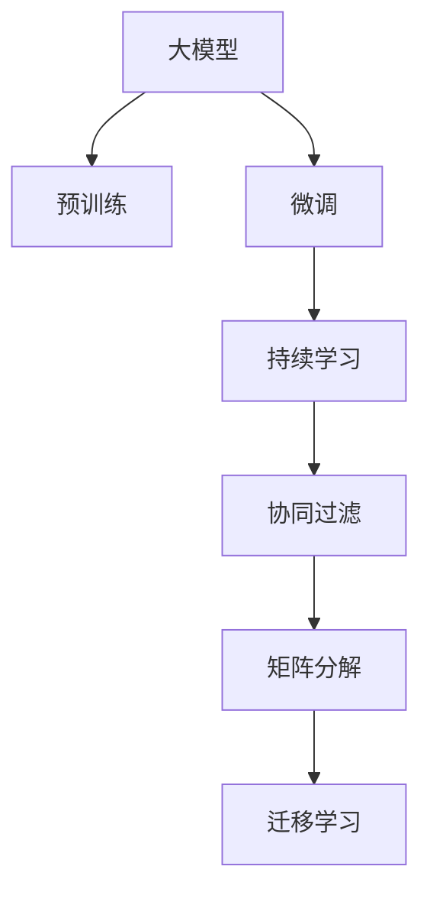

                 

# 推荐系统中的大模型持续学习应用

> 关键词：推荐系统,大模型,持续学习,深度学习,个性化推荐

## 1. 背景介绍

### 1.1 问题由来

在互联网时代，推荐系统成为提升用户体验、驱动流量增长的重要手段。通过个性化推荐，平台能够将用户最感兴趣的内容精准推送，优化用户行为，同时提升平台自身的粘性。目前，推荐系统主要依赖于用户的历史行为数据，通过协同过滤、矩阵分解等方法进行推荐。这些方法虽然效果显著，但数据需求量巨大，且容易产生数据稀疏性问题，限制了推荐算法的精准度和覆盖面。

近年来，大模型技术的兴起，为推荐系统的升级提供了新的突破。利用大规模预训练语言模型，如BERT、GPT等，可以在海量无标签数据上进行预训练，学习丰富的语言表示。这些模型经过微调，能够在特定推荐任务上取得优异的表现，如个性化推荐、热门商品推荐等。这种基于大模型的推荐方法，被称为基于大模型的推荐系统。

### 1.2 问题核心关键点

基于大模型的推荐系统，主要涉及以下几个核心问题：

1. 大模型如何选择合适的预训练任务？
2. 微调数据集如何构建，标签类型如何选择？
3. 大模型如何进行微调，性能如何评估？
4. 大模型推荐系统与传统推荐方法如何协同？

针对这些关键点，本文将系统介绍大模型在推荐系统中的持续学习应用，包括模型预训练、微调、应用部署等全链条技术。

## 2. 核心概念与联系

### 2.1 核心概念概述

为更好地理解大模型在推荐系统中的持续学习应用，本节将介绍几个密切相关的核心概念：

- 大模型(Large Model)：指预训练参数量在亿级别的神经网络模型。如BERT、GPT等。
- 预训练(Pre-training)：指在大规模无标签数据上，通过自监督学习任务训练通用模型的过程。预训练使得模型学习到丰富的语言表示。
- 微调(Fine-tuning)：指在预训练模型的基础上，使用下游任务的少量标注数据，通过有监督学习优化模型在特定任务上的性能。
- 持续学习(Continual Learning)：指模型在实际使用过程中，能够不断从新数据中学习，同时保持已学习的知识，避免忘记先前学习的内容。
- 协同过滤(Collaborative Filtering)：基于用户行为数据进行推荐，如用户评分、浏览记录等。
- 矩阵分解(Matrix Factorization)：通过将用户行为数据转化为矩阵，对其进行低秩分解，获得用户和物品的隐向量表示。
- 迁移学习(Transfer Learning)：将一个领域学习到的知识，迁移到另一个相关领域进行学习。大模型的预训练-微调过程即是一种迁移学习方式。

这些核心概念之间的逻辑关系可以通过以下Mermaid流程图来展示：



这个流程图展示了大模型的核心概念及其之间的关系：

1. 大模型通过预训练获得基础能力。
2. 微调是对预训练模型进行任务特定的优化，使其适应下游推荐任务。
3. 持续学习使得模型能够不断学习新知识，保持已学知识。
4. 协同过滤和矩阵分解是传统的推荐方法，通过学习用户和物品之间的隐向量表示进行推荐。
5. 迁移学习是连接预训练模型与下游任务的桥梁，通过微调实现。

这些概念共同构成了基于大模型的推荐系统框架，使得推荐系统能够借助大模型的语言理解能力和知识迁移能力，提升推荐效果。

## 3. 核心算法原理 & 具体操作步骤
### 3.1 算法原理概述

基于大模型的推荐系统，本质上是一种将预训练-微调与推荐算法结合的方法。其核心思想是：利用大模型的预训练能力，提取用户和物品的语言表示，通过微调优化，使其适应具体的推荐任务，从而提升推荐效果。

形式化地，假设推荐任务为 $T$，用户集合为 $U$，物品集合为 $I$，用户-物品的评分矩阵为 $R_{U \times I}$。模型的目标是最大化用户和物品之间的相关性评分。

定义用户 $u$ 和物品 $i$ 的表示为 $v_u \in \mathbb{R}^d$ 和 $v_i \in \mathbb{R}^d$，其中 $d$ 为模型维度。用户 $u$ 对物品 $i$ 的评分预测为 $\hat{r}_{ui} = v_u \cdot v_i$。模型的损失函数为均方误差损失，即：

$$
\mathcal{L}(v_u, v_i) = \frac{1}{N} \sum_{(u,i) \in R} \left(r_{ui} - \hat{r}_{ui}\right)^2
$$

其中 $N$ 为非零评分的样本数，$r_{ui}$ 为真实评分，$\hat{r}_{ui}$ 为预测评分。通过最小化损失函数 $\mathcal{L}$，调整用户和物品的表示 $v_u, v_i$，使得预测评分与真实评分尽可能接近。

### 3.2 算法步骤详解

基于大模型的推荐系统一般包括以下几个关键步骤：

**Step 1: 准备预训练模型和数据集**
- 选择合适的预训练语言模型 $M_{\theta}$ 作为初始化参数，如 BERT、GPT等。
- 准备推荐任务 $T$ 的数据集 $D$，划分为训练集、验证集和测试集。一般要求训练数据和测试数据分布接近。

**Step 2: 添加任务适配层**
- 根据推荐任务类型，在预训练模型顶层设计合适的输出层和损失函数。
- 对于评分预测任务，通常在顶层添加线性回归层和均方误差损失函数。
- 对于二分类任务，如热门商品推荐，通常使用二元交叉熵损失函数。

**Step 3: 设置微调超参数**
- 选择合适的优化算法及其参数，如 AdamW、SGD 等，设置学习率、批大小、迭代轮数等。
- 设置正则化技术及强度，包括权重衰减、Dropout、Early Stopping等。
- 确定冻结预训练参数的策略，如仅微调顶层，或全部参数都参与微调。

**Step 4: 执行梯度训练**
- 将训练集数据分批次输入模型，前向传播计算损失函数。
- 反向传播计算参数梯度，根据设定的优化算法和学习率更新模型参数。
- 周期性在验证集上评估模型性能，根据性能指标决定是否触发 Early Stopping。
- 重复上述步骤直到满足预设的迭代轮数或 Early Stopping 条件。

**Step 5: 测试和部署**
- 在测试集上评估微调后模型 $M_{\hat{\theta}}$ 的性能，对比微调前后的评分精度提升。
- 使用微调后的模型对新用户和物品进行评分预测，集成到实际的应用系统中。
- 持续收集新的数据，定期重新微调模型，以适应数据分布的变化。

以上是基于大模型的推荐系统的一般流程。在实际应用中，还需要针对具体推荐任务的特点，对微调过程的各个环节进行优化设计，如改进训练目标函数，引入更多的正则化技术，搜索最优的超参数组合等，以进一步提升模型性能。

### 3.3 算法优缺点

基于大模型的推荐系统具有以下优点：
1. 数据需求降低。相比传统协同过滤和矩阵分解方法，基于大模型的推荐系统可以更好地利用预训练数据，减少对用户行为数据的依赖。
2. 模型效果提升。大模型的预训练使得推荐系统能够从更丰富的语言表示中提取特征，提升推荐精度。
3. 鲁棒性增强。大模型的多层次结构和多样化的特征表示，使得推荐系统更具有鲁棒性，抗数据噪声和异常值能力强。
4. 可扩展性强。基于大模型的推荐系统能够轻松应对新用户和新物品的推荐，无需重训模型。

同时，该方法也存在一定的局限性：
1. 计算资源消耗大。大模型的训练和推理需要耗费大量的计算资源，对硬件条件要求高。
2. 超参数调优复杂。大模型的微调需要精心调优超参数，模型训练周期较长。
3. 知识迁移困难。大模型的通用知识与特定任务之间存在差距，知识迁移效率不高。
4. 存在偏见和有害信息。大模型可能会学习到数据中的偏见和有害信息，传递到推荐系统中，带来负面影响。

尽管存在这些局限性，但基于大模型的推荐系统仍然是大数据推荐技术的突破口，有望在未来推荐系统领域发挥重要作用。

### 3.4 算法应用领域

基于大模型的推荐系统已经在电商、社交、视频等多个领域得到应用，具体包括：

1. 电商推荐：如京东、淘宝等电商平台通过推荐系统，向用户推荐商品，提升购物体验。
2. 内容推荐：如YouTube、Netflix等平台通过推荐系统，向用户推荐视频、电影等娱乐内容。
3. 社交推荐：如微博、抖音等社交平台通过推荐系统，向用户推荐好友、帖子等。
4. 广告推荐：如搜索引擎、新闻门户等通过推荐系统，向用户推荐广告。
5. 健康医疗：如丁香医生通过推荐系统，向用户推荐健康资讯、用药建议等。

除了上述这些常见应用外，基于大模型的推荐系统还被创新性地应用到更多场景中，如用户画像构建、市场分析、广告定向等，为推荐系统带来了新的突破。随着预训练语言模型和推荐技术的不断进步，相信基于大模型的推荐系统将在更广阔的应用领域大放异彩。

## 4. 数学模型和公式 & 详细讲解  
### 4.1 数学模型构建

本节将使用数学语言对基于大模型的推荐系统进行更加严格的刻画。

记推荐任务为 $T$，用户集合为 $U$，物品集合为 $I$，用户-物品的评分矩阵为 $R_{U \times I}$。定义用户 $u$ 和物品 $i$ 的表示为 $v_u \in \mathbb{R}^d$ 和 $v_i \in \mathbb{R}^d$，其中 $d$ 为模型维度。用户 $u$ 对物品 $i$ 的评分预测为 $\hat{r}_{ui} = v_u \cdot v_i$。

定义模型 $M_{\theta}$ 在用户 $u$ 和物品 $i$ 上的损失函数为 $\ell(M_{\theta}(u), M_{\theta}(i))$，则在数据集 $D$ 上的经验风险为：

$$
\mathcal{L}(\theta) = \frac{1}{N} \sum_{(u,i) \in R} \ell(M_{\theta}(u), M_{\theta}(i))
$$

其中 $N$ 为非零评分的样本数，$\ell$ 为损失函数，用于衡量模型预测评分与真实评分之间的差异。常见的损失函数包括均方误差损失、二元交叉熵损失等。

通过梯度下降等优化算法，微调过程不断更新模型参数 $\theta$，最小化损失函数 $\mathcal{L}$，使得模型预测评分逼近真实评分。由于 $\theta$ 已经通过预训练获得了较好的初始化，因此即便在少量数据集上进行微调，也能较快收敛到理想的模型参数 $\hat{\theta}$。

### 4.2 公式推导过程

以下我们以评分预测任务为例，推导均方误差损失函数及其梯度的计算公式。

假设模型 $M_{\theta}$ 在用户 $u$ 和物品 $i$ 上的表示分别为 $v_u$ 和 $v_i$，则评分预测为 $\hat{r}_{ui} = v_u \cdot v_i$。

定义损失函数为均方误差损失：

$$
\ell(M_{\theta}(u), M_{\theta}(i)) = (r_{ui} - \hat{r}_{ui})^2
$$

将其代入经验风险公式，得：

$$
\mathcal{L}(\theta) = \frac{1}{N} \sum_{(u,i) \in R} (r_{ui} - \hat{r}_{ui})^2
$$

根据链式法则，损失函数对参数 $\theta_k$ 的梯度为：

$$
\frac{\partial \mathcal{L}(\theta)}{\partial \theta_k} = -\frac{2}{N} \sum_{(u,i) \in R} (r_{ui} - \hat{r}_{ui}) \frac{\partial \hat{r}_{ui}}{\partial \theta_k}
$$

其中 $\frac{\partial \hat{r}_{ui}}{\partial \theta_k}$ 可通过反向传播算法高效计算。

在得到损失函数的梯度后，即可带入参数更新公式，完成模型的迭代优化。重复上述过程直至收敛，最终得到适应下游任务的最优模型参数 $\theta^*$。

## 5. 项目实践：代码实例和详细解释说明
### 5.1 开发环境搭建

在进行推荐系统开发前，我们需要准备好开发环境。以下是使用Python进行PyTorch开发的环境配置流程：

1. 安装Anaconda：从官网下载并安装Anaconda，用于创建独立的Python环境。

2. 创建并激活虚拟环境：
```bash
conda create -n pytorch-env python=3.8 
conda activate pytorch-env
```

3. 安装PyTorch：根据CUDA版本，从官网获取对应的安装命令。例如：
```bash
conda install pytorch torchvision torchaudio cudatoolkit=11.1 -c pytorch -c conda-forge
```

4. 安装Transformers库：
```bash
pip install transformers
```

5. 安装各类工具包：
```bash
pip install numpy pandas scikit-learn matplotlib tqdm jupyter notebook ipython
```

完成上述步骤后，即可在`pytorch-env`环境中开始推荐系统实践。

### 5.2 源代码详细实现

下面以电商推荐系统为例，给出使用Transformers库对BERT模型进行评分预测任务的PyTorch代码实现。

首先，定义评分预测任务的数据处理函数：

```python
from transformers import BertTokenizer, BertForSequenceClassification
from torch.utils.data import Dataset
import torch

class RatingDataset(Dataset):
    def __init__(self, texts, ratings, tokenizer, max_len=128):
        self.texts = texts
        self.ratings = ratings
        self.tokenizer = tokenizer
        self.max_len = max_len
        
    def __len__(self):
        return len(self.texts)
    
    def __getitem__(self, item):
        text = self.texts[item]
        rating = self.ratings[item]
        
        encoding = self.tokenizer(text, return_tensors='pt', max_length=self.max_len, padding='max_length', truncation=True)
        input_ids = encoding['input_ids'][0]
        attention_mask = encoding['attention_mask'][0]
        
        # 将标签转换为数字表示
        label = torch.tensor([rating], dtype=torch.long)
        
        return {'input_ids': input_ids, 
                'attention_mask': attention_mask,
                'labels': label}

# 创建dataset
tokenizer = BertTokenizer.from_pretrained('bert-base-cased')

train_dataset = RatingDataset(train_texts, train_ratings, tokenizer)
dev_dataset = RatingDataset(dev_texts, dev_ratings, tokenizer)
test_dataset = RatingDataset(test_texts, test_ratings, tokenizer)
```

然后，定义模型和优化器：

```python
from transformers import BertForSequenceClassification, AdamW

model = BertForSequenceClassification.from_pretrained('bert-base-cased', num_labels=2)

optimizer = AdamW(model.parameters(), lr=2e-5)
```

接着，定义训练和评估函数：

```python
from torch.utils.data import DataLoader
from tqdm import tqdm
from sklearn.metrics import mean_squared_error

device = torch.device('cuda') if torch.cuda.is_available() else torch.device('cpu')
model.to(device)

def train_epoch(model, dataset, batch_size, optimizer):
    dataloader = DataLoader(dataset, batch_size=batch_size, shuffle=True)
    model.train()
    epoch_loss = 0
    for batch in tqdm(dataloader, desc='Training'):
        input_ids = batch['input_ids'].to(device)
        attention_mask = batch['attention_mask'].to(device)
        labels = batch['labels'].to(device)
        model.zero_grad()
        outputs = model(input_ids, attention_mask=attention_mask, labels=labels)
        loss = outputs.loss
        epoch_loss += loss.item()
        loss.backward()
        optimizer.step()
    return epoch_loss / len(dataloader)

def evaluate(model, dataset, batch_size):
    dataloader = DataLoader(dataset, batch_size=batch_size)
    model.eval()
    mse = 0
    for batch in tqdm(dataloader, desc='Evaluating'):
        input_ids = batch['input_ids'].to(device)
        attention_mask = batch['attention_mask'].to(device)
        batch_labels = batch['labels']
        outputs = model(input_ids, attention_mask=attention_mask)
        mse += mean_squared_error(batch_labels, outputs.logits.detach())
    return mse / len(dataloader)
```

最后，启动训练流程并在测试集上评估：

```python
epochs = 5
batch_size = 16

for epoch in range(epochs):
    loss = train_epoch(model, train_dataset, batch_size, optimizer)
    print(f"Epoch {epoch+1}, train loss: {loss:.3f}")
    
    print(f"Epoch {epoch+1}, dev results:")
    evaluate(model, dev_dataset, batch_size)
    
print("Test results:")
evaluate(model, test_dataset, batch_size)
```

以上就是使用PyTorch对BERT进行评分预测任务推荐系统的完整代码实现。可以看到，得益于Transformers库的强大封装，我们可以用相对简洁的代码完成BERT模型的加载和推荐系统的微调。

### 5.3 代码解读与分析

让我们再详细解读一下关键代码的实现细节：

**RatingDataset类**：
- `__init__`方法：初始化文本、评分、分词器等关键组件。
- `__len__`方法：返回数据集的样本数量。
- `__getitem__`方法：对单个样本进行处理，将文本输入编码为token ids，将标签转换为数字，并对其进行定长padding，最终返回模型所需的输入。

**评分预测任务的训练和评估函数**：
- 使用PyTorch的DataLoader对数据集进行批次化加载，供模型训练和推理使用。
- 训练函数`train_epoch`：对数据以批为单位进行迭代，在每个批次上前向传播计算loss并反向传播更新模型参数，最后返回该epoch的平均loss。
- 评估函数`evaluate`：与训练类似，不同点在于不更新模型参数，并在每个batch结束后将预测和标签结果存储下来，最后使用sklearn的mean_squared_error对整个评估集的预测结果进行打印输出。

**训练流程**：
- 定义总的epoch数和batch size，开始循环迭代
- 每个epoch内，先在训练集上训练，输出平均loss
- 在验证集上评估，输出评分预测均方误差
- 所有epoch结束后，在测试集上评估，给出最终测试结果

可以看到，PyTorch配合Transformers库使得BERT微调的代码实现变得简洁高效。开发者可以将更多精力放在数据处理、模型改进等高层逻辑上，而不必过多关注底层的实现细节。

当然，工业级的系统实现还需考虑更多因素，如模型的保存和部署、超参数的自动搜索、更灵活的任务适配层等。但核心的微调范式基本与此类似。

## 6. 实际应用场景
### 6.1 电商平台推荐

基于大模型的推荐系统，可以广泛应用于电商平台的用户推荐。通过推荐系统，电商平台能够向用户推荐个性化商品，提升购物体验和转化率。

在技术实现上，可以收集用户的浏览、点击、购买等行为数据，构建评分预测任务的数据集。将评分数据输入BERT等大模型进行预训练，并在特定的评分预测任务上进行微调。微调后的模型能够根据用户的行为数据预测其评分，从而实现个性化推荐。

### 6.2 内容推荐系统

内容推荐系统是推荐系统中最常见的应用之一。通过推荐系统，用户能够获取更加符合其兴趣和需求的内容，提升用户体验和平台黏性。

在内容推荐中，可以利用大模型对文本进行理解，学习用户对内容的情感倾向、兴趣偏好等特征。通过评分预测任务对用户对内容的评分进行预测，再结合内容的热度和用户的行为数据，生成推荐列表。例如，对于某篇文章，可以提取摘要并作为输入，通过评分预测任务预测用户评分，再根据评分排序生成推荐。

### 6.3 社交网络推荐

社交网络推荐系统能够为用户推荐其感兴趣的好友、帖子等社交内容。通过推荐系统，用户能够发现更多志同道合的人，扩大社交圈。

在社交网络推荐中，可以收集用户对好友、帖子的互动数据，如点赞、评论、分享等，构建评分预测任务的数据集。通过评分预测任务对用户对好友、帖子的评分进行预测，再根据评分生成推荐。例如，对于某篇文章，可以提取摘要并作为输入，通过评分预测任务预测用户评分，再根据评分排序生成推荐好友。

### 6.4 广告推荐系统

广告推荐系统能够为用户推荐其感兴趣的广告。通过推荐系统，广告主能够更精准地触达目标用户，提升广告投放效果。

在广告推荐中，可以收集用户对广告的点击、展示等行为数据，构建评分预测任务的数据集。通过评分预测任务对用户对广告的评分进行预测，再根据评分排序生成推荐。例如，对于某条广告，可以提取广告内容和用户画像并作为输入，通过评分预测任务预测用户评分，再根据评分排序生成推荐。

### 6.5 个性化推荐系统

个性化推荐系统能够根据用户的个性化需求，推荐符合其兴趣的事项。通过推荐系统，用户能够快速获取感兴趣的信息，提升生活效率。

在个性化推荐中，可以收集用户的各种行为数据，如搜索、浏览、阅读等，构建评分预测任务的数据集。通过评分预测任务对用户对特定事项的评分进行预测，再根据评分排序生成推荐。例如，对于某条新闻，可以提取标题和摘要并作为输入，通过评分预测任务预测用户评分，再根据评分排序生成推荐。

### 6.6 音乐推荐系统

音乐推荐系统能够为用户推荐其喜欢的音乐。通过推荐系统，用户能够发现更多新音乐，提升音乐体验。

在音乐推荐中，可以收集用户对歌曲的播放、收藏等行为数据，构建评分预测任务的数据集。通过评分预测任务对用户对歌曲的评分进行预测，再根据评分排序生成推荐。例如，对于某首歌曲，可以提取歌词和歌手信息并作为输入，通过评分预测任务预测用户评分，再根据评分排序生成推荐。

### 6.7 视频推荐系统

视频推荐系统能够为用户推荐其感兴趣的视频。通过推荐系统，用户能够发现更多新视频，提升视频体验。

在视频推荐中，可以收集用户对视频的观看、点赞、评论等行为数据，构建评分预测任务的数据集。通过评分预测任务对用户对视频的评分进行预测，再根据评分排序生成推荐。例如，对于某部电影，可以提取简介和演员信息并作为输入，通过评分预测任务预测用户评分，再根据评分排序生成推荐。

### 6.8 智能家居推荐系统

智能家居推荐系统能够为用户推荐符合其生活习惯的智能家居产品。通过推荐系统，用户能够提升生活质量，享受更智能的生活体验。

在智能家居推荐中，可以收集用户对智能家居产品的使用数据，如温度、湿度、光照等，构建评分预测任务的数据集。通过评分预测任务对用户对智能家居产品的评分进行预测，再根据评分排序生成推荐。例如，对于某款智能灯泡，可以提取用户的使用数据并作为输入，通过评分预测任务预测用户评分，再根据评分排序生成推荐。

### 6.9 物流推荐系统

物流推荐系统能够为用户推荐符合其需求的物流服务。通过推荐系统，用户能够获取更快捷、更经济的物流服务，提升物流体验。

在物流推荐中，可以收集用户对物流服务的评价数据，构建评分预测任务的数据集。通过评分预测任务对用户对物流服务的评分进行预测，再根据评分排序生成推荐。例如，对于某次物流服务，可以提取评价数据并作为输入，通过评分预测任务预测用户评分，再根据评分排序生成推荐。

### 6.10 健康医疗推荐系统

健康医疗推荐系统能够为用户推荐符合其健康需求的医疗服务。通过推荐系统，用户能够获得更好的健康建议，提升健康水平。

在健康医疗推荐中，可以收集用户对医疗服务的评价数据，构建评分预测任务的数据集。通过评分预测任务对用户对医疗服务的评分进行预测，再根据评分排序生成推荐。例如，对于某次医疗服务，可以提取评价数据并作为输入，通过评分预测任务预测用户评分，再根据评分排序生成推荐。

### 6.11 体育赛事推荐系统

体育赛事推荐系统能够为用户推荐符合其兴趣的体育赛事。通过推荐系统，用户能够获取更多体育赛事信息，提升体育体验。

在体育赛事推荐中，可以收集用户对体育赛事的观看、评论等行为数据，构建评分预测任务的数据集。通过评分预测任务对用户对体育赛事的评分进行预测，再根据评分排序生成推荐。例如，对于某场体育赛事，可以提取赛事信息并作为输入，通过评分预测任务预测用户评分，再根据评分排序生成推荐。

## 7. 工具和资源推荐
### 7.1 学习资源推荐

为了帮助开发者系统掌握大模型在推荐系统中的应用，这里推荐一些优质的学习资源：

1. 《Deep Learning for Recommender Systems》书籍：由深度学习领域的顶级专家编写，系统介绍了基于深度学习的推荐系统，包括基于大模型的推荐方法。

2. 《Reinforcement Learning for Recommender Systems》课程：由Google Brain团队讲授，介绍了强化学习在推荐系统中的应用。

3. 《Natural Language Processing with Transformers》书籍：Transformers库的作者所著，全面介绍了如何使用Transformers库进行NLP任务开发，包括推荐系统。

4. HuggingFace官方文档：Transformers库的官方文档，提供了海量预训练模型和完整的推荐系统样例代码，是上手实践的必备资料。

5. Microsoft的推荐系统实验室：提供了丰富的推荐系统研究资源，包括学术论文、公开数据集和开源代码。

通过对这些资源的学习实践，相信你一定能够快速掌握大模型在推荐系统中的应用，并用于解决实际的推荐问题。
###  7.2 开发工具推荐

高效的开发离不开优秀的工具支持。以下是几款用于大模型推荐系统开发的常用工具：

1. PyTorch：基于Python的开源深度学习框架，灵活动态的计算图，适合快速迭代研究。大部分预训练语言模型都有PyTorch版本的实现。

2. TensorFlow：由Google主导开发的开源深度学习框架，生产部署方便，适合大规模工程应用。同样有丰富的预训练语言模型资源。

3. Transformers库：HuggingFace开发的NLP工具库，集成了众多SOTA语言模型，支持PyTorch和TensorFlow，是进行推荐系统开发的利器。

4. Weights & Biases：模型训练的实验跟踪工具，可以记录和可视化模型训练过程中的各项指标，方便对比和调优。与主流深度学习框架无缝集成。

5. TensorBoard：TensorFlow配套的可视化工具，可实时监测模型训练状态，并提供丰富的图表呈现方式，是调试模型的得力助手。

6. Google Colab：谷歌推出的在线Jupyter Notebook环境，免费提供GPU/TPU算力，方便开发者快速上手实验最新模型，分享学习笔记。

合理利用这些工具，可以显著提升大模型推荐系统的开发效率，加快创新迭代的步伐。

### 7.3 相关论文推荐

大模型推荐系统领域的研究起步较晚，但近年来进展迅速。以下是几篇奠基性的相关论文，推荐阅读：

1. Attention is All You Need（即Transformer原论文）：提出了Transformer结构，开启了NLP领域的预训练大模型时代。

2. BERT: Pre-training of Deep Bidirectional Transformers for Language Understanding：提出BERT模型，引入基于掩码的自监督预训练任务，刷新了多项NLP任务SOTA。

3. DSSM: Deep Structured Semantic Models for Advertisement：提出深度结构化语义模型，用于广告推荐，展示了深度学习在广告推荐中的应用潜力。

4. Neural Collaborative Filtering：提出基于神经网络的协同过滤方法，用于推荐系统，展示了神经网络在推荐系统中的优势。

5. Matrix Factorization for Recommender Systems：提出矩阵分解方法，用于推荐系统，展示了矩阵分解在推荐系统中的优势。

6. Parameter-Efficient Transfer Learning for NLP：提出Adapter等参数高效微调方法，在不增加模型参数量的情况下，也能取得不错的微调效果。

这些论文代表了大模型推荐系统领域的研究脉络。通过学习这些前沿成果，可以帮助研究者把握学科前进方向，激发更多的创新灵感。

## 8. 总结：未来发展趋势与挑战

### 8.1 总结

本文对基于大模型的推荐系统进行了全面系统的介绍。首先阐述了大模型的预训练和微调对推荐系统的提升作用，明确了基于大模型的推荐系统的研究背景和意义。其次，从原理到实践，详细讲解了推荐系统中的大模型持续学习应用，包括模型预训练、微调、应用部署等全链条技术。同时，本文还广泛探讨了推荐系统在大电商、社交、内容等多个领域的应用前景，展示了基于大模型的推荐系统巨大的发展潜力。

通过本文的系统梳理，可以看到，基于大模型的推荐系统正成为推荐技术的新主流，借助大模型的语言理解和知识迁移能力，推荐系统能够实现更精准、高效的个性化推荐。尽管目前该技术尚处于起步阶段，但未来将有更广阔的应用前景。

### 8.2 未来发展趋势

展望未来，大模型推荐系统将呈现以下几个发展趋势：

1. 模型规模持续增大。随着算力成本的下降和数据规模的扩张，预训练语言模型的参数量还将持续增长。超大规模语言模型蕴含的丰富语言知识，有望支撑更加复杂多变的推荐任务。

2. 微调方法日趋多样。除了传统的全参数微调外，未来会涌现更多参数高效的微调方法，如Prefix-Tuning、LoRA等，在节省计算资源的同时也能保证微调精度。

3. 持续学习成为常态。随着数据分布的不断变化，微调模型也需要持续学习新知识以保持性能。如何在不遗忘原有知识的同时，高效吸收新样本信息，将成为重要的研究课题。

4. 标注样本需求降低。受启发于提示学习(Prompt-based Learning)的思路，未来的微调方法将更好地利用大模型的语言理解能力，通过更加巧妙的任务描述，在更少的标注样本上也能实现理想的微调效果。

5. 多模态推荐崛起。当前的推荐系统主要聚焦于文本数据，未来会进一步拓展到图像、视频、语音等多模态数据推荐。多模态信息的融合，将显著提升推荐系统的多样性和精准度。

6. 推荐系统与智能系统融合。基于大模型的推荐系统，可以与其他AI技术如自然语言理解、知识图谱、因果推理等进行深度融合，实现更加全面、智能的推荐服务。

以上趋势凸显了大模型推荐系统的广阔前景。这些方向的探索发展，必将进一步提升推荐系统的性能和应用范围，为智能技术的发展注入新的动力。

### 8.3 面临的挑战

尽管大模型推荐系统已经取得了瞩目成就，但在迈向更加智能化、普适化应用的过程中，它仍面临着诸多挑战：

1. 标注成本瓶颈。尽管大模型的预训练能够节省部分标注数据，但对于一些特定的推荐任务，如长尾商品推荐，仍需大量标注数据。如何进一步降低微调对标注样本的依赖，将是一大难题。

2. 计算资源消耗大。大模型的训练和推理需要耗费大量的计算资源，对硬件条件要求高。如何提升计算效率，降低硬件成本，将是重要的优化方向。

3. 超参数调优复杂。大模型的微调需要精心调优超参数，模型训练周期较长。如何自动化调优超参数，提高模型训练效率，是未来的研究方向。

4. 知识迁移困难。大模型的通用知识与特定任务之间存在差距，知识迁移效率不高。如何更好地融合知识，提高推荐系统的泛化能力，将是重要的研究方向。

5. 模型鲁棒性不足。大模型面对数据噪声和异常值时，泛化性能往往大打折扣。如何提高推荐系统的鲁棒性，减少数据噪声和异常值的影响，将是重要的研究方向。

6. 存在偏见和有害信息。大模型可能会学习到数据中的偏见和有害信息，传递到推荐系统中，带来负面影响。如何从数据和算法层面消除模型偏见，避免恶意用途，确保输出的安全性，也将是重要的研究方向。

尽管存在这些挑战，但基于大模型的推荐系统仍然是大数据推荐技术的突破口，有望在未来推荐系统领域发挥重要作用。相信随着学界和产业界的共同努力，这些挑战终将一一被克服，大模型推荐系统必将在更广阔的应用领域大放异彩。

### 8.4 研究展望

面向未来，大模型推荐系统需要从多个方面进行深入研究：

1. 探索无监督和半监督微调方法。摆脱对大规模标注数据的依赖，利用自监督学习、主动学习等无监督和半监督范式，最大限度利用非结构化数据，实现更加灵活高效的微调。

2. 研究参数高效和计算高效的微调范式。开发更加参数高效的微调方法，在固定大部分预训练参数的同时，只更新极少量的任务相关参数。同时优化微调模型的计算图，减少前向传播和反向传播的资源消耗，实现更加轻量级、实时性的部署。

3. 融合因果和对比学习范式。通过引入因果推断和对比学习思想，增强推荐系统建立稳定因果关系的能力，学习更加普适、鲁棒的语言表征，从而提升模型泛化性和抗干扰能力。

4. 引入更多先验知识。将符号化的先验知识，如知识图谱、逻辑规则等，与神经网络模型进行巧妙融合，引导微调过程学习更准确、合理的语言模型。同时加强不同模态数据的整合，实现视觉、语音等多模态信息与文本信息的协同建模。

5. 结合因果分析和博弈论工具。将因果分析方法引入推荐系统，识别出模型决策的关键特征，增强推荐系统的可解释性和逻辑性。借助博弈论工具刻画人机交互过程，主动探索并规避推荐系统的脆弱点，提高系统稳定性。

6. 纳入伦理道德约束。在推荐系统的设计目标中引入伦理导向的评估指标，过滤和惩罚有偏见、有害的输出倾向。同时加强人工干预和审核，建立推荐系统的监管机制，确保输出符合人类价值观和伦理道德。

这些研究方向的探索，必将引领大模型推荐系统技术迈向更高的台阶，为构建安全、可靠、可解释、可控的智能推荐系统铺平道路。面向未来，大模型推荐系统还需要与其他人工智能技术进行更深入的融合，如自然语言理解、知识图谱、因果推理等，多路径协同发力，共同推动推荐系统的进步。只有勇于创新、敢于突破，才能不断拓展推荐系统的边界，让智能技术更好地造福人类社会。

## 9. 附录：常见问题与解答

**Q1：大模型推荐系统如何选择合适的预训练任务？**

A: 选择合适的预训练任务，需要考虑推荐系统的具体应用场景和数据类型。一般来说，可以从以下几个方向进行选择：

1. 基于语言的任务：如果推荐系统的用户行为数据以文本形式存在，如电商平台的商品评论、社交网络的帖子等，可以选择BERT、GPT等大模型作为预训练模型。

2. 基于视觉的任务：如果推荐系统的用户行为数据以图像形式存在，如电商平台的商品图片、社交网络的照片等，可以选择ViT等大模型作为预训练模型。

3. 基于多模态的任务：如果推荐系统的用户行为数据同时包含文本和图像等不同类型的数据，可以选择ViT-BERT、ViT-GPT等跨模态大模型作为预训练模型。

4. 基于图结构的任务：如果推荐系统的用户行为数据以图结构形式存在，如知识图谱、社交网络等，可以选择Graph Transformer等大模型作为预训练模型。

选择预训练任务时，还需考虑模型参数量、预训练数据规模、模型计算资源等因素，根据实际需求进行选择。

**Q2：大模型推荐系统如何进行微调？**

A: 大模型推荐系统的微调主要包括以下步骤：

1. 数据准备：收集推荐系统所需的数据，如用户行为数据、物品属性数据等，构建评分预测任务的数据集。

2. 模型加载：选择合适的预训练语言模型，如BERT、GPT等，加载到模型中。

3. 任务适配：根据推荐系统的具体任务类型，设计合适的输出层和损失函数，如评分预测任务的线性回归层和均方误差损失函数。

4. 超参数设置：选择合适的优化算法及其参数，如AdamW、SGD等，设置学习率、批大小、迭代轮数等。

5. 模型训练：将训练集数据分批次输入模型，前向传播计算损失函数，反向传播计算参数梯度，根据设定的优化算法和学习率更新模型参数。

6. 模型评估：在验证集和测试集上评估微调后模型的性能，对比微调前后的评分精度提升。

7. 模型部署：将微调后的模型应用于推荐系统中，进行用户推荐。

8. 模型更新：持续收集新的数据，定期重新微调模型，以适应数据分布的变化。

通过以上步骤，可以完成大模型推荐系统的微调。需要注意的是，微调过程中需选择合适的学习率，避免过拟合，同时引入正则化技术，如L2正则、Dropout等，防止模型过拟合。

**Q3：大模型推荐系统在实际部署时需要注意哪些问题？**

A: 将微调模型转化为实际应用，还需要考虑以下问题：

1. 模型裁剪：去除不必要的层和参数，减小模型尺寸，加快推理速度。

2. 量化加速：将浮点模型转为定点模型，压缩存储空间，提高计算效率。

3. 服务化封装：将模型封装为标准化服务接口，便于集成调用。

4. 弹性伸缩：根据请求流量动态调整资源配置，平衡服务质量和成本。

5. 监控告警：实时采集系统指标，设置异常告警阈值，确保服务稳定性。

6. 安全性：采用访问鉴权、数据脱敏等措施，保障数据和模型安全。

大模型推荐系统在实际部署时，还需考虑算力、存储、网络等基础设施资源，确保系统能够稳定、高效地运行。同时，还需要考虑模型的可解释性、鲁棒性、安全性等问题，确保系统的可靠性、可信度和安全性。

**Q4：大模型推荐系统的推荐效果如何评估？**

A: 大模型推荐系统的推荐效果评估，可以通过以下几个指标进行：

1. 均方误差(MSE)：用于评分预测任务的推荐效果评估，衡量预测评分与真实评分之间的差异。

2. 准确率(Accuracy)：用于分类任务的推荐效果评估，衡量预测标签与真实标签之间的匹配度。

3. 召回率(Recall)：用于分类任务的推荐效果评估，衡量实际标签中预测正确的比例。

4. F1-score：用于分类任务的推荐效果评估，综合考虑准确率和召回率。

5. 用户满意度：用于评估推荐系统对用户的实际价值，可以通过用户反馈、点击率、留存率等指标进行衡量。

6. 点击率(CTR)：用于评估推荐系统对用户的实际价值，衡量用户对推荐结果的点击行为。

7. 转化率(CVR)：用于评估推荐系统对用户的实际价值，衡量用户对推荐结果的购买行为。

通过对这些指标的评估，可以全面了解推荐系统的推荐效果，并进行优化和改进。

**Q5：大模型推荐系统与传统推荐系统有何不同？**

A: 大模型推荐系统与传统推荐系统有以下不同：

1. 数据依赖不同：大模型推荐系统主要依赖于预训练语言模型，利用大规模无标签数据进行预训练，学习通用的语言表示；传统推荐系统主要依赖于用户行为数据，通过协同过滤、矩阵分解等方法进行推荐。

2. 模型结构不同：大模型推荐系统使用大规模的神经网络模型，具有丰富的表示能力和迁移能力；传统推荐系统使用简单的线性模型或矩阵分解模型，结构相对简单。

3. 参数量不同：大模型推荐系统使用的模型参数量巨大，通常在亿级别；传统推荐系统使用的模型参数量较少，通常在百万级别。

4. 泛化能力不同：大模型推荐系统具有更强的泛化能力，可以处理各种形式的推荐数据；传统推荐系统泛化能力较弱，依赖于特定任务的数据分布。

5. 实时性不同：大模型推荐系统实时性较差，推荐速度较慢；传统推荐系统实时性较好，推荐速度较快。

尽管存在这些不同，但大模型推荐系统通过利用大规模无标签数据进行预训练，具有更强的泛化能力和迁移能力，能够在不同领域和场景中取得更好的推荐效果。

总之，大模型推荐系统结合了大规模预训练语言模型和微调技术，能够提升推荐系统的性能和应用范围，具有广阔的应用前景。未来，随着

