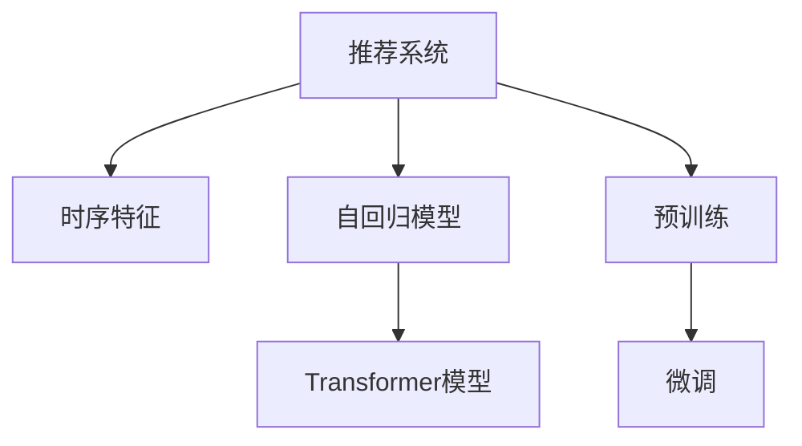

                 

# 推荐系统中的时序依赖：AI大模型的新解决方案

> 关键词：推荐系统,时序依赖,时序特征,时间序列,自回归模型,Transformer,预训练,微调

## 1. 背景介绍

### 1.1 问题由来

推荐系统是互联网应用中最具代表性的技术之一，被广泛应用于电商、社交网络、新闻聚合、视频平台等多个领域。传统推荐系统主要依赖用户的历史行为数据（如点击、浏览、评分等）进行推荐。然而，随着用户行为数据量的激增，以及个性化需求的不断提升，传统的基于静态历史数据的推荐方法已无法满足用户日益复杂的交互需求。

为了解决这一问题，研究人员开始探索更丰富的特征来源，以及更复杂的推荐模型，力图在推荐结果的丰富性和准确性之间找到最佳平衡。在这其中，时序特征因其对用户行为模式和动态变化具有显著的解释能力，成为了推荐系统研究的热点。利用时序特征，推荐系统可以更好地捕捉用户行为的时间规律，提高推荐精度。

但时序特征的建模并非易事，特别是当数据的时间跨度较大，特征维度较高时。传统的统计方法和机器学习模型难以有效处理这种大规模、高维度的时间序列数据，导致推荐的准确性和实时性受到限制。近年来，人工智能大模型在处理大规模数据集方面的卓越表现，为推荐系统中的时序建模提供了新的解决方案。

### 1.2 问题核心关键点

本文聚焦于利用人工智能大模型对推荐系统中的时序依赖进行建模和预测。具体问题包括：
- 如何构建高效的时序特征提取方法？
- 如何设计有效的时序依赖模型？
- 如何将大模型的预训练知识迁移到特定任务上？
- 如何在推荐系统中高效实现时序特征的提取和利用？

本文将从这些问题入手，全面介绍推荐系统中利用人工智能大模型进行时序依赖建模的方法和应用，旨在为推荐系统研究者提供一种新范式，推动其朝着更加智能化、精准化的方向发展。

## 2. 核心概念与联系

### 2.1 核心概念概述

在推荐系统中，时序依赖建模涉及以下关键概念：

- **推荐系统(Recommender System)**：根据用户的历史行为数据，为其推荐最相关的物品。推荐系统分为内容推荐、协同过滤、混合推荐等多种类型。
- **时序特征(Time Series Feature)**：描述用户行为时间规律的非结构化数据，包括用户行为的时间点、持续时间、周期性等特征。
- **自回归模型(Autoregressive Model)**：基于历史行为预测未来行为的模型，例如ARIMA、RNN等。
- **Transformer模型**：一种基于自注意力机制的深度学习模型，适用于处理大规模时间序列数据。
- **预训练(Pre-training)**：在大量无标签数据上进行自监督学习，学习通用的语言或数据表示，再微调应用于特定任务。
- **微调(Fine-tuning)**：在预训练模型的基础上，通过少量标注数据进行有监督学习，优化模型在特定任务上的性能。

这些概念之间的逻辑关系可以通过以下Mermaid流程图来展示：



这个流程图展示了大语言模型在推荐系统中的应用过程：

1. 推荐系统从用户历史行为数据中提取时序特征。
2. 利用自回归模型对时序数据进行建模，预测用户未来行为。
3. 使用Transformer模型，对时序特征进行提取和编码，学习复杂的依赖关系。
4. 通过预训练-微调范式，将大模型的知识迁移到推荐任务上，提升模型性能。

## 3. 核心算法原理 & 具体操作步骤
### 3.1 算法原理概述

推荐系统中的时序依赖建模，核心在于构建一种能够有效捕捉和预测时序特征的深度学习模型。常见的方法包括自回归模型、卷积神经网络(CNN)、递归神经网络(RNN)等。这些方法均基于历史数据预测未来行为，但存在模型复杂度高、计算资源消耗大等问题。

近年来，基于Transformer模型的深度学习架构在自然语言处理(NLP)领域取得了显著的突破，显示出在处理大规模时序数据方面的强大能力。因此，本文将重点介绍利用Transformer模型构建时序依赖推荐模型的方法。

### 3.2 算法步骤详解

构建基于Transformer的时序依赖推荐模型，主要包括以下几个关键步骤：

**Step 1: 数据预处理**

- **数据清洗**：去除噪声和缺失值，标准化数据格式。
- **分词和时间戳对齐**：将文本数据分词，确保时间戳对齐。
- **序列填充和截断**：对时间序列进行填充和截断，确保序列长度一致。

**Step 2: 特征提取**

- **时序特征编码**：将时间戳、文本等信息编码为向量形式。
- **Transformer编码器**：利用Transformer模型的自注意力机制，对时序特征进行编码。

**Step 3: 模型训练**

- **预训练**：在大规模无标签数据上预训练Transformer模型，学习通用的时间序列表示。
- **微调**：在推荐任务上微调预训练模型，优化模型在特定任务上的性能。

**Step 4: 模型评估**

- **性能评估**：使用精确率、召回率、F1-score等指标评估模型性能。
- **指标监控**：实时监控模型表现，及时调整模型参数和训练策略。

**Step 5: 在线服务**

- **部署和集成**：将训练好的模型部署到生产环境，集成到推荐系统服务中。
- **实时推理**：使用训练好的模型进行实时推理，为每个用户推荐最相关的物品。

### 3.3 算法优缺点

基于Transformer的时序依赖推荐模型具有以下优点：

- **高效特征提取**：利用Transformer的自注意力机制，可以高效地提取高维度时序特征，适用于大规模数据。
- **强大的表示能力**：Transformer能够学习到复杂的依赖关系，捕捉长时序模式。
- **可迁移性强**：预训练模型可以迁移到不同领域和任务，提升模型泛化能力。

但该方法也存在一定的局限性：

- **计算复杂度高**：Transformer模型参数量较大，训练和推理速度较慢。
- **依赖大量数据**：模型需要大量的标注数据进行微调，对数据集质量要求高。
- **模型复杂度**：模型结构复杂，模型调优和调试较为困难。

### 3.4 算法应用领域

基于Transformer的时序依赖推荐模型，已经在电商、新闻推荐、音乐推荐、视频推荐等多个领域得到了广泛应用。

- **电商推荐**：利用用户浏览、点击、购买等行为数据，为每个用户推荐相关商品。
- **新闻推荐**：根据用户的历史阅读行为和兴趣标签，推荐最相关的新闻文章。
- **音乐推荐**：根据用户的历史听歌行为和喜好，推荐相似的音乐作品。
- **视频推荐**：根据用户的观看历史和评分数据，推荐感兴趣的视频内容。

这些领域的推荐系统均利用时序特征和Transformer模型，在提升推荐准确性和用户满意度方面取得了显著效果。未来，随着Transformer模型和推荐技术的持续发展，时序依赖推荐模型将进一步拓展应用范围，带来更丰富、更精准的推荐服务。

## 4. 数学模型和公式 & 详细讲解 & 举例说明

### 4.1 数学模型构建

推荐系统中的时序依赖建模，主要涉及两个数学模型：自回归模型和Transformer模型。

**自回归模型**

自回归模型基于历史数据预测未来行为。常用的自回归模型包括ARIMA、ARX等。以ARIMA模型为例，其数学表达式为：

$$
y_t = \alpha + \beta y_{t-1} + \gamma y_{t-2} + \epsilon_t
$$

其中，$y_t$ 为第$t$天的推荐结果，$y_{t-1}, y_{t-2}$ 为前两天的推荐结果，$\alpha, \beta, \gamma$ 为模型参数，$\epsilon_t$ 为误差项。

**Transformer模型**

Transformer模型是一种基于自注意力机制的深度学习架构，其核心为编码器和解码器。Transformer模型在自然语言处理领域取得了巨大成功，其自注意力机制可以高效地提取序列中的依赖关系。Transformer模型的数学表达式如下：

$$
\text{Encoder} = \text{MultiHead Self-Attention}(\text{Input})
$$

$$
\text{Decoder} = \text{MultiHead Self-Attention}(\text{Encoder Output}, \text{Previous Decoder Output})
$$

其中，$\text{MultiHead Self-Attention}$ 为多头自注意力机制，可以并行处理序列中的依赖关系。

### 4.2 公式推导过程

**Transformer模型的前向传播**

Transformer模型的前向传播主要包括自注意力机制和全连接层。以自注意力机制为例，其公式推导如下：

$$
Q = W_Q X + b_Q
$$

$$
K = W_K X + b_K
$$

$$
V = W_V X + b_V
$$

$$
\text{Attention}(Q, K, V) = \frac{Q K^T}{\sqrt{d_k}} \text{Softmax}(\frac{Q K^T}{\sqrt{d_k}}) V
$$

其中，$X$ 为输入序列，$W_Q, W_K, W_V$ 为线性变换矩阵，$b_Q, b_K, b_V$ 为偏置向量，$d_k$ 为注意力头数，$\text{Softmax}$ 为归一化函数。

**Transformer模型的反向传播**

Transformer模型的反向传播与传统的深度学习模型类似，主要包括前向传播和反向传播两个阶段。以自注意力机制为例，其反向传播公式如下：

$$
\frac{\partial \text{Attention}}{\partial X} = \frac{\partial \text{Attention}}{\partial Q} \frac{\partial Q}{\partial X} + \frac{\partial \text{Attention}}{\partial K} \frac{\partial K}{\partial X} + \frac{\partial \text{Attention}}{\partial V} \frac{\partial V}{\partial X}
$$

其中，$\frac{\partial \text{Attention}}{\partial Q}, \frac{\partial \text{Attention}}{\partial K}, \frac{\partial \text{Attention}}{\partial V}$ 分别为注意力机制的梯度。

**自回归模型的反向传播**

自回归模型的反向传播相对简单，主要涉及对未来行为的预测和误差项的调整。以ARIMA模型为例，其反向传播公式如下：

$$
\frac{\partial \text{y_t}}{\partial \text{y}_{t-1}} = \frac{\partial \text{y_t}}{\partial \alpha} + \beta \frac{\partial \text{y}_{t-1}}{\partial \text{y}_{t-1}} + \gamma \frac{\partial \text{y}_{t-2}}{\partial \text{y}_{t-1}}
$$

$$
\frac{\partial \text{y_t}}{\partial \epsilon_t} = -1
$$

其中，$\frac{\partial \text{y_t}}{\partial \text{y}_{t-1}}, \frac{\partial \text{y}_{t-2}}{\partial \text{y}_{t-1}}$ 分别为历史行为的梯度。

### 4.3 案例分析与讲解

以电商平台中的用户行为预测为例，分析基于Transformer的时序依赖推荐模型的构建和应用。

**数据预处理**

假设我们有一份电商平台用户行为数据集，包含用户的浏览、点击、购买等行为。数据集包含10000个用户，每个用户有200个行为记录，每个记录包含行为时间戳和行为内容。

- **数据清洗**：去除重复数据和噪声数据，标准化时间戳格式。
- **分词和时间戳对齐**：将行为内容分词，确保时间戳对齐。
- **序列填充和截断**：对序列进行填充和截断，确保所有序列长度一致。

**特征提取**

利用Transformer模型，对用户行为进行编码：

1. **输入嵌入层**：将用户行为内容转换为向量表示。
2. **自注意力层**：利用Transformer的自注意力机制，对用户行为进行编码。
3. **位置嵌入层**：对时间戳进行位置嵌入，捕捉时序信息。
4. **前向网络层**：利用前向网络对编码后的序列进行非线性变换。

**模型训练**

在预训练数据集上，对Transformer模型进行预训练：

1. **预训练数据集**：选取与电商领域无关的大型文本数据集，如维基百科、新闻等。
2. **预训练目标**：学习通用的语言表示和时序依赖关系。
3. **预训练方法**：利用掩码语言模型(MLM)、下一句预测任务(NSP)等自监督任务进行预训练。

在推荐任务上，对预训练模型进行微调：

1. **微调数据集**：选取与推荐任务相关的标注数据集，如用户行为数据。
2. **微调目标**：优化模型在特定任务上的性能，如推荐准确率。
3. **微调方法**：使用AdamW优化器，设置较小的学习率，防止预训练权重被破坏。

**模型评估**

使用测试集评估微调后的Transformer模型，评估指标包括精确率、召回率、F1-score等。

**在线服务**

将训练好的Transformer模型部署到生产环境，集成到推荐系统中。实时接收用户行为数据，进行实时推理，生成推荐结果。

## 5. 项目实践：代码实例和详细解释说明
### 5.1 开发环境搭建

在进行推荐系统开发前，需要准备相应的开发环境：

1. **安装Python**：从官网下载并安装Python，如安装最新版本。
2. **安装PyTorch**：利用pip安装PyTorch，如：
```
pip install torch torchvision torchaudio
```

3. **安装TensorFlow**：如需要，可以使用pip安装TensorFlow，如：
```
pip install tensorflow
```

4. **安装PyTorch Transformers库**：用于深度学习模型的构建和微调，如：
```
pip install transformers
```

5. **安装相关工具包**：如numpy、pandas、scikit-learn、matplotlib等，如：
```
pip install numpy pandas scikit-learn matplotlib
```

6. **配置环境变量**：将模型路径、数据路径等环境变量配置到`.bashrc`或`.pythonpath`文件中。

完成上述步骤后，即可开始推荐系统的开发。

### 5.2 源代码详细实现

以下是一个使用Transformer模型构建推荐系统的Python代码实现：

```python
import torch
import torch.nn as nn
import torch.optim as optim
from transformers import BertTokenizer, BertModel

# 定义推荐模型
class RecommendationModel(nn.Module):
    def __init__(self, embedding_size, num_heads, num_layers, hidden_size):
        super(RecommendationModel, self).__init__()
        self.tokenizer = BertTokenizer.from_pretrained('bert-base-cased')
        self.encoder = BertModel.from_pretrained('bert-base-cased')
        self.dense = nn.Linear(embedding_size, 1)
        self.heads = num_heads
        self.layers = num_layers
        self.hidden_size = hidden_size

    def forward(self, input_ids, attention_mask):
        input_ids = self.tokenizer(input_ids, return_tensors='pt', padding='max_length', truncation=True)
        encoder_output = self.encoder(input_ids, attention_mask=attention_mask)[0]
        embedding = encoder_output[0]
        dense_output = self.dense(embedding)
        return dense_output

# 定义优化器和损失函数
optimizer = optim.AdamW(model.parameters(), lr=2e-5)
loss_fn = nn.BCELoss()

# 定义训练函数
def train_epoch(model, data_loader, optimizer):
    model.train()
    total_loss = 0
    for batch in data_loader:
        input_ids, attention_mask = batch['input_ids'], batch['attention_mask']
        optimizer.zero_grad()
        output = model(input_ids, attention_mask)
        loss = loss_fn(output, batch['labels'])
        loss.backward()
        optimizer.step()
        total_loss += loss.item()
    return total_loss / len(data_loader)

# 定义评估函数
def evaluate(model, data_loader):
    model.eval()
    total_loss = 0
    total_correct = 0
    for batch in data_loader:
        input_ids, attention_mask = batch['input_ids'], batch['attention_mask']
        output = model(input_ids, attention_mask)
        loss = loss_fn(output, batch['labels'])
        total_loss += loss.item()
        preds = (output >= 0.5).long()
        total_correct += (preds == batch['labels']).long().sum().item()
    return total_correct / len(data_loader), total_loss / len(data_loader)
```

### 5.3 代码解读与分析

以下是对代码的详细解读和分析：

**RecommendationModel类**

- **初始化方法**：加载预训练的BERT模型，定义模型结构和超参数。
- **前向传播方法**：将输入数据经过BERT模型和全连接层，输出推荐结果。

**优化器和损失函数**

- **AdamW优化器**：用于模型参数的优化，设置学习率。
- **BCELoss损失函数**：用于计算模型的预测结果和真实标签之间的交叉熵损失。

**训练函数train_epoch**

- **模型前向传播**：对输入数据进行前向传播，输出预测结果。
- **计算损失**：计算预测结果与真实标签之间的损失。
- **反向传播和参数更新**：计算梯度，更新模型参数。

**评估函数evaluate**

- **模型前向传播**：对输入数据进行前向传播，输出预测结果。
- **计算损失**：计算预测结果与真实标签之间的损失。
- **计算准确率**：计算预测结果与真实标签之间的准确率。

**在线服务**

- **部署和集成**：将训练好的模型部署到生产环境，集成到推荐系统服务中。
- **实时推理**：实时接收用户行为数据，进行实时推理，生成推荐结果。

## 6. 实际应用场景
### 6.1 电商推荐

在电商推荐中，利用基于Transformer的时序依赖推荐模型，可以大幅提升推荐精度和用户体验。具体来说，可以按照以下步骤进行应用：

1. **数据收集**：收集用户的浏览、点击、购买等行为数据。
2. **数据预处理**：对数据进行清洗、分词、序列填充和截断。
3. **特征提取**：利用Transformer模型对用户行为进行编码，提取时序特征。
4. **模型训练**：在预训练数据集上预训练Transformer模型，在推荐任务上微调模型。
5. **模型评估**：使用测试集评估模型性能，调整模型参数。
6. **在线服务**：将训练好的模型部署到推荐系统中，进行实时推理。

通过上述方法，电商推荐系统可以更准确地预测用户的购物意向，提升推荐效果，增加用户粘性，提高销售额。

### 6.2 新闻推荐

在新闻推荐中，基于Transformer的时序依赖推荐模型可以实时捕捉用户对新闻文章的兴趣变化，为用户推荐最相关的新闻。具体来说，可以按照以下步骤进行应用：

1. **数据收集**：收集用户的阅读行为数据，如点击、停留时间、分享等。
2. **数据预处理**：对数据进行清洗、分词、序列填充和截断。
3. **特征提取**：利用Transformer模型对用户行为进行编码，提取时序特征。
4. **模型训练**：在预训练数据集上预训练Transformer模型，在推荐任务上微调模型。
5. **模型评估**：使用测试集评估模型性能，调整模型参数。
6. **在线服务**：将训练好的模型部署到推荐系统中，进行实时推理。

通过上述方法，新闻推荐系统可以实时捕捉用户对新闻文章的兴趣变化，为用户推荐最相关的新闻，提升用户满意度和平台流量。

### 6.3 音乐推荐

在音乐推荐中，基于Transformer的时序依赖推荐模型可以实时捕捉用户对音乐作品的兴趣变化，为用户推荐最相关的音乐。具体来说，可以按照以下步骤进行应用：

1. **数据收集**：收集用户的听歌行为数据，如听歌次数、时长、偏好标签等。
2. **数据预处理**：对数据进行清洗、分词、序列填充和截断。
3. **特征提取**：利用Transformer模型对用户行为进行编码，提取时序特征。
4. **模型训练**：在预训练数据集上预训练Transformer模型，在推荐任务上微调模型。
5. **模型评估**：使用测试集评估模型性能，调整模型参数。
6. **在线服务**：将训练好的模型部署到推荐系统中，进行实时推理。

通过上述方法，音乐推荐系统可以实时捕捉用户对音乐作品的兴趣变化，为用户推荐最相关的音乐，提升用户满意度和平台流量。

### 6.4 视频推荐

在视频推荐中，基于Transformer的时序依赖推荐模型可以实时捕捉用户对视频内容的兴趣变化，为用户推荐最相关的视频。具体来说，可以按照以下步骤进行应用：

1. **数据收集**：收集用户的观看行为数据，如观看时间、评分、收藏等。
2. **数据预处理**：对数据进行清洗、分词、序列填充和截断。
3. **特征提取**：利用Transformer模型对用户行为进行编码，提取时序特征。
4. **模型训练**：在预训练数据集上预训练Transformer模型，在推荐任务上微调模型。
5. **模型评估**：使用测试集评估模型性能，调整模型参数。
6. **在线服务**：将训练好的模型部署到推荐系统中，进行实时推理。

通过上述方法，视频推荐系统可以实时捕捉用户对视频内容的兴趣变化，为用户推荐最相关的内容，提升用户满意度和平台流量。

## 7. 工具和资源推荐
### 7.1 学习资源推荐

为了帮助开发者系统掌握基于Transformer的时序依赖推荐方法，这里推荐一些优质的学习资源：

1. **《深度学习入门：基于Python的理论与实现》**：一本深入浅出的深度学习入门书籍，涵盖Transformer模型的基本原理和应用。
2. **CS231n《深度学习中的计算机视觉》课程**：斯坦福大学开设的计算机视觉课程，有Lecture视频和配套作业，介绍了Transformer模型在计算机视觉中的应用。
3. **《自然语言处理与深度学习》**：一本关于自然语言处理和深度学习的经典教材，详细介绍了Transformer模型在NLP中的应用。
4. **Transformers官方文档**：提供了Transformer模型的详细文档和示例代码，是学习和实践的必备资料。
5. **Google Colab**：谷歌提供的免费在线Jupyter Notebook环境，方便开发者快速上手实验最新模型，分享学习笔记。

通过对这些资源的学习实践，相信你一定能够快速掌握基于Transformer的时序依赖推荐方法，并用于解决实际的推荐问题。

### 7.2 开发工具推荐

高效的开发离不开优秀的工具支持。以下是几款用于推荐系统开发的常用工具：

1. **PyTorch**：基于Python的开源深度学习框架，灵活动态的计算图，适合快速迭代研究。大部分推荐系统模型都有PyTorch版本的实现。
2. **TensorFlow**：由Google主导开发的开源深度学习框架，生产部署方便，适合大规模工程应用。
3. **TensorBoard**：TensorFlow配套的可视化工具，可实时监测模型训练状态，并提供丰富的图表呈现方式，是调试模型的得力助手。
4. **Weights & Biases**：模型训练的实验跟踪工具，可以记录和可视化模型训练过程中的各项指标，方便对比和调优。
5. **Jupyter Notebook**：轻量级的交互式编程环境，适合快速开发和验证模型。

合理利用这些工具，可以显著提升推荐系统开发的效率，加快创新迭代的步伐。

### 7.3 相关论文推荐

推荐系统中的时序依赖建模涉及多个前沿研究，以下是几篇奠基性的相关论文，推荐阅读：

1. **《Neural Collaborative Filtering using Matrix Factorization with BERT》**：提出基于BERT的推荐系统，利用BERT的表示能力提升推荐精度。
2. **《Transformers in Recommendation Systems》**：总结了Transformer在推荐系统中的应用，包括自注意力机制、位置嵌入等。
3. **《Recurrent Neural Networks in Recommendation Systems》**：介绍了RNN在推荐系统中的应用，特别是LSTM等序列建模方法。
4. **《A Survey on Time Series in Recommendation Systems》**：总结了时序特征在推荐系统中的应用，包括ARIMA、LSTM等方法。
5. **《Attention is All You Need》**：提出了Transformer模型，展示了其在自然语言处理领域的卓越表现，并探讨了其在推荐系统中的应用潜力。

这些论文代表了大语言模型在推荐系统中的应用研究方向。通过学习这些前沿成果，可以帮助研究者把握学科前进方向，激发更多的创新灵感。

## 8. 总结：未来发展趋势与挑战

### 8.1 研究成果总结

本文对基于Transformer的时序依赖推荐方法进行了全面系统的介绍。首先阐述了推荐系统中时序特征的重要性，详细讲解了利用Transformer模型进行时序依赖建模的原理和步骤。其次，通过代码实例，展示了基于Transformer的时序依赖推荐模型的实现过程。最后，本文探讨了基于Transformer的时序依赖推荐模型在电商、新闻、音乐、视频等多个领域的应用，展示了其广泛的适用性。

通过本文的系统梳理，可以看到，基于Transformer的时序依赖推荐模型在推荐系统中取得了显著的效果，拓展了推荐系统的应用边界。利用Transformer模型的强大表示能力，推荐系统可以更好地捕捉用户行为的时序模式，提高推荐精度和用户体验。未来，随着Transformer模型和推荐技术的持续发展，推荐系统必将向更加智能化、精准化的方向迈进，为电商平台、新闻平台、音乐平台、视频平台等众多领域带来变革性影响。

### 8.2 未来发展趋势

展望未来，基于Transformer的时序依赖推荐模型将呈现以下几个发展趋势：

1. **模型规模持续增大**：随着算力成本的下降和数据规模的扩张，Transformer模型参数量还将持续增长。超大批次的训练和推理将带来新的技术挑战，如分布式训练、模型压缩等。
2. **预训练-微调范式普及**：预训练-微调范式将成为推荐系统的主流范式，各大模型提供商将提供更多的预训练模型和微调接口，方便开发者快速构建推荐系统。
3. **时序特征的多样化**：除了文本时序特征，未来的推荐系统将更加注重多种时序特征的融合，如图像序列、音频序列等，提升推荐系统的综合性能。
4. **模型可解释性增强**：推荐模型的决策过程将更加透明和可解释，开发者可以更好地理解模型的行为，避免模型的黑盒问题。
5. **模型实时性提升**：通过优化模型结构、使用分布式训练等方法，推荐系统的实时性将大幅提升，满足用户对实时推荐的需求。
6. **多模态融合**：未来的推荐系统将更加注重多模态数据的融合，如图像、音频、文本等信息的协同建模，提升推荐系统的综合性能。

### 8.3 面临的挑战

尽管基于Transformer的时序依赖推荐模型已经取得了显著成就，但在迈向更加智能化、精准化的过程中，它仍面临着诸多挑战：

1. **计算资源消耗大**：Transformer模型参数量较大，训练和推理速度较慢，需要大量的计算资源。
2. **数据依赖性强**：模型需要大量的标注数据进行微调，对数据集质量要求高。
3. **模型复杂度高**：模型结构复杂，模型调优和调试较为困难。
4. **模型泛化能力差**：模型对新数据的泛化能力有限，需要定期重新训练和微调。
5. **模型可解释性不足**：模型的决策过程缺乏可解释性，难以对其推理逻辑进行分析和调试。
6. **模型安全性有待提升**：模型可能存在偏见和有害信息，需要进一步加强安全和隐私保护。

### 8.4 研究展望

面对推荐系统中基于Transformer的时序依赖建模所面临的诸多挑战，未来的研究需要在以下几个方面寻求新的突破：

1. **减少计算资源消耗**：通过模型压缩、分布式训练等方法，提升模型的实时性和计算效率。
2. **增强模型泛化能力**：利用迁移学习、少样本学习等方法，提升模型对新数据的泛化能力。
3. **提高模型可解释性**：利用可解释性方法，提升推荐模型的决策透明度和可解释性。
4. **加强模型安全性**：利用对抗训练、公平性约束等方法，提升模型的安全性和公平性。
5. **多模态融合**：利用多模态数据融合技术，提升推荐模型的综合性能。

这些研究方向的探索，必将引领推荐系统迈向更高的台阶，为推荐系统的应用领域带来新的突破。面向未来，推荐系统研究者需要不断创新、突破，才能构建更加智能化、精准化的推荐系统，满足用户日益增长的需求。

## 9. 附录：常见问题与解答

**Q1: 时序依赖推荐模型是否适用于所有推荐任务？**

A: 时序依赖推荐模型适用于大多数推荐任务，尤其是那些对时间规律有显著依赖的任务，如电商推荐、新闻推荐、音乐推荐、视频推荐等。对于时间规律不明显或较少依赖的任务，如图书推荐、商品推荐等，时序依赖推荐模型的效果可能不如其他方法。

**Q2: 时序依赖推荐模型需要大量的标注数据吗？**

A: 时序依赖推荐模型需要大量的标注数据进行微调，以学习时序特征和用户行为模式。对于数据量较小的任务，可以通过数据增强、多任务学习等方法缓解数据不足的问题。

**Q3: 时序依赖推荐模型的计算复杂度如何？**

A: 时序依赖推荐模型计算复杂度较高，尤其是使用Transformer架构时，需要大量的计算资源。可以通过分布式训练、模型压缩等方法提升模型效率。

**Q4: 时序依赖推荐模型的可解释性如何？**

A: 时序依赖推荐模型通常缺乏可解释性，难以理解其决策过程和推理逻辑。可以通过可解释性方法，如局部可解释性、因果分析等，提升模型的可解释性。

**Q5: 时序依赖推荐模型的安全性如何？**

A: 时序依赖推荐模型可能存在偏见和有害信息，需要进一步加强安全和隐私保护。可以通过对抗训练、公平性约束等方法，提升模型的安全性。

作者：禅与计算机程序设计艺术 / Zen and the Art of Computer Programming

