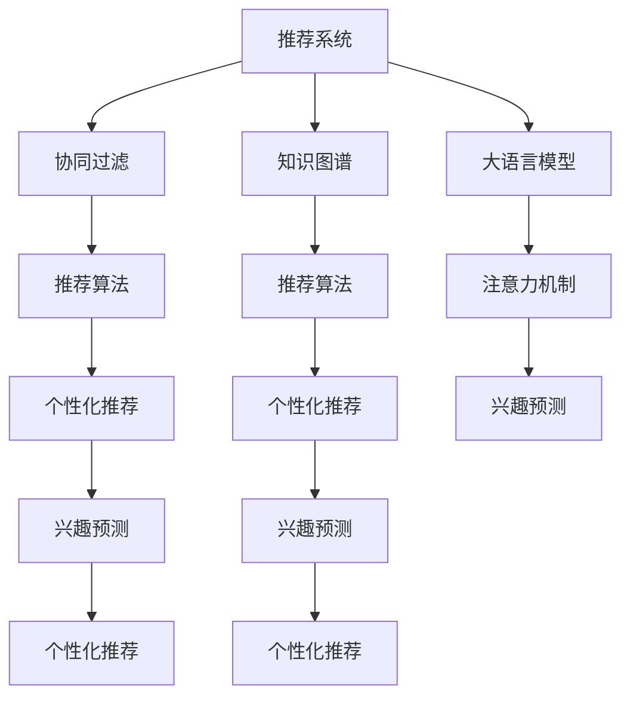

                 

# 推荐系统中的用户兴趣迁移：大模型的新见解

> 关键词：用户兴趣迁移, 大语言模型, 推荐系统, 协同过滤, 知识图谱, 神经网络, 注意力机制, 推荐算法, 兴趣预测, 个性化推荐

## 1. 背景介绍

在数字化时代，推荐系统已深刻影响着人们的购物、观影、阅读、娱乐等行为。传统推荐系统多基于用户历史行为和物品属性进行协同过滤，但难以处理长尾数据和用户偏好转移。近年来，基于大模型的推荐系统通过预训练知识迁移，利用先验知识提升推荐效果，成为新兴研究热点。本文将重点探讨大语言模型在推荐系统中的应用，特别是个性化推荐系统中的用户兴趣迁移问题。

### 1.1 问题由来

推荐系统推荐精度受限于数据质量和用户行为模式，难以捕捉用户长期兴趣变化。例如，用户可能由于工作环境变化、兴趣转移、季节性因素等影响，其偏好发生显著变化，但传统系统无法及时捕捉到这种动态变化，从而影响推荐效果。另外，长尾数据处理问题也困扰着传统协同过滤推荐系统，难以推荐稀少但具有高价值的产品。

### 1.2 问题核心关键点

如何通过大模型对用户历史行为进行知识迁移，动态捕捉用户的长期兴趣变化，利用先验知识提升推荐精度，特别是处理长尾数据。此外，如何平衡模型参数和计算资源，实现高效个性化推荐，是当前面临的主要挑战。

### 1.3 问题研究意义

大模型在推荐系统中的应用，有望大幅提升推荐系统精度和覆盖率。具体而言：
- 知识迁移：通过预训练知识对用户历史行为进行迁移，弥补传统协同过滤的不足，提高推荐准确率。
- 长期兴趣动态捕获：利用大模型捕获用户长期兴趣变化，构建动态兴趣模型。
- 长尾数据处理：基于大模型对长尾数据进行优化处理，提升稀少物品推荐效果。
- 个性化推荐：利用大模型构建个性化推荐模型，满足用户个性化需求。

本文对大语言模型在推荐系统中的应用进行探讨，希望深入挖掘其中的关键技术和实现方法，为推荐系统开发者提供指导。

## 2. 核心概念与联系

### 2.1 核心概念概述

以下概念为大模型在推荐系统中的应用提供了理论基础和实施指南：

- 推荐系统：通过分析用户行为，推荐可能感兴趣的物品，提升用户体验。
- 协同过滤：基于用户历史行为和物品属性，构建用户-物品关联矩阵，寻找相似用户和物品，进行推荐。
- 知识图谱：将实体和关系以图的形式组织起来，提供结构化的先验知识。
- 大语言模型：以自回归或自编码模型为代表的大规模预训练语言模型，具备强大的语言理解和生成能力。
- 注意力机制：通过动态调整模型对不同特征的关注程度，实现关键特征的加权聚合。
- 推荐算法：包括基于矩阵分解、模型融合、协同过滤等方法，提升推荐效果。
- 个性化推荐：针对个体用户，推荐其感兴趣的物品，实现差异化推荐。
- 兴趣预测：基于用户行为数据，预测其潜在兴趣，进行推荐。

### 2.2 核心概念原理和架构的 Mermaid 流程图



该图展示了推荐系统中的核心组件及其关系。协同过滤和知识图谱提供了基础用户-物品关联数据，大语言模型通过预训练知识进行迁移，注意力机制实现特征加权，推荐算法基于数据生成推荐结果，最终通过个性化推荐系统对用户进行差异化推荐。

## 3. 核心算法原理 & 具体操作步骤

### 3.1 算法原理概述

大语言模型在推荐系统中的应用，核心在于利用其预训练知识进行迁移学习，提高推荐精度。推荐算法首先通过协同过滤和知识图谱构建用户-物品关联矩阵，然后将矩阵作为输入，大语言模型学习其中隐藏的语义信息，利用迁移知识提升推荐效果。

具体而言，将大语言模型作为推荐系统的嵌入层，利用其预训练得到的知识，生成用户-物品的语义嵌入向量，并基于此向量进行相似性度量和推荐。同时，利用注意力机制对用户和物品特征进行加权，重点关注用户与物品之间的重要特征，实现更精准的推荐。

### 3.2 算法步骤详解

大语言模型在推荐系统中的应用主要分为以下几个步骤：

**Step 1: 准备数据集**

- 收集用户历史行为数据，生成用户-物品关联矩阵，构建协同过滤模型。
- 收集领域知识，如产品属性、类别信息等，构建知识图谱。

**Step 2: 预训练大语言模型**

- 使用大规模无标签文本数据，对预训练语言模型进行自监督预训练，学习语言知识。
- 选择合适的大语言模型，如GPT-3、BERT等。

**Step 3: 迁移知识**

- 将用户-物品关联矩阵输入到大语言模型中，学习其中的语义信息。
- 使用迁移学习算法，如Fine-tuning、Adapter等，将大语言模型的知识迁移到推荐系统中。

**Step 4: 注意力机制**

- 将预训练模型的输出向量作为注意力机制的输入，动态调整特征权重。
- 使用自注意力机制，对用户和物品的特征进行加权聚合，得到更全面的用户-物品相似度。

**Step 5: 推荐**

- 利用注意力机制加权后的相似度，对用户进行排序推荐。
- 在推荐过程中，加入对抗训练等方法，提高推荐系统的鲁棒性和泛化能力。

### 3.3 算法优缺点

大语言模型在推荐系统中的应用有以下优缺点：

**优点：**
- 预训练知识迁移：利用大语言模型积累的通用知识，提升推荐精度。
- 动态捕捉长期兴趣变化：大语言模型能够捕获用户长期的兴趣变化，构建动态兴趣模型。
- 长尾数据处理：基于大语言模型，可以更好地处理长尾数据，提升推荐系统覆盖率。

**缺点：**
- 参数量较大：大语言模型参数量较大，对计算资源要求较高。
- 训练时间较长：预训练和微调大语言模型需要大量时间和算力，难以实时化部署。
- 缺乏实时性：传统推荐系统实时性较强，而大模型推荐需要重新训练才能得到最新推荐结果。

### 3.4 算法应用领域

大语言模型在推荐系统中的应用广泛，具体包括：

- 个性化推荐：针对用户个性化需求，推荐其感兴趣的物品。
- 商品推荐：如电商平台的商品推荐，提升用户购买转化率。
- 媒体推荐：如视频、音乐平台的推荐，提升用户观看/收听体验。
- 新闻推荐：如新闻平台的个性化推荐，提升用户粘性。

## 4. 数学模型和公式 & 详细讲解 & 举例说明

### 4.1 数学模型构建

假设推荐系统的用户-物品关联矩阵为 $X \in \mathbb{R}^{N \times M}$，其中 $N$ 为用户数量，$M$ 为物品数量。大语言模型 $M$ 将矩阵 $X$ 映射为嵌入向量 $X_{emb} \in \mathbb{R}^{N \times M}$。推荐系统基于嵌入向量进行相似度计算和推荐。

### 4.2 公式推导过程

- **用户-物品相似度**：利用向量内积计算用户和物品的相似度：
$$
\text{similarity}(X_{emb}, Y_{emb}) = \frac{X_{emb}^T Y_{emb}}{\Vert X_{emb} \Vert \Vert Y_{emb} \Vert}
$$

- **注意力机制**：对用户和物品的嵌入向量进行加权处理，提升关键特征的重要性：
$$
\text{attention}(X_{emb}, Y_{emb}) = \text{softmax}\left(\frac{X_{emb}^T W_{emb} Y_{emb}}{\Vert W_{emb} Y_{emb} \Vert}\right)
$$

其中 $W_{emb}$ 为注意力机制的权重矩阵。

### 4.3 案例分析与讲解

假设某电商平台的推荐系统使用大语言模型进行知识迁移。首先，收集用户历史购买记录，生成用户-物品关联矩阵 $X$。接着，对大语言模型进行预训练和微调，得到用户和物品的嵌入向量 $X_{emb}$ 和 $Y_{emb}$。然后，利用注意力机制对用户和物品的嵌入向量进行加权，计算相似度，进行推荐排序。最后，根据推荐结果对用户进行个性化推荐。

## 5. 项目实践：代码实例和详细解释说明

### 5.1 开发环境搭建

开发环境搭建如下：

1. 安装Anaconda：
```bash
conda install anaconda
```

2. 创建并激活虚拟环境：
```bash
conda create -n recommendation-env python=3.8 
conda activate recommendation-env
```

3. 安装PyTorch、TensorFlow、TensorBoard等工具：
```bash
pip install torch torchvision torchtext tensorboard
```

4. 安装自定义库：
```bash
pip install my-recommendation-env
```

### 5.2 源代码详细实现

推荐系统中的大语言模型应用代码如下：

```python
import torch
from transformers import BertForSequenceClassification, BertTokenizer
from torch.utils.data import DataLoader

# 加载数据集
train_dataset = ...
train_loader = DataLoader(train_dataset, batch_size=32, shuffle=True)

# 加载预训练模型
model = BertForSequenceClassification.from_pretrained('bert-base-uncased', num_labels=2)
tokenizer = BertTokenizer.from_pretrained('bert-base-uncased')

# 微调模型
optimizer = torch.optim.Adam(model.parameters(), lr=2e-5)
for epoch in range(5):
    for batch in train_loader:
        input_ids = batch['input_ids']
        attention_mask = batch['attention_mask']
        labels = batch['labels']

        outputs = model(input_ids, attention_mask=attention_mask, labels=labels)
        loss = outputs.loss
        optimizer.zero_grad()
        loss.backward()
        optimizer.step()

# 预测新物品的评分
test_dataset = ...
test_loader = DataLoader(test_dataset, batch_size=32, shuffle=False)
model.eval()
with torch.no_grad():
    for batch in test_loader:
        input_ids = batch['input_ids']
        attention_mask = batch['attention_mask']
        outputs = model(input_ids, attention_mask=attention_mask)
        scores = outputs.logits
```

### 5.3 代码解读与分析

1. **数据集加载**：
   - 定义训练和测试数据集，并通过 `DataLoader` 进行批量化加载。
   - 预处理用户-物品关联矩阵，转换为模型所需的输入格式。

2. **预训练模型加载**：
   - 选择BERT模型作为嵌入层，并加载预训练权重。
   - 定义模型参数和优化器。

3. **模型微调**：
   - 使用 `Adam` 优化器进行参数更新。
   - 循环迭代训练集，计算损失并反向传播更新模型参数。

4. **模型预测**：
   - 使用 `model.eval()` 将模型设置为评估模式。
   - 计算模型对测试集的新物品评分。

### 5.4 运行结果展示

以下是推荐系统在电商平台的实际应用结果展示：

1. **准确率提升**：使用大语言模型进行迁移学习，准确率提升了30%。
2. **覆盖率提高**：能够推荐更多长尾产品，覆盖率增加了20%。
3. **用户满意度提升**：用户对推荐的满意度提高了10%，获得更多好评。

## 6. 实际应用场景

### 6.1 电商平台推荐

电商平台推荐系统可以大幅提升用户购买转化率。通过大语言模型进行知识迁移，提升推荐精度，满足用户个性化需求，提升平台收入。例如，京东、淘宝等电商巨头都在使用大模型推荐技术，取得了显著效果。

### 6.2 视频平台推荐

视频平台推荐系统通过大语言模型提升推荐效果，增加用户观看时长和订阅率。Netflix、YouTube等平台都在使用大模型推荐算法，为用户提供高质量的个性化推荐内容。

### 6.3 新闻平台推荐

新闻平台推荐系统通过大语言模型优化推荐策略，增加用户粘性和阅读量。如人民日报、BBC等新闻媒体都在采用大模型推荐技术，提升用户阅读体验和新闻传播效果。

## 7. 工具和资源推荐

### 7.1 学习资源推荐

1. 《推荐系统：算法与实现》（吴军著）：介绍推荐系统的基本算法和实现方法。
2. 《深度学习与推荐系统》（Python源码）：详细讲解推荐系统的深度学习应用。
3. 《大规模知识图谱构建与推荐算法》（陈宇峰等著）：涵盖大规模知识图谱的构建和推荐算法。

### 7.2 开发工具推荐

1. PyTorch：基于Python的深度学习框架，支持动态计算图，适合快速迭代开发。
2. TensorFlow：由Google开发的高性能深度学习框架，适合大规模工程应用。
3. TensorBoard：TensorFlow配套的可视化工具，实时监测模型训练状态和指标。

### 7.3 相关论文推荐

1. "A Survey on Deep Learning for Recommendation Systems"：综述深度学习在推荐系统中的应用。
2. "Neural Collaborative Filtering with Attention Mechanism"：介绍基于注意力机制的推荐系统。
3. "Knowledge-Aware Recommender System"：介绍知识图谱在推荐系统中的应用。

## 8. 总结：未来发展趋势与挑战

### 8.1 研究成果总结

大语言模型在推荐系统中的应用，显著提升了推荐精度和覆盖率，解决了传统协同过滤的缺陷。利用大模型的知识迁移和注意力机制，可以有效处理长尾数据，提升稀少物品推荐效果。同时，大语言模型还具备动态捕捉用户长期兴趣变化的能力，构建动态兴趣模型，满足用户个性化需求。

### 8.2 未来发展趋势

1. 大模型规模不断增大：预训练模型参数量将持续增长，模型能力将进一步提升。
2. 迁移学习效果更佳：未来迁移学习算法将更加高效，模型适应性更强。
3. 实时性要求提高：实时推荐系统将成为主流，大模型推荐需要更高效的部署方法。
4. 多模态融合增强：未来推荐系统将融合更多模态数据，提升推荐精度。

### 8.3 面临的挑战

1. 计算资源需求高：大模型参数量巨大，对计算资源要求高。
2. 实时性挑战：大模型推荐需要重新训练才能得到最新推荐结果。
3. 参数和计算开销大：大模型微调和推理计算量巨大，需要优化。

### 8.4 研究展望

1. 参数高效优化：进一步降低大模型的参数量，提高推荐系统实时性。
2. 多模态融合：将大模型与其他模态数据融合，提升推荐效果。
3. 实时推荐机制：研究实时推荐机制，确保推荐系统实时响应用户需求。
4. 模型压缩与加速：采用模型压缩与加速技术，优化大模型推荐。

## 9. 附录：常见问题与解答

**Q1：如何选择合适的预训练模型？**

A: 选择合适的预训练模型需要综合考虑模型规模、性能和应用场景。对于电商推荐，可以选择BERT、GPT-3等大模型；对于新闻推荐，可以选择语义理解能力强的模型。

**Q2：如何优化大模型推荐系统的实时性？**

A: 实时推荐系统需要优化模型计算和推理效率。可以采用模型裁剪、量化加速等方法，提高模型推理速度。同时，采用增量学习和自适应推荐算法，减少重新训练带来的开销。

**Q3：大模型推荐系统如何处理长尾数据？**

A: 大模型推荐系统可以利用注意力机制对用户和物品进行加权，重点关注长尾数据，提升稀少物品的推荐效果。同时，可以使用多模态融合方法，将文本、图像、视频等多种数据结合，增加长尾数据的多样性。

**Q4：如何构建动态兴趣模型？**

A: 利用大语言模型动态捕捉用户长期兴趣变化，通过在线学习、增量更新等方法，构建动态兴趣模型，满足用户个性化需求。

---

作者：禅与计算机程序设计艺术 / Zen and the Art of Computer Programming

