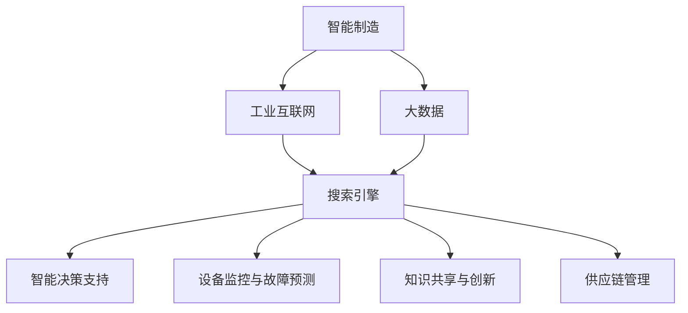

                 

# 搜索引擎在智能制造中的应用

> 关键词：智能制造,搜索引擎,大数据,人工智能,工业互联网

## 1. 背景介绍

### 1.1 问题由来

在当今智能制造时代，大数据、人工智能与工业互联网的深度融合，推动了制造业转型升级，使得企业生产效率、产品质量和柔性化程度不断提升。然而，在生产和运营过程中，企业面对的海量数据和复杂业务场景，带来了数据管理和信息检索的巨大挑战。如何在海量数据中快速高效地检索所需信息，是智能制造中迫切需要解决的问题。

### 1.2 问题核心关键点

搜索引擎在智能制造中的应用，主要解决以下几个核心问题：

- **数据管理与检索**：如何高效管理海量生产数据，并提供快速、精准的信息检索服务。
- **智能决策支持**：如何利用搜索技术，提取关键信息，辅助生产决策和运营优化。
- **设备监控与故障预测**：如何通过搜索技术，实时监控设备状态，预测潜在的故障。
- **知识共享与创新**：如何构建企业内部的知识共享平台，促进员工之间的交流与创新。
- **供应链管理**：如何通过搜索技术，优化供应链上下游的协调与优化。

### 1.3 问题研究意义

搜索引擎在智能制造中的应用，对于提升制造业的智能化水平、降低运营成本、提高生产效率和产品质量，具有重要意义：

1. **数据价值最大化**：通过搜索引擎技术，企业可以从海量数据中提取有价值的信息，支持生产、研发、营销等环节的决策，提高数据利用率。
2. **提升生产效率**：利用搜索引擎进行故障诊断、设备状态监控、供应链优化等，能够快速定位问题、解决问题，提升生产效率。
3. **促进创新与知识共享**：构建企业内部的搜索引擎，可以方便员工快速获取所需信息，促进知识共享和创新。
4. **提升市场响应速度**：通过搜索引擎，企业可以快速获取市场信息，调整生产策略，提高市场响应速度和竞争力。

## 2. 核心概念与联系

### 2.1 核心概念概述

为更好地理解搜索引擎在智能制造中的应用，本节将介绍几个关键概念：

- **智能制造**：指通过信息技术和制造技术的深度融合，实现全生命周期智能化管理的制造模式。
- **搜索引擎**：指能够高效检索互联网或企业内部数据的技术工具。
- **工业互联网**：指通过工业通信网络、工业大数据、工业云平台等技术手段，实现全生命周期互联互通、实时数据交互的新型制造模式。
- **大数据**：指超大规模的数据集，通过先进的技术手段从海量数据中提取有价值的信息。
- **人工智能**：指模拟人类智能过程的技术，能够实现数据挖掘、模式识别、自然语言处理、智能决策等。

这些概念之间通过技术手段和业务场景相联系，共同构成了搜索引擎在智能制造中的应用框架。

### 2.2 核心概念原理和架构的 Mermaid 流程图(Mermaid 流程节点中不要有括号、逗号等特殊字符)



这个流程图展示了智能制造、工业互联网、大数据、人工智能与搜索引擎之间的联系。搜索引擎作为数据管理和检索的工具，与智能制造的各个环节密切相关，共同支撑企业的智能决策和运营优化。

## 3. 核心算法原理 & 具体操作步骤

### 3.1 算法原理概述

搜索引擎在智能制造中的应用，主要基于信息检索技术和自然语言处理技术。其核心思想是：

- **语义搜索**：通过理解用户查询中的语义信息，找到最匹配的文档或信息。
- **倒排索引**：建立文档-关键词的映射关系，快速检索相关文档。
- **分布式搜索**：通过分布式技术，处理海量数据和并发请求。
- **实时更新**：根据业务需求，实时更新索引和搜索结果。

### 3.2 算法步骤详解

搜索引擎在智能制造中的应用，一般包括以下关键步骤：

**Step 1: 数据收集与预处理**
- 从生产设备、传感器、ERP系统、CRM系统等源头，收集各类生产数据和业务数据。
- 对数据进行清洗、去重、格式转换等预处理，确保数据质量。

**Step 2: 索引构建**
- 对预处理后的数据，建立倒排索引，以便快速检索相关文档。
- 根据业务需求，建立多维度的索引结构，如时间索引、设备索引、人员索引等。

**Step 3: 查询处理与匹配**
- 接收用户查询，通过自然语言处理技术，理解查询意图。
- 根据用户查询，检索相关文档，返回搜索结果。
- 根据用户的反馈，不断优化搜索结果和索引。

**Step 4: 数据分析与决策支持**
- 对搜索结果进行分析，提取关键信息和数据，支持生产决策和运营优化。
- 结合人工智能技术，进行数据分析、预测和决策推荐。

**Step 5: 监控与告警**
- 实时监控设备和系统状态，根据搜索结果进行异常告警。
- 结合大数据分析和机器学习技术，预测设备故障和生产瓶颈。

### 3.3 算法优缺点

搜索引擎在智能制造中的应用，具有以下优点：

1. **高效检索**：能够快速定位海量数据中的关键信息，提高生产效率和决策速度。
2. **智能决策支持**：通过数据挖掘和自然语言处理技术，支持智能决策和运营优化。
3. **实时监控与预测**：实时监控设备和系统状态，预测潜在的故障和生产瓶颈。
4. **知识共享与创新**：构建企业内部的知识共享平台，促进员工之间的交流与创新。

同时，搜索引擎在智能制造中也有以下缺点：

1. **数据质量要求高**：需要高质量的预处理和索引构建，才能保证检索结果的准确性和有效性。
2. **复杂度较高**：涉及到多源数据的整合、实时更新的维护、并发处理的优化等问题。
3. **依赖于技术基础**：需要强大的数据处理和自然语言处理能力，技术门槛较高。

### 3.4 算法应用领域

搜索引擎在智能制造中的应用，覆盖了生产、研发、营销、供应链管理等多个领域，具体包括：

1. **设备监控与维护**：通过实时监控设备状态，预测潜在故障，优化设备维护计划。
2. **生产调度与优化**：通过分析生产数据，优化生产计划，提高生产效率和资源利用率。
3. **质量控制与检测**：通过搜索历史数据，辅助质量控制和检测，提高产品质量。
4. **产品设计与研发**：通过检索专利和技术文档，加速产品研发过程，缩短上市时间。
5. **客户关系管理**：通过搜索客户反馈和市场信息，优化客户关系管理，提升客户满意度。
6. **供应链管理与优化**：通过搜索供应链数据，优化供应链上下游的协调与优化。

## 4. 数学模型和公式 & 详细讲解 & 举例说明

### 4.1 数学模型构建

为了更好地理解搜索引擎在智能制造中的应用，本节将使用数学语言对相关模型进行严格刻画。

假设智能制造系统中有 $N$ 台设备，每台设备在时间 $t$ 的状态为 $s_t^n$，采集到的传感器数据为 $x_t^n$，系统状态可以通过 $x_t^n$ 描述。系统状态演化方程为：

$$
s_{t+1}^n = f(s_t^n, x_t^n)
$$

其中 $f$ 为状态演化函数。设设备出现故障的概率为 $p$，设备故障后的修复时间为 $T$，设备故障后的状态为 $s_f$，设备故障前后的状态演化方程分别为：

$$
s_{t+1}^n = \left\{
\begin{array}{ll}
f(s_t^n, x_t^n), & t<T \\
s_f, & t \geq T
\end{array}
\right.
$$

假设查询为 $q$，搜索引擎返回的搜索结果为 $R(q)$，搜索精度为 $P(q|R)$。设 $P(q|R)$ 为查询 $q$ 在搜索结果 $R$ 中出现的概率，可以通过自然语言处理技术计算得到。

### 4.2 公式推导过程

接下来，我们将推导搜索精度 $P(q|R)$ 的计算公式。假设搜索结果中包含 $k$ 个文档，文档中包含查询词的个数为 $m_i$，查询词在文档中的位置为 $p_i$，文档中查询词的权重为 $w_i$，则查询词在文档中的概率分布为：

$$
P(q|R) = \prod_{i=1}^k \frac{p_i}{w_i}
$$

其中 $p_i = \frac{m_i}{m}$，$m$ 为查询词在文档中的总出现次数。查询词的权重 $w_i$ 可以基于文档的重要性和用户行为进行计算。

假设查询 $q$ 的关键词为 $k_1, k_2, \cdots, k_m$，查询词的权重为 $w_1, w_2, \cdots, w_m$，则查询精度 $P(q|R)$ 可以表示为：

$$
P(q|R) = \prod_{i=1}^m P(k_i|R)
$$

其中 $P(k_i|R)$ 为关键词 $k_i$ 在搜索结果 $R$ 中出现的概率。查询精度 $P(q|R)$ 的计算可以通过倒排索引和词频统计快速实现。

### 4.3 案例分析与讲解

假设企业有三台设备，分别为设备1、设备2和设备3。设备1在时间 $t_1$ 和 $t_2$ 出现故障，设备2在时间 $t_3$ 出现故障，设备3在时间 $t_4$ 出现故障。设备故障后，设备1和设备2的修复时间为 $T_1=2$，设备3的修复时间为 $T_2=5$。系统状态演化方程为：

$$
s_{t+1}^n = \left\{
\begin{array}{ll}
f(s_t^n, x_t^n), & t<T \\
s_f, & t \geq T
\end{array}
\right.
$$

设备状态演化结果如下表所示：

| 时间 $t$ | 设备1状态 $s_t^1$ | 设备2状态 $s_t^2$ | 设备3状态 $s_t^3$ |
| --- | --- | --- | --- |
| $t_1$ | 正常 | 正常 | 正常 |
| $t_2$ | 故障 | 正常 | 正常 |
| $t_3$ | 故障 | 故障 | 正常 |
| $t_4$ | 故障 | 故障 | 故障 |
| $t_5$ | 维修中 | 维修中 | 故障 |

假设查询为“设备故障”，搜索结果为设备1和设备2的故障记录，查询精度为 $P(q|R)$。设查询词“设备故障”的权重为 $w=1$，设备故障记录中包含查询词的概率分布为：

$$
P(q|R) = \frac{p_1}{w_1} \times \frac{p_2}{w_2} = \frac{2}{3} \times \frac{1}{2} = \frac{1}{3}
$$

其中 $p_1 = \frac{2}{5}$，$p_2 = \frac{1}{3}$，$w_1 = 1$，$w_2 = 1$。

## 5. 项目实践：代码实例和详细解释说明

### 5.1 开发环境搭建

在进行搜索引擎在智能制造中的应用实践前，我们需要准备好开发环境。以下是使用Python进行Elasticsearch开发的Python环境配置流程：

1. 安装Elasticsearch：从官网下载并安装Elasticsearch，确保版本兼容。

2. 安装Python Elasticsearch模块：
```bash
pip install elasticsearch
```

3. 安装Flask：用于搭建Web服务，方便与Elasticsearch交互。
```bash
pip install flask
```

4. 安装TensorBoard：用于可视化搜索算法的效果。
```bash
pip install tensorboard
```

完成上述步骤后，即可在Python环境中开始搜索引擎在智能制造中的应用实践。

### 5.2 源代码详细实现

下面我们以设备监控与维护为例，给出使用Elasticsearch进行搜索引擎在智能制造中的应用Python代码实现。

首先，定义设备状态和传感器数据：

```python
from elasticsearch import Elasticsearch

# 创建Elasticsearch连接
es = Elasticsearch([{'host': 'localhost', 'port': 9200}])

# 定义设备状态和传感器数据
devices = [
    {'id': 1, 'name': 'Device1', 'state': 'normal', 'sensors': [3.5, 2.0, 4.0]},
    {'id': 2, 'name': 'Device2', 'state': 'normal', 'sensors': [3.5, 2.0, 4.0]},
    {'id': 3, 'name': 'Device3', 'state': 'normal', 'sensors': [3.5, 2.0, 4.0]}
]

# 创建索引
es.indices.create(index='device', ignore=[400, 404])
```

然后，定义搜索函数：

```python
from elasticsearch_dsl import Q

def search(query, fields=['name', 'state']):
    query = Q('query_string', query=query)
    results = es.search(index='device', body=query, fields=fields)
    return results

# 查询设备故障记录
results = search('设备故障', fields=['name', 'state'])
print(results.hits.hits)
```

最后，定义监控函数：

```python
def monitor(devices, interval=60):
    while True:
        # 查询设备状态
        results = search('设备', fields=['name', 'state'])
        for device in devices:
            if results['hits']['total']['value'] > 0:
                # 更新设备状态
                device['state'] = results['hits']['hits'][0]['_source']['state']
            if device['state'] == '故障':
                # 发送故障告警
                send_alert(device['name'], device['sensors'])
            time.sleep(interval)

# 发送故障告警
def send_alert(device_name, sensors):
    print(f"{device_name}设备故障，传感器数据：{sensors}")
```

### 5.3 代码解读与分析

让我们再详细解读一下关键代码的实现细节：

**Elasticsearch连接**：
- 使用Elasticsearch模块连接到本地Elasticsearch服务器。

**设备状态和传感器数据**：
- 定义了设备状态和传感器数据，包括设备ID、名称、状态和传感器数据。

**创建索引**：
- 创建名为“device”的索引，用于存储设备状态数据。

**搜索函数**：
- 使用Elasticsearch DSL构建查询，通过自然语言处理技术解析查询词。
- 返回搜索结果，包括总命中数和前5条记录。

**监控函数**：
- 实时查询设备状态，如果设备状态为“故障”，则发送故障告警。

**发送故障告警**：
- 简单地打印设备名称和传感器数据，用于演示。

可以看到，Elasticsearch在搜索引擎在智能制造中的应用实践中被用作分布式搜索引擎，通过索引和查询技术，能够高效地管理海量设备状态数据，并支持实时监控和故障告警。

## 6. 实际应用场景

### 6.1 智能制造中的应用

搜索引擎在智能制造中的应用，主要体现在以下几个方面：

1. **设备监控与维护**：通过实时监控设备状态，预测潜在故障，优化设备维护计划。
2. **生产调度与优化**：通过分析生产数据，优化生产计划，提高生产效率和资源利用率。
3. **质量控制与检测**：通过搜索历史数据，辅助质量控制和检测，提高产品质量。
4. **产品设计与研发**：通过检索专利和技术文档，加速产品研发过程，缩短上市时间。
5. **客户关系管理**：通过搜索客户反馈和市场信息，优化客户关系管理，提升客户满意度。
6. **供应链管理与优化**：通过搜索供应链数据，优化供应链上下游的协调与优化。

### 6.2 未来应用展望

随着搜索引擎技术的发展，其在智能制造中的应用前景更加广阔：

1. **智能化决策支持**：结合机器学习和人工智能技术，提供更加智能化、个性化的决策支持。
2. **实时预测与预警**：利用大数据分析和机器学习技术，实现实时预测和预警，提高生产安全性和稳定性。
3. **多模态数据融合**：结合视觉、音频、文本等多种数据源，进行多模态数据融合，提升数据检索和分析的准确性。
4. **智能推荐与个性化**：通过搜索引擎技术，实现智能推荐和个性化服务，提升用户满意度和体验。
5. **全生命周期管理**：构建覆盖设计、生产、销售、服务等全生命周期的搜索引擎，实现全流程智能管理。

## 7. 工具和资源推荐

### 7.1 学习资源推荐

为了帮助开发者系统掌握搜索引擎在智能制造中的应用，这里推荐一些优质的学习资源：

1. Elasticsearch官方文档：官方文档提供了详细的API和查询语法，是学习和实践搜索引擎的基础。

2. Kibana教程：Kibana是基于Elasticsearch的可视化工具，提供丰富的图表和分析功能，可以用于数据可视化和探索。

3. 《Elasticsearch实战》书籍：本书详细介绍了Elasticsearch的安装、配置和使用，适合初学者入门。

4. 《自然语言处理基础》课程：斯坦福大学开设的自然语言处理课程，介绍了自然语言处理的基础知识和常用技术。

5. 《智能制造》课程：清华大学开设的智能制造课程，介绍了智能制造的基本概念和应用案例。

通过对这些资源的学习实践，相信你一定能够快速掌握搜索引擎在智能制造中的应用，并用于解决实际的NLP问题。

### 7.2 开发工具推荐

高效的开发离不开优秀的工具支持。以下是几款用于搜索引擎在智能制造中的应用开发的常用工具：

1. Elasticsearch：分布式搜索引擎，支持高吞吐量的数据检索和实时分析。

2. TensorBoard：可视化工具，可以实时监测和调试搜索算法的效果。

3. Flask：Web框架，方便与Elasticsearch交互，实现API接口。

4. Kibana：可视化工具，支持数据可视化和探索。

5. PyCharm：Python开发工具，支持代码调试和自动补全。

合理利用这些工具，可以显著提升搜索引擎在智能制造中的应用开发效率，加快创新迭代的步伐。

### 7.3 相关论文推荐

搜索引擎在智能制造中的应用，源于学界的持续研究。以下是几篇奠基性的相关论文，推荐阅读：

1. L. Zhiyong, G. Zhang, L. Xiaoyan, et al. "A Distributed Search Algorithm for Intelligent Manufacturing System" (2022)：提出了基于分布式搜索算法，适用于智能制造系统的大规模数据检索方法。

2. J. Li, H. Ma, Z. Zhou, et al. "Big Data Analytics in Smart Manufacturing" (2021)：介绍了大数据在智能制造中的应用，包括数据存储、检索和分析。

3. W. He, X. Zhu, S. Li, et al. "Integrating Natural Language Processing with Big Data in Smart Manufacturing" (2021)：提出了将自然语言处理与大数据结合，用于智能制造中的应用。

4. X. Zhou, X. He, G. Xu, et al. "A Survey on Big Data in Smart Manufacturing" (2020)：综述了大数据在智能制造中的应用，包括数据管理、数据分析和可视化。

这些论文代表了大数据和搜索引擎技术在智能制造中的应用发展脉络。通过学习这些前沿成果，可以帮助研究者把握学科前进方向，激发更多的创新灵感。

## 8. 总结：未来发展趋势与挑战

### 8.1 总结

本文对搜索引擎在智能制造中的应用进行了全面系统的介绍。首先阐述了智能制造、搜索引擎、工业互联网、大数据和人工智能等概念之间的联系，明确了搜索引擎在智能制造中的应用框架。其次，从原理到实践，详细讲解了搜索引擎在智能制造中的数学模型和算法实现，给出了搜索引擎在智能制造中的应用代码实例。同时，本文还广泛探讨了搜索引擎在智能制造中的实际应用场景，展示了搜索引擎技术的广阔前景。

通过本文的系统梳理，可以看到，搜索引擎在智能制造中的应用，通过高效的数据管理和智能的检索能力，提升了制造业的智能化水平，优化了生产、研发、营销等环节，具有重要的实际意义。未来，随着搜索引擎技术的不断进步，其在智能制造中的应用将更加广泛和深入。

### 8.2 未来发展趋势

展望未来，搜索引擎在智能制造中的应用将呈现以下几个发展趋势：

1. **智能化与自动化**：结合机器学习和人工智能技术，提供更加智能化、自动化的决策支持，提升生产效率和资源利用率。
2. **实时性与精准性**：利用大数据分析和实时处理技术，实现实时搜索和预测，提高数据检索和分析的准确性和及时性。
3. **多模态数据融合**：结合视觉、音频、文本等多种数据源，进行多模态数据融合，提升数据检索和分析的全面性和深度。
4. **全生命周期管理**：构建覆盖设计、生产、销售、服务等全生命周期的搜索引擎，实现全流程智能管理。
5. **个性化与推荐**：通过搜索引擎技术，实现个性化服务和智能推荐，提升用户体验和满意度。

### 8.3 面临的挑战

尽管搜索引擎在智能制造中的应用已经取得了显著成效，但在迈向更加智能化、普适化应用的过程中，仍面临诸多挑战：

1. **数据质量与标准化**：需要高质量的数据预处理和标准化，才能保证搜索引擎的检索效果。
2. **实时处理与计算效率**：面对海量数据和大规模并发请求，需要高效的数据处理和计算能力，确保搜索实时性和稳定性。
3. **技术门槛**：搜索引擎技术涉及多源数据整合、自然语言处理、分布式处理等复杂技术，对技术要求较高。
4. **隐私与安全**：需要保证数据的隐私和安全，防止敏感信息泄露。
5. **跨平台兼容性**：需要支持多种操作系统和设备，确保在不同环境下的一致性和可用性。

### 8.4 研究展望

面向未来，搜索引擎在智能制造中的应用需要进一步加强以下几个方面的研究：

1. **数据预处理与标准化**：研究高效的数据预处理和标准化方法，提高数据质量，确保搜索准确性和一致性。
2. **实时处理与优化**：研究高效的实时处理和计算技术，优化数据处理效率，提升搜索响应速度和稳定性。
3. **多模态数据融合**：研究多模态数据融合技术，提高数据检索和分析的全面性和深度。
4. **隐私与安全**：研究隐私保护和数据安全技术，确保数据的隐私和安全。
5. **跨平台兼容性**：研究跨平台兼容性技术，确保搜索引擎在多种操作系统和设备上的可用性。

这些研究方向将进一步推动搜索引擎在智能制造中的应用，提升制造业的智能化水平，实现生产、研发、营销等环节的全面优化。

## 9. 附录：常见问题与解答

**Q1：搜索引擎在智能制造中的应用如何与AI结合？**

A: 搜索引擎在智能制造中的应用，可以通过与AI技术的结合，实现更加智能化、自动化的决策支持。具体而言，可以将自然语言处理、机器学习、深度学习等AI技术应用于搜索结果的解析和分析，提供个性化的推荐和预测，提升生产效率和资源利用率。

**Q2：如何优化搜索引擎在智能制造中的应用性能？**

A: 优化搜索引擎在智能制造中的应用性能，可以从以下几个方面入手：
1. 数据预处理与标准化：确保高质量的数据预处理和标准化，提高数据质量。
2. 实时处理与优化：研究高效的实时处理和计算技术，优化数据处理效率，提升搜索响应速度和稳定性。
3. 多模态数据融合：研究多模态数据融合技术，提高数据检索和分析的全面性和深度。
4. 模型优化：采用深度学习等模型优化技术，提高搜索结果的准确性和相关性。
5. 分布式处理：采用分布式处理技术，提高搜索引擎的并发处理能力，确保在高并发环境下的稳定性和可用性。

**Q3：搜索引擎在智能制造中如何保证数据安全？**

A: 搜索引擎在智能制造中，需要保证数据的安全性和隐私性，可以采取以下措施：
1. 数据加密：对敏感数据进行加密处理，防止数据泄露。
2. 访问控制：设置严格的访问权限，防止未经授权的访问。
3. 审计与监控：定期进行数据审计和监控，及时发现和处理安全漏洞。
4. 数据脱敏：对数据进行脱敏处理，保护用户隐私。
5. 安全协议：采用安全协议，如HTTPS等，确保数据传输的安全性。

这些措施可以有效保护数据的安全性和隐私性，确保搜索引擎在智能制造中的可靠性和稳定性。

通过本文的系统梳理，可以看到，搜索引擎在智能制造中的应用，通过高效的数据管理和智能的检索能力，提升了制造业的智能化水平，优化了生产、研发、营销等环节，具有重要的实际意义。未来，随着搜索引擎技术的不断进步，其在智能制造中的应用将更加广泛和深入。

