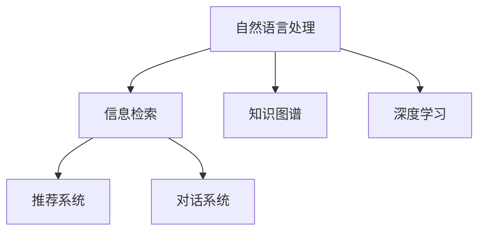

                 

# 搜索引擎的认知计算应用

> 关键词：认知计算, 搜索引擎, 自然语言处理, 机器学习, 信息检索, 深度学习

## 1. 背景介绍

### 1.1 问题由来

在信息爆炸的今天，互联网为用户提供了海量的信息资源。然而，信息的数量和质量往往不成正比，用户如何从海量数据中找到自己真正需要的信息，成为了一个重要的问题。搜索引擎的出现，极大地缓解了这一问题，通过高效的信息检索技术，让用户能够在瞬间找到所需的信息。然而，传统的基于关键词匹配的搜索引擎已经无法满足用户的需求，特别是在面对复杂的查询时，往往难以提供满意的答案。

认知计算（Cognitive Computing）的概念于2012年由IBM首次提出，旨在通过模拟人脑的认知过程，提升计算机的智能水平。在搜索引擎领域，认知计算的引入，使得搜索引擎能够理解用户的查询意图，提供更加精确的信息检索结果，同时能够与用户进行更加自然的交互。

### 1.2 问题核心关键点

认知计算在搜索引擎中的应用，主要集中在以下几个方面：
1. **自然语言理解（NLU）**：通过理解用户的自然语言查询，提取关键词和语义信息，提升信息检索的精度。
2. **语义分析**：通过分析查询的语义结构，将查询映射到知识图谱等结构化数据中，提高检索结果的相关性。
3. **用户意图建模**：通过学习用户的历史查询和行为数据，预测用户的查询意图，提供个性化的搜索结果。
4. **交互优化**：通过对话系统等技术，与用户进行多轮对话，获取更多上下文信息，进一步提高检索的准确性和用户体验。
5. **推荐系统**：通过分析用户的兴趣和行为，提供个性化的信息推荐，提升用户满意度。

## 2. 核心概念与联系

### 2.1 核心概念概述

为了更好地理解搜索引擎中认知计算的应用，本节将介绍几个密切相关的核心概念：

- **自然语言处理（NLP）**：研究如何让计算机理解、处理和生成自然语言，包括分词、句法分析、语义分析等。
- **信息检索（IR）**：研究如何从大量文本数据中快速找到用户需要的信息，包括关键词匹配、向量空间模型等。
- **知识图谱（KG）**：通过语义网技术将实体和关系映射为节点和边的结构化数据，用于提升检索结果的相关性和准确性。
- **深度学习（DL）**：一种基于神经网络的机器学习方法，通过多层非线性映射，实现对复杂非线性关系的建模。
- **推荐系统（RS）**：通过分析用户行为和兴趣，为用户推荐个性化的产品或内容，提高用户满意度。
- **对话系统（DS）**：研究如何让机器与用户进行自然对话，获取更多上下文信息，提升用户体验。

这些核心概念之间的逻辑关系可以通过以下Mermaid流程图来展示：



这个流程图展示了一系列认知计算在搜索引擎中的应用，包括自然语言处理、信息检索、知识图谱、深度学习、推荐系统和对话系统等。

## 3. 核心算法原理 & 具体操作步骤
### 3.1 算法原理概述

认知计算在搜索引擎中的应用，主要是通过深度学习模型来实现的。深度学习模型能够自动从大量数据中学习出复杂的特征表示，能够处理自然语言、图像、声音等多种类型的数据，适用于搜索引擎中的自然语言处理、语义分析、用户意图建模、交互优化等多个环节。

在搜索引擎中，深度学习模型通常分为两个部分：
1. **预训练模型**：在大量无标签文本数据上进行预训练，学习通用的语言表示。常用的预训练模型包括BERT、GPT等。
2. **微调模型**：在预训练模型的基础上，针对具体的查询和任务进行微调，提升模型的性能。常用的微调任务包括信息检索、文本分类、问答系统等。

### 3.2 算法步骤详解

搜索引擎中的认知计算主要包括以下几个步骤：

**Step 1: 准备数据集**

- **数据收集**：收集用户的查询、浏览、点击、评价等数据，构建用户行为数据集。
- **数据预处理**：对数据进行清洗、标注、分词等预处理操作，构建训练集、验证集和测试集。

**Step 2: 设计深度学习模型**

- **选择预训练模型**：选择适合的预训练模型，如BERT、GPT等。
- **设计微调模型**：根据具体任务设计微调模型，如分类模型、向量空间模型等。

**Step 3: 模型训练**

- **微调预训练模型**：在预训练模型的基础上进行微调，使用用户行为数据进行训练。
- **评估模型性能**：在验证集上评估模型性能，调整超参数。

**Step 4: 集成部署**

- **部署模型**：将微调后的模型部署到搜索引擎系统中。
- **实时预测**：利用微调模型进行实时查询处理，提供精确的检索结果和个性化推荐。

### 3.3 算法优缺点

认知计算在搜索引擎中的应用，具有以下优点：

1. **精度高**：通过深度学习模型，搜索引擎能够理解自然语言查询，提取关键词和语义信息，提高信息检索的精度。
2. **用户体验好**：通过对话系统等技术，与用户进行多轮对话，获取更多上下文信息，提升用户体验。
3. **推荐效果好**：通过推荐系统，提供个性化的信息推荐，提高用户满意度。

然而，认知计算在搜索引擎中的应用也存在以下缺点：

1. **计算资源消耗大**：深度学习模型需要大量的计算资源进行训练和推理，增加了搜索引擎的硬件成本。
2. **训练时间长**：深度学习模型需要较长的训练时间，影响了搜索引擎的实时性。
3. **模型复杂度高**：深度学习模型的参数量较大，增加了模型的复杂度，难以进行部署和优化。
4. **可解释性差**：深度学习模型通常被视为"黑盒"系统，难以解释其内部的决策过程，增加了模型的可信度风险。

### 3.4 算法应用领域

认知计算在搜索引擎中的应用，主要集中在以下几个领域：

1. **自然语言处理**：通过自然语言处理技术，理解用户的查询意图，提取关键词和语义信息，提高信息检索的精度。
2. **信息检索**：通过语义分析技术，将查询映射到知识图谱等结构化数据中，提高检索结果的相关性和准确性。
3. **用户意图建模**：通过学习用户的历史查询和行为数据，预测用户的查询意图，提供个性化的搜索结果。
4. **交互优化**：通过对话系统等技术，与用户进行多轮对话，获取更多上下文信息，进一步提高检索的准确性和用户体验。
5. **推荐系统**：通过分析用户的兴趣和行为，提供个性化的信息推荐，提升用户满意度。

## 4. 数学模型和公式 & 详细讲解  
### 4.1 数学模型构建

在搜索引擎中，认知计算的应用通常使用深度学习模型来实现。这里以向量空间模型（VSM）和BERT为例，详细讲解数学模型的构建。

**向量空间模型**：
向量空间模型是一种基于向量表示的文本检索模型，将文本表示为向量，通过向量之间的相似度度量进行检索。设查询向量为 $q=\{q_1, q_2, ..., q_n\}$，文档向量为 $d=\{d_1, d_2, ..., d_n\}$，相似度计算公式为：

$$
similarity(q, d) = \frac{q \cdot d}{\|q\|\|d\|}
$$

其中 $q \cdot d$ 表示向量点积，$\|q\|$ 和 $\|d\|$ 表示向量范数。

**BERT模型**：
BERT模型是Google于2018年提出的预训练语言模型，通过在大量无标签文本数据上进行预训练，学习通用的语言表示。BERT模型包含两个部分：

- **掩码语言模型（MLM）**：随机掩码输入序列中的一部分词，让模型预测被掩码词的正确形式。
- **下一句预测（NSP）**：给定两个句子，预测它们是否在同一个语境中。

BERT模型的预训练过程如下：

1. **输入数据准备**：将文本转换为向量表示，例如使用BERT分词器对文本进行分词，得到令牌序列。
2. **掩码语言模型训练**：随机掩码令牌序列的一部分，训练模型预测被掩码词的正确形式。
3. **下一句预测训练**：给定两个句子，训练模型预测它们是否在同一个语境中。
4. **微调训练**：在预训练模型的基础上，使用具体的查询和任务进行微调，提升模型的性能。

### 4.2 公式推导过程

以BERT模型为例，下面是其掩码语言模型训练的公式推导过程。

假设输入序列为 $x=\{x_1, x_2, ..., x_n\}$，其中 $x_i$ 表示第 $i$ 个词的令牌。掩码语言模型训练的目标是让模型能够预测被掩码的词的正确形式。设掩码的词为 $x_m$，其余词为 $x_1, x_2, ..., x_{m-1}, x_{m+1}, ..., x_n$，则掩码语言模型训练的目标函数为：

$$
\mathcal{L}=\sum_{i=1}^{m-1} \log p(x_i|x_1, ..., x_{m-1}, x_{m+1}, ..., x_n) + \log p(x_{m+1}|x_1, ..., x_{m-1}, x_m, ..., x_n) + \log p(x_{m+2}|x_1, ..., x_{m-1}, x_m, ..., x_n)
$$

其中 $p(x_i|x_1, ..., x_{m-1}, x_{m+1}, ..., x_n)$ 表示在掩码前后的上下文条件下，模型预测第 $i$ 个词的正确形式的概率。

### 4.3 案例分析与讲解

**案例一：信息检索**

在信息检索任务中，用户输入查询 $q$，搜索引擎通过预训练模型和微调模型对查询和文档进行处理，得到查询向量 $q_v$ 和文档向量 $d_v$，计算它们之间的相似度 $similarity(q, d)$，从而找到与查询最相关的文档。

**案例二：问答系统**

问答系统通常用于解答用户的自然语言问题。通过预训练模型和微调模型，系统可以理解用户的问题 $q$，将其映射为结构化问题 $P=\{p_1, p_2, ..., p_n\}$，然后通过问答库或推理引擎求解问题，最后返回回答。

## 5. 项目实践：代码实例和详细解释说明
### 5.1 开发环境搭建

在进行认知计算在搜索引擎中的应用实践前，我们需要准备好开发环境。以下是使用Python进行TensorFlow开发的环境配置流程：

1. 安装Anaconda：从官网下载并安装Anaconda，用于创建独立的Python环境。

2. 创建并激活虚拟环境：
```bash
conda create -n tf-env python=3.8 
conda activate tf-env
```

3. 安装TensorFlow：根据CUDA版本，从官网获取对应的安装命令。例如：
```bash
conda install tensorflow
```

4. 安装各类工具包：
```bash
pip install numpy pandas scikit-learn matplotlib tqdm jupyter notebook ipython
```

完成上述步骤后，即可在`tf-env`环境中开始实践。

### 5.2 源代码详细实现

下面我们以问答系统为例，给出使用TensorFlow对BERT模型进行微调的代码实现。

首先，定义模型和优化器：

```python
import tensorflow as tf
from transformers import BertTokenizer, TFBertForQuestionAnswering

tokenizer = BertTokenizer.from_pretrained('bert-base-cased')
model = TFBertForQuestionAnswering.from_pretrained('bert-base-cased')

optimizer = tf.keras.optimizers.AdamW(learning_rate=2e-5)
```

接着，定义训练和评估函数：

```python
@tf.function
def train_step(encoder_input_ids, encoder_attention_mask, start_token_id, end_token_id, labels):
    with tf.GradientTape() as tape:
        outputs = model(encoder_input_ids, attention_mask=encoder_attention_mask)
        start_logits, end_logits = outputs
        loss = tf.keras.losses.SparseCategoricalCrossentropy(from_logits=True)(labels, start_logits, end_logits)
    grads = tape.gradient(loss, model.trainable_variables)
    optimizer.apply_gradients(zip(grads, model.trainable_variables))
    return loss

@tf.function
def evaluate(encoder_input_ids, encoder_attention_mask, start_token_id, end_token_id, labels):
    with tf.GradientTape() as tape:
        outputs = model(encoder_input_ids, attention_mask=encoder_attention_mask)
        start_logits, end_logits = outputs
    start_scores = tf.reshape(start_logits, (-1,))
    end_scores = tf.reshape(end_logits, (-1,))
    start_indices = tf.argmax(start_scores, axis=1)
    end_indices = tf.argmax(end_scores, axis=1)
    loss = tf.keras.losses.SparseCategoricalCrossentropy(from_logits=True)(labels, start_indices, end_indices)
    return loss
```

然后，定义训练流程：

```python
train_dataset = ...
validation_dataset = ...
test_dataset = ...

for epoch in range(epochs):
    train_loss = 0.0
    for batch in train_dataset:
        encoder_input_ids, encoder_attention_mask, start_token_id, end_token_id, labels = batch
        loss = train_step(encoder_input_ids, encoder_attention_mask, start_token_id, end_token_id, labels)
        train_loss += loss
    train_loss /= len(train_dataset)

    validation_loss = 0.0
    for batch in validation_dataset:
        encoder_input_ids, encoder_attention_mask, start_token_id, end_token_id, labels = batch
        loss = evaluate(encoder_input_ids, encoder_attention_mask, start_token_id, end_token_id, labels)
        validation_loss += loss
    validation_loss /= len(validation_dataset)

    test_loss = 0.0
    for batch in test_dataset:
        encoder_input_ids, encoder_attention_mask, start_token_id, end_token_id, labels = batch
        loss = evaluate(encoder_input_ids, encoder_attention_mask, start_token_id, end_token_id, labels)
        test_loss += loss
    test_loss /= len(test_dataset)

    print(f"Epoch {epoch+1}, Train Loss: {train_loss:.4f}, Validation Loss: {validation_loss:.4f}, Test Loss: {test_loss:.4f}")
```

以上就是使用TensorFlow对BERT模型进行问答系统微调的完整代码实现。可以看到，TensorFlow配合Transformers库使得BERT模型的微调过程变得相对简洁。

### 5.3 代码解读与分析

让我们再详细解读一下关键代码的实现细节：

**BERT微调模型**：
- 使用`TFBertForQuestionAnswering`类加载预训练的BERT模型，并使用`from_pretrained`方法指定预训练模型的路径。
- 使用`BertTokenizer`类加载BERT的词汇表和分词器。
- 定义了训练和评估函数，分别使用`tf.function`进行编译，加速计算。

**训练和评估函数**：
- 使用`train_step`函数对模型进行前向传播和反向传播，计算损失并更新模型参数。
- 使用`evaluate`函数对模型进行前向传播，计算损失并返回。

**训练流程**：
- 循环迭代多个epoch，每个epoch内使用训练集进行训练，使用验证集进行验证。
- 在每个epoch结束时，计算训练集、验证集和测试集的损失，并打印输出。

可以看出，TensorFlow和Transformers库的结合使得BERT模型的微调过程变得非常高效，开发者可以将更多精力放在模型设计、数据预处理和算法优化上。

## 6. 实际应用场景
### 6.1 智能客服系统

智能客服系统是认知计算在搜索引擎中应用的典型场景。通过认知计算技术，智能客服系统能够理解用户的自然语言查询，提供智能化的回答和服务。

在智能客服系统中，认知计算技术主要应用在以下几个方面：
1. **自然语言理解**：通过自然语言处理技术，理解用户的查询意图，提取关键词和语义信息，提高信息检索的精度。
2. **对话系统**：通过对话系统等技术，与用户进行多轮对话，获取更多上下文信息，进一步提高检索的准确性和用户体验。
3. **推荐系统**：通过推荐系统，提供个性化的信息推荐，提升用户满意度。

### 6.2 金融舆情监测

金融舆情监测是搜索引擎中认知计算应用的另一个重要场景。通过认知计算技术，可以实时监测金融市场舆情，预测市场趋势，提前预警风险。

在金融舆情监测中，认知计算技术主要应用在以下几个方面：
1. **信息检索**：通过语义分析技术，将舆情信息映射到知识图谱等结构化数据中，提高检索结果的相关性和准确性。
2. **情感分析**：通过情感分析技术，识别舆情信息中的情感倾向，预测市场波动。
3. **风险预警**：通过分析舆情信息中的关键事件和情感变化，提前预警风险，帮助投资者规避风险。

### 6.3 医疗健康问答系统

医疗健康问答系统是认知计算在搜索引擎中的另一个重要应用。通过认知计算技术，可以提供智能化的医疗健康咨询服务，帮助患者快速解决问题。

在医疗健康问答系统中，认知计算技术主要应用在以下几个方面：
1. **自然语言理解**：通过自然语言处理技术，理解患者的查询意图，提取关键词和语义信息，提高信息检索的精度。
2. **问答系统**：通过问答系统等技术，与患者进行多轮对话，获取更多上下文信息，进一步提高检索的准确性和用户体验。
3. **推荐系统**：通过推荐系统，提供个性化的医疗健康信息推荐，提升用户满意度。

## 7. 工具和资源推荐
### 7.1 学习资源推荐

为了帮助开发者系统掌握认知计算在搜索引擎中的应用，这里推荐一些优质的学习资源：

1. **《深度学习》书籍**：深度学习领域的经典教材，涵盖深度学习的基础理论和算法，适合初学者和进阶读者。
2. **TensorFlow官方文档**：TensorFlow的官方文档，提供了详细的API说明和示例代码，适合快速上手TensorFlow开发。
3. **Transformers官方文档**：Transformers库的官方文档，提供了丰富的预训练模型和微调样例代码，适合快速上手深度学习模型开发。
4. **自然语言处理综述论文**：通过阅读自然语言处理领域的综述论文，可以了解最新的研究进展和前沿技术，例如《A Survey of Transfer Learning in NLP》。
5. **在线课程**：参加斯坦福大学等知名高校的在线课程，深入学习自然语言处理和深度学习的基础理论和应用实践。

通过对这些资源的学习实践，相信你一定能够快速掌握认知计算在搜索引擎中的应用，并用于解决实际的NLP问题。

### 7.2 开发工具推荐

高效的开发离不开优秀的工具支持。以下是几款用于认知计算在搜索引擎中的应用开发的常用工具：

1. **TensorFlow**：基于Python的开源深度学习框架，灵活动态的计算图，适合快速迭代研究。
2. **Transformers**：HuggingFace开发的NLP工具库，集成了众多SOTA语言模型，支持PyTorch和TensorFlow，是进行深度学习模型开发的重要工具。
3. **Jupyter Notebook**：交互式开发环境，支持Python等语言，方便快速迭代实验和分享学习笔记。
4. **Keras**：Keras是一个高层次的神经网络API，可以在TensorFlow等后端框架上运行，适合快速搭建深度学习模型。
5. **PyTorch**：基于Python的开源深度学习框架，灵活易用，适合快速原型设计和实验。

合理利用这些工具，可以显著提升认知计算在搜索引擎中的应用开发效率，加快创新迭代的步伐。

### 7.3 相关论文推荐

认知计算在搜索引擎中的应用，源自学界的持续研究。以下是几篇奠基性的相关论文，推荐阅读：

1. **《深度学习》书籍**：深度学习领域的经典教材，涵盖深度学习的基础理论和算法，适合初学者和进阶读者。
2. **《自然语言处理综述论文》**：通过阅读自然语言处理领域的综述论文，可以了解最新的研究进展和前沿技术，例如《A Survey of Transfer Learning in NLP》。
3. **《认知计算综述论文》**：通过阅读认知计算领域的综述论文，可以了解认知计算的基础理论和应用实践，例如《Cognitive Computing: Principles and Applications》。

这些论文代表了大语言模型微调技术的发展脉络。通过学习这些前沿成果，可以帮助研究者把握学科前进方向，激发更多的创新灵感。

## 8. 总结：未来发展趋势与挑战

### 8.1 总结

本文对认知计算在搜索引擎中的应用进行了全面系统的介绍。首先阐述了认知计算在搜索引擎中的研究背景和意义，明确了认知计算在搜索引擎中的应用价值。其次，从原理到实践，详细讲解了认知计算在搜索引擎中的应用过程，给出了认知计算在搜索引擎中的应用代码实现。同时，本文还广泛探讨了认知计算在智能客服、金融舆情、医疗健康等多个行业领域的应用前景，展示了认知计算范式的巨大潜力。此外，本文精选了认知计算在搜索引擎中的应用学习资源，力求为读者提供全方位的技术指引。

通过本文的系统梳理，可以看到，认知计算在搜索引擎中的应用已经取得了显著的效果，提升了搜索引擎的智能化水平，改善了用户体验。未来，随着深度学习模型和认知计算技术的不断进步，搜索引擎必将在更广阔的领域发挥重要作用，推动信息检索技术的发展。

### 8.2 未来发展趋势

展望未来，认知计算在搜索引擎中的应用将呈现以下几个发展趋势：

1. **深度学习模型更加强大**：深度学习模型将继续发展，引入更多的先验知识和专家规则，提升模型的准确性和泛化能力。
2. **用户意图建模更加精准**：通过用户行为数据的学习，认知计算技术将更加精准地预测用户意图，提供更加个性化的搜索结果。
3. **多模态信息融合**：未来搜索引擎将融合视觉、听觉、文本等多模态信息，提供更加丰富和全面的信息检索服务。
4. **对话系统更加智能**：对话系统将更加智能，能够处理复杂的自然语言查询，提升用户体验。
5. **推荐系统更加个性化**：推荐系统将更加个性化，根据用户行为和兴趣，提供更加精准的信息推荐。

以上趋势凸显了认知计算在搜索引擎中的应用前景。这些方向的探索发展，必将进一步提升搜索引擎的智能化水平，为人类带来更加便捷和高效的信息检索体验。

### 8.3 面临的挑战

尽管认知计算在搜索引擎中的应用已经取得了显著的进展，但在迈向更加智能化、普适化应用的过程中，它仍面临着诸多挑战：

1. **计算资源消耗大**：深度学习模型需要大量的计算资源进行训练和推理，增加了搜索引擎的硬件成本。
2. **训练时间长**：深度学习模型需要较长的训练时间，影响了搜索引擎的实时性。
3. **模型复杂度高**：深度学习模型的参数量较大，增加了模型的复杂度，难以进行部署和优化。
4. **可解释性差**：深度学习模型通常被视为"黑盒"系统，难以解释其内部的决策过程，增加了模型的可信度风险。

### 8.4 研究展望

面对认知计算在搜索引擎中应用所面临的挑战，未来的研究需要在以下几个方面寻求新的突破：

1. **探索更高效的数据压缩技术**：开发更高效的数据压缩和稀疏化技术，减少模型的计算量和存储量，提升模型的实时性和可部署性。
2. **引入更多的先验知识**：将符号化的先验知识，如知识图谱、逻辑规则等，与神经网络模型进行巧妙融合，引导认知计算过程学习更准确、合理的语言模型。
3. **融合因果分析和博弈论工具**：将因果分析方法引入认知计算模型，识别出模型决策的关键特征，增强输出解释的因果性和逻辑性。借助博弈论工具刻画人机交互过程，主动探索并规避模型的脆弱点，提高系统稳定性。
4. **纳入伦理道德约束**：在模型训练目标中引入伦理导向的评估指标，过滤和惩罚有偏见、有害的输出倾向。加强人工干预和审核，建立模型行为的监管机制，确保输出符合人类价值观和伦理道德。

这些研究方向的探索，必将引领认知计算在搜索引擎中的应用走向更高的台阶，为构建安全、可靠、可解释、可控的智能系统铺平道路。面向未来，认知计算技术还需要与其他人工智能技术进行更深入的融合，如知识表示、因果推理、强化学习等，多路径协同发力，共同推动信息检索技术的进步。只有勇于创新、敢于突破，才能不断拓展认知计算的边界，让智能技术更好地造福人类社会。

## 9. 附录：常见问题与解答

**Q1：认知计算在搜索引擎中的应用是否仅限于自然语言处理？**

A: 认知计算在搜索引擎中的应用不仅限于自然语言处理，还可以扩展到多模态信息融合、交互优化、推荐系统等多个领域。例如，可以通过视觉识别技术，对图片进行信息检索和推荐。

**Q2：认知计算在搜索引擎中的应用如何避免过拟合？**

A: 认知计算在搜索引擎中的应用通常使用深度学习模型进行微调，为避免过拟合，可以采用以下策略：
1. 数据增强：通过回译、近义替换等方式扩充训练集。
2. 正则化：使用L2正则、Dropout、Early Stopping等防止过拟合。
3. 参数高效微调：只调整少量的模型参数，避免过拟合。
4. 对抗训练：加入对抗样本，提高模型鲁棒性。

**Q3：认知计算在搜索引擎中的应用如何提高模型的实时性？**

A: 提高模型的实时性可以从以下几个方面入手：
1. 模型裁剪：去除不必要的层和参数，减小模型尺寸，加快推理速度。
2. 量化加速：将浮点模型转为定点模型，压缩存储空间，提高计算效率。
3. 模型并行：使用分布式计算技术，加速模型训练和推理。
4. 缓存机制：使用缓存技术，减少重复计算，提升查询速度。

**Q4：认知计算在搜索引擎中的应用如何提升用户体验？**

A: 提升用户体验可以从以下几个方面入手：
1. 自然语言理解：通过自然语言处理技术，理解用户的查询意图，提取关键词和语义信息，提高信息检索的精度。
2. 对话系统：通过对话系统等技术，与用户进行多轮对话，获取更多上下文信息，进一步提高检索的准确性和用户体验。
3. 推荐系统：通过推荐系统，提供个性化的信息推荐，提升用户满意度。
4. 实时响应：通过缓存机制、分布式计算等技术，提高搜索引擎的实时性，缩短用户等待时间。

**Q5：认知计算在搜索引擎中的应用如何保证模型的一致性和鲁棒性？**

A: 保证模型的一致性和鲁棒性可以从以下几个方面入手：
1. 对抗训练：加入对抗样本，提高模型鲁棒性。
2. 多模型集成：训练多个认知计算模型，取平均输出，抑制过拟合和鲁棒性不足。
3. 动态更新：定期重新训练模型，保持模型的性能和一致性。
4. 用户反馈：根据用户反馈，动态调整模型参数，优化模型性能。

这些策略可以帮助认知计算在搜索引擎中的应用保持模型的稳定性和鲁棒性，提升用户满意度。

---

作者：禅与计算机程序设计艺术 / Zen and the Art of Computer Programming

