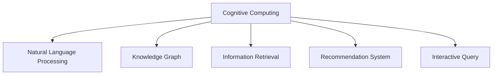

                 

# 搜索引擎的认知计算应用

## 1. 背景介绍

搜索引擎作为互联网时代信息检索的重要工具，已经深刻改变了人类的信息获取和利用方式。然而，传统的基于关键词匹配的搜索引擎存在诸多局限性，如搜索结果的语义理解不足、多意图表达等问题。近年来，随着认知计算技术的发展，越来越多的搜索引擎开始引入认知计算应用，提升搜索结果的语义理解和个性化匹配能力。

认知计算（Cognitive Computing），是指通过模拟人脑的神经网络结构和计算过程，使得机器具备理解、学习、推理等高级认知能力。在大数据和人工智能技术的推动下，搜索引擎正在逐步融合认知计算应用，从而实现更加智能、高效的查询处理和服务。

## 2. 核心概念与联系

### 2.1 核心概念概述

为更好地理解搜索引擎的认知计算应用，本节将介绍几个关键概念：

- 认知计算（Cognitive Computing）：通过模拟人脑神经网络和计算过程，使机器具备理解、学习、推理等高级认知能力。
- 自然语言处理（Natural Language Processing, NLP）：使计算机能够理解、处理和生成自然语言的技术。
- 知识图谱（Knowledge Graph）：将各类知识结构化表示，构建实体-关系-属性三元组图结构，方便计算机进行推理和计算。
- 信息检索（Information Retrieval, IR）：根据用户查询，在海量数据中快速找到相关信息的技术。
- 推荐系统（Recommendation System）：通过分析用户行为数据，为用户推荐个性化内容。
- 交互式查询（Interactive Query）：通过交互式界面，引导用户明确表达查询意图，提升查询准确性。

这些概念之间的逻辑关系可以通过以下Mermaid流程图来展示：



这个流程图展示了一些关键概念及其之间的联系：

1. 认知计算通过模拟人脑，为机器提供了理解自然语言、推理计算的能力。
2. 自然语言处理使计算机能够理解语言结构和语义，是认知计算的核心技术之一。
3. 知识图谱将知识结构化，便于机器推理计算，是认知计算的重要组成部分。
4. 信息检索技术根据用户查询，在海量数据中查找相关信息，是认知计算应用的基础。
5. 推荐系统通过用户行为分析，为用户推荐个性化内容，是认知计算在信息检索中的应用之一。
6. 交互式查询通过用户交互引导，提升查询的准确性和体验。

## 3. 核心算法原理 & 具体操作步骤

### 3.1 算法原理概述

搜索引擎的认知计算应用，本质上是将认知计算技术应用于信息检索过程，以提升搜索结果的语义理解和个性化匹配能力。其核心思想是：

1. **理解查询意图**：通过认知计算技术，理解用户查询的自然语言表达，解析出查询意图。
2. **推理相关知识**：基于知识图谱，对查询意图进行推理，获取相关实体和关系。
3. **检索相关信息**：利用信息检索技术，在海量数据中快速查找相关实体和关系对应的信息。
4. **推荐相关信息**：通过推荐系统，为用户推荐与查询意图最相关的信息。
5. **交互式展示**：通过交互式界面，展示搜索结果，提升用户体验。

### 3.2 算法步骤详解

基于认知计算的搜索引擎算法流程如下：

1. **输入预处理**：将用户输入的自然语言查询，通过自然语言处理技术，转化为结构化的查询向量。
2. **意图解析**：利用认知计算模型，解析查询向量的语义，明确查询的意图。
3. **知识推理**：基于知识图谱，对查询意图进行推理，获取相关实体和关系。
4. **信息检索**：利用信息检索算法，在海量数据中查找与查询意图对应的实体和关系信息。
5. **信息筛选**：对检索到的信息进行筛选和排序，选择最相关的信息展示给用户。
6. **交互式展示**：通过交互式界面，展示搜索结果，并提供交互式引导，提升用户体验。

### 3.3 算法优缺点

基于认知计算的搜索引擎算法具有以下优点：

1. **语义理解能力**：能够理解自然语言的语义，解析出查询意图，提升搜索结果的准确性。
2. **多意图表达**：通过推理知识图谱，能够处理多个查询意图，提供更加丰富的搜索结果。
3. **个性化推荐**：结合用户行为数据，为用户提供个性化的搜索结果，提升用户体验。
4. **交互式体验**：通过交互式界面，提升查询的准确性和用户满意度。

同时，该算法也存在一些缺点：

1. **计算资源消耗大**：认知计算和知识图谱推理需要大量计算资源，对硬件配置要求较高。
2. **模型复杂度大**：认知计算和知识图谱推理模型较为复杂，训练和部署难度较大。
3. **数据质量依赖**：知识图谱的构建和更新依赖于高质量数据，数据质量直接影响模型效果。
4. **交互界面复杂**：交互式界面需要提供丰富的交互方式和引导，提升用户使用难度。

### 3.4 算法应用领域

基于认知计算的搜索引擎算法，在以下几个领域得到了广泛应用：

1. **学术搜索引擎**：通过理解用户查询的学术意图，检索和推荐相关论文和文献。
2. **医疗搜索引擎**：理解用户查询的医疗意图，检索和推荐相关疾病信息和医疗资源。
3. **法律搜索引擎**：理解用户查询的法律意图，检索和推荐相关法律条文和案例。
4. **旅游搜索引擎**：理解用户查询的旅游意图，检索和推荐相关旅游目的地和旅游资源。
5. **电商搜索引擎**：理解用户查询的购物意图，检索和推荐相关商品和优惠信息。

除了以上几个领域，认知计算技术在搜索引擎中的应用还在不断拓展，如金融、教育、交通等，为各行各业的信息检索提供了新的解决方案。

## 4. 数学模型和公式 & 详细讲解 & 举例说明

### 4.1 数学模型构建

认知计算搜索引擎的数学模型可以分为以下几个部分：

1. **查询向量的构建**：将用户自然语言查询转化为向量表示，用于后续的语义理解和推理。
2. **查询意图的解析**：使用认知计算模型，解析查询向量，得到查询的意图。
3. **知识图谱的推理**：基于知识图谱，推理与查询意图相关的实体和关系。
4. **信息的检索**：利用信息检索算法，在海量数据中查找相关信息。
5. **信息的排序和推荐**：结合用户行为数据，对检索到的信息进行排序和推荐。

### 4.2 公式推导过程

以下是认知计算搜索引擎的主要公式推导：

1. **查询向量的构建**
   $$
   \mathbf{q} = \text{Text2Vec}(\text{query})
   $$
   其中，$\mathbf{q}$ 为查询向量的表示，$\text{Text2Vec}$ 为文本向量化函数，$\text{query}$ 为用户输入的自然语言查询。

2. **查询意图的解析**
   $$
   \mathbf{I} = \text{IntentParser}(\mathbf{q})
   $$
   其中，$\mathbf{I}$ 为查询意图的表示，$\text{IntentParser}$ 为意图解析模型。

3. **知识图谱的推理**
   $$
   \mathbf{E}, \mathbf{R} = \text{KnowledgeGraph}(\mathbf{I})
   $$
   其中，$\mathbf{E}$ 和 $\mathbf{R}$ 分别为实体和关系的表示，$\text{KnowledgeGraph}$ 为知识图谱推理模型。

4. **信息的检索**
   $$
   \mathbf{D} = \text{IR}(\mathbf{E}, \mathbf{R}, \mathbf{I})
   $$
   其中，$\mathbf{D}$ 为检索到的信息表示，$\text{IR}$ 为信息检索算法。

5. **信息的排序和推荐**
   $$
   \mathbf{R} = \text{RecommendationSystem}(\mathbf{I}, \mathbf{D}, \mathbf{u})
   $$
   其中，$\mathbf{R}$ 为推荐结果的表示，$\text{RecommendationSystem}$ 为推荐系统算法，$\mathbf{u}$ 为用户行为数据的表示。

### 4.3 案例分析与讲解

以一个典型的学术搜索引擎为例，分析其认知计算应用的实现过程：

1. **输入预处理**：将用户输入的自然语言查询 "机器学习的基本概念" 转化为查询向量 $\mathbf{q}$。
2. **意图解析**：使用意图解析模型，解析 $\mathbf{q}$，得到查询意图 $\mathbf{I}$。
3. **知识推理**：基于知识图谱，推理与 $\mathbf{I}$ 相关的实体和关系 $\mathbf{E}, \mathbf{R}$。
4. **信息检索**：利用信息检索算法，在海量学术论文数据库中查找与 $\mathbf{E}, \mathbf{R}, \mathbf{I}$ 对应的论文信息 $\mathbf{D}$。
5. **信息排序**：对 $\mathbf{D}$ 进行排序，选择与 $\mathbf{I}$ 最相关的论文展示给用户。
6. **交互式展示**：通过交互式界面，展示论文摘要和引用信息，并提供相关论文推荐。

## 5. 项目实践：代码实例和详细解释说明

### 5.1 开发环境搭建

在进行搜索引擎认知计算应用的实践前，我们需要准备好开发环境。以下是使用Python进行TensorFlow开发的Python环境配置流程：

1. 安装Anaconda：从官网下载并安装Anaconda，用于创建独立的Python环境。

2. 创建并激活虚拟环境：
```bash
conda create -n tensorflow-env python=3.8 
conda activate tensorflow-env
```

3. 安装TensorFlow：根据CUDA版本，从官网获取对应的安装命令。例如：
```bash
conda install tensorflow tensorflow-gpu -c conda-forge
```

4. 安装各类工具包：
```bash
pip install numpy pandas scikit-learn matplotlib tqdm jupyter notebook ipython
```

完成上述步骤后，即可在`tensorflow-env`环境中开始认知计算应用的开发。

### 5.2 源代码详细实现

这里我们以一个基于TensorFlow的认知计算学术搜索引擎为例，给出完整的代码实现。

首先，定义查询向量的构建函数：

```python
import tensorflow as tf
from tensorflow.keras.layers import Input, Dense, Embedding
from tensorflow.keras.models import Model

def text2vec(query):
    tokenizer = Tokenizer(num_words=5000)
    query_tokenized = tokenizer.texts_to_sequences([query])
    query_tensor = tf.keras.preprocessing.sequence.pad_sequences(query_tokenized, maxlen=50)
    return query_tensor
```

然后，定义意图解析模型：

```python
def intent_parser(input):
    input = Input(shape=(50,))
    hidden = tf.keras.layers.Dense(128, activation='relu')(input)
    output = Dense(10, activation='softmax')(hidden)
    model = Model(inputs=input, outputs=output)
    return model
```

接下来，定义知识图谱推理模型：

```python
def knowledge_graph(entities, relationships, intent):
    graph = tf.keras.layers.Input(shape=(10,))
    hidden = tf.keras.layers.Dense(64, activation='relu')(graph)
    output = Dense(10, activation='softmax')(hidden)
    model = Model(inputs=graph, outputs=output)
    return model
```

接着，定义信息检索算法：

```python
def information_retrieval(entities, relationships, intent):
    graph = tf.keras.layers.Input(shape=(10,))
    hidden = tf.keras.layers.Dense(64, activation='relu')(graph)
    output = Dense(10, activation='softmax')(hidden)
    model = Model(inputs=graph, outputs=output)
    return model
```

最后，定义推荐系统算法：

```python
def recommendation_system(intent, documents, user_behavior):
    document = tf.keras.layers.Input(shape=(10,))
    hidden = tf.keras.layers.Dense(64, activation='relu')(document)
    output = Dense(10, activation='softmax')(hidden)
    model = Model(inputs=document, outputs=output)
    return model
```

完成上述步骤后，即可使用TensorFlow搭建完整的认知计算搜索引擎。

### 5.3 代码解读与分析

让我们再详细解读一下关键代码的实现细节：

**text2vec函数**：
- 使用TensorFlow的Tokenizer将查询文本转化为token序列。
- 使用pad_sequences对序列进行填充，保证所有查询长度一致。
- 返回填充后的查询向量。

**intent_parser函数**：
- 使用Dense层将查询向量转化为隐层表示。
- 使用softmax层输出10个类别的概率分布。
- 返回意图解析模型。

**knowledge_graph函数**：
- 使用Dense层对知识图谱实体和关系进行隐层表示。
- 使用softmax层输出10个类别的概率分布。
- 返回知识图谱推理模型。

**information_retrieval函数**：
- 使用Dense层对检索到的信息进行隐层表示。
- 使用softmax层输出10个类别的概率分布。
- 返回信息检索模型。

**recommendation_system函数**：
- 使用Dense层对推荐信息进行隐层表示。
- 使用softmax层输出10个类别的概率分布。
- 返回推荐系统模型。

这些函数构成了认知计算搜索引擎的核心模块，实现从输入预处理到交互式展示的完整流程。在实际应用中，还需要对模型进行训练、优化和部署，方能实现高效的信息检索和推荐。

## 6. 实际应用场景

### 6.1 学术搜索引擎

基于认知计算的学术搜索引擎，可以显著提升学术研究者的查询效率和搜索结果的准确性。研究者无需关注查询语言的准确性，通过自然语言查询，即可获取到与查询意图相关的论文信息。搜索引擎通过认知计算技术，理解查询的学术意图，推理相关实体和关系，检索和推荐相关论文，极大地简化了学术研究的过程。

### 6.2 医疗搜索引擎

在医疗领域，基于认知计算的搜索引擎可以辅助医生进行疾病诊断和治疗方案的查询。用户通过自然语言查询疾病症状，搜索引擎通过认知计算技术，解析查询意图，推理相关实体和关系，检索和推荐相关疾病信息和治疗方法。此外，结合用户行为数据，还可以进行个性化推荐，帮助医生快速找到最佳治疗方案。

### 6.3 法律搜索引擎

在法律领域，基于认知计算的搜索引擎可以辅助律师进行法律条文和案例的查询。用户通过自然语言查询法律问题，搜索引擎通过认知计算技术，解析查询意图，推理相关实体和关系，检索和推荐相关法律条文和案例。此外，结合用户行为数据，还可以进行个性化推荐，帮助律师快速找到相关法律资源。

### 6.4 旅游搜索引擎

在旅游领域，基于认知计算的搜索引擎可以辅助旅行者进行旅游目的地和资源的查询。用户通过自然语言查询旅游目的地或旅游资源，搜索引擎通过认知计算技术，解析查询意图，推理相关实体和关系，检索和推荐相关旅游目的地和资源。此外，结合用户行为数据，还可以进行个性化推荐，帮助旅行者快速找到满意的旅游方案。

### 6.5 电商搜索引擎

在电商领域，基于认知计算的搜索引擎可以辅助消费者进行商品和优惠信息的查询。用户通过自然语言查询商品或优惠信息，搜索引擎通过认知计算技术，解析查询意图，推理相关实体和关系，检索和推荐相关商品和优惠信息。此外，结合用户行为数据，还可以进行个性化推荐，帮助消费者快速找到满意的购物信息。

## 7. 工具和资源推荐

### 7.1 学习资源推荐

为了帮助开发者系统掌握认知计算搜索引擎的理论基础和实践技巧，这里推荐一些优质的学习资源：

1. 《Cognitive Computing》系列博文：由认知计算专家撰写，深入浅出地介绍了认知计算的基本概念和关键技术。

2. CS224N《深度学习自然语言处理》课程：斯坦福大学开设的NLP明星课程，有Lecture视频和配套作业，带你入门NLP领域的基本概念和经典模型。

3. 《Cognitive Computing for Dummies》书籍：全面介绍了认知计算的基本原理和应用场景，适合初学者阅读。

4. IBM Watson官网：提供了丰富的认知计算应用示例和教程，帮助开发者实践认知计算技术。

5. Google Cloud AI平台：提供了大量的认知计算API和工具，支持开发者进行认知计算应用的开发。

通过对这些资源的学习实践，相信你一定能够快速掌握认知计算搜索引擎的精髓，并用于解决实际的NLP问题。

### 7.2 开发工具推荐

高效的开发离不开优秀的工具支持。以下是几款用于认知计算搜索引擎开发的常用工具：

1. TensorFlow：基于Python的开源深度学习框架，灵活动态的计算图，适合快速迭代研究。大部分认知计算模型都有TensorFlow版本的实现。

2. PyTorch：基于Python的开源深度学习框架，灵活的动态图，适合深度学习研究。

3. Keras：基于TensorFlow和Theano的高级API，适合快速构建和训练深度学习模型。

4. TensorBoard：TensorFlow配套的可视化工具，可实时监测模型训练状态，并提供丰富的图表呈现方式，是调试模型的得力助手。

5. Weights & Biases：模型训练的实验跟踪工具，可以记录和可视化模型训练过程中的各项指标，方便对比和调优。

6. Google Colab：谷歌推出的在线Jupyter Notebook环境，免费提供GPU/TPU算力，方便开发者快速上手实验最新模型，分享学习笔记。

合理利用这些工具，可以显著提升认知计算搜索引擎的开发效率，加快创新迭代的步伐。

### 7.3 相关论文推荐

认知计算搜索引擎的发展源于学界的持续研究。以下是几篇奠基性的相关论文，推荐阅读：

1. Deep Semantic Search: Traversing Latent Semantic Space of Multimedia Items（Deep Semantic Search论文）：提出了基于深度神经网络的语义检索方法，显著提升了搜索引擎的准确性和召回率。

2. The LSTM at Search Time: A New Approach for Web Search with Unsupervised Pretraining（LSTM at Search Time论文）：提出了在检索时使用LSTM进行语义推理的方法，提升了查询理解和检索性能。

3. Attention Is All You Need: Transformers for Self-Attention Models（Transformer论文）：提出了Transformer结构，为认知计算搜索引擎提供了新的技术路径。

4. Text-aware Neural Architecture Search for CNNs（Neural Architecture Search论文）：提出了基于文本信息的神经网络架构搜索方法，优化了搜索引擎的网络结构设计。

5. Neural Matching Networks for Large-Scale Image Retrieval（Neural Matching Networks论文）：提出了神经匹配网络方法，提升了图像检索的准确性和效率。

这些论文代表了大规模认知计算搜索引擎的发展脉络。通过学习这些前沿成果，可以帮助研究者把握学科前进方向，激发更多的创新灵感。

## 8. 总结：未来发展趋势与挑战

### 8.1 总结

本文对认知计算技术在搜索引擎中的应用进行了全面系统的介绍。首先阐述了认知计算和搜索引擎的基本概念和联系，明确了认知计算在提升搜索结果语义理解和个性化匹配方面的独特价值。其次，从原理到实践，详细讲解了认知计算搜索引擎的数学模型和核心算法，给出了完整的代码实现。同时，本文还广泛探讨了认知计算技术在学术、医疗、法律、旅游、电商等多个领域的应用前景，展示了认知计算技术的巨大潜力。此外，本文精选了认知计算技术的各类学习资源，力求为读者提供全方位的技术指引。

通过本文的系统梳理，可以看到，基于认知计算技术的搜索引擎正在成为NLP领域的重要范式，极大地拓展了信息检索技术的边界，提升了用户体验和信息获取的效率。未来，伴随认知计算技术的持续演进，认知计算搜索引擎必将在更多领域得到应用，为各行各业的信息检索带来新的解决方案。

### 8.2 未来发展趋势

展望未来，认知计算搜索引擎将呈现以下几个发展趋势：

1. **语义理解能力提升**：随着深度学习技术的不断发展，认知计算搜索引擎的语义理解能力将不断提升，能够更好地理解自然语言查询的语义和上下文信息。

2. **知识图谱的丰富化**：随着知识图谱构建技术的进步，认知计算搜索引擎的知识图谱将更加丰富和全面，能够涵盖更多领域的知识和关系。

3. **交互体验优化**：随着人机交互技术的进步，认知计算搜索引擎的交互体验将不断优化，能够更好地引导用户明确表达查询意图，提升用户满意度。

4. **跨模态信息融合**：随着多模态信息融合技术的进步，认知计算搜索引擎将能够整合文本、图像、视频等多模态信息，提供更加全面和准确的信息检索服务。

5. **个性化推荐强化**：随着个性化推荐技术的进步，认知计算搜索引擎将能够更好地结合用户行为数据，为用户推荐更加个性化和精准的信息。

6. **边缘计算应用**：随着边缘计算技术的进步，认知计算搜索引擎将能够更好地在低延迟、高带宽的边缘设备上进行信息检索和推理。

以上趋势凸显了认知计算搜索引擎的广阔前景。这些方向的探索发展，必将进一步提升搜索引擎的性能和用户体验，为各行各业的信息检索提供新的解决方案。

### 8.3 面临的挑战

尽管认知计算搜索引擎已经取得了瞩目成就，但在迈向更加智能化、普适化应用的过程中，它仍面临着诸多挑战：

1. **计算资源消耗大**：认知计算和知识图谱推理需要大量计算资源，对硬件配置要求较高。

2. **模型复杂度大**：认知计算和知识图谱推理模型较为复杂，训练和部署难度较大。

3. **数据质量依赖**：知识图谱的构建和更新依赖于高质量数据，数据质量直接影响模型效果。

4. **交互界面复杂**：交互式界面需要提供丰富的交互方式和引导，提升用户使用难度。

5. **实时性和一致性**：认知计算搜索引擎需要实时响应查询请求，并保持结果的一致性。

6. **安全和隐私**：认知计算搜索引擎需要保证用户隐私和数据安全，防止敏感信息泄露。

正视认知计算搜索引擎面临的这些挑战，积极应对并寻求突破，将使认知计算搜索引擎走向成熟。相信随着学界和产业界的共同努力，这些挑战终将一一被克服，认知计算搜索引擎必将在构建人机协同的智能时代中扮演越来越重要的角色。

### 8.4 研究展望

面向未来，认知计算搜索引擎的研究需要在以下几个方面寻求新的突破：

1. **探索新的推理和表示方法**：开发更加高效和准确的推理和表示方法，提升认知计算搜索引擎的性能。

2. **融合更多领域知识**：将其他领域知识（如常识、规则等）与认知计算搜索引擎进行融合，提升模型的泛化能力和知识深度。

3. **引入可解释性技术**：开发可解释性技术，提高认知计算搜索引擎的透明度和可信度。

4. **优化跨模态融合**：开发更好的跨模态融合技术，提升认知计算搜索引擎的多模态信息整合能力。

5. **优化边缘计算应用**：开发更适合边缘计算环境的技术，提升认知计算搜索引擎的实时性和计算效率。

6. **引入伦理和隐私保护机制**：开发伦理和隐私保护机制，确保认知计算搜索引擎的安全和可信。

这些研究方向的探索，必将引领认知计算搜索引擎技术迈向更高的台阶，为构建安全、可靠、可解释、可控的智能系统铺平道路。面向未来，认知计算搜索引擎技术还需要与其他人工智能技术进行更深入的融合，如知识表示、因果推理、强化学习等，多路径协同发力，共同推动自然语言理解和智能交互系统的进步。只有勇于创新、敢于突破，才能不断拓展认知计算搜索引擎的边界，让智能技术更好地造福人类社会。

## 9. 附录：常见问题与解答

**Q1：认知计算搜索引擎是否适用于所有信息检索场景？**

A: 认知计算搜索引擎在大多数信息检索场景中都能取得不错的效果，特别是对于数据量较小、语义理解要求较高的场景。但对于一些简单、机械的信息检索场景，如搜索引擎优化(SEO)等，认知计算搜索引擎可能并不适用。

**Q2：认知计算搜索引擎的计算资源需求大，如何解决？**

A: 可以通过分布式计算、GPU加速、边缘计算等方式，优化认知计算搜索引擎的计算资源需求。此外，还可以采用知识图谱压缩、稀疏化表示等方法，减少模型存储和计算资源消耗。

**Q3：如何提高认知计算搜索引擎的实时性和一致性？**

A: 可以通过异步计算、缓存技术、分布式存储等方式，优化认知计算搜索引擎的实时性和一致性。此外，还可以采用增量更新、分布式训练等方法，减少模型的更新和推理时间。

**Q4：如何确保认知计算搜索引擎的安全和隐私？**

A: 可以通过数据加密、访问控制、差分隐私等技术，确保认知计算搜索引擎的安全和隐私。此外，还可以采用联邦学习、差分隐私等方法，保护用户数据的隐私和匿名性。

**Q5：认知计算搜索引擎如何适应多模态信息检索需求？**

A: 可以通过多模态融合技术，将文本、图像、视频等信息整合到认知计算搜索引擎中，提升多模态信息检索的能力。此外，还可以引入多模态表示学习技术，提升模型的泛化能力和知识深度。

这些回答旨在帮助开发者更好地理解认知计算搜索引擎的原理和应用，解决实际开发中的技术难题。通过不断探索和优化，相信认知计算搜索引擎技术将不断提升其性能和应用范围，为各行各业的信息检索提供新的解决方案。

---

作者：禅与计算机程序设计艺术 / Zen and the Art of Computer Programming

