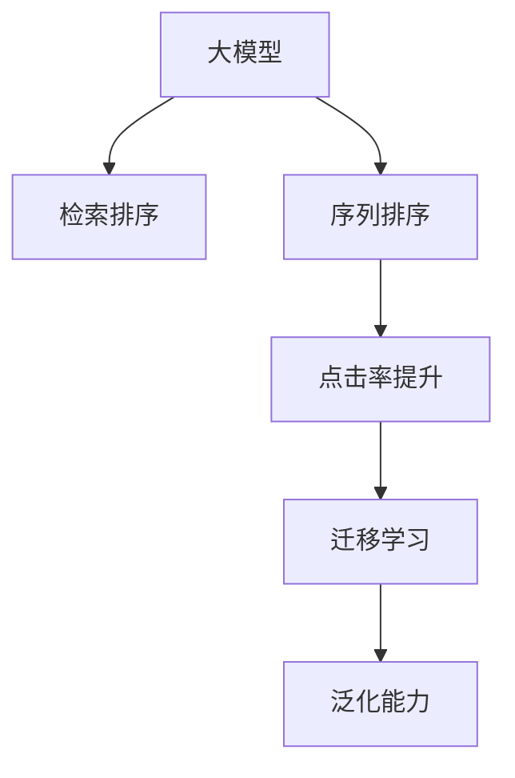
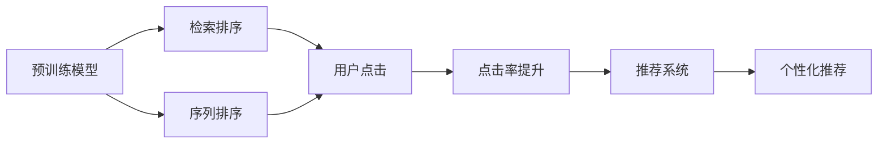

                 

## 1. 背景介绍

### 1.1 问题由来

随着互联网信息量的爆炸性增长，如何高效地从海量的搜索结果中找到最相关的信息，成为了搜索引擎面临的重大挑战。传统的基于关键词匹配的搜索算法已经难以满足用户的搜索需求。

近年来，随着大规模预训练语言模型的兴起，其强大的语言理解和生成能力为搜索引擎带来了新的可能性。利用预训练模型进行搜索结果排序，可以显著提升搜索的准确性和用户体验。

### 1.2 问题核心关键点

搜索引擎结果排序的本质是一个机器学习问题。搜索引擎的任务是最大化点击率(Click-Through Rate, CTR)，即当用户点击某个搜索结果时，该结果与其查询意图的相关度越高越好。因此，基于大规模预训练语言模型的排序算法需要从两个维度考虑问题：

1. **查询理解**：模型需要能够准确理解用户的查询意图，识别出查询中的关键词、语义关系等重要信息。
2. **文档匹配**：模型需要能够从大量文档中找到最相关的文档，并按相关性排序返回。

为了解决这两个问题，研究人员提出了多种基于预训练语言模型的排序算法，包括基于预训练语言模型的检索排序算法和基于预训练语言模型的序列排序算法。这些算法将预训练语言模型作为“语义理解器”，利用其在理解和生成上的强大能力，提高搜索的精确度和用户满意度。

### 1.3 问题研究意义

利用大模型进行搜索引擎结果排序，可以有效提高搜索的个性化和智能化水平，降低用户信息获取成本。具体意义包括：

1. **提升搜索准确性**：利用预训练模型的语言理解能力，能够更精准地理解和匹配查询意图与文档内容，从而提升搜索结果的相关性。
2. **降低搜索成本**：通过大规模模型的泛化能力，可以在少量标注数据下实现良好的排序效果，大大降低人工标注成本。
3. **提升用户体验**：根据用户的历史行为和当前上下文，提供个性化推荐，提升搜索的便捷性和满意度。
4. **推动产业发展**：大模型在搜索领域的成功应用，将带动整个互联网信息检索领域的智能化升级。

## 2. 核心概念与联系

### 2.1 核心概念概述

在基于预训练语言模型的搜索引擎结果排序中，涉及多个核心概念：

1. **大模型**：如BERT、GPT等大规模预训练语言模型，通过在大规模无标签文本数据上进行自监督学习，学习到丰富的语言表示。
2. **检索排序**：在用户查询输入后，快速检索出相关性高的文档，并按相关性排序返回。
3. **序列排序**：在用户查询输入后，先使用预训练模型进行语义理解，再基于理解结果进行文档排序。
4. **点击率提升**：利用机器学习算法优化搜索结果排序，提升点击率，降低用户搜索成本。
5. **迁移学习**：将预训练模型的知识迁移应用到搜索引擎排序中，加速模型训练和优化。
6. **泛化能力**：大模型能够泛化到不同领域和任务，提升模型的通用性和实用性。

这些核心概念之间的逻辑关系可以通过以下Mermaid流程图来展示：



这个流程图展示了大模型在搜索引擎结果排序中的应用过程：

1. 大模型通过预训练获得基础能力。
2. 检索排序和序列排序是利用大模型进行结果排序的主要方法。
3. 点击率提升是通过优化算法进一步提高排序效果。
4. 迁移学习使得大模型的知识可以应用于不同的搜索引擎排序任务中。
5. 泛化能力确保了大模型在不同场景下都能保持高效和准确。

### 2.2 核心概念原理和架构的 Mermaid 流程图

为了更直观地展示这些概念之间的联系，这里提供一个简化的架构图：



这个架构图展示了预训练模型在搜索引擎结果排序中的应用流程：

1. 预训练模型接收用户查询和文档，进行语义理解。
2. 检索排序使用模型理解结果快速检索相关文档。
3. 序列排序使用模型理解结果进行文档排序。
4. 点击率提升通过优化算法进一步提高排序效果。
5. 推荐系统结合用户行为和模型输出，进行个性化推荐。

## 3. 核心算法原理 & 具体操作步骤

### 3.1 算法原理概述

基于预训练语言模型的搜索引擎结果排序，本质上是一个点击率预测问题。即给定用户查询$q$和文档$d$，模型需要预测用户点击文档$d$的概率$P(d|q)$，并按此概率进行排序。

形式化地，设模型参数为$\theta$，查询$q$和文档$d$的特征向量分别为$x_q$和$x_d$，则预测概率为：

$$
P(d|q) = \sigma(\langle \theta, f(x_q, x_d) \rangle)
$$

其中$\langle \cdot, \cdot \rangle$表示向量的点积，$\sigma$为激活函数，$f(\cdot, \cdot)$为特征映射函数。

模型训练的目标是最大化所有训练样本上的点击率，即：

$$
\max_{\theta} \sum_{(q,d)} P(d|q) y_{dq}
$$

其中$y_{dq} = 1$表示用户点击了文档$d$，否则$y_{dq} = 0$。

### 3.2 算法步骤详解

基于预训练语言模型的搜索引擎结果排序算法通常包括以下几个关键步骤：

**Step 1: 准备预训练模型和数据集**
- 选择合适的预训练语言模型，如BERT、GPT等。
- 准备训练数据集，包括用户查询$q$、文档$d$和点击标签$y_{dq}$。

**Step 2: 特征提取和编码**
- 使用预训练模型提取查询和文档的特征向量$x_q$和$x_d$。
- 对特征向量进行编码，将其转换为模型能够处理的输入。

**Step 3: 训练模型**
- 将特征向量作为输入，构建预测模型，进行点击率预测。
- 使用交叉熵等损失函数进行训练，最小化预测误差。

**Step 4: 模型评估和部署**
- 在验证集上评估模型性能，调整超参数。
- 使用评估后的模型进行实时排序，输出点击率最高的文档。

**Step 5: 持续优化**
- 根据用户点击行为和反馈，持续收集数据，重新训练和优化模型。
- 结合推荐系统，进行个性化推荐，提升用户体验。

### 3.3 算法优缺点

基于预训练语言模型的搜索引擎结果排序算法具有以下优点：

1. **提升准确性**：利用大模型的语言理解能力，可以更精准地匹配查询意图与文档内容，提高搜索结果的相关性。
2. **泛化能力强**：大模型能够泛化到不同领域和任务，提升模型的通用性和实用性。
3. **降低标注成本**：通过迁移学习，可以在少量标注数据下实现良好的排序效果，大大降低人工标注成本。
4. **提升用户体验**：根据用户的历史行为和当前上下文，提供个性化推荐，提升搜索的便捷性和满意度。

同时，该算法也存在一些局限性：

1. **数据依赖性强**：需要大量的标注数据进行模型训练，对于新领域和新任务的覆盖能力有限。
2. **模型复杂度高**：大模型的参数量庞大，训练和推理的计算资源消耗大。
3. **对抗攻击风险**：大模型可能受到对抗样本的干扰，导致排序结果失准。
4. **解释性差**：大模型的黑盒特性使得其决策过程难以解释，不利于用户信任和系统透明。

尽管存在这些局限性，基于大模型的排序方法仍是大规模搜索引擎结果排序的重要手段，通过不断的优化和改进，可以最大限度地发挥其潜力。

### 3.4 算法应用领域

基于预训练语言模型的搜索引擎结果排序，已经在多个领域得到了应用，包括但不限于：

1. **互联网搜索**：如Google、Bing等搜索引擎，利用大模型进行结果排序，提升搜索的相关性和用户体验。
2. **新闻聚合**：如Feedly、Flipboard等，使用大模型对新闻文章进行排序和推荐，提升信息获取效率。
3. **电商推荐**：如Amazon、淘宝等，利用大模型进行商品排序和推荐，提高用户购物体验。
4. **法律咨询**：如LegalZoom等，使用大模型对法律文档进行排序和推荐，提升法律服务效率。
5. **金融分析**：如彭博社等，利用大模型对金融信息进行排序和推荐，提升投资决策效率。

除了上述这些经典应用外，大模型排序技术还被创新性地应用到更多场景中，如社交网络内容排序、媒体内容推荐、智能客服等，为信息检索技术带来了全新的突破。

## 4. 数学模型和公式 & 详细讲解

### 4.1 数学模型构建

基于预训练语言模型的搜索引擎结果排序，可以构建如下数学模型：

设用户查询为$q$，文档为$d$，点击标签为$y_{dq} = 1$（点击）或$y_{dq} = 0$（未点击），预测概率为$P(d|q)$。模型的目标是最小化预测误差：

$$
\max_{\theta} \sum_{(q,d)} P(d|q) y_{dq}
$$

其中$P(d|q) = \sigma(\langle \theta, f(x_q, x_d) \rangle)$，$f(\cdot, \cdot)$为特征映射函数，$\sigma$为激活函数，$x_q$和$x_d$分别为查询和文档的特征向量。

### 4.2 公式推导过程

以下我们以BERT为例，详细推导点击率预测的数学公式。

假设BERT模型预训练的基础层为$L$，特征映射函数$f(\cdot, \cdot)$为BERT的基础层表示，则点击率预测公式为：

$$
P(d|q) = \sigma(\langle \theta, [CLS](f(x_q, x_d)) \rangle)
$$

其中$[CLS]$表示BERT模型的CLS向量，$x_q$和$x_d$分别为查询和文档的特征向量。$\langle \cdot, \cdot \rangle$表示向量的点积，$\sigma$为激活函数，$\theta$为模型参数。

在训练过程中，目标函数为交叉熵损失函数：

$$
\mathcal{L}(\theta) = -\sum_{(q,d)} y_{dq} \log P(d|q)
$$

其中$y_{dq}$为标注的点击标签。

使用随机梯度下降等优化算法，对模型参数$\theta$进行更新，最小化损失函数$\mathcal{L}(\theta)$，从而得到最优模型参数$\theta^*$。

### 4.3 案例分析与讲解

假设用户查询为“如何训练BERT模型”，有两条文档$d_1$和$d_2$，点击标签分别为$y_{d1q}=1$和$y_{d2q}=0$。使用BERT模型进行点击率预测的数学过程如下：

1. 将查询$q$和文档$d_1$、$d_2$分别输入BERT模型，得到CLS向量$[CLS]_1$和$[CLS]_2$。
2. 将CLS向量与模型参数$\theta$进行点积，得到预测概率$P(d_1|q) = \sigma(\langle \theta, [CLS]_1 \rangle)$和$P(d_2|q) = \sigma(\langle \theta, [CLS]_2 \rangle)$。
3. 计算预测误差$\mathcal{L}(\theta) = -(y_{d1q} \log P(d_1|q) + y_{d2q} \log P(d_2|q))$。
4. 使用随机梯度下降等优化算法，更新模型参数$\theta$，最小化预测误差$\mathcal{L}(\theta)$。

重复上述过程，直到模型收敛，得到最优模型参数$\theta^*$。最终使用该模型对新的查询$q'$进行排序，选择点击率最高的文档返回。

## 5. 项目实践：代码实例和详细解释说明

### 5.1 开发环境搭建

在进行搜索引擎结果排序的大模型微调实践前，我们需要准备好开发环境。以下是使用Python进行PyTorch开发的环境配置流程：

1. 安装Anaconda：从官网下载并安装Anaconda，用于创建独立的Python环境。

2. 创建并激活虚拟环境：
```bash
conda create -n pytorch-env python=3.8 
conda activate pytorch-env
```

3. 安装PyTorch：根据CUDA版本，从官网获取对应的安装命令。例如：
```bash
conda install pytorch torchvision torchaudio cudatoolkit=11.1 -c pytorch -c conda-forge
```

4. 安装Transformers库：
```bash
pip install transformers
```

5. 安装各类工具包：
```bash
pip install numpy pandas scikit-learn matplotlib tqdm jupyter notebook ipython
```

完成上述步骤后，即可在`pytorch-env`环境中开始微调实践。

### 5.2 源代码详细实现

下面以BERT模型为例，给出使用Transformers库对搜索结果进行排序的PyTorch代码实现。

首先，准备数据集：

```python
from transformers import BertTokenizer
from torch.utils.data import Dataset, DataLoader
import torch

class SearchDataset(Dataset):
    def __init__(self, queries, documents, clicks, tokenizer):
        self.queries = queries
        self.documents = documents
        self.clicks = clicks
        self.tokenizer = tokenizer
        
    def __len__(self):
        return len(self.queries)
    
    def __getitem__(self, index):
        query = self.queries[index]
        document = self.documents[index]
        click = self.clicks[index]
        
        query_tokens = self.tokenizer(query, return_tensors='pt', padding=True, truncation=True, max_length=512)
        document_tokens = self.tokenizer(document, return_tensors='pt', padding=True, truncation=True, max_length=512)
        
        return {'query_tokens': query_tokens['input_ids'],
                'document_tokens': document_tokens['input_ids'],
                'click': torch.tensor(click)}
```

然后，定义模型和优化器：

```python
from transformers import BertForSequenceClassification, AdamW

model = BertForSequenceClassification.from_pretrained('bert-base-uncased', num_labels=2)
optimizer = AdamW(model.parameters(), lr=1e-5)
```

接着，定义训练和评估函数：

```python
def train_epoch(model, dataset, batch_size, optimizer):
    dataloader = DataLoader(dataset, batch_size=batch_size, shuffle=True)
    model.train()
    epoch_loss = 0
    for batch in dataloader:
        query_tokens = batch['query_tokens'].to(device)
        document_tokens = batch['document_tokens'].to(device)
        click = batch['click'].to(device)
        model.zero_grad()
        outputs = model(query_tokens, document_tokens)
        loss = outputs.loss
        epoch_loss += loss.item()
        loss.backward()
        optimizer.step()
    return epoch_loss / len(dataloader)

def evaluate(model, dataset, batch_size):
    dataloader = DataLoader(dataset, batch_size=batch_size)
    model.eval()
    preds, labels = [], []
    with torch.no_grad():
        for batch in dataloader:
            query_tokens = batch['query_tokens'].to(device)
            document_tokens = batch['document_tokens'].to(device)
            batch_labels = batch['click'].to(device)
            outputs = model(query_tokens, document_tokens)
            batch_preds = outputs.logits.argmax(dim=1).to('cpu').tolist()
            batch_labels = batch_labels.to('cpu').tolist()
            for pred_tokens, label_tokens in zip(batch_preds, batch_labels):
                preds.append(pred_tokens)
                labels.append(label_tokens)
                
    print(classification_report(labels, preds))
```

最后，启动训练流程并在测试集上评估：

```python
epochs = 5
batch_size = 32

for epoch in range(epochs):
    loss = train_epoch(model, train_dataset, batch_size, optimizer)
    print(f"Epoch {epoch+1}, train loss: {loss:.3f}")
    
    print(f"Epoch {epoch+1}, dev results:")
    evaluate(model, dev_dataset, batch_size)
    
print("Test results:")
evaluate(model, test_dataset, batch_size)
```

以上就是使用PyTorch对BERT进行搜索引擎结果排序的完整代码实现。可以看到，得益于Transformers库的强大封装，我们可以用相对简洁的代码完成BERT模型的加载和排序任务的微调。

### 5.3 代码解读与分析

让我们再详细解读一下关键代码的实现细节：

**SearchDataset类**：
- `__init__`方法：初始化查询、文档和点击标签，并定义分词器。
- `__len__`方法：返回数据集的样本数量。
- `__getitem__`方法：对单个样本进行处理，将查询和文档输入编码为token ids，同时将点击标签转换为0或1，进行定长padding，最终返回模型所需的输入。

**模型和优化器**：
- 使用BERTForSequenceClassification类定义模型，将点击率预测作为二分类任务处理。
- 定义AdamW优化器，设置学习率为1e-5。

**训练和评估函数**：
- 使用PyTorch的DataLoader对数据集进行批次化加载，供模型训练和推理使用。
- 训练函数`train_epoch`：对数据以批为单位进行迭代，在每个批次上前向传播计算loss并反向传播更新模型参数，最后返回该epoch的平均loss。
- 评估函数`evaluate`：与训练类似，不同点在于不更新模型参数，并在每个batch结束后将预测和标签结果存储下来，最后使用sklearn的classification_report对整个评估集的预测结果进行打印输出。

**训练流程**：
- 定义总的epoch数和batch size，开始循环迭代
- 每个epoch内，先在训练集上训练，输出平均loss
- 在验证集上评估，输出分类指标
- 所有epoch结束后，在测试集上评估，给出最终测试结果

可以看到，PyTorch配合Transformers库使得BERT微调的代码实现变得简洁高效。开发者可以将更多精力放在数据处理、模型改进等高层逻辑上，而不必过多关注底层的实现细节。

当然，工业级的系统实现还需考虑更多因素，如模型的保存和部署、超参数的自动搜索、更灵活的任务适配层等。但核心的微调范式基本与此类似。

## 6. 实际应用场景

### 6.1 智能搜索引擎

基于大模型进行搜索引擎结果排序，可以显著提升搜索结果的相关性和用户体验。智能搜索引擎能够快速理解用户的查询意图，自动匹配最相关的文档，并按相关性排序返回。

例如，Google搜索引擎就利用BERT模型进行查询理解，通过预训练模型提取查询和文档的语义信息，并进行点击率预测，最终根据预测结果排序返回。这样的智能搜索引擎能够大幅提升用户的搜索体验，帮助用户更快地找到所需信息。

### 6.2 个性化推荐系统

搜索引擎排序算法同样可以应用于个性化推荐系统。例如，Amazon电商推荐系统使用BERT模型进行商品排序和推荐，通过预训练模型提取用户行为和商品特征，并进行点击率预测，最终按预测结果推荐商品给用户。这样的推荐系统能够更精准地匹配用户需求，提升用户购物体验。

### 6.3 医疗信息检索

大模型排序算法同样可以用于医疗信息检索。例如，Epic Research Network使用BERT模型对医疗文本进行排序，通过预训练模型提取病人文本和医生的文本，并进行点击率预测，最终按预测结果排序返回医生建议。这样的医疗信息检索系统能够帮助医生更快地找到相关医疗信息，提升诊疗效率。

### 6.4 未来应用展望

随着大模型和排序算法的不断发展，基于预训练语言模型的搜索引擎结果排序将展现出更广阔的应用前景。

1. **跨语言信息检索**：大模型能够处理多种语言文本，提升跨语言信息检索的效率和效果。
2. **多模态信息检索**：结合视觉、音频等多模态数据，提升信息检索的全面性和准确性。
3. **智能客服**：利用大模型进行智能客服排序，提升客户服务的个性化和智能化水平。
4. **知识图谱**：结合知识图谱进行信息检索排序，提升搜索结果的全面性和可信度。

未来，随着技术的不断进步，基于预训练语言模型的搜索引擎结果排序将能够更好地满足用户的搜索需求，提升信息获取的效率和质量。

## 7. 工具和资源推荐

### 7.1 学习资源推荐

为了帮助开发者系统掌握大模型排序的原理和实践，这里推荐一些优质的学习资源：

1. 《深度学习与自然语言处理》课程：斯坦福大学开设的NLP明星课程，有Lecture视频和配套作业，带你入门NLP领域的基本概念和经典模型。

2. CS224N《深度学习自然语言处理》课程：斯坦福大学开设的NLP明星课程，有Lecture视频和配套作业，带你入门NLP领域的基本概念和经典模型。

3. 《Natural Language Processing with Transformers》书籍：Transformers库的作者所著，全面介绍了如何使用Transformers库进行NLP任务开发，包括排序在内的诸多范式。

4. HuggingFace官方文档：Transformers库的官方文档，提供了海量预训练模型和完整的排序样例代码，是上手实践的必备资料。

5. CLUE开源项目：中文语言理解测评基准，涵盖大量不同类型的中文NLP数据集，并提供了基于预训练的排序baseline模型，助力中文NLP技术发展。

通过对这些资源的学习实践，相信你一定能够快速掌握大模型排序的精髓，并用于解决实际的NLP问题。

### 7.2 开发工具推荐

高效的开发离不开优秀的工具支持。以下是几款用于大模型排序开发的常用工具：

1. PyTorch：基于Python的开源深度学习框架，灵活动态的计算图，适合快速迭代研究。大部分预训练语言模型都有PyTorch版本的实现。

2. TensorFlow：由Google主导开发的开源深度学习框架，生产部署方便，适合大规模工程应用。同样有丰富的预训练语言模型资源。

3. Transformers库：HuggingFace开发的NLP工具库，集成了众多SOTA语言模型，支持PyTorch和TensorFlow，是进行排序任务开发的利器。

4. Weights & Biases：模型训练的实验跟踪工具，可以记录和可视化模型训练过程中的各项指标，方便对比和调优。与主流深度学习框架无缝集成。

5. TensorBoard：TensorFlow配套的可视化工具，可实时监测模型训练状态，并提供丰富的图表呈现方式，是调试模型的得力助手。

6. Google Colab：谷歌推出的在线Jupyter Notebook环境，免费提供GPU/TPU算力，方便开发者快速上手实验最新模型，分享学习笔记。

合理利用这些工具，可以显著提升大模型排序任务的开发效率，加快创新迭代的步伐。

### 7.3 相关论文推荐

大模型排序技术的发展源于学界的持续研究。以下是几篇奠基性的相关论文，推荐阅读：

1. Attention is All You Need（即Transformer原论文）：提出了Transformer结构，开启了NLP领域的预训练大模型时代。

2. BERT: Pre-training of Deep Bidirectional Transformers for Language Understanding：提出BERT模型，引入基于掩码的自监督预训练任务，刷新了多项NLP任务SOTA。

3. Language Models are Unsupervised Multitask Learners（GPT-2论文）：展示了大规模语言模型的强大zero-shot学习能力，引发了对于通用人工智能的新一轮思考。

4. Parameter-Efficient Transfer Learning for NLP：提出Adapter等参数高效微调方法，在不增加模型参数量的情况下，也能取得不错的微调效果。

5. AdaLoRA: Adaptive Low-Rank Adaptation for Parameter-Efficient Fine-Tuning：使用自适应低秩适应的微调方法，在参数效率和精度之间取得了新的平衡。

这些论文代表了大模型排序技术的发展脉络。通过学习这些前沿成果，可以帮助研究者把握学科前进方向，激发更多的创新灵感。

## 8. 总结：未来发展趋势与挑战

### 8.1 总结

本文对基于预训练语言模型的搜索引擎结果排序方法进行了全面系统的介绍。首先阐述了大模型排序的研究背景和意义，明确了排序在提高搜索相关性、提升用户体验方面的独特价值。其次，从原理到实践，详细讲解了排序的数学模型和关键步骤，给出了排序任务开发的完整代码实例。同时，本文还广泛探讨了排序方法在智能搜索引擎、个性化推荐系统、医疗信息检索等多个领域的应用前景，展示了排序范式的巨大潜力。

通过本文的系统梳理，可以看到，基于大模型的排序方法正在成为搜索引擎排序的重要手段，极大地提升了大规模搜索引擎的智能化水平，降低了用户信息获取成本。未来，伴随预训练语言模型和排序方法的不断演进，相信NLP技术将在更广阔的应用领域大放异彩，深刻影响人类的生产生活方式。

### 8.2 未来发展趋势

展望未来，基于预训练语言模型的搜索引擎结果排序技术将呈现以下几个发展趋势：

1. **跨语言和跨模态信息检索**：结合视觉、音频等多模态数据，提升信息检索的全面性和准确性。大模型能够处理多种语言文本，提升跨语言信息检索的效率和效果。
2. **超大规模模型的应用**：随着算力成本的下降和数据规模的扩张，预训练语言模型的参数量还将持续增长，超大规模语言模型蕴含的丰富语言知识，将进一步提升搜索引擎的智能化水平。
3. **个性化和智能化的提升**：利用大模型的语言理解能力，能够更精准地匹配用户需求，提升个性化推荐和智能客服的效果。
4. **多任务学习和迁移学习的应用**：利用多任务学习和大模型迁移学习能力，提升搜索引擎的泛化能力和应用范围。
5. **对抗攻击和鲁棒性的提升**：针对大模型的对抗攻击方法不断涌现，未来的排序算法需要增强模型的鲁棒性和抗干扰能力。
6. **模型压缩和加速**：大模型排序算法需要优化模型结构，减少计算资源消耗，实现轻量化部署。

以上趋势凸显了大模型排序技术的广阔前景。这些方向的探索发展，必将进一步提升搜索引擎的性能和应用范围，为信息检索技术带来新的突破。

### 8.3 面临的挑战

尽管大模型排序技术已经取得了瞩目成就，但在迈向更加智能化、普适化应用的过程中，它仍面临着诸多挑战：

1. **数据依赖性强**：需要大量的标注数据进行模型训练，对于新领域和新任务的覆盖能力有限。
2. **模型复杂度高**：大模型的参数量庞大，训练和推理的计算资源消耗大。
3. **对抗攻击风险**：大模型可能受到对抗样本的干扰，导致排序结果失准。
4. **解释性差**：大模型的黑盒特性使得其决策过程难以解释，不利于用户信任和系统透明。
5. **隐私保护**：排序算法需要处理大量用户数据，隐私保护问题亟待解决。

尽管存在这些挑战，但未来研究需要针对这些问题进行深入探索和改进，以推动大模型排序技术的全面应用。

### 8.4 研究展望

面对大模型排序所面临的种种挑战，未来的研究需要在以下几个方面寻求新的突破：

1. **无监督和半监督排序方法**：探索无需大量标注数据进行训练的排序方法，如无监督排序、半监督排序等，以降低数据依赖性。
2. **模型压缩和加速技术**：开发更高效的模型压缩和加速方法，如知识蒸馏、模型量化等，实现轻量化部署。
3. **对抗攻击鲁棒性**：研究鲁棒性排序算法，抵御对抗样本的干扰，提升排序系统的安全性。
4. **可解释性和透明度**：引入因果分析和博弈论工具，增强排序算法的可解释性和透明度，提升用户信任度。
5. **隐私保护技术**：结合差分隐私、联邦学习等隐私保护技术，确保排序算法在处理用户数据时的隐私性。

这些研究方向的探索，必将引领大模型排序技术迈向更高的台阶，为构建智能搜索引擎和推荐系统提供新的技术路径。面向未来，大模型排序技术还需要与其他人工智能技术进行更深入的融合，如知识表示、因果推理、强化学习等，多路径协同发力，共同推动自然语言理解和智能交互系统的进步。只有勇于创新、敢于突破，才能不断拓展语言模型的边界，让智能技术更好地造福人类社会。

## 9. 附录：常见问题与解答

**Q1：大模型排序是否适用于所有NLP任务？**

A: 大模型排序在大多数NLP任务上都能取得不错的效果，特别是对于数据量较小的任务。但对于一些特定领域的任务，如医学、法律等，仅仅依靠通用语料预训练的模型可能难以很好地适应。此时需要在特定领域语料上进一步预训练，再进行排序，才能获得理想效果。此外，对于一些需要时效性、个性化很强的任务，如对话、推荐等，排序方法也需要针对性的改进优化。

**Q2：如何进行大规模模型的训练和部署？**

A: 大规模模型的训练和部署需要高性能的计算资源，如GPU/TPU等。可以利用云平台提供的弹性计算资源进行分布式训练。在部署时，可以使用深度学习框架提供的模型导出工具，将模型转换为可部署的格式，并结合容器技术进行部署。例如，可以使用TensorFlow的TensorFlow Serving、TensorFlow Lite等工具进行模型部署。

**Q3：如何缓解大规模模型训练过程中的资源瓶颈？**

A: 大规模模型训练过程中，资源瓶颈是一个常见问题。可以使用梯度累积、混合精度训练、模型并行等技术，优化模型训练的资源消耗。此外，还可以使用知识蒸馏等技术，将大规模模型的知识压缩到一个较小的模型中，减少训练资源的占用。

**Q4：如何提升大模型排序算法的泛化能力？**

A: 提升大模型排序算法的泛化能力，可以从以下几个方面入手：

1. **多任务学习**：结合多个相关任务进行训练，提升模型的泛化能力。
2. **对抗训练**：引入对抗样本进行训练，提升模型的鲁棒性。
3. **迁移学习**：在大规模语料上预训练模型，再针对特定任务进行微调，提升模型的泛化能力。
4. **正则化**：使用L2正则、Dropout等正则化技术，避免过拟合，提升模型的泛化能力。

这些方法可以综合使用，以最大化提升模型的泛化能力。

**Q5：如何提升大模型排序算法的可解释性？**

A: 提升大模型排序算法的可解释性，可以从以下几个方面入手：

1. **特征可视化**：使用特征可视化技术，展示模型对输入的关注区域和特征重要性。
2. **因果推断**：引入因果推断方法，解释模型决策的因果机制。
3. **符号化解释**：使用符号化解释方法，将模型决策转换为符号表达式。
4. **对抗样本分析**：分析对抗样本对模型决策的影响，解释模型的脆弱性。

这些方法可以综合使用，以最大化提升模型的可解释性。

---

作者：禅与计算机程序设计艺术 / Zen and the Art of Computer Programming

