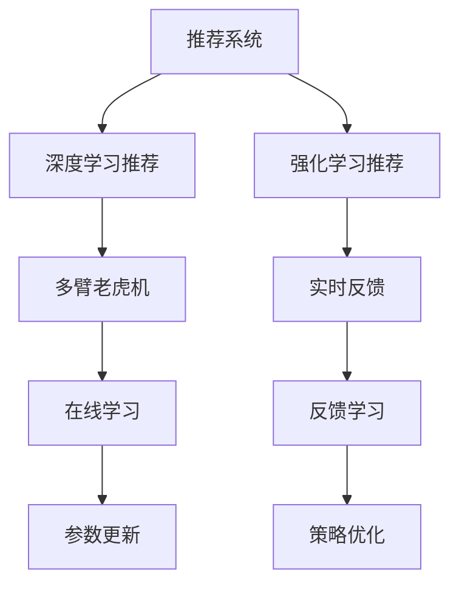

                 

# 搜索推荐的实时反馈学习：大模型策略

> 关键词：实时反馈, 大模型, 推荐系统, 强化学习, 在线学习, 多臂老虎机, 深度学习

## 1. 背景介绍

在信息爆炸的今天，搜索和推荐系统已成为互联网公司为用户提供个性化服务的重要手段。从搜索引擎到内容推荐，从电商推荐到社交推荐，推荐系统的应用范围日益广泛。然而，如何更高效、更精准地为用户推荐所需内容，一直是推荐系统研究的重要课题。

近年来，随着深度学习技术的不断进步，推荐系统从传统的协同过滤、内容推荐等方法，逐渐转向更先进的推荐算法，如深度学习、强化学习等。特别是近年来，预训练大语言模型（Large Language Models, LLMs）在推荐系统中的应用，带来了一股新风潮。预训练大模型通过在大规模无标签文本数据上进行预训练，学习到了丰富的语言表示，具备强大的语义理解能力，能够为推荐系统提供高质量的语义特征，显著提升推荐的准确性和个性化水平。

然而，预训练大模型的应用并非一帆风顺。由于模型的复杂性和数据的多样性，将其直接应用于推荐系统时，面临着诸多挑战。其中，推荐系统中的实时反馈（Online Feedback）问题尤为突出。实时反馈是指用户在推荐结果上进行点击、浏览等行为，其即时信息反馈对模型的训练和优化具有重要意义。如何在实时反馈的条件下，高效、稳定地对大模型进行微调，是推荐系统优化的关键。

本文将对基于实时反馈的大模型推荐系统策略进行深入探讨，介绍相关核心概念和算法原理，并给出实际项目中的代码实现和案例分析。

## 2. 核心概念与联系

### 2.1 核心概念概述

为了更好地理解基于实时反馈的大模型推荐系统，我们先简要介绍几个核心概念：

- 推荐系统（Recommendation System）：通过分析用户行为、物品属性等数据，为用户推荐可能感兴趣的商品、内容、服务等信息，提高用户满意度和转化率。推荐系统分为基于协同过滤、基于内容的推荐、混合推荐等方法。

- 深度学习推荐系统（Deep Learning-based Recommendation）：利用神经网络等深度学习模型，对用户行为和物品属性进行建模，提升推荐系统的准确性和个性化水平。

- 强化学习推荐系统（Reinforcement Learning-based Recommendation）：将推荐系统看作一个强化学习环境，通过智能体的探索和试错，优化推荐策略，提高推荐的整体效果。

- 多臂老虎机（Multi-armed Bandit）：一种经典的在线学习问题，在推荐系统中用于模拟用户点击行为，通过不断试验和调整，找到最优的推荐策略。

- 实时反馈（Online Feedback）：在推荐系统中，用户在查看推荐结果后，会对结果进行点击、浏览、购买等行为，这些即时反馈信息对模型的优化具有重要意义。

这些核心概念之间的逻辑关系可以通过以下Mermaid流程图来展示：



这个流程图展示了几大核心概念之间的关系：

1. 推荐系统通过协同过滤、深度学习、强化学习等多种方法，为用户提供个性化推荐。
2. 深度学习推荐系统中，神经网络模型对用户行为和物品属性进行建模。
3. 强化学习推荐系统中，智能体通过多臂老虎机等模型，在用户反馈中优化推荐策略。
4. 实时反馈是指用户在推荐结果上进行点击、浏览等行为，其即时信息反馈对模型的训练和优化具有重要意义。
5. 在线学习是指模型在实时反馈下不断更新参数，优化推荐策略。
6. 反馈学习是指在在线学习过程中，模型根据反馈信息不断调整推荐策略。

这些概念共同构成了推荐系统的核心框架，使得推荐系统能够更好地满足用户需求，提升用户体验。

## 3. 核心算法原理 & 具体操作步骤

### 3.1 算法原理概述

基于实时反馈的大模型推荐系统，本质上是一个在线学习问题，即在用户点击、浏览等行为发生时，通过即时反馈信息，不断更新模型参数，优化推荐策略。其核心思想是：利用预训练大模型的强大语义表示能力，在实时反馈的条件下，通过深度学习、强化学习等方法，对模型进行微调，提升推荐的准确性和个性化水平。

形式化地，假设预训练大模型为 $M_{\theta}$，其中 $\theta$ 为预训练得到的模型参数。在推荐系统中，用户对推荐结果进行反馈，如点击某个商品、浏览某个网页等行为。则模型的训练目标是最小化反馈信息与模型预测之间的差距，即：

$$
\min_{\theta} \mathbb{E}_{(x,y) \sim D}[L(y, M_{\theta}(x))]
$$

其中 $D$ 为反馈数据的分布，$L(y, M_{\theta}(x))$ 为损失函数，用于衡量模型预测与用户反馈之间的差异。常见的损失函数包括交叉熵损失、均方误差损失等。

### 3.2 算法步骤详解

基于实时反馈的大模型推荐系统一般包括以下几个关键步骤：

**Step 1: 准备预训练模型和数据集**
- 选择合适的预训练大语言模型 $M_{\theta}$ 作为初始化参数，如 GPT、BERT、T5 等。
- 准备推荐系统中的训练数据集 $D$，包括用户行为数据、物品属性数据等，用于训练模型。

**Step 2: 定义推荐策略**
- 根据推荐任务的特点，选择适合的推荐策略，如基于深度学习的协同过滤、基于强化学习的多臂老虎机等。
- 定义推荐策略的参数，如深度学习模型的结构、强化学习环境中的状态、动作等。

**Step 3: 设置训练超参数**
- 选择合适的优化算法及其参数，如 Adam、SGD 等，设置学习率、批大小、迭代轮数等。
- 设置正则化技术及强度，包括权重衰减、Dropout、Early Stopping 等。
- 确定冻结预训练参数的策略，如仅微调顶层，或全部参数都参与微调。

**Step 4: 执行实时反馈训练**
- 将训练集数据分批次输入模型，前向传播计算损失函数。
- 反向传播计算参数梯度，根据设定的优化算法和学习率更新模型参数。
- 在每次反馈发生时，更新模型参数，重新进行推荐并记录反馈信息。
- 周期性在验证集上评估模型性能，根据性能指标决定是否触发 Early Stopping。
- 重复上述步骤直至满足预设的迭代轮数或 Early Stopping 条件。

**Step 5: 测试和部署**
- 在测试集上评估微调后模型 $M_{\hat{\theta}}$ 的性能，对比微调前后的推荐精度提升。
- 使用微调后的模型对新样本进行推荐，集成到实际的应用系统中。
- 持续收集新的数据，定期重新微调模型，以适应数据分布的变化。

以上是基于实时反馈的大模型推荐系统的一般流程。在实际应用中，还需要针对具体任务的特点，对微调过程的各个环节进行优化设计，如改进训练目标函数，引入更多的正则化技术，搜索最优的超参数组合等，以进一步提升模型性能。

### 3.3 算法优缺点

基于实时反馈的大模型推荐系统具有以下优点：
1. 实时反馈：能够即时更新模型，捕捉用户的即时行为，提升推荐效果。
2. 高效优化：利用实时反馈信息，快速调整模型参数，减少优化过程的计算资源消耗。
3. 鲁棒性强：实时反馈能够及时捕捉到用户的异常行为，防止模型的过度拟合。
4. 个性化高：实时反馈能够捕捉到用户的个性化偏好，提升推荐的个性化水平。

同时，该方法也存在一定的局限性：
1. 数据噪声：实时反馈数据可能存在噪声，影响模型的稳定性和精度。
2. 用户隐私：实时反馈可能侵犯用户隐私，需要合理处理用户反馈信息。
3. 模型复杂度：大模型的复杂度和资源需求较高，可能影响推荐系统的部署和性能。
4. 动态变化：用户行为和偏好可能会随时间变化，模型需要不断更新以适应变化。

尽管存在这些局限性，但就目前而言，基于实时反馈的大模型推荐系统仍然是大规模推荐系统中广泛应用的重要范式。未来相关研究的重点在于如何进一步降低数据噪声，保护用户隐私，提高模型动态适应性，同时兼顾效率和性能。

### 3.4 算法应用领域

基于实时反馈的大模型推荐系统在多个领域得到了广泛应用，例如：

- 电商推荐：为电商网站推荐商品，提升销售转化率。通过实时反馈，调整推荐策略，提高用户购买意愿。
- 内容推荐：为新闻网站、视频平台推荐内容，增加用户粘性。通过实时反馈，优化推荐算法，提升内容消费量。
- 个性化推荐：为社交平台推荐用户感兴趣的内容，提升用户满意度和活跃度。通过实时反馈，捕捉用户偏好变化，优化推荐策略。
- 推荐广告：为广告平台推荐用户可能感兴趣的广告，提高广告投放效果。通过实时反馈，调整广告投放策略，优化广告转化率。
- 金融推荐：为金融机构推荐金融产品，提升用户购买意愿。通过实时反馈，优化推荐算法，增加产品销售。

除了这些经典应用外，大模型推荐系统还被创新性地应用到更多场景中，如实时股票推荐、智能家居推荐、工业智能推荐等，为推荐系统带来了全新的突破。随着预训练模型和推荐技术的不断发展，相信基于实时反馈的推荐系统将在更多领域得到应用，为用户带来更智能、更个性化的推荐服务。

## 4. 数学模型和公式 & 详细讲解 & 举例说明

### 4.1 数学模型构建

本节将使用数学语言对基于实时反馈的大模型推荐系统进行更加严格的刻画。

记预训练大模型为 $M_{\theta}$，其中 $\theta$ 为模型参数。假设推荐系统中的训练数据为 $D=\{(x_i, y_i)\}_{i=1}^N$，其中 $x_i$ 为输入数据，$y_i$ 为推荐结果，通常为二分类或多分类任务。

定义模型 $M_{\theta}$ 在数据样本 $(x,y)$ 上的损失函数为 $\ell(y, M_{\theta}(x))$，则在数据集 $D$ 上的经验风险为：

$$
\mathcal{L}(\theta) = \frac{1}{N} \sum_{i=1}^N \ell(y_i, M_{\theta}(x_i))
$$

微调的优化目标是最小化经验风险，即找到最优参数：

$$
\theta^* = \mathop{\arg\min}_{\theta} \mathcal{L}(\theta)
$$

在实践中，我们通常使用基于梯度的优化算法（如SGD、Adam等）来近似求解上述最优化问题。设 $\eta$ 为学习率，$\lambda$ 为正则化系数，则参数的更新公式为：

$$
\theta \leftarrow \theta - \eta \nabla_{\theta}\mathcal{L}(\theta) - \eta\lambda\theta
$$

其中 $\nabla_{\theta}\mathcal{L}(\theta)$ 为损失函数对参数 $\theta$ 的梯度，可通过反向传播算法高效计算。

### 4.2 公式推导过程

以下我们以二分类任务为例，推导交叉熵损失函数及其梯度的计算公式。

假设模型 $M_{\theta}$ 在输入 $x$ 上的输出为 $\hat{y}=M_{\theta}(x) \in [0,1]$，表示样本属于正类的概率。真实标签 $y \in \{0,1\}$。则二分类交叉熵损失函数定义为：

$$
\ell(y, M_{\theta}(x)) = -[y\log \hat{y} + (1-y)\log (1-\hat{y})]
$$

将其代入经验风险公式，得：

$$
\mathcal{L}(\theta) = -\frac{1}{N}\sum_{i=1}^N [y_i\log M_{\theta}(x_i)+(1-y_i)\log(1-M_{\theta}(x_i))]
$$

根据链式法则，损失函数对参数 $\theta_k$ 的梯度为：

$$
\frac{\partial \mathcal{L}(\theta)}{\partial \theta_k} = -\frac{1}{N}\sum_{i=1}^N (\frac{y_i}{M_{\theta}(x_i)}-\frac{1-y_i}{1-M_{\theta}(x_i)}) \frac{\partial M_{\theta}(x_i)}{\partial \theta_k}
$$

其中 $\frac{\partial M_{\theta}(x_i)}{\partial \theta_k}$ 可进一步递归展开，利用自动微分技术完成计算。

在得到损失函数的梯度后，即可带入参数更新公式，完成模型的迭代优化。重复上述过程直至收敛，最终得到适应推荐任务的最优模型参数 $\theta^*$。

## 5. 项目实践：代码实例和详细解释说明

### 5.1 开发环境搭建

在进行推荐系统实践前，我们需要准备好开发环境。以下是使用Python进行PyTorch开发的环境配置流程：

1. 安装Anaconda：从官网下载并安装Anaconda，用于创建独立的Python环境。

2. 创建并激活虚拟环境：
```bash
conda create -n pytorch-env python=3.8 
conda activate pytorch-env
```

3. 安装PyTorch：根据CUDA版本，从官网获取对应的安装命令。例如：
```bash
conda install pytorch torchvision torchaudio cudatoolkit=11.1 -c pytorch -c conda-forge
```

4. 安装Transformers库：
```bash
pip install transformers
```

5. 安装各类工具包：
```bash
pip install numpy pandas scikit-learn matplotlib tqdm jupyter notebook ipython
```

完成上述步骤后，即可在`pytorch-env`环境中开始推荐系统实践。

### 5.2 源代码详细实现

下面我们以电商推荐系统为例，给出使用Transformers库对BERT模型进行推荐微调的PyTorch代码实现。

首先，定义推荐任务的数据处理函数：

```python
from transformers import BertTokenizer
from torch.utils.data import Dataset
import torch

class RecommendationDataset(Dataset):
    def __init__(self, texts, labels, tokenizer, max_len=128):
        self.texts = texts
        self.labels = labels
        self.tokenizer = tokenizer
        self.max_len = max_len
        
    def __len__(self):
        return len(self.texts)
    
    def __getitem__(self, item):
        text = self.texts[item]
        label = self.labels[item]
        
        encoding = self.tokenizer(text, return_tensors='pt', max_length=self.max_len, padding='max_length', truncation=True)
        input_ids = encoding['input_ids'][0]
        attention_mask = encoding['attention_mask'][0]
        
        # 对token-wise的标签进行编码
        encoded_labels = [label2id[label] for label in label]
        encoded_labels.extend([label2id['O']] * (self.max_len - len(encoded_labels)))
        labels = torch.tensor(encoded_labels, dtype=torch.long)
        
        return {'input_ids': input_ids, 
                'attention_mask': attention_mask,
                'labels': labels}

# 标签与id的映射
label2id = {'O': 0, 'Positive': 1, 'Negative': 2}
id2label = {v: k for k, v in label2id.items()}

# 创建dataset
tokenizer = BertTokenizer.from_pretrained('bert-base-cased')

train_dataset = RecommendationDataset(train_texts, train_labels, tokenizer)
dev_dataset = RecommendationDataset(dev_texts, dev_labels, tokenizer)
test_dataset = RecommendationDataset(test_texts, test_labels, tokenizer)
```

然后，定义模型和优化器：

```python
from transformers import BertForTokenClassification, AdamW

model = BertForTokenClassification.from_pretrained('bert-base-cased', num_labels=len(label2id))

optimizer = AdamW(model.parameters(), lr=2e-5)
```

接着，定义训练和评估函数：

```python
from torch.utils.data import DataLoader
from tqdm import tqdm
from sklearn.metrics import classification_report

device = torch.device('cuda') if torch.cuda.is_available() else torch.device('cpu')
model.to(device)

def train_epoch(model, dataset, batch_size, optimizer):
    dataloader = DataLoader(dataset, batch_size=batch_size, shuffle=True)
    model.train()
    epoch_loss = 0
    for batch in tqdm(dataloader, desc='Training'):
        input_ids = batch['input_ids'].to(device)
        attention_mask = batch['attention_mask'].to(device)
        labels = batch['labels'].to(device)
        model.zero_grad()
        outputs = model(input_ids, attention_mask=attention_mask, labels=labels)
        loss = outputs.loss
        epoch_loss += loss.item()
        loss.backward()
        optimizer.step()
    return epoch_loss / len(dataloader)

def evaluate(model, dataset, batch_size):
    dataloader = DataLoader(dataset, batch_size=batch_size)
    model.eval()
    preds, labels = [], []
    with torch.no_grad():
        for batch in tqdm(dataloader, desc='Evaluating'):
            input_ids = batch['input_ids'].to(device)
            attention_mask = batch['attention_mask'].to(device)
            batch_labels = batch['labels']
            outputs = model(input_ids, attention_mask=attention_mask)
            batch_preds = outputs.logits.argmax(dim=2).to('cpu').tolist()
            batch_labels = batch_labels.to('cpu').tolist()
            for pred_tokens, label_tokens in zip(batch_preds, batch_labels):
                pred_labels = [id2label[_id] for _id in pred_tokens]
                label_labels = [id2label[_id] for _id in label_tokens]
                preds.append(pred_labels[:len(label_labels)])
                labels.append(label_labels)
                
    print(classification_report(labels, preds))
```

最后，启动训练流程并在测试集上评估：

```python
epochs = 5
batch_size = 16

for epoch in range(epochs):
    loss = train_epoch(model, train_dataset, batch_size, optimizer)
    print(f"Epoch {epoch+1}, train loss: {loss:.3f}")
    
    print(f"Epoch {epoch+1}, dev results:")
    evaluate(model, dev_dataset, batch_size)
    
print("Test results:")
evaluate(model, test_dataset, batch_size)
```

以上就是使用PyTorch对BERT进行电商推荐系统微调的完整代码实现。可以看到，得益于Transformers库的强大封装，我们可以用相对简洁的代码完成BERT模型的加载和微调。

### 5.3 代码解读与分析

让我们再详细解读一下关键代码的实现细节：

**RecommendationDataset类**：
- `__init__`方法：初始化文本、标签、分词器等关键组件。
- `__len__`方法：返回数据集的样本数量。
- `__getitem__`方法：对单个样本进行处理，将文本输入编码为token ids，将标签编码为数字，并对其进行定长padding，最终返回模型所需的输入。

**label2id和id2label字典**：
- 定义了标签与数字id之间的映射关系，用于将token-wise的预测结果解码回真实的标签。

**训练和评估函数**：
- 使用PyTorch的DataLoader对数据集进行批次化加载，供模型训练和推理使用。
- 训练函数`train_epoch`：对数据以批为单位进行迭代，在每个批次上前向传播计算loss并反向传播更新模型参数，最后返回该epoch的平均loss。
- 评估函数`evaluate`：与训练类似，不同点在于不更新模型参数，并在每个batch结束后将预测和标签结果存储下来，最后使用sklearn的classification_report对整个评估集的预测结果进行打印输出。

**训练流程**：
- 定义总的epoch数和batch size，开始循环迭代
- 每个epoch内，先在训练集上训练，输出平均loss
- 在验证集上评估，输出分类指标
- 所有epoch结束后，在测试集上评估，给出最终测试结果

可以看到，PyTorch配合Transformers库使得BERT微调的代码实现变得简洁高效。开发者可以将更多精力放在数据处理、模型改进等高层逻辑上，而不必过多关注底层的实现细节。

当然，工业级的系统实现还需考虑更多因素，如模型的保存和部署、超参数的自动搜索、更灵活的任务适配层等。但核心的推荐微调范式基本与此类似。

## 6. 实际应用场景
### 6.1 智能客服系统

基于大模型微调的推荐系统，可以广泛应用于智能客服系统的构建。传统客服往往需要配备大量人力，高峰期响应缓慢，且一致性和专业性难以保证。而使用微调后的推荐系统，可以7x24小时不间断服务，快速响应客户咨询，用自然流畅的语言推荐商品或服务。

在技术实现上，可以收集企业内部的历史客服对话记录，将问题和最佳推荐商品或服务构建成监督数据，在此基础上对预训练推荐系统进行微调。微调后的推荐系统能够自动理解用户意图，匹配最合适的推荐结果进行回复。对于客户提出的新问题，还可以接入检索系统实时搜索相关内容，动态组织生成推荐答案。如此构建的智能客服系统，能大幅提升客户咨询体验和问题解决效率。

### 6.2 金融舆情监测

金融机构需要实时监测市场舆论动向，以便及时应对负面信息传播，规避金融风险。传统的人工监测方式成本高、效率低，难以应对网络时代海量信息爆发的挑战。基于大模型微调的推荐系统，可以应用于金融舆情监测，及时发现市场异常情况，提前采取应对措施。

具体而言，可以收集金融领域相关的新闻、报道、评论等文本数据，并对其进行情感分析标注。在此基础上对预训练推荐系统进行微调，使其能够自动判断新闻情感倾向，并推荐相关金融产品。将微调后的推荐系统应用到实时抓取的网络文本数据，就能够自动监测不同情感倾向下的市场动态，一旦发现负面信息激增等异常情况，系统便会自动预警，帮助金融机构快速应对潜在风险。

### 6.3 个性化推荐系统

当前的推荐系统往往只依赖用户的历史行为数据进行物品推荐，无法深入理解用户的真实兴趣偏好。基于大模型微调技术的推荐系统，可以更好地挖掘用户行为背后的语义信息，从而提供更精准、多样的推荐内容。

在实践中，可以收集用户浏览、点击、评论、分享等行为数据，提取和用户交互的物品标题、描述、标签等文本内容。将文本内容作为模型输入，用户的后续行为（如是否点击、购买等）作为监督信号，在此基础上微调预训练推荐系统。微调后的推荐系统能够从文本内容中准确把握用户的兴趣点。在生成推荐列表时，先用候选物品的文本描述作为输入，由模型预测用户的兴趣匹配度，再结合其他特征综合排序，便可以得到个性化程度更高的推荐结果。

### 6.4 未来应用展望

随着大模型推荐技术的不断发展，基于实时反馈的推荐系统将在更多领域得到应用，为推荐系统带来全新的突破。

在智慧医疗领域，基于大模型的推荐系统可以用于推荐合适的医生、医院、药品等，辅助医生诊疗，提升医疗服务的智能化水平。

在智能教育领域，微调技术可应用于作业批改、学情分析、知识推荐等方面，因材施教，促进教育公平，提高教学质量。

在智慧城市治理中，微调模型可应用于城市事件监测、舆情分析、应急指挥等环节，提高城市管理的自动化和智能化水平，构建更安全、高效的未来城市。

此外，在企业生产、社会治理、文娱传媒等众多领域，基于大模型微调的推荐系统也将不断涌现，为推荐系统带来更多的创新应用，为各行各业带来深刻的变革。相信随着技术的日益成熟，微调方法将成为推荐系统优化的重要手段，推动推荐技术向更加智能化、个性化、实时化的方向发展。

## 7. 工具和资源推荐
### 7.1 学习资源推荐

为了帮助开发者系统掌握大模型推荐系统的理论基础和实践技巧，这里推荐一些优质的学习资源：

1. 《深度学习推荐系统》系列博文：由深度学习推荐系统专家撰写，深入浅出地介绍了推荐系统的基本概念和经典模型。

2. 《强化学习基础》课程：斯坦福大学开设的强化学习课程，讲解了强化学习的核心思想和算法，是推荐系统优化的重要基础。

3. 《Python深度学习推荐系统实战》书籍：结合Python深度学习框架，从代码实现的角度讲解推荐系统，适合实战开发。

4. 《推荐系统实战》课程：腾讯课堂推荐系统实战课程，结合实际项目案例，讲解推荐系统从数据到模型的完整流程。

5. Weights & Biases：模型训练的实验跟踪工具，可以记录和可视化模型训练过程中的各项指标，方便对比和调优。与主流深度学习框架无缝集成。

6. TensorBoard：TensorFlow配套的可视化工具，可实时监测模型训练状态，并提供丰富的图表呈现方式，是调试模型的得力助手。

通过对这些资源的学习实践，相信你一定能够快速掌握大模型推荐系统的精髓，并用于解决实际的推荐问题。
###  7.2 开发工具推荐

高效的开发离不开优秀的工具支持。以下是几款用于大模型推荐系统开发的常用工具：

1. PyTorch：基于Python的开源深度学习框架，灵活动态的计算图，适合快速迭代研究。大部分预训练语言模型都有PyTorch版本的实现。

2. TensorFlow：由Google主导开发的开源深度学习框架，生产部署方便，适合大规模工程应用。同样有丰富的预训练语言模型资源。

3. Transformers库：HuggingFace开发的NLP工具库，集成了众多SOTA语言模型，支持PyTorch和TensorFlow，是进行推荐系统微调任务开发的利器。

4. Weights & Biases：模型训练的实验跟踪工具，可以记录和可视化模型训练过程中的各项指标，方便对比和调优。与主流深度学习框架无缝集成。

5. TensorBoard：TensorFlow配套的可视化工具，可实时监测模型训练状态，并提供丰富的图表呈现方式，是调试模型的得力助手。

6. Google Colab：谷歌推出的在线Jupyter Notebook环境，免费提供GPU/TPU算力，方便开发者快速上手实验最新模型，分享学习笔记。

合理利用这些工具，可以显著提升大模型推荐系统的开发效率，加快创新迭代的步伐。

### 7.3 相关论文推荐

大模型推荐系统的研究源于学界的持续研究。以下是几篇奠基性的相关论文，推荐阅读：

1. Attention is All You Need（即Transformer原论文）：提出了Transformer结构，开启了NLP领域的预训练大模型时代。

2. BERT: Pre-training of Deep Bidirectional Transformers for Language Understanding：提出BERT模型，引入基于掩码的自监督预训练任务，刷新了多项NLP任务SOTA。

3. Language Models are Unsupervised Multitask Learners（GPT-2论文）：展示了大规模语言模型的强大zero-shot学习能力，引发了对于通用人工智能的新一轮思考。

4. Multi-armed Bandit Algorithms for Reinforcement Learning：介绍了多臂老虎机的算法思想和应用，为推荐系统提供了重要的理论基础。

5. Contextual Bandits in Recommendation Systems: A Tutorial：详细讲解了强化学习在推荐系统中的应用，为推荐系统优化提供了重要的指导。

这些论文代表了大模型推荐系统的发展脉络。通过学习这些前沿成果，可以帮助研究者把握学科前进方向，激发更多的创新灵感。

## 8. 总结：未来发展趋势与挑战

### 8.1 总结

本文对基于实时反馈的大模型推荐系统进行了全面系统的介绍。首先阐述了大模型推荐系统的研究背景和意义，明确了实时反馈在大模型推荐系统中的重要性。其次，从原理到实践，详细讲解了基于实时反馈的大模型推荐系统的一般流程，包括预训练模型、数据集、推荐策略、超参数设置等。同时，本文还介绍了该方法在实际应用中的具体案例，展示了微调技术在电商推荐、智能客服、金融舆情、个性化推荐等多个领域的应用前景。最后，本文精选了推荐系统的各类学习资源，力求为读者提供全方位的技术指引。

通过本文的系统梳理，可以看到，基于实时反馈的大模型推荐系统正在成为推荐系统优化的重要范式，极大地提升了推荐的准确性和个性化水平。未来，伴随大模型推荐技术的不断演进，推荐系统必将在更广的领域得到应用，为用户带来更智能、更个性化的推荐服务。

### 8.2 未来发展趋势

展望未来，基于实时反馈的大模型推荐系统将呈现以下几个发展趋势：

1. 数据驱动：实时反馈数据驱动的大模型推荐系统，能够实时捕捉用户行为，快速优化推荐策略，提升推荐效果。未来，推荐系统将更加注重数据的质量和多样性，以数据为驱动，实现更加精准、个性化的推荐。

2. 智能推荐：随着深度学习、强化学习等技术的发展，大模型推荐系统将变得更加智能。未来，推荐系统将能够主动探索用户偏好，实现更加智能的推荐。

3. 多模态融合：当前推荐系统主要聚焦于文本数据，未来将拓展到图像、视频、音频等多模态数据，实现更加全面、多样化的推荐。

4. 动态更新：用户行为和偏好随时间变化，推荐系统需要不断更新以适应变化。未来，推荐系统将更加注重动态更新，实现实时更新推荐策略。

5. 用户隐私保护：随着用户隐私意识的增强，推荐系统需要更加注重用户隐私保护。未来，推荐系统将采用更加安全、透明的技术，保障用户隐私。

6. 算法优化：推荐系统的优化问题是一个复杂的多目标优化问题，未来将有更多优化算法被研究和应用，以提升推荐系统的性能和可解释性。

以上趋势凸显了大模型推荐系统的广阔前景。这些方向的探索发展，必将进一步提升推荐系统的性能和用户体验，为各行各业带来更加智能、个性化的推荐服务。

### 8.3 面临的挑战

尽管大模型推荐系统已经取得了瞩目成就，但在迈向更加智能化、普适化应用的过程中，它仍面临着诸多挑战：

1. 数据噪声：实时反馈数据可能存在噪声，影响模型的稳定性和精度。如何降低数据噪声，提高模型鲁棒性，还需要更多理论和实践的积累。

2. 用户隐私：实时反馈可能侵犯用户隐私，需要合理处理用户反馈信息，保护用户隐私。

3. 模型复杂度：大模型的复杂度和资源需求较高，可能影响推荐系统的部署和性能。如何降低模型复杂度，提高推荐系统效率，还需要进一步研究。

4. 动态变化：用户行为和偏好随时间变化，推荐系统需要不断更新以适应变化。如何实现动态更新，避免推荐策略过时，还需要更多研究。

5. 算法可解释性：推荐系统的优化问题是一个复杂的多目标优化问题，如何提高算法的可解释性，增强模型的透明性，还需要更多研究和实践。

6. 模型泛化性：模型需要具备良好的泛化能力，以应对新数据和新场景。如何提升模型的泛化性，还需要更多研究。

尽管存在这些挑战，但随着大模型推荐技术的不断演进，这些挑战终将逐一被克服，大模型推荐系统必将在推荐技术落地应用中发挥更大的作用。

### 8.4 研究展望

面对大模型推荐系统所面临的种种挑战，未来的研究需要在以下几个方面寻求新的突破：

1. 探索无监督和半监督推荐方法。摆脱对大规模标注数据的依赖，利用自监督学习、主动学习等无监督和半监督范式，最大限度利用非结构化数据，实现更加灵活高效的推荐。

2. 研究参数高效和计算高效的推荐方法。开发更加参数高效的推荐算法，在固定大部分预训练参数的同时，只更新极少量的任务相关参数。同时优化推荐系统的计算图，减少前向传播和反向传播的资源消耗，实现更加轻量级、实时性的部署。

3. 融合因果和对比学习范式。通过引入因果推断和对比学习思想，增强推荐系统建立稳定因果关系的能力，学习更加普适、鲁棒的用户兴趣模型。

4. 引入更多先验知识。将符号化的先验知识，如知识图谱、逻辑规则等，与神经网络模型进行巧妙融合，引导推荐系统学习更准确、合理的用户兴趣模型。同时加强不同模态数据的整合，实现视觉、语音等多模态信息与文本信息的协同建模。

5. 结合因果分析和博弈论工具。将因果分析方法引入推荐系统，识别出推荐系统决策的关键特征，增强推荐系统的可解释性和逻辑性。借助博弈论工具刻画人机交互过程，主动探索并规避推荐系统的脆弱点，提高系统稳定性。

6. 纳入伦理道德约束。在推荐系统训练目标中引入伦理导向的评估指标，过滤和惩罚有害的推荐结果，确保推荐系统的安全性。

这些研究方向的探索，必将引领大模型推荐系统迈向更高的台阶，为构建安全、可靠、可解释、可控的推荐系统铺平道路。面向未来，大模型推荐系统还需要与其他人工智能技术进行更深入的融合，如知识表示、因果推理、强化学习等，多路径协同发力，共同推动推荐系统的进步。只有勇于创新、敢于突破，才能不断拓展推荐系统的边界，让推荐技术更好地服务于用户。

## 9. 附录：常见问题与解答

**Q1：大模型推荐系统是否适用于所有推荐任务？**

A: 大模型推荐系统在大多数推荐任务上都能取得不错的效果，特别是对于数据量较小的任务。但对于一些特定领域的任务，如医学、法律等，仅仅依靠通用语料预训练的模型可能难以很好地适应。此时需要在特定领域语料上进一步预训练，再进行微调，才能获得理想效果。

**Q2：推荐系统中的实时反馈如何处理？**

A: 实时反馈是指用户在查看推荐结果后，对结果进行点击、浏览、购买等行为。推荐系统通常会记录这些反馈信息，作为后续推荐策略优化的依据。常见的处理方式包括：

1. 点击率预测：预测用户是否会对推荐结果进行点击，以调整推荐策略。
2. 转化率预测：预测用户是否会完成购买、注册等行为，以优化推荐内容。
3. 召回率优化：根据用户行为，优化推荐系统的召回策略，提升推荐效果。
4. 排序优化：根据用户行为，调整推荐结果的排序，提高推荐相关性。

这些反馈信息通常用于训练推荐模型，以提升推荐系统的效果。

**Q3：推荐系统中的冷启动问题如何解决？**

A: 冷启动问题是指推荐系统在面对新用户或新物品时，由于缺乏历史数据，难以做出准确的推荐。解决冷启动问题的方法包括：

1. 使用推荐系统嵌入用户、物品的向量表示，通过相似度计算推荐新用户、新物品。
2. 利用协同过滤等方法，通过相似用户、相似物品进行推荐。
3. 引入领域知识，利用专家知识进行推荐。
4. 利用知识图谱等外部知识库，进行推荐。

这些方法可以帮助推荐系统在新用户、新物品上做出更加准确的推荐。

**Q4：推荐系统的多目标优化问题如何解决？**

A: 推荐系统的优化问题是一个复杂的多目标优化问题，包括点击率、转化率、召回率、相关性等多个指标。解决多目标优化问题的方法包括：

1. 层次优化：将多个目标分解为多个子问题，逐步优化。
2. 权重优化：根据不同的场景和需求，对不同的目标进行权重调整。
3. 混合优化：结合不同的优化方法，实现多目标优化。

这些方法可以帮助推荐系统实现多目标优化，提升推荐效果。

**Q5：推荐系统中的特征工程如何处理？**

A: 特征工程是推荐系统中非常重要的一部分，用于提取和构造推荐系统的输入特征。常见的特征工程方法包括：

1. 用户画像：提取用户的基本信息、行为、偏好等特征。
2. 物品属性：提取物品的基本属性、类别、评分等特征。
3. 上下文信息：提取推荐时的上下文信息，如时间、地点、设备等。
4. 交互行为：提取用户与物品的交互行为，如点击、浏览、购买等。
5. 隐式行为：提取用户的隐式行为，如评分、收藏等。

这些特征工程方法可以帮助推荐系统更好地理解用户和物品的特征，提升推荐效果。

---

作者：禅与计算机程序设计艺术 / Zen and the Art of Computer Programming

