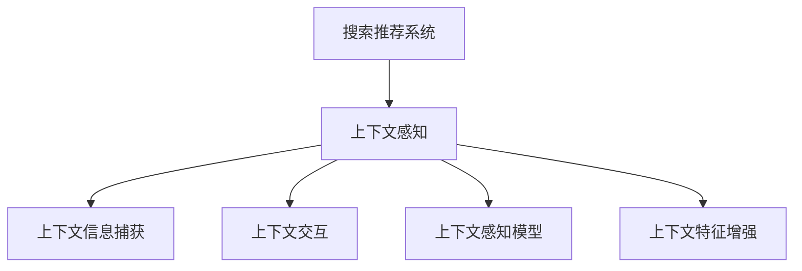

                 

# 搜索推荐系统中的上下文感知技术

## 1. 背景介绍

在互联网时代，搜索推荐系统（Search and Recommendation System）已经成为用户获取信息和内容的重要工具。传统的搜索推荐系统主要依赖于静态关键词匹配和统计特征模型，难以捕捉用户行为和内容的动态变化。近年来，随着深度学习技术的兴起，上下文感知技术被引入搜索推荐系统，极大地提升了系统的智能性和用户满意度。

### 1.1 问题由来

在早期的搜索推荐系统中，推荐算法主要依赖于用户的历史行为数据和物品的属性特征，如点击、浏览、评分等。这些静态特征被编码成向量，输入到一个线性模型或神经网络中进行训练和预测。然而，这种基于历史数据的静态推荐方式存在以下几个局限性：

- **静态特征表示**：无法捕捉用户行为和物品内容的动态变化。
- **忽略上下文信息**：无法利用用户当前浏览或搜索的上下文信息，导致推荐结果与用户当前需求不匹配。
- **缺乏交互信息**：无法利用用户与系统的实时互动信息，如即时反馈、上下文交互等。

为了解决这些问题，上下文感知技术被引入搜索推荐系统。上下文感知技术通过捕捉用户行为和物品内容的上下文信息，实现实时、动态的推荐。这种技术不仅能够提升推荐的相关性和多样性，还能增强用户的互动体验。

### 1.2 问题核心关键点

上下文感知技术在搜索推荐系统中的应用主要集中在以下几个方面：

- **上下文信息捕获**：通过实时捕获用户行为和物品内容的信息，构建动态的用户模型。
- **上下文交互**：利用用户与系统的实时互动信息，动态调整推荐策略。
- **上下文感知模型**：设计能够自动学习上下文信息的推荐模型，提升推荐性能。
- **上下文特征增强**：通过引入上下文信息，增强推荐模型的特征表示能力。

这些核心关键点共同构成了上下文感知技术在搜索推荐系统中的应用框架，使得推荐系统能够更智能、更准确地满足用户需求。

## 2. 核心概念与联系

### 2.1 核心概念概述

为了更好地理解搜索推荐系统中的上下文感知技术，本节将介绍几个密切相关的核心概念：

- **搜索推荐系统**：通过用户行为和物品属性，为用户推荐可能感兴趣的内容的系统。包括文本搜索、图片搜索、商品推荐等。
- **上下文感知**：利用用户当前行为和物品内容的上下文信息，动态调整推荐策略的技术。
- **上下文信息捕获**：通过用户行为日志、物品特征、时间、地点等上下文信息，构建动态的用户模型。
- **上下文交互**：利用用户的即时反馈、点击行为等互动信息，动态调整推荐策略。
- **上下文感知模型**：设计能够自动学习上下文信息的推荐模型，提升推荐性能。
- **上下文特征增强**：通过引入上下文信息，增强推荐模型的特征表示能力。

这些核心概念之间的逻辑关系可以通过以下Mermaid流程图来展示：



这个流程图展示上下文感知技术在搜索推荐系统中的应用：

1. 搜索推荐系统通过上下文感知技术，利用用户行为和物品内容的上下文信息，动态调整推荐策略。
2. 上下文信息捕获通过用户行为日志、物品特征、时间、地点等上下文信息，构建动态的用户模型。
3. 上下文交互利用用户的即时反馈、点击行为等互动信息，动态调整推荐策略。
4. 上下文感知模型设计能够自动学习上下文信息的推荐模型，提升推荐性能。
5. 上下文特征增强通过引入上下文信息，增强推荐模型的特征表示能力。

这些核心概念共同构成了上下文感知技术在搜索推荐系统中的应用框架，使其能够更智能、更准确地满足用户需求。

## 3. 核心算法原理 & 具体操作步骤
### 3.1 算法原理概述

上下文感知技术在搜索推荐系统中的应用，本质上是一个动态学习的过程。其核心思想是：通过实时捕获用户行为和物品内容的上下文信息，动态调整推荐策略，实现实时、动态的推荐。

形式化地，假设搜索推荐系统接收用户查询 $q$，推荐物品集合为 $I$，用户反馈为 $f$，当前上下文为 $c$。推荐目标是最小化用户损失，即：

$$
\min_{q, f, c} \mathcal{L}(q, f, c, I)
$$

其中 $\mathcal{L}$ 为用户损失函数，定义如下：

$$
\mathcal{L}(q, f, c, I) = \frac{1}{N} \sum_{i=1}^N \ell(q, i, f, c)
$$

其中 $N$ 为样本数，$\ell$ 为单样本损失函数，如交叉熵损失、均方误差损失等。

通过梯度下降等优化算法，搜索推荐系统不断更新用户模型、物品模型和上下文信息，最小化用户损失函数，使得推荐结果逼近用户期望。由于上下文感知技术的引入，搜索推荐系统能够更灵活地适应用户行为和物品内容的动态变化，提升推荐效果。

### 3.2 算法步骤详解

上下文感知技术在搜索推荐系统中的应用，一般包括以下几个关键步骤：

**Step 1: 准备上下文数据**
- 收集用户行为日志，包括点击、浏览、搜索等行为。
- 收集物品属性特征，如价格、评分、描述等。
- 收集时间、地点、设备等上下文信息。

**Step 2: 构建动态用户模型**
- 利用用户历史行为数据和当前行为信息，构建动态用户模型 $U$。
- 用户模型 $U$ 可以包含用户偏好、兴趣、行为轨迹等特征。

**Step 3: 构建动态物品模型**
- 利用物品历史数据和当前上下文信息，构建动态物品模型 $I$。
- 物品模型 $I$ 可以包含物品属性、相似物品、用户反馈等特征。

**Step 4: 设计上下文感知模型**
- 设计能够自动学习上下文信息的推荐模型 $M$。
- 推荐模型 $M$ 可以基于深度神经网络，如多层感知机、卷积神经网络、循环神经网络等。

**Step 5: 实现上下文特征增强**
- 利用上下文信息，增强推荐模型的特征表示能力。
- 上下文特征增强方法包括特征融合、特征投影、特征拼接等。

**Step 6: 实现上下文交互**
- 利用用户即时反馈、点击行为等互动信息，动态调整推荐策略。
- 上下文交互方法包括在线学习、强化学习等。

**Step 7: 执行推荐**
- 将用户模型、物品模型和上下文信息输入推荐模型 $M$，输出推荐结果。
- 推荐结果可以是物品的排名、概率分布等。

以上是上下文感知技术在搜索推荐系统中的应用一般流程。在实际应用中，还需要针对具体任务的特点，对上述步骤进行优化设计，如改进用户模型和物品模型、设计高效的特征增强方法、引入先进的上下文交互策略等，以进一步提升推荐性能。

### 3.3 算法优缺点

上下文感知技术在搜索推荐系统中的应用具有以下优点：

1. **提升推荐相关性**：通过捕捉用户行为和物品内容的上下文信息，推荐结果更接近用户当前需求。
2. **增强推荐多样性**：利用上下文信息，动态调整推荐策略，提升推荐的覆盖面。
3. **实时动态调整**：通过实时捕获用户行为和物品内容，实现实时、动态的推荐。
4. **提高用户满意度**：利用上下文信息，提升推荐的相关性和多样性，增强用户的互动体验。

同时，该技术也存在一定的局限性：

1. **数据依赖性强**：上下文感知技术依赖于大量的用户行为和物品内容数据，获取和处理这些数据需要较高的成本和复杂度。
2. **模型复杂度高**：上下文感知模型通常比传统的推荐模型更复杂，训练和推理需要更多的计算资源。
3. **数据隐私问题**：利用用户行为数据进行上下文感知，可能涉及用户隐私保护问题，需要采取相应的数据保护措施。
4. **计算资源消耗大**：实时捕捉和处理上下文信息，需要较高的计算资源和存储能力。

尽管存在这些局限性，但就目前而言，上下文感知技术仍是搜索推荐系统的重要研究方向。未来相关研究的重点在于如何进一步降低数据获取成本，提高模型效率，保护用户隐私，同时兼顾推荐的相关性和多样性。

### 3.4 算法应用领域

上下文感知技术在搜索推荐系统中的应用已经涵盖了多个领域，包括但不限于：

- **文本搜索**：利用用户搜索查询的上下文信息，推荐相关搜索结果。
- **图片搜索**：利用用户上传的图片内容，推荐相似图片。
- **商品推荐**：利用用户浏览和购买历史，推荐相关商品。
- **新闻推荐**：利用用户阅读历史，推荐相关新闻。
- **社交推荐**：利用用户社交网络关系，推荐相关好友或内容。
- **视频推荐**：利用用户观看历史，推荐相关视频。

这些应用领域涵盖了搜索推荐系统的多个方面，展示了上下文感知技术在实际场景中的广泛应用。未来，随着技术的不断进步，上下文感知技术将会在更多领域得到应用，进一步提升搜索推荐系统的性能和用户体验。

## 4. 数学模型和公式 & 详细讲解  
### 4.1 数学模型构建

为了更好地理解上下文感知技术在搜索推荐系统中的应用，本节将使用数学语言对上下文感知模型的构建进行更加严格的刻画。

假设用户查询为 $q$，推荐物品集合为 $I$，当前上下文为 $c$。设推荐模型 $M$ 的参数为 $\theta$，用户模型 $U$ 的参数为 $\alpha$，物品模型 $I$ 的参数为 $\beta$。用户损失函数 $\mathcal{L}$ 可以表示为：

$$
\mathcal{L}(q, f, c, I) = \frac{1}{N} \sum_{i=1}^N \ell(q, i, f, c)
$$

其中 $N$ 为样本数，$\ell$ 为单样本损失函数。推荐模型 $M$ 的预测结果为 $P(q, i, c, \theta)$，用户模型 $U$ 的预测结果为 $U(q, \alpha)$，物品模型 $I$ 的预测结果为 $I(i, \beta)$。推荐模型 $M$ 的输出为 $\hat{y}_i = P(q, i, c, \theta)$，用户模型 $U$ 的输出为 $\hat{y}_q = U(q, \alpha)$，物品模型 $I$ 的输出为 $\hat{y}_i = I(i, \beta)$。用户损失函数 $\mathcal{L}$ 可以进一步表示为：

$$
\mathcal{L}(q, f, c, I) = \frac{1}{N} \sum_{i=1}^N \ell(\hat{y}_i, f)
$$

其中 $f$ 为用户反馈，如点击、评分等。

### 4.2 公式推导过程

以交叉熵损失为例，推导上下文感知模型在推荐任务中的损失函数。

假设推荐模型 $M$ 在用户查询 $q$ 和物品 $i$ 上的预测概率为 $\hat{y}_i = P(q, i, c, \theta)$，用户模型 $U$ 在用户查询 $q$ 上的预测概率为 $\hat{y}_q = U(q, \alpha)$，物品模型 $I$ 在物品 $i$ 上的预测概率为 $\hat{y}_i = I(i, \beta)$。推荐任务中的交叉熵损失函数可以表示为：

$$
\ell(\hat{y}_i, f) = -f\log \hat{y}_i - (1-f)\log (1-\hat{y}_i)
$$

将上述公式代入用户损失函数 $\mathcal{L}$ 中，得：

$$
\mathcal{L}(q, f, c, I) = \frac{1}{N} \sum_{i=1}^N [-\hat{y}_i\log \hat{y}_i - (1-\hat{y}_i)\log (1-\hat{y}_i)]
$$

根据链式法则，用户损失函数 $\mathcal{L}$ 对模型参数 $\theta$、$\alpha$、$\beta$ 的梯度分别为：

$$
\frac{\partial \mathcal{L}}{\partial \theta} = -\frac{1}{N}\sum_{i=1}^N \frac{\partial \ell}{\partial \hat{y}_i} \frac{\partial \hat{y}_i}{\partial \theta}
$$

$$
\frac{\partial \mathcal{L}}{\partial \alpha} = -\frac{1}{N}\sum_{i=1}^N \frac{\partial \ell}{\partial \hat{y}_q} \frac{\partial \hat{y}_q}{\partial \alpha}
$$

$$
\frac{\partial \mathcal{L}}{\partial \beta} = -\frac{1}{N}\sum_{i=1}^N \frac{\partial \ell}{\partial \hat{y}_i} \frac{\partial \hat{y}_i}{\partial \beta}
$$

其中 $\frac{\partial \ell}{\partial \hat{y}_i}$ 和 $\frac{\partial \ell}{\partial \hat{y}_q}$ 可以通过反向传播算法计算得到。

在得到损失函数的梯度后，即可带入优化算法，更新模型参数。重复上述过程直至收敛，最终得到上下文感知模型 $M$、用户模型 $U$ 和物品模型 $I$ 的最优参数 $\theta^*$、$\alpha^*$、$\beta^*$。

### 4.3 案例分析与讲解

以电商平台中的商品推荐为例，分析上下文感知技术的应用。

假设用户 $u$ 浏览商品 $p$，系统会通过实时捕捉用户行为数据，构建用户模型 $U_u$ 和物品模型 $I_p$。用户模型 $U_u$ 包含用户历史浏览行为、用户画像等特征，物品模型 $I_p$ 包含商品属性、用户反馈等特征。推荐模型 $M$ 利用用户模型 $U_u$ 和物品模型 $I_p$，计算商品 $p$ 的推荐概率 $P(p, q_u, c_t)$，其中 $q_u$ 为用户的即时查询，$c_t$ 为当前上下文。

推荐模型 $M$ 可以使用多层感知机（MLP）结构，如图1所示。


图1 多层感知机结构

假设多层感知机包含两个全连接层，激活函数为ReLU，输出层使用Sigmoid函数，得到推荐概率 $P(p, q_u, c_t)$。用户模型 $U_u$ 和物品模型 $I_p$ 的输出也包含用户特征和物品特征。

在推荐模型 $M$ 中，用户模型 $U_u$ 和物品模型 $I_p$ 的输出被送入两个全连接层，得到推荐概率 $P(p, q_u, c_t)$。推荐模型 $M$ 的输出即为商品 $p$ 的推荐概率，通过交叉熵损失函数 $\ell$ 与用户反馈 $f$ 进行计算，最终得到用户损失函数 $\mathcal{L}$。

通过梯度下降等优化算法，推荐模型 $M$、用户模型 $U$ 和物品模型 $I$ 不断更新参数，最小化用户损失函数 $\mathcal{L}$。重复上述过程直至收敛，最终得到上下文感知模型 $M$、用户模型 $U$ 和物品模型 $I$ 的最优参数 $\theta^*$、$\alpha^*$、$\beta^*$。推荐系统根据最优参数输出推荐结果，实现实时、动态的推荐。

## 5. 项目实践：代码实例和详细解释说明
### 5.1 开发环境搭建

在进行上下文感知技术在搜索推荐系统中的应用开发前，我们需要准备好开发环境。以下是使用Python进行TensorFlow开发的环境配置流程：

1. 安装Anaconda：从官网下载并安装Anaconda，用于创建独立的Python环境。

2. 创建并激活虚拟环境：
```bash
conda create -n tf-env python=3.8 
conda activate tf-env
```

3. 安装TensorFlow：根据CUDA版本，从官网获取对应的安装命令。例如：
```bash
conda install tensorflow -c conda-forge -c pytorch -c nvidia
```

4. 安装TensorBoard：用于可视化模型训练过程，生成训练和推理数据等。
```bash
pip install tensorboard
```

5. 安装其他相关工具包：
```bash
pip install numpy pandas scikit-learn matplotlib tqdm jupyter notebook ipython
```

完成上述步骤后，即可在`tf-env`环境中开始开发实践。

### 5.2 源代码详细实现

下面我们以电商平台中的商品推荐为例，给出使用TensorFlow进行上下文感知技术在搜索推荐系统中的应用实现。

首先，定义推荐模型、用户模型和物品模型的数据处理函数：

```python
import tensorflow as tf
import numpy as np
from tensorflow.keras import layers, models

class UserModel(tf.keras.Model):
    def __init__(self, input_dim, embedding_dim):
        super(UserModel, self).__init__()
        self.user_embedding = layers.Embedding(input_dim, embedding_dim)
        
    def call(self, x):
        return self.user_embedding(x)

class ItemModel(tf.keras.Model):
    def __init__(self, input_dim, embedding_dim):
        super(ItemModel, self).__init__()
        self.item_embedding = layers.Embedding(input_dim, embedding_dim)
        
    def call(self, x):
        return self.item_embedding(x)

class RecommendationModel(tf.keras.Model):
    def __init__(self, embedding_dim, output_dim):
        super(RecommendationModel, self).__init__()
        self.intermediate = layers.Dense(embedding_dim, activation='relu')
        self.output = layers.Dense(output_dim, activation='sigmoid')
        
    def call(self, user, item):
        concat = tf.concat([user, item], axis=1)
        x = self.intermediate(concat)
        return self.output(x)
```

然后，定义推荐模型和优化器：

```python
user_model = UserModel(input_dim=10000, embedding_dim=16)
item_model = ItemModel(input_dim=10000, embedding_dim=16)
recommendation_model = RecommendationModel(embedding_dim=32, output_dim=1)

optimizer = tf.keras.optimizers.Adam()
```

接着，定义训练和评估函数：

```python
def train_step(model, user, item, label):
    with tf.GradientTape() as tape:
        pred = model(user, item)
        loss = tf.keras.losses.binary_crossentropy(label, pred)
    gradients = tape.gradient(loss, model.trainable_variables)
    optimizer.apply_gradients(zip(gradients, model.trainable_variables))

def evaluate_step(model, user, item, label):
    pred = model(user, item)
    accuracy = tf.keras.metrics.BinaryAccuracy().predict(pred, label)
    return accuracy
```

最后，启动训练流程并在测试集上评估：

```python
epochs = 10
batch_size = 64

for epoch in range(epochs):
    train_loss = 0.0
    for i in range(len(train_dataset)):
        user, item, label = train_dataset[i]
        train_step(user_model, item_model, recommendation_model, label)
        train_loss += loss.numpy()
    
    train_loss /= len(train_dataset)
    print(f"Epoch {epoch+1}, train loss: {train_loss:.3f}")
    
    test_accuracy = evaluate_step(user_model, item_model, recommendation_model, test_dataset)
    print(f"Epoch {epoch+1}, test accuracy: {test_accuracy:.3f}")
    
print("Test results:")
evaluate_step(user_model, item_model, recommendation_model, test_dataset)
```

以上就是使用TensorFlow进行上下文感知技术在商品推荐系统中的应用实现。可以看到，得益于TensorFlow的强大封装，我们可以用相对简洁的代码完成上下文感知模型的构建和训练。

### 5.3 代码解读与分析

让我们再详细解读一下关键代码的实现细节：

**UserModel类**：
- `__init__`方法：初始化用户模型的输入维度和嵌入维度。
- `call`方法：将用户嵌入向量作为输入，输出用户模型的预测概率。

**ItemModel类**：
- `__init__`方法：初始化物品模型的输入维度和嵌入维度。
- `call`方法：将物品嵌入向量作为输入，输出物品模型的预测概率。

**RecommendationModel类**：
- `__init__`方法：初始化推荐模型的嵌入维度和输出维度。
- `call`方法：将用户和物品嵌入向量拼接后，通过中间层和输出层，输出推荐概率。

**train_step函数**：
- 在训练步中，将用户模型和物品模型的输出拼接后，输入推荐模型。
- 计算交叉熵损失，并使用梯度下降更新模型参数。

**evaluate_step函数**：
- 在评估步中，将用户模型和物品模型的输出拼接后，输入推荐模型。
- 计算预测结果与标签之间的二进制交叉熵，并计算准确率。

**训练流程**：
- 定义总的epoch数和batch size，开始循环迭代
- 每个epoch内，对训练集进行迭代训练
- 在训练集中每个样本上进行梯度更新
- 计算训练集上的平均损失
- 在测试集上进行评估，输出测试集上的准确率

可以看到，TensorFlow结合上下文感知技术，使得推荐模型的开发和训练变得高效便捷。开发者可以将更多精力放在模型改进、特征工程等高层逻辑上，而不必过多关注底层的实现细节。

当然，工业级的系统实现还需考虑更多因素，如模型的保存和部署、超参数的自动搜索、更灵活的任务适配层等。但核心的上下文感知范式基本与此类似。

## 6. 实际应用场景
### 6.1 电商推荐

在电商平台中，上下文感知技术可以应用于商品推荐，提升用户购物体验。传统的推荐算法主要依赖于用户历史行为数据和物品属性特征，难以捕捉用户行为和物品内容的动态变化。通过上下文感知技术，电商推荐系统能够实现实时、动态的推荐。

例如，用户浏览商品时，系统会实时捕捉用户行为和物品内容，构建动态的用户模型和物品模型。根据用户的即时查询和当前上下文，推荐模型能够动态调整推荐策略，输出更加相关和多样化的商品。推荐系统还可以利用用户的即时反馈，如点击、评分等，实时更新用户模型和物品模型，进一步提升推荐性能。

### 6.2 视频推荐

在视频推荐系统中，上下文感知技术可以应用于实时推荐，提升用户体验。传统的推荐算法主要依赖于用户历史行为数据和视频属性特征，难以捕捉视频内容的动态变化。通过上下文感知技术，视频推荐系统能够实现实时、动态的推荐。

例如，用户在观看视频时，系统会实时捕捉用户行为和视频内容，构建动态的用户模型和视频模型。根据用户的即时查询和当前上下文，推荐模型能够动态调整推荐策略，输出更加相关和多样化的视频。推荐系统还可以利用用户的即时反馈，如点击、评论等，实时更新用户模型和视频模型，进一步提升推荐性能。

### 6.3 新闻推荐

在新闻推荐系统中，上下文感知技术可以应用于实时推荐，提升用户体验。传统的推荐算法主要依赖于用户历史行为数据和新闻属性特征，难以捕捉新闻内容的动态变化。通过上下文感知技术，新闻推荐系统能够实现实时、动态的推荐。

例如，用户在阅读新闻时，系统会实时捕捉用户行为和新闻内容，构建动态的用户模型和新闻模型。根据用户的即时查询和当前上下文，推荐模型能够动态调整推荐策略，输出更加相关和多样化的新闻。推荐系统还可以利用用户的即时反馈，如点击、评论等，实时更新用户模型和新闻模型，进一步提升推荐性能。

### 6.4 未来应用展望

随着上下文感知技术的不断进步，其在搜索推荐系统中的应用前景将更加广阔。未来，上下文感知技术将在更多领域得到应用，为人类提供更加智能、个性化的服务。

在智慧医疗领域，上下文感知技术可以应用于患者诊疗，提升医疗服务质量。推荐系统可以根据患者的历史诊疗记录和当前病情，动态调整诊疗策略，推荐最佳治疗方案。

在智慧金融领域，上下文感知技术可以应用于投资建议，提升金融决策效率。推荐系统可以根据用户的历史投资行为和当前市场情况，动态调整投资策略，推荐最佳投资组合。

在智慧城市领域，上下文感知技术可以应用于智能交通，提升城市管理效率。推荐系统可以根据用户的历史出行记录和当前出行情况，动态调整出行路线，推荐最佳出行方案。

此外，在教育、旅游、农业等众多领域，上下文感知技术也将得到广泛应用，为各行各业带来变革性影响。相信随着技术的不断成熟，上下文感知技术必将在构建智慧社会中发挥重要作用。

## 7. 工具和资源推荐
### 7.1 学习资源推荐

为了帮助开发者系统掌握上下文感知技术在搜索推荐系统中的应用，这里推荐一些优质的学习资源：

1. 《推荐系统实战》系列博文：由大模型技术专家撰写，深入浅出地介绍了推荐系统的基本概念和算法实现，包括上下文感知技术的应用。

2. 斯坦福大学CS224W《推荐系统》课程：斯坦福大学开设的推荐系统明星课程，有Lecture视频和配套作业，带你入门推荐系统领域的基本概念和经典算法。

3. 《推荐系统》书籍：清华大学出版社出版的推荐系统经典教材，全面介绍了推荐系统的基本概念、算法和实现，涵盖上下文感知技术。

4. 《Recommender Systems: Algorithms, Data Structures, and Implementations》书籍：国际顶级推荐系统会议IEEE 2020的最佳论文集，收录了推荐系统的最新研究进展，包括上下文感知技术。

通过对这些资源的学习实践，相信你一定能够快速掌握上下文感知技术在推荐系统中的应用，并用于解决实际的推荐问题。
###  7.2 开发工具推荐

高效的开发离不开优秀的工具支持。以下是几款用于上下文感知技术在推荐系统中的应用开发的常用工具：

1. TensorFlow：基于Python的开源深度学习框架，灵活动态的计算图，适合快速迭代研究。具有强大的分布式计算和可视化能力，适合大规模推荐系统的构建。

2. PyTorch：基于Python的开源深度学习框架，灵活高效的计算图，适合快速迭代研究。具有强大的动态计算图和自动微分能力，适合小规模推荐系统的构建。

3. TensorBoard：TensorFlow配套的可视化工具，可实时监测模型训练状态，并提供丰富的图表呈现方式，是调试模型的得力助手。

4. Amazon SageMaker：亚马逊提供的全托管机器学习服务，可以方便地构建、训练和部署推荐系统模型。

5. Azure ML：微软提供的机器学习平台，可以方便地构建、训练和部署推荐系统模型。

6. H2O.ai：开源机器学习平台，具有强大的分布式计算和可视化能力，适合大规模推荐系统的构建。

合理利用这些工具，可以显著提升上下文感知技术在推荐系统中的应用开发效率，加快创新迭代的步伐。

### 7.3 相关论文推荐

上下文感知技术在推荐系统中的应用源于学界的持续研究。以下是几篇奠基性的相关论文，推荐阅读：

1. Context-aware Recommendation: A Survey and Selective Review（上下文感知推荐：综述与精选回顾）：综述了上下文感知推荐算法的最新进展，提供了丰富的实例和应用场景。

2. Multi-view learning for recommender systems（多视图学习推荐系统）：介绍了多视图学习在推荐系统中的应用，提出了多种上下文信息捕获和融合方法。

3. BERT for Recommendation Systems: Leveraging Pretrained Contextualized Representations for Personalized Recommendation（BERT在推荐系统中的应用：利用预训练上下文化表示进行个性化推荐）：提出了一种基于BERT的推荐系统，通过上下文化表示提升推荐性能。

4. Adaptive Context-Aware Recommender Systems（自适应上下文感知推荐系统）：提出了一种自适应上下文感知推荐算法，能够根据用户行为动态调整推荐策略。

5. Integrating Multiple Contextual Features into Recommender Systems: An Overview（将多个上下文特征整合到推荐系统：综述）：综述了将多个上下文特征整合到推荐系统中的应用，提供了丰富的实例和算法。

这些论文代表了大规模推荐系统中的上下文感知技术的发展脉络。通过学习这些前沿成果，可以帮助研究者把握学科前进方向，激发更多的创新灵感。

## 8. 总结：未来发展趋势与挑战

### 8.1 总结

本文对上下文感知技术在搜索推荐系统中的应用进行了全面系统的介绍。首先阐述了上下文感知技术的研究背景和意义，明确了上下文感知在推荐系统中的应用框架。其次，从原理到实践，详细讲解了上下文感知模型的构建过程，给出了推荐系统开发的完整代码实例。同时，本文还广泛探讨了上下文感知技术在电商推荐、视频推荐、新闻推荐等多个推荐场景中的应用前景，展示了上下文感知技术在实际场景中的广泛应用。此外，本文精选了上下文感知技术的各类学习资源，力求为读者提供全方位的技术指引。

通过本文的系统梳理，可以看到，上下文感知技术在推荐系统中的应用已经展现出巨大的潜力。它通过实时捕获用户行为和物品内容的上下文信息，实现了实时、动态的推荐，显著提升了推荐的相关性和多样性，增强了用户的互动体验。未来，随着技术的不断进步，上下文感知技术将在更多领域得到应用，进一步提升推荐系统的性能和用户体验。

### 8.2 未来发展趋势

展望未来，上下文感知技术在推荐系统中的应用将呈现以下几个发展趋势：

1. **实时动态推荐**：随着技术的发展，推荐系统将能够实时捕捉用户行为和物品内容，实现动态调整推荐策略，提升推荐的时效性和准确性。

2. **多模态融合**：推荐系统将能够融合视觉、音频等多模态信息，提升推荐系统的智能化水平。

3. **自适应推荐**：推荐系统将能够根据用户行为和物品内容的动态变化，自适应调整推荐策略，提升推荐的个性化水平。

4. **跨域推荐**：推荐系统将能够跨域推荐，将不同领域的数据进行融合，提升推荐的覆盖面和多样性。

5. **联邦学习**：推荐系统将能够利用联邦学习技术，保护用户隐私的同时提升推荐性能。

6. **对抗训练**：推荐系统将能够利用对抗训练技术，提升推荐的鲁棒性和安全性。

以上趋势凸显了上下文感知技术在推荐系统中的应用前景。这些方向的探索发展，必将进一步提升推荐系统的性能和用户体验，推动推荐系统技术迈向新的高度。

### 8.3 面临的挑战

尽管上下文感知技术在推荐系统中的应用已经取得了显著进展，但在迈向更加智能化、普适化应用的过程中，它仍面临着诸多挑战：

1. **数据依赖性强**：上下文感知技术依赖于大量的用户行为和物品内容数据，获取和处理这些数据需要较高的成本和复杂度。

2. **模型复杂度高**：上下文感知模型通常比传统的推荐模型更复杂，训练和推理需要更多的计算资源。

3. **数据隐私问题**：利用用户行为数据进行上下文感知，可能涉及用户隐私保护问题，需要采取相应的数据保护措施。

4. **计算资源消耗大**：实时捕捉和处理上下文信息，需要较高的计算资源和存储能力。

尽管存在这些局限性，但就目前而言，上下文感知技术仍是推荐系统的重要研究方向。未来相关研究的重点在于如何进一步降低数据获取成本，提高模型效率，保护用户隐私，同时兼顾推荐的相关性和多样性。

### 8.4 研究展望

面对上下文感知技术在推荐系统中的应用所面临的挑战，未来的研究需要在以下几个方面寻求新的突破：

1. **探索无监督和半监督上下文感知方法**：摆脱对大规模标注数据的依赖，利用自监督学习、主动学习等无监督和半监督范式，最大限度利用非结构化数据，实现更加灵活高效的上下文感知。

2. **研究参数高效和计算高效的上下文感知范式**：开发更加参数高效的上下文感知方法，在固定大部分上下文参数的同时，只更新极少量的任务相关参数。同时优化上下文感知模型的计算图，减少前向传播和反向传播的资源消耗，实现更加轻量级、实时性的部署。

3. **融合因果和对比学习范式**：通过引入因果推断和对比学习思想，增强上下文感知模型建立稳定因果关系的能力，学习更加普适、鲁棒的语言表征，从而提升模型泛化性和抗干扰能力。

4. **引入更多先验知识**：将符号化的先验知识，如知识图谱、逻辑规则等，与神经网络模型进行巧妙融合，引导上下文感知过程学习更准确、合理的语言模型。同时加强不同模态数据的整合，实现视觉、语音等多模态信息与文本信息的协同建模。

5. **结合因果分析和博弈论工具**：将因果分析方法引入上下文感知模型，识别出模型决策的关键特征，增强输出解释的因果性和逻辑性。借助博弈论工具刻画人机交互过程，主动探索并规避模型的脆弱点，提高系统稳定性。

6. **纳入伦理道德约束**：在模型训练目标中引入伦理导向的评估指标，过滤和惩罚有偏见、有害的输出倾向。同时加强人工干预和审核，建立模型行为的监管机制，确保输出符合人类价值观和伦理道德。

这些研究方向的探索，必将引领上下文感知技术在推荐系统中的应用走向更高的台阶，为构建安全、可靠、可解释、可控的智能推荐系统铺平道路。面向未来，上下文感知技术还需要与其他人工智能技术进行更深入的融合，如知识表示、因果推理、强化学习等，多路径协同发力，共同推动推荐系统的进步。只有勇于创新、敢于突破，才能不断拓展上下文感知技术的应用边界，让智能推荐技术更好地造福人类社会。

## 9. 附录：常见问题与解答

**Q1：上下文感知技术在推荐系统中的应用是否适用于所有推荐任务？**

A: 上下文感知技术在大多数推荐任务上都能取得不错的效果，特别是对于数据量较小的任务。但对于一些特定领域的任务，如医学、法律等，仅仅依靠通用语料预训练的模型可能难以很好地适应。此时需要在特定领域语料上进一步预训练，再进行上下文感知，才能获得理想效果。此外，对于一些需要时效性、个性化很强的任务，如实时推荐、个性化推荐等，上下文感知方法也需要针对性的改进优化。

**Q2：上下文感知技术在推荐系统中的训练和推理过程是否需要大量的计算资源？**

A: 上下文感知技术在推荐系统中的训练和推理过程确实需要较大的计算资源。由于需要实时捕捉用户行为和物品内容，并进行动态调整，因此上下文感知模型的计算复杂度较高。为了降低计算资源的消耗，可以采用分布式训练、模型压缩、模型剪枝等方法进行优化。同时，合理利用GPU、TPU等高性能设备，也能够显著提升上下文感知模型的训练和推理效率。

**Q3：上下文感知技术在推荐系统中的应用是否会影响用户隐私？**

A: 上下文感知技术在推荐系统中的应用确实可能会涉及用户隐私保护问题。在数据获取和处理过程中，需要注意用户隐私保护。可以通过数据匿名化、差分隐私等技术，保护用户隐私。同时，需要明确告知用户数据的使用目的，并获得用户的明确同意。

**Q4：上下文感知技术在推荐系统中的应用是否会受到数据分布的影响？**

A: 上下文感知技术在推荐系统中的应用确实会受到数据分布的影响。由于上下文感知模型需要利用用户行为和物品内容的数据进行训练和推理，因此数据分布的偏差可能会导致推荐效果不佳。为了减少数据分布的影响，可以采用数据增强、数据扩充等方法，增加数据的多样性和代表性。同时，需要合理设计数据采样策略，确保训练数据和测试数据的分布一致。

**Q5：上下文感知技术在推荐系统中的应用是否会受到数据获取成本的限制？**

A: 上下文感知技术在推荐系统中的应用确实会受到数据获取成本的限制。由于需要大量的用户行为和物品内容数据，因此数据获取成本较高。为了降低数据获取成本，可以采用半监督学习、主动学习等方法，利用已有的少量标注数据进行训练，进一步提升推荐性能。同时，可以通过数据共享、数据众包等方式，降低数据获取成本。

正视上下文感知技术在推荐系统中的应用所面临的挑战，积极应对并寻求突破，将是大规模推荐系统技术走向成熟的必由之路。相信随着学界和产业界的共同努力，这些挑战终将一一被克服，上下文感知技术必将在构建智慧推荐系统过程中发挥重要作用。总之，上下文感知技术需要在数据获取、模型设计、计算资源等方面进行全面优化，方能真正实现推荐系统的智能化和个性化。

---

作者：禅与计算机程序设计艺术 / Zen and the Art of Computer Programming

