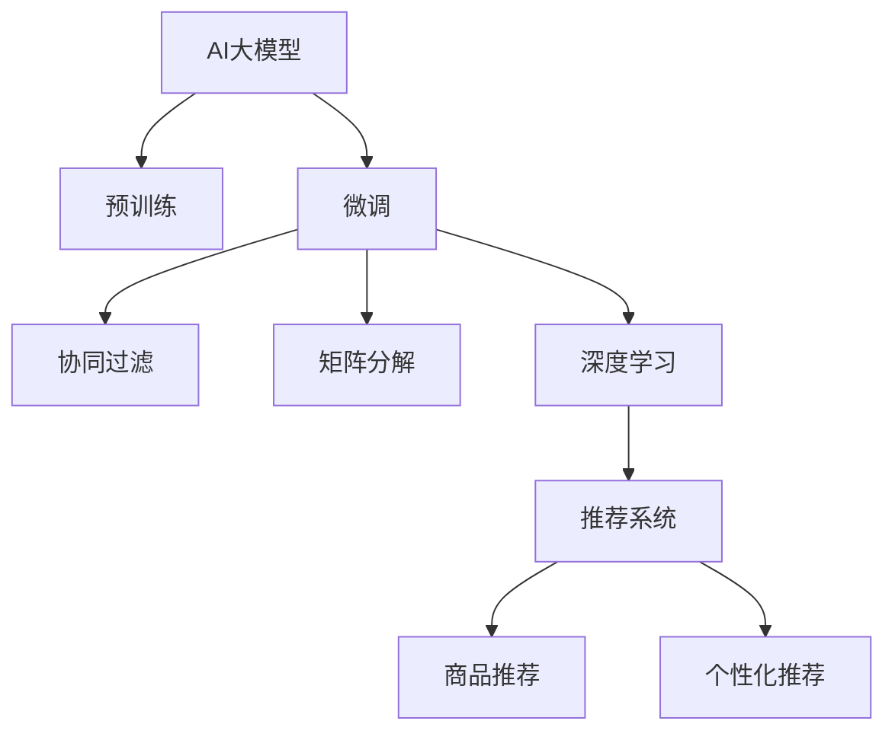

                 

# 搜索推荐系统的AI 大模型优化：电商平台的核心竞争优势

## 1. 背景介绍

### 1.1 问题由来
随着互联网技术的发展和电商平台的普及，消费者在网上的购物行为变得越来越复杂。在巨大的商品库和海量用户数据的背景下，电商平台的推荐系统不仅要精准预测用户偏好，还要考虑用户心理和行为，实现个性化推荐。AI大模型在这方面具有独特的优势，通过对大量用户行为数据的建模，能更准确地预测用户需求，提供更加个性化的购物体验。

### 1.2 问题核心关键点
当前电商平台推荐系统的核心在于如何高效、准确地提取用户特征，并对商品进行建模，实现个性化推荐。AI大模型通过预训练获得了丰富的语义表示能力，可以作为强大的"特征提取器"，在电商平台上进行微调，实现商品推荐等任务。

### 1.3 问题研究意义
优化基于AI大模型的推荐系统，对于提升电商平台的竞争力、提升用户体验、增加销售额具有重要意义。具体来说，可以：

1. **提高个性化推荐准确性**：利用大模型的预训练能力，可以更准确地理解用户意图，提供更符合用户需求的商品推荐。
2. **降低推荐成本**：基于大模型的微调可以快速实现推荐模型的部署，减少新商品推荐需要的大量人工干预。
3. **增强系统灵活性**：大模型能够灵活适应电商平台的个性化需求，快速响应市场变化。
4. **促进创新应用**：电商平台的推荐系统可以探索更多基于大模型的创新应用，如商品搭配推荐、个性化定制等。

## 2. 核心概念与联系

### 2.1 核心概念概述

为了更好地理解AI大模型在电商平台推荐系统中的应用，本节将介绍几个密切相关的核心概念：

- **AI大模型**：指通过大规模预训练数据集训练得到的深度学习模型，如BERT、GPT等。具备强大的语义表示能力和学习能力。
- **推荐系统**：通过分析用户历史行为和偏好，推荐用户可能感兴趣的商品的系统。电商平台的推荐系统需要同时考虑用户和商品两方面的信息。
- **微调**：指在预训练模型的基础上，使用电商平台的标注数据进行有监督学习，优化模型在特定任务上的性能。
- **协同过滤**：基于用户行为和商品特征的相似性进行推荐的方法。
- **矩阵分解**：将用户和商品之间的关联矩阵分解为低维矩阵，实现推荐预测。
- **深度学习**：利用神经网络模型进行推荐系统建模。

这些核心概念之间的逻辑关系可以通过以下Mermaid流程图来展示：



这个流程图展示了AI大模型在电商平台推荐系统中的应用流程：

1. AI大模型通过预训练获得基础能力。
2. 微调在大模型的基础上针对电商平台的特定任务进行优化。
3. 协同过滤和矩阵分解等方法可以作为微调模型的一种补充。
4. 深度学习技术可以用于构建电商平台的推荐系统。
5. 推荐系统实现商品和个性化推荐。

## 3. 核心算法原理 & 具体操作步骤
### 3.1 算法原理概述

基于AI大模型的电商推荐系统，其核心思想是利用大模型作为强大的"特征提取器"，通过电商平台的标注数据进行微调，使得模型能够准确预测用户对商品的兴趣。具体流程如下：

1. **数据准备**：收集电商平台的历史交易数据、用户行为数据、商品描述等，进行数据清洗和标注。
2. **模型构建**：选择合适的AI大模型，如BERT、GPT等，作为推荐系统的基础。
3. **微调过程**：在电商平台的标注数据上，通过微调优化大模型，使其在商品推荐等任务上表现优异。
4. **评估和部署**：在测试集上评估微调后的模型性能，并将其部署到实际推荐系统中，提供实时推荐服务。

### 3.2 算法步骤详解

基于AI大模型的电商平台推荐系统的一般步骤包括：

**Step 1: 数据准备**
- 收集电商平台的历史交易数据、用户行为数据、商品描述等，进行数据清洗和标注。标注数据应包含用户ID、商品ID、用户行为标签、交易时间等信息。

**Step 2: 模型构建**
- 选择并加载预训练AI大模型，如BERT、GPT等。
- 根据推荐任务设计相应的任务适配层，如分类头、回归头等。

**Step 3: 微调过程**
- 将标注数据划分为训练集、验证集和测试集。
- 设置微调超参数，如学习率、批大小、迭代轮数等。
- 在训练集上进行微调，使用验证集进行模型性能监控，必要时进行Early Stopping。
- 在测试集上评估微调后模型的性能，对比微调前后的推荐效果。

**Step 4: 部署和优化**
- 将微调后的模型部署到电商平台的推荐系统中，实现实时推荐。
- 根据推荐效果和用户反馈，不断优化模型参数和超参数，提升推荐精度。

### 3.3 算法优缺点

基于AI大模型的电商平台推荐系统具有以下优点：
1. **高准确性**：利用大模型的预训练能力，可以更准确地预测用户偏好。
2. **泛化能力强**：大模型可以在不同场景下进行微调，提升推荐系统的通用性。
3. **参数效率高**：部分模型参数可以固定，减少微调时的计算量和存储需求。
4. **实时性好**：微调后的模型可以实时处理用户请求，提供动态推荐服务。

同时，该方法也存在一些局限性：
1. **数据依赖**：微调效果依赖于标注数据的质量和数量，标注数据获取成本较高。
2. **过拟合风险**：在标注数据量不足的情况下，大模型可能出现过拟合，降低推荐效果。
3. **计算资源需求高**：大模型的微调需要大量的计算资源，可能影响推荐系统的实时性。
4. **可解释性不足**：大模型的推荐过程缺乏可解释性，难以理解其内部工作机制。

尽管存在这些局限性，基于AI大模型的推荐系统仍是目前电商平台上推荐效果最佳的方法之一，其高准确性和泛化能力使其在实际应用中具有重要价值。

### 3.4 算法应用领域

基于AI大模型的推荐系统在电商平台的推荐任务中有着广泛的应用，例如：

- **商品推荐**：根据用户的历史行为和浏览记录，推荐用户可能感兴趣的商品。
- **个性化定制**：利用大模型的泛化能力，对不同用户进行个性化定制推荐。
- **商品搭配推荐**：根据用户对单品的偏好，推荐相关商品组合。
- **新用户推荐**：为新注册用户推荐热门商品，提高用户转化率。
- **实时推荐**：对用户的实时请求进行推荐，提高用户体验。

除了商品推荐外，AI大模型在电商平台的个性化推荐、购物助手、智能客服等场景中也有着广泛的应用。

## 4. 数学模型和公式 & 详细讲解  
### 4.1 数学模型构建

在本节中，我们将使用数学语言对基于AI大模型的电商平台推荐系统进行更加严格的刻画。

记AI大模型为 $M_{\theta}:\mathcal{X} \rightarrow \mathcal{Y}$，其中 $\mathcal{X}$ 为输入空间，$\mathcal{Y}$ 为输出空间，$\theta \in \mathbb{R}^d$ 为模型参数。假设电商平台推荐任务的数据集为 $D=\{(x_i,y_i)\}_{i=1}^N$，其中 $x_i$ 表示用户行为数据和商品描述，$y_i$ 表示推荐结果，如商品ID。

定义模型 $M_{\theta}$ 在输入 $x$ 上的推荐损失函数为 $\ell(M_{\theta}(x),y)$，则在数据集 $D$ 上的经验风险为：

$$
\mathcal{L}(\theta) = \frac{1}{N} \sum_{i=1}^N \ell(M_{\theta}(x_i),y_i)
$$

微调的优化目标是最小化经验风险，即找到最优参数：

$$
\theta^* = \mathop{\arg\min}_{\theta} \mathcal{L}(\theta)
$$

在实践中，我们通常使用基于梯度的优化算法（如SGD、Adam等）来近似求解上述最优化问题。设 $\eta$ 为学习率，$\lambda$ 为正则化系数，则参数的更新公式为：

$$
\theta \leftarrow \theta - \eta \nabla_{\theta}\mathcal{L}(\theta) - \eta\lambda\theta
$$

其中 $\nabla_{\theta}\mathcal{L}(\theta)$ 为损失函数对参数 $\theta$ 的梯度，可通过反向传播算法高效计算。

### 4.2 公式推导过程

以下我们以电商平台的商品推荐任务为例，推导交叉熵损失函数及其梯度的计算公式。

假设模型 $M_{\theta}$ 在输入 $x$ 上的输出为 $\hat{y}=M_{\theta}(x) \in [0,1]$，表示商品被推荐给用户的概率。真实标签 $y \in \{1,0\}$。则二分类交叉熵损失函数定义为：

$$
\ell(M_{\theta}(x),y) = -[y\log \hat{y} + (1-y)\log (1-\hat{y})]
$$

将其代入经验风险公式，得：

$$
\mathcal{L}(\theta) = -\frac{1}{N}\sum_{i=1}^N [y_i\log M_{\theta}(x_i)+(1-y_i)\log(1-M_{\theta}(x_i))]
$$

根据链式法则，损失函数对参数 $\theta_k$ 的梯度为：

$$
\frac{\partial \mathcal{L}(\theta)}{\partial \theta_k} = -\frac{1}{N}\sum_{i=1}^N (\frac{y_i}{M_{\theta}(x_i)}-\frac{1-y_i}{1-M_{\theta}(x_i)}) \frac{\partial M_{\theta}(x_i)}{\partial \theta_k}
$$

其中 $\frac{\partial M_{\theta}(x_i)}{\partial \theta_k}$ 可进一步递归展开，利用自动微分技术完成计算。

在得到损失函数的梯度后，即可带入参数更新公式，完成模型的迭代优化。重复上述过程直至收敛，最终得到适应电商平台推荐任务的最优模型参数 $\theta^*$。

## 5. 项目实践：代码实例和详细解释说明
### 5.1 开发环境搭建

在进行微调实践前，我们需要准备好开发环境。以下是使用Python进行PyTorch开发的环境配置流程：

1. 安装Anaconda：从官网下载并安装Anaconda，用于创建独立的Python环境。

2. 创建并激活虚拟环境：
```bash
conda create -n pytorch-env python=3.8 
conda activate pytorch-env
```

3. 安装PyTorch：根据CUDA版本，从官网获取对应的安装命令。例如：
```bash
conda install pytorch torchvision torchaudio cudatoolkit=11.1 -c pytorch -c conda-forge
```

4. 安装Transformers库：
```bash
pip install transformers
```

5. 安装各类工具包：
```bash
pip install numpy pandas scikit-learn matplotlib tqdm jupyter notebook ipython
```

完成上述步骤后，即可在`pytorch-env`环境中开始微调实践。

### 5.2 源代码详细实现

下面我以电商平台的商品推荐任务为例，给出使用Transformers库对BERT模型进行微调的PyTorch代码实现。

首先，定义商品推荐任务的数据处理函数：

```python
from transformers import BertTokenizer
from torch.utils.data import Dataset
import torch

class ProductRecommendationDataset(Dataset):
    def __init__(self, user_features, product_features, labels, tokenizer, max_len=128):
        self.user_features = user_features
        self.product_features = product_features
        self.labels = labels
        self.tokenizer = tokenizer
        self.max_len = max_len
        
    def __len__(self):
        return len(self.user_features)
    
    def __getitem__(self, item):
        user_input_ids = self.tokenizer(user_features[item], return_tensors='pt', max_length=self.max_len, padding='max_length', truncation=True)["input_ids"]
        product_input_ids = self.tokenizer(product_features[item], return_tensors='pt', max_length=self.max_len, padding='max_length', truncation=True)["input_ids"]
        labels = torch.tensor([self.labels[item]], dtype=torch.long)
        
        # 拼接用户和商品输入
        input_ids = torch.cat([user_input_ids, product_input_ids], dim=1)
        attention_mask = torch.tensor([1.0] * (self.max_len + 1), dtype=torch.long)[None, :].repeat(user_input_ids.shape[0], 1) + torch.tensor([0.0] * user_input_ids.shape[1], dtype=torch.long)[None, :].repeat(1, product_input_ids.shape[0])
        
        return {'input_ids': input_ids,
                'attention_mask': attention_mask,
                'labels': labels}
```

然后，定义模型和优化器：

```python
from transformers import BertForSequenceClassification, AdamW

model = BertForSequenceClassification.from_pretrained('bert-base-cased', num_labels=2)

optimizer = AdamW(model.parameters(), lr=2e-5)
```

接着，定义训练和评估函数：

```python
from torch.utils.data import DataLoader
from tqdm import tqdm
from sklearn.metrics import classification_report

device = torch.device('cuda') if torch.cuda.is_available() else torch.device('cpu')
model.to(device)

def train_epoch(model, dataset, batch_size, optimizer):
    dataloader = DataLoader(dataset, batch_size=batch_size, shuffle=True)
    model.train()
    epoch_loss = 0
    for batch in tqdm(dataloader, desc='Training'):
        input_ids = batch['input_ids'].to(device)
        attention_mask = batch['attention_mask'].to(device)
        labels = batch['labels'].to(device)
        model.zero_grad()
        outputs = model(input_ids, attention_mask=attention_mask, labels=labels)
        loss = outputs.loss
        epoch_loss += loss.item()
        loss.backward()
        optimizer.step()
    return epoch_loss / len(dataloader)

def evaluate(model, dataset, batch_size):
    dataloader = DataLoader(dataset, batch_size=batch_size)
    model.eval()
    preds, labels = [], []
    with torch.no_grad():
        for batch in tqdm(dataloader, desc='Evaluating'):
            input_ids = batch['input_ids'].to(device)
            attention_mask = batch['attention_mask'].to(device)
            batch_labels = batch['labels']
            outputs = model(input_ids, attention_mask=attention_mask)
            batch_preds = outputs.logits.argmax(dim=2).to('cpu').tolist()
            batch_labels = batch_labels.to('cpu').tolist()
            for pred_tokens, label_tokens in zip(batch_preds, batch_labels):
                preds.append(pred_tokens)
                labels.append(label_tokens)
                
    print(classification_report(labels, preds))
```

最后，启动训练流程并在测试集上评估：

```python
epochs = 5
batch_size = 16

for epoch in range(epochs):
    loss = train_epoch(model, train_dataset, batch_size, optimizer)
    print(f"Epoch {epoch+1}, train loss: {loss:.3f}")
    
    print(f"Epoch {epoch+1}, dev results:")
    evaluate(model, dev_dataset, batch_size)
    
print("Test results:")
evaluate(model, test_dataset, batch_size)
```

以上就是使用PyTorch对BERT进行商品推荐任务微调的完整代码实现。可以看到，得益于Transformers库的强大封装，我们可以用相对简洁的代码完成BERT模型的加载和微调。

### 5.3 代码解读与分析

让我们再详细解读一下关键代码的实现细节：

**ProductRecommendationDataset类**：
- `__init__`方法：初始化用户特征、商品特征、标签等关键组件，并定义分词器。
- `__len__`方法：返回数据集的样本数量。
- `__getitem__`方法：对单个样本进行处理，将用户和商品特征输入编码为token ids，并将标签编码为数字，最终返回模型所需的输入。

**训练和评估函数**：
- 使用PyTorch的DataLoader对数据集进行批次化加载，供模型训练和推理使用。
- 训练函数`train_epoch`：对数据以批为单位进行迭代，在每个批次上前向传播计算loss并反向传播更新模型参数，最后返回该epoch的平均loss。
- 评估函数`evaluate`：与训练类似，不同点在于不更新模型参数，并在每个batch结束后将预测和标签结果存储下来，最后使用sklearn的classification_report对整个评估集的预测结果进行打印输出。

**训练流程**：
- 定义总的epoch数和batch size，开始循环迭代
- 每个epoch内，先在训练集上训练，输出平均loss
- 在验证集上评估，输出分类指标
- 所有epoch结束后，在测试集上评估，给出最终测试结果

可以看到，PyTorch配合Transformers库使得BERT微调的代码实现变得简洁高效。开发者可以将更多精力放在数据处理、模型改进等高层逻辑上，而不必过多关注底层的实现细节。

当然，工业级的系统实现还需考虑更多因素，如模型的保存和部署、超参数的自动搜索、更灵活的任务适配层等。但核心的微调范式基本与此类似。

## 6. 实际应用场景
### 6.1 智能客服系统

基于AI大模型的推荐系统，可以应用于电商平台的智能客服系统，提供更加智能和个性化的服务。通过推荐系统，智能客服可以更准确地预测用户需求，提供更加符合用户期望的解决方案，从而提高客户满意度，降低人工客服成本。

具体而言，可以收集智能客服的历史对话记录和用户反馈，将问题和最佳答复构建成监督数据，在此基础上对预训练推荐模型进行微调。微调后的推荐模型能够自动理解用户意图，匹配最合适的回复模板，从而实现智能客服的自动化和智能化。

### 6.2 个性化推荐系统

基于AI大模型的推荐系统，可以广泛应用于电商平台的个性化推荐场景，帮助用户发现更多可能感兴趣的商品。通过微调，模型能够更好地理解用户的兴趣偏好，提供更加精准的推荐服务。

具体来说，可以收集用户的历史浏览、购买、收藏等行为数据，将数据作为模型输入，通过微调优化模型，使其能够准确预测用户对不同商品的兴趣。在推荐时，模型会根据用户的偏好推荐相关商品，从而提高用户的购物体验和转化率。

### 6.3 商品搭配推荐

基于AI大模型的推荐系统，还可以实现商品的搭配推荐。通过微调，模型能够更好地理解商品之间的关系，推荐更符合用户需求的商品组合。

具体而言，可以收集用户对单品的评价和反馈，将商品描述作为模型输入，通过微调优化模型，使其能够预测用户对商品搭配的偏好。在推荐时，模型会生成商品搭配方案，供用户选择，从而提高用户满意度。

### 6.4 未来应用展望

随着AI大模型和微调方法的不断发展，基于AI大模型的推荐系统将在更多领域得到应用，为电商平台的业务创新带来新的思路。

在智慧城市治理中，推荐系统可以应用于交通规划、公共服务等领域，帮助城市管理者提供更智能的服务，优化资源分配。

在智能制造领域，推荐系统可以应用于设备维护、生产调度等领域，帮助制造商提高生产效率，降低运营成本。

此外，在医疗健康、金融理财、娱乐教育等众多领域，基于AI大模型的推荐系统也将不断涌现，为人类生活带来更多便利和智能。

## 7. 工具和资源推荐
### 7.1 学习资源推荐

为了帮助开发者系统掌握基于AI大模型的推荐系统理论基础和实践技巧，这里推荐一些优质的学习资源：

1. 《深度学习基础》系列博文：由大模型技术专家撰写，介绍了深度学习的基本概念、网络结构、优化算法等。

2. CS231n《卷积神经网络》课程：斯坦福大学开设的计算机视觉明星课程，涵盖深度学习在图像、视频等领域的应用。

3. 《深度学习》书籍：Ian Goodfellow等人著，全面介绍了深度学习的基本原理和应用，适合初学者和进阶读者。

4. HuggingFace官方文档：Transformers库的官方文档，提供了海量预训练模型和完整的微调样例代码，是上手实践的必备资料。

5. Kaggle竞赛平台：提供了丰富的数据集和任务，可以参与实际竞赛，积累推荐系统开发经验。

通过对这些资源的学习实践，相信你一定能够快速掌握基于AI大模型的推荐系统的精髓，并用于解决实际的电商推荐问题。

### 7.2 开发工具推荐

高效的开发离不开优秀的工具支持。以下是几款用于基于AI大模型的推荐系统开发的常用工具：

1. PyTorch：基于Python的开源深度学习框架，灵活动态的计算图，适合快速迭代研究。大部分预训练语言模型都有PyTorch版本的实现。

2. TensorFlow：由Google主导开发的开源深度学习框架，生产部署方便，适合大规模工程应用。同样有丰富的预训练语言模型资源。

3. Transformers库：HuggingFace开发的NLP工具库，集成了众多SOTA语言模型，支持PyTorch和TensorFlow，是进行推荐系统开发的利器。

4. Weights & Biases：模型训练的实验跟踪工具，可以记录和可视化模型训练过程中的各项指标，方便对比和调优。与主流深度学习框架无缝集成。

5. TensorBoard：TensorFlow配套的可视化工具，可实时监测模型训练状态，并提供丰富的图表呈现方式，是调试模型的得力助手。

6. Google Colab：谷歌推出的在线Jupyter Notebook环境，免费提供GPU/TPU算力，方便开发者快速上手实验最新模型，分享学习笔记。

合理利用这些工具，可以显著提升基于AI大模型的推荐系统开发效率，加快创新迭代的步伐。

### 7.3 相关论文推荐

基于AI大模型的推荐系统的发展源于学界的持续研究。以下是几篇奠基性的相关论文，推荐阅读：

1. Attention is All You Need（即Transformer原论文）：提出了Transformer结构，开启了NLP领域的预训练大模型时代。

2. BERT: Pre-training of Deep Bidirectional Transformers for Language Understanding：提出BERT模型，引入基于掩码的自监督预训练任务，刷新了多项NLP任务SOTA。

3. Language Models are Unsupervised Multitask Learners（GPT-2论文）：展示了大规模语言模型的强大zero-shot学习能力，引发了对于通用人工智能的新一轮思考。

4. Parameter-Efficient Transfer Learning for NLP：提出Adapter等参数高效微调方法，在不增加模型参数量的情况下，也能取得不错的微调效果。

5. Prompt Learning：引入基于连续型Prompt的微调范式，为如何充分利用预训练知识提供了新的思路。

6. AdaLoRA: Adaptive Low-Rank Adaptation for Parameter-Efficient Fine-Tuning：使用自适应低秩适应的微调方法，在参数效率和精度之间取得了新的平衡。

这些论文代表了大语言模型和微调技术的发展脉络。通过学习这些前沿成果，可以帮助研究者把握学科前进方向，激发更多的创新灵感。

## 8. 总结：未来发展趋势与挑战

### 8.1 总结

本文对基于AI大模型的电商平台推荐系统进行了全面系统的介绍。首先阐述了AI大模型和推荐系统的研究背景和意义，明确了微调在提升推荐系统性能、降低推荐成本、增强系统灵活性等方面的重要价值。其次，从原理到实践，详细讲解了基于AI大模型的推荐系统的数学模型和核心算法，给出了微调任务开发的完整代码实例。同时，本文还广泛探讨了推荐系统在智能客服、个性化推荐、商品搭配推荐等多个场景中的应用前景，展示了AI大模型的强大应用潜力。

通过本文的系统梳理，可以看到，基于AI大模型的推荐系统已经在电商平台上取得了显著的成效，其高准确性和泛化能力使其在实际应用中具有重要价值。未来，随着技术的不断进步，基于AI大模型的推荐系统必将在更多领域得到应用，为人类生产和生活带来更多的便利和智能。

### 8.2 未来发展趋势

展望未来，基于AI大模型的推荐系统将呈现以下几个发展趋势：

1. **模型规模不断增大**：随着算力成本的下降和数据规模的扩张，预训练语言模型的参数量还将持续增长。超大规模语言模型蕴含的丰富语言知识，有望支撑更加复杂多变的推荐系统微调。

2. **微调方法更加多样**：未来会涌现更多参数高效的微调方法，如Prefix-Tuning、LoRA等，在固定大部分预训练参数的同时，只更新极少量的任务相关参数。同时优化微调模型的计算图，减少前向传播和反向传播的资源消耗，实现更加轻量级、实时性的部署。

3. **实时性不断提升**：随着硬件性能的提升和模型压缩技术的进步，基于AI大模型的推荐系统将具有更强的实时性，可以实时响应用户请求，提供动态推荐服务。

4. **推荐效果更加精准**：通过引入因果推断和对比学习思想，增强推荐模型建立稳定因果关系的能力，学习更加普适、鲁棒的语言表征，从而提升推荐模型的泛化性和抗干扰能力。

5. **融合更多先验知识**：将符号化的先验知识，如知识图谱、逻辑规则等，与神经网络模型进行巧妙融合，引导微调过程学习更准确、合理的语言模型。同时加强不同模态数据的整合，实现视觉、语音等多模态信息与文本信息的协同建模。

6. **多模型集成**：构建多模型融合的推荐系统，结合不同模型的优势，提升推荐效果和系统鲁棒性。

以上趋势凸显了基于AI大模型的推荐系统的广阔前景。这些方向的探索发展，必将进一步提升推荐系统的性能和应用范围，为电商平台的业务创新和智能化转型提供有力支撑。

### 8.3 面临的挑战

尽管基于AI大模型的推荐系统已经取得了显著的成效，但在迈向更加智能化、普适化应用的过程中，它仍面临诸多挑战：

1. **标注成本高**：微调效果依赖于标注数据的质量和数量，标注数据获取成本较高。如何降低推荐系统对标注样本的依赖，将是一大难题。

2. **推荐效率低**：当前基于AI大模型的推荐系统在实时性方面仍有不足。如何在保持高准确性的同时，提高推荐效率，优化用户体验，是未来的重要研究方向。

3. **数据质量差**：电商平台的交易数据和用户行为数据质量参差不齐，存在噪声和缺失值等问题。如何清洗和处理数据，提高数据质量，是推荐系统发展的关键。

4. **算法复杂度高**：基于AI大模型的推荐系统算法复杂度较高，模型训练和推理耗时较长。如何简化算法，降低计算量，提升推荐系统效率，需要更多的技术突破。

5. **可解释性不足**：AI大模型的推荐过程缺乏可解释性，难以理解其内部工作机制和决策逻辑。如何在保持高准确性的同时，提高推荐系统的可解释性，是未来的重要研究方向。

6. **安全性风险**：基于AI大模型的推荐系统存在数据泄露和误导性推荐的风险。如何在保护用户隐私的同时，提升推荐系统的安全性，需要更多的技术手段和法规规范。

面对这些挑战，未来的研究需要在数据处理、模型优化、算法改进、用户隐私保护等方面寻求新的突破，才能不断提升基于AI大模型的推荐系统的性能和应用范围。

### 8.4 研究展望

未来的研究将在以下几个方面进行探索：

1. **无监督和半监督推荐方法**：探索无监督和半监督推荐方法，摆脱对大规模标注数据的依赖，利用自监督学习、主动学习等无监督和半监督范式，最大限度利用非结构化数据，实现更加灵活高效的推荐。

2. **模型压缩和优化**：开发更加轻量级的推荐模型，采用模型压缩、稀疏化存储等方法，减少模型尺寸和存储空间，提升推荐系统的实时性和可部署性。

3. **因果分析和博弈论工具**：将因果分析方法引入推荐系统，识别出推荐过程中的关键特征，增强推荐系统输出的因果性和逻辑性。借助博弈论工具刻画人机交互过程，主动探索并规避模型的脆弱点，提高系统稳定性。

4. **数据增强和对抗训练**：引入数据增强和对抗训练方法，增强推荐系统的鲁棒性，减少数据分布变化对推荐效果的影响。

5. **多模型融合和协同优化**：构建多模型融合的推荐系统，结合不同模型的优势，提升推荐效果和系统鲁棒性。

6. **伦理和隐私保护**：加强对用户隐私和数据安全的保护，引入伦理导向的评估指标，过滤和惩罚有害的推荐结果，确保推荐系统符合人类价值观和伦理道德。

这些研究方向将引领基于AI大模型的推荐系统迈向更高的台阶，为构建安全、可靠、可解释、可控的推荐系统铺平道路。面向未来，基于AI大模型的推荐系统需要在保持高准确性的同时，提升实时性、可解释性和安全性，才能真正实现人工智能技术在电商平台的规模化落地。

## 9. 附录：常见问题与解答

**Q1：AI大模型微调是否适用于所有推荐场景？**

A: AI大模型微调在大多数推荐场景上都能取得不错的效果，特别是对于数据量较大的推荐任务。但对于一些特定领域的推荐任务，如医疗、金融等，仅仅依靠通用语料预训练的模型可能难以很好地适应。此时需要在特定领域语料上进一步预训练，再进行微调，才能获得理想效果。此外，对于一些需要时效性、个性化很强的任务，如实时推荐、个性化推荐等，微调方法也需要针对性的改进优化。

**Q2：如何缓解微调过程中的过拟合问题？**

A: 过拟合是微调面临的主要挑战，尤其是在标注数据量不足的情况下。常见的缓解策略包括：
1. 数据增强：通过回译、近义替换等方式扩充训练集
2. 正则化：使用L2正则、Dropout、Early Stopping等避免过拟合
3. 对抗训练：引入对抗样本，提高模型鲁棒性
4. 参数高效微调：只调整少量参数(如Adapter、Prefix等)，减小过拟合风险
5. 多模型集成：训练多个微调模型，取平均输出，抑制过拟合

这些策略往往需要根据具体任务和数据特点进行灵活组合。只有在数据、模型、训练、推理等各环节进行全面优化，才能最大限度地发挥AI大模型微调的威力。

**Q3：推荐系统如何平衡推荐效果和计算成本？**

A: 推荐系统的推荐效果和计算成本是相互制约的。为了平衡这两者，可以采用以下策略：
1. 特征选择：选择与推荐目标最相关的特征，减少模型输入的维度。
2. 参数共享：共享部分模型的参数，减少计算量。
3. 模型压缩：采用模型压缩、稀疏化存储等方法，减少模型尺寸和存储空间。
4. 分布式训练：利用分布式计算资源，加速模型训练过程。
5. 动态更新：根据用户反馈和实时数据，动态更新模型参数，减少过拟合风险。

通过这些方法，可以在保证推荐效果的同时，降低计算成本，提升推荐系统的实时性和可部署性。

**Q4：推荐系统如何提高可解释性？**

A: 推荐系统的可解释性对于用户信任和系统可信度至关重要。以下是一些提高可解释性的方法：
1. 透明模型设计：选择透明性高的模型，如线性模型、决策树等，便于解释。
2. 特征可视化：通过可视化工具，展示推荐过程中考虑的关键特征。
3. 因果分析：引入因果分析方法，分析推荐结果背后的因果关系。
4. 知识图谱：结合领域知识，构建知识图谱，增强推荐系统的可解释性。
5. 用户反馈：收集用户反馈，了解推荐结果的不足之处，进行改进。

这些方法可以帮助推荐系统提高可解释性，增强用户对系统的信任感。

---

作者：禅与计算机程序设计艺术 / Zen and the Art of Computer Programming

