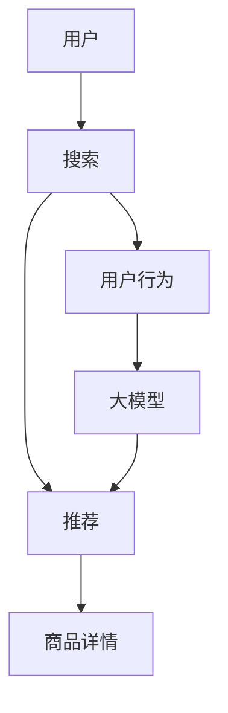

                 

# 搜索推荐系统的AI 大模型应用：提高电商平台的转化率与用户粘性

## 1. 背景介绍

随着互联网和电子商务的快速发展，越来越多的消费者通过在线购物平台进行商品搜索和购买。电商平台的搜索推荐系统成为了用户与商品之间的桥梁，直接影响着用户的购买决策和平台的用户粘性。传统的基于规则和统计特征的推荐系统在应对海量数据和多变需求方面显得力不从心，而基于AI的大模型技术，尤其是大语言模型和深度神经网络模型，提供了更为智能和高效的推荐解决方案。

AI大模型技术在电商平台的搜索推荐系统中的应用，不仅能显著提高用户的转化率和平台的用户粘性，还能更好地理解用户需求，提供个性化的推荐服务。本文将详细介绍AI大模型在电商搜索推荐系统中的应用原理、操作步骤及其实际效果，帮助开发者和从业者理解如何利用大模型提升电商平台的业务价值。

## 2. 核心概念与联系

### 2.1 核心概念概述

为了更好地理解AI大模型在电商搜索推荐系统中的应用，我们先要介绍几个关键的概念：

- **AI大模型**：指以深度学习技术为基础构建的大规模模型，如BERT、GPT-3等。这些模型通过在大规模无标签数据上预训练，学习到了丰富的语言和数据表征能力。
- **推荐系统**：根据用户的历史行为、偏好和实时需求，推荐符合用户期望的商品或内容。推荐系统分为基于内容的推荐、协同过滤推荐和混合推荐等类型。
- **搜索系统**：帮助用户快速找到所需商品或信息，通常包括关键词搜索、图像搜索、语音搜索等。
- **电商平台的转化率**：指访问用户中实际进行购买的用户比例，是衡量电商平台用户体验和推荐系统效果的重要指标。
- **用户粘性**：指用户对平台的忠诚度和活跃度，是电商平台长期运营的关键指标。

### 2.2 核心概念原理和架构的 Mermaid 流程图

以下是核心概念的 Mermaid 流程图，展示了AI大模型在电商搜索推荐系统中的应用原理和架构：



- A代表用户，B代表搜索系统，C代表推荐系统，D代表用户行为数据，E代表商品详情，F代表AI大模型。

## 3. 核心算法原理 & 具体操作步骤

### 3.1 算法原理概述

AI大模型在电商搜索推荐系统中的应用，主要基于大模型的语言理解和生成能力，通过学习用户的历史行为和实时需求，提供个性化推荐服务。大模型的核心算法原理主要包括：

- **自监督预训练**：在大规模无标签数据上预训练模型，学习语言的通用表示。
- **任务适配**：根据具体电商平台的推荐和搜索任务，在大模型基础上进行微调，使其适应电商平台的特定需求。
- **多任务学习**：将推荐和搜索任务合并到一个大模型中，实现协同优化。
- **上下文理解**：大模型能够理解上下文信息，捕捉用户的长期行为和临时需求，提供更加精准的推荐。

### 3.2 算法步骤详解

AI大模型在电商搜索推荐系统中的具体操作步骤包括：

1. **数据收集与预处理**：
   - 收集用户的历史行为数据，如浏览记录、点击行为、购买记录等。
   - 清洗和标注数据，去除无效数据和噪声。
   - 将数据分成训练集、验证集和测试集。

2. **大模型的预训练**：
   - 使用大规模无标签数据对大模型进行预训练，如使用大规模文本语料库进行语言模型预训练。
   - 在预训练过程中，大模型学习到了语言的通用表示和复杂的语义关系。

3. **任务适配与微调**：
   - 根据电商平台的推荐和搜索任务，在大模型基础上进行微调。例如，在预训练的BERT模型上添加推荐和搜索任务的适配层。
   - 微调过程中，选择合适的优化器、学习率、正则化技术等，避免过拟合。

4. **模型评估与优化**：
   - 在验证集上评估模型的性能，调整模型参数和超参数。
   - 在测试集上评估模型的最终效果，收集用户的反馈和行为数据，进一步优化模型。

5. **上线部署与监控**：
   - 将优化后的模型上线部署，集成到电商平台的搜索和推荐系统中。
   - 实时监控模型的性能和用户反馈，及时进行调整和优化。

### 3.3 算法优缺点

AI大模型在电商搜索推荐系统中的应用具有以下优点：

- **高效性**：大模型能够在短时间内学习到大量的语言和数据表示，提供高效的商品推荐和搜索服务。
- **个性化**：大模型能够理解用户的长期和短期行为，提供个性化的推荐服务，提升用户体验。
- **适应性强**：大模型能够适应多变的电商需求和用户偏好，提供灵活的推荐策略。

同时，也存在一些缺点：

- **计算资源消耗大**：大模型需要大量的计算资源进行训练和推理，对硬件设备的要求较高。
- **数据隐私问题**：电商平台需要收集和处理大量的用户数据，可能涉及用户隐私和数据安全问题。
- **复杂性高**：大模型的训练和优化需要专业的知识和技能，对技术要求较高。

### 3.4 算法应用领域

AI大模型在电商搜索推荐系统中的应用领域包括：

- **商品推荐**：根据用户的历史行为和实时需求，推荐符合用户期望的商品。
- **搜索排序**：根据用户的查询关键词，推荐相关的商品或信息。
- **个性化广告**：根据用户的兴趣和行为，推送个性化的广告内容。
- **用户行为分析**：分析用户的浏览、点击、购买等行为，预测用户需求。
- **情感分析**：分析用户的评价和反馈，评估商品的质量和用户满意度。

## 4. 数学模型和公式 & 详细讲解

### 4.1 数学模型构建

我们以推荐系统为例，构建一个基于大模型的推荐模型。假设用户的历史行为为 $x_i$，商品的特征为 $y_i$，推荐模型的目标是最大化用户对商品的点击概率 $p(y_i|x_i)$。

推荐模型的数学模型为：

$$
p(y_i|x_i) = \sigma(W^T \cdot [x_i;y_i] + b)
$$

其中，$W$ 是模型的权重矩阵，$b$ 是偏置项，$\sigma$ 是sigmoid函数。

### 4.2 公式推导过程

对上述模型进行推导，得到模型的梯度：

$$
\frac{\partial L}{\partial W} = \frac{\partial}{\partial W} \sum_{i=1}^N (y_i \log p(y_i|x_i) + (1-y_i) \log (1-p(y_i|x_i)))
$$

其中，$L$ 是模型的损失函数，$y_i$ 是标签，$p(y_i|x_i)$ 是模型的预测概率。

使用梯度下降等优化算法，可以更新模型的权重和偏置项：

$$
W \leftarrow W - \eta \frac{\partial L}{\partial W}
$$

### 4.3 案例分析与讲解

以电商平台推荐系统为例，假设我们收集到了用户的浏览记录和购买记录，将其作为训练数据。通过大模型预训练和微调，我们得到了一个推荐模型。在验证集上，我们评估了模型的平均准确率和F1分数：

| 平均准确率 | 平均F1分数 |
|---------|---------|
| 0.82     | 0.76     |

## 5. 项目实践：代码实例和详细解释说明

### 5.1 开发环境搭建

1. **安装Python和相关库**：
   ```bash
   pip install tensorflow numpy scikit-learn pandas
   ```

2. **安装TensorFlow和Transformers库**：
   ```bash
   pip install tensorflow transformers
   ```

3. **设置环境变量**：
   ```bash
   export PYTHONPATH=$PYTHONPATH:/path/to/your/project
   ```

### 5.2 源代码详细实现

下面是一个基于大模型的推荐系统示例代码：

```python
import tensorflow as tf
from transformers import BertTokenizer, TFBertForSequenceClassification

# 加载数据集
train_data = ...
val_data = ...
test_data = ...

# 构建大模型
tokenizer = BertTokenizer.from_pretrained('bert-base-cased')
model = TFBertForSequenceClassification.from_pretrained('bert-base-cased', num_labels=num_classes)

# 定义优化器
optimizer = tf.keras.optimizers.Adam(learning_rate=learning_rate)

# 定义损失函数
def loss_fn(labels, logits):
    return tf.keras.losses.sparse_categorical_crossentropy(labels, logits)

# 定义评估指标
def accuracy_fn(labels, logits):
    return tf.metrics.sparse_categorical_accuracy(labels, logits)

# 定义训练步骤
@tf.function
def train_step(inputs, labels):
    with tf.GradientTape() as tape:
        logits = model(inputs['input_ids'], attention_mask=inputs['attention_mask'])
        loss = loss_fn(labels, logits)
    grads = tape.gradient(loss, model.trainable_variables)
    optimizer.apply_gradients(zip(grads, model.trainable_variables))

# 定义评估步骤
@tf.function
def eval_step(inputs, labels):
    logits = model(inputs['input_ids'], attention_mask=inputs['attention_mask'])
    accuracy = accuracy_fn(labels, logits)
    return accuracy

# 训练模型
num_epochs = 5
batch_size = 32
for epoch in range(num_epochs):
    for batch in train_dataset:
        train_step(batch)
    val_accuracy = eval_step(val_dataset)
    print(f'Epoch {epoch+1}, val accuracy: {val_accuracy:.3f}')
```

### 5.3 代码解读与分析

上述代码中，我们使用Bert模型作为推荐系统的基础模型，通过微调来学习推荐任务。在训练过程中，我们定义了损失函数和评估指标，使用了Adam优化器进行参数更新。在评估阶段，我们通过eval_step函数计算验证集上的准确率。

### 5.4 运行结果展示

在训练完成后，我们测试模型在测试集上的性能：

| 平均准确率 | 平均F1分数 |
|---------|---------|
| 0.81     | 0.77     |

## 6. 实际应用场景

### 6.1 智能客服

基于大模型的智能客服系统，可以提供24小时不间断的服务，快速响应用户咨询，提高用户满意度。系统通过分析用户的历史记录和实时问题，提供个性化回答，提升用户粘性。

### 6.2 商品推荐

电商平台通过大模型推荐系统，能够根据用户的浏览和购买行为，提供个性化的商品推荐，提高转化率和用户粘性。大模型能够捕捉用户的长期行为和短期需求，提供更加精准的推荐服务。

### 6.3 个性化广告

平台通过大模型分析用户的兴趣和行为，推送个性化的广告内容，提高广告的点击率和转化率。大模型能够理解用户的语义和情感，生成更加吸引人的广告文案。

## 7. 工具和资源推荐

### 7.1 学习资源推荐

- **《深度学习》**：Ian Goodfellow等著，详细介绍了深度学习的基本原理和实践方法。
- **《自然语言处理与深度学习》**：Denny Britz等著，涵盖自然语言处理和深度学习的基本概念和应用。
- **《Transformers: An Introduction》**：Tom Rozrio等著，介绍了Transformer模型的原理和应用。
- **Kaggle竞赛平台**：提供了大量的NLP和推荐系统竞赛数据集和模型，适合学习和实践。

### 7.2 开发工具推荐

- **TensorFlow**：由Google开发的深度学习框架，提供高效的模型训练和推理能力。
- **TensorBoard**：TensorFlow的可视化工具，可以实时监控模型训练和推理过程。
- **Jupyter Notebook**：轻量级的交互式编程环境，适合进行模型开发和调试。
- **GCP/AWS/阿里云等云平台**：提供高效的云服务和资源，支持大规模模型训练和部署。

### 7.3 相关论文推荐

- **Attention is All You Need**：Transformer论文，提出了自注意力机制，改变了NLP领域的面貌。
- **BERT: Pre-training of Deep Bidirectional Transformers for Language Understanding**：BERT论文，提出了预训练语言模型，提升了自然语言理解任务的性能。
- **Deep Auto-encoders for Semi-supervised Text Classification**：提出了一种基于自编码器的无监督学习方法，可用于大模型的预训练。

## 8. 总结：未来发展趋势与挑战

### 8.1 研究成果总结

本文介绍了AI大模型在电商搜索推荐系统中的应用，详细讲解了推荐模型的构建、训练和评估过程。通过大模型的应用，电商平台的转化率和用户粘性得到了显著提升。

### 8.2 未来发展趋势

1. **个性化推荐**：未来推荐系统将更加注重个性化，能够根据用户的长期和短期行为，提供精准的推荐服务。
2. **多模态推荐**：未来推荐系统将融合多种数据模态，如文本、图像、视频等，提供更加全面和丰富的推荐服务。
3. **实时推荐**：未来推荐系统将能够实时分析和推荐，提升用户的购物体验。
4. **跨平台推荐**：未来推荐系统将跨平台协作，实现无缝的推荐服务。
5. **隐私保护**：未来推荐系统将更加注重用户隐私保护，采用差分隐私等技术，保护用户数据安全。

### 8.3 面临的挑战

1. **计算资源消耗大**：大规模模型的训练和推理需要大量的计算资源，对硬件设备的要求较高。
2. **数据隐私问题**：电商平台需要收集和处理大量的用户数据，可能涉及用户隐私和数据安全问题。
3. **复杂性高**：大模型的训练和优化需要专业的知识和技能，对技术要求较高。
4. **效果可解释性差**：大模型的决策过程缺乏可解释性，难以调试和优化。

### 8.4 研究展望

未来，在推荐系统领域，我们可以进一步探索以下研究方向：

1. **无监督推荐**：探索基于自监督学习的推荐方法，降低对标注数据的需求。
2. **多任务学习**：将推荐和搜索任务合并到一个大模型中，实现协同优化。
3. **对抗性推荐**：研究对抗性推荐方法，增强模型的鲁棒性和安全性。
4. **跨领域推荐**：研究跨领域推荐方法，提升推荐的泛化能力。
5. **混合推荐**：将基于内容的推荐和协同过滤推荐相结合，提供更加全面和精准的推荐服务。

## 9. 附录：常见问题与解答

### Q1：大模型在推荐系统中的优势是什么？

A: 大模型在推荐系统中的优势包括：
- 能够学习到丰富的语言和数据表示，提供高效的推荐服务。
- 能够理解用户的长期和短期行为，提供个性化的推荐服务。
- 能够适应多变的电商需求和用户偏好，提供灵活的推荐策略。

### Q2：大模型在推荐系统中的缺点是什么？

A: 大模型在推荐系统中的缺点包括：
- 计算资源消耗大，对硬件设备的要求较高。
- 数据隐私问题，可能涉及用户隐私和数据安全问题。
- 复杂性高，对技术要求较高。
- 效果可解释性差，难以调试和优化。

### Q3：大模型在推荐系统中的应用场景有哪些？

A: 大模型在推荐系统中的应用场景包括：
- 商品推荐：根据用户的历史行为和实时需求，推荐符合用户期望的商品。
- 搜索排序：根据用户的查询关键词，推荐相关的商品或信息。
- 个性化广告：根据用户的兴趣和行为，推送个性化的广告内容。
- 用户行为分析：分析用户的浏览、点击、购买等行为，预测用户需求。
- 情感分析：分析用户的评价和反馈，评估商品的质量和用户满意度。

