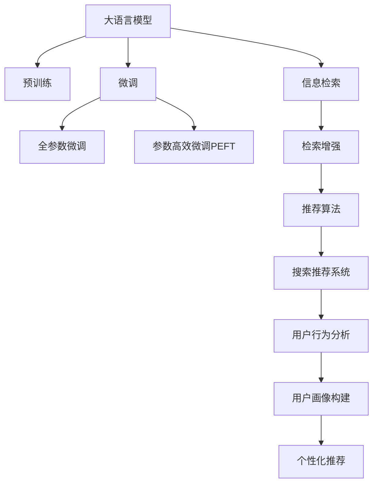

                 

# 搜索推荐系统的AI 大模型应用：电商平台提高效率与效果的双重策略

> 关键词：电商平台,搜索推荐系统,大语言模型,大模型微调,信息检索,推荐算法

## 1. 背景介绍

### 1.1 问题由来
随着电子商务平台的迅速发展和用户需求的多样化，传统的推荐系统面临着诸多挑战。用户对个性化推荐的需求日益增长，同时，电商平台也需要通过推荐算法提升用户体验和销售转化率。传统的推荐算法通常基于用户历史行为、商品特征等进行建模，但随着数据量的增大和特征空间的复杂化，推荐系统的训练和推理开销显著增加，难以实时响应用户的个性化需求。

与此同时，深度学习技术的迅猛发展，特别是大模型在自然语言处理(NLP)领域的成功应用，为推荐系统的升级提供了新的思路。通过引入大语言模型，电商平台能够基于用户输入的自然语言查询，提供更精准、更高效的推荐服务。

### 1.2 问题核心关键点
本文聚焦于如何在电商平台中应用大语言模型，提升搜索推荐系统的效率和效果。核心关键点包括：

- 大语言模型在电商平台搜索推荐中的应用：利用大模型处理用户查询和商品描述，实现更加智能化的推荐。
- 搜索推荐系统的优化策略：包括模型微调、数据增强、多任务学习等方法，提升系统的推荐性能和泛化能力。
- 电商平台的落地实践：分享实际项目中大模型应用的策略、工具和资源，加速技术落地。

## 2. 核心概念与联系

### 2.1 核心概念概述

为更好地理解大语言模型在电商搜索推荐中的应用，本节将介绍几个密切相关的核心概念：

- 大语言模型(Large Language Model, LLM)：以自回归(如GPT)或自编码(如BERT)模型为代表的大规模预训练语言模型。通过在大规模无标签文本语料上进行预训练，学习通用的语言表示，具备强大的语言理解和生成能力。

- 预训练(Pre-training)：指在大规模无标签文本语料上，通过自监督学习任务训练通用语言模型的过程。常见的预训练任务包括言语建模、遮挡语言模型等。预训练使得模型学习到语言的通用表示。

- 微调(Fine-tuning)：指在预训练模型的基础上，使用下游任务的少量标注数据，通过有监督学习优化模型在特定任务上的性能。通常只需要调整顶层分类器或解码器，并以较小的学习率更新全部或部分的模型参数。

- 搜索推荐系统(Search and Recommendation System, SRS)：通过分析用户行为和商品特征，为用户推荐最相关商品的系统。其目标是通过提高点击率、转化率等指标，提升用户体验和电商平台销售额。

- 信息检索(Information Retrieval, IR)：基于用户查询，从大量数据中检索出相关记录的技术。信息检索与推荐系统紧密相关，尤其在用户输入自然语言查询时，信息检索是推荐系统的首要任务。

- 推荐算法(Recommendation Algorithm)：基于用户历史行为、商品属性等数据，通过模型训练得到的推荐规则或策略。推荐算法通常用于生成推荐列表，辅助搜索推荐系统进行排序和推荐。

- 大模型微调(Parameter-Efficient Fine-Tuning, PEFT)：指在微调过程中，只更新少量的模型参数，而固定大部分预训练权重不变，以提高微调效率，避免过拟合的方法。

- 多任务学习(Multi-task Learning, MTL)：在同一个模型上，同时训练多个任务的相关模型参数，以提升模型的泛化能力和任务之间的关联性。

- 检索增强(Retrieval Augmentation)：在推荐系统中加入检索阶段，将查询扩展到更丰富的语义空间，提高推荐相关性。

这些核心概念之间的逻辑关系可以通过以下Mermaid流程图来展示：



这个流程图展示了大语言模型在电商平台的搜索推荐系统中的核心概念及其之间的关系：

1. 大语言模型通过预训练获得基础能力。
2. 微调是对预训练模型进行任务特定的优化，可以分为全参数微调和参数高效微调（PEFT）。
3. 信息检索是推荐系统的关键基础，尤其是当用户输入自然语言查询时，信息检索尤为重要。
4. 检索增强和推荐算法辅助提升推荐相关性。
5. 用户行为分析和用户画像构建是推荐系统的重要环节。
6. 个性化推荐最终通过搜索推荐系统反馈给用户，提升用户体验和电商平台销售额。

这些概念共同构成了电商搜索推荐系统的核心框架，使得大语言模型能够在大规模数据上，通过微调和训练，实现高效、精准的推荐服务。

## 3. 核心算法原理 & 具体操作步骤
### 3.1 算法原理概述

基于大语言模型的电商搜索推荐系统，通过结合信息检索和推荐算法，实现高效精准的推荐服务。其核心思想是：

1. 利用大语言模型处理用户查询和商品描述，提取语义信息，实现更加智能化的信息检索。
2. 基于检索结果，结合推荐算法，生成个性化的商品推荐列表，提升用户体验和转化率。

形式化地，假设电商平台收集到大量商品描述 $D=\{d_i\}_{i=1}^N$ 和用户查询 $Q=\{q_j\}_{j=1}^M$，其中 $d_i$ 和 $q_j$ 均为自然语言文本。通过预训练模型 $M_{\theta}$，对商品和查询进行编码，得到语义表示 $h_i$ 和 $g_j$。

推荐的第一步是信息检索，即找到与用户查询 $q_j$ 语义相近的商品描述 $d_k$。通过计算相似度 $s(q_j, d_k)$，得到检索结果列表 $I(q_j) = \{d_k | s(q_j, d_k) > \theta\}$，其中 $\theta$ 为相似度阈值。

推荐的第二步是推荐算法，基于检索结果 $I(q_j)$，结合用户历史行为 $H_j$，生成推荐列表 $R(q_j)$。常见的推荐算法包括基于协同过滤、基于内容的推荐、混合推荐等。

### 3.2 算法步骤详解

基于大语言模型的电商搜索推荐系统一般包括以下几个关键步骤：

**Step 1: 准备预训练模型和数据集**
- 选择合适的预训练语言模型 $M_{\theta}$ 作为初始化参数，如 BERT、GPT等。
- 准备商品描述和用户查询数据集 $D$ 和 $Q$，其中商品描述和查询分别进行分词和编码处理。

**Step 2: 设计检索模型**
- 使用预训练模型 $M_{\theta}$ 对商品描述和查询进行编码，得到语义表示 $h_i$ 和 $g_j$。
- 通过相似度计算，生成检索结果列表 $I(q_j)$。

**Step 3: 设计推荐模型**
- 基于检索结果 $I(q_j)$，设计推荐算法 $R(q_j)$。常见的推荐算法包括矩阵分解、协同过滤、深度学习推荐模型等。
- 将用户历史行为 $H_j$ 作为输入，结合检索结果 $I(q_j)$，生成推荐列表 $R(q_j)$。

**Step 4: 设置微调超参数**
- 选择合适的优化算法及其参数，如 AdamW、SGD 等，设置学习率、批大小、迭代轮数等。
- 设置正则化技术及强度，包括权重衰减、Dropout、Early Stopping 等。
- 确定冻结预训练参数的策略，如仅微调顶层，或全部参数都参与微调。

**Step 5: 执行梯度训练**
- 将检索结果列表 $I(q_j)$ 和用户历史行为 $H_j$ 分批次输入模型，前向传播计算损失函数。
- 反向传播计算参数梯度，根据设定的优化算法和学习率更新模型参数。
- 周期性在验证集上评估模型性能，根据性能指标决定是否触发 Early Stopping。
- 重复上述步骤直到满足预设的迭代轮数或 Early Stopping 条件。

**Step 6: 测试和部署**
- 在测试集上评估微调后模型 $M_{\hat{\theta}}$ 的性能，对比微调前后的精度提升。
- 使用微调后的模型对新样本进行推理预测，集成到实际的应用系统中。
- 持续收集新的数据，定期重新微调模型，以适应数据分布的变化。

以上是基于大语言模型的电商搜索推荐系统的一般流程。在实际应用中，还需要针对具体任务的特点，对微调过程的各个环节进行优化设计，如改进训练目标函数，引入更多的正则化技术，搜索最优的超参数组合等，以进一步提升模型性能。

### 3.3 算法优缺点

基于大语言模型的电商搜索推荐系统具有以下优点：
1. 高效检索：利用大语言模型处理自然语言查询和商品描述，实现更加智能化的信息检索，减少对规则化查询的依赖。
2. 泛化能力强：大语言模型能够处理各种自然语言，具有较强的泛化能力，能够应对多样化的用户查询和商品描述。
3. 精准推荐：结合推荐算法，生成个性化的商品推荐列表，提升用户体验和转化率。

同时，该方法也存在一定的局限性：
1. 数据依赖：检索和推荐的效果很大程度上取决于商品和查询数据的质量和数量，获取高质量数据成本较高。
2. 训练开销大：大语言模型通常参数量较大，训练和推理开销较大，难以实时响应用户需求。
3. 模型复杂：大语言模型和推荐算法的设计复杂，需要综合考虑模型的准确性和效率。
4. 用户体验：推荐结果的展示方式和排序策略也需要精心设计，以提升用户体验和点击率。

尽管存在这些局限性，但就目前而言，基于大语言模型的搜索推荐系统仍是电商推荐领域的热门方向。未来相关研究的重点在于如何进一步降低数据依赖，提高模型的实时性和效率，同时兼顾可解释性和用户体验。

### 3.4 算法应用领域

基于大语言模型的搜索推荐系统已经在电商、社交媒体、视频等多个领域得到了广泛的应用，具体应用包括：

- 商品推荐：如淘宝、亚马逊等电商平台的商品推荐。利用用户搜索历史和商品描述，生成个性化推荐列表。
- 内容推荐：如Netflix、YouTube等视频平台的个性化内容推荐。通过分析用户观看历史和评分，生成相关视频推荐。
- 社交推荐：如Facebook、微信等社交平台的内容推荐。利用用户点赞、评论等行为数据，生成个性化内容推荐。
- 旅游推荐：如携程、去哪儿等旅游平台的景点推荐。通过分析用户搜索记录和评分，生成个性化景点推荐。

除了上述这些经典应用外，基于大语言模型的推荐系统还被创新性地应用到更多场景中，如游戏推荐、在线课程推荐等，为各行业带来新的突破。

## 4. 数学模型和公式 & 详细讲解  
### 4.1 数学模型构建

本节将使用数学语言对基于大语言模型的电商搜索推荐系统进行更加严格的刻画。

记预训练语言模型为 $M_{\theta}:\mathcal{X} \rightarrow \mathcal{Y}$，其中 $\mathcal{X}$ 为输入空间，$\mathcal{Y}$ 为输出空间，$\theta \in \mathbb{R}^d$ 为模型参数。假设电商平台收集到的商品描述和用户查询数据集分别为 $D=\{d_i\}_{i=1}^N$ 和 $Q=\{q_j\}_{j=1}^M$。

定义模型 $M_{\theta}$ 在商品描述 $d_i$ 和用户查询 $q_j$ 上的检索函数为 $\text{IR}(d_i, q_j)$，用于计算检索结果 $I(q_j)$ 的相关性得分。检索模型的输出为一个与查询相似的检索结果列表 $I(q_j)$，其中每个元素 $d_k$ 都由模型 $M_{\theta}$ 对商品描述 $d_k$ 和查询 $q_j$ 进行编码，然后通过相似度计算得到。

推荐的第一步是信息检索，即找到与用户查询 $q_j$ 语义相近的商品描述 $d_k$。通过计算相似度 $s(q_j, d_k)$，得到检索结果列表 $I(q_j) = \{d_k | s(q_j, d_k) > \theta\}$，其中 $\theta$ 为相似度阈值。

推荐的第二步是推荐算法，基于检索结果 $I(q_j)$，结合用户历史行为 $H_j$，生成推荐列表 $R(q_j)$。常见的推荐算法包括矩阵分解、协同过滤、深度学习推荐模型等。

通过梯度下降等优化算法，微调过程不断更新模型参数 $\theta$，最小化损失函数 $\mathcal{L}$，使得模型输出逼近真实标签。由于 $\theta$ 已经通过预训练获得了较好的初始化，因此即便在小规模数据集 $D$ 和 $Q$ 上进行微调，也能较快收敛到理想的模型参数 $\hat{\theta}$。

### 4.2 公式推导过程

以下我们以基于深度学习的推荐算法为例，推导检索和推荐的相关性函数及其梯度的计算公式。

**检索函数推导**：

假设检索模型 $M_{\theta}$ 在商品描述 $d_i$ 和查询 $q_j$ 上的编码结果为 $h_i$ 和 $g_j$，检索函数 $\text{IR}(d_i, q_j)$ 计算检索结果的相关性得分，形式化表示为：

$$
\text{IR}(d_i, q_j) = f(h_i, g_j)
$$

其中 $f$ 为相似度计算函数，如余弦相似度、点积相似度等。为了简单起见，假设 $f$ 为余弦相似度，则：

$$
\text{IR}(d_i, q_j) = \frac{\langle h_i, g_j \rangle}{\|h_i\|\|g_j\|}
$$

**推荐函数推导**：

假设推荐算法 $R(q_j)$ 的输出为推荐列表 $R(q_j)$，其中每个元素 $d_k$ 的相似度得分表示为 $\text{RL}(d_k, q_j)$。推荐函数的形式化表示为：

$$
R(q_j) = \{\text{RL}(d_k, q_j) | \text{IR}(d_i, q_j) > \theta\}
$$

其中 $\theta$ 为检索结果的相似度阈值。推荐函数 $\text{RL}(d_k, q_j)$ 可以采用深度学习推荐模型，如基于矩阵分解的模型、基于协同过滤的模型等。

**损失函数推导**：

基于检索和推荐函数，定义损失函数 $\mathcal{L}(\theta)$ 为：

$$
\mathcal{L}(\theta) = \sum_{q_j \in Q} \sum_{d_k \in R(q_j)} \ell(\text{RL}(d_k, q_j), y_k)
$$

其中 $y_k$ 为标注数据，即推荐列表 $R(q_j)$ 中的元素 $d_k$ 是否被用户点击或购买，取值 $y_k \in \{0,1\}$。损失函数 $\ell$ 通常采用交叉熵损失或均方误差损失，形式化表示为：

$$
\ell(\text{RL}(d_k, q_j), y_k) = -[y_k\log \text{RL}(d_k, q_j) + (1-y_k)\log(1-\text{RL}(d_k, q_j))]
$$

**梯度推导**：

根据链式法则，损失函数 $\mathcal{L}(\theta)$ 对模型参数 $\theta$ 的梯度为：

$$
\frac{\partial \mathcal{L}(\theta)}{\partial \theta} = \sum_{q_j \in Q} \sum_{d_k \in R(q_j)} \frac{\partial \ell(\text{RL}(d_k, q_j), y_k)}{\partial \text{RL}(d_k, q_j)} \frac{\partial \text{RL}(d_k, q_j)}{\partial \theta} + \frac{\partial \text{IR}(d_i, q_j)}{\partial \theta}
$$

其中 $\frac{\partial \text{IR}(d_i, q_j)}{\partial \theta}$ 可通过反向传播计算得到。将 $\text{RL}(d_k, q_j)$ 和 $\text{IR}(d_i, q_j)$ 的梯度代入，可得：

$$
\frac{\partial \mathcal{L}(\theta)}{\partial \theta} = \sum_{q_j \in Q} \sum_{d_k \in R(q_j)} \frac{\partial \ell(\text{RL}(d_k, q_j), y_k)}{\partial \text{RL}(d_k, q_j)} \frac{\partial \text{RL}(d_k, q_j)}{\partial \theta} + \frac{\partial \text{IR}(d_i, q_j)}{\partial \theta}
$$

根据上述推导，可以通过梯度下降等优化算法，最小化损失函数 $\mathcal{L}(\theta)$，更新模型参数 $\theta$，从而提升电商搜索推荐系统的性能。

## 5. 项目实践：代码实例和详细解释说明
### 5.1 开发环境搭建

在进行电商搜索推荐系统的开发前，我们需要准备好开发环境。以下是使用Python进行PyTorch开发的环境配置流程：

1. 安装Anaconda：从官网下载并安装Anaconda，用于创建独立的Python环境。

2. 创建并激活虚拟环境：
```bash
conda create -n pytorch-env python=3.8 
conda activate pytorch-env
```

3. 安装PyTorch：根据CUDA版本，从官网获取对应的安装命令。例如：
```bash
conda install pytorch torchvision torchaudio cudatoolkit=11.1 -c pytorch -c conda-forge
```

4. 安装TensorFlow：
```bash
conda install tensorflow==2.4
```

5. 安装各类工具包：
```bash
pip install numpy pandas scikit-learn matplotlib tqdm jupyter notebook ipython
```

完成上述步骤后，即可在`pytorch-env`环境中开始电商搜索推荐系统的开发。

### 5.2 源代码详细实现

下面我们以电商平台商品推荐系统为例，给出使用PyTorch和HuggingFace Transformers库进行大语言模型微调的代码实现。

首先，定义商品描述和用户查询的编码函数：

```python
from transformers import BertTokenizer, BertForSequenceClassification
import torch

class Encoder:
    def __init__(self, model_name, device):
        self.model = BertForSequenceClassification.from_pretrained(model_name, num_labels=1).to(device)
        self.tokenizer = BertTokenizer.from_pretrained(model_name)
        self.device = device
    
    def encode(self, text):
        input_ids = self.tokenizer(text, padding='max_length', truncation=True, max_length=128).input_ids
        attention_mask = self.tokenizer(text, padding='max_length', truncation=True, max_length=128).attention_mask
        with torch.no_grad():
            outputs = self.model(input_ids, attention_mask=attention_mask)
            similarity = outputs.logits
        return similarity
```

然后，定义检索和推荐函数：

```python
def similarity_score(encoded_texts, query):
    similarity = []
    for text in encoded_texts:
        scores = torch.cosine_similarity(torch.tensor([text]), torch.tensor([query]), dim=1).cpu().numpy()
        similarity.append(scores[0])
    return similarity

def recommend_products(products, query, top_k=10):
    similarity_scores = [similarity_score([product['embedding']], query) for product in products]
    indices = sorted(range(len(similarity_scores)), key=lambda i: similarity_scores[i], reverse=True)[:top_k]
    return [products[i] for i in indices]
```

接下来，定义微调函数：

```python
def fine_tune(model, dataset, num_epochs=5, batch_size=16, learning_rate=2e-5):
    device = torch.device('cuda' if torch.cuda.is_available() else 'cpu')
    model.to(device)

    optimizer = torch.optim.AdamW(model.parameters(), lr=learning_rate)
    scheduler = torch.optim.lr_scheduler.StepLR(optimizer, step_size=1, gamma=0.1)
    train_loader = torch.utils.data.DataLoader(dataset, batch_size=batch_size, shuffle=True)
    valid_loader = torch.utils.data.DataLoader(dataset, batch_size=batch_size, shuffle=False)

    for epoch in range(num_epochs):
        model.train()
        train_loss = 0.0
        for batch in train_loader:
            inputs, labels = batch['input'], batch['label']
            inputs = inputs.to(device)
            labels = labels.to(device)
            outputs = model(inputs)
            loss = torch.nn.BCEWithLogitsLoss()(outputs, labels)
            optimizer.zero_grad()
            loss.backward()
            optimizer.step()

        model.eval()
        valid_loss = 0.0
        for batch in valid_loader:
            inputs, labels = batch['input'], batch['label']
            inputs = inputs.to(device)
            labels = labels.to(device)
            outputs = model(inputs)
            loss = torch.nn.BCEWithLogitsLoss()(outputs, labels)
            valid_loss += loss.item() * len(batch)

        scheduler.step()
        print(f'Epoch {epoch+1}, train loss: {train_loss:.4f}, valid loss: {valid_loss:.4f}')
```

最后，启动微调流程：

```python
encoder = Encoder('bert-base-uncased', device='cuda')
fine_tune(encoder.model, dataset, num_epochs=5, batch_size=16, learning_rate=2e-5)
```

以上就是使用PyTorch和HuggingFace Transformers库对大语言模型进行电商搜索推荐系统微调的代码实现。可以看到，利用这些先进的工具和库，开发过程变得更加简单高效。

### 5.3 代码解读与分析

让我们再详细解读一下关键代码的实现细节：

**Encoder类**：
- `__init__`方法：初始化模型、分词器和设备，以及编码函数。
- `encode`方法：使用BertForSequenceClassification模型对输入文本进行编码，计算文本和查询的相似度得分。

**相似度计算**：
- `similarity_score`函数：计算输入文本和查询文本的余弦相似度，返回相似度得分列表。

**推荐函数**：
- `recommend_products`函数：根据相似度得分，排序选择最相关的商品，并返回推荐列表。

**微调函数**：
- `fine_tune`函数：定义训练和验证过程，使用AdamW优化器和StepLR学习率调度，最小化二分类交叉熵损失。

在上述代码中，我们使用了HuggingFace的BertTokenizer和BertForSequenceClassification模型，实现了基于大语言模型的检索和推荐功能。编码函数 `encode` 通过调用 `BertForSequenceClassification` 模型对商品描述和查询进行编码，并计算相似度得分。微调函数 `fine_tune` 通过梯度下降算法最小化损失函数，更新模型参数。

通过这些关键代码，我们可以看到大语言模型在电商搜索推荐系统中的高效应用，以及在微调过程中对超参数的精细控制。

## 6. 实际应用场景
### 6.1 智能客服系统

基于大语言模型的电商搜索推荐系统在智能客服系统中也有广泛的应用。传统的客服系统需要人工处理用户查询，响应时间长，无法24小时在线。利用大语言模型和推荐算法，电商平台可以构建智能客服系统，自动响应用户查询，提供即时服务。

在实际应用中，电商平台可以收集用户历史查询记录，结合商品描述，使用大语言模型进行编码和相似度计算，生成相似度得分。基于相似度得分，推荐系统可以自动选择最相关的商品，供用户选择。同时，电商平台可以集成知识库和FAQ，进一步提升客服系统的智能化水平，实现更加个性化和高效的客户服务。

### 6.2 个性化推荐系统

电商平台的个性化推荐系统可以通过结合大语言模型和推荐算法，实现更加智能化的推荐服务。用户输入查询后，大语言模型可以处理查询和商品描述，计算相似度得分。推荐系统基于相似度得分，生成个性化推荐列表。

在推荐列表中，电商平台可以加入商品属性、用户行为等多样化特征，进一步提升推荐的相关性和个性化水平。同时，电商平台可以通过持续微调大语言模型，结合用户反馈数据，不断优化推荐策略，提升推荐效果。

### 6.3 在线广告投放

电商平台可以结合大语言模型和推荐算法，实现更加精准的在线广告投放。广告投放的目标用户和内容通常需要匹配度较高，才能实现最佳的广告效果。通过大语言模型对广告文本和用户查询进行编码，计算相似度得分，推荐系统可以自动选择最相关的广告，供用户选择。

在实际应用中，电商平台可以根据用户行为数据和广告投放效果，动态调整推荐策略，实现更加精准的广告投放。同时，电商平台可以通过持续微调大语言模型，不断优化广告投放策略，提升广告效果和用户体验。

### 6.4 未来应用展望

随着大语言模型和推荐算法的不断发展，基于大语言模型的电商搜索推荐系统将具备更加强大的智能推荐能力。未来，大语言模型可以在电商平台中实现更高效的信息检索、更精准的推荐排序、更个性化的推荐展示，提升用户体验和销售转化率。

在推荐算法方面，未来的研究将更加注重多模态融合、跨领域迁移、无监督学习等方向，提升推荐的鲁棒性和泛化能力。同时，电商平台还将利用大语言模型进行更深入的用户画像分析、商品属性抽取等任务，实现更全面、更精准的推荐服务。

## 7. 工具和资源推荐
### 7.1 学习资源推荐

为了帮助开发者系统掌握大语言模型在电商搜索推荐系统中的应用，这里推荐一些优质的学习资源：

1. 《Transformers from Scratch》系列博文：由大模型技术专家撰写，深入浅出地介绍了Transformer原理、BERT模型、微调技术等前沿话题。

2. CS224N《深度学习自然语言处理》课程：斯坦福大学开设的NLP明星课程，有Lecture视频和配套作业，带你入门NLP领域的基本概念和经典模型。

3. 《Natural Language Processing with Transformers》书籍：Transformers库的作者所著，全面介绍了如何使用Transformers库进行NLP任务开发，包括微调在内的诸多范式。

4. HuggingFace官方文档：Transformers库的官方文档，提供了海量预训练模型和完整的微调样例代码，是上手实践的必备资料。

5. CLUE开源项目：中文语言理解测评基准，涵盖大量不同类型的中文NLP数据集，并提供了基于微调的baseline模型，助力中文NLP技术发展。

通过对这些资源的学习实践，相信你一定能够快速掌握大语言模型在电商搜索推荐系统中的应用精髓，并用于解决实际的NLP问题。
###  7.2 开发工具推荐

高效的开发离不开优秀的工具支持。以下是几款用于大语言模型电商搜索推荐系统开发的常用工具：

1. PyTorch：基于Python的开源深度学习框架，灵活动态的计算图，适合快速迭代研究。大部分预训练语言模型都有PyTorch版本的实现。

2. TensorFlow：由Google主导开发的开源深度学习框架，生产部署方便，适合大规模工程应用。同样有丰富的预训练语言模型资源。

3. Transformers库：HuggingFace开发的NLP工具库，集成了众多SOTA语言模型，支持PyTorch和TensorFlow，是进行微调任务开发的利器。

4. Weights & Biases：模型训练的实验跟踪工具，可以记录和可视化模型训练过程中的各项指标，方便对比和调优。与主流深度学习框架无缝集成。

5. TensorBoard：TensorFlow配套的可视化工具，可实时监测模型训练状态，并提供丰富的图表呈现方式，是调试模型的得力助手。

6. Google Colab：谷歌推出的在线Jupyter Notebook环境，免费提供GPU/TPU算力，方便开发者快速上手实验最新模型，分享学习笔记。

合理利用这些工具，可以显著提升大语言模型电商搜索推荐系统的开发效率，加快创新迭代的步伐。

### 7.3 相关论文推荐

大语言模型和电商搜索推荐系统的发展源于学界的持续研究。以下是几篇奠基性的相关论文，推荐阅读：

1. Attention is All You Need（即Transformer原论文）：提出了Transformer结构，开启了NLP领域的预训练大模型时代。

2. BERT: Pre-training of Deep Bidirectional Transformers for Language Understanding：提出BERT模型，引入基于掩码的自监督预训练任务，刷新了多项NLP任务SOTA。

3. Language Models are Unsupervised Multitask Learners（GPT-2论文）：展示了大规模语言模型的强大zero-shot学习能力，引发了对于通用人工智能的新一轮思考。

4. Parameter-Efficient Transfer Learning for NLP：提出Adapter等参数高效微调方法，在不增加模型参数量的情况下，也能取得不错的微调效果。

5. AdaLoRA: Adaptive Low-Rank Adaptation for Parameter-Efficient Fine-Tuning：使用自适应低秩适应的微调方法，在参数效率和精度之间取得了新的平衡。

这些论文代表了大语言模型和电商搜索推荐系统的发展脉络。通过学习这些前沿成果，可以帮助研究者把握学科前进方向，激发更多的创新灵感。

## 8. 总结：未来发展趋势与挑战
### 8.1 总结

本文对基于大语言模型的电商搜索推荐系统进行了全面系统的介绍。首先阐述了电商搜索推荐系统的研究背景和意义，明确了大语言模型在电商推荐中的重要价值。其次，从原理到实践，详细讲解了大语言模型在电商推荐系统中的核心应用，包括检索、推荐和微调等关键步骤。同时，本文还广泛探讨了大语言模型在电商推荐系统中的应用场景，展示了其强大的智能推荐能力。

通过本文的系统梳理，可以看到，大语言模型在电商推荐领域已经取得了显著的成果，为电商平台的个性化推荐、智能客服、广告投放等场景提供了新的解决方案。未来，随着预训练模型和推荐算法的持续演进，基于大语言模型的推荐系统必将在电商推荐领域发挥更加重要的作用。

### 8.2 未来发展趋势

展望未来，大语言模型在电商搜索推荐系统中的应用将呈现以下几个发展趋势：

1. 模型规模持续增大。随着算力成本的下降和数据规模的扩张，预训练语言模型的参数量还将持续增长。超大规模语言模型蕴含的丰富语言知识，有望支撑更加复杂多变的推荐场景。

2. 推荐算法的多样化。未来的推荐算法将更加注重多模态融合、跨领域迁移、无监督学习等方向，提升推荐的鲁棒性和泛化能力。

3. 推荐系统的实时化。随着边缘计算和实时流数据处理技术的不断发展，未来的推荐系统将具备更强的实时处理能力，能够实时响应用户查询和行为变化。

4. 推荐模型的可解释性。推荐模型的决策过程将更加透明和可解释，增强用户信任感和算法可解释性。

5. 推荐系统的智能化。未来的推荐系统将更加注重自然语言处理、知识图谱、因果推理等技术的应用，提升推荐的准确性和智能化水平。

6. 推荐系统的个性化。个性化推荐将更加注重用户行为分析和用户画像构建，实现更加精准的个性化推荐。

以上趋势凸显了大语言模型在电商推荐系统中的广阔前景。这些方向的探索发展，必将进一步提升推荐系统的性能和用户体验，为电商平台带来更多的业务价值。

### 8.3 面临的挑战

尽管大语言模型在电商推荐系统中已经取得了显著的成果，但在迈向更加智能化、普适化应用的过程中，它仍面临着诸多挑战：

1. 数据依赖。尽管大语言模型在数据驱动的微调中表现优异，但仍然依赖于高质量标注数据。获取大规模高标注数据成本较高，且数据质量难以保证。

2. 实时性问题。大语言模型在实时响应用户查询方面存在延迟，难以满足电商平台的低延迟需求。

3. 计算开销大。大语言模型参数量较大，训练和推理开销大，难以满足电商平台的实时处理需求。

4. 可解释性不足。大语言模型作为"黑盒"系统，难以解释其内部工作机制和决策逻辑。对于金融、医疗等高风险应用，算法的可解释性和可审计性尤为重要。

5. 安全性问题。预训练语言模型可能会学习到有害信息，通过微调传递到推荐系统中，造成误导性、歧视性的输出。

6. 知识整合能力不足。现有的大语言模型往往局限于任务内数据，难以灵活吸收和运用更广泛的先验知识。如何让微调过程更好地与外部知识库、规则库等专家知识结合，形成更加全面、准确的信息整合能力，还有很大的想象空间。

正视大语言模型在电商推荐系统中的这些挑战，积极应对并寻求突破，将是大语言模型迈向成熟的必由之路。相信随着学界和产业界的共同努力，这些挑战终将一一被克服，大语言模型必将在电商推荐系统中发挥更大的作用。

### 8.4 研究展望

面对大语言模型在电商推荐系统中的挑战，未来的研究需要在以下几个方面寻求新的突破：

1. 探索无监督和半监督微调方法。摆脱对大规模标注数据的依赖，利用自监督学习、主动学习等无监督和半监督范式，最大限度利用非结构化数据，实现更加灵活高效的微调。

2. 研究参数高效和计算高效的微调范式。开发更加参数高效的微调方法，在固定大部分预训练参数的同时，只更新极少量的任务相关参数。同时优化微调模型的计算图，减少前向传播和反向传播的资源消耗，实现更加轻量级、实时性的部署。

3. 融合因果和对比学习范式。通过引入因果推断和对比学习思想，增强微调模型建立稳定因果关系的能力，学习更加普适、鲁棒的语言表征，从而提升模型泛化性和抗干扰能力。

4. 引入更多先验知识。将符号化的先验知识，如知识图谱、逻辑规则等，与神经网络模型进行巧妙融合，引导微调过程学习更准确、合理的语言模型。同时加强不同模态数据的整合，实现视觉、语音等多模态信息与文本信息的协同建模。

5. 结合因果分析和博弈论工具。将因果分析方法引入微调模型，识别出模型决策的关键特征，增强输出解释的因果性和逻辑性。借助博弈论工具刻画人机交互过程，主动探索并规避模型的脆弱点，提高系统稳定性。

6. 纳入伦理道德约束。在模型训练目标中引入伦理导向的评估指标，过滤和惩罚有偏见、有害的输出倾向。同时加强人工干预和审核，建立模型行为的监管机制，确保输出符合人类价值观和伦理道德。

这些研究方向的探索，必将引领大语言模型在电商推荐系统中的进一步发展和应用，为电商平台带来更大的业务价值。面向未来，大语言模型需要与其他人工智能技术进行更深入的融合，如知识表示、因果推理、强化学习等，多路径协同发力，共同推动推荐系统的进步。

## 9. 附录：常见问题与解答
**Q1：电商推荐系统中，如何平衡推荐效果和计算开销？**

A: 电商推荐系统中，大语言模型虽然能够提供精准的推荐效果，但由于参数量较大，计算开销也较大。平衡推荐效果和计算开销的方法包括：

1. 参数高效微调(PEFT)：只更新少量的模型参数，保留大部分预训练参数不变，以减少计算开销。
2. 模型裁剪和量化：去除不必要的层和参数，减小模型尺寸，压缩存储空间，提高计算效率。
3. 混合模型和算法：结合多种推荐算法，如基于矩阵分解、协同过滤等，减少单一算法的计算开销。
4. 边缘计算和分布式计算：利用边缘计算和分布式计算技术，将计算任务分散到多个设备上，提升处理效率。
5. 预训练和微调分离：将预训练和微调过程分离，先在大规模数据上预训练，然后在小规模数据上微调，减少计算开销。

这些方法可以在保证推荐效果的同时，降低计算开销，提升推荐系统的实时性。

**Q2：如何提高电商推荐系统的推荐效果？**

A: 提高电商推荐系统推荐效果的方法包括：

1. 增加数据量和质量：收集更多的用户行为数据和商品特征数据，提升模型训练的样本多样性。同时确保数据质量，去除噪声和无关信息。
2. 多任务学习和知识图谱：将多个推荐任务联合训练，提高模型的泛化能力。同时引入知识图谱等外部知识，增强模型的知识整合能力。
3. 探索式推荐和主动学习：结合用户反馈数据，动态调整推荐策略，提升推荐效果。同时使用主动学习方法，在较少样本的情况下，快速学习新任务。
4. 因果推理和可解释性：引入因果推理方法，增强推荐结果的可解释性，提升用户信任感。
5. 多模态融合：结合视觉、语音、文本等多模态数据，提升推荐的相关性和多样性。

这些方法可以进一步提升电商推荐系统的推荐效果，满足用户的个性化需求。

**Q3：电商平台如何降低对标注数据的依赖？**

A: 电商平台可以通过以下方法降低对标注数据的依赖：

1. 自监督学习和主动学习：利用数据自身的结构信息进行自监督学习，或者利用用户行为数据进行主动学习，减少标注数据的需求。
2. 无监督和半监督学习：利用预训练模型在大规模数据上进行无监督学习，或者利用少量标注数据进行半监督学习，提高模型的泛化能力。
3. 模型裁剪和参数高效微调：保留大部分预训练参数，只更新少数任务相关参数，降低对标注数据的需求。
4. 知识图谱和规则系统：结合知识图谱和规则系统，提升推荐结果的准确性和泛化能力，减少对标注数据的依赖。

这些方法可以在保证推荐效果的同时，降低对标注数据的依赖，提升推荐系统的灵活性和可扩展性。

---

作者：禅与计算机程序设计艺术 / Zen and the Art of Computer Programming

