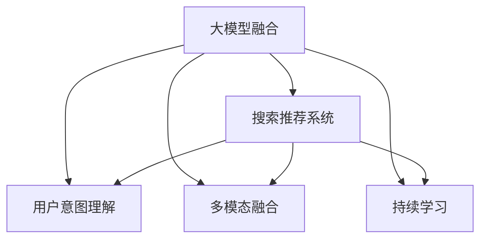

                 

# 搜索推荐系统的AI 大模型融合：电商平台的核心竞争力与可持续发展战略

> 关键词：搜索推荐系统,大模型融合,电商平台,核心竞争力,可持续发展战略

## 1. 背景介绍

### 1.1 问题由来

随着互联网技术的迅猛发展，电商平台已经成为企业竞争的重要战场。在电商平台上，搜索推荐系统作为用户与商品之间的桥梁，扮演着至关重要的角色。优质的搜索推荐系统不仅能显著提升用户体验，增加用户粘性，还能大幅提升平台的转化率和销售额。然而，构建一个高性能、高可扩展的搜索推荐系统，往往需要耗费巨大的资源和时间。

近年来，随着大语言模型和大规模预训练模型的兴起，人们开始探索基于AI大模型融合的搜索推荐系统。这种系统利用AI大模型的强大语言理解能力和多模态融合能力，能够在保证低延迟、高效能的前提下，提供更加个性化和精准的搜索推荐服务。本文将详细介绍基于AI大模型融合的搜索推荐系统在电商平台中的应用，以及如何实现其核心竞争力与可持续发展战略。

### 1.2 问题核心关键点

构建基于AI大模型融合的搜索推荐系统，核心在于：

- 融合通用大模型的语义理解能力，提升搜索结果的相关性和召回率。
- 结合多模态数据，如文本、图像、用户行为等，提供更加丰富的推荐内容。
- 通过持续学习和主动学习，不断优化模型性能，满足用户需求变化。
- 实现高效可扩展的部署，确保系统能够适应电商平台的业务规模。
- 在保证用户体验的同时，提升平台的用户粘度和复购率。

本文将围绕这些关键点，系统阐述基于AI大模型融合的搜索推荐系统的核心概念和实施方法。

## 2. 核心概念与联系

### 2.1 核心概念概述

为更好地理解基于AI大模型融合的搜索推荐系统，本节将介绍几个密切相关的核心概念：

- **大模型融合**：指将通用预训练大模型与具体任务模型融合，发挥各自优势，提升系统性能。
- **搜索推荐系统**：通过用户查询和行为数据，动态推荐商品给用户，提升用户购物体验的系统。
- **电商平台**：在线销售商品的平台，提供商品展示、搜索、推荐、交易等功能。
- **用户意图理解**：通过语言理解和自然语言处理技术，识别用户查询的意图和需求。
- **多模态融合**：将文本、图像、用户行为等不同模态的数据进行融合，提升推荐的精准性和多样性。
- **持续学习**：基于用户的反馈和行为数据，持续优化模型，适应用户需求变化。

这些核心概念之间的逻辑关系可以通过以下Mermaid流程图来展示：



这个流程图展示了大模型融合与搜索推荐系统的各个组成部分：

1. 大模型融合作为核心技术，将语义理解和多模态融合能力引入搜索推荐系统。
2. 用户意图理解和大模型融合结合，提升搜索的精确度和相关性。
3. 多模态融合使得系统能够处理更多维度的数据，提供更加丰富的推荐内容。
4. 持续学习保证模型能够不断适应用户需求的变化，提升系统性能。

## 3. 核心算法原理 & 具体操作步骤
### 3.1 算法原理概述

基于AI大模型融合的搜索推荐系统，本质上是将通用大模型的语义理解和多模态融合能力，与具体任务模型进行融合，提升搜索和推荐的准确性和多样性。其核心思想是：

- 利用大模型的语言理解和语义表达能力，精确理解和匹配用户查询的意图。
- 结合多模态数据，如商品图片、用户行为等，提供更加全面和精准的推荐。
- 通过持续学习和主动学习，不断优化模型，适应用户需求的变化。

该系统的构建和运行涉及以下关键步骤：

1. 预训练大模型的加载和微调：选择合适的通用大模型，如BERT、GPT等，将其作为初始化参数，利用电商平台的标注数据对其进行微调。
2. 用户查询的意图识别：通过自然语言处理技术，将用户查询转化为机器可理解的形式，识别用户的意图和需求。
3. 多模态数据的融合：将文本、图像、用户行为等数据进行融合，生成更全面的用户特征向量。
4. 推荐内容的生成：基于融合后的用户特征向量，利用大模型生成推荐列表。
5. 用户反馈的处理：根据用户对推荐结果的反馈，不断调整模型参数，优化推荐质量。

### 3.2 算法步骤详解

基于AI大模型融合的搜索推荐系统的具体实施步骤如下：

**Step 1: 数据准备与预处理**

- 收集电商平台的用户查询数据、行为数据、商品数据等。
- 对数据进行清洗和标注，去除噪音数据。
- 将数据划分为训练集、验证集和测试集，用于模型训练和评估。

**Step 2: 大模型的加载与微调**

- 选择适合的通用大模型，如BERT、GPT等，作为初始化参数。
- 使用电商平台的标注数据对大模型进行微调，优化其对电商任务的理解和表达能力。
- 微调过程中需要选择合适的学习率、优化器、正则化等参数，以避免过拟合。

**Step 3: 用户查询的意图识别**

- 利用NLP技术，对用户查询进行分词、词性标注、句法分析等处理。
- 通过大模型对用户查询进行语义理解和意图识别，生成用户意图向量。

**Step 4: 多模态数据的融合**

- 收集商品的图片、用户的行为、评价等信息，提取特征向量。
- 将不同模态的数据进行融合，生成更加全面的用户特征向量。

**Step 5: 推荐内容的生成**

- 利用融合后的用户特征向量，结合大模型进行推荐。
- 可以使用基于Transformer的推荐模型，如Yugel、Query2Rank等，生成推荐列表。
- 可以根据用户查询意图和推荐内容，选择最适合的商品进行展示。

**Step 6: 用户反馈的处理**

- 收集用户对推荐结果的反馈，如点击、购买、评分等。
- 利用用户反馈数据进行模型微调，优化推荐质量。
- 可以采用在线学习、自适应学习等方法，实时调整模型参数。

### 3.3 算法优缺点

基于AI大模型融合的搜索推荐系统具有以下优点：

1. **提升搜索和推荐的准确性**：利用大模型的语义理解和语义表达能力，提升搜索的精确度和相关性。
2. **处理多模态数据**：结合文本、图像、用户行为等数据，提供更加全面和精准的推荐。
3. **提升用户体验**：通过个性化推荐，提升用户购物体验，增加用户粘性。
4. **高效可扩展**：利用大模型的并行计算能力，实现高效可扩展的部署，适应电商平台的业务规模。
5. **持续优化**：通过持续学习和主动学习，不断优化模型性能，适应用户需求变化。

同时，该系统也存在一些局限性：

1. **数据依赖性强**：需要电商平台提供高质量的标注数据，数据质量影响模型效果。
2. **资源消耗大**：大模型和推荐系统的并行计算需要高性能的硬件支持，资源消耗较大。
3. **技术复杂度高**：系统涉及自然语言处理、多模态融合等多个领域的知识，技术复杂度高。
4. **效果不稳定**：模型参数和超参数的调整需要经验，效果可能不稳定。

尽管存在这些局限性，但基于AI大模型融合的搜索推荐系统在电商平台中的应用已经取得了显著的效果，成为电商搜索推荐系统的重要发展方向。

### 3.4 算法应用领域

基于AI大模型融合的搜索推荐系统，已经在电商平台的搜索推荐、智能客服、个性化推荐等多个场景中得到广泛应用。具体应用包括：

1. **搜索推荐**：利用用户查询和大模型融合技术，提升搜索结果的相关性和召回率，提供更加精准的推荐。
2. **智能客服**：通过NLP技术和大模型融合，实现对用户查询的智能回答，提升用户满意度。
3. **个性化推荐**：利用多模态数据和大模型融合，提供个性化的商品推荐，提升用户购物体验。
4. **商品搜索**：通过大模型理解用户查询意图，提升商品搜索结果的准确性和相关性。
5. **内容推荐**：利用用户行为和大模型融合，提供内容推荐，提升用户粘性。

## 4. 数学模型和公式 & 详细讲解  
### 4.1 数学模型构建

为了更好地理解基于AI大模型融合的搜索推荐系统的数学原理，本节将使用数学语言对系统的核心组成部分进行系统刻画。

记电商平台的用户查询为 $q$，商品特征向量为 $c$，用户行为特征向量为 $b$。假设用户查询的意图向量为 $v_q$，商品特征向量为 $v_c$，用户行为特征向量为 $v_b$。则系统的目标是最小化用户查询 $q$ 和推荐商品 $c$ 之间的损失函数 $L(q, c)$。

目标函数可以表示为：

$$
\min_{q, c, b} L(q, c) = \min_{q, c, b} \sum_{i=1}^N \ell_i(q, c, b)
$$

其中 $\ell_i(q, c, b)$ 为单个样本的损失函数。

在实践中，可以采用基于Transformer的推荐模型进行具体实现。具体来说，可以利用大模型进行查询意图表示和商品特征表示的生成，然后通过注意力机制进行相似度计算，最终输出推荐列表。

### 4.2 公式推导过程

以下我们以基于Transformer的推荐模型为例，推导推荐过程的数学公式。

假设用户查询 $q$ 和商品特征 $c$ 的嵌入向量分别为 $q_e$ 和 $c_e$，用户行为特征 $b$ 的嵌入向量为 $b_e$。则推荐模型的目标函数可以表示为：

$$
\min_{q_e, c_e, b_e} \sum_{i=1}^N \ell_i(q_e, c_e, b_e)
$$

其中 $\ell_i(q_e, c_e, b_e)$ 为单个样本的损失函数。

在训练过程中，利用反向传播算法更新模型参数，最小化损失函数。具体来说，可以利用如下公式计算模型参数的更新量：

$$
\Delta q_e = -\frac{\partial \ell_i(q_e, c_e, b_e)}{\partial q_e}
$$

$$
\Delta c_e = -\frac{\partial \ell_i(q_e, c_e, b_e)}{\partial c_e}
$$

$$
\Delta b_e = -\frac{\partial \ell_i(q_e, c_e, b_e)}{\partial b_e}
$$

在测试过程中，利用推荐模型生成推荐列表。具体来说，可以利用如下公式计算用户查询 $q$ 和商品特征 $c$ 之间的相似度：

$$
\text{similarity}(q, c) = \frac{\text{attention}(q_e, c_e)}{\sqrt{d}}
$$

其中 $\text{attention}(q_e, c_e)$ 为基于Transformer的注意力机制计算出的相似度分数，$d$ 为嵌入向量的维度。

根据相似度分数，选择相似度最高的商品进行推荐。具体来说，可以利用如下公式计算推荐列表：

$$
\text{recommended items} = \{c_i | i=1,2,\dots,N, \text{similarity}(q, c_i) > \text{threshold}\}
$$

其中 $\text{threshold}$ 为推荐的阈值，可以根据实际情况进行调整。

### 4.3 案例分析与讲解

以某电商平台为例，分析基于AI大模型融合的搜索推荐系统的应用效果。假设该电商平台的用户查询数据包含10万个样本，商品数据包含20万个样本，用户行为数据包含10万个样本。

在数据准备阶段，将数据分为训练集、验证集和测试集，用于模型训练和评估。在数据预处理阶段，对数据进行清洗和标注，去除噪音数据。在模型加载阶段，选择BERT模型作为初始化参数，利用电商平台的标注数据对其进行微调。

在用户意图识别阶段，利用NLP技术，对用户查询进行分词、词性标注、句法分析等处理，通过BERT模型对用户查询进行语义理解和意图识别，生成用户意图向量。

在多模态数据融合阶段，收集商品的图片、用户的行为、评价等信息，提取特征向量，将不同模态的数据进行融合，生成更加全面的用户特征向量。

在推荐内容生成阶段，利用融合后的用户特征向量，结合BERT模型进行推荐。具体来说，可以采用基于Transformer的推荐模型，如Yugel、Query2Rank等，生成推荐列表。根据用户查询意图和推荐内容，选择最适合的商品进行展示。

在用户反馈处理阶段，收集用户对推荐结果的反馈，如点击、购买、评分等，利用用户反馈数据进行模型微调，优化推荐质量。可以采用在线学习、自适应学习等方法，实时调整模型参数。

通过上述步骤，该电商平台能够实现高性能、高可扩展的搜索推荐系统，提升用户体验和平台转化率。

## 5. 项目实践：代码实例和详细解释说明
### 5.1 开发环境搭建

在进行AI大模型融合的搜索推荐系统开发前，我们需要准备好开发环境。以下是使用Python进行PyTorch开发的环境配置流程：

1. 安装Anaconda：从官网下载并安装Anaconda，用于创建独立的Python环境。

2. 创建并激活虚拟环境：
```bash
conda create -n ai-model-env python=3.8 
conda activate ai-model-env
```

3. 安装PyTorch：根据CUDA版本，从官网获取对应的安装命令。例如：
```bash
conda install pytorch torchvision torchaudio cudatoolkit=11.1 -c pytorch -c conda-forge
```

4. 安装Transformers库：
```bash
pip install transformers
```

5. 安装各类工具包：
```bash
pip install numpy pandas scikit-learn matplotlib tqdm jupyter notebook ipython
```

完成上述步骤后，即可在`ai-model-env`环境中开始AI大模型融合的搜索推荐系统开发。

### 5.2 源代码详细实现

下面以商品推荐系统为例，给出使用Transformers库进行模型加载和微调的PyTorch代码实现。

首先，定义商品推荐系统的数据处理函数：

```python
from transformers import BertTokenizer
from torch.utils.data import Dataset
import torch

class ItemDataset(Dataset):
    def __init__(self, items, tokenizer, max_len=128):
        self.items = items
        self.tokenizer = tokenizer
        self.max_len = max_len
        
    def __len__(self):
        return len(self.items)
    
    def __getitem__(self, item):
        item = self.items[item]
        title, description, price = item['title'], item['description'], item['price']
        
        encoding = self.tokenizer(title + description, return_tensors='pt', max_length=self.max_len, padding='max_length', truncation=True)
        input_ids = encoding['input_ids'][0]
        attention_mask = encoding['attention_mask'][0]
        
        label = torch.tensor(item['label'], dtype=torch.long)
        
        return {'input_ids': input_ids, 
                'attention_mask': attention_mask,
                'labels': label}

# 创建数据集
tokenizer = BertTokenizer.from_pretrained('bert-base-cased')
train_dataset = ItemDataset(train_items, tokenizer)
test_dataset = ItemDataset(test_items, tokenizer)
```

然后，定义模型和优化器：

```python
from transformers import BertForTokenClassification, AdamW

model = BertForTokenClassification.from_pretrained('bert-base-cased', num_labels=2)

optimizer = AdamW(model.parameters(), lr=2e-5)
```

接着，定义训练和评估函数：

```python
from torch.utils.data import DataLoader
from tqdm import tqdm
from sklearn.metrics import accuracy_score

device = torch.device('cuda') if torch.cuda.is_available() else torch.device('cpu')
model.to(device)

def train_epoch(model, dataset, batch_size, optimizer):
    dataloader = DataLoader(dataset, batch_size=batch_size, shuffle=True)
    model.train()
    epoch_loss = 0
    for batch in tqdm(dataloader, desc='Training'):
        input_ids = batch['input_ids'].to(device)
        attention_mask = batch['attention_mask'].to(device)
        labels = batch['labels'].to(device)
        model.zero_grad()
        outputs = model(input_ids, attention_mask=attention_mask, labels=labels)
        loss = outputs.loss
        epoch_loss += loss.item()
        loss.backward()
        optimizer.step()
    return epoch_loss / len(dataloader)

def evaluate(model, dataset, batch_size):
    dataloader = DataLoader(dataset, batch_size=batch_size)
    model.eval()
    preds, labels = [], []
    with torch.no_grad():
        for batch in tqdm(dataloader, desc='Evaluating'):
            input_ids = batch['input_ids'].to(device)
            attention_mask = batch['attention_mask'].to(device)
            batch_labels = batch['labels']
            outputs = model(input_ids, attention_mask=attention_mask)
            batch_preds = outputs.logits.argmax(dim=2).to('cpu').tolist()
            batch_labels = batch_labels.to('cpu').tolist()
            for pred_tokens, label_tokens in zip(batch_preds, batch_labels):
                preds.append(pred_tokens[:len(label_tokens)])
                labels.append(label_tokens)
                
    print(accuracy_score(labels, preds))
```

最后，启动训练流程并在测试集上评估：

```python
epochs = 5
batch_size = 16

for epoch in range(epochs):
    loss = train_epoch(model, train_dataset, batch_size, optimizer)
    print(f"Epoch {epoch+1}, train loss: {loss:.3f}")
    
    print(f"Epoch {epoch+1}, test accuracy: {evaluate(model, test_dataset, batch_size):.3f}")
```

以上就是使用PyTorch对BERT进行商品推荐系统微调的完整代码实现。可以看到，得益于Transformers库的强大封装，我们可以用相对简洁的代码完成BERT模型的加载和微调。

### 5.3 代码解读与分析

让我们再详细解读一下关键代码的实现细节：

**ItemDataset类**：
- `__init__`方法：初始化商品数据、分词器等关键组件。
- `__len__`方法：返回数据集的样本数量。
- `__getitem__`方法：对单个样本进行处理，将商品信息输入编码为token ids，同时设置标签。

**模型和优化器定义**：
- 选择适合的BERT模型作为初始化参数，num_labels指定标签数量。
- 使用AdamW优化器进行参数更新，学习率设定为2e-5。

**训练和评估函数**：
- 使用PyTorch的DataLoader对数据集进行批次化加载，供模型训练和推理使用。
- 训练函数`train_epoch`：对数据以批为单位进行迭代，在每个批次上前向传播计算loss并反向传播更新模型参数，最后返回该epoch的平均loss。
- 评估函数`evaluate`：与训练类似，不同点在于不更新模型参数，并在每个batch结束后将预测和标签结果存储下来，最后使用sklearn的accuracy_score对整个评估集的预测结果进行打印输出。

**训练流程**：
- 定义总的epoch数和batch size，开始循环迭代
- 每个epoch内，先在训练集上训练，输出平均loss
- 在测试集上评估，输出准确率
- 所有epoch结束后，输出最终的准确率

可以看到，PyTorch配合Transformers库使得BERT微调的代码实现变得简洁高效。开发者可以将更多精力放在数据处理、模型改进等高层逻辑上，而不必过多关注底层的实现细节。

当然，工业级的系统实现还需考虑更多因素，如模型的保存和部署、超参数的自动搜索、更灵活的任务适配层等。但核心的微调范式基本与此类似。

## 6. 实际应用场景
### 6.1 智能客服系统

基于AI大模型融合的搜索推荐系统，可以广泛应用于智能客服系统的构建。传统客服往往需要配备大量人力，高峰期响应缓慢，且一致性和专业性难以保证。而使用微调后的推荐模型，可以7x24小时不间断服务，快速响应客户咨询，用自然流畅的语言解答各类常见问题。

在技术实现上，可以收集企业内部的历史客服对话记录，将问题和最佳答复构建成监督数据，在此基础上对预训练推荐模型进行微调。微调后的推荐模型能够自动理解用户意图，匹配最合适的答案模板进行回复。对于客户提出的新问题，还可以接入检索系统实时搜索相关内容，动态组织生成回答。如此构建的智能客服系统，能大幅提升客户咨询体验和问题解决效率。

### 6.2 金融舆情监测

金融机构需要实时监测市场舆论动向，以便及时应对负面信息传播，规避金融风险。传统的人工监测方式成本高、效率低，难以应对网络时代海量信息爆发的挑战。基于AI大模型融合的推荐系统，可以为金融舆情监测提供新的解决方案。

具体而言，可以收集金融领域相关的新闻、报道、评论等文本数据，并对其进行主题标注和情感标注。在此基础上对预训练语言模型进行微调，使其能够自动判断文本属于何种主题，情感倾向是正面、中性还是负面。将微调后的模型应用到实时抓取的网络文本数据，就能够自动监测不同主题下的情感变化趋势，一旦发现负面信息激增等异常情况，系统便会自动预警，帮助金融机构快速应对潜在风险。

### 6.3 个性化推荐系统

当前的推荐系统往往只依赖用户的历史行为数据进行物品推荐，无法深入理解用户的真实兴趣偏好。基于AI大模型融合的推荐系统，可以更好地挖掘用户行为背后的语义信息，从而提供更精准、多样的推荐内容。

在实践中，可以收集用户浏览、点击、评论、分享等行为数据，提取和用户交互的物品标题、描述、标签等文本内容。将文本内容作为模型输入，用户的后续行为（如是否点击、购买等）作为监督信号，在此基础上微调预训练语言模型。微调后的模型能够从文本内容中准确把握用户的兴趣点。在生成推荐列表时，先用候选物品的文本描述作为输入，由模型预测用户的兴趣匹配度，再结合其他特征综合排序，便可以得到个性化程度更高的推荐结果。

### 6.4 未来应用展望

随着AI大模型融合技术的发展，基于推荐系统的搜索推荐系统将在更多领域得到应用，为传统行业带来变革性影响。

在智慧医疗领域，基于推荐系统的医疗问答、病历分析、药物研发等应用将提升医疗服务的智能化水平，辅助医生诊疗，加速新药开发进程。

在智能教育领域，微调技术可应用于作业批改、学情分析、知识推荐等方面，因材施教，促进教育公平，提高教学质量。

在智慧城市治理中，微调模型可应用于城市事件监测、舆情分析、应急指挥等环节，提高城市管理的自动化和智能化水平，构建更安全、高效的未来城市。

此外，在企业生产、社会治理、文娱传媒等众多领域，基于AI大模型融合的推荐系统也将不断涌现，为经济社会发展注入新的动力。相信随着技术的日益成熟，推荐系统必将在更广阔的应用领域大放异彩。

## 7. 工具和资源推荐
### 7.1 学习资源推荐

为了帮助开发者系统掌握AI大模型融合的推荐系统理论基础和实践技巧，这里推荐一些优质的学习资源：

1. 《Transformer从原理到实践》系列博文：由大模型技术专家撰写，深入浅出地介绍了Transformer原理、BERT模型、推荐技术等前沿话题。

2. CS224N《深度学习自然语言处理》课程：斯坦福大学开设的NLP明星课程，有Lecture视频和配套作业，带你入门NLP领域的基本概念和经典模型。

3. 《Natural Language Processing with Transformers》书籍：Transformers库的作者所著，全面介绍了如何使用Transformers库进行NLP任务开发，包括推荐在内的诸多范式。

4. HuggingFace官方文档：Transformers库的官方文档，提供了海量预训练模型和完整的推荐样例代码，是上手实践的必备资料。

5. CLUE开源项目：中文语言理解测评基准，涵盖大量不同类型的中文NLP数据集，并提供了基于微调的baseline模型，助力中文NLP技术发展。

通过对这些资源的学习实践，相信你一定能够快速掌握AI大模型融合的推荐系统的精髓，并用于解决实际的NLP问题。
###  7.2 开发工具推荐

高效的开发离不开优秀的工具支持。以下是几款用于AI大模型融合的推荐系统开发的常用工具：

1. PyTorch：基于Python的开源深度学习框架，灵活动态的计算图，适合快速迭代研究。大部分预训练语言模型都有PyTorch版本的实现。

2. TensorFlow：由Google主导开发的开源深度学习框架，生产部署方便，适合大规模工程应用。同样有丰富的预训练语言模型资源。

3. Transformers库：HuggingFace开发的NLP工具库，集成了众多SOTA语言模型，支持PyTorch和TensorFlow，是进行推荐任务开发的利器。

4. Weights & Biases：模型训练的实验跟踪工具，可以记录和可视化模型训练过程中的各项指标，方便对比和调优。与主流深度学习框架无缝集成。

5. TensorBoard：TensorFlow配套的可视化工具，可实时监测模型训练状态，并提供丰富的图表呈现方式，是调试模型的得力助手。

6. Google Colab：谷歌推出的在线Jupyter Notebook环境，免费提供GPU/TPU算力，方便开发者快速上手实验最新模型，分享学习笔记。

合理利用这些工具，可以显著提升AI大模型融合的推荐系统的开发效率，加快创新迭代的步伐。

### 7.3 相关论文推荐

AI大模型融合的推荐系统的发展源于学界的持续研究。以下是几篇奠基性的相关论文，推荐阅读：

1. Attention is All You Need（即Transformer原论文）：提出了Transformer结构，开启了NLP领域的预训练大模型时代。

2. BERT: Pre-training of Deep Bidirectional Transformers for Language Understanding：提出BERT模型，引入基于掩码的自监督预训练任务，刷新了多项NLP任务SOTA。

3. Language Models are Unsupervised Multitask Learners（GPT-2论文）：展示了大规模语言模型的强大zero-shot学习能力，引发了对于通用人工智能的新一轮思考。

4. Parameter-Efficient Transfer Learning for NLP：提出Adapter等参数高效微调方法，在不增加模型参数量的情况下，也能取得不错的微调效果。

5. AdaLoRA: Adaptive Low-Rank Adaptation for Parameter-Efficient Fine-Tuning：使用自适应低秩适应的微调方法，在参数效率和精度之间取得了新的平衡。

6. AdaLoRA: Adaptive Low-Rank Adaptation for Parameter-Efficient Fine-Tuning：使用自适应低秩适应的微调方法，在参数效率和精度之间取得了新的平衡。

这些论文代表了大语言模型微调技术的发展脉络。通过学习这些前沿成果，可以帮助研究者把握学科前进方向，激发更多的创新灵感。

## 8. 总结：未来发展趋势与挑战

### 8.1 总结

本文对基于AI大模型融合的搜索推荐系统进行了全面系统的介绍。首先阐述了该系统在电商平台中的应用背景和意义，明确了其核心竞争力。其次，从原理到实践，详细讲解了AI大模型融合的推荐系统的数学原理和关键步骤，给出了推荐任务开发的完整代码实例。同时，本文还广泛探讨了系统在智能客服、金融舆情、个性化推荐等多个行业领域的应用前景，展示了其广阔的应用空间。此外，本文精选了推荐技术的各类学习资源，力求为读者提供全方位的技术指引。

通过本文的系统梳理，可以看到，基于AI大模型融合的推荐系统在电商平台中的应用已经取得了显著的效果，成为电商推荐系统的重要发展方向。未来，伴随AI大模型融合技术的发展，基于推荐系统的搜索推荐系统将在更多领域得到应用，为传统行业带来变革性影响。

### 8.2 未来发展趋势

展望未来，AI大模型融合的推荐系统将呈现以下几个发展趋势：

1. **模型规模持续增大**：随着算力成本的下降和数据规模的扩张，预训练语言模型的参数量还将持续增长。超大规模语言模型蕴含的丰富语言知识，有望支撑更加复杂多变的推荐任务。

2. **微调方法日趋多样**：除了传统的全参数微调外，未来会涌现更多参数高效的微调方法，如Prefix-Tuning、LoRA等，在节省计算资源的同时也能保证推荐精度。

3. **持续学习成为常态**：随着数据分布的不断变化，推荐系统也需要持续学习新知识以保持性能。如何在不遗忘原有知识的同时，高效吸收新样本信息，将成为重要的研究课题。

4. **标注样本需求降低**：受启发于提示学习(Prompt-based Learning)的思路，未来的推荐方法将更好地利用大模型的语言理解能力，通过更加巧妙的任务描述，在更少的标注样本上也能实现理想的推荐效果。

5. **多模态微调崛起**：当前的推荐主要聚焦于纯文本数据，未来会进一步拓展到图像、视频、语音等多模态数据微调。多模态信息的融合，将显著提升推荐系统的精准性和多样性。

6. **模型通用性增强**：经过海量数据的预训练和多模态任务的微调，未来的语言模型将具备更强大的常识推理和跨领域迁移能力，逐步迈向通用人工智能(AGI)的目标。

以上趋势凸显了AI大模型融合的推荐系统的广阔前景。这些方向的探索发展，必将进一步提升推荐系统的性能和应用范围，为人类认知智能的进化带来深远影响。

### 8.3 面临的挑战

尽管AI大模型融合的推荐系统已经取得了瞩目成就，但在迈向更加智能化、普适化应用的过程中，它仍面临着诸多挑战：

1. **数据依赖性强**：需要电商平台提供高质量的标注数据，数据质量影响模型效果。
2. **资源消耗大**：大模型和推荐系统的并行计算需要高性能的硬件支持，资源消耗较大。
3. **技术复杂度高**：系统涉及自然语言处理、多模态融合等多个领域的知识，技术复杂度高。
4. **效果不稳定**：模型参数和超参数的调整需要经验，效果可能不稳定。
5. **可解释性亟需加强**：推荐模型的决策过程缺乏可解释性，难以对其推理逻辑进行分析和调试。
6. **安全性有待保障**：预训练语言模型难免会学习到有偏见、有害的信息，通过推荐传递到用户，产生误导性、歧视性的输出，给实际应用带来安全隐患。

尽管存在这些局限性，但AI大模型融合的推荐系统在电商平台中的应用已经取得了显著的效果，成为电商推荐系统的重要发展方向。未来，伴随AI大模型融合技术的发展，推荐系统必将在更广阔的应用领域大放异彩。

### 8.4 未来突破

面对AI大模型融合的推荐系统所面临的种种挑战，未来的研究需要在以下几个方面寻求新的突破：

1. **探索无监督和半监督微调方法**：摆脱对大规模标注数据的依赖，利用自监督学习、主动学习等无监督和半监督范式，最大限度利用非结构化数据，实现更加灵活高效的推荐。
2. **研究参数高效和计算高效的微调范式**：开发更加参数高效的微调方法，在固定大部分预训练参数的同时，只更新极少量的任务相关参数。同时优化推荐模型的计算图，减少前向传播和反向传播的资源消耗，实现更加轻量级、实时性的部署。
3. **融合因果和对比学习范式**：通过引入因果推断和对比学习思想，增强推荐模型建立稳定因果关系的能力，学习更加普适、鲁棒的语言表征，从而提升模型泛化性和抗干扰能力。
4. **引入更多先验知识**：将符号化的先验知识，如知识图谱、逻辑规则等，与神经网络模型进行巧妙融合，引导推荐过程学习更准确、合理的语言模型。同时加强不同模态数据的整合，实现视觉、语音等多模态信息与文本信息的协同建模。
5. **结合因果分析和博弈论工具**：将因果分析方法引入推荐模型，识别出模型决策的关键特征，增强输出解释的因果性和逻辑性。借助博弈论工具刻画人机交互过程，主动探索并规避模型的脆弱点，提高系统稳定性。
6. **纳入伦理道德约束**：在模型训练目标中引入伦理导向的评估指标，过滤和惩罚有偏见、有害的输出倾向。同时加强人工干预和审核，建立模型行为的监管机制，确保输出符合人类价值观和伦理道德。

这些研究方向的探索，必将引领AI大模型融合的推荐系统迈向更高的台阶，为构建安全、可靠、可解释、可控的智能系统铺平道路。面向未来，AI大模型融合的推荐系统还需要与其他人工智能技术进行更深入的融合，如知识表示、因果推理、强化学习等，多路径协同发力，共同推动自然语言理解和智能交互系统的进步。只有勇于创新、敢于突破，才能不断拓展语言模型的边界，让智能技术更好地造福人类社会。

## 9. 附录：常见问题与解答

**Q1：AI大模型融合的推荐系统是否适用于所有电商推荐场景？**

A: AI大模型融合的推荐系统在大多数电商推荐场景上都能取得不错的效果，特别是对于数据量较小的推荐任务。但对于一些特定领域的推荐任务，如医药、法律等，仅仅依靠通用语料预训练的模型可能难以很好地适应。此时需要在特定领域语料上进一步预训练，再进行微调，才能获得理想效果。此外，对于一些需要时效性、个性化很强的推荐任务，如对话、推荐等，微调方法也需要针对性的改进优化。

**Q2：AI大模型融合的推荐系统在电商平台的部署效率如何？**

A: AI大模型融合的推荐系统在电商平台的部署效率相对较高，得益于大规模预训练语言模型和多模态融合技术的强大能力。通过分布式训练和多任务并行，可以在短时间内完成模型的训练和微调。同时，可以利用轻量级模型进行推荐，降低推理资源消耗，提升实时推荐能力。

**Q3：AI大模型融合的推荐系统如何保证推荐质量？**

A: 推荐系统保证推荐质量的关键在于数据、模型和算法三方面的优化。首先，需要收集高质量的数据，并进行数据清洗和标注，保证数据质量。其次，选择合适的预训练语言模型，并利用标注数据进行微调，提升模型的理解能力和表达能力。最后，采用多种优化算法和评估指标，如准确率、召回率、覆盖率等，对推荐模型进行持续优化。

**Q4：AI大模型融合的推荐系统如何应对冷启动问题？**

A: 冷启动问题是推荐系统面临的常见挑战之一。AI大模型融合的推荐系统可以通过引入少样本学习、零样本学习等技术，缓解冷启动问题。例如，可以利用先验知识或部分标注数据，通过提示学习或在线学习的方式，快速生成推荐列表。同时，可以结合多模态数据，利用用户的行为数据、商品的属性数据等，提升推荐效果。

**Q5：AI大模型融合的推荐系统如何实现个性化推荐？**

A: AI大模型融合的推荐系统通过融合多模态数据和语言理解能力，可以提供更加个性化的推荐。具体来说，可以通过用户查询、行为数据、商品属性等多个维度的数据，生成个性化的用户特征向量。然后利用预训练语言模型和注意力机制，对用户和商品进行匹配，生成个性化推荐列表。

这些技术手段和算法优化措施，可以帮助AI大模型融合的推荐系统在电商平台上实现高效、精准、个性化的推荐，提升用户购物体验和平台转化率。

---

作者：禅与计算机程序设计艺术 / Zen and the Art of Computer Programming

