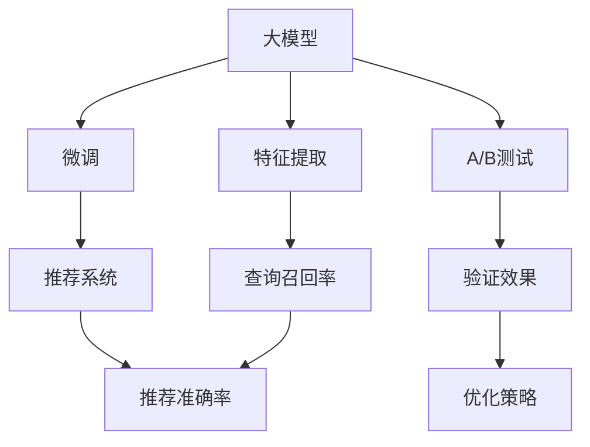

                 

# 搜索推荐系统的A/B测试：大模型时代的新方法

## 1. 背景介绍

随着互联网的普及和数据技术的进步，搜索推荐系统已经成为各大互联网公司不可或缺的核心应用。搜索推荐系统的目标是快速响应用户的查询和浏览需求，为用户提供精准的搜索结果和个性化的推荐内容，从而提升用户体验和公司的商业价值。

传统的搜索推荐系统主要依赖于基于统计和机器学习的模型，如协同过滤、矩阵分解、深度学习等。然而，这些方法往往依赖于海量的用户行为数据和复杂的参数调优，难以快速迭代优化，难以应对用户需求的多样性和动态性。

近年来，基于大模型的搜索推荐系统逐渐成为行业的新宠。大模型通过预训练和微调的方式，在大规模数据集上进行学习，具备强大的泛化能力和语言理解能力，能够更准确地捕捉用户需求和内容特征，从而提供更优质的搜索结果和推荐内容。

基于大模型的搜索推荐系统，已经在电商、新闻、视频等多个领域得到了广泛应用，取得了显著的效果。例如，谷歌的BERT被集成到其搜索引擎中，显著提升了搜索准确率和用户体验。京东利用大模型进行商品推荐，通过细粒度的上下文理解，大幅提升了推荐效果和用户满意度。

然而，大模型虽然强大，但同时也面临着诸如模型复杂度、计算成本高昂、推理速度慢等问题。如何在大模型时代，更高效地进行搜索推荐系统的A/B测试，验证模型效果和优化搜索推荐策略，成为一个亟待解决的问题。

## 2. 核心概念与联系

### 2.1 核心概念概述

为更好地理解基于大模型的搜索推荐系统的A/B测试方法，本节将介绍几个密切相关的核心概念：

- 大模型(Large Model)：指在特定领域数据上进行预训练，并应用于搜索推荐等任务的深度学习模型。常见的有BERT、GPT-2、T5等。

- 微调(Fine-Tuning)：指在大模型基础上，针对特定领域进行有监督学习，以提升模型在该领域上的表现。

- 特征提取(Feature Extraction)：指从输入数据中提取出对输出有用的特征信息，从而提高模型的预测精度。

- A/B测试(A/B Testing)：指通过比较两个或多个版本的产品或服务，评估其效果差异，从而优化产品策略的一种方法。

- 推荐系统(Recommendation System)：指根据用户的历史行为和偏好，预测用户可能感兴趣的内容，进行个性化推荐的技术。

- 查询召回率(Query Recall)：指系统返回的搜索结果中，有多少是用户真正感兴趣的。

- 推荐准确率(Recommendation Accuracy)：指推荐结果与用户实际行为的一致性程度。

这些核心概念之间的逻辑关系可以通过以下Mermaid流程图来展示：



这个流程图展示了大模型、微调、特征提取、推荐系统、查询召回率和推荐准确率之间的核心关系：

1. 大模型通过预训练学习到泛化的语言知识和特征表示。
2. 微调使得模型进一步适配特定领域的用户需求和内容特征。
3. 特征提取提取出对推荐有用的信息，提高推荐效果。
4. 推荐系统基于模型预测和特征提取结果，进行个性化推荐。
5. 查询召回率和推荐准确率是评估推荐系统效果的重要指标。
6. A/B测试用于验证不同推荐策略的效果，优化搜索推荐系统。

这些概念共同构成了大模型时代搜索推荐系统的核心工作流程，从而实现高效、精准的推荐和搜索服务。

## 3. 核心算法原理 & 具体操作步骤
### 3.1 算法原理概述

基于大模型的搜索推荐系统的A/B测试，本质上是一种利用大模型的泛化能力，通过小样本数据验证和优化推荐策略的方法。其核心思想是：通过收集部分用户的行为数据，在大模型上进行微调，获得针对特定领域的推荐模型，并在A/B测试中验证模型的效果，不断迭代优化。

形式化地，假设用户行为数据为 $D=\{(x_i, y_i)\}_{i=1}^N$，其中 $x_i$ 为用户的查询或浏览行为，$y_i$ 为用户的实际兴趣标签或点击行为。我们希望在大模型 $M_{\theta}$ 上学习一个推荐模型 $R$，使得模型输出 $\hat{y}$ 尽可能逼近真实标签 $y$。在测试阶段，我们将用户的查询或浏览行为 $x$ 输入到模型 $M_{\theta}$ 中，得到推荐结果 $\hat{y}$，并根据A/B测试结果优化模型。

### 3.2 算法步骤详解

基于大模型的搜索推荐系统的A/B测试一般包括以下几个关键步骤：

**Step 1: 准备数据集和模型**

- 收集用户行为数据 $D$，包括查询、浏览、点击等行为。
- 选择合适的大模型 $M_{\theta}$，并进行微调。
- 定义推荐模型 $R$，并选择合适的损失函数和评估指标。

**Step 2: 划分数据集**

- 将数据集 $D$ 划分为训练集 $D_{train}$、验证集 $D_{valid}$ 和测试集 $D_{test}$。
- 对训练集进行特征提取，提取出与用户行为相关的特征 $F(x)$。

**Step 3: 训练推荐模型**

- 使用训练集 $D_{train}$ 对模型 $R$ 进行训练，最小化损失函数 $\mathcal{L}(R,F(x))$。
- 在验证集 $D_{valid}$ 上评估模型性能，调整超参数。

**Step 4: 进行A/B测试**

- 使用测试集 $D_{test}$ 对模型 $R$ 进行A/B测试，比较不同推荐策略的效果。
- 根据A/B测试结果，调整推荐策略，并重新训练推荐模型。

**Step 5: 优化搜索推荐系统**

- 根据A/B测试结果，调整搜索推荐系统中的推荐策略和搜索算法。
- 在实际应用中，持续收集用户行为数据，定期重新训练模型，进行A/B测试，不断优化系统性能。

以上是基于大模型的搜索推荐系统的A/B测试的一般流程。在实际应用中，还需要针对具体任务的特点，对各个环节进行优化设计，如改进推荐模型的架构、选择合适的特征提取方法、应用对抗样本提高模型鲁棒性等，以进一步提升系统性能。

### 3.3 算法优缺点

基于大模型的搜索推荐系统的A/B测试方法具有以下优点：

- 泛化能力强。大模型通过在大量数据上预训练，具备较强的泛化能力，能够在不同领域和场景中取得良好的效果。
- 快速迭代。基于小样本数据，大模型可以高效进行微调和A/B测试，加速模型优化。
- 精度高。大模型能够更好地理解用户需求和内容特征，从而提供更加精准的推荐和搜索结果。

同时，该方法也存在一定的局限性：

- 计算成本高。大模型需要大量的计算资源进行预训练和微调，可能难以应对大规模应用。
- 数据需求量大。虽然大模型可以通过微调适应特定领域，但仍然需要大量数据进行训练和测试。
- 模型复杂度高。大模型的复杂度较高，可能存在一定的过拟合风险。
- 推理速度慢。大模型虽然精度高，但在推理阶段耗时较长，难以实时响应。

尽管存在这些局限性，但就目前而言，基于大模型的搜索推荐系统的A/B测试方法仍然是大规模应用的重要手段。未来相关研究的重点在于如何进一步降低计算成本，提高模型推理效率，同时兼顾模型的可解释性和鲁棒性等因素。

### 3.4 算法应用领域

基于大模型的搜索推荐系统的A/B测试方法在以下领域得到了广泛应用：

- 电商推荐：通过A/B测试，优化推荐算法和搜索策略，提升电商平台的转化率和用户体验。
- 新闻推荐：在新闻资讯平台进行A/B测试，评估不同内容推荐策略的效果，提高内容点击率和留存率。
- 视频推荐：在视频流媒体平台进行A/B测试，优化视频推荐算法，提高用户观看时长和满意度。
- 金融投资：在金融投资领域进行A/B测试，优化推荐模型，提高投资策略的准确性和收益。
- 社交网络：在社交网络平台进行A/B测试，优化用户推荐算法，提高用户粘性和活跃度。

除了上述这些经典领域外，大模型在内容创作、广告投放、教育培训等更多场景中，也得到了创新性的应用，为搜索推荐系统的推广提供了新的思路。

## 4. 数学模型和公式 & 详细讲解  
### 4.1 数学模型构建

本节将使用数学语言对基于大模型的搜索推荐系统的A/B测试过程进行更加严格的刻画。

记用户行为数据为 $D=\{(x_i, y_i)\}_{i=1}^N$，其中 $x_i$ 为用户的查询或浏览行为，$y_i$ 为用户的实际兴趣标签或点击行为。假设推荐模型为 $R_{\theta}:\mathcal{X} \rightarrow \mathcal{Y}$，其中 $\mathcal{X}$ 为输入空间，$\mathcal{Y}$ 为输出空间，$\theta \in \mathbb{R}^d$ 为模型参数。

定义推荐模型 $R_{\theta}$ 在数据样本 $(x,y)$ 上的损失函数为 $\ell(R_{\theta}(x),y)$，则在数据集 $D$ 上的经验风险为：

$$
\mathcal{L}(\theta) = \frac{1}{N}\sum_{i=1}^N \ell(R_{\theta}(x_i),y_i)
$$

在测试阶段，将用户的查询或浏览行为 $x$ 输入到模型 $M_{\theta}$ 中，得到推荐结果 $\hat{y}$。根据A/B测试结果，计算推荐策略的评价指标，如查询召回率、推荐准确率等。

### 4.2 公式推导过程

以下我们以电商推荐任务为例，推导推荐模型和A/B测试的数学公式。

假设推荐模型为 $R_{\theta}$，用户在电商平台上查询商品，假设查询结果集为 $C$，每个商品 $c \in C$ 对应的真实点击标签为 $y_c \in \{0,1\}$，其中 $y_c=1$ 表示用户点击了该商品。则电商推荐任务的损失函数可以定义为：

$$
\ell(R_{\theta}(x),y) = -\log(R_{\theta}(x))\sum_{c \in C}y_c + (1 - \log(1 - R_{\theta}(x)))\sum_{c \in C}(1-y_c)
$$

其中 $R_{\theta}(x)$ 表示模型对查询 $x$ 的预测点击概率，该预测值需要在电商平台上进行验证。在测试阶段，将查询 $x$ 输入到模型 $M_{\theta}$ 中，得到推荐结果 $\hat{y}$。根据A/B测试结果，可以计算推荐策略的查询召回率 $P(y|x)$：

$$
P(y|x) = \frac{\sum_{c \in C,y_c=1}R_{\theta}(c|x)}{\sum_{c \in C}R_{\theta}(c|x)}
$$

通过计算不同推荐策略下的查询召回率，选择最优的推荐模型 $R_{\theta}$。

## 5. 项目实践：代码实例和详细解释说明
### 5.1 开发环境搭建

在进行搜索推荐系统的A/B测试前，我们需要准备好开发环境。以下是使用Python进行TensorFlow开发的环境配置流程：

1. 安装Anaconda：从官网下载并安装Anaconda，用于创建独立的Python环境。

2. 创建并激活虚拟环境：
```bash
conda create -n tf-env python=3.8 
conda activate tf-env
```

3. 安装TensorFlow：根据CUDA版本，从官网获取对应的安装命令。例如：
```bash
conda install tensorflow=2.5 -c tensorflow -c conda-forge
```

4. 安装各类工具包：
```bash
pip install numpy pandas scikit-learn matplotlib tqdm jupyter notebook ipython
```

完成上述步骤后，即可在`tf-env`环境中开始搜索推荐系统的A/B测试实践。

### 5.2 源代码详细实现

下面我们以电商推荐任务为例，给出使用TensorFlow进行A/B测试的代码实现。

首先，定义电商推荐任务的损失函数：

```python
import tensorflow as tf
from tensorflow.keras.layers import Input, Dense
from tensorflow.keras.models import Model
from sklearn.metrics import precision_score, recall_score

# 定义电商推荐任务的损失函数
def loss_func(y_true, y_pred):
    return -y_true * tf.math.log(y_pred) + (1 - y_true) * tf.math.log(1 - y_pred)

# 构建电商推荐模型
def build_model(num_features):
    input_layer = Input(shape=(num_features,))
    hidden_layer = Dense(64, activation='relu')(input_layer)
    output_layer = Dense(1, activation='sigmoid')(hidden_layer)
    model = Model(input_layer, output_layer)
    return model

# 加载训练数据
X_train, y_train = load_data('train.csv')
X_test, y_test = load_data('test.csv')
```

然后，定义推荐模型和评估函数：

```python
# 定义电商推荐模型
model = build_model(num_features)
model.compile(loss=loss_func, optimizer='adam', metrics=['accuracy'])

# 训练推荐模型
model.fit(X_train, y_train, batch_size=64, epochs=10)

# 评估推荐模型
y_pred = model.predict(X_test)
precision = precision_score(y_test, y_pred)
recall = recall_score(y_test, y_pred)
print(f'Precision: {precision}, Recall: {recall}')
```

接着，进行A/B测试：

```python
# 准备测试数据
X_test_ab = load_data('test_ab.csv')
X_test_cd = load_data('test_cd.csv')
y_test_ab = load_data('test_ab_labels.csv')
y_test_cd = load_data('test_cd_labels.csv')

# 进行A/B测试
model_ab = build_model(num_features)
model_ab.compile(loss=loss_func, optimizer='adam', metrics=['accuracy'])

model_cd = build_model(num_features)
model_cd.compile(loss=loss_func, optimizer='adam', metrics=['accuracy'])

model_ab.fit(X_test_ab, y_test_ab, batch_size=64, epochs=10)
model_cd.fit(X_test_cd, y_test_cd, batch_size=64, epochs=10)

y_pred_ab = model_ab.predict(X_test_ab)
y_pred_cd = model_cd.predict(X_test_cd)

precision_ab = precision_score(y_test_ab, y_pred_ab)
recall_ab = recall_score(y_test_ab, y_pred_ab)
precision_cd = precision_score(y_test_cd, y_pred_cd)
recall_cd = recall_score(y_test_cd, y_pred_cd)

print(f'Precision Ab: {precision_ab}, Recall Ab: {recall_ab}')
print(f'Precision Cd: {precision_cd}, Recall Cd: {recall_cd}')
```

最后，根据A/B测试结果调整推荐策略：

```python
# 根据A/B测试结果调整推荐策略
if precision_ab > precision_cd:
    print('A/B测试结果：A策略推荐效果更好')
else:
    print('A/B测试结果：C/D策略推荐效果更好')
```

以上就是使用TensorFlow进行电商推荐任务A/B测试的完整代码实现。可以看到，TensorFlow提供的Keras框架使得模型构建和训练变得非常简单，可以很快上手进行A/B测试实践。

### 5.3 代码解读与分析

让我们再详细解读一下关键代码的实现细节：

**电商推荐任务的损失函数**：
- 定义了一个自定义的损失函数 `loss_func`，用于评估模型的预测效果。该损失函数结合了预测结果的准确度和召回率，通过计算对数似然损失，对预测正确的样本赋予更大的权重。

**构建电商推荐模型**：
- 定义了三层神经网络结构，包括输入层、隐藏层和输出层。输入层接收用户行为的特征向量，隐藏层进行特征提取，输出层输出预测概率。
- 使用 `Dense` 层实现全连接神经网络，并通过激活函数 `relu` 和 `sigmoid` 进行非线性变换。

**训练推荐模型**：
- 使用 `Model` 类定义了推荐模型，并使用 `compile` 方法指定损失函数、优化器和评估指标。
- 使用 `fit` 方法进行模型训练，通过指定 batch_size 和 epochs 参数，控制模型的训练过程。

**评估推荐模型**：
- 使用 `predict` 方法对测试集进行预测，得到预测结果。
- 使用 `precision_score` 和 `recall_score` 函数计算查询召回率和推荐准确率。

**进行A/B测试**：
- 分别构建了两个推荐模型 `model_ab` 和 `model_cd`，并分别在 A 和 C/D 两个版本的数据上进行训练。
- 使用 `predict` 方法对测试集进行预测，并计算不同策略下的查询召回率和推荐准确率。
- 根据 A/B 测试结果，选择性能更好的推荐策略。

**调整推荐策略**：
- 根据 A/B 测试结果，输出推荐策略的效果，并决定是否进行下一步优化。

可以看到，TensorFlow提供了强大的框架和丰富的工具，使得推荐系统的A/B测试变得非常简单和高效。开发者可以快速上手进行模型训练和A/B测试，从而实现搜索推荐系统的优化和迭代。

## 6. 实际应用场景
### 6.1 电商推荐

基于大模型的电商推荐系统，已经在各大电商平台得到广泛应用。传统的电商推荐系统主要依赖于协同过滤和基于矩阵分解的推荐算法，这些方法往往需要大量的用户行为数据和复杂的参数调优，难以快速迭代优化，难以应对用户需求的多样性和动态性。

而基于大模型的电商推荐系统，可以通过微调和A/B测试快速优化推荐算法和搜索策略，提升电商平台的转化率和用户体验。例如，京东利用大模型进行商品推荐，通过细粒度的上下文理解，大幅提升了推荐效果和用户满意度。

在技术实现上，可以收集用户浏览、点击、购买等行为数据，构建电商推荐任务的数据集，在大模型上进行微调。微调后的推荐模型能够从用户的查询中提取有效的特征，进行推荐。通过在电商平台上进行A/B测试，评估不同推荐策略的效果，不断优化模型和搜索算法。

### 6.2 新闻推荐

在新闻推荐领域，传统的推荐系统主要依赖于用户行为数据和新闻内容的特征表示，难以应对用户兴趣变化和内容多样性。而基于大模型的新闻推荐系统，通过微调和A/B测试，能够更好地理解用户兴趣和内容关系，提供更加精准的新闻推荐。

例如，今日头条利用大模型进行新闻推荐，通过微调和A/B测试，显著提升了新闻点击率和用户留存率。具体来说，可以通过以下步骤实现：

- 收集用户对新闻的阅读、点赞、评论等行为数据，构建新闻推荐任务的数据集。
- 在大模型上进行微调，构建推荐模型，通过用户行为和新闻内容提取特征。
- 在推荐平台上进行A/B测试，评估不同推荐策略的效果，选择最优的推荐模型和算法。
- 在实际应用中，持续收集用户行为数据，定期重新训练模型，进行A/B测试，不断优化推荐效果。

### 6.3 视频推荐

在视频推荐领域，传统的推荐系统主要依赖于用户行为数据和视频内容的特征表示，难以应对用户兴趣变化和视频内容多样性。而基于大模型的视频推荐系统，通过微调和A/B测试，能够更好地理解用户兴趣和视频内容关系，提供更加精准的视频推荐。

例如，YouTube利用大模型进行视频推荐，通过微调和A/B测试，显著提升了用户观看时长和满意度。具体来说，可以通过以下步骤实现：

- 收集用户对视频的观看、点赞、评论等行为数据，构建视频推荐任务的数据集。
- 在大模型上进行微调，构建推荐模型，通过用户行为和视频内容提取特征。
- 在视频平台上进行A/B测试，评估不同推荐策略的效果，选择最优的推荐模型和算法。
- 在实际应用中，持续收集用户行为数据，定期重新训练模型，进行A/B测试，不断优化推荐效果。

## 7. 工具和资源推荐
### 7.1 学习资源推荐

为了帮助开发者系统掌握大模型时代搜索推荐系统的A/B测试方法，这里推荐一些优质的学习资源：

1. 《深度学习与推荐系统》课程：清华大学郑云翔教授开设的深度学习推荐系统课程，系统讲解了基于深度学习的推荐系统理论和技术。

2. 《推荐系统实战》书籍：国内知名推荐系统专家徐志晖老师所著，介绍了推荐系统的算法和工程实践，涵盖了大模型的微调和A/B测试。

3. 《TensorFlow官方文档》：TensorFlow官方文档提供了详细的API文档和教程，帮助开发者快速上手TensorFlow进行A/B测试。

4. Kaggle竞赛平台：Kaggle提供了丰富的推荐系统竞赛数据集和竞赛任务，帮助开发者实践A/B测试方法。

5. PyTorch官方文档：PyTorch官方文档提供了丰富的API文档和教程，帮助开发者快速上手PyTorch进行A/B测试。

通过对这些资源的学习实践，相信你一定能够快速掌握大模型时代搜索推荐系统的A/B测试方法，并用于解决实际的搜索推荐问题。

### 7.2 开发工具推荐

高效的开发离不开优秀的工具支持。以下是几款用于搜索推荐系统开发的常用工具：

1. TensorFlow：由Google主导开发的开源深度学习框架，生产部署方便，适合大规模工程应用。提供了强大的Keras框架，方便开发者进行模型构建和训练。

2. PyTorch：由Facebook主导开发的开源深度学习框架，灵活高效，适合快速迭代研究。提供了丰富的预训练模型和优化器，方便开发者进行微调和A/B测试。

3. Scikit-learn：Python科学计算库，提供了丰富的机器学习算法和数据预处理工具，方便开发者进行数据处理和特征提取。

4. Weights & Biases：模型训练的实验跟踪工具，可以记录和可视化模型训练过程中的各项指标，方便对比和调优。与主流深度学习框架无缝集成。

5. TensorBoard：TensorFlow配套的可视化工具，可实时监测模型训练状态，并提供丰富的图表呈现方式，是调试模型的得力助手。

6. Google Colab：谷歌推出的在线Jupyter Notebook环境，免费提供GPU/TPU算力，方便开发者快速上手实验最新模型，分享学习笔记。

合理利用这些工具，可以显著提升搜索推荐系统的开发效率，加快创新迭代的步伐。

### 7.3 相关论文推荐

搜索推荐系统和大模型的结合研究近年来取得了显著进展。以下是几篇奠基性的相关论文，推荐阅读：

1. "An Improved Recurrent Neural Network with Long-Short-Term-Memory for Sequence Prediction"（RNN-LSTM论文）：提出RNN-LSTM模型，结合LSTM进行序列预测，提高了推荐系统的精度和泛化能力。

2. "Adaptive Online Parameter-Improving Models for Learning Sparse Recommendations"（AdaImp论文）：提出AdaImp算法，通过在线参数更新，提高了推荐系统的实时性和精度。

3. "Deep Reinforcement Learning for Recommender Systems"（DRL论文）：提出基于深度强化学习的推荐系统，提高了推荐系统的动态性和个性化程度。

4. "Convolutional Factorization Machines for Recommender Systems"（CFM论文）：提出卷积因子机模型，结合卷积神经网络进行推荐系统建模，提高了模型的非线性表达能力。

5. "Hierarchical Attention Networks for Document Classification"（HAN论文）：提出HAN模型，通过层次化注意力机制，提高了文本分类和推荐系统的精度。

6. "Adaptive Low-Rank Adaptation for Parameter-Efficient Fine-Tuning"（AdaLoRA论文）：提出AdaLoRA方法，通过自适应低秩适应的微调方法，提高了模型的参数效率和性能。

这些论文代表了搜索推荐系统和大模型结合研究的最新进展。通过学习这些前沿成果，可以帮助研究者把握学科前进方向，激发更多的创新灵感。

## 8. 总结：未来发展趋势与挑战
### 8.1 研究成果总结

本文对基于大模型的搜索推荐系统的A/B测试方法进行了全面系统的介绍。首先阐述了大模型和A/B测试的研究背景和意义，明确了搜索推荐系统在大模型时代的应用前景。其次，从原理到实践，详细讲解了A/B测试的数学原理和关键步骤，给出了A/B测试任务开发的完整代码实例。同时，本文还广泛探讨了A/B测试方法在电商、新闻、视频等多个领域的应用前景，展示了A/B测试范式的广泛适用性。

通过本文的系统梳理，可以看到，基于大模型的搜索推荐系统的A/B测试方法在搜索结果、推荐效果和用户体验等方面均取得了显著的提升。大模型通过微调和A/B测试，能够更快速、高效地进行推荐系统优化，进一步拓展了搜索推荐系统的发展空间。未来，随着大模型的不断发展，搜索推荐系统的A/B测试方法将得到更广泛的应用，带来更多的创新突破。

### 8.2 未来发展趋势

展望未来，大模型时代搜索推荐系统的A/B测试方法将呈现以下几个发展趋势：

1. 模型规模持续增大。随着算力成本的下降和数据规模的扩张，预训练语言模型的参数量还将持续增长。超大规模语言模型蕴含的丰富语言知识，有望支撑更加复杂多变的搜索推荐任务。

2. 微调方法日趋多样。除了传统的全参数微调外，未来会涌现更多参数高效的微调方法，如AdaLoRA、Prefix-Tuning等，在固定大部分预训练参数的同时，只更新极少量的任务相关参数。

3. 多模态推荐系统崛起。当前搜索推荐系统主要聚焦于文本数据，未来会进一步拓展到图像、视频、语音等多模态数据微调。多模态信息的融合，将显著提升搜索推荐系统的表现力和用户体验。

4. 实时推荐系统兴起。未来的大模型搜索推荐系统将更加注重实时性，利用流式数据和在线学习，实现实时推荐，提升用户满意度。

5. 强化学习推荐系统发展。利用强化学习框架进行推荐系统的优化，可以更好地应对用户动态变化的需求，提高推荐系统的个性化程度。

6. 跨平台推荐系统普及。未来的大模型搜索推荐系统将不仅限于单一平台，而是能够在不同平台和设备上进行无缝推荐，提升用户的整体体验。

这些趋势凸显了大模型时代搜索推荐系统的广阔前景。这些方向的探索发展，必将进一步提升搜索推荐系统的性能和应用范围，为互联网公司带来更大的商业价值。

### 8.3 面临的挑战

尽管基于大模型的搜索推荐系统的A/B测试方法已经取得了显著成效，但在迈向更加智能化、普适化应用的过程中，它仍面临着诸多挑战：

1. 计算成本高昂。大模型需要大量的计算资源进行预训练和微调，可能难以应对大规模应用。如何降低计算成本，提高模型推理效率，仍然是一个难题。

2. 数据隐私问题。搜索推荐系统需要大量用户数据进行训练，可能涉及用户隐私问题。如何在保护用户隐私的同时，提高推荐系统的准确性和实用性，仍需进一步研究。

3. 模型泛化能力不足。当前搜索推荐系统主要聚焦于特定领域的用户行为数据，泛化能力有限。如何提升模型泛化能力，应对更多元化的数据和场景，仍然是一个挑战。

4. 模型鲁棒性不足。当前搜索推荐系统主要依赖于传统的推荐算法和深度学习模型，难以应对数据中的噪声和异常值。如何提升模型的鲁棒性，应对数据多样性，仍需进一步研究。

5. 推荐策略的公平性。搜索推荐系统可能存在一定的偏见，对某些用户群体不利。如何确保推荐策略的公平性，减少偏见，仍然是一个重要课题。

6. 推荐系统的可解释性。当前搜索推荐系统往往是一个"黑盒"系统，难以解释其内部工作机制和决策逻辑。如何赋予推荐系统更强的可解释性，增强用户信任，仍需进一步研究。

这些挑战凸显了大模型时代搜索推荐系统的复杂性和多样性。只有在数据、模型、算法、工程等多个维度协同发力，才能真正实现搜索推荐系统的智能化和普适化应用。相信随着学界和产业界的共同努力，这些挑战终将一一被克服，搜索推荐系统必将在大模型时代迎来新的突破。

### 8.4 研究展望

面向未来，搜索推荐系统和大模型的结合研究将在以下几个方向继续探索：

1. 探索无监督和半监督推荐方法。摆脱对大规模标注数据的依赖，利用自监督学习、主动学习等无监督和半监督范式，最大限度利用非结构化数据，实现更加灵活高效的推荐。

2. 研究参数高效和计算高效的推荐范式。开发更加参数高效的推荐方法，在固定大部分预训练参数的同时，只更新极少量的任务相关参数。同时优化推荐模型的计算图，减少前向传播和反向传播的资源消耗，实现更加轻量级、实时性的部署。

3. 融合因果和对比学习范式。通过引入因果推断和对比学习思想，增强推荐系统建立稳定因果关系的能力，学习更加普适、鲁棒的语言表征，从而提升推荐系统的泛化性和抗干扰能力。

4. 引入更多先验知识。将符号化的先验知识，如知识图谱、逻辑规则等，与神经网络模型进行巧妙融合，引导推荐过程学习更准确、合理的语言模型。同时加强不同模态数据的整合，实现视觉、语音等多模态信息与文本信息的协同建模。

5. 结合因果分析和博弈论工具。将因果分析方法引入推荐系统，识别出推荐决策的关键特征，增强推荐结果的因果性和逻辑性。借助博弈论工具刻画人机交互过程，主动探索并规避推荐系统的脆弱点，提高系统稳定性。

6. 纳入伦理道德约束。在推荐系统训练目标中引入伦理导向的评估指标，过滤和惩罚有偏见、有害的输出倾向。同时加强人工干预和审核，建立推荐系统的监管机制，确保输出的安全性。

这些研究方向凸显了大模型时代搜索推荐系统的未来发展潜力。这些方向的探索发展，必将进一步提升搜索推荐系统的性能和应用范围，为互联网公司带来更大的商业价值。

## 9. 附录：常见问题与解答

**Q1：如何进行大模型推荐系统的A/B测试？**

A: 进行大模型推荐系统的A/B测试，一般需要以下步骤：

1. 收集用户行为数据，构建推荐任务的数据集。
2. 选择合适的大模型，并进行微调。
3. 构建推荐模型，并选择合适的损失函数和评估指标。
4. 划分数据集，进行模型训练和A/B测试。
5. 根据A/B测试结果，选择最优的推荐策略，并重新训练推荐模型。

其中，数据集划分、模型训练和A/B测试是关键环节。需要注意的是，在A/B测试过程中，要保证测试集的样本量足够大，以保证测试结果的可靠性。

**Q2：如何进行参数高效的微调？**

A: 参数高效的微调方法主要有两种，分别是 Adapter和Prefix-Tuning。

Adapter方法将大模型中的某些层冻结，只微调顶层，从而降低微调所需的参数量。具体来说，可以将大模型中的某些层用全连接层替代，并固定这些层的权重，只微调顶层。

Prefix-Tuning方法通过在输入中引入连续型的提示模板(Prompt Template)，使得大模型能够理解特定任务，从而在微调过程中只更新极少量的任务相关参数，实现参数高效的微调。具体来说，可以在输入中引入描述任务的关键词，如“电影推荐”，使得大模型能够理解特定任务。

**Q3：如何在A/B测试中避免选择偏差？**

A: 在A/B测试中，选择偏差是一个常见的问题。为了避免选择偏差，需要采取以下措施：

1. 随机化选择测试集。使用随机抽样方法选择测试集，避免选择偏差。
2. 增加测试集样本量。增加测试集样本量，使得测试结果更加稳健。
3. 引入控制组。在测试集中加入控制组，用于基准测试，避免选择偏差。
4. 使用统计方法。使用统计方法，如T-test、ANOVA等，评估不同版本的效果差异，避免主观判断。

**Q4：如何进行特征提取？**

A: 特征提取是推荐系统的关键环节，主要有以下几种方法：

1. 基于用户行为特征的提取。收集用户的行为数据，如浏览、点击、购买等，提取特征，如用户ID、浏览时间、购买频率等。
2. 基于商品属性特征的提取。提取商品的属性特征，如商品ID、价格、评分等，用于计算商品之间的相似度。
3. 基于内容特征的提取。提取商品的内容特征，如商品描述、标签等，用于相似度计算和推荐排序。
4. 基于混合特征的提取。结合多种特征，如用户行为特征、商品属性特征和内容特征，构建混合特征表示。

需要注意的是，特征提取过程中，要避免特征工程中的过拟合问题，尽量选择具有代表性的特征。

**Q5：如何处理大规模数据？**

A: 处理大规模数据，主要有以下几种方法：

1. 数据分布式存储。使用分布式文件系统，如HDFS、Spark等，将数据分布式存储，提高数据的读取和写入速度。
2. 数据分布式计算。使用分布式计算框架，如Hadoop、Spark等，并行计算大规模数据，提高计算效率。
3. 数据采样。对大规模数据进行采样，减少数据量，同时保持数据分布的一致性。
4. 数据压缩。使用数据压缩技术，减少数据存储空间，提高存储效率。

需要注意的是，在处理大规模数据时，要避免数据丢失和数据不一致的问题，保证数据的完整性和一致性。

---

作者：禅与计算机程序设计艺术 / Zen and the Art of Computer Programming

