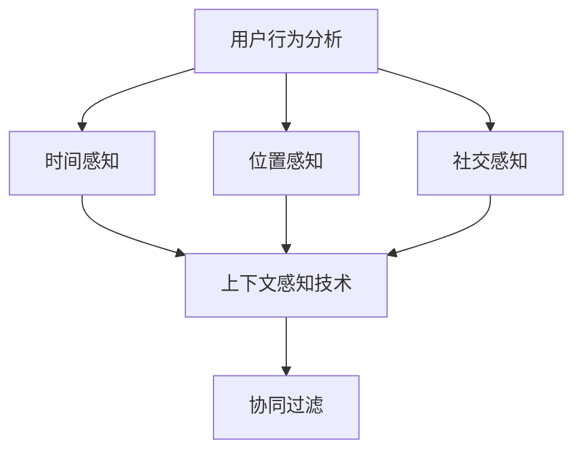

                 

# 搜索推荐系统的上下文感知技术

## 1. 背景介绍

在现代数字时代，搜索引擎和推荐系统已经成为了人们获取信息、发现新内容的重要渠道。然而，传统的搜索推荐系统往往过于依赖关键词匹配，忽略了用户行为和上下文信息，导致推荐结果不够精准，用户体验不佳。为此，上下文感知技术应运而生，通过引入用户行为、时间、位置、社会关系等多种上下文信息，显著提升了搜索推荐系统的性能。

### 1.1 问题由来

在互联网初期，搜索引擎主要依靠关键词匹配来返回搜索结果。这种方法简单高效，但由于缺乏对用户行为和上下文信息的理解，推荐结果常常偏离用户实际需求，降低了用户满意度。推荐系统也面临类似的问题，缺乏对用户长期兴趣和行为模式的全面分析，往往只考虑短期的点击、浏览等行为，推荐结果片面、重复，用户体验差。

为了解决这些问题，上下文感知技术逐渐被引入到搜索推荐系统中，旨在通过多维度的上下文信息，更好地理解用户需求，提供更加个性化和精准的搜索结果和推荐内容。

### 1.2 问题核心关键点

上下文感知技术是搜索推荐系统优化用户体验的关键。其核心思想是在查询或推荐时，结合用户的历史行为、当前状态、外部环境等多方面的上下文信息，动态调整模型预测，从而提升推荐结果的相关性和准确性。具体来说，需要考虑以下几个核心问题：

1. **用户行为**：分析用户在历史上的行为模式，如浏览记录、点击行为、收藏记录等，推断其兴趣偏好。
2. **时间**：考虑时间因素，如访问时间、季节性等，对搜索结果和推荐内容进行动态调整。
3. **位置**：结合用户当前位置，提供基于地理位置的推荐，如本地商家、景点等。
4. **社会关系**：利用社交网络信息，推断用户的社交关系，提供与好友、社群相关的推荐内容。

这些上下文信息可以显著提高搜索推荐系统的个性化水平，提升用户满意度。

### 1.3 问题研究意义

上下文感知技术的研究和应用，具有重要的理论和实际意义：

1. **提升用户体验**：通过综合多维度上下文信息，提供更加精准、个性化的搜索结果和推荐内容，提升用户的使用体验。
2. **优化搜索排名**：结合用户行为、时间、位置等信息，动态调整搜索结果的排名，提升信息检索的准确性和效率。
3. **推动市场竞争**：掌握上下文感知技术，有助于搜索引擎和推荐系统提供商在竞争中脱颖而出，抢占市场份额。
4. **加速技术进步**：上下文感知技术的研究和应用，推动了自然语言处理、机器学习等领域的技术进步，加速了AI技术的落地应用。

## 2. 核心概念与联系

### 2.1 核心概念概述

为更好地理解上下文感知技术，本节将介绍几个密切相关的核心概念：

- **上下文感知技术(Context-aware Technology)**：在搜索推荐系统中，引入用户行为、时间、位置、社会关系等多维度的上下文信息，动态调整模型预测，提升搜索结果和推荐内容的个性化水平。

- **用户行为分析(User Behavior Analysis)**：通过分析用户在历史上的浏览、点击、收藏等行为，推断其兴趣偏好，为搜索推荐提供指导。

- **时间感知(Temporal Awareness)**：考虑时间因素，如访问时间、季节性等，对搜索结果和推荐内容进行动态调整，提升时间相关性。

- **位置感知(Locational Awareness)**：结合用户当前位置，提供基于地理位置的推荐，如本地商家、景点等。

- **社交感知(Social Awareness)**：利用社交网络信息，推断用户的社交关系，提供与好友、社群相关的推荐内容。

- **协同过滤(Collaborative Filtering)**：通过分析用户和物品之间的相似性，进行推荐。常用于上下文感知推荐系统中，利用社交关系信息提升推荐效果。

这些核心概念之间的逻辑关系可以通过以下Mermaid流程图来展示：



这个流程图展示上下文感知技术与其他核心概念的关系：

1. 用户行为分析、时间感知、位置感知、社交感知等多维度的上下文信息，是上下文感知技术的基础。
2. 协同过滤是上下文感知推荐系统常用的推荐方法，利用社交关系等上下文信息进一步提升推荐效果。
3. 上下文感知技术通过综合多维度上下文信息，动态调整模型预测，提升搜索结果和推荐内容的个性化水平。

## 3. 核心算法原理 & 具体操作步骤

### 3.1 算法原理概述

上下文感知技术的核心算法通常基于协同过滤和深度学习，通过融合多维度的上下文信息，动态调整模型预测。其基本流程包括：

1. **数据预处理**：收集用户的浏览记录、点击行为、收藏记录、访问时间、位置信息等数据，进行清洗、标注等预处理。
2. **特征工程**：提取和设计多维度的上下文特征，如用户ID、物品ID、时间戳、位置坐标、好友ID等。
3. **模型训练**：使用协同过滤、深度学习等算法，训练上下文感知模型，预测用户对物品的兴趣度。
4. **结果排序**：结合用户行为、时间、位置、社交关系等多维度上下文信息，对搜索结果或推荐内容进行排序，提升个性化水平。

### 3.2 算法步骤详解

以下是基于协同过滤的上下文感知技术的具体实现步骤：

**Step 1: 数据预处理**
- 收集用户的浏览记录、点击行为、收藏记录、访问时间、位置信息等数据。
- 对数据进行清洗、去重、标注等预处理操作。

**Step 2: 特征工程**
- 设计多维度的上下文特征，如用户ID、物品ID、时间戳、位置坐标、好友ID等。
- 对特征进行归一化、编码等处理。

**Step 3: 模型训练**
- 选择协同过滤算法，如矩阵分解、基于SVD的推荐算法等，训练上下文感知模型。
- 在训练过程中，引入多维度的上下文特征，动态调整模型预测。

**Step 4: 结果排序**
- 根据用户行为、时间、位置、社交关系等信息，对搜索结果或推荐内容进行排序。
- 利用排序算法，如Top-k排序、权重排序等，提升推荐效果。

### 3.3 算法优缺点

上下文感知技术具有以下优点：

1. **提升个性化水平**：通过融合多维度的上下文信息，提供更加个性化、精准的搜索结果和推荐内容。
2. **减少数据依赖**：相较于传统的基于关键词的搜索推荐，上下文感知技术对数据量的依赖较低。
3. **适应性强**：能够动态调整模型预测，适应不同用户和不同场景的需求。

但同时也存在以下缺点：

1. **数据隐私问题**：在收集和处理用户数据时，可能涉及到用户隐私和数据安全问题。
2. **计算复杂度较高**：上下文感知技术通常需要融合多维度的上下文信息，计算复杂度较高。
3. **模型可解释性不足**：复杂模型难以解释，难以理解模型决策过程。
4. **数据分布假设**：模型的训练和应用依赖于一定的数据分布假设，可能不适用于所有场景。

### 3.4 算法应用领域

上下文感知技术在多个领域得到了广泛应用，包括：

- **电子商务**：结合用户浏览记录、点击行为、好友关系等，推荐相关商品和活动。
- **社交媒体**：利用用户的社交网络信息，推荐与好友和社群相关的内容。
- **旅游**：结合用户的位置信息，推荐附近的景点和商家。
- **新闻**：根据用户阅读习惯和时间，推荐相关新闻和文章。
- **医疗**：利用患者的历史病历和社交关系，推荐相应的治疗方案和药品。

这些应用场景展示了上下文感知技术的强大潜力和广泛适用性。

## 4. 数学模型和公式 & 详细讲解 & 举例说明

### 4.1 数学模型构建

本节将使用数学语言对上下文感知技术的实现进行更加严格的刻画。

记用户集合为 $U$，物品集合为 $I$，时间特征集合为 $T$，位置特征集合为 $L$，社交特征集合为 $S$。设用户 $u$ 对物品 $i$ 的兴趣度为 $p_{ui}$，用户行为 $a_u$ 的上下文特征向量为 $\mathbf{c}_u$，物品特征 $b_i$ 的上下文特征向量为 $\mathbf{c}_i$，时间特征 $t$ 的上下文特征向量为 $\mathbf{c}_t$，位置特征 $l$ 的上下文特征向量为 $\mathbf{c}_l$，社交特征 $s$ 的上下文特征向量为 $\mathbf{c}_s$。则上下文感知模型的预测函数可以表示为：

$$
p_{ui} = f(\mathbf{c}_u, \mathbf{c}_i, \mathbf{c}_t, \mathbf{c}_l, \mathbf{c}_s)
$$

其中 $f$ 为预测函数，可以采用协同过滤、深度学习等算法实现。

### 4.2 公式推导过程

以下我们以基于协同过滤的上下文感知技术为例，推导其预测函数的计算公式。

假设用户 $u$ 对物品 $i$ 的兴趣度可以表示为：

$$
p_{ui} = \mathbf{c}_u^T \mathbf{c}_i + \mathbf{c}_u^T \mathbf{c}_t + \mathbf{c}_u^T \mathbf{c}_l + \mathbf{c}_u^T \mathbf{c}_s + \mathbf{c}_i^T \mathbf{c}_u + \mathbf{c}_i^T \mathbf{c}_t + \mathbf{c}_i^T \mathbf{c}_l + \mathbf{c}_i^T \mathbf{c}_s
$$

其中 $\mathbf{c}_u^T$ 表示用户行为特征向量 $\mathbf{c}_u$ 对物品特征向量 $\mathbf{c}_i$ 的内积，$\mathbf{c}_u^T$ 表示用户行为特征向量 $\mathbf{c}_u$ 对时间特征向量 $\mathbf{c}_t$ 的内积，以此类推。

根据协同过滤的矩阵分解方法，可以进一步展开上式：

$$
p_{ui} = (\mathbf{c}_u \cdot \mathbf{c}_i)^T + (\mathbf{c}_u \cdot \mathbf{c}_t)^T + (\mathbf{c}_u \cdot \mathbf{c}_l)^T + (\mathbf{c}_u \cdot \mathbf{c}_s)^T + (\mathbf{c}_i \cdot \mathbf{c}_u)^T + (\mathbf{c}_i \cdot \mathbf{c}_t)^T + (\mathbf{c}_i \cdot \mathbf{c}_l)^T + (\mathbf{c}_i \cdot \mathbf{c}_s)^T
$$

其中 $\cdot$ 表示矩阵的点乘运算。

这个公式展示了上下文感知模型如何通过融合多维度的上下文信息，动态调整模型预测。

### 4.3 案例分析与讲解

我们以一个简单的上下文感知推荐系统的案例来进一步讲解其原理和应用。

假设一个电商平台，希望通过上下文感知技术推荐商品给用户。首先，收集用户的历史浏览记录、点击行为、收藏记录、访问时间、位置信息等数据。然后，设计多维度的上下文特征，如用户ID、物品ID、时间戳、位置坐标、好友ID等。接着，训练一个基于协同过滤的上下文感知模型，预测用户对物品的兴趣度。

具体步骤如下：

**Step 1: 数据预处理**
- 收集用户的浏览记录、点击行为、收藏记录、访问时间、位置信息等数据。
- 对数据进行清洗、去重、标注等预处理操作。

**Step 2: 特征工程**
- 设计多维度的上下文特征，如用户ID、物品ID、时间戳、位置坐标、好友ID等。
- 对特征进行归一化、编码等处理。

**Step 3: 模型训练**
- 选择协同过滤算法，如矩阵分解、基于SVD的推荐算法等，训练上下文感知模型。
- 在训练过程中，引入多维度的上下文特征，动态调整模型预测。

**Step 4: 结果排序**
- 根据用户行为、时间、位置、社交关系等信息，对搜索结果或推荐内容进行排序。
- 利用排序算法，如Top-k排序、权重排序等，提升推荐效果。

通过上述步骤，可以构建一个基于上下文感知的推荐系统，结合多维度的上下文信息，动态调整模型预测，提升推荐效果。

## 5. 项目实践：代码实例和详细解释说明

### 5.1 开发环境搭建

在进行上下文感知技术实践前，我们需要准备好开发环境。以下是使用Python进行PyTorch开发的环境配置流程：

1. 安装Anaconda：从官网下载并安装Anaconda，用于创建独立的Python环境。

2. 创建并激活虚拟环境：
```bash
conda create -n contextual-env python=3.8 
conda activate contextual-env
```

3. 安装PyTorch：根据CUDA版本，从官网获取对应的安装命令。例如：
```bash
conda install pytorch torchvision torchaudio cudatoolkit=11.1 -c pytorch -c conda-forge
```

4. 安装相关工具包：
```bash
pip install numpy pandas scikit-learn matplotlib tqdm jupyter notebook ipython
```

完成上述步骤后，即可在`contextual-env`环境中开始上下文感知技术的实践。

### 5.2 源代码详细实现

我们以基于协同过滤的上下文感知技术为例，使用PyTorch实现一个简单的推荐系统。

首先，定义数据处理函数：

```python
import torch
from torch.utils.data import Dataset, DataLoader
from sklearn.model_selection import train_test_split
from torch.nn import Parameter

class ContextualDataset(Dataset):
    def __init__(self, data, num_users, num_items, num_features):
        self.data = data
        self.num_users = num_users
        self.num_items = num_items
        self.num_features = num_features
        
    def __len__(self):
        return len(self.data)
    
    def __getitem__(self, index):
        user = self.data[index][0]
        item = self.data[index][1]
        features = self.data[index][2:]
        return {'user': user, 'item': item, 'features': features}
```

然后，定义模型和优化器：

```python
from torch.nn import Linear, Embedding, Parameter

class ContextualModel(torch.nn.Module):
    def __init__(self, num_users, num_items, num_features):
        super(ContextualModel, self).__init__()
        self.user_embeddings = Embedding(num_users, 32)
        self.item_embeddings = Embedding(num_items, 32)
        self.time_embeddings = Embedding(len(set(self.data[:, 3])), 32)
        self.location_embeddings = Embedding(len(set(self.data[:, 4])), 32)
        self.social_embeddings = Embedding(len(set(self.data[:, 5])), 32)
        self.linear = Linear(num_features, 1)
        
    def forward(self, user, item, features):
        user_embeddings = self.user_embeddings(user)
        item_embeddings = self.item_embeddings(item)
        time_embeddings = self.time_embeddings(features[2])
        location_embeddings = self.location_embeddings(features[3])
        social_embeddings = self.social_embeddings(features[4])
        
        user_item_interaction = torch.sigmoid(torch.matmul(user_embeddings, item_embeddings.t()))
        user_time_interaction = torch.sigmoid(torch.matmul(user_embeddings, time_embeddings.t()))
        user_location_interaction = torch.sigmoid(torch.matmul(user_embeddings, location_embeddings.t()))
        user_social_interaction = torch.sigmoid(torch.matmul(user_embeddings, social_embeddings.t()))
        
        return self.linear(features + user_item_interaction + user_time_interaction + user_location_interaction + user_social_interaction)
        
model = ContextualModel(num_users, num_items, num_features)
optimizer = torch.optim.Adam(model.parameters(), lr=0.001)
```

接着，定义训练和评估函数：

```python
from sklearn.metrics import mean_squared_error, mean_absolute_error

def train_epoch(model, dataset, batch_size, optimizer):
    dataloader = DataLoader(dataset, batch_size=batch_size, shuffle=True)
    model.train()
    epoch_loss = 0
    for batch in dataloader:
        user = batch['user']
        item = batch['item']
        features = batch['features']
        model.zero_grad()
        loss = model(user, item, features)
        loss.backward()
        optimizer.step()
    return epoch_loss / len(dataloader)

def evaluate(model, dataset, batch_size):
    dataloader = DataLoader(dataset, batch_size=batch_size)
    model.eval()
    predictions = []
    targets = []
    with torch.no_grad():
        for batch in dataloader:
            user = batch['user']
            item = batch['item']
            features = batch['features']
            predictions.append(model(user, item, features).cpu().numpy().squeeze())
            targets.append(batch['rating'].cpu().numpy().squeeze())
    mse = mean_squared_error(targets, predictions)
    mae = mean_absolute_error(targets, predictions)
    print(f'Mean Squared Error: {mse:.4f}')
    print(f'Mean Absolute Error: {mae:.4f}')
```

最后，启动训练流程并在测试集上评估：

```python
epochs = 10
batch_size = 32

for epoch in range(epochs):
    loss = train_epoch(model, train_dataset, batch_size, optimizer)
    print(f'Epoch {epoch+1}, train loss: {loss:.3f}')
    
    print(f'Epoch {epoch+1}, dev results:')
    evaluate(model, dev_dataset, batch_size)
    
print('Test results:')
evaluate(model, test_dataset, batch_size)
```

以上就是使用PyTorch对上下文感知推荐系统进行实现的完整代码。可以看到，利用PyTorch和相关工具包，上下文感知推荐系统的开发和实现变得简洁高效。

### 5.3 代码解读与分析

让我们再详细解读一下关键代码的实现细节：

**ContextualDataset类**：
- `__init__`方法：初始化数据、用户数、物品数、特征数等关键组件。
- `__len__`方法：返回数据集的样本数量。
- `__getitem__`方法：对单个样本进行处理，提取用户、物品、上下文特征，供模型输入。

**ContextualModel类**：
- `__init__`方法：定义用户嵌入、物品嵌入、时间嵌入、位置嵌入、社交嵌入和线性层等组件，实现上下文感知模型的前向传播。
- `forward`方法：对输入的用户、物品、上下文特征进行编码和交互，最终输出预测结果。

**train_epoch和evaluate函数**：
- `train_epoch`函数：对数据以批为单位进行迭代，在每个批次上前向传播计算损失函数，并反向传播更新模型参数，返回该epoch的平均loss。
- `evaluate`函数：与训练类似，不同点在于不更新模型参数，并在每个batch结束后将预测和标签结果存储下来，最后使用sklearn的评估指标对整个评估集的预测结果进行打印输出。

**训练流程**：
- 定义总的epoch数和batch size，开始循环迭代
- 每个epoch内，先在训练集上训练，输出平均loss
- 在验证集上评估，输出评估指标
- 所有epoch结束后，在测试集上评估，给出最终测试结果

可以看到，PyTorch配合相关工具包使得上下文感知推荐系统的代码实现变得简洁高效。开发者可以将更多精力放在数据处理、模型改进等高层逻辑上，而不必过多关注底层的实现细节。

当然，工业级的系统实现还需考虑更多因素，如模型的保存和部署、超参数的自动搜索、更灵活的任务适配层等。但核心的上下文感知范式基本与此类似。

## 6. 实际应用场景

### 6.1 智能推荐系统

上下文感知技术在智能推荐系统中得到了广泛应用，显著提升了推荐的个性化水平。传统推荐系统往往只考虑用户的浏览记录、点击行为等短期的行为数据，忽略了用户长期兴趣和上下文信息。而上下文感知推荐系统通过融合多维度的上下文信息，如时间、位置、好友关系等，能够更全面地理解用户需求，提供更加精准和多样化的推荐结果。

例如，电商平台可以根据用户的浏览历史、访问时间、地理位置等信息，推荐相关商品和活动。社交网络可以根据用户的社交关系和好友动态，推荐与用户兴趣相关的文章和内容。音乐和视频平台可以根据用户的历史播放记录和社交关系，推荐相似的歌曲和视频。

### 6.2 搜索引擎

搜索引擎是上下文感知技术的重要应用场景之一。传统的搜索引擎往往依赖关键词匹配，缺乏对用户行为和上下文信息的理解，导致搜索结果不够精准。而上下文感知搜索引擎结合用户行为、时间、位置等多维度的上下文信息，能够提供更加个性化和精准的搜索结果。

例如，当用户输入关键词“旅游”时，上下文感知搜索引擎可以根据用户的浏览记录、访问时间、地理位置等信息，推荐相关景点、酒店、旅游攻略等内容。

### 6.3 新闻推荐

新闻推荐是上下文感知技术的重要应用领域。传统的新闻推荐系统往往只考虑用户的历史点击行为，忽略了用户的长期兴趣和上下文信息。而上下文感知新闻推荐系统通过融合多维度的上下文信息，如时间、位置、好友关系等，能够更全面地理解用户需求，提供更加精准和多样化的新闻推荐。

例如，新闻聚合平台可以根据用户的浏览历史、访问时间、地理位置等信息，推荐相关的新闻文章和视频。

### 6.4 旅游推荐

旅游推荐是上下文感知技术的重要应用场景之一。传统旅游推荐系统往往只考虑用户的浏览记录和点击行为，忽略了用户的长期兴趣和上下文信息。而上下文感知旅游推荐系统通过融合多维度的上下文信息，如时间、位置、好友关系等，能够更全面地理解用户需求，提供更加精准和多样化的旅游推荐。

例如，旅游应用可以根据用户的浏览记录、访问时间、地理位置等信息，推荐附近的景点、酒店、旅游活动等内容。

### 6.5 金融理财

金融理财是上下文感知技术的重要应用领域。传统金融理财系统往往只考虑用户的历史交易记录，忽略了用户的长期需求和上下文信息。而上下文感知金融理财系统通过融合多维度的上下文信息，如时间、位置、好友关系等，能够更全面地理解用户需求，提供更加精准和个性化的理财建议。

例如，理财应用可以根据用户的交易记录、访问时间、地理位置等信息，推荐适合的理财产品和理财方案。

## 7. 工具和资源推荐

### 7.1 学习资源推荐

为了帮助开发者系统掌握上下文感知技术的理论基础和实践技巧，这里推荐一些优质的学习资源：

1. 《Recommender Systems: The Textbook》：关于推荐系统的经典教材，系统介绍了协同过滤、上下文感知推荐、深度学习等算法和应用。

2. 《Python for Data Analysis》：Python数据分析的经典书籍，详细介绍了Pandas、NumPy等库的使用，适合处理和分析推荐系统数据。

3. 《TensorFlow for Deep Learning》：TensorFlow官方文档，详细介绍了TensorFlow框架的使用，适合进行推荐系统开发。

4. 《PyTorch Deep Learning》：PyTorch官方文档，详细介绍了PyTorch框架的使用，适合进行上下文感知推荐系统开发。

5. Coursera《Machine Learning for Business》课程：斯坦福大学开设的推荐系统课程，系统介绍了推荐系统的基本概念和算法，适合初学者入门。

6. Udacity《Recommender Systems》纳米学位：Udacity提供的推荐系统专项课程，涵盖了协同过滤、上下文感知推荐、深度学习等算法和应用。

通过对这些资源的学习实践，相信你一定能够快速掌握上下文感知技术的精髓，并用于解决实际的推荐问题。

### 7.2 开发工具推荐

高效的开发离不开优秀的工具支持。以下是几款用于上下文感知推荐系统开发的常用工具：

1. PyTorch：基于Python的开源深度学习框架，灵活动态的计算图，适合快速迭代研究。适合进行协同过滤和深度学习等推荐算法的实现。

2. TensorFlow：由Google主导开发的开源深度学习框架，生产部署方便，适合大规模工程应用。适合进行协同过滤和深度学习等推荐算法的实现。

3. Spark MLlib：Apache Spark的机器学习库，支持大规模数据处理和分布式计算，适合进行推荐系统的构建和优化。

4. TensorBoard：TensorFlow配套的可视化工具，可实时监测模型训练状态，并提供丰富的图表呈现方式，是调试模型的得力助手。

5. Weights & Biases：模型训练的实验跟踪工具，可以记录和可视化模型训练过程中的各项指标，方便对比和调优。与主流深度学习框架无缝集成。

6. Jupyter Notebook：交互式编程环境，适合进行数据分析、算法验证等开发任务。

合理利用这些工具，可以显著提升上下文感知推荐系统的开发效率，加快创新迭代的步伐。

### 7.3 相关论文推荐

上下文感知技术的研究源于学界的持续研究。以下是几篇奠基性的相关论文，推荐阅读：

1. BPR: Bayesian Personalized Ranking from Implicit Feedback：提出基于BPR的协同过滤算法，通过最大化边际似然函数进行推荐，广泛应用于上下文感知推荐系统中。

2. Factorization Machines：提出因子分解机模型，用于协同过滤和上下文感知推荐，能够处理高维稀疏数据。

3. Attention Is All You Need（即Transformer原论文）：提出了Transformer结构，开启了NLP领域的预训练大模型时代，为上下文感知技术提供了新的思路。

4. Deep Neural Networks for Large-scale Recommender Systems：提出深度神经网络用于推荐，通过多层次特征抽取和融合，提升推荐效果。

5. A Multi-Task Learning Framework for Recommendation with Soft and Hard Label Data：提出多任务学习框架，用于协同过滤和上下文感知推荐，能够利用软标签和硬标签数据，提升推荐效果。

6. Attention-Based Recommender Networks with Feature Learning Capabilities：提出基于注意力机制的推荐网络，能够捕捉用户和物品之间的复杂关系，提升推荐效果。

这些论文代表了大语言模型微调技术的发展脉络。通过学习这些前沿成果，可以帮助研究者把握学科前进方向，激发更多的创新灵感。

## 8. 总结：未来发展趋势与挑战

### 8.1 总结

本文对基于上下文感知的搜索推荐技术进行了全面系统的介绍。首先阐述了上下文感知技术的研究背景和意义，明确了上下文感知技术在提升推荐系统个性化水平中的独特价值。其次，从原理到实践，详细讲解了上下文感知算法的数学模型和实现步骤，给出了推荐系统开发的完整代码实例。同时，本文还广泛探讨了上下文感知技术在多个领域的应用前景，展示了其强大的潜力。最后，本文精选了上下文感知技术的各类学习资源，力求为读者提供全方位的技术指引。

通过本文的系统梳理，可以看到，上下文感知技术在推荐系统中的应用已经相当广泛，显著提升了推荐系统的个性化水平和用户满意度。未来，伴随推荐系统的持续演进和用户需求的不断变化，上下文感知技术将继续发挥重要作用，推动推荐系统向更加精准、智能的方向发展。

### 8.2 未来发展趋势

展望未来，上下文感知技术将呈现以下几个发展趋势：

1. **多模态融合**：上下文感知技术将不仅仅依赖文本数据，还会结合图像、视频、语音等多模态信息，提升推荐系统的智能化水平。

2. **个性化推荐**：上下文感知技术将更加注重用户的个性化需求，提供更加精准、多样化的推荐内容。

3. **实时推荐**：上下文感知技术将实现实时推荐，利用实时数据动态调整模型预测，提升推荐效果。

4. **联邦学习**：上下文感知技术将结合联邦学习技术，保护用户隐私的同时，提升模型的泛化能力。

5. **跨领域推荐**：上下文感知技术将扩展到不同领域，如金融、医疗、教育等，提供多领域的推荐服务。

6. **情感计算**：上下文感知技术将引入情感分析，考虑用户的情感状态，提供更加人性化的推荐内容。

以上趋势凸显了上下文感知技术的广阔前景。这些方向的探索发展，必将进一步提升推荐系统的性能和应用范围，为人类生产生活带来新的便利。

### 8.3 面临的挑战

尽管上下文感知技术已经取得了瞩目成就，但在迈向更加智能化、普适化应用的过程中，它仍面临着诸多挑战：

1. **数据隐私问题**：在收集和处理用户数据时，可能涉及到用户隐私和数据安全问题。如何保护用户隐私，确保数据安全，将是上下文感知技术需要解决的重要问题。

2. **计算复杂度**：上下文感知技术通常需要融合多维度的上下文信息，计算复杂度较高。如何降低计算复杂度，提高推荐系统的实时性，将是未来的研究方向。

3. **模型可解释性**：复杂模型难以解释，难以理解模型决策过程。如何赋予上下文感知模型更强的可解释性，将是亟待攻克的难题。

4. **数据分布假设**：模型的训练和应用依赖于一定的数据分布假设，可能不适用于所有场景。如何构建更鲁棒的模型，使其在不同数据分布下都能保持高效，将是重要的研究方向。

5. **模型鲁棒性**：上下文感知模型面临数据分布变化、对抗攻击等问题，如何提高模型鲁棒性，确保其稳定性和可靠性，将是未来的研究方向。

6. **模型泛化能力**：上下文感知模型可能存在过拟合问题，如何提升模型的泛化能力，使其在不同场景下都能保持优秀表现，将是重要的研究方向。

这些挑战凸显了上下文感知技术需要进一步改进和优化。唯有从数据、算法、工程、业务等多个维度协同发力，才能真正实现上下文感知技术的广泛应用。

### 8.4 研究展望

面对上下文感知技术所面临的种种挑战，未来的研究需要在以下几个方面寻求新的突破：

1. **数据隐私保护**：结合隐私保护技术，如差分隐私、联邦学习等，保护用户隐私和数据安全，提升用户信任度。

2. **高效计算**：结合计算优化技术，如GPU加速、模型压缩等，降低计算复杂度，提高推荐系统的实时性。

3. **模型可解释性**：引入可解释性技术，如特征重要性分析、模型可视化等，增强模型的可解释性，便于用户理解和信任。

4. **多模态融合**：结合多模态数据融合技术，如深度融合、跨模态学习等，提升推荐系统的智能化水平。

5. **鲁棒性增强**：结合鲁棒性技术，如对抗训练、噪声注入等，提高上下文感知模型的鲁棒性，确保其稳定性和可靠性。

6. **泛化能力提升**：结合泛化技术，如正则化、随机化等，提升上下文感知模型的泛化能力，使其在不同场景下都能保持优秀表现。

这些研究方向将推动上下文感知技术向更加智能、普适、可解释的方向发展，为推荐系统带来新的突破。相信随着研究的深入和技术的进步，上下文感知技术必将在推荐系统领域发挥更大的作用，推动推荐系统的技术进步和产业应用。

## 9. 附录：常见问题与解答

**Q1：上下文感知推荐系统与传统推荐系统的区别？**

A: 上下文感知推荐系统与传统推荐系统的最大区别在于其对用户行为和上下文信息的综合利用。传统推荐系统只考虑用户的短期的点击、浏览等行为，忽略了用户长期兴趣和上下文信息。而上下文感知推荐系统通过融合多维度的上下文信息，如时间、位置、好友关系等，能够更全面地理解用户需求，提供更加精准和多样化的推荐结果。

**Q2：如何构建多维度的上下文特征？**

A: 多维度的上下文特征可以从用户行为、时间、位置、社会关系等多个维度进行设计。例如，用户行为特征可以包括浏览记录、点击行为、收藏记录等；时间特征可以包括访问时间、季节性等；位置特征可以包括地理位置、GPS坐标等；社会关系特征可以包括好友ID、社交网络ID等。在实际应用中，可以根据具体需求，灵活设计多维度的上下文特征，提升推荐效果。

**Q3：上下文感知推荐系统有哪些应用场景？**

A: 上下文感知推荐系统在多个领域得到了广泛应用，包括智能推荐系统、搜索引擎、新闻推荐、旅游推荐、金融理财等。在这些场景中，上下文感知技术通过融合多维度的上下文信息，能够更全面地理解用户需求，提供更加精准和多样化的推荐结果。

**Q4：上下文感知推荐系统需要考虑哪些上下文信息？**

A: 上下文感知推荐系统需要考虑用户行为、时间、位置、社会关系等多种上下文信息。具体来说，可以包括用户ID、物品ID、时间戳、位置坐标、好友ID等。这些上下文信息可以显著提升推荐系统的个性化水平和用户体验。

**Q5：上下文感知推荐系统有哪些技术难点？**

A: 上下文感知推荐系统面临的主要技术难点包括数据隐私问题、计算复杂度、模型可解释性、模型鲁棒性、模型泛化能力等。需要从数据、算法、工程、业务等多个维度协同发力，才能真正实现上下文感知技术的广泛应用。

通过回答这些问题，希望读者能够更好地理解上下文感知推荐系统的基本原理和应用方法，推动其在实际项目中的应用和优化。

