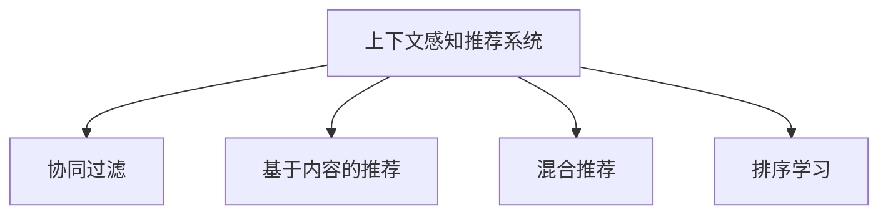

                 

# 搜索推荐系统的上下文感知技术

## 1. 背景介绍

### 1.1 问题由来
在现代互联网时代，信息爆炸使得用户很难在海量数据中快速找到所需内容。为解决这一问题，搜索引擎和推荐系统成为了不可或缺的工具。传统的搜索和推荐系统依赖静态的网页和商品特征进行匹配，很难捕捉用户的动态需求和行为偏好。而上下文感知技术通过引入用户行为、设备状态、时间等信息，使推荐系统更加智能、个性化，能够更好地匹配用户需求。

### 1.2 问题核心关键点
上下文感知技术是推荐系统领域的一个重要方向，它使得推荐系统能够根据用户的上下文信息，动态调整推荐策略，提升推荐效果。常见的上下文感知技术包括协同过滤、基于内容的推荐、混合推荐、排序学习等，其中排序学习是提升推荐效果的关键方法。

## 2. 核心概念与联系

### 2.1 核心概念概述

为更好地理解上下文感知推荐系统，本节将介绍几个关键概念：

- **上下文感知推荐系统**：通过引入用户的上下文信息（如历史行为、设备状态、时间等），动态调整推荐策略，提升推荐效果。

- **协同过滤**：利用用户间的相似性进行推荐，分为基于用户的协同过滤和基于物品的协同过滤。

- **基于内容的推荐**：根据物品的特征与用户兴趣进行推荐，需考虑特征提取的合理性。

- **混合推荐**：结合多种推荐方法，取长补短，提升推荐效果。

- **排序学习**：通过学习用户和物品的特征，建立更加准确的排序模型，优化推荐效果。

这些核心概念之间的逻辑关系可以通过以下Mermaid流程图来展示：



## 3. 核心算法原理 & 具体操作步骤
### 3.1 算法原理概述

上下文感知推荐系统的核心思想是，利用用户的上下文信息，动态调整推荐策略，以更好地匹配用户需求。具体来说，通过引入用户的交互记录、设备状态、时间等信息，可以建立更加全面、动态的推荐模型。常见的排序学习方法包括基于协同过滤的排序、基于内容的排序、矩阵分解等。

在数学上，设用户为 $u$，物品为 $i$，交互行为为 $r_{ui}$，上下文特征为 $c_{ui}$。推荐目标是通过学习用户和物品的特征，建立排序模型 $\mathcal{F}$，使得 $\mathcal{F}(u,i,c_{ui}) \approx r_{ui}$，其中 $c_{ui}$ 为上下文信息，可以包括用户的历史行为、设备状态、时间等。

### 3.2 算法步骤详解

上下文感知推荐系统的实现一般包括以下几个步骤：

**Step 1: 数据准备**
- 收集用户的交互数据、上下文数据等，建立用户行为矩阵 $\mathbf{R} \in \mathbb{R}^{U \times I}$，其中 $U$ 为用户数，$I$ 为物品数。

**Step 2: 特征提取**
- 对用户和物品进行特征工程，提取相关特征，构建特征向量 $\mathbf{X} \in \mathbb{R}^{U \times D}$ 和 $\mathbf{Y} \in \mathbb{R}^{I \times D}$，其中 $D$ 为特征维度。

**Step 3: 训练排序模型**
- 利用用户的交互数据、上下文数据，训练排序模型 $\mathcal{F}$。常见的排序模型包括矩阵分解、神经网络等。

**Step 4: 推荐计算**
- 对于新用户和新物品，使用训练好的排序模型进行推荐计算。根据上下文信息调整推荐策略，得到最终推荐结果。

### 3.3 算法优缺点

上下文感知推荐系统具有以下优点：
1. 个性化推荐：引入上下文信息，可以更加精准地匹配用户需求。
2. 动态调整：能够根据用户行为和环境变化，动态调整推荐策略。
3. 鲁棒性强：结合多种推荐方法，能够降低模型风险，提高稳定性。

同时，该方法也存在一些缺点：
1. 数据需求高：需要收集和处理大量的上下文数据，对数据质量和量级要求较高。
2. 计算复杂度高：模型训练和推荐计算需要处理大量数据，计算开销较大。
3. 效果依赖特征：特征工程的质量直接影响推荐效果，需进行精细化的设计和调整。

尽管存在这些局限性，但上下文感知推荐系统仍是大数据时代推荐技术的重要方向。未来相关研究的重点在于如何进一步降低数据需求，优化计算复杂度，提高推荐效果。

### 3.4 算法应用领域

上下文感知推荐系统在电商、社交网络、视频流媒体等多个领域都有广泛的应用：

- **电商推荐**：利用用户的浏览、购买记录，结合设备状态、时间等上下文信息，推荐用户可能感兴趣的商品。
- **社交网络**：根据用户的互动行为、好友关系，动态调整好友推荐策略，提升用户活跃度。
- **视频流媒体**：根据用户的观看历史、设备信息，推荐用户可能喜欢的视频内容。
- **音乐推荐**：根据用户的听歌历史、设备状态，推荐用户可能喜欢的音乐。

除了以上场景，上下文感知推荐系统还能应用于更多领域，如新闻推荐、游戏推荐等，为各类应用场景提供精准、个性化的推荐服务。

## 4. 数学模型和公式 & 详细讲解 & 举例说明
### 4.1 数学模型构建

在推荐系统中，常用的上下文感知排序模型包括矩阵分解和神经网络模型。下面以矩阵分解为例，构建推荐系统的数学模型。

设用户为 $u$，物品为 $i$，交互行为为 $r_{ui}$，上下文信息为 $c_{ui}$。假设 $c_{ui}$ 可表示为 $\mathbf{u}_u \odot \mathbf{v}_i$，其中 $\mathbf{u}_u$ 和 $\mathbf{v}_i$ 分别为用户和物品的上下文向量。则推荐目标可以表示为：

$$
\min_{\mathbf{u}, \mathbf{v}} \sum_{u,i} \left(r_{ui} - \mathbf{u}_u^T \mathbf{v}_i \right)^2
$$

其中，$\mathbf{u}_u \in \mathbb{R}^D$ 和 $\mathbf{v}_i \in \mathbb{R}^D$ 分别为用户和物品的上下文向量。

### 4.2 公式推导过程

首先，将目标函数展开：

$$
\begin{aligned}
\min_{\mathbf{u}, \mathbf{v}} & \sum_{u,i} \left(r_{ui} - \mathbf{u}_u^T \mathbf{v}_i \right)^2 \\
&= \sum_{u,i} \left(r_{ui}^2 - 2r_{ui} \mathbf{u}_u^T \mathbf{v}_i + \mathbf{u}_u^T \mathbf{v}_i^2 \right) \\
&= \sum_{u,i} r_{ui}^2 - 2 \sum_{u,i} r_{ui} \mathbf{u}_u^T \mathbf{v}_i + \sum_{u,i} \mathbf{u}_u^T \mathbf{v}_i^2
\end{aligned}
$$

假设 $\mathbf{u}_u$ 和 $\mathbf{v}_i$ 为矩阵分解形式，即 $\mathbf{u}_u = \mathbf{U} \mathbf{p}_u$ 和 $\mathbf{v}_i = \mathbf{V} \mathbf{q}_i$，其中 $\mathbf{p}_u \in \mathbb{R}^K$ 和 $\mathbf{q}_i \in \mathbb{R}^K$ 分别为用户和物品的低维向量，$\mathbf{U} \in \mathbb{R}^{U \times K}$ 和 $\mathbf{V} \in \mathbb{R}^{I \times K}$ 分别为用户和物品的低维向量矩阵。则目标函数可以进一步简化为：

$$
\begin{aligned}
\min_{\mathbf{p}, \mathbf{q}} & \frac{1}{2} \text{tr}\left(\mathbf{R} - \mathbf{U}\mathbf{P}^T\mathbf{V}\mathbf{Q}^T\right)^T\left(\mathbf{R} - \mathbf{U}\mathbf{P}^T\mathbf{V}\mathbf{Q}^T\right) \\
&= \frac{1}{2} \text{tr}\left(\mathbf{R}^T\mathbf{R} - \mathbf{R}^T\mathbf{U}\mathbf{P}^T\mathbf{V}\mathbf{Q}^T - \mathbf{U}^T\mathbf{P}\mathbf{V}^T\mathbf{R} + \mathbf{U}^T\mathbf{P}\mathbf{V}^T\mathbf{Q}\mathbf{Q}^T\mathbf{V}^T\mathbf{P}^T\mathbf{U}^T\right)
\end{aligned}
$$

其中，$\mathbf{R} \in \mathbb{R}^{U \times I}$ 为用户行为矩阵，$\mathbf{P} \in \mathbb{R}^{U \times K}$ 和 $\mathbf{Q} \in \mathbb{R}^{I \times K}$ 分别为用户和物品的低维向量矩阵，$\mathbf{U} \in \mathbb{R}^{U \times K}$ 和 $\mathbf{V} \in \mathbb{R}^{I \times K}$ 分别为用户和物品的低维向量矩阵。

### 4.3 案例分析与讲解

考虑电商推荐系统中的一个具体案例：某电商平台有 10 万用户和 1 万商品，每个用户有 100 次购买记录。假设用户行为矩阵 $\mathbf{R}$ 为：

$$
\mathbf{R} = \begin{bmatrix}
1.0 & 0.5 & 2.0 & \cdots \\
0.2 & 0.3 & 1.0 & \cdots \\
\cdots & \cdots & \cdots & \cdots \\
\cdots & \cdots & \cdots & \cdots \\
\cdots & \cdots & \cdots & \cdots \\
\end{bmatrix}
$$

用户行为矩阵 $\mathbf{R}$ 的每个元素 $r_{ui}$ 表示用户 $u$ 对商品 $i$ 的评分。现在要通过矩阵分解方法，学习用户和物品的上下文向量 $\mathbf{u}_u$ 和 $\mathbf{v}_i$，使得 $\mathbf{u}_u^T \mathbf{v}_i$ 逼近 $r_{ui}$。

首先，对用户行为矩阵进行矩阵分解：

$$
\mathbf{R} = \mathbf{U}\mathbf{P}^T\mathbf{V}\mathbf{Q}^T
$$

其中，$\mathbf{P}$ 和 $\mathbf{Q}$ 为随机初始化的低维向量矩阵，$\mathbf{U}$ 和 $\mathbf{V}$ 为初始的低维向量矩阵。通过交替最小化目标函数：

$$
\mathbf{U}, \mathbf{P} = \text{argmin}_{\mathbf{U}, \mathbf{P}} \frac{1}{2} \text{tr}\left(\mathbf{R}^T\mathbf{R} - \mathbf{R}^T\mathbf{U}\mathbf{P}^T\mathbf{V}\mathbf{Q}^T - \mathbf{U}^T\mathbf{P}\mathbf{V}^T\mathbf{R} + \mathbf{U}^T\mathbf{P}\mathbf{V}^T\mathbf{Q}\mathbf{Q}^T\mathbf{V}^T\mathbf{P}^T\mathbf{U}^T\right)
$$

即可得到优化后的用户和物品的上下文向量 $\mathbf{u}_u$ 和 $\mathbf{v}_i$，从而得到最优的推荐结果。

## 5. 项目实践：代码实例和详细解释说明
### 5.1 开发环境搭建

在进行推荐系统上下文感知技术实践前，需要先搭建好开发环境。以下是使用Python和TensorFlow进行推荐系统开发的环境配置流程：

1. 安装Anaconda：从官网下载并安装Anaconda，用于创建独立的Python环境。

2. 创建并激活虚拟环境：
```bash
conda create -n tf-env python=3.8 
conda activate tf-env
```

3. 安装TensorFlow：根据CUDA版本，从官网获取对应的安装命令。例如：
```bash
pip install tensorflow
```

4. 安装TensorBoard：用于实时监控训练过程和模型性能。

5. 安装sklearn和pandas：用于数据预处理和特征工程。

6. 安装其他依赖：
```bash
pip install tqdm scipy jupyter notebook
```

完成上述步骤后，即可在`tf-env`环境中开始推荐系统上下文感知技术的开发实践。

### 5.2 源代码详细实现

下面是使用TensorFlow实现上下文感知推荐系统的代码实现：

```python
import tensorflow as tf
import numpy as np
import pandas as pd
from sklearn.model_selection import train_test_split
from tensorflow.keras.layers import Input, Dense, Embedding, Add, dot, Flatten
from tensorflow.keras.models import Model
from tensorflow.keras.callbacks import EarlyStopping
from sklearn.metrics import mean_squared_error

# 数据加载和预处理
df = pd.read_csv('user_item_ratings.csv')
df = df.dropna()
user_ids = df['user_id'].unique()
item_ids = df['item_id'].unique()
num_users = len(user_ids)
num_items = len(item_ids)

# 划分训练集和测试集
train_df, test_df = train_test_split(df, test_size=0.2, random_state=42)
train_data = train_df.groupby('user_id').agg({'item_id': 'first', 'rating': 'mean'})
test_data = test_df.groupby('user_id').agg({'item_id': 'first', 'rating': 'mean'})

# 数据归一化
mean = train_data['rating'].mean()
std = train_data['rating'].std()
train_data['rating'] = (train_data['rating'] - mean) / std
test_data['rating'] = (test_data['rating'] - mean) / std

# 构建上下文感知推荐模型
num_factors = 10
user_factors = np.random.normal(0, 1, (num_users, num_factors))
item_factors = np.random.normal(0, 1, (num_items, num_factors))

def matrix_factorization(X, factors):
    W = tf.Variable(tf.random.normal([X.shape[0], factors]))
    V = tf.Variable(tf.random.normal([factors, X.shape[1]]))
    U = tf.matmul(W, V)
    return U

# 构建模型
user_input = Input(shape=(num_factors,))
item_input = Input(shape=(num_factors,))
user_vector = tf.nn.tanh(tf.matmul(user_input, tf.transpose(user_factors)))
item_vector = tf.nn.tanh(tf.matmul(item_input, tf.transpose(item_factors)))
dot_product = dot([user_vector, item_vector], axes=[1, 1])
rating_pred = Flatten()(dot_product)
rating_model = Model([user_input, item_input], rating_pred)

# 编译模型
rating_model.compile(optimizer='adam', loss='mse')

# 训练模型
early_stopping = EarlyStopping(patience=5)
rating_model.fit([train_data['user_id'], train_data['item_id']], train_data['rating'], epochs=50, batch_size=256, validation_split=0.2, callbacks=[early_stopping])

# 模型评估
train_pred = rating_model.predict([train_data['user_id'], train_data['item_id']])
test_pred = rating_model.predict([test_data['user_id'], test_data['item_id']])
print('Train MSE:', mean_squared_error(train_data['rating'], train_pred))
print('Test MSE:', mean_squared_error(test_data['rating'], test_pred))
```

以上代码实现了基于矩阵分解的上下文感知推荐系统。可以看到，通过TensorFlow的Keras API，我们可以方便地构建、训练和评估推荐模型。

### 5.3 代码解读与分析

**矩阵分解部分**：
- `matrix_factorization`函数：实现矩阵分解，将用户行为矩阵分解为用户和物品的上下文向量。
- `user_factors`和`item_factors`：分别为用户和物品的上下文向量矩阵，初始化随机噪声。
- `dot_product`：计算用户和物品上下文向量的点积，得到推荐分数。

**模型构建部分**：
- `user_input`和`item_input`：输入用户和物品的上下文向量。
- `user_vector`和`item_vector`：通过点积运算，得到用户和物品的上下文向量表示。
- `dot_product`：计算用户和物品上下文向量的点积，得到推荐分数。
- `rating_pred`：将推荐分数展开，得到模型的输出。
- `rating_model`：定义模型，输入为用户和物品的上下文向量，输出为推荐分数。

**模型训练部分**：
- `rating_model.compile`：定义优化器和损失函数，编译模型。
- `rating_model.fit`：训练模型，使用训练集进行迭代优化。
- `early_stopping`：提前停止训练，防止过拟合。
- `rating_model.predict`：使用训练好的模型，对测试集进行预测。

**模型评估部分**：
- `mean_squared_error`：计算预测值与真实值之间的均方误差。
- `print`：输出训练集和测试集的均方误差，评估模型效果。

可以看到，TensorFlow的Keras API使得构建和训练推荐模型变得简单高效。开发者可以将更多精力放在特征工程和模型优化上，而不必过多关注底层的实现细节。

## 6. 实际应用场景
### 6.1 电商推荐

电商推荐系统是上下文感知推荐技术的重要应用场景。电商网站往往拥有海量商品和用户数据，通过上下文感知推荐技术，可以提升用户的购物体验，增加商品销售。

具体而言，电商推荐系统可以结合用户的浏览、购买历史，以及设备状态、时间等信息，进行动态推荐。例如，用户浏览某类商品，系统可以推荐相关商品或类似商品，或根据当前时间推荐当季商品。此外，系统还可以结合用户的地理位置信息，推荐本地商品，提升用户的购物便利性。

### 6.2 视频流媒体

视频流媒体推荐系统也是上下文感知推荐技术的重要应用场景。视频网站拥有海量的视频内容和用户数据，通过上下文感知推荐技术，可以提升用户的观看体验，增加视频平台的收入。

具体而言，视频推荐系统可以结合用户的观看历史，以及设备状态、时间等信息，进行动态推荐。例如，用户观看某部影片，系统可以推荐相关的影片或同类型影片，或根据当前时间推荐热门影片。此外，系统还可以结合用户的地理位置信息，推荐本地影片，提升用户的观看便利性。

### 6.3 新闻推荐

新闻推荐系统也是上下文感知推荐技术的重要应用场景。新闻网站拥有海量文章和用户数据，通过上下文感知推荐技术，可以提升用户的新闻阅读体验，增加网站的流量和收入。

具体而言，新闻推荐系统可以结合用户的阅读历史，以及设备状态、时间等信息，进行动态推荐。例如，用户阅读某类新闻，系统可以推荐相关新闻或类似新闻，或根据当前时间推荐当天的热门新闻。此外，系统还可以结合用户的地理位置信息，推荐本地新闻，提升用户的阅读便利性。

## 7. 工具和资源推荐
### 7.1 学习资源推荐

为了帮助开发者系统掌握推荐系统上下文感知技术的理论基础和实践技巧，这里推荐一些优质的学习资源：

1. 《Recommender Systems》书籍：该书由推荐系统领域的权威专家编写，系统介绍了推荐系统的基本原理和常用方法，是推荐系统研究的经典之作。

2. 《TensorFlow官方文档》：TensorFlow官方文档提供了丰富的教程和案例，帮助开发者快速上手TensorFlow，构建和训练推荐系统。

3. 《Recommender Systems in Practice》课程：由Google、Amazon等公司主导的推荐系统课程，讲解了推荐系统在实际应用中的部署和优化方法，具有很高的实战价值。

4. 《The Matrix Factorization Approach》论文：矩阵分解是推荐系统中的常用方法，这篇论文详细介绍了矩阵分解的理论基础和应用场景。

5. 《Grouplens Dataset》：Grouplens官方提供的推荐系统数据集，包含多种推荐任务和数据集，可供开发者练习和验证推荐系统模型。

通过对这些资源的学习实践，相信你一定能够快速掌握推荐系统上下文感知技术的精髓，并用于解决实际的推荐问题。

### 7.2 开发工具推荐

高效的开发离不开优秀的工具支持。以下是几款用于推荐系统上下文感知技术开发的常用工具：

1. TensorFlow：由Google主导开发的开源深度学习框架，适合构建复杂模型，具有高度灵活性。

2. Keras：基于TensorFlow构建的高层次API，可以简化模型的构建和训练过程。

3. PyTorch：Facebook开发的深度学习框架，适合动态图和静态图两种计算模型，具有很好的灵活性和性能。

4. NumPy：Python的科学计算库，可以高效处理矩阵和向量运算，适合进行推荐系统的特征工程。

5. Pandas：Python的数据分析库，可以高效处理和分析推荐系统数据集。

6. Jupyter Notebook：交互式编程环境，支持代码块和数据块的交互式处理，适合进行模型调试和评估。

合理利用这些工具，可以显著提升推荐系统上下文感知技术的开发效率，加快创新迭代的步伐。

### 7.3 相关论文推荐

推荐系统上下文感知技术的发展源于学界的持续研究。以下是几篇奠基性的相关论文，推荐阅读：

1. Factorization Machines for Recommender Systems（《因子分解机推荐系统》）：提出因子分解机方法，提升了推荐系统的效果。

2. Matrix Factorization Techniques for Recommender Systems（《矩阵分解推荐系统技术》）：详细介绍了矩阵分解的方法和应用场景。

3. Deep Matrix Factorization for Recommender Systems（《深度矩阵分解推荐系统》）：提出了深度矩阵分解方法，提升了推荐系统的准确性和泛化能力。

4. A Neural Collaborative Filtering Approach（《神经协同过滤方法》）：提出了神经协同过滤方法，提升了推荐系统的性能。

5. Attention and Memory in Recommender Systems（《推荐系统中的注意力和记忆》）：探讨了注意力机制在推荐系统中的应用，提升了推荐系统的效果。

这些论文代表了大语言模型微调技术的发展脉络。通过学习这些前沿成果，可以帮助研究者把握学科前进方向，激发更多的创新灵感。

## 8. 总结：未来发展趋势与挑战

### 8.1 总结

本文对基于上下文感知技术的推荐系统进行了全面系统的介绍。首先阐述了推荐系统上下文感知技术的背景和意义，明确了上下文感知推荐系统的重要性和应用前景。其次，从原理到实践，详细讲解了上下文感知推荐系统的数学模型和实现步骤，给出了推荐系统上下文感知技术的代码实例。同时，本文还广泛探讨了上下文感知推荐系统在电商、视频流媒体、新闻推荐等场景中的应用，展示了上下文感知推荐技术的巨大潜力。此外，本文精选了推荐系统上下文感知技术的学习资源，力求为读者提供全方位的技术指引。

通过本文的系统梳理，可以看到，基于上下文感知技术的推荐系统是大数据时代推荐技术的重要方向，能够根据用户的上下文信息，动态调整推荐策略，提升推荐效果。未来，伴随推荐系统的不断发展，上下文感知推荐技术必将在更多领域得到应用，为各行各业带来变革性影响。

### 8.2 未来发展趋势

展望未来，推荐系统上下文感知技术将呈现以下几个发展趋势：

1. 数据驱动的推荐：利用用户的实时数据，动态调整推荐策略，提升推荐效果。

2. 跨模态推荐：结合视觉、听觉、位置等不同模态的信息，进行综合推荐，提升推荐效果。

3. 上下文感知的增强学习：引入增强学习思想，利用用户的反馈信息，动态调整推荐策略。

4. 多任务学习：结合推荐任务和用户行为预测任务，提高推荐模型的泛化能力。

5. 实时推荐系统：利用流式数据处理技术，实时处理用户的反馈信息，动态调整推荐策略。

6. 隐私保护：在推荐过程中，保护用户的隐私信息，防止用户数据的滥用。

以上趋势凸显了推荐系统上下文感知技术的广阔前景。这些方向的探索发展，必将进一步提升推荐系统的性能和应用范围，为各行各业带来新的价值。

### 8.3 面临的挑战

尽管推荐系统上下文感知技术已经取得了瞩目成就，但在迈向更加智能化、普适化应用的过程中，它仍面临诸多挑战：

1. 数据质量问题：推荐系统依赖高质量的数据，数据缺失、噪声等问题会导致推荐效果下降。

2. 计算复杂度高：推荐系统需要处理大量的数据和模型参数，计算开销较大，需要高效的计算资源支持。

3. 特征工程复杂：推荐系统的特征工程需要精细化的设计和调整，对于不同的应用场景，需要不同的特征表示方法。

4. 鲁棒性不足：推荐系统容易受到噪声和异常数据的影响，需要引入鲁棒性机制，提高模型的稳定性。

5. 隐私保护问题：推荐系统需要处理大量的用户数据，如何保护用户的隐私信息，防止数据滥用，成为重要课题。

6. 公平性问题：推荐系统容易产生偏见，如何保证推荐结果的公平性，避免歧视性推荐，需要进一步研究。

正视推荐系统上下文感知技术面临的这些挑战，积极应对并寻求突破，将使推荐系统更加智能、公正、透明。相信随着学界和产业界的共同努力，这些挑战终将一一被克服，推荐系统上下文感知技术必将在构建智能推荐服务中发挥更大的作用。

### 8.4 研究展望

面向未来，推荐系统上下文感知技术的研究需要在以下几个方面寻求新的突破：

1. 研究更加高效的数据处理和模型训练方法，降低数据和计算开销。

2. 结合更多先验知识和领域专家，提升推荐模型的准确性和泛化能力。

3. 引入更多的模型优化方法，提高推荐模型的鲁棒性和公平性。

4. 引入更多的技术手段，保护用户的隐私信息，提升系统的安全性。

5. 探索新的推荐范式，如因果推荐、基于知识的推荐等，提升推荐效果。

这些研究方向的探索，必将引领推荐系统上下文感知技术迈向更高的台阶，为构建智能推荐服务提供更加坚实的理论和技术基础。总之，推荐系统上下文感知技术还需要与其他人工智能技术进行更深入的融合，如知识表示、因果推理、强化学习等，多路径协同发力，共同推动推荐系统的进步。

## 9. 附录：常见问题与解答

**Q1：推荐系统上下文感知技术是否适用于所有应用场景？**

A: 推荐系统上下文感知技术适用于绝大多数应用场景，但具体效果取决于数据质量和用户行为的多样性。对于数据量较小或用户行为较简单的场景，可能效果不佳。此外，对于隐私要求较高的场景，如医疗、金融等，需要谨慎处理用户数据，保护用户隐私。

**Q2：推荐系统上下文感知技术在实现中需要哪些关键步骤？**

A: 推荐系统上下文感知技术的实现一般包括以下几个关键步骤：

1. 数据准备：收集用户行为数据、上下文数据等，构建用户行为矩阵。

2. 特征提取：对用户和物品进行特征工程，提取相关特征，构建特征向量矩阵。

3. 模型训练：利用用户的交互数据、上下文数据，训练推荐模型，如矩阵分解、神经网络等。

4. 推荐计算：使用训练好的模型，对新用户和新物品进行推荐计算。

5. 模型评估：使用推荐结果和真实标签，评估推荐模型效果，如均方误差等。

**Q3：推荐系统上下文感知技术在应用中需要注意哪些问题？**

A: 推荐系统上下文感知技术在应用中需要注意以下几个问题：

1. 数据隐私：在处理用户数据时，需要遵守相关法律法规，保护用户隐私。

2. 数据质量：需要确保数据质量，避免噪声和异常数据对推荐结果的影响。

3. 计算资源：推荐系统需要处理大量的数据和模型参数，需要高效的计算资源支持。

4. 特征工程：需要精细化的特征设计和选择，提升推荐模型的效果。

5. 模型泛化：需要关注推荐模型的泛化能力，避免模型过拟合。

6. 反馈机制：需要设计合理的用户反馈机制，及时调整推荐策略。

总之，推荐系统上下文感知技术的成功应用，需要全面考虑数据、模型、计算等多个方面，才能构建出高效的推荐系统。

---

作者：禅与计算机程序设计艺术 / Zen and the Art of Computer Programming

