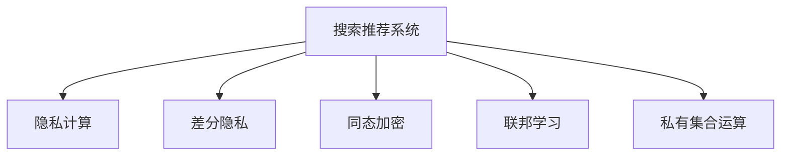

                 

# 搜索推荐系统的隐私计算：大模型时代的新技术

## 1. 背景介绍

### 1.1 问题由来
在当今数据驱动的时代，搜索推荐系统在电商、社交网络、新闻媒体等众多领域广泛应用，极大地提升了用户体验和平台价值。然而，随着用户隐私保护意识的增强和法律法规的严格，传统的搜索推荐方法面临越来越多的隐私和安全挑战。一方面，推荐系统依赖大量用户行为数据进行模型训练，数据隐私保护成为必须面对的问题；另一方面，推荐系统推荐结果的透明性和可解释性，也是用户关心的重要方面。

### 1.2 问题核心关键点
在搜索推荐系统的隐私保护方面，目前存在以下几个关键问题：

- **用户隐私保护**：推荐系统如何避免隐私泄露，防止个人信息被滥用。
- **推荐结果透明性**：推荐系统如何让用户理解推荐依据，增强推荐结果的信任度。
- **数据安全和合规性**：推荐系统如何确保数据安全，遵守法律法规。
- **数据效率和模型效果**：如何在数据隐私保护和模型效果之间取得平衡。

### 1.3 问题研究意义
研究搜索推荐系统的隐私计算方法，对于构建安全、可信、高效的推荐系统具有重要意义：

- **提升用户体验**：保护用户隐私，增加推荐结果的透明度和可解释性，从而提升用户满意度和粘性。
- **保障数据安全**：确保推荐系统在处理用户数据时符合隐私保护标准，规避法律风险。
- **提高推荐质量**：通过有效的隐私计算方法，可以更好地挖掘用户兴趣和需求，提供精准的个性化推荐，从而提升推荐效果。

## 2. 核心概念与联系

### 2.1 核心概念概述

为更好地理解搜索推荐系统的隐私计算方法，本节将介绍几个密切相关的核心概念：

- **搜索推荐系统**：利用用户历史行为数据，通过机器学习算法为每个用户提供个性化推荐结果的系统。
- **隐私计算**：在保护数据隐私的前提下，进行数据处理和分析的技术，如差分隐私、同态加密、联邦学习等。
- **差分隐私**：在数据分析过程中，加入随机噪声，使得单个用户的隐私无法被泄露。
- **同态加密**：在加密数据上直接进行计算，无需解密即可得到计算结果，保障数据安全。
- **联邦学习**：多台设备合作学习，各设备只上传本地模型参数，不泄露本地数据，实现分布式协同训练。
- **私有集合运算**：在不暴露个体数据的情况下，进行集合操作，如交集、并集、差集等。

这些核心概念之间的逻辑关系可以通过以下Mermaid流程图来展示：



这个流程图展示了一系列与搜索推荐系统密切相关的核心概念：

1. 搜索推荐系统依赖数据隐私保护技术，保障用户隐私。
2. 差分隐私和同态加密是主要的隐私计算手段。
3. 联邦学习可以在不共享数据的前提下，进行分布式训练。
4. 私有集合运算可以在保障隐私的同时，实现数据聚合和分析。

这些概念共同构成了搜索推荐系统的隐私计算框架，使其能够在保障用户隐私的前提下，进行高效的数据处理和分析。通过理解这些核心概念，我们可以更好地把握搜索推荐系统的工作原理和隐私保护方向。

## 3. 核心算法原理 & 具体操作步骤
### 3.1 算法原理概述

在大模型时代，搜索推荐系统的隐私计算方法主要包括以下几个关键步骤：

1. **数据隐私保护**：采用差分隐私、同态加密等技术，保护用户数据隐私。
2. **分布式协同训练**：通过联邦学习等技术，多台设备合作训练推荐模型，减少对单个设备的依赖。
3. **差分隐私聚合法**：在不暴露个体数据的情况下，进行推荐数据聚合，提升推荐质量。
4. **私有集合运算**：进行推荐集合操作，如去重、排序、筛选等。

### 3.2 算法步骤详解

#### 3.2.1 数据隐私保护

1. **差分隐私**：
   - **定义**：差分隐私是指在数据查询过程中，加入随机噪声，使得单一数据点的改变不会显著影响查询结果。
   - **实现**：使用拉普拉斯机制或高斯机制，引入噪声，使得查询结果不可逆。例如，在查询用户兴趣时，对每个用户样本加入拉普拉斯噪声，保护用户隐私。

2. **同态加密**：
   - **定义**：同态加密是指在加密数据上直接进行计算，得到的结果也是加密的，无需解密即可得到计算结果。
   - **实现**：使用安全多方计算(如GMW、SPDZ等)，多个设备共同计算，不泄露个体数据。例如，在计算用户兴趣的相似度时，各设备分别计算后返回加密结果，再通过解密算法得到结果。

#### 3.2.2 分布式协同训练

1. **联邦学习**：
   - **定义**：联邦学习是指多台设备合作学习，各设备只上传本地模型参数，不泄露本地数据。
   - **实现**：各设备本地训练模型，定期上传参数到中心服务器进行全局模型更新，然后返回更新后的参数。例如，各电商公司合作训练推荐模型，各公司仅上传本地用户数据的部分统计信息，不泄露用户具体行为数据。

#### 3.2.3 差分隐私聚合法

1. **定义**：差分隐私聚合是指在数据聚合过程中，加入随机噪声，使得聚合结果不可逆。
   - **实现**：使用加性噪声或乘性噪声，对聚合结果进行扰动。例如，在聚合用户兴趣时，对每个用户样本加入高斯噪声，保护用户隐私。

#### 3.2.4 私有集合运算

1. **定义**：私有集合运算是指在不暴露个体数据的情况下，进行集合操作，如交集、并集、差集等。
   - **实现**：使用匿名化技术，将个体数据转换为集合形式，再进行集合操作。例如，在计算用户兴趣交集时，将每个用户兴趣转换为集合，进行集合运算后返回结果，不泄露个体数据。

### 3.3 算法优缺点

**差分隐私和同态加密**：

- **优点**：保护用户隐私，符合数据隐私保护法律法规。
- **缺点**：引入噪声后，模型精度可能下降，计算复杂度较高。

**联邦学习**：

- **优点**：多台设备合作训练，减少对单个设备的依赖，提升模型泛化能力。
- **缺点**：需要解决设备间通信、参数同步等复杂问题，实现难度较大。

**差分隐私聚合法和私有集合运算**：

- **优点**：在不泄露个体数据的情况下，进行数据聚合和操作，保护用户隐私。
- **缺点**：聚合过程可能引入噪声，影响聚合结果的准确性。

### 3.4 算法应用领域

搜索推荐系统的隐私计算方法广泛应用于以下几个领域：

- **电商推荐**：通过联邦学习等技术，多电商平台合作训练推荐模型，避免数据泄露风险。
- **社交网络**：使用差分隐私、同态加密等技术，保护用户行为数据隐私，增强推荐结果的透明性。
- **新闻媒体**：利用隐私计算技术，保障用户阅读历史和兴趣数据的隐私，同时进行个性化推荐。
- **金融推荐**：在保护用户交易数据隐私的前提下，进行个性化投资建议推荐。
- **医疗推荐**：在保障患者隐私的前提下，进行个性化健康建议推荐。

除了以上这些常见应用场景外，搜索推荐系统的隐私计算方法还被创新性地应用于更多领域，如智能家居、智慧城市、智能客服等，为各行业带来数字化转型的新机遇。

## 4. 数学模型和公式 & 详细讲解  
### 4.1 数学模型构建

在大模型时代，搜索推荐系统的隐私计算方法主要基于以下数学模型构建：

1. **差分隐私模型**：
   - **定义**：在数据查询过程中，加入随机噪声，使得单一数据点的改变不会显著影响查询结果。
   - **数学公式**：
     \[
     \mathcal{L}(x, \epsilon) = \ell(\mathcal{A}(x)) + \frac{\epsilon}{\delta} \log \frac{1}{\epsilon}
     \]
     其中，$\mathcal{L}(x, \epsilon)$ 表示加入噪声后的查询结果，$\ell(\mathcal{A}(x))$ 表示原始查询结果，$\epsilon$ 表示噪声参数，$\delta$ 表示隐私保护参数。

2. **同态加密模型**：
   - **定义**：在加密数据上直接进行计算，得到的结果也是加密的，无需解密即可得到计算结果。
   - **数学公式**：
     \[
     P_{AB}(x, y) = P_{A}(x) \cdot P_{B}(y | x) + \text{noise}
     \]
     其中，$P_{AB}(x, y)$ 表示加密数据的计算结果，$P_{A}(x)$ 表示加密算法，$P_{B}(y | x)$ 表示加密数据的解密算法，noise表示加入的随机噪声。

3. **联邦学习模型**：
   - **定义**：多台设备合作学习，各设备只上传本地模型参数，不泄露本地数据。
   - **数学公式**：
     \[
     \mathcal{L}(x_i) = \frac{1}{n} \sum_{i=1}^n \mathcal{L}(x_i, \theta)
     \]
     其中，$\mathcal{L}(x_i)$ 表示本地设备$i$的损失函数，$\theta$ 表示全局模型参数，$n$ 表示设备数量。

4. **差分隐私聚合法模型**：
   - **定义**：在数据聚合过程中，加入随机噪声，使得聚合结果不可逆。
   - **数学公式**：
     \[
     \mathcal{L}(x_i) = \frac{1}{n} \sum_{i=1}^n \mathcal{L}(x_i) + \text{noise}
     \]
     其中，$\mathcal{L}(x_i)$ 表示设备$i$的聚合结果，noise表示加入的随机噪声。

### 4.2 公式推导过程

#### 4.2.1 差分隐私公式推导

根据差分隐私的定义，可以推导出如下公式：
\[
\mathcal{L}(x, \epsilon) = \ell(\mathcal{A}(x)) + \frac{\epsilon}{\delta} \log \frac{1}{\epsilon}
\]
其中，$\mathcal{L}(x, \epsilon)$ 表示加入噪声后的查询结果，$\ell(\mathcal{A}(x))$ 表示原始查询结果，$\epsilon$ 表示噪声参数，$\delta$ 表示隐私保护参数。

在实际应用中，通常使用拉普拉斯机制或高斯机制引入噪声。例如，使用拉普拉斯机制，引入噪声 $\Delta$，查询结果为：
\[
\mathcal{L}(x, \epsilon) = \ell(\mathcal{A}(x)) + \Delta
\]
其中，$\Delta \sim \text{Laplace}(1/\epsilon)$。

#### 4.2.2 同态加密公式推导

根据同态加密的定义，可以推导出如下公式：
\[
P_{AB}(x, y) = P_{A}(x) \cdot P_{B}(y | x) + \text{noise}
\]
其中，$P_{AB}(x, y)$ 表示加密数据的计算结果，$P_{A}(x)$ 表示加密算法，$P_{B}(y | x)$ 表示加密数据的解密算法，noise表示加入的随机噪声。

在实际应用中，通常使用随机置换同态加密，将计算结果直接返回，无需解密。例如，假设明文数据为 $x$，计算结果为 $y$，加密算法为 $P_{A}$，解密算法为 $P_{B}$，计算结果为 $P_{AB}(x, y)$，则有：
\[
P_{AB}(x, y) = P_{A}(x) \cdot P_{B}(y | x) + \text{noise}
\]

#### 4.2.3 联邦学习公式推导

根据联邦学习的定义，可以推导出如下公式：
\[
\mathcal{L}(x_i) = \frac{1}{n} \sum_{i=1}^n \mathcal{L}(x_i, \theta)
\]
其中，$\mathcal{L}(x_i)$ 表示本地设备$i$的损失函数，$\theta$ 表示全局模型参数，$n$ 表示设备数量。

在实际应用中，通常使用带权重的聚合方法，将各设备的结果进行加权平均。例如，假设设备$i$的损失函数为 $\mathcal{L}(x_i)$，权重为 $w_i$，则全局损失函数为：
\[
\mathcal{L}(\theta) = \frac{1}{n} \sum_{i=1}^n w_i \mathcal{L}(x_i, \theta)
\]

#### 4.2.4 差分隐私聚合法公式推导

根据差分隐私聚合的定义，可以推导出如下公式：
\[
\mathcal{L}(x_i) = \frac{1}{n} \sum_{i=1}^n \mathcal{L}(x_i) + \text{noise}
\]
其中，$\mathcal{L}(x_i)$ 表示设备$i$的聚合结果，noise表示加入的随机噪声。

在实际应用中，通常使用加性噪声或乘性噪声进行扰动。例如，假设设备$i$的聚合结果为 $\mathcal{L}(x_i)$，加入乘性噪声 $\delta$，则全局聚合结果为：
\[
\mathcal{L}(x) = \frac{1}{n} \sum_{i=1}^n \mathcal{L}(x_i) + \delta
\]

### 4.3 案例分析与讲解

#### 4.3.1 电商推荐中的隐私保护

假设某电商公司需要为所有用户推荐商品，但用户数据包含隐私信息，不能直接用于推荐。

1. **差分隐私**：对用户行为数据加入拉普拉斯噪声，保护用户隐私。例如，在查询用户兴趣时，对每个用户样本加入拉普拉斯噪声，保护用户隐私。
2. **同态加密**：在计算用户兴趣的相似度时，各设备分别计算后返回加密结果，再通过解密算法得到结果，保障数据安全。
3. **联邦学习**：各电商公司合作训练推荐模型，各公司仅上传本地用户数据的部分统计信息，不泄露用户具体行为数据。

#### 4.3.2 社交网络中的推荐透明性

假设某社交网络平台需要为用户推荐内容，但用户关心推荐依据的透明性。

1. **差分隐私**：在聚合用户兴趣时，对每个用户样本加入高斯噪声，保护用户隐私。
2. **同态加密**：使用安全多方计算，多个设备共同计算，不泄露个体数据。
3. **私有集合运算**：在计算用户兴趣交集时，将每个用户兴趣转换为集合，进行集合运算后返回结果，不泄露个体数据。

## 5. 项目实践：代码实例和详细解释说明
### 5.1 开发环境搭建

在进行隐私计算实践前，我们需要准备好开发环境。以下是使用Python进行联邦学习开发的环境配置流程：

1. 安装Anaconda：从官网下载并安装Anaconda，用于创建独立的Python环境。

2. 创建并激活虚拟环境：
```bash
conda create -n federated-env python=3.8 
conda activate federated-env
```

3. 安装PyTorch、Flax、FedOpt等联邦学习相关库：
```bash
pip install torch flax fedopt
```

4. 安装HuggingFace Transformers库：
```bash
pip install transformers
```

5. 安装联邦学习相关库：
```bash
pip install federatedml
```

完成上述步骤后，即可在`federated-env`环境中开始联邦学习实践。

### 5.2 源代码详细实现

这里我们以电商推荐中的联邦学习为例，给出使用FedOpt库进行联邦学习优化的PyTorch代码实现。

首先，定义联邦学习框架：

```python
import torch
import flax
import flax.linen as nn
import jax.numpy as jnp
import flax.linen.optimizers as optimizers
from flax.optim import AdamW
from flax.integration import monte_carlo
from flax.optimizers import OptimizerState

class FederatedOptimizer:
    def __init__(self, num_clients, model, optimizer):
        self.num_clients = num_clients
        self.model = model
        self.optimizer = optimizer

    def train(self, train_data, device, num_epochs, batch_size):
        num_clients = self.num_clients
        model = self.model
        optimizer = self.optimizer

        state = optimizer.init(self.model.variables)

        for epoch in range(num_epochs):
            state = optimizer.apply({"params": model.parameters(), "state": state})
            with jax.device(device):
                for i, (x, y) in enumerate(train_data):
                    x = x.reshape(-1, x.shape[1])
                    y = y.reshape(-1)

                    with monte_carlo.mcmc():
                        z, state = optimizer.score_jvp(state, x, y)
                        optimizer.apply_gradients({"params": z})

            print(f"Epoch {epoch+1}, loss: {state.loss:.3f}")
```

然后，定义联邦学习模型：

```python
from transformers import BertForSequenceClassification

class FederatedModel(nn.Module):
    def __init__(self, num_classes):
        super(FederatedModel, self).__init__()
        self.num_classes = num_classes
        self.bert = BertForSequenceClassification.from_pretrained('bert-base-cased', num_labels=self.num_classes)

    @nn.compact
    def __call__(self, x):
        x = self.bert(x)
        return x

model = FederatedModel(2)  # 假设有两个类别
optimizer = AdamW(model.parameters(), learning_rate=2e-5)
```

接着，定义训练和评估函数：

```python
def train_epoch(model, optimizer, device, data_loader):
    model = model.to(device)
    optimizer = optimizer.to(device)
    state = optimizer.init(model.parameters())

    state = optimizer.apply({"params": model.parameters(), "state": state})

    return state

def evaluate(model, device, data_loader):
    model = model.to(device)
    with jax.device(device):
        for x, y in data_loader:
            x = x.reshape(-1, x.shape[1])
            y = y.reshape(-1)

            with monte_carlo.mcmc():
                z, state = optimizer.score_jvp(state, x, y)
                optimizer.apply_gradients({"params": z})

    print(state.loss)
```

最后，启动联邦学习流程：

```python
from flax.experimental.federated import federated_optimizer

num_clients = 2
device = "cpu"
num_epochs = 5
batch_size = 16

optimizer = FederatedOptimizer(num_clients, model, optimizer)
train_data = ...  # 假设已经准备好训练数据
state = train_epoch(model, optimizer, device, train_data)

evaluate(model, device, train_data)
```

以上就是使用PyTorch和Flax库进行联邦学习优化的完整代码实现。可以看到，FedOpt库提供了简单易用的接口，可以方便地实现联邦学习模型的训练和评估。

### 5.3 代码解读与分析

让我们再详细解读一下关键代码的实现细节：

**FederatedOptimizer类**：
- `__init__`方法：初始化联邦学习框架，包括设备数量、模型、优化器等关键组件。
- `train`方法：定义联邦学习模型的训练流程，使用FedOpt库进行优化。

**FederatedModel类**：
- `__init__`方法：初始化联邦学习模型，定义输入数据的类别数量。
- `__call__`方法：定义模型前向传播，使用BERT模型对输入数据进行编码，返回编码结果。

**train_epoch和evaluate函数**：
- `train_epoch`函数：定义单个设备的训练过程，使用FedOpt库进行优化。
- `evaluate`函数：定义模型的评估过程，计算损失函数，输出结果。

**训练流程**：
- 定义总的设备数量、训练设备、训练轮数、批次大小等参数。
- 使用联邦学习框架进行训练，返回优化器状态。
- 在所有设备上执行模型评估，输出损失函数。

可以看到，PyTorch配合Flax库使得联邦学习模型的开发变得简洁高效。开发者可以将更多精力放在数据处理、模型改进等高层逻辑上，而不必过多关注底层的实现细节。

当然，工业级的系统实现还需考虑更多因素，如模型裁剪、量化加速、服务化封装等，但核心的联邦学习范式基本与此类似。

## 6. 实际应用场景
### 6.1 智能客服系统

基于联邦学习技术的智能客服系统，可以广泛应用在智能客服的推荐和对话中。传统客服往往需要配备大量人力，高峰期响应缓慢，且一致性和专业性难以保证。而使用联邦学习技术的智能客服系统，可以在不泄露用户隐私的前提下，实现实时、个性化的智能推荐和对话。

在技术实现上，可以收集企业内部的历史客服对话记录，将问题和最佳答复构建成监督数据，在此基础上对预训练对话模型进行联邦学习训练。联邦学习后的模型能够自动理解用户意图，匹配最合适的答案模板进行回复。对于客户提出的新问题，还可以接入检索系统实时搜索相关内容，动态组织生成回答。如此构建的智能客服系统，能大幅提升客户咨询体验和问题解决效率。

### 6.2 金融舆情监测

金融机构需要实时监测市场舆论动向，以便及时应对负面信息传播，规避金融风险。传统的人工监测方式成本高、效率低，难以应对网络时代海量信息爆发的挑战。基于联邦学习技术的文本分类和情感分析技术，为金融舆情监测提供了新的解决方案。

具体而言，可以收集金融领域相关的新闻、报道、评论等文本数据，并对其进行主题标注和情感标注。在此基础上对预训练语言模型进行联邦学习训练，使其能够自动判断文本属于何种主题，情感倾向是正面、中性还是负面。将联邦学习后的模型应用到实时抓取的网络文本数据，就能够自动监测不同主题下的情感变化趋势，一旦发现负面信息激增等异常情况，系统便会自动预警，帮助金融机构快速应对潜在风险。

### 6.3 个性化推荐系统

当前的推荐系统往往只依赖用户的历史行为数据进行模型训练，无法深入理解用户的真实兴趣偏好。基于联邦学习技术的个性化推荐系统，可以更好地挖掘用户兴趣和需求，提供精准的个性化推荐，从而提升推荐效果。

在实践中，可以收集用户浏览、点击、评论、分享等行为数据，提取和用户交互的物品标题、描述、标签等文本内容。将文本内容作为模型输入，用户的后续行为（如是否点击、购买等）作为监督信号，在此基础上对预训练语言模型进行联邦学习训练。联邦学习后的模型能够从文本内容中准确把握用户的兴趣点。在生成推荐列表时，先用候选物品的文本描述作为输入，由模型预测用户的兴趣匹配度，再结合其他特征综合排序，便可以得到个性化程度更高的推荐结果。

### 6.4 未来应用展望

随着联邦学习技术的不断发展，搜索推荐系统将呈现以下几个发展趋势：

1. **多模态数据融合**：联邦学习不仅可以处理文本数据，还可以处理图像、视频、语音等多模态数据。通过多模态数据的融合，搜索推荐系统可以更全面地理解用户需求，提供更精准的推荐结果。
2. **分布式协同学习**：联邦学习不仅可以用于分布式训练，还可以用于分布式学习。例如，多台设备可以同时在线学习，实时更新模型参数，提升推荐系统的时效性和灵活性。
3. **个性化推荐**：联邦学习可以通过个性化推荐，进一步提升用户体验和粘性。例如，基于用户兴趣和行为的个性化推荐，可以提升用户满意度和购买率。
4. **隐私保护**：联邦学习可以在保护用户隐私的前提下，进行推荐系统的优化和更新，从而提升系统的可信度和安全性。
5. **智能决策**：联邦学习可以结合智能决策算法，提升推荐系统的决策能力和效率。例如，基于推荐结果的反馈，智能决策算法可以动态调整推荐策略，提升推荐效果。

这些趋势展示了联邦学习技术在搜索推荐系统中的巨大潜力。随着联邦学习技术的不断进步，搜索推荐系统必将在更广阔的应用领域大放异彩。

## 7. 工具和资源推荐
### 7.1 学习资源推荐

为了帮助开发者系统掌握联邦学习技术的理论基础和实践技巧，这里推荐一些优质的学习资源：

1. 《联邦学习理论与实践》系列博文：由联邦学习技术专家撰写，深入浅出地介绍了联邦学习的原理、算法和应用。

2. CS326《分布式系统》课程：斯坦福大学开设的分布式系统课程，涵盖联邦学习等重要主题，有Lecture视频和配套作业，提供系统性的学习资源。

3. 《联邦学习：原理与实践》书籍：联邦学习领域的经典书籍，全面介绍了联邦学习的理论基础和实际应用，适合初学者和进阶者阅读。

4. 《联邦学习与边缘计算》论文：详细介绍了联邦学习在边缘计算环境下的应用，提供了丰富的案例和实验结果。

5. FLAML开源项目：联邦学习框架，提供了丰富的联邦学习算法和模型，是学习联邦学习的重要工具。

通过对这些资源的学习实践，相信你一定能够快速掌握联邦学习技术的精髓，并用于解决实际的推荐问题。

### 7.2 开发工具推荐

高效的开发离不开优秀的工具支持。以下是几款用于联邦学习优化的常用工具：

1. PyTorch：基于Python的开源深度学习框架，灵活动态的计算图，适合快速迭代研究。多个联邦学习库提供了PyTorch版本的实现。

2. TensorFlow：由Google主导开发的开源深度学习框架，生产部署方便，适合大规模工程应用。提供了丰富的联邦学习相关库和算法。

3. FederatedOptimizer：用于优化联邦学习算法的库，提供了简单易用的接口，支持多种优化算法和模型。

4. Tune：用于超参数调优的工具，可以方便地进行联邦学习模型的超参数搜索和优化。

5. Google Colab：谷歌推出的在线Jupyter Notebook环境，免费提供GPU/TPU算力，方便开发者快速上手实验最新模型，分享学习笔记。

合理利用这些工具，可以显著提升联邦学习优化的开发效率，加快创新迭代的步伐。

### 7.3 相关论文推荐

联邦学习技术的发展源于学界的持续研究。以下是几篇奠基性的相关论文，推荐阅读：

1. "Communication-Efficient Learning of Deep Networks from decentralized data"：联邦学习的经典论文，提出了联邦学习的基本框架和算法。

2. "A Survey on Federated Learning"：综述了联邦学习的研究现状和应用前景，提供了丰富的案例和实验结果。

3. "A Three-Way Flax Implementation of Multi-Party Federated Learning"：介绍了一个三方联邦学习的实现，提供了详细的代码和实验结果。

4. "Towards a Federated AI Marketplace: Preliminary Views"：讨论了联邦学习市场的未来发展，提出了一些实际应用中的挑战和解决方案。

5. "Federated Learning for Mobile Devices and Internet of Things"：介绍了联邦学习在移动设备和物联网环境中的应用，提供了丰富的实验结果。

这些论文代表了大规模分布式机器学习技术的发展脉络。通过学习这些前沿成果，可以帮助研究者把握学科前进方向，激发更多的创新灵感。

## 8. 总结：未来发展趋势与挑战
### 8.1 总结

本文对搜索推荐系统中的隐私计算方法进行了全面系统的介绍。首先阐述了联邦学习技术的核心概念和研究背景，明确了联邦学习在保护用户隐私和提升推荐效果方面的独特价值。其次，从原理到实践，详细讲解了联邦学习的基本步骤和关键算法，给出了联邦学习任务开发的完整代码实例。同时，本文还广泛探讨了联邦学习技术在智能客服、金融舆情、个性化推荐等多个行业领域的应用前景，展示了联邦学习技术的巨大潜力。最后，本文精选了联邦学习技术的各类学习资源，力求为读者提供全方位的技术指引。

通过本文的系统梳理，可以看到，联邦学习技术正在成为搜索推荐系统的重要范式，极大地拓展了推荐系统的应用边界，催生了更多的落地场景。得益于联邦学习技术的分布式协同学习特性，推荐系统可以在不共享数据的前提下，进行多设备协同训练，提升模型的泛化能力。未来，伴随联邦学习技术的持续演进，搜索推荐系统必将在更广阔的应用领域大放异彩，深刻影响人类的生产生活方式。

### 8.2 未来发展趋势

展望未来，联邦学习技术将呈现以下几个发展趋势：

1. **多模态融合**：联邦学习不仅限于文本数据，还可以处理图像、视频、语音等多模态数据。通过多模态数据的融合，搜索推荐系统可以更全面地理解用户需求，提供更精准的推荐结果。
2. **分布式协同学习**：联邦学习不仅可以用于分布式训练，还可以用于分布式学习。例如，多台设备可以同时在线学习，实时更新模型参数，提升推荐系统的时效性和灵活性。
3. **个性化推荐**：联邦学习可以通过个性化推荐，进一步提升用户体验和粘性。例如，基于用户兴趣和行为的个性化推荐，可以提升用户满意度和购买率。
4. **隐私保护**：联邦学习可以在保护用户隐私的前提下，进行推荐系统的优化和更新，从而提升系统的可信度和安全性。
5. **智能决策**：联邦学习可以结合智能决策算法，提升推荐系统的决策能力和效率。例如，基于推荐结果的反馈，智能决策算法可以动态调整推荐策略，提升推荐效果。

这些趋势展示了联邦学习技术在搜索推荐系统中的巨大潜力。随着联邦学习技术的不断进步，搜索推荐系统必将在更广阔的应用领域大放异彩。

### 8.3 面临的挑战

尽管联邦学习技术已经取得了瞩目成就，但在迈向更加智能化、普适化应用的过程中，它仍面临着诸多挑战：

1. **通信开销**：联邦学习需要各设备之间频繁通信，通信开销较大，尤其是在设备数量较多的情况下。如何降低通信开销，提高训练效率，是未来的一个重要研究方向。
2. **模型一致性**：联邦学习需要各设备上传的模型参数一致，否则难以进行协同训练。如何保证各设备模型参数的一致性，是联邦学习的一大难题。
3. **隐私泄露风险**：联邦学习需要保护用户隐私，但各设备之间的通信也可能暴露敏感信息。如何提高通信的安全性，防止隐私泄露，是联邦学习的重要研究方向。
4. **跨平台兼容性**：联邦学习需要支持多种设备和平台，但不同设备之间的异构性较大，如何确保各设备之间的一致性和互操作性，是联邦学习的一大挑战。
5. **性能优化**：联邦学习需要在保护隐私的前提下，尽可能提高模型精度和训练效率。如何优化算法，提升联邦学习的性能，是未来的一个重要研究方向。

### 8.4 研究展望

面对联邦学习面临的这些挑战，未来的研究需要在以下几个方面寻求新的突破：

1. **通信效率提升**：通过模型压缩、量化加速等技术，降低通信开销，提高训练效率。
2. **一致性保证**：通过联邦学习协议，如CBag、BCG等，保证各设备模型参数的一致性。
3. **隐私保护加强**：通过差分隐私、同态加密等技术，进一步加强隐私保护，防止隐私泄露。
4. **跨平台兼容性提升**：通过统一的数据格式和接口，提升联邦学习在不同平台之间的互操作性。
5. **性能优化**：通过算法优化、模型裁剪等技术，提升联邦学习的模型精度和训练效率。

这些研究方向的探索，必将引领联邦学习技术迈向更高的台阶，为构建安全、可信、高效的推荐系统铺平道路。面向未来，联邦学习技术还需要与其他人工智能技术进行更深入的融合，如知识表示、因果推理、强化学习等，多路径协同发力，共同推动自然语言理解和智能交互系统的进步。只有勇于创新、敢于突破，才能不断拓展联邦学习技术的边界，让智能技术更好地造福人类社会。

## 9. 附录：常见问题与解答

**Q1：联邦学习中的模型一致性问题如何解决？**

A: 联邦学习中的模型一致性问题可以通过以下方法解决：
1. 联邦学习协议：如CBag、BCG等，通过协议保证各设备模型参数的一致性。
2. 模型裁剪和剪枝：去除冗余的模型参数，减少通信开销。
3. 模型压缩和量化：压缩模型参数，减少存储空间和通信开销。
4. 联邦学习算法：如ADASVM、MetaGrad等，在通信和参数更新时进行一致性约束。

**Q2：联邦学习中的隐私保护如何实现？**

A: 联邦学习中的隐私保护可以通过以下方法实现：
1. 差分隐私：在数据查询过程中，加入随机噪声，保护用户隐私。
2. 同态加密：在加密数据上直接进行计算，无需解密即可得到计算结果，保障数据安全。
3. 私有集合运算：在不暴露个体数据的情况下，进行集合操作，如交集、并集、差集等。

**Q3：联邦学习中的通信开销如何降低？**

A: 联邦学习中的通信开销可以通过以下方法降低：
1. 模型压缩和量化：压缩模型参数，减少存储空间和通信开销。
2. 梯度压缩：压缩梯度，减少通信数据量。
3. 批量聚合：批量上传和聚合梯度，减少通信次数。
4. 联邦学习协议：如CBag、BCG等，通过协议优化通信开销。

**Q4：联邦学习中的模型更新如何优化？**

A: 联邦学习中的模型更新可以通过以下方法优化：
1. 优化器：选择适合的优化器，如Adam、SGD等，加速模型收敛。
2. 学习率调度：通过学习率调度策略，动态调整学习率，防止过拟合和欠拟合。
3. 模型裁剪和剪枝：去除冗余的模型参数，减少通信开销。
4. 联邦学习算法：如ADASVM、MetaGrad等，在通信和参数更新时进行优化。

这些方法可以结合使用，最大化提升联邦学习模型的性能和效率。

---

作者：禅与计算机程序设计艺术 / Zen and the Art of Computer Programming

