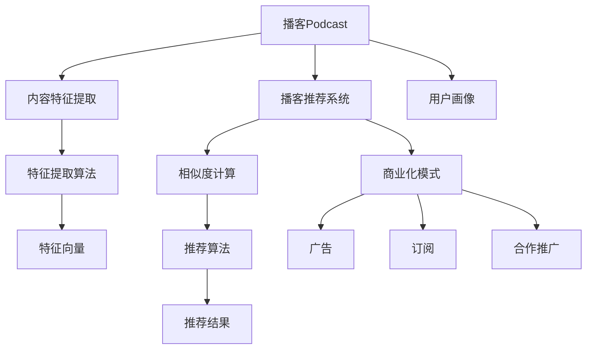

                 

## 1. 背景介绍

### 1.1 问题由来
随着音频内容（如播客Podcast）在流媒体平台上的兴起，越来越多的创业者和企业开始意识到音频内容在信息传播和娱乐消费中的巨大价值。播客作为一种新兴的信息载体，具有高度个性化、内容丰富、互动性强等特点，能够帮助用户快速获取所需信息，满足多样化、碎片化的学习娱乐需求。然而，随着播客数量的激增，如何在海量音频内容中发现和推荐优质的播客，成为了亟待解决的问题。

### 1.2 问题核心关键点
针对播客内容推荐和商业化的问题，本节将从以下核心关键点进行探讨：

- **用户需求分析**：不同用户对于播客的需求有何不同？如何构建用户画像和兴趣模型？
- **内容特征提取**：播客内容包含哪些特征？如何利用音频特征进行内容相似度计算？
- **推荐系统框架**：如何设计一个高效、准确的推荐系统，保证用户体验？
- **商业化模式探索**：播客内容商业化的常见模式有哪些？如何构建可持续的商业模式？

### 1.3 问题研究意义
研究播客内容的推荐和商业化问题，对于推动播客行业的健康发展，满足用户多样化需求，具有重要意义：

1. **提升用户体验**：通过精准的播客推荐，帮助用户发现更多感兴趣的播客内容，提升用户黏性和满意度。
2. **促进内容生产**：商业化的播客内容有助于吸引更多内容创作者，丰富播客市场，形成良性循环。
3. **驱动经济增长**：播客产业的繁荣能够带动相关领域的经济发展，如广告、市场营销、技术服务等。
4. **增强社会影响力**：高质量的播客内容有助于传递正能量，引导公众正确的价值观和行为方式。

## 2. 核心概念与联系

### 2.1 核心概念概述

为更好地理解播客内容的推荐和商业化方法，本节将介绍几个密切相关的核心概念：

- **播客Podcast**：指一系列连续的音频内容，通常由一个或多个播客主定期发布，以讲述故事、访谈嘉宾、讨论话题等内容形式呈现。
- **播客推荐系统**：基于用户兴趣和播客内容特征，推荐适合用户个性化需求的播客内容。
- **商业化模式**：通过广告、订阅、合作推广等方式，将播客内容转化为商业价值的过程。
- **用户画像**：根据用户行为、偏好、社交网络等信息，构建用户特征模型。
- **内容特征提取**：利用音频处理技术，从播客内容中提取有价值的特征，用于相似度计算和推荐。

这些核心概念之间的逻辑关系可以通过以下Mermaid流程图来展示：



这个流程图展示了大规模播客推荐和商业化的核心概念及其之间的关系：

1. 播客内容通过特征提取获得有价值的信息。
2. 播客推荐系统利用这些特征进行相似度计算，推荐适合用户的播客。
3. 播客内容通过不同的商业化模式实现其商业价值。
4. 用户画像帮助构建个性化的推荐系统。

这些概念共同构成了播客推荐和商业化的基础框架，使得播客内容能够更好地服务于用户，并转化为经济效益。

## 3. 核心算法原理 & 具体操作步骤
### 3.1 算法原理概述

播客内容的推荐和商业化方法主要基于用户行为数据和播客内容特征，构建推荐系统，并通过商业化模式进行变现。其核心算法原理可概括为：

1. **用户画像构建**：通过对用户历史行为数据的分析，构建用户兴趣模型，了解用户偏好。
2. **内容特征提取**：利用音频处理技术，从播客内容中提取关键特征，如音频时长、节奏、语言等。
3. **相似度计算**：通过计算播客内容和用户兴趣的相似度，找到适合用户的播客。
4. **推荐算法优化**：选择或设计合适的推荐算法，实现精准的播客推荐。
5. **商业化策略制定**：结合推荐结果，制定商业化策略，如广告投放、付费订阅、合作推广等。

### 3.2 算法步骤详解

播客推荐和商业化的具体实现步骤如下：

**Step 1: 数据收集与处理**
- 收集用户行为数据，包括听播客时间、次数、评分等。
- 收集播客内容数据，包括播客标题、摘要、标签、时长、音频特征等。
- 数据清洗和预处理，去除噪声和异常值，保证数据质量。

**Step 2: 用户画像构建**
- 利用用户行为数据，构建用户兴趣模型，如TF-IDF模型、协同过滤模型等。
- 通过用户画像模型，计算用户对不同播客内容的兴趣程度，生成用户特征向量。

**Step 3: 内容特征提取**
- 利用音频处理技术，提取播客内容的音频特征，如音量、节奏、语速等。
- 将音频特征转化为数值化的特征向量，方便进行相似度计算。

**Step 4: 相似度计算与推荐算法**
- 利用欧氏距离、余弦相似度等方法，计算用户画像和播客内容特征的相似度。
- 选择或设计合适的推荐算法，如基于内容的推荐、协同过滤推荐等。
- 根据相似度计算结果，生成推荐列表，推荐给用户。

**Step 5: 商业化策略执行**
- 结合推荐结果，制定商业化策略，如针对推荐播客投放相关广告。
- 提供付费订阅服务，鼓励用户付费听播客。
- 与播客主合作推广，提高播客曝光率和用户黏性。

### 3.3 算法优缺点

基于特征向量的播客推荐系统具有以下优点：
1. **高效性**：通过数值化特征的相似度计算，推荐过程高效，适合大规模数据处理。
2. **灵活性**：能够根据不同的用户画像和内容特征，动态调整推荐结果，满足个性化需求。
3. **可解释性**：推荐结果有明确的数学依据，便于解释和优化。

但该方法也存在一定的局限性：
1. **数据需求大**：需要大量的用户行为数据和内容特征数据，获取难度较大。
2. **特征选择困难**：不同播客内容之间的特征差异较大，选择合适的特征对推荐效果影响大。
3. **冷启动问题**：对于新用户和未播过的播客，推荐效果可能较差。
4. **多样性不足**：推荐结果可能存在一定的偏向性，导致多样性不足。

尽管存在这些局限性，基于特征向量的推荐方法仍是播客推荐和商业化的主流范式。未来相关研究将更多关注如何更好地利用用户反馈和内容特征，优化推荐算法和商业化策略，提升推荐效果。

### 3.4 算法应用领域

基于特征向量的播客推荐方法，已经在播客平台如Spotify、Apple Podcasts、Pandora等得到广泛应用。以下是一些典型的应用场景：

- **个性化推荐**：利用用户行为数据和内容特征，推荐适合用户的播客内容，提升用户满意度。
- **内容发现**：帮助用户发现新播客内容，丰富用户的播客库。
- **广告投放**：通过播客推荐，将广告精准投放给感兴趣的用户，提升广告效果。
- **订阅推荐**：根据用户兴趣推荐适合订阅的播客，增加平台订阅量。
- **合作推广**：与播客主合作推广播客，扩大播客曝光率和用户基础。

除了上述这些经典应用外，播客推荐系统还广泛应用于播客内容分析、用户行为分析、播客内容优化等诸多场景中，为播客平台带来了巨大的商业价值。

## 4. 数学模型和公式 & 详细讲解 & 举例说明
### 4.1 数学模型构建

在播客推荐系统中，数学模型的构建主要涉及用户画像、内容特征提取和相似度计算。以下是对这些模型的详细构建过程：

**用户画像模型**：
- **TF-IDF模型**：统计每个用户对不同播客的兴趣程度，得到用户兴趣向量。
- **协同过滤模型**：利用用户之间的相似性，通过相似用户的行为预测新用户的兴趣。

**内容特征提取模型**：
- **MFCC特征提取**：提取音频的MFCC特征，用于分析音频节奏和语调。
- **语速和音量分析**：提取播客的语速和音量信息，用于区分播客风格。

**相似度计算模型**：
- **欧式距离**：计算用户画像和内容特征的欧式距离，用于衡量相似度。
- **余弦相似度**：计算用户画像和内容特征的余弦相似度，用于衡量相似度。

### 4.2 公式推导过程

以下我们以余弦相似度为例，详细推导播客内容和用户画像的相似度计算公式。

假设用户画像为向量 $\vec{u} = (u_1, u_2, ..., u_n)$，内容特征为向量 $\vec{c} = (c_1, c_2, ..., c_n)$。余弦相似度公式为：

$$
\text{similarity} = \cos(\theta) = \frac{\vec{u} \cdot \vec{c}}{||\vec{u}|| \cdot ||\vec{c}||}
$$

其中 $\cdot$ 表示向量的点乘运算，$||\vec{u}||$ 和 $||\vec{c}||$ 分别为向量的模长。

点乘运算定义为：

$$
\vec{u} \cdot \vec{c} = \sum_{i=1}^n u_i \cdot c_i
$$

模长定义为：

$$
||\vec{u}|| = \sqrt{\sum_{i=1}^n u_i^2}
$$

**案例分析与讲解**：
假设用户画像 $\vec{u} = (0.5, 0.3, 0.2, 0)$，内容特征 $\vec{c} = (0.3, 0.4, 0.1, 0.2)$。则余弦相似度为：

$$
\text{similarity} = \frac{0.5 \cdot 0.3 + 0.3 \cdot 0.4 + 0.2 \cdot 0.1 + 0 \cdot 0.2}{\sqrt{0.5^2 + 0.3^2 + 0.2^2} \cdot \sqrt{0.3^2 + 0.4^2 + 0.1^2 + 0.2^2}}
$$

计算得到：

$$
\text{similarity} = \frac{0.3 + 0.12 + 0.02 + 0}{\sqrt{0.25 + 0.09 + 0.04} \cdot \sqrt{0.09 + 0.16 + 0.01 + 0.04}} = 0.5
$$

说明用户画像和内容特征的相似度为0.5，表示用户对播客内容有一定的兴趣。

## 5. 项目实践：代码实例和详细解释说明
### 5.1 开发环境搭建

在进行播客推荐和商业化开发前，我们需要准备好开发环境。以下是使用Python进行项目开发的环境配置流程：

1. 安装Anaconda：从官网下载并安装Anaconda，用于创建独立的Python环境。

2. 创建并激活虚拟环境：
```bash
conda create -n podcast-env python=3.8 
conda activate podcast-env
```

3. 安装PyTorch：根据CUDA版本，从官网获取对应的安装命令。例如：
```bash
conda install pytorch torchvision torchaudio cudatoolkit=11.1 -c pytorch -c conda-forge
```

4. 安装TensorFlow：
```bash
pip install tensorflow
```

5. 安装NumPy、Pandas等常用库：
```bash
pip install numpy pandas
```

完成上述步骤后，即可在`podcast-env`环境中开始项目开发。

### 5.2 源代码详细实现

以下是一个简化的播客推荐系统的Python代码实现，包括数据处理、用户画像构建、内容特征提取、相似度计算和推荐算法：

```python
import pandas as pd
import numpy as np
from sklearn.feature_extraction.text import TfidfVectorizer
from sklearn.metrics.pairwise import cosine_similarity
import librosa

# 数据处理
df = pd.read_csv('podcast_data.csv')
df = df.dropna()

# 用户画像构建（TF-IDF模型）
vectorizer = TfidfVectorizer()
user_profiles = vectorizer.fit_transform(df['text'])
user_profiles = user_profiles.toarray()

# 内容特征提取（MFCC特征）
features = []
for audio_path in df['audio_path']:
    y, sr = librosa.load(audio_path)
    mfcc = librosa.feature.mfcc(y, sr)
    features.append(mfcc.mean(axis=0))

# 相似度计算
similarity_matrix = cosine_similarity(user_profiles, np.array(features))

# 推荐算法（协同过滤）
def recommend_podcasts(user_index, n_recommendations):
    similar_user_indices = np.argsort(similarity_matrix[user_index])[::-1][1:n]
    recommended_podcasts = []
    for user_index in similar_user_indices:
        similar_podcasts = df[df['user_id'] == user_index]['podcast_id']
        recommended_podcasts.extend(similar_podcasts)
    return list(set(recommended_podcasts))

# 测试推荐系统
user_index = 0
recommended_podcasts = recommend_podcasts(user_index, 5)
print(recommended_podcasts)
```

以上代码实现了基于TF-IDF和MFCC特征的协同过滤推荐算法，可以根据用户画像和内容特征进行播客推荐。

### 5.3 代码解读与分析

以下是代码的详细解读和分析：

**数据处理**：
- 使用Pandas库读取播客数据，去除了缺失值。
- 使用TF-IDF模型对用户文本数据进行特征提取，得到用户兴趣向量。

**内容特征提取**：
- 使用Librosa库对音频数据进行MFCC特征提取，得到音频节奏和语调信息。
- 将音频特征转换为特征向量，用于后续相似度计算。

**相似度计算**：
- 使用Scikit-Learn库中的cosine_similarity函数计算用户画像和内容特征的余弦相似度。
- 生成相似度矩阵，表示用户画像和内容特征之间的相似度。

**推荐算法**：
- 通过协同过滤算法，根据相似用户的播客推荐给目标用户。
- 测试推荐系统，输出推荐结果。

## 6. 实际应用场景
### 6.1 智能播客推荐
智能播客推荐系统可以帮助用户快速发现感兴趣的播客内容，提高用户的播客体验和黏性。在实际应用中，可以将用户历史行为数据和播客内容特征输入推荐系统，自动生成推荐列表，推送给用户。

### 6.2 播客内容分析
播客内容分析系统可以用于播客平台的运营优化和用户行为研究。通过分析用户的听播习惯、偏好变化等数据，可以优化播客内容推荐，提高用户满意度。

### 6.3 广告投放优化
利用播客推荐系统的推荐结果，可以精准投放广告，提升广告效果和投资回报率。通过分析用户的推荐播客，识别潜在客户，进行有针对性的广告推广。

### 6.4 用户画像构建
用户画像的构建可以用于多种应用场景，如个性化推荐、广告投放、用户细分等。通过构建用户画像，可以更深入地了解用户需求和行为，提高营销和服务的精准度。

### 6.5 商业合作
播客平台可以通过商业合作，引入更多高质量的播客内容，丰富播客库。通过与播客主合作推广，扩大播客的影响力和用户基础。

## 7. 工具和资源推荐
### 7.1 学习资源推荐

为了帮助开发者系统掌握播客推荐和商业化的理论基础和实践技巧，这里推荐一些优质的学习资源：

1. **《深度学习推荐系统》**：介绍深度学习在推荐系统中的应用，包括TF-IDF、协同过滤、深度神经网络等方法。

2. **《Python推荐系统》**：深入浅出地介绍了推荐系统的构建、优化和应用。

3. **Coursera《Recommender Systems》课程**：斯坦福大学开设的推荐系统课程，涵盖推荐系统的基本概念和算法实现。

4. **Kaggle竞赛**：参与Kaggle的推荐系统竞赛，实战练习，积累经验。

5. **播客平台公开资料**：如Spotify的播客推荐系统，了解实际应用中的技术和策略。

通过对这些资源的学习实践，相信你一定能够快速掌握播客推荐和商业化的精髓，并用于解决实际的播客问题。

### 7.2 开发工具推荐

高效的开发离不开优秀的工具支持。以下是几款用于播客推荐系统开发的常用工具：

1. **PyTorch**：基于Python的开源深度学习框架，灵活动态的计算图，适合快速迭代研究。

2. **TensorFlow**：由Google主导开发的开源深度学习框架，生产部署方便，适合大规模工程应用。

3. **Scikit-Learn**：Python数据科学库，包含丰富的机器学习算法和工具。

4. **Jupyter Notebook**：交互式的代码编写和执行环境，方便开发和调试。

5. **Librosa**：Python音频处理库，支持MFCC特征提取、音频分析等。

6. **Pandas**：Python数据分析库，支持数据处理和分析。

合理利用这些工具，可以显著提升播客推荐系统的开发效率，加快创新迭代的步伐。

### 7.3 相关论文推荐

播客推荐和商业化的研究源于学界的持续研究。以下是几篇奠基性的相关论文，推荐阅读：

1. **"Collaborative Filtering for Implicit Feedback Datasets"**：介绍协同过滤算法的原理和应用，是推荐系统的重要基础。

2. **"Item-Based Collaborative Filtering with Multiple Contexts"**：提出基于物品的协同过滤算法，并引入上下文信息，提高推荐效果。

3. **"Deep Learning Recommendation Systems"**：总结了深度学习在推荐系统中的应用，涵盖了多种深度学习模型和优化方法。

4. **"Personalized PageRank for Recommender Systems"**：提出个性化PageRank算法，将PageRank和推荐系统结合，提升推荐效果。

5. **"Efficient Estimation of Word Representations in Vector Space"**：介绍Word2Vec模型，利用词向量技术提升推荐系统的性能。

这些论文代表了大语言模型微调技术的发展脉络。通过学习这些前沿成果，可以帮助研究者把握学科前进方向，激发更多的创新灵感。

## 8. 总结：未来发展趋势与挑战

### 8.1 总结

本文对播客内容的推荐和商业化方法进行了全面系统的介绍。首先阐述了播客推荐和商业化的研究背景和意义，明确了推荐系统在提升用户体验、促进内容生产、驱动商业增长等方面的独特价值。其次，从原理到实践，详细讲解了推荐系统的数学模型和算法步骤，给出了播客推荐系统的代码实现。同时，本文还广泛探讨了播客推荐和商业化在智能推荐、内容分析、广告投放、用户画像构建等多个领域的应用前景，展示了推荐范式的巨大潜力。最后，本文精选了推荐技术的各类学习资源，力求为读者提供全方位的技术指引。

通过本文的系统梳理，可以看到，基于特征向量的播客推荐系统正在成为播客推荐和商业化的重要范式，极大地提升了播客内容的用户体验，推动了播客行业的健康发展。未来，伴随推荐算法和商业化模式的不断演进，播客推荐系统必将更加精准高效，为播客平台带来更多的商业价值和用户黏性。

### 8.2 未来发展趋势

展望未来，播客推荐和商业化技术将呈现以下几个发展趋势：

1. **个性化推荐提升**：通过深度学习和增强学习等方法，提升个性化推荐效果，满足用户多样化需求。
2. **多样性保障**：引入多样性约束，确保推荐结果的多样性和覆盖度，避免推荐单一内容。
3. **冷启动优化**：针对新用户和未播过的播客，引入推荐算法和用户画像构建的优化策略，提高推荐效果。
4. **数据融合技术**：将社交网络、行为数据、语义信息等多源数据融合，提升推荐系统性能。
5. **实时推荐系统**：构建实时推荐系统，动态调整推荐结果，提升用户体验。
6. **交互式推荐**：引入用户反馈机制，动态调整推荐算法和内容特征，提高推荐系统适应性。

以上趋势凸显了播客推荐和商业化技术的广阔前景。这些方向的探索发展，必将进一步提升播客内容的推荐效果，为播客平台带来更大的商业价值和用户基础。

### 8.3 面临的挑战

尽管播客推荐和商业化技术已经取得了瞩目成就，但在迈向更加智能化、普适化应用的过程中，仍面临诸多挑战：

1. **数据隐私和安全性**：播客推荐和商业化过程中涉及大量用户行为数据和内容数据，如何保护用户隐私，确保数据安全性，是一大难题。
2. **冷启动问题**：对于新用户和未播过的播客，推荐效果可能较差，需要更多探索冷启动优化方法。
3. **多样性不足**：推荐结果可能存在一定的偏向性，导致多样性不足。
4. **系统复杂性**：播客推荐系统涉及多种算法和数据源，系统设计和维护复杂度较高。
5. **计算资源消耗大**：处理大规模数据和模型推理，需要高计算资源，成本较高。
6. **用户行为变化快**：用户兴趣和行为变化快，需要快速调整推荐策略，保持系统灵活性。

正视这些挑战，积极应对并寻求突破，将是大规模播客推荐系统走向成熟的必由之路。相信随着学界和产业界的共同努力，这些挑战终将一一被克服，播客推荐和商业化技术必将迎来更加成熟和完善的发展。

### 8.4 未来突破

面对播客推荐和商业化面临的种种挑战，未来的研究需要在以下几个方面寻求新的突破：

1. **用户行为预测**：引入时序预测模型，预测用户未来的行为和兴趣，提高推荐系统的前瞻性和灵活性。
2. **混合推荐策略**：结合基于内容的推荐和协同过滤推荐，充分利用多种信息源，提升推荐效果。
3. **增强学习技术**：利用增强学习技术，动态调整推荐算法和内容特征，提升推荐系统的效果和鲁棒性。
4. **数据隐私保护**：采用差分隐私、联邦学习等技术，保护用户隐私，确保数据安全性。
5. **实时数据处理**：构建实时推荐系统，快速处理和分析用户数据，动态调整推荐结果。
6. **跨模态推荐**：将视觉、音频等多模态数据与文本数据结合，提升推荐系统的多样性和深度。

这些研究方向的探索，必将引领播客推荐和商业化技术迈向更高的台阶，为播客平台带来更多的商业价值和用户黏性。面向未来，播客推荐和商业化技术还需要与其他人工智能技术进行更深入的融合，如知识表示、因果推理、强化学习等，多路径协同发力，共同推动播客推荐和商业化技术的进步。只有勇于创新、敢于突破，才能不断拓展播客内容的边界，让智能技术更好地服务于播客平台和用户。

## 9. 附录：常见问题与解答

**Q1: 如何选择适合的播客推荐算法？**

A: 选择适合的播客推荐算法需要综合考虑数据规模、用户画像、推荐效果等因素。常用的算法包括：
1. 基于内容的推荐：通过分析播客内容特征，找到相似播客推荐。
2. 协同过滤推荐：通过用户行为数据，找到相似用户，推荐其喜欢的播客。
3. 深度学习推荐：通过神经网络模型，结合用户画像和内容特征进行推荐。
4. 混合推荐：结合多种推荐算法，提升推荐效果。

根据实际应用需求和数据特点，选择合适的算法组合，可以有效提升推荐系统的性能。

**Q2: 如何优化播客推荐系统的计算效率？**

A: 播客推荐系统的计算效率优化可以从以下几个方面入手：
1. 特征降维：利用PCA等降维技术，减少特征维度，提高计算效率。
2. 并行计算：利用多核CPU、GPU等硬件资源，进行并行计算，提高推理速度。
3. 数据预处理：对数据进行预处理和优化，如分词、去重、编码等，减少计算量。
4. 模型压缩：对模型进行剪枝、量化、蒸馏等操作，减少模型大小，提高计算效率。
5. 实时处理：采用流式计算、增量学习等技术，实现实时推荐，减少计算延迟。

合理利用这些技术，可以显著提升播客推荐系统的计算效率，提升用户体验。

**Q3: 如何构建高质量的用户画像？**

A: 构建高质量的用户画像需要从多个维度获取用户数据，并进行特征提取和建模：
1. 行为数据：收集用户播放时长、次数、评分等行为数据，构建用户行为模型。
2. 文本数据：分析用户文本数据，提取用户兴趣和偏好，构建文本模型。
3. 社交数据：利用社交网络数据，了解用户关系和社交特征，构建社交模型。
4. 协同数据：结合用户之间的协同行为，构建协同过滤模型。
5. 混合模型：结合多种数据源和模型，构建综合的用户画像模型。

通过多维度的数据融合，可以构建更全面、准确的用户画像，提升推荐系统的性能。

**Q4: 如何评估播客推荐系统的性能？**

A: 评估播客推荐系统的性能主要通过以下指标：
1. 精确度（Precision）：推荐结果中相关播客的比例。
2. 召回率（Recall）：推荐结果中覆盖相关播客的比例。
3. F1分数（F1 Score）：精确度和召回率的调和平均数，综合评估推荐效果。
4. 平均绝对误差（MAE）：推荐结果与真实标签的平均绝对误差。
5. 平均平方误差（MSE）：推荐结果与真实标签的平均平方误差。
6. ROC曲线和AUC值：评估推荐系统的鲁棒性和泛化能力。

根据具体应用需求，选择合适的评估指标，并进行定期的系统评估和优化，可以有效提升推荐系统的效果。

通过本文的系统梳理，可以看到，基于特征向量的播客推荐系统正在成为播客推荐和商业化的重要范式，极大地提升了播客内容的用户体验，推动了播客行业的健康发展。未来，伴随推荐算法和商业化模式的不断演进，播客推荐系统必将更加精准高效，为播客平台带来更多的商业价值和用户黏性。

---

作者：禅与计算机程序设计艺术 / Zen and the Art of Computer Programming

