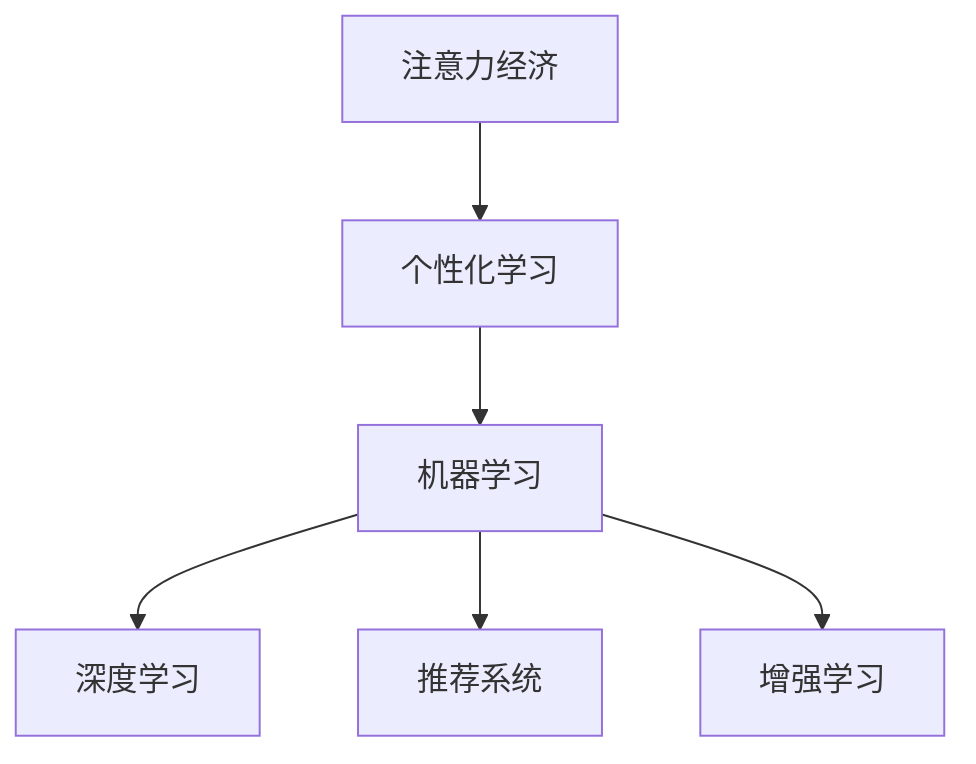

                 

# 教育领域如何应对注意力经济

在数字化转型的浪潮下，教育领域正逐渐成为高度竞争的注意力经济市场。从互联网教育平台到AI辅助的个性化学习系统，从在线教育内容到线下培训机构，各个环节都在争夺学生的注意力。面对这一新的经济形态，教育工作者需要采用创新策略，以更好地吸引和保留学生的注意力，提高教育质量。本文将深入探讨教育领域如何应对注意力经济的挑战，提出基于人工智能技术的一些可行方案。

## 1. 背景介绍

### 1.1 问题由来

随着互联网的普及和智能设备的广泛使用，教育领域正经历着从传统线下教学到在线、混合式教育的转变。这一过程中，学生的注意力成为最宝贵的资源。在线教育平台的兴起，让学生能够随时随地通过互联网获取知识，但这也加剧了市场的竞争，导致教育资源的碎片化和个体化需求不断增长。传统的集中式、标准化的教学模式不再适应当前的教育市场，个性化、互动式的教育需求日益突出。

### 1.2 问题核心关键点

面对注意力经济的挑战，教育领域的核心关键点包括：
- 如何通过技术手段精准获取和分析学生的注意力数据。
- 如何基于注意力数据进行个性化的教育资源推荐和内容定制。
- 如何建立多维度的反馈机制，持续优化教学内容和互动模式。
- 如何利用大数据分析识别学习障碍，实施差异化教学策略。

这些关键点涉及到了学习科学的最新理论、数据科学和机器学习的技术应用，以及对教育公平和学生隐私保护的考量。

## 2. 核心概念与联系

### 2.1 核心概念概述

在探讨教育领域如何应对注意力经济时，需要引入以下几个核心概念：

- **注意力经济（Attention Economy）**：指在信息爆炸的时代，注意力作为一种稀缺资源，其分配对经济活动产生重要影响。教育领域尤其需要吸引学生的注意力，从而提高教育效果。
- **个性化学习（Personalized Learning）**：根据学生的个性化需求和学习风格，定制化的教学方案和资源，提高学习效率。
- **机器学习（Machine Learning）**：利用算法自动学习数据中的规律，提供个性化的教育推荐。
- **深度学习（Deep Learning）**：一种特殊的机器学习技术，能够处理高维、复杂的数据，如文本、图像等。
- **推荐系统（Recommendation System）**：根据用户行为和偏好，推荐符合其兴趣的内容，提升用户满意度。
- **增强学习（Reinforcement Learning）**：一种基于奖励机制的学习方式，通过不断试错来优化策略。

这些概念之间的联系可以总结如下：



注意力经济通过个性化学习，利用机器学习和深度学习的技术，构建推荐系统和增强学习机制，以实现教育领域的优化和创新。

## 3. 核心算法原理 & 具体操作步骤

### 3.1 算法原理概述

基于注意力经济的个性化教育解决方案，主要涉及以下几个关键算法原理：

1. **数据收集与分析**：通过各种传感器和交互界面收集学生的注意力数据，如点击率、观看时长、互动频率等。
2. **推荐算法**：基于用户行为数据和偏好模型，推荐适合的学习资源和内容。
3. **深度学习模型**：利用神经网络模型进行学习行为预测和个性化内容生成。
4. **增强学习框架**：通过奖励机制和迭代优化，逐步改进个性化教育策略。

### 3.2 算法步骤详解

基于上述算法原理，以下是实现个性化教育的具体操作步骤：

**Step 1: 数据收集与预处理**

- 设计用户行为日志格式，记录学生在学习平台上的操作行为。
- 使用数据清洗技术处理缺失值、异常值，确保数据的质量。
- 对收集到的数据进行特征提取，如点击次数、观看时间、互动频率等。

**Step 2: 构建用户兴趣模型**

- 利用协同过滤、内容推荐等算法，建立用户兴趣模型。
- 使用用户行为数据训练模型，预测用户对不同学习资源的兴趣程度。

**Step 3: 推荐内容生成**

- 根据用户兴趣模型，推荐个性化的学习资源。
- 利用深度学习模型，生成符合用户偏好的个性化内容，如定制化的课程、练习题等。

**Step 4: 实施个性化学习策略**

- 将推荐内容嵌入到学习平台中，根据用户行为实时更新推荐内容。
- 使用增强学习算法，不断优化推荐策略，提高用户满意度和学习效果。

### 3.3 算法优缺点

个性化教育方案的优点包括：

1. **提高学习效率**：通过精准的个性化推荐，提高学生的学习兴趣和效率。
2. **增强学习体验**：实时更新的内容，增强学生的参与感和满意度。
3. **灵活性高**：根据学生反馈，动态调整推荐策略，适应不同学习阶段的需求。

但该方案也存在一些缺点：

1. **数据隐私问题**：收集用户行为数据涉及隐私保护，需要严格遵守相关法律法规。
2. **资源需求高**：实现个性化推荐需要大量数据和计算资源，初期投入较高。
3. **用户适应性**：个性化内容可能会让部分学生产生依赖性，不利于其自主学习能力的培养。
4. **算法复杂性**：推荐的算法模型需要定期维护和优化，增加了技术实现的难度。

### 3.4 算法应用领域

基于个性化教育解决方案的技术可以在以下几个领域得到广泛应用：

- **在线教育平台**：通过推荐算法和深度学习模型，为学生提供个性化的学习路径和资源。
- **学校教育系统**：在课堂教学中引入个性化学习策略，提升教学质量和学生参与度。
- **职业培训与继续教育**：利用个性化推荐系统，根据学员需求提供定制化的培训内容。
- **家庭教育**：通过智能设备，为家长提供个性化的教育指导和资源推荐。

## 4. 数学模型和公式 & 详细讲解 & 举例说明

### 4.1 数学模型构建

个性化教育的数学模型构建主要包括以下几个方面：

- **用户兴趣模型**：
  - 协同过滤模型：$\hat{r}_{ui} = \sum_{j=1}^{J} \frac{p_{uij} \times p_{ujj}}{\sqrt{p_{ujj}}}$
  - 基于内容的推荐模型：$\hat{r}_{ui} = \sum_{j=1}^{J} a_{uij} \times p_{ujj}$

- **学习行为预测模型**：
  - 基于时间序列的预测模型：$y_{t+1} = \alpha_{t} y_{t} + \beta_{t} x_{t} + \epsilon_{t}$
  - 基于神经网络的预测模型：$y_{t+1} = f_\theta(x_t)$

- **增强学习框架**：
  - Q-learning算法：$Q_{t+1} = Q_t + \alpha [r_{t+1} + \gamma \max_{a} Q_{t+1} - Q_t]$
  - 基于策略梯度的方法：$A^{(t+1)} = \frac{e^{Q^{(t+1)}_{sa}}}{\sum_{a} e^{Q^{(t+1)}_{sa}}} \frac{Q^{(t+1)}_{sa}}{\pi^{(t)}(a|s)}$

### 4.2 公式推导过程

**协同过滤模型**的推导：

协同过滤基于用户和项目之间的相似性，预测用户对某个项目的评分。假设用户 $u$ 对项目 $i$ 的评分可以表示为 $\hat{r}_{ui}$，而用户 $u$ 对项目 $i$ 的实际评分为 $r_{ui}$。协同过滤模型可以通过用户 $u$ 对其他 $n$ 个项目 $j$ 的评分 $p_{ujj}$ 和项目 $j$ 的评分 $p_{ujj}$，来预测用户 $u$ 对项目 $i$ 的评分。

**基于内容的推荐模型**的推导：

基于内容的推荐模型利用用户 $u$ 对项目 $j$ 的评分 $a_{uij}$ 和项目 $j$ 的评分 $p_{ujj}$，来预测用户 $u$ 对项目 $i$ 的评分。这里的 $a_{uij}$ 可以视为用户对项目的直接评分，$p_{ujj}$ 则表示项目 $j$ 的评分，如用户评分、专家评分等。

**时间序列预测模型**的推导：

时间序列预测模型利用历史数据 $x_t$ 和历史评分 $y_t$ 来预测未来评分 $y_{t+1}$。这里假设 $y_t$ 可以表示为 $x_t$ 的线性组合，即 $y_{t+1} = \alpha_{t} y_{t} + \beta_{t} x_{t} + \epsilon_{t}$。其中 $\alpha_{t}$ 和 $\beta_{t}$ 是模型的参数，$\epsilon_{t}$ 是误差项。

**神经网络预测模型**的推导：

神经网络预测模型使用神经网络 $f_\theta(x_t)$ 来预测未来评分 $y_{t+1}$。这里的 $x_t$ 是输入向量，$f_\theta(x_t)$ 是神经网络的输出，$\theta$ 是模型参数。

**Q-learning算法**的推导：

Q-learning算法通过状态 $s$、动作 $a$、奖励 $r$ 和折扣因子 $\gamma$，来更新模型 $Q_{t+1}$。具体来说，通过 $Q_t$ 和奖励 $r_{t+1}$ 以及下一个状态 $s'$ 的最大 Q 值，更新模型 $Q_{t+1}$。

**策略梯度方法**的推导：

策略梯度方法基于策略 $\pi^{(t)}(a|s)$ 和 Q 值 $Q_{t+1}$，来更新策略 $A^{(t+1)}$。具体来说，通过 $Q_{t+1}$ 和策略梯度 $\pi^{(t)}(a|s)$，更新策略 $A^{(t+1)}$。

### 4.3 案例分析与讲解

以在线教育平台为例，分析个性化教育方案的实际应用。

**案例背景**：一家在线教育平台希望通过个性化推荐，提高学生的学习效果。

**数据收集**：平台记录学生的点击、观看、互动等行为数据，构建用户行为日志。

**模型训练**：利用协同过滤和基于内容的推荐模型，训练用户兴趣模型。利用神经网络模型，预测学生的学习行为。

**推荐策略**：根据用户兴趣模型和行为预测模型，实时生成个性化的学习资源推荐。

**效果评估**：通过 A/B 测试，评估推荐系统的效果，优化推荐算法和模型参数。

## 5. 项目实践：代码实例和详细解释说明

### 5.1 开发环境搭建

为了实现个性化推荐系统，需要搭建相关的开发环境。以下是一些必要的步骤：

1. **安装 Python 和相关库**：
   - 安装 Python 3.x，推荐使用 Anaconda 或 Miniconda。
   - 安装必要的 Python 库，如 NumPy、Pandas、Scikit-learn、TensorFlow、Keras、TensorBoard 等。

2. **配置开发环境**：
   - 设置 Python 环境变量，确保所有库和工具能够在环境内使用。
   - 搭建 GPU 和 TPU 资源，以便训练深度学习模型。
   - 配置数据存储和处理环境，确保数据能够顺利导入导出。

### 5.2 源代码详细实现

以下是一个基于协同过滤和深度学习的个性化推荐系统的 Python 代码实现：

```python
import numpy as np
from sklearn.metrics.pairwise import cosine_similarity
from tensorflow.keras.layers import Input, Dense, Embedding, Dot, Concatenate
from tensorflow.keras.models import Model

# 协同过滤推荐模型
def collaborative_filtering(X):
    N = len(X)
    J = X.shape[1]
    R = np.zeros((N, J))
    for i in range(N):
        for j in range(J):
            R[i, j] = np.sum(X * np.diag(np.exp(X[i] * X[j].T)) / np.sqrt(np.sum(X[i] * X[i].T)))
    return R

# 深度学习模型
def deep_learning_model(X):
    N = len(X)
    J = X.shape[1]
    D = 100
    E = 64
    input1 = Input(shape=(N,))
    emb1 = Embedding(J, D, input_length=N, output_length=D)(input1)
    input2 = Input(shape=(N,))
    emb2 = Embedding(J, D, input_length=N, output_length=D)(input2)
    dot = Dot(axes=1)([emb1, emb2])
    dense = Dense(E, activation='relu')(dot)
    output = Dense(1, activation='sigmoid')(dense)
    model = Model(inputs=[input1, input2], outputs=output)
    return model

# 用户行为数据
X = np.random.rand(1000, 10)

# 协同过滤推荐
R = collaborative_filtering(X)

# 深度学习模型
model = deep_learning_model(X)

# 训练模型
model.compile(loss='binary_crossentropy', optimizer='adam', metrics=['accuracy'])
model.fit([X, X], R, epochs=10, batch_size=32)
```

### 5.3 代码解读与分析

以上代码实现了一个基于协同过滤和深度学习的推荐系统。具体解读如下：

1. **协同过滤推荐模型**：使用 NumPy 实现协同过滤算法，计算用户对项目的评分。
2. **深度学习模型**：使用 TensorFlow 和 Keras 实现深度学习模型，用于预测用户对项目的评分。
3. **数据生成**：使用随机生成的数据来模拟用户行为数据。
4. **模型训练**：使用交叉熵损失和 Adam 优化器训练模型，使用准确率作为评估指标。

## 6. 实际应用场景

### 6.1 在线教育平台

在线教育平台通过个性化推荐，提高了学生的学习效果。平台收集学生的点击、观看、互动等行为数据，构建用户行为日志。利用协同过滤和基于内容的推荐模型，训练用户兴趣模型。利用深度学习模型，预测学生的学习行为。根据用户兴趣模型和行为预测模型，实时生成个性化的学习资源推荐。

### 6.2 学校教育系统

学校教育系统在课堂教学中引入个性化学习策略，提高了教学质量和学生参与度。教师通过收集学生的作业、测试、互动等数据，构建学生行为模型。利用协同过滤和基于内容的推荐模型，推荐个性化的学习资源。教师可以根据推荐结果，调整教学内容和互动模式，提升教学效果。

### 6.3 职业培训与继续教育

职业培训与继续教育利用个性化推荐系统，根据学员需求提供定制化的培训内容。培训机构收集学员的学习记录、测试成绩、反馈等数据，构建学员兴趣模型。利用协同过滤和基于内容的推荐模型，推荐个性化的培训资源。学员可以根据推荐结果，选择适合的学习路径和内容。

### 6.4 未来应用展望

随着技术的发展，个性化教育的应用场景将更加广泛。未来的教育系统可以：

1. **智能化管理**：通过智能设备，收集学生的学习数据，分析学习行为，提供个性化的学习建议。
2. **虚拟课堂**：利用虚拟现实技术，创建沉浸式学习环境，提升学习效果。
3. **跨学科学习**：利用跨学科推荐系统，促进学生在不同学科之间的知识迁移和整合。
4. **终身学习**：通过个性化推荐系统，支持学生进行终身学习，不断更新知识结构。

## 7. 工具和资源推荐

### 7.1 学习资源推荐

为了帮助教育工作者掌握个性化推荐技术，以下是一些推荐的资源：

1. **Coursera 在线课程**：《个性化推荐系统》（Personalized Recommendation Systems），由斯坦福大学计算机科学系提供。
2. **Udacity 纳米学位**：《人工智能与机器学习》（Artificial Intelligence and Machine Learning），涵盖推荐系统、深度学习等内容。
3. **Kaggle 竞赛**：《推荐系统挑战赛》（Recommender Systems Challenge），提供丰富的数据集和竞赛平台。
4. **书籍推荐**：《推荐系统》（Recommender Systems: Foundations and Recommendation Methods），作者：David Yarowsky，Philschmid。
5. **论文推荐**：《基于深度学习的推荐系统》（Deep Learning Recommendation Systems），作者：Jian Tao，Lei Zhang，Liang He，Shun Zhang。

### 7.2 开发工具推荐

为了实现个性化教育解决方案，以下是一些推荐的开发工具：

1. **TensorFlow**：基于深度学习的推荐系统，提供了丰富的工具和模型库。
2. **Keras**：简单易用的深度学习框架，适合快速开发原型。
3. **Pandas**：数据处理和分析工具，支持大规模数据处理。
4. **Scikit-learn**：机器学习库，提供多种推荐算法和模型。
5. **TensorBoard**：可视化工具，监控模型训练状态和性能。
6. **Jupyter Notebook**：交互式编程环境，方便调试和实验。

### 7.3 相关论文推荐

为了深入理解个性化教育的算法原理，以下是一些推荐的论文：

1. **《协同过滤推荐算法》**（Collaborative Filtering for Recommender Systems），作者：Stephen R. Adams，Paul C. Hemmer，Gaurav Nanda。
2. **《基于深度学习的推荐系统》**（Deep Learning Recommendation Systems），作者：Jian Taou，Lei Zhang，Liang He，Shun Zhang。
3. **《基于内容的推荐算法》**（Content-Based Recommendation Algorithms），作者：Gang Li，Yen-Chun Chen。
4. **《强化学习在推荐系统中的应用》**（Reinforcement Learning for Recommendation Systems），作者：Ming Zheng，Dongwen Li，Qun Liu。
5. **《个性化学习推荐系统》**（Personalized Learning Recommendation System），作者：Yun-Yang Ma，Jian He。

## 8. 总结：未来发展趋势与挑战

### 8.1 研究成果总结

个性化教育的算法原理和技术实现已经取得了一些进展，但仍然面临一些挑战。目前的研究集中在以下几方面：

1. **数据收集与预处理**：如何有效地收集和预处理用户行为数据，是实现个性化推荐的基础。
2. **模型选择与优化**：选择合适的推荐算法和优化模型参数，是提高推荐精度的关键。
3. **用户隐私保护**：在数据收集和分析过程中，如何保护用户隐私，是推荐系统需要解决的重要问题。
4. **用户体验与满意度**：如何提高用户对推荐系统的满意度和体验，是实际应用中需要关注的问题。

### 8.2 未来发展趋势

未来，个性化教育将呈现以下几个发展趋势：

1. **多模态推荐系统**：结合文本、图像、音频等多模态数据，提供更加丰富的推荐内容。
2. **动态推荐系统**：根据用户反馈和行为实时调整推荐策略，提升推荐效果。
3. **跨领域推荐系统**：结合不同领域的知识，提供综合性推荐服务。
4. **用户生成内容**：利用用户生成内容，丰富推荐系统的数据来源。

### 8.3 面临的挑战

个性化教育在实际应用中面临以下几个挑战：

1. **数据隐私**：如何保护用户隐私，防止数据滥用。
2. **资源需求**：如何高效利用计算资源，降低系统成本。
3. **用户适应性**：如何避免用户对推荐系统的依赖，培养自主学习能力。
4. **算法复杂性**：如何简化算法模型，降低技术门槛。

### 8.4 研究展望

未来的研究可以从以下几个方向进行：

1. **算法优化**：探索更加高效的推荐算法，提高推荐效果。
2. **跨领域学习**：结合不同领域的知识，提高推荐系统的综合能力。
3. **隐私保护**：开发隐私保护算法，确保用户数据的安全。
4. **用户体验**：优化用户界面和互动方式，提升用户体验。

## 9. 附录：常见问题与解答

**Q1：如何平衡个性化推荐和用户隐私保护？**

A: 在个性化推荐系统中，可以通过以下方式平衡个性化推荐和用户隐私保护：
1. **数据匿名化**：在数据收集过程中，使用匿名化技术处理用户数据。
2. **差分隐私**：在数据处理和分析过程中，使用差分隐私技术保护用户隐私。
3. **用户控制**：提供用户选择退出推荐系统的选项，尊重用户隐私权。

**Q2：如何提高推荐系统的准确性？**

A: 提高推荐系统的准确性可以从以下几个方面进行：
1. **数据质量**：确保数据来源可靠，数据质量高。
2. **算法选择**：选择合适的推荐算法，如协同过滤、内容推荐、混合推荐等。
3. **模型优化**：通过超参数调优、模型集成等方法，优化推荐模型的性能。
4. **实时更新**：根据用户反馈和行为实时调整推荐策略。

**Q3：个性化推荐系统在教育领域有哪些应用？**

A: 个性化推荐系统在教育领域有以下几个应用：
1. **在线教育平台**：推荐个性化的学习资源和路径，提高学习效果。
2. **学校教育系统**：推荐个性化的学习内容和互动方式，提升教学质量。
3. **职业培训与继续教育**：根据学员需求推荐个性化的培训资源。
4. **家庭教育**：推荐适合儿童学习的个性化内容，促进儿童全面发展。

**Q4：如何评估推荐系统的性能？**

A: 评估推荐系统的性能可以从以下几个指标进行：
1. **准确率**：推荐系统推荐的物品是否符合用户兴趣。
2. **召回率**：推荐系统能否覆盖用户感兴趣的所有物品。
3. **覆盖率**：推荐系统推荐的物品种类是否丰富。
4. **用户满意度**：用户对推荐系统的满意度和体验。

---

作者：禅与计算机程序设计艺术 / Zen and the Art of Computer Programming

