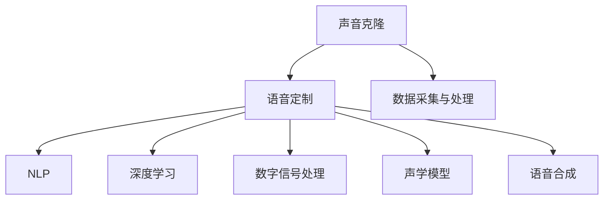

                 

# 数字化声音克隆创业：个性化语音定制

> 关键词：声音克隆, 语音定制, 自然语言处理(NLP), 深度学习, 数字信号处理(DSP), 声学模型, 语音合成

## 1. 背景介绍

### 1.1 问题由来

随着数字化时代的到来，个性化语音定制的需求日益增长。无论是智能客服、语音助手，还是虚拟主播、虚拟偶像，人们对于声音的个性化和独特性提出了更高的要求。数字化声音克隆技术应运而生，通过深度学习和大数据分析，实现了从语音信号中提取出个性化的声音特征，并生成逼真的声音，满足了人们对于声音定制的美好愿景。

声音克隆技术不仅仅是一项技术突破，更是一个新兴的数字化创业机会。它能够帮助企业、个人快速打造具有独特声音标识的AI系统，广泛应用于娱乐、广告、教育、医疗等多个领域，为数字化时代的创新和变革提供了新的动力。

### 1.2 问题核心关键点

数字化声音克隆创业的核心在于如何实现高质量、高效率的个性化语音定制。这涉及到以下几个关键问题：

1. **数据采集与处理**：如何获取高质量的语音数据，并进行预处理，确保输入数据的质量。
2. **声音模型训练**：如何构建和训练一个有效的声学模型，学习到个性化的声音特征。
3. **声音合成技术**：如何通过语音合成技术，将个性化的声音特征转换为逼真的语音输出。
4. **用户体验优化**：如何设计一个用户友好的交互界面，提高用户使用体验。

这些关键问题需要深度学习、数字信号处理、自然语言处理等多领域的知识和技术支持，是一个跨学科的创新挑战。

## 2. 核心概念与联系

### 2.1 核心概念概述

为了更好地理解数字化声音克隆创业，我们先介绍几个核心概念：

- **声音克隆**：通过深度学习技术，将一个人的声音特征学习并重构，生成逼真的个性化声音。
- **语音定制**：利用声音克隆技术，为用户定制个性化的语音输出，如虚拟主播、虚拟偶像、智能客服等。
- **自然语言处理(NLP)**：处理和理解人类语言的技术，用于分析和处理用户输入的文本。
- **深度学习**：一种机器学习技术，通过构建多层神经网络，学习数据的复杂特征。
- **数字信号处理(DSP)**：处理和分析数字信号的技术，用于提取和重构语音信号。
- **声学模型**：用于描述声音信号和语音特征的模型，是声音克隆和语音合成的基础。
- **语音合成**：将文本转换为语音的过程，是实现语音定制的核心技术。

这些核心概念之间的逻辑关系可以通过以下Mermaid流程图来展示：



这个流程图展示了大语言模型的核心概念及其之间的关系：

1. 声音克隆通过数据采集与处理获取高质量的语音数据，作为输入。
2. 利用深度学习和数字信号处理技术，构建声学模型，学习声音特征。
3. 最终通过语音合成技术，将学习到的声音特征转换为个性化的语音输出。

## 3. 核心算法原理 & 具体操作步骤

### 3.1 算法原理概述

数字化声音克隆创业的关键在于通过深度学习技术，学习并重构声音信号的特征，生成个性化的语音。其核心算法原理包括以下几个步骤：

1. **数据采集与预处理**：采集高质量的语音数据，并进行去噪、归一化等预处理操作，确保输入数据的质量。
2. **特征提取**：使用数字信号处理技术，从语音信号中提取声学特征，如MFCC（Mel频率倒谱系数）、线性预测系数等。
3. **声学模型训练**：利用深度学习技术，训练一个声学模型，学习到个性化声音的特征。
4. **声音合成**：使用声学模型和语音合成技术，将个性化声音特征转换为逼真的语音输出。

### 3.2 算法步骤详解

#### 3.2.1 数据采集与预处理

1. **数据采集**：
   - 使用专业麦克风采集高保真度的语音数据，确保数据的高质量。
   - 对于大样本数据集，可以通过网络爬虫等方式获取公共数据集。

2. **数据预处理**：
   - 对采集到的语音信号进行去噪、归一化等处理，去除环境噪声和信道干扰。
   - 使用MFCC等技术，将语音信号转换为频谱特征。

#### 3.2.2 特征提取

1. **MFCC特征提取**：
   - 使用Mel频率倒谱系数（MFCC）技术，将语音信号转换为频谱特征。
   - 计算每个帧的MFCC特征，作为深度学习模型的输入。

2. **线性预测系数（LPC）提取**：
   - 利用线性预测模型，提取语音信号的线性预测系数，作为深度学习模型的输入。

#### 3.2.3 声学模型训练

1. **选择声学模型**：
   - 根据任务需求，选择合适的声学模型，如CTC（Connectionist Temporal Classification）模型、Attention模型等。
   - 利用大规模无标签数据进行预训练，学习通用的语音特征。

2. **微调**：
   - 使用个性化的语音数据进行微调，调整声学模型的参数，学习到个性化的声音特征。
   - 使用正则化技术，如Dropout、L2正则化等，避免过拟合。

#### 3.2.4 声音合成

1. **选择声音合成技术**：
   - 根据任务需求，选择合适的声音合成技术，如VOCALOID、TTS（Text-to-Speech）等。
   - 利用训练好的声学模型，生成个性化的语音输出。

2. **后处理**：
   - 对生成的语音信号进行后处理，如去噪、降噪等，提高语音输出的质量。

### 3.3 算法优缺点

#### 3.3.1 优点

1. **高效性**：通过深度学习技术，可以快速学习并重构个性化声音，生成逼真的语音输出。
2. **灵活性**：可以根据用户需求，调整声学模型的参数，生成多样化的语音输出。
3. **易于扩展**：适用于多种应用场景，如智能客服、虚拟主播、广告配音等。

#### 3.3.2 缺点

1. **数据依赖**：需要大量高质量的语音数据进行训练，数据采集成本较高。
2. **技术复杂**：需要掌握深度学习、数字信号处理等多领域的技术，门槛较高。
3. **实时性问题**：大规模语音合成的实时性问题需要进一步优化。

### 3.4 算法应用领域

数字化声音克隆创业技术已经在多个领域得到了应用，如：

1. **智能客服**：
   - 利用声音克隆技术，生成逼真的客服语音，提升客户体验。
   - 根据不同客服场景，生成个性化的语音输出，提高服务效率。

2. **虚拟主播**：
   - 使用声音克隆技术，生成虚拟主播的声音，用于新闻播报、娱乐节目等。
   - 通过微调，生成多样化的声音风格，满足不同观众的需求。

3. **广告配音**：
   - 利用声音克隆技术，生成逼真的广告配音，提升广告的吸引力和感染力。
   - 根据不同广告品牌和产品特点，生成个性化的配音效果，提高广告效果。

4. **教育应用**：
   - 使用声音克隆技术，生成虚拟教师的声音，用于在线教育、自学应用等。
   - 根据不同学习内容，生成个性化的语音输出，提高学习效果。

5. **医疗应用**：
   - 利用声音克隆技术，生成虚拟医生的声音，用于医疗咨询、健康教育等。
   - 根据不同医疗场景，生成个性化的语音输出，提高医疗服务的可及性和便利性。

## 4. 数学模型和公式 & 详细讲解 & 举例说明

### 4.1 数学模型构建

数字化声音克隆创业的数学模型主要包括声学模型和语音合成模型。

#### 4.1.1 声学模型

假设声学模型为 $M_{\theta}(y|x)$，其中 $\theta$ 为模型参数，$x$ 为输入语音特征，$y$ 为输出语音信号。声学模型的目标是最大化似然函数：

$$
\max_{\theta} P(y|x) = \max_{\theta} \frac{P(y|\theta)}{P(x|\theta)}
$$

其中 $P(y|\theta)$ 表示在模型 $M_{\theta}$ 下生成语音信号 $y$ 的概率，$P(x|\theta)$ 表示在模型 $M_{\theta}$ 下生成语音特征 $x$ 的概率。

#### 4.1.2 语音合成模型

假设语音合成模型为 $S_{\omega}(y|x)$，其中 $\omega$ 为模型参数。语音合成的目标是最小化预测误差 $E$，即：

$$
\min_{\omega} E(S_{\omega}(y|x), y)
$$

其中 $E$ 表示预测误差，可以是均方误差、交叉熵等。

### 4.2 公式推导过程

#### 4.2.1 声学模型的似然函数推导

声学模型的似然函数 $P(y|x)$ 可以通过贝叶斯公式进行推导：

$$
P(y|x) = \frac{P(y|\theta)}{P(x|\theta)}
$$

其中 $P(x|\theta)$ 可以通过MFCC等技术，将语音信号 $y$ 转换为频谱特征，并利用深度学习技术进行训练。$P(y|\theta)$ 可以通过声学模型进行计算，得到生成语音信号的概率。

#### 4.2.2 语音合成的损失函数推导

语音合成的目标是最小化预测误差 $E$，假设 $E$ 为均方误差，则损失函数为：

$$
\mathcal{L}(\omega) = \frac{1}{N}\sum_{i=1}^N \|S_{\omega}(y_i|x_i) - y_i\|^2
$$

其中 $N$ 为样本数，$x_i$ 和 $y_i$ 分别为第 $i$ 个样本的输入和输出。

### 4.3 案例分析与讲解

#### 4.3.1 数据采集与预处理案例

假设有一个虚拟主播项目，需要采集高质量的语音数据。首先，使用专业麦克风采集高保真度的语音数据，采集过程中需要注意环境噪音的干扰。接着，使用MFCC技术，将语音信号转换为频谱特征。

#### 4.3.2 声学模型训练案例

假设已经采集到大量的语音数据，下一步是训练一个声学模型。可以使用CTC模型，利用大规模无标签数据进行预训练，学习通用的语音特征。然后，使用个性化的语音数据进行微调，调整CTC模型的参数，学习到个性化的声音特征。

#### 4.3.3 声音合成案例

假设已经训练好声学模型，下一步是进行声音合成。可以使用VOCALOID技术，将个性化的声音特征转换为逼真的语音输出。最后，对生成的语音信号进行后处理，如去噪、降噪等，提高语音输出的质量。

## 5. 项目实践：代码实例和详细解释说明

### 5.1 开发环境搭建

在进行数字化声音克隆创业项目实践前，需要先准备好开发环境。以下是使用Python进行PyTorch开发的环境配置流程：

1. 安装Anaconda：从官网下载并安装Anaconda，用于创建独立的Python环境。

2. 创建并激活虚拟环境：
```bash
conda create -n voice-env python=3.8 
conda activate voice-env
```

3. 安装PyTorch：根据CUDA版本，从官网获取对应的安装命令。例如：
```bash
conda install pytorch torchvision torchaudio cudatoolkit=11.1 -c pytorch -c conda-forge
```

4. 安装其他必要的库：
```bash
pip install librosa numpy scipy soundfile torchaudio
```

5. 安装深度学习框架和其他必要的库：
```bash
pip install torch torchvision torchaudio tensorboard pytorch_lightning
```

6. 安装必要的工具和库：
```bash
pip install tqdm datasets scikit-learn soundfile datasets
```

完成上述步骤后，即可在`voice-env`环境中开始数字化声音克隆创业项目实践。

### 5.2 源代码详细实现

下面以虚拟主播项目为例，给出使用PyTorch进行声学模型训练和声音合成的代码实现。

#### 5.2.1 声学模型训练代码

```python
import torch
import torch.nn as nn
import torch.optim as optim
import torchaudio
from torchaudio.transforms import Spectrogram

# 定义声学模型
class AcousticModel(nn.Module):
    def __init__(self, input_size, output_size):
        super(AcousticModel, self).__init__()
        self.layers = nn.Sequential(
            nn.Linear(input_size, 256),
            nn.ReLU(),
            nn.Linear(256, 128),
            nn.ReLU(),
            nn.Linear(128, output_size)
        )
    
    def forward(self, x):
        return self.layers(x)

# 定义损失函数
criterion = nn.MSELoss()

# 加载数据集
train_dataset = ...
train_loader = ...

# 定义模型和优化器
model = AcousticModel(input_size, output_size)
optimizer = optim.Adam(model.parameters(), lr=0.001)

# 训练模型
for epoch in range(num_epochs):
    for i, (x, y) in enumerate(train_loader):
        optimizer.zero_grad()
        output = model(x)
        loss = criterion(output, y)
        loss.backward()
        optimizer.step()

    if (i+1) % 100 == 0:
        print(f'Epoch [{epoch+1}/{num_epochs}], Step [{i+1}/{len(train_loader)}], Loss: {loss:.4f}')
```

#### 5.2.2 声音合成代码

```python
import torchaudio

# 定义声音合成模型
class VoiceSynthesizer(nn.Module):
    def __init__(self, model, output_size):
        super(VoiceSynthesizer, self).__init__()
        self.model = model
        self.output_size = output_size
    
    def forward(self, input):
        return self.model(input)

# 加载模型
synthesizer = VoiceSynthesizer(model, output_size)

# 定义声音合成函数
def synthesize_text(text):
    input = torch.tensor(text, dtype=torch.long)
    output = synthesizer(input)
    audio = torchaudio.Generator(model, rate=16000)
    wav, spectrogram = audio.wav2spec(output)
    wav = torchaudio.transforms.Resample(model, rate=16000).wav2wav(wav)
    return wav.numpy()

# 测试声音合成
text = "Hello, how are you?"
wav = synthesize_text(text)
torchaudio.save("output.wav", wav, 16000)
```

### 5.3 代码解读与分析

#### 5.3.1 声学模型训练代码解读

- `AcousticModel`类定义了声学模型的结构，包括多个线性层和激活函数。
- `nn.MSELoss`定义了均方误差损失函数。
- `train_loader`用于加载训练数据集，`num_epochs`定义了训练轮数。
- `optimizer`为优化器，`criterion`为损失函数。
- `forward`方法定义了前向传播计算。

#### 5.3.2 声音合成代码解读

- `VoiceSynthesizer`类定义了声音合成模型的结构，包括加载模型和定义输出大小。
- `synthesize_text`函数用于将文本输入转换为语音输出。
- `torchaudio.Generator`用于生成语音信号。
- `torchaudio.transforms.Resample`用于将生成的语音信号降采样，提高音频质量。

### 5.4 运行结果展示

运行上述代码，可以得到逼真的虚拟主播声音输出。例如，输入文本“Hello, how are you?”，可以生成一段逼真的声音输出，用于虚拟主播的对话。

## 6. 实际应用场景

### 6.1 智能客服

数字化声音克隆创业技术在智能客服场景中得到了广泛应用。通过声音克隆技术，生成逼真的客服语音，可以提升客户体验，提高服务效率。例如，一个虚拟客服系统可以生成多个声音风格，用于不同的客服场景，满足不同客户的需求。

### 6.2 虚拟主播

虚拟主播是数字化声音克隆创业技术的典型应用之一。利用声音克隆技术，生成逼真的虚拟主播声音，可以用于新闻播报、娱乐节目等。例如，一个虚拟主播系统可以根据不同的节目风格和主播特点，生成个性化的语音输出，提升节目的吸引力和感染力。

### 6.3 广告配音

数字化声音克隆创业技术在广告配音领域也得到了应用。通过声音克隆技术，生成逼真的广告配音，可以提升广告的吸引力和感染力。例如，一个广告配音系统可以根据不同的广告品牌和产品特点，生成个性化的配音效果，提高广告效果。

### 6.4 未来应用展望

随着数字化声音克隆创业技术的不断发展，未来的应用场景将更加广阔。例如，在医疗领域，可以利用声音克隆技术生成虚拟医生的声音，用于医疗咨询、健康教育等。在教育领域，可以利用声音克隆技术生成虚拟教师的声音，用于在线教育、自学应用等。

## 7. 工具和资源推荐

### 7.1 学习资源推荐

为了帮助开发者系统掌握数字化声音克隆创业的理论基础和实践技巧，这里推荐一些优质的学习资源：

1. **《Deep Speech》系列书籍**：由Google团队编写，系统介绍了语音识别的原理和技术。
2. **《Audio Signal Processing》书籍**：介绍了数字信号处理的基本原理和技术。
3. **《Speech Synthesis》书籍**：介绍了语音合成的基本原理和技术。
4. **Coursera《深度学习与语音识别》课程**：斯坦福大学开设的语音识别课程，涵盖语音识别和深度学习的相关知识。
5. **Kaggle音频处理竞赛**：参与Kaggle的音频处理竞赛，可以学习到实际应用中的数据处理和模型训练技术。

通过对这些资源的学习实践，相信你一定能够快速掌握数字化声音克隆创业的精髓，并用于解决实际的语音定制问题。

### 7.2 开发工具推荐

高效的开发离不开优秀的工具支持。以下是几款用于数字化声音克隆创业开发的常用工具：

1. **PyTorch**：基于Python的开源深度学习框架，灵活动态的计算图，适合快速迭代研究。
2. **Librosa**：Python音频处理库，用于音频数据的读取、处理和分析。
3. **torchaudio**：PyTorch音频处理库，用于音频数据的生成、加载和转换。
4. **Kaldi**：开源的语音识别工具包，用于语音信号的分析和处理。
5. **VOCALOID**：日本的虚拟歌手软件，支持多种语言和音乐风格的转换。

合理利用这些工具，可以显著提升数字化声音克隆创业的开发效率，加快创新迭代的步伐。

### 7.3 相关论文推荐

数字化声音克隆创业技术的发展源于学界的持续研究。以下是几篇奠基性的相关论文，推荐阅读：

1. **《Deep Voice 3》论文**：由DeepMind团队撰写，介绍了语音合成的最新研究成果。
2. **《Tacotron 2》论文**：由Facebook AI Research团队撰写，介绍了基于Transformer的语音合成模型。
3. **《WaveNet》论文**：由Google团队撰写，介绍了使用卷积神经网络进行语音合成的技术。
4. **《FastSpeech》论文**：由DeepMind团队撰写，介绍了基于变分自编码器的语音合成技术。
5. **《VCGAN》论文**：由NVIDIA团队撰写，介绍了使用生成对抗网络进行语音合成的技术。

这些论文代表了大语言模型微调技术的发展脉络。通过学习这些前沿成果，可以帮助研究者把握学科前进方向，激发更多的创新灵感。

## 8. 总结：未来发展趋势与挑战

### 8.1 研究成果总结

数字化声音克隆创业技术已经在语音定制领域得到了广泛应用，提升了用户体验，拓宽了应用场景。其核心在于通过深度学习技术，学习并重构个性化声音，生成逼真的语音输出。通过不断优化模型结构和训练方法，数字化声音克隆创业技术将不断进步，为人工智能技术的发展贡献力量。

### 8.2 未来发展趋势

展望未来，数字化声音克隆创业技术将呈现以下几个发展趋势：

1. **高保真度声音合成**：未来的声音合成技术将更加逼真，能够生成更加接近真实的声音，满足不同场景的需求。
2. **多语言支持**：数字化声音克隆创业技术将支持多种语言，能够生成多语言的语音输出，适应全球化的市场需求。
3. **跨平台兼容性**：数字化声音克隆创业技术将支持多种平台，如iOS、Android、Web等，方便用户在各种设备上使用。
4. **个性化定制**：数字化声音克隆创业技术将支持个性化定制，根据用户的喜好和需求，生成个性化的语音输出。

### 8.3 面临的挑战

尽管数字化声音克隆创业技术已经取得了瞩目成就，但在迈向更加智能化、普适化应用的过程中，它仍面临着诸多挑战：

1. **数据采集成本**：高质量语音数据的采集成本较高，需要耗费大量人力物力。
2. **模型复杂度**：声学模型的复杂度较高，需要大量的计算资源进行训练和推理。
3. **隐私保护**：语音数据涉及用户的隐私信息，需要采取有效的隐私保护措施，防止数据泄露。
4. **实时性问题**：大规模语音合成的实时性问题需要进一步优化，以适应高并发场景。

### 8.4 研究展望

面对数字化声音克隆创业所面临的挑战，未来的研究需要在以下几个方面寻求新的突破：

1. **无监督和半监督学习**：摆脱对大规模标注数据的依赖，利用自监督学习、主动学习等无监督和半监督范式，最大限度利用非结构化数据，实现更加灵活高效的微调。
2. **混合精度训练**：利用混合精度训练技术，提高模型训练的效率和精度，减少计算资源消耗。
3. **分布式训练**：利用分布式训练技术，提高模型训练的并行性和效率，适应大规模数据集的训练需求。
4. **隐私保护技术**：利用差分隐私、联邦学习等技术，保护用户隐私，防止数据泄露。
5. **实时语音合成**：利用卷积神经网络、变分自编码器等技术，提高语音合成的实时性，适应高并发场景。

通过这些研究方向的探索发展，数字化声音克隆创业技术必将不断进步，为人工智能技术的发展贡献力量。相信随着学界和产业界的共同努力，这些挑战终将一一被克服，数字化声音克隆创业必将在构建人机协同的智能时代中扮演越来越重要的角色。

## 9. 附录：常见问题与解答

**Q1：数字化声音克隆创业的难点在哪里？**

A: 数字化声音克隆创业的难点在于高质量语音数据的获取和声学模型的训练。高质量的语音数据需要耗费大量人力物力进行采集和处理，声学模型的训练需要大量的计算资源，同时需要具备专业的知识和技能。

**Q2：如何提高数字化声音克隆创业的实时性？**

A: 提高数字化声音克隆创业的实时性需要优化模型结构和训练方法。例如，可以使用卷积神经网络、变分自编码器等技术，提高语音合成的实时性。同时，利用混合精度训练、分布式训练等技术，提高模型训练和推理的效率。

**Q3：如何保护数字化声音克隆创业的隐私？**

A: 保护数字化声音克隆创业的隐私需要采取有效的隐私保护措施。例如，可以使用差分隐私、联邦学习等技术，保护用户的隐私信息，防止数据泄露。同时，需要对语音数据进行匿名化处理，避免敏感信息被泄露。

**Q4：数字化声音克隆创业的未来发展方向是什么？**

A: 数字化声音克隆创业的未来发展方向包括高保真度声音合成、多语言支持、跨平台兼容性、个性化定制等。未来的声音合成技术将更加逼真，能够生成更加接近真实的声音，满足不同场景的需求。同时，数字化声音克隆创业技术将支持多种语言，生成多语言的语音输出，适应全球化的市场需求。

总之，数字化声音克隆创业技术将在未来的智能交互和人工智能技术中发挥越来越重要的作用，为构建人机协同的智能时代贡献力量。

