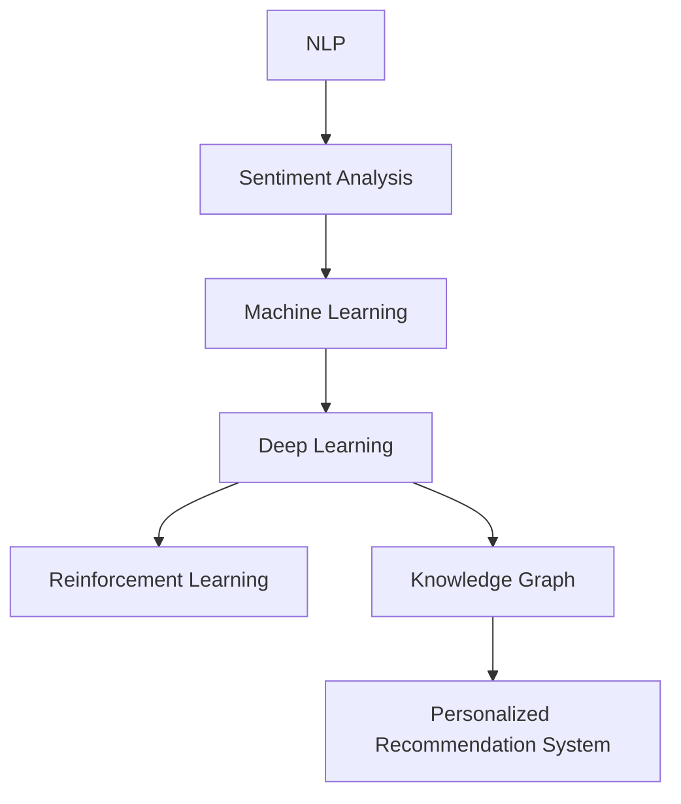

                 

# 数字化情感咨询创业：AI辅助的心理健康服务

## 1. 背景介绍

### 1.1 问题由来

随着社会竞争日益激烈，生活节奏加快，人们的心理压力和精神健康问题日益凸显。根据世界卫生组织（WHO）的统计，全球抑郁症患者已超3亿，焦虑症患者更是高达3.6亿。而传统的心理治疗方法，如面对面咨询、电话咨询等，存在着价格高、资源不足、覆盖面窄等问题。在此背景下，数字化的心理健康服务应运而生，通过AI技术辅助，大大降低了心理健康的咨询成本，提升了服务覆盖面和用户体验。

### 1.2 问题核心关键点

数字化情感咨询创业的核心在于如何利用AI技术，特别是自然语言处理（NLP）和机器学习算法，构建智能化的心理服务平台，实现对用户情绪和心理问题的快速识别和干预。核心关键点包括以下几个方面：

1. **情感识别**：通过分析用户输入的自然语言文本，识别其情绪状态，如开心、悲伤、焦虑等。
2. **问题诊断**：基于情感识别结果，诊断用户的心理问题，如抑郁、焦虑等。
3. **定制化干预**：根据用户心理问题的严重程度和类型，提供个性化的心理干预方案，如情绪调节、认知行为疗法（CBT）等。
4. **跟踪反馈**：持续跟踪用户的情绪变化，收集反馈信息，优化干预方案。
5. **隐私保护**：保障用户数据的隐私和安全，避免数据泄露和滥用。

## 2. 核心概念与联系

### 2.1 核心概念概述

为更好地理解数字化情感咨询创业的技术原理和架构，本节将介绍几个密切相关的核心概念：

- **自然语言处理（NLP）**：涉及计算机处理人类语言的技术，包括语音识别、文本分析、情感分析、意图识别等。
- **情感分析（Sentiment Analysis）**：通过分析文本中的情感词汇、语法结构、语调等信息，识别文本的情感倾向。
- **机器学习（Machine Learning）**：利用数据训练模型，使其具备从数据中学习规律并预测新数据的能力。
- **深度学习（Deep Learning）**：基于神经网络，通过多层非线性变换，实现对复杂数据的建模和分析。
- **强化学习（Reinforcement Learning）**：通过奖励机制，使模型在特定环境中通过试错学习最优策略。
- **知识图谱（Knowledge Graph）**：结构化的知识库，用于存储和查询语义知识。
- **个性化推荐系统（Personalized Recommendation System）**：根据用户的历史行为和偏好，推荐个性化的内容和服务。

这些核心概念之间的逻辑关系可以通过以下Mermaid流程图来展示：



这个流程图展示了情感咨询创业中涉及的主要技术和它们之间的联系：

1. 用户输入的文本通过自然语言处理技术进行初步分析。
2. 利用情感分析技术识别用户情绪，进入机器学习模型进行进一步分析和预测。
3. 在深度学习框架下，模型能够处理更加复杂的语言特征和关系。
4. 结合强化学习算法，模型可以根据用户的反馈不断优化干预策略。
5. 知识图谱能够为模型提供结构化的背景知识，提升情感识别和干预的准确性。
6. 个性化推荐系统可根据用户的行为数据，推荐更符合用户需求的干预方案。

这些技术共同构成了数字化情感咨询创业的技术基础，使得AI能够辅助心理服务，提供高效、个性化、智能的心理健康服务。

## 3. 核心算法原理 & 具体操作步骤

### 3.1 算法原理概述

数字化情感咨询创业的核心算法原理主要基于情感识别和情感干预两大部分。以下是这两个部分的基本框架：

1. **情感识别算法**：
   - **数据预处理**：收集和清洗用户输入的文本数据。
   - **特征提取**：利用NLP技术提取文本特征，如词汇、语法结构、情感词汇等。
   - **情感分析**：通过训练好的情感分类模型，识别用户文本的情感倾向。

2. **情感干预算法**：
   - **问题诊断**：根据情感分析结果，结合知识图谱和专家规则，诊断用户的心理问题。
   - **干预方案生成**：基于诊断结果，生成个性化的干预方案，如情绪调节、CBT等。
   - **干预效果评估**：持续跟踪用户情绪变化，评估干预效果，优化干预方案。

### 3.2 算法步骤详解

#### 情感识别算法步骤：

1. **数据预处理**：
   - 收集用户输入的文本数据，包括聊天记录、心情描述等。
   - 清洗数据，去除噪声和不相关的信息，保证数据质量。
   - 对文本进行分词、词性标注等处理，提取有意义的特征。

2. **特征提取**：
   - 使用NLP技术提取文本的词汇、语法结构、情感词汇等特征。
   - 利用词向量模型（如Word2Vec、GloVe）将词汇转化为向量表示，方便模型处理。
   - 提取语法结构特征，如句式、主谓关系等。

3. **情感分析**：
   - 训练一个情感分类模型，如朴素贝叶斯、支持向量机等。
   - 使用标注好的情感数据集训练模型，确保模型能够准确识别用户的情感倾向。
   - 模型评估和调参，确保模型的泛化能力和稳定性。

#### 情感干预算法步骤：

1. **问题诊断**：
   - 结合知识图谱和专家规则，分析情感分类结果，判断用户可能存在的问题。
   - 利用强化学习算法，不断优化问题诊断的准确性和鲁棒性。
   - 定期更新知识图谱，确保模型能够及时获取最新的心理学研究成果。

2. **干预方案生成**：
   - 根据问题诊断结果，生成个性化的干预方案。
   - 结合用户的历史数据和行为特征，提供更符合用户需求的干预方案。
   - 利用自然语言生成技术，将干预方案转化为自然语言文本。

3. **干预效果评估**：
   - 持续跟踪用户情绪变化，收集用户的反馈信息。
   - 利用情感分类模型评估干预效果，分析干预是否有效。
   - 根据评估结果，不断优化干预方案，提升干预效果。

### 3.3 算法优缺点

数字化情感咨询创业的算法具有以下优点：

- **高效性**：通过自动化流程，快速识别和诊断用户心理问题，提升服务效率。
- **个性化**：根据用户特征和历史数据，提供定制化的干预方案，提升用户满意度。
- **可扩展性**：结合最新的心理学研究成果和知识图谱，不断优化模型，保持服务水平。

同时，也存在一些缺点：

- **数据依赖**：算法的性能很大程度上依赖于用户输入的数据质量，数据清洗和预处理工作量大。
- **隐私保护**：用户数据涉及个人隐私，需要采取严格的数据保护措施，避免数据泄露。
- **模型鲁棒性**：模型的泛化能力需要不断优化，避免对特定领域的用户存在偏差。
- **情感理解**：用户情感的多样性和复杂性，使得情感识别和干预仍存在一定的挑战。

### 3.4 算法应用领域

数字化情感咨询创业的算法在多个领域都有广泛的应用：

- **心理健康咨询**：通过智能心理服务平台，提供24小时在线咨询，缓解用户心理压力。
- **情感支持系统**：结合自然语言生成技术，自动生成情感支持文本，提升用户情绪调节效果。
- **学习心理辅导**：为学生提供学习心理支持，帮助学生应对学习压力和考试焦虑。
- **企业员工心理健康**：为员工提供心理健康咨询服务，提升企业员工的幸福感和工作效率。
- **儿童心理健康**：为儿童提供情感识别和干预，帮助儿童健康成长。

此外，情感识别和干预技术还应用于智能客服、社交网络情感分析、广告推荐等多个领域，展示了其广泛的应用前景。

## 4. 数学模型和公式 & 详细讲解 & 举例说明

### 4.1 数学模型构建

情感识别和干预算法的数学模型构建主要基于分类和回归任务。以下是这两个任务的基本数学模型：

1. **情感分类模型**：
   - **模型构建**：使用线性回归或逻辑回归模型，将文本特征映射到情感类别。
   - **损失函数**：使用交叉熵损失函数，衡量模型预测值与真实标签的差异。
   - **优化算法**：使用梯度下降等优化算法，最小化损失函数。

2. **问题诊断模型**：
   - **模型构建**：使用支持向量机（SVM）或随机森林等模型，综合情感分类结果和知识图谱，判断用户心理问题。
   - **损失函数**：使用综合误差函数，综合情感分类结果和专家规则，评估问题诊断准确性。
   - **优化算法**：使用集成学习或贝叶斯网络等算法，优化问题诊断模型。

### 4.2 公式推导过程

#### 情感分类模型：

设情感分类模型为 $f(x; \theta)$，其中 $x$ 为文本特征向量，$\theta$ 为模型参数。情感分类模型可以表示为：

$$
f(x; \theta) = \max_{k \in [1, K]} \left\{ \theta_k^T \cdot x \right\}
$$

其中 $K$ 为情感类别数。情感分类模型的目标是最小化交叉熵损失函数：

$$
\mathcal{L}(\theta) = -\frac{1}{N} \sum_{i=1}^N \sum_{k=1}^K y_i^{(k)} \log p_k^{(i)}
$$

其中 $y_i^{(k)}$ 为样本 $i$ 的情感类别 $k$ 的标签，$p_k^{(i)} = f(x_i; \theta)$ 为模型对情感类别 $k$ 的预测概率。

#### 问题诊断模型：

问题诊断模型结合情感分类结果和知识图谱，综合评估用户心理问题。假设问题诊断模型为 $g(x; \theta)$，其中 $x$ 为综合特征向量，$\theta$ 为模型参数。问题诊断模型可以表示为：

$$
g(x; \theta) = \sum_{k=1}^K p_k^{(i)} \cdot \mathcal{E}_k
$$

其中 $p_k^{(i)}$ 为情感分类模型的预测概率，$\mathcal{E}_k$ 为情感类别 $k$ 对应的问题诊断得分。问题诊断模型的损失函数为：

$$
\mathcal{L}(\theta) = -\frac{1}{N} \sum_{i=1}^N \sum_{k=1}^K y_i^{(k)} \log g_k^{(i)}
$$

其中 $y_i^{(k)}$ 为样本 $i$ 的情感类别 $k$ 的标签，$g_k^{(i)} = g(x_i; \theta)$ 为模型对情感类别 $k$ 的问题诊断得分。

### 4.3 案例分析与讲解

以用户情绪识别和干预为例，展示情感识别和干预算法的应用过程：

1. **数据预处理**：
   - 收集用户聊天记录，包括历史对话记录和当前输入。
   - 清洗数据，去除噪声和不相关信息，提取有意义的词汇和语法结构。
   - 对文本进行分词、词性标注，提取词汇、情感词汇、语法结构等特征。

2. **情感分类**：
   - 使用线性回归模型，将文本特征向量 $x$ 映射到情感类别概率 $p_k^{(i)}$。
   - 计算交叉熵损失函数，通过梯度下降优化模型参数 $\theta$，最小化损失函数。
   - 模型评估和调参，确保模型的泛化能力和稳定性。

3. **问题诊断**：
   - 结合知识图谱，分析情感分类结果，判断用户可能存在的问题。
   - 使用支持向量机，综合情感分类结果和问题诊断得分，评估问题诊断准确性。
   - 根据问题诊断结果，生成个性化的干预方案，如情绪调节、CBT等。

4. **干预效果评估**：
   - 持续跟踪用户情绪变化，收集用户的反馈信息。
   - 利用情感分类模型评估干预效果，分析干预是否有效。
   - 根据评估结果，不断优化干预方案，提升干预效果。

## 5. 项目实践：代码实例和详细解释说明

### 5.1 开发环境搭建

在进行情感识别和干预的开发实践中，我们需要准备好开发环境。以下是使用Python进行TensorFlow开发的环境配置流程：

1. 安装Anaconda：从官网下载并安装Anaconda，用于创建独立的Python环境。

2. 创建并激活虚拟环境：
```bash
conda create -n tf-env python=3.8 
conda activate tf-env
```

3. 安装TensorFlow：根据CUDA版本，从官网获取对应的安装命令。例如：
```bash
conda install tensorflow-gpu -c conda-forge -c nvidia
```

4. 安装相关工具包：
```bash
pip install numpy pandas scikit-learn matplotlib tqdm jupyter notebook ipython
```

完成上述步骤后，即可在`tf-env`环境中开始开发实践。

### 5.2 源代码详细实现

这里我们以情感识别和干预为例，给出使用TensorFlow进行开发的PyTorch代码实现。

首先，定义情感分类模型：

```python
import tensorflow as tf
from tensorflow.keras.layers import Input, Dense, Dropout
from tensorflow.keras.models import Model

input = Input(shape=(max_length,), dtype='int32')
x = tf.keras.layers.Embedding(vocab_size, embedding_dim)(input)
x = tf.keras.layers.Conv1D(filters=64, kernel_size=3, activation='relu')(x)
x = tf.keras.layers.MaxPooling1D(pool_size=2)(x)
x = tf.keras.layers.LSTM(units=128)(x)
x = tf.keras.layers.Dropout(0.5)(x)
x = Dense(64, activation='relu')(x)
output = Dense(num_classes, activation='softmax')(x)

model = Model(inputs=input, outputs=output)
model.compile(loss='categorical_crossentropy', optimizer='adam', metrics=['accuracy'])
```

接着，定义问题诊断模型：

```python
from tensorflow.keras.layers import Input, Dense, Embedding
from tensorflow.keras.models import Model
from tensorflow.keras import backend as K

input1 = Input(shape=(max_length,), dtype='int32')
x1 = Embedding(vocab_size, embedding_dim)(input1)
x1 = Dense(64, activation='relu')(x1)
x1 = Dropout(0.5)(x1)

input2 = Input(shape=(max_length,), dtype='int32')
x2 = Embedding(vocab_size, embedding_dim)(input2)
x2 = Dense(64, activation='relu')(x2)
x2 = Dropout(0.5)(x2)

merged = K.concatenate([x1, x2])
x = Dense(128, activation='relu')(merged)
x = Dropout(0.5)(x)
output = Dense(1, activation='sigmoid')(x)

model = Model(inputs=[input1, input2], outputs=output)
model.compile(loss='binary_crossentropy', optimizer='adam', metrics=['accuracy'])
```

然后，定义训练和评估函数：

```python
from tensorflow.keras.preprocessing.text import Tokenizer
from tensorflow.keras.preprocessing.sequence import pad_sequences
from sklearn.model_selection import train_test_split

def load_data(file_path):
    with open(file_path, 'r') as f:
        data = f.readlines()
    return data

def preprocess_data(data):
    sentences, labels = [], []
    for line in data:
        sentence, label = line.strip().split('\t')
        sentences.append(sentence.split())
        labels.append(int(label))
    tokenizer = Tokenizer(num_words=vocab_size, oov_token=OOV_TOKEN)
    tokenizer.fit_on_texts(sentences)
    sequences = tokenizer.texts_to_sequences(sentences)
    padded_sequences = pad_sequences(sequences, maxlen=max_length, padding='post')
    return padded_sequences, np.array(labels)

def train_epoch(model, train_data, validation_data, batch_size, epochs):
    model.fit(train_data, train_labels, batch_size=batch_size, epochs=epochs, validation_data=(validation_data, validation_labels))
    return model

def evaluate(model, test_data, test_labels, batch_size):
    _, accuracy = model.evaluate(test_data, test_labels, batch_size=batch_size)
    return accuracy
```

最后，启动训练流程并在测试集上评估：

```python
train_data, train_labels = preprocess_data(train_data)
validation_data, validation_labels = preprocess_data(validation_data)
test_data, test_labels = preprocess_data(test_data)

train_data, validation_data, test_data, train_labels, validation_labels, test_labels = train_test_split(train_data, train_labels, validation_data, validation_labels, test_data, test_labels, test_size=0.2, random_state=42)

epochs = 10
batch_size = 32

model = train_epoch(model, train_data, validation_data, batch_size, epochs)

test_accuracy = evaluate(model, test_data, test_labels, batch_size)
print(f"Test Accuracy: {test_accuracy:.4f}")
```

以上就是使用TensorFlow进行情感识别和干预的完整代码实现。可以看到，得益于TensorFlow的强大封装，我们可以用相对简洁的代码完成模型的训练和评估。

### 5.3 代码解读与分析

让我们再详细解读一下关键代码的实现细节：

**情感分类模型**：
- `Input`层：定义输入数据的维度和类型。
- `Embedding`层：将文本数据转化为向量表示，方便模型处理。
- `Conv1D`层：使用卷积神经网络，提取文本中的局部特征。
- `MaxPooling1D`层：对卷积层的输出进行池化，减小特征维度。
- `LSTM`层：使用长短期记忆网络，处理文本中的序列信息。
- `Dropout`层：防止过拟合。
- `Dense`层：全连接层，输出情感分类结果。

**问题诊断模型**：
- `Input`层：定义输入数据的维度和类型。
- `Embedding`层：将文本数据转化为向量表示。
- `Dense`层：全连接层，提取特征。
- `Dropout`层：防止过拟合。
- `Dense`层：全连接层，输出问题诊断结果。

**训练和评估函数**：
- `load_data`函数：读取数据集文件，分割为训练集和验证集。
- `preprocess_data`函数：对文本数据进行预处理，包括分词、编码、填充等操作。
- `train_epoch`函数：定义训练过程，包括模型训练和验证集评估。
- `evaluate`函数：定义模型评估过程，计算测试集的准确率。

**训练流程**：
- 定义训练集和验证集数据，使用`preprocess_data`函数预处理数据。
- 定义训练数据集和标签，使用`train_test_split`函数进行分割。
- 设置训练轮数和批次大小，启动训练过程。
- 在测试集上评估模型性能，输出测试准确率。

可以看到，TensorFlow配合Keras库使得情感识别和干预的代码实现变得简洁高效。开发者可以将更多精力放在数据处理、模型改进等高层逻辑上，而不必过多关注底层的实现细节。

当然，工业级的系统实现还需考虑更多因素，如模型的保存和部署、超参数的自动搜索、更灵活的任务适配层等。但核心的训练范式基本与此类似。

## 6. 实际应用场景

### 6.1 智能心理服务平台

基于情感识别和干预的数字化情感咨询创业，可以构建智能心理服务平台，为用户提供24小时在线心理咨询服务。平台可以通过语音、文字等多种形式进行交互，实时监测用户情绪变化，及时进行心理干预。

具体而言，平台可以接入多种心理咨询资源，如专业心理咨询师、心理援助热线、紧急救助系统等。用户可以通过平台进行自我心理评估，获取个性化的干预建议。平台还可以根据用户情绪变化，自动推送相关心理咨询资源，提升用户的心理健康水平。

### 6.2 企业员工心理健康

企业可以通过数字化情感咨询创业，构建员工心理健康管理系统。系统可以自动收集员工的情绪数据，结合工作压力、社交关系等多维数据，分析员工的心理健康状态。系统还可以提供个性化的心理健康干预方案，如心理健康培训、员工心理咨询等，提升企业员工的幸福感和工作效率。

### 6.3 学习心理辅导

数字化情感咨询创业可以为学生提供学习心理辅导，帮助学生应对学习压力和考试焦虑。系统可以自动收集学生的学习数据，分析学生的学习状态和心理压力。系统还可以提供个性化的学习心理干预方案，如学习时间管理、学习方法指导等，帮助学生建立良好的学习习惯。

### 6.4 儿童心理健康

数字化情感咨询创业可以为儿童提供心理健康监测和干预服务。系统可以自动收集儿童的情绪数据，分析儿童的心理健康状态。系统还可以提供个性化的心理健康干预方案，如情绪调节、亲子互动等，帮助儿童健康成长。

## 7. 工具和资源推荐

### 7.1 学习资源推荐

为了帮助开发者系统掌握情感识别和干预的理论基础和实践技巧，这里推荐一些优质的学习资源：

1. 《Deep Learning》书籍：Ian Goodfellow所著，深入浅出地介绍了深度学习的原理和应用，是深度学习领域的经典之作。

2. 《Natural Language Processing with TensorFlow》书籍：TensorFlow官方推出的NLP入门书籍，涵盖NLP基础和TensorFlow实现。

3. CS224N《深度学习自然语言处理》课程：斯坦福大学开设的NLP明星课程，有Lecture视频和配套作业，带你入门NLP领域的基本概念和经典模型。

4. HuggingFace官方文档：Transformer库的官方文档，提供了海量预训练模型和完整的情感识别和干预样例代码，是上手实践的必备资料。

5. CLUE开源项目：中文语言理解测评基准，涵盖大量不同类型的中文NLP数据集，并提供了基于情感识别的baseline模型，助力中文NLP技术发展。

通过对这些资源的学习实践，相信你一定能够快速掌握情感识别和干预的精髓，并用于解决实际的NLP问题。

### 7.2 开发工具推荐

高效的开发离不开优秀的工具支持。以下是几款用于情感识别和干预开发的常用工具：

1. TensorFlow：基于Python的开源深度学习框架，灵活高效的计算图，适合快速迭代研究。

2. Keras：TensorFlow的高级API，简单易用，适合快速搭建深度学习模型。

3. PyTorch：基于Python的开源深度学习框架，动态计算图，适合灵活开发。

4. Weights & Biases：模型训练的实验跟踪工具，可以记录和可视化模型训练过程中的各项指标，方便对比和调优。

5. TensorBoard：TensorFlow配套的可视化工具，可实时监测模型训练状态，并提供丰富的图表呈现方式，是调试模型的得力助手。

6. Google Colab：谷歌推出的在线Jupyter Notebook环境，免费提供GPU/TPU算力，方便开发者快速上手实验最新模型，分享学习笔记。

合理利用这些工具，可以显著提升情感识别和干预任务的开发效率，加快创新迭代的步伐。

### 7.3 相关论文推荐

情感识别和干预技术的发展源于学界的持续研究。以下是几篇奠基性的相关论文，推荐阅读：

1. Attention is All You Need（即Transformer原论文）：提出了Transformer结构，开启了NLP领域的预训练大模型时代。

2. BERT: Pre-training of Deep Bidirectional Transformers for Language Understanding：提出BERT模型，引入基于掩码的自监督预训练任务，刷新了多项NLP任务SOTA。

3. Emotion Recognition in Text: A Tutorial：综述了文本情感识别技术的现状和挑战，展望了未来研究方向。

4. Sentiment Analysis with Recurrent Neural Networks：利用RNN模型进行情感分类，开创了NLP中情感分析的研究先河。

5. Deep Sentiment Analysis：利用卷积神经网络和LSTM模型进行情感分类，提升了情感分类的准确率。

6. Emotion Recognition from Prose Contexts：利用语义嵌入和LSTM模型进行情感分类，展示了上下文信息对情感识别的重要性。

这些论文代表了大语言模型情感识别和干预技术的发展脉络。通过学习这些前沿成果，可以帮助研究者把握学科前进方向，激发更多的创新灵感。

## 8. 总结：未来发展趋势与挑战

### 8.1 总结

本文对数字化情感咨询创业的情感识别和干预算法进行了全面系统的介绍。首先阐述了情感识别和干预算法的背景和意义，明确了算法在心理服务中的应用价值。其次，从原理到实践，详细讲解了情感识别和干预算法的数学模型和代码实现，展示了算法的高效性和个性化优势。同时，本文还广泛探讨了算法在智能心理服务、企业员工心理健康、学习心理辅导等领域的实际应用，展示了算法的广泛应用前景。此外，本文精选了算法开发的相关资源，力求为读者提供全方位的技术指引。

通过本文的系统梳理，可以看到，基于情感识别和干预的数字化情感咨询创业，正逐步成为心理健康领域的重要范式，极大提升了心理服务的效率和覆盖面。得益于深度学习技术的不断发展，情感识别和干预算法能够高效地处理复杂文本，实现情感的准确识别和干预，为心理健康服务提供了强有力的技术支持。未来，随着算法的进一步优化和完善，数字化情感咨询创业必将在更多领域得到应用，为心理健康的普及和提升贡献力量。

### 8.2 未来发展趋势

展望未来，情感识别和干预技术将呈现以下几个发展趋势：

1. **模型规模增大**：随着算力成本的下降和数据规模的扩张，情感识别和干预模型将逐渐向超大规模发展，具备更强的泛化能力和鲁棒性。

2. **算法多样性**：除了传统的基于深度学习的方法，未来将涌现更多高效的情感识别和干预算法，如Transformer、BERT等大模型，以及知识图谱增强、强化学习等技术。

3. **实时性提升**：情感识别和干预系统需要快速响应用户情绪变化，实时性成为关键指标。未来的系统将采用分布式计算和缓存技术，提升系统的实时性。

4. **用户参与度增强**：用户可以通过自主输入数据，实时调整干预方案，增强用户的参与感和互动体验。

5. **多模态融合**：结合语音、图像、视频等多模态数据，提升情感识别的准确性和干预的针对性。

6. **个性化推荐**：根据用户的历史数据和行为特征，提供更个性化的干预方案，提升干预效果。

以上趋势凸显了情感识别和干预技术的广阔前景。这些方向的探索发展，必将进一步提升情感识别和干预系统的性能和应用范围，为心理健康服务带来新的突破。

### 8.3 面临的挑战

尽管情感识别和干预技术已经取得了显著成就，但在迈向更加智能化、普适化应用的过程中，它仍面临着诸多挑战：

1. **数据依赖**：算法的性能很大程度上依赖于数据质量，数据的获取和清洗工作量大，且数据分布不均。

2. **隐私保护**：用户数据涉及个人隐私，需要采取严格的数据保护措施，避免数据泄露和滥用。

3. **情感理解**：用户情感的多样性和复杂性，使得情感识别和干预仍存在一定的挑战。

4. **模型鲁棒性**：模型的泛化能力需要不断优化，避免对特定领域的用户存在偏差。

5. **实时性**：系统需要快速响应用户情绪变化，实时性成为关键指标，需要采用分布式计算和缓存技术。

6. **用户参与度**：如何提高用户参与度，增强用户的互动体验，是未来需要解决的重要问题。

7. **多模态融合**：结合语音、图像、视频等多模态数据，提升情感识别的准确性和干预的针对性。

这些挑战需要从数据、算法、工程等多个维度进行全面优化，才能真正实现情感识别和干预系统的智能化和普及化。

### 8.4 研究展望

面对情感识别和干预技术所面临的挑战，未来的研究需要在以下几个方面寻求新的突破：

1. **无监督和半监督学习**：摆脱对大规模标注数据的依赖，利用自监督学习、主动学习等无监督和半监督范式，最大限度利用非结构化数据，实现更加灵活高效的情感识别和干预。

2. **跨模态融合**：结合语音、图像、视频等多模态数据，提升情感识别的准确性和干预的针对性。

3. **强化学习优化**：利用强化学习算法，不断优化情感识别和干预算法，提升系统的实时性和鲁棒性。

4. **多任务学习**：结合情感识别、问题诊断、干预方案生成等多任务，综合优化情感识别和干预系统。

5. **知识图谱增强**：结合知识图谱，为情感识别和干预提供结构化的背景知识，提升系统的准确性和泛化能力。

6. **模型压缩与量化**：利用模型压缩和量化技术，优化情感识别和干预模型的计算效率和推理速度。

7. **伦理与隐私保护**：研究如何保护用户隐私，确保算法的公平性、透明性和可解释性，避免算法偏见和歧视。

这些研究方向的探索，必将引领情感识别和干预技术迈向更高的台阶，为心理健康服务提供更加智能化、个性化、安全可靠的技术支持。面向未来，情感识别和干预技术还需要与其他人工智能技术进行更深入的融合，如知识表示、因果推理、强化学习等，多路径协同发力，共同推动心理健康服务的进步。只有勇于创新、敢于突破，才能真正实现情感识别和干预技术在垂直行业的规模化落地。

## 9. 附录：常见问题与解答

**Q1：情感识别算法如何提高准确率？**

A: 情感识别算法提高准确率可以从以下几个方面进行优化：
1. **数据质量**：收集更多高质量的标注数据，保证数据的多样性和代表性。
2. **特征提取**：利用更丰富的特征，如词向量、语法结构、情感词汇等，提高模型的泛化能力。
3. **模型选择**：选择合适的模型架构，如BERT、LSTM等，提升模型的表达能力。
4. **超参数调优**：通过交叉验证和网格搜索，找到最优的超参数组合。
5. **集成学习**：结合多种模型的预测结果，通过投票、平均等方式提升准确率。

**Q2：情感干预算法的优势有哪些？**

A: 情感干预算法的优势包括：
1. **高效性**：通过自动化流程，快速识别和诊断用户心理问题，提升服务效率。
2. **个性化**：根据用户特征和历史数据，提供个性化的干预方案，提升用户满意度。
3. **可扩展性**：结合最新的心理学研究成果和知识图谱，不断优化模型，保持服务水平。
4. **用户参与度**：用户可以通过自主输入数据，实时调整干预方案，增强用户的参与感和互动体验。

**Q3：情感识别和干预的隐私保护有哪些措施？**

A: 情感识别和干预的隐私保护可以从以下几个方面进行：
1. **数据匿名化**：对用户数据进行匿名化处理，去除个人信息。
2. **差分隐私**：在数据收集和处理过程中，采用差分隐私技术，保护用户隐私。
3. **访问控制**：严格控制数据访问权限，确保数据仅被授权人员访问。
4. **加密技术**：采用加密技术，保护数据在传输和存储过程中的安全性。
5. **合规性**：确保算法符合相关隐私保护法规和标准，如GDPR等。

**Q4：情感识别和干预技术的未来趋势是什么？**

A: 情感识别和干预技术的未来趋势包括：
1. **模型规模增大**：随着算力成本的下降和数据规模的扩张，情感识别和干预模型将逐渐向超大规模发展，具备更强的泛化能力和鲁棒性。
2. **算法多样性**：除了传统的基于深度学习的方法，未来将涌现更多高效的情感识别和干预算法，如Transformer、BERT等大模型，以及知识图谱增强、强化学习等技术。
3. **实时性提升**：情感识别和干预系统需要快速响应用户情绪变化，实时性成为关键指标。未来的系统将采用分布式计算和缓存技术，提升系统的实时性。
4. **用户参与度增强**：用户可以通过自主输入数据，实时调整干预方案，增强用户的参与感和互动体验。
5. **多模态融合**：结合语音、图像、视频等多模态数据，提升情感识别的准确性和干预的针对性。
6. **个性化推荐**：根据用户的历史数据和行为特征，提供更个性化的干预方案，提升干预效果。

这些趋势凸显了情感识别和干预技术的广阔前景，这些方向的探索发展，必将进一步提升情感识别和干预系统的性能和应用范围，为心理健康服务带来新的突破。

**Q5：如何评估情感干预算法的性能？**

A: 情感干预算法的性能可以从以下几个方面进行评估：
1. **准确率**：通过持续跟踪用户情绪变化，收集用户的反馈信息，评估干预效果，分析干预是否有效。
2. **满意度**：通过用户满意度调查，评估用户对情感干预方案的接受度和满意度。
3. **效果差异**：对比干预前后用户情绪的变化差异，评估干预效果。
4. **长期效果**：评估干预效果的长期影响，如心理健康水平的提升、学习效率的提高等。

通过多维度的评估，可以全面了解情感干预算法的性能和效果，不断优化和改进算法。

---

作者：禅与计算机程序设计艺术 / Zen and the Art of Computer Programming

