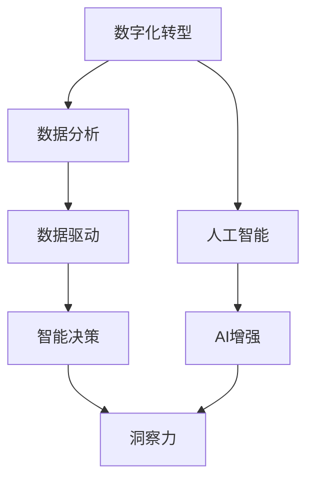

                 

# 数字化洞察力望远镜：AI增强的远见卓识工具

> 关键词：数字转型, 数字化洞察, AI增强, 智能决策, 知识管理, 数据驱动

## 1. 背景介绍

### 1.1 问题由来
随着信息技术的不断演进，数字化转型的浪潮席卷全球，企业纷纷加快数字化转型步伐，利用数据驱动增强企业决策力，提升核心竞争力。然而，企业通常面临海量数据，难以及时、准确地进行数据分析，进而生成有效的洞察。面对这一挑战，AI技术在数据处理、分析、洞察和决策中发挥着越来越重要的作用，尤其是AI增强的洞察力工具，正逐渐成为数字化转型的利器。

### 1.2 问题核心关键点
AI增强的洞察力工具的核心在于如何利用人工智能技术对大量数据进行高效分析，并生成有价值的洞察。这涉及以下几个关键点：
1. 数据处理与清洗：如何高效处理并清洗海量数据，去除噪音，确保数据质量。
2. 模型构建与训练：如何选择合适的机器学习模型，利用标注数据进行高效训练。
3. 洞察生成与展示：如何通过自动化工具和可视化技术，生成和展示关键的洞察和建议。
4. 人机协同：如何设计用户友好的交互界面，使决策者能够轻松利用AI工具进行洞察。

### 1.3 问题研究意义
AI增强的洞察力工具能够帮助企业高效地利用数据，生成有价值的洞察，助力企业做出更明智的决策。通过深入研究这一工具，可以优化企业的决策过程，提升业务运营效率，加速企业数字化转型。

## 2. 核心概念与联系

### 2.1 核心概念概述

为更好地理解AI增强的洞察力工具，本节将介绍几个密切相关的核心概念：

- 数字化转型(Digital Transformation)：通过利用信息通信技术(ICT)和数据分析，改进企业的运营模式，提升企业效率和竞争力。
- 数据分析(Analytics)：对原始数据进行清理、处理和分析，从中提取有用信息和洞察。
- 数据驱动(Driven by Data)：决策过程基于数据的收集、处理和分析，而非经验或直觉。
- 智能决策(Intelligent Decision-making)：利用AI技术辅助决策，生成基于数据分析的洞察。
- 洞察力(Insight)：通过数据处理和分析得到的关键信息或结论，帮助决策者理解业务趋势和问题。

这些概念之间的关系可以通过以下Mermaid流程图来展示：



这个流程图展示了数字化转型的核心流程，从数字化转型开始，通过数据分析得到数据驱动，利用智能决策生成洞察力，最终形成对业务的深刻理解。

## 3. 核心算法原理 & 具体操作步骤

### 3.1 算法原理概述

AI增强的洞察力工具主要利用机器学习、深度学习和自然语言处理等技术，通过以下流程生成有价值的洞察：

1. **数据采集与预处理**：从多个渠道获取结构化和非结构化数据，进行清洗、转换和合并，形成可用于分析的数据集。
2. **特征工程**：通过特征选择和特征提取，生成模型所需的输入特征。
3. **模型训练**：利用标注数据训练模型，使其能够识别数据中的模式和规律。
4. **洞察生成**：利用训练好的模型对新的数据进行分析和预测，生成有价值的洞察。
5. **洞察展示**：将洞察通过可视化图表、报告等形式展示给决策者，便于理解和应用。

### 3.2 算法步骤详解

#### 3.2.1 数据采集与预处理

数据采集与预处理是AI洞察工具的重要环节，涉及以下步骤：

1. **数据来源**：从企业内部系统、公共数据源、第三方平台等多种渠道获取数据。
2. **数据清洗**：通过去重、去噪、填补缺失值等操作，去除数据中的噪音和无效信息。
3. **数据转换**：将非结构化数据转换为可用于分析的结构化数据，如文本数据转换为词向量。
4. **数据合并**：将来自不同渠道的数据合并，形成统一的数据集，便于后续分析。

#### 3.2.2 特征工程

特征工程的目标是从原始数据中提取有意义的特征，以供模型学习。主要步骤包括：

1. **特征选择**：根据领域知识和领域内知识选择对问题有意义的特征。
2. **特征提取**：通过技术手段，如TF-IDF、Word2Vec等，将文本、图像等非结构化数据转换为数值型特征。
3. **特征转换**：使用标准化、归一化等方法，调整特征数据分布，提升模型效果。

#### 3.2.3 模型训练

模型训练是AI洞察工具的核心环节，主要包括：

1. **选择模型**：根据问题类型和数据特点，选择合适的机器学习模型，如线性回归、决策树、随机森林等。
2. **数据划分**：将数据划分为训练集和测试集，用于模型训练和性能评估。
3. **模型训练**：利用训练集训练模型，不断调整模型参数，最小化损失函数，得到最优模型。

#### 3.2.4 洞察生成

洞察生成依赖于训练好的模型对新数据的预测和分析，主要步骤包括：

1. **数据输入**：将新的数据输入模型进行预测或分类。
2. **结果解析**：根据模型输出解析预测结果或分类结果，形成有意义的洞察。
3. **洞察验证**：通过对比模型预测和实际结果，验证模型的准确性和可靠性。

#### 3.2.5 洞察展示

洞察展示是将洞察结果以易于理解的形式展示给决策者，主要包括：

1. **数据可视化**：使用图表、仪表盘等可视化工具展示关键指标和趋势。
2. **洞察报告**：生成包含洞察结果、建议和预测的报告，帮助决策者理解和应用。
3. **交互界面**：设计用户友好的交互界面，便于决策者输入数据、调整参数和查看洞察结果。

### 3.3 算法优缺点

AI增强的洞察力工具具有以下优点：

1. **高效性**：通过自动化流程，大幅减少数据处理和分析时间，提高工作效率。
2. **准确性**：利用高质量的机器学习模型和标注数据，生成准确且有价值的洞察。
3. **灵活性**：支持多种数据源和分析方式，适应不同业务需求。
4. **可扩展性**：随着数据和业务场景的扩展，工具的扩展性和可定制性较好。

同时，该工具也存在一定的局限性：

1. **依赖标注数据**：模型训练和分析依赖标注数据，缺乏标注数据时难以产生有效洞察。
2. **模型复杂性**：大规模模型的训练和调参复杂，对计算资源要求较高。
3. **数据隐私问题**：处理大量敏感数据时，需要严格控制数据隐私和安全性。
4. **结果可解释性**：AI模型的决策过程和结果可解释性差，难以理解和解释模型输出。

尽管存在这些局限性，但AI增强的洞察力工具仍是大数据时代企业决策的重要工具。未来相关研究的重点在于如何进一步提升工具的自动化程度和可解释性，同时解决数据隐私和安全性问题。

### 3.4 算法应用领域

AI增强的洞察力工具在众多领域都有广泛的应用，例如：

1. **市场营销**：通过分析客户行为和市场趋势，优化营销策略，提升销售额。
2. **供应链管理**：利用数据分析优化供应链运营，降低成本，提高效率。
3. **金融风控**：通过分析交易数据，识别欺诈行为，降低金融风险。
4. **人力资源管理**：利用员工数据和绩效评估，优化招聘和培训策略，提升员工满意度。
5. **产品研发**：通过市场分析和客户反馈，指导新产品设计和改进，提升产品质量和市场竞争力。
6. **客户服务**：通过分析客户反馈和需求，优化客户服务流程，提升客户满意度。

除了上述这些领域，AI增强的洞察力工具也被创新性地应用于医疗健康、公共安全、智能制造等多个行业，为数字化转型提供了强大的技术支撑。

## 4. 数学模型和公式 & 详细讲解 & 举例说明

### 4.1 数学模型构建

以线性回归模型为例，构建数学模型。设$y$为预测目标，$x_1,x_2,\ldots,x_n$为输入特征，$\beta_0,\beta_1,\ldots,\beta_n$为模型参数，则线性回归模型可以表示为：

$$
y = \beta_0 + \beta_1x_1 + \beta_2x_2 + \cdots + \beta_nx_n + \epsilon
$$

其中，$\epsilon$为误差项，$n$为输入特征数量。

### 4.2 公式推导过程

在线性回归模型中，目标是最小化预测值与实际值之间的误差。常用的损失函数为均方误差(MSE)：

$$
\mathcal{L}(\theta) = \frac{1}{2N}\sum_{i=1}^N (y_i - \hat{y}_i)^2
$$

其中，$N$为样本数量，$\hat{y}_i = \beta_0 + \beta_1x_{i1} + \beta_2x_{i2} + \cdots + \beta_nx_{in}$ 为第$i$个样本的预测值。

通过梯度下降等优化算法，求解最小化损失函数的模型参数$\beta$。具体优化过程如下：

1. **损失函数求导**：对损失函数求偏导，得到每个参数的梯度。
2. **更新参数**：根据梯度下降公式，更新模型参数。
3. **迭代优化**：反复迭代更新参数，直至收敛。

### 4.3 案例分析与讲解

以销售预测为例，展示如何使用线性回归模型进行数据驱动的决策。

设一家零售公司希望预测未来三个月的销售额，可以采集过去六个月的销售额作为输入特征，将当前月份的销售额作为目标输出。通过线性回归模型，得到模型参数$\beta$，用于预测未来三个月的销售额。预测结果可以使用均方误差(MSE)进行评估。

通过对比模型预测结果与实际销售额，可以发现模型预测的准确性，进一步优化模型参数，提高预测效果。

## 5. 项目实践：代码实例和详细解释说明

### 5.1 开发环境搭建

在进行项目实践前，我们需要准备好开发环境。以下是使用Python进行Scikit-Learn开发的环境配置流程：

1. 安装Anaconda：从官网下载并安装Anaconda，用于创建独立的Python环境。

2. 创建并激活虚拟环境：
```bash
conda create -n scikit-learn-env python=3.8 
conda activate scikit-learn-env
```

3. 安装Scikit-Learn：
```bash
conda install scikit-learn
```

4. 安装Pandas、Matplotlib、NumPy等辅助库：
```bash
pip install pandas matplotlib numpy
```

5. 安装TensorFlow和Keras：
```bash
pip install tensorflow keras
```

完成上述步骤后，即可在`scikit-learn-env`环境中开始项目实践。

### 5.2 源代码详细实现

以下是一个使用Scikit-Learn进行线性回归的示例代码：

```python
from sklearn.linear_model import LinearRegression
import pandas as pd
import numpy as np
import matplotlib.pyplot as plt

# 加载数据
data = pd.read_csv('sales.csv')

# 划分训练集和测试集
train_data = data.iloc[:6].copy()
test_data = data.iloc[6:].copy()

# 准备特征和目标变量
X_train = train_data.drop('Sales', axis=1)
y_train = train_data['Sales']

X_test = test_data.drop('Sales', axis=1)
y_test = test_data['Sales']

# 训练模型
model = LinearRegression()
model.fit(X_train, y_train)

# 预测结果
y_pred = model.predict(X_test)

# 评估结果
mse = np.mean((y_pred - y_test) ** 2)
print(f'Mean Squared Error: {mse:.2f}')

# 可视化结果
plt.scatter(X_test['Sales'], y_test, color='blue', label='Actual')
plt.scatter(X_test['Sales'], y_pred, color='red', label='Predicted')
plt.legend()
plt.show()
```

在这个示例中，我们首先加载销售数据，并划分训练集和测试集。然后，使用线性回归模型对训练集进行训练，并使用测试集进行评估。最后，通过可视化工具展示预测结果和实际结果的对比。

### 5.3 代码解读与分析

让我们再详细解读一下关键代码的实现细节：

**线性回归模型训练**：
- 使用Scikit-Learn库中的LinearRegression类创建线性回归模型。
- 调用fit方法对模型进行训练，传入训练集数据(X_train)和目标变量(y_train)。
- 使用predict方法对测试集数据(X_test)进行预测，得到预测结果(y_pred)。

**模型评估**：
- 使用均方误差(MSE)评估模型预测结果与实际结果之间的差距。
- 输出MSE值，以便后续优化模型。

**可视化展示**：
- 使用Matplotlib库绘制实际销售额和预测销售额的散点图。
- 通过颜色和图例区分实际和预测结果，便于直观观察。

通过Scikit-Learn库，我们能够轻松实现线性回归模型的训练和评估。对于更复杂的模型和任务，Scikit-Learn库提供了丰富的算法和工具，可以方便地进行模型构建和优化。

## 6. 实际应用场景

### 6.1 营销分析

AI增强的洞察力工具在营销分析中大放异彩，通过分析消费者行为和市场趋势，企业可以制定更加精准的营销策略。例如，通过分析社交媒体数据，识别用户兴趣和偏好，针对性地推送广告和促销活动。

### 6.2 供应链优化

在供应链管理中，AI洞察力工具能够通过分析供应商数据、物流数据、库存数据等，优化库存管理，降低物流成本，提升供应链效率。例如，通过分析历史订单数据，预测未来的需求量和库存水平，进行动态调度和优化。

### 6.3 金融风控

金融行业面临复杂的风险管理问题，AI洞察力工具能够通过分析交易数据、客户行为数据等，识别异常交易和欺诈行为，降低金融风险。例如，通过分析信用卡交易数据，识别潜在的欺诈行为，进行风险预警和控制。

### 6.4 医疗诊断

AI增强的洞察力工具在医疗诊断中也有广泛应用。通过分析病历数据、医学影像数据等，医生可以做出更准确的诊断和治疗决策。例如，通过分析影像数据，识别病变区域和疾病类型，进行辅助诊断。

### 6.5 智能制造

在智能制造中，AI洞察力工具能够通过分析生产数据、设备数据等，优化生产流程，提升生产效率和产品质量。例如，通过分析生产线数据，识别瓶颈环节和异常设备，进行优化和维护。

## 7. 工具和资源推荐

### 7.1 学习资源推荐

为了帮助开发者系统掌握AI增强的洞察力工具的理论基础和实践技巧，这里推荐一些优质的学习资源：

1. 《Python机器学习》书籍：以Scikit-Learn为工具，深入浅出地介绍了机器学习的基础知识和应用。
2. Coursera《机器学习》课程：由斯坦福大学Andrew Ng教授主讲，涵盖机器学习的基础和进阶内容，并附有大量编程练习。
3. TensorFlow官方文档：详细介绍了TensorFlow框架的使用方法和API，适合深度学习和AI项目开发。
4. Kaggle竞赛平台：提供丰富的数据集和竞赛题目，适合学习数据分析和机器学习技术。
5. DataCamp在线学习平台：提供丰富的数据分析和机器学习课程，适合初学者和进阶开发者。

通过对这些资源的学习实践，相信你一定能够快速掌握AI增强的洞察力工具的核心技术，并用于解决实际的业务问题。

### 7.2 开发工具推荐

高效的开发离不开优秀的工具支持。以下是几款用于AI洞察工具开发的常用工具：

1. Jupyter Notebook：开源的交互式编程环境，支持Python、R等多种编程语言，适合数据探索和模型开发。
2. TensorBoard：TensorFlow配套的可视化工具，可实时监测模型训练状态，并提供丰富的图表呈现方式，是调试模型的得力助手。
3. Weights & Biases：模型训练的实验跟踪工具，可以记录和可视化模型训练过程中的各项指标，方便对比和调优。
4. Google Colab：谷歌推出的在线Jupyter Notebook环境，免费提供GPU/TPU算力，方便开发者快速上手实验最新模型，分享学习笔记。
5. PyCharm：强大的IDE开发工具，支持Python、Scikit-Learn、TensorFlow等库，提供代码补全、调试、版本控制等功能。

合理利用这些工具，可以显著提升AI洞察工具的开发效率，加快创新迭代的步伐。

### 7.3 相关论文推荐

AI增强的洞察力工具的发展源于学界的持续研究。以下是几篇奠基性的相关论文，推荐阅读：

1. "Machine Learning: A Probabilistic Perspective" 书籍：Tom Mitchell著作，系统介绍了机器学习的基础理论和应用。
2. "Deep Learning" 书籍：Ian Goodfellow著作，全面介绍了深度学习的基础知识和应用。
3. "Anomaly Detection with Deep Learning" 论文：利用深度学习模型进行异常检测，具有较高的应用价值。
4. "Neural Collaborative Filtering" 论文：利用神经网络进行推荐系统构建，具有较高的理论价值和应用价值。
5. "Text Mining: Introduction to Techniques and Algorithms" 书籍：Jibo Lin著作，介绍了文本挖掘的基础知识和应用。

这些论文代表了大数据时代AI洞察工具的研究方向，通过学习这些前沿成果，可以帮助研究者把握学科前进方向，激发更多的创新灵感。

## 8. 总结：未来发展趋势与挑战

### 8.1 总结

本文对AI增强的洞察力工具进行了全面系统的介绍。首先阐述了AI增强工具在数字化转型中的重要地位，明确了其在数据驱动决策中的应用价值。其次，从原理到实践，详细讲解了AI洞察工具的数学模型和操作步骤，给出了完整的代码实现。同时，本文还探讨了AI洞察工具在各个行业领域的应用前景，展示了其广阔的发展潜力。最后，本文精选了AI洞察工具的学习资源、开发工具和相关论文，力求为读者提供全方位的技术指引。

通过本文的系统梳理，可以看到，AI增强的洞察力工具正在成为企业决策的重要工具，极大地提升了数据驱动决策的效率和准确性。未来，伴随AI技术的不断发展，AI洞察工具将迎来更多的创新和突破，为企业提供更加精准和高效的数据支持。

### 8.2 未来发展趋势

展望未来，AI增强的洞察力工具将呈现以下几个发展趋势：

1. 模型自动化：通过自动化工具，减少手动调参和数据处理的工作量，提升模型构建效率。
2. 多模态融合：将文本、图像、语音等多模态数据结合，形成更全面、准确的数据洞察。
3. 实时分析：通过实时数据流处理技术，实现数据的实时分析和洞察，满足业务对实时性的需求。
4. 联邦学习：在保护数据隐私的前提下，利用联邦学习技术进行分布式数据分析，提升模型的泛化能力。
5. 知识图谱：将符号化的知识图谱与神经网络模型结合，生成更有意义的洞察和建议。
6. 决策支持：通过知识图谱、因果分析等技术，增强决策支持的智能化程度，提升决策质量。

这些趋势凸显了AI洞察工具在数据驱动决策中的重要作用，将进一步提升企业的数据利用能力和决策效率。

### 8.3 面临的挑战

尽管AI增强的洞察力工具已经取得了显著成果，但在实际应用中也面临诸多挑战：

1. 数据隐私和安全性：处理敏感数据时，需要严格控制数据隐私和安全性，避免数据泄露和滥用。
2. 模型可解释性：AI模型的决策过程和结果可解释性差，难以理解和解释模型输出。
3. 数据质量和多样性：海量数据中存在噪音和缺失值，需要预处理和清洗，以确保数据质量。
4. 模型复杂性：大规模模型的训练和调参复杂，对计算资源要求较高。
5. 业务理解：AI洞察工具需要深入理解业务需求和数据特点，才能生成有价值的洞察。

尽管存在这些挑战，但AI洞察工具的发展方向是清晰的，需要通过技术创新和业务融合，不断提升工具的自动化程度和智能化水平。

### 8.4 研究展望

面对AI洞察工具所面临的挑战，未来的研究需要在以下几个方面寻求新的突破：

1. 自动化和智能化：开发更智能化的模型构建工具，提升模型的自动化和智能化水平。
2. 数据融合与预处理：利用先进的预处理技术，提升数据的处理效率和质量。
3. 模型可解释性：引入可解释性技术，如LIME、SHAP等，提升模型的可解释性和透明性。
4. 数据隐私保护：研究联邦学习、差分隐私等技术，保护数据隐私和安全性。
5. 跨领域融合：将AI洞察工具与其他AI技术进行融合，如强化学习、知识图谱等，提升工具的全面性和适应性。

这些研究方向的探索，必将引领AI洞察工具迈向更高的台阶，为构建智能决策系统提供强大的技术支撑。

## 9. 附录：常见问题与解答

**Q1：AI增强的洞察力工具是否适用于所有企业？**

A: AI增强的洞察力工具适用于大多数企业，特别是数据量较大、业务复杂的企业。对于数据量较小、业务简单的企业，可以考虑使用更简单的数据分析工具。

**Q2：如何选择适合企业的AI洞察工具？**

A: 选择适合的AI洞察工具需要考虑以下几个方面：
1. 数据规模：处理海量数据的工具，需要较强的计算能力和存储能力。
2. 数据类型：支持多种数据源和数据类型的工具，能够满足不同业务需求。
3. 技术成熟度：选择技术成熟、性能稳定的工具，减少项目风险和成本。
4. 可定制性：支持用户自定义和扩展的工具，能够满足企业特定的业务需求。
5. 可扩展性：支持分布式处理和云服务，能够适应企业数据量和业务扩展的需求。

**Q3：如何提高AI洞察工具的决策准确性？**

A: 提高AI洞察工具的决策准确性需要从以下几个方面入手：
1. 数据质量：确保数据准确、完整、及时，减少噪音和偏差。
2. 模型选择：选择适合业务需求的模型，并进行优化和调参，提升模型效果。
3. 数据融合：将多源数据结合，提升数据的多样性和丰富度。
4. 模型集成：采用集成学习方法，结合多个模型的预测结果，提升决策准确性。
5. 人工审核：在模型输出基础上，进行人工审核和校验，确保决策质量。

**Q4：AI洞察工具是否需要经常更新和维护？**

A: AI洞察工具需要定期更新和维护，以适应业务需求的变化和模型的老化。具体需要考虑以下几个方面：
1. 数据更新：定期更新数据集，保持模型的时效性和准确性。
2. 模型优化：定期优化模型，提升模型的性能和泛化能力。
3. 安全更新：定期进行模型安全更新，防止模型被攻击和滥用。
4. 用户培训：定期进行用户培训，提升用户对工具的理解和应用能力。

通过合理的更新和维护，可以确保AI洞察工具的持续稳定运行，为企业提供长期稳定的数据支持。

**Q5：AI洞察工具是否需要考虑业务流程的复杂性？**

A: AI洞察工具需要考虑业务流程的复杂性，以确保洞察结果符合业务需求。具体需要考虑以下几个方面：
1. 业务流程建模：利用业务流程建模工具，构建业务流程和数据流图，指导洞察工具的开发。
2. 业务需求分析：深入理解业务需求和业务流程，设计符合业务需求的洞察工具。
3. 用户接口设计：设计用户友好的界面和交互方式，提升用户的使用体验。
4. 数据接口整合：将洞察工具与其他系统接口整合，实现数据的自动传输和共享。
5. 持续改进：根据业务反馈，持续改进洞察工具，提升其适应性和可用性。

通过合理的业务流程分析，可以确保AI洞察工具能够真正解决业务问题，提升企业的运营效率和竞争力。

---

作者：禅与计算机程序设计艺术 / Zen and the Art of Computer Programming

