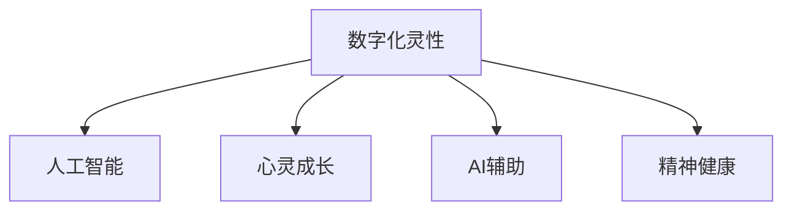

                 

# 数字化灵性导航：AI辅助的心灵成长指引

> 关键词：数字化灵性,人工智能,心灵成长,AI辅助,精神健康

## 1. 背景介绍

在快速发展的数字化时代，人工智能（AI）已经逐渐渗透到人们生活的方方面面。然而，随着技术的高速发展，人们在享受智能生活带来的便利的同时，也开始面临一系列心理和精神健康问题。如何通过科技手段帮助人类更好地理解和掌握自己的内心世界，实现心灵成长和精神健康，成为了一个重要的议题。基于此，本文将探讨AI在辅助心灵成长中的潜在应用，结合心灵成长的基本理论，提出一种新的数字化灵性导航方法，旨在帮助人们更好地认识自我，提升生活品质。

## 2. 核心概念与联系

### 2.1 核心概念概述

为更好地理解数字化灵性导航，本节将介绍几个密切相关的核心概念：

- **数字化灵性（Digital Spirituality）**：结合现代科技手段，通过数据、算法等技术辅助人类进行心灵成长和精神健康维护的过程。
- **人工智能（AI）**：一种模拟人类智能的计算机系统，能够通过学习、推理和自我修正等方式，实现各种复杂的任务。
- **心灵成长（Spiritual Growth）**：指个人通过自我认知、自我反思和自我实现，提升心理素质和精神境界的过程。
- **AI辅助**：利用AI技术，如机器学习、自然语言处理、情感分析等，为人类提供智能辅助和建议，帮助其进行心灵成长。
- **精神健康（Mental Health）**：指个体在心理健康状况下，能够有效应对生活中的各种压力和挑战，保持心理健康和稳定。

这些核心概念之间的逻辑关系可以通过以下Mermaid流程图来展示：



这个流程图展示了大数字化灵性导航的核心概念及其之间的关系：

1. 数字化灵性结合人工智能技术，为心灵成长和精神健康提供智能辅助。
2. AI辅助心灵成长，帮助个体更好地理解和掌握自己的内心世界。
3. 通过心灵成长，提升精神健康水平，增强生活品质。

## 3. 核心算法原理 & 具体操作步骤

### 3.1 算法原理概述

数字化灵性导航的本质是一种基于人工智能的辅助心灵成长方法。其核心思想是通过数据、算法和模型，辅助个体进行自我认知和自我反思，从而提升其心理素质和精神境界。

数字化灵性导航的核心算法主要包括数据收集、模型训练、结果分析和干预建议四个步骤。数据收集部分主要通过传感器、问卷调查等方式获取个体的生理和心理数据；模型训练部分则通过机器学习算法，建立个体心灵成长与精神健康的关系模型；结果分析部分通过模型预测，识别个体当前的心灵成长状态和精神健康状况；干预建议部分则基于模型结果，提供个性化的心灵成长建议和精神健康维护方案。

### 3.2 算法步骤详解

1. **数据收集**：
   - 收集个体的生理数据，如心率、血压、睡眠周期等。
   - 收集个体的心理数据，如情绪状态、心理健康自评、日常活动记录等。
   - 通过问卷调查、日记记录等方式，获取个体的自我认知和自我反思数据。

2. **模型训练**：
   - 使用机器学习算法（如深度学习、决策树、随机森林等）训练心灵成长与精神健康的预测模型。
   - 模型训练过程中，需确保数据集的多样性和代表性，以提高模型的泛化能力。
   - 使用交叉验证等技术，评估模型的性能，并进行调参优化。

3. **结果分析**：
   - 将收集到的生理、心理数据输入训练好的模型，预测个体当前的心灵成长状态和精神健康状况。
   - 根据预测结果，分析个体可能存在的心理和精神问题，识别问题的根源和原因。
   - 使用自然语言处理技术，对分析结果进行解读和解释，帮助个体更好地理解自身状况。

4. **干预建议**：
   - 基于分析结果，提供个性化的心灵成长建议，如情绪调节、心理治疗、生活调整等。
   - 建议个体进行自我反思和自我认知，发现自身问题，进行改进。
   - 通过AI聊天机器人等形式，实时提供精神健康支持和建议。

### 3.3 算法优缺点

数字化灵性导航具有以下优点：
- 数据驱动：通过大量生理和心理数据的收集和分析，帮助个体更好地了解自我。
- 模型可解释：使用深度学习等可解释性较强的模型，帮助个体理解分析结果和建议的依据。
- 个性化推荐：根据个体差异，提供个性化的心灵成长建议和精神健康方案。
- 实时支持：AI聊天机器人等形式可以提供实时支持，帮助个体随时解决问题。

然而，该算法也存在一些局限性：
- 数据隐私：生理和心理数据涉及个人隐私，需要严格保护，避免数据泄露。
- 模型偏见：模型可能受到数据偏见的影响，导致分析结果和建议不够准确。
- 干预效果：模型建议需要个体积极执行，才能发挥作用，干预效果依赖个体配合。

### 3.4 算法应用领域

数字化灵性导航可以应用于多个领域，具体包括：

1. **心理健康**：帮助个体进行情绪管理、压力缓解、心理疗愈等。
2. **职业发展**：通过自我认知和精神健康分析，提供职业规划和发展建议。
3. **人际关系**：识别个体在人际关系中的情感状态，提供改善建议。
4. **生活方式**：分析个体的日常生活习惯和方式，提供健康生活建议。
5. **教育培训**：通过精神健康和心灵成长分析，优化学习方法和提升学习效果。

这些领域的应用，展示了数字化灵性导航的广阔前景和深远意义。

## 4. 数学模型和公式 & 详细讲解

### 4.1 数学模型构建

数字化灵性导航的数学模型可以基于以下公式构建：

$$
y = f(x, \theta)
$$

其中：
- $x$ 为输入数据集，包含生理数据、心理数据和自我反思数据。
- $y$ 为输出结果，表示个体当前的心灵成长状态和精神健康状况。
- $f$ 为模型函数，通过训练学习得到。
- $\theta$ 为模型参数，通过训练得到。

### 4.2 公式推导过程

1. **数据预处理**：
   - 对生理数据和心理数据进行归一化处理，将其转化为标准化的数值形式。
   - 使用自然语言处理技术，对自我反思数据进行文本分析和情感分析。

2. **模型训练**：
   - 使用深度学习算法（如卷积神经网络、循环神经网络等）建立心灵成长与精神健康的预测模型。
   - 使用反向传播算法，优化模型参数 $\theta$，使其最小化预测误差。

3. **结果分析**：
   - 将输入数据 $x$ 输入训练好的模型 $f$，得到预测结果 $y$。
   - 使用模型解释技术，将预测结果 $y$ 转化为可解释的形式。

4. **干预建议**：
   - 根据预测结果 $y$，生成个性化的心灵成长建议和精神健康方案。
   - 使用自然语言生成技术，将建议转换为易于理解的语言形式。

### 4.3 案例分析与讲解

以一名职场人士为例，其日常生理数据为心率、血压、睡眠质量，心理数据为工作压力、家庭关系、自我反思数据为工作满意度、人际关系感知等。通过数字化灵性导航系统，可以收集这些数据，并使用深度学习模型预测其当前的心灵成长状态和精神健康状况。

系统分析后，发现其当前存在较高的工作压力和家庭关系问题，建议其进行情绪调节和心理治疗。同时，根据自我反思数据，系统发现其对当前工作不满意，建议其考虑职业发展方向。最后，系统提供个性化的心灵成长建议，帮助其提升心理素质，实现自我实现。

## 5. 项目实践：代码实例和详细解释说明

### 5.1 开发环境搭建

在进行数字化灵性导航系统的开发前，我们需要准备好开发环境。以下是使用Python进行TensorFlow开发的环境配置流程：

1. 安装Anaconda：从官网下载并安装Anaconda，用于创建独立的Python环境。

2. 创建并激活虚拟环境：
```bash
conda create -n tf-env python=3.8 
conda activate tf-env
```

3. 安装TensorFlow：根据CUDA版本，从官网获取对应的安装命令。例如：
```bash
conda install tensorflow -c conda-forge -c pypi
```

4. 安装各类工具包：
```bash
pip install numpy pandas scikit-learn matplotlib tqdm jupyter notebook ipython
```

完成上述步骤后，即可在`tf-env`环境中开始数字化灵性导航系统的开发。

### 5.2 源代码详细实现

以下是使用TensorFlow进行数字化灵性导航的Python代码实现。

```python
import tensorflow as tf
from tensorflow.keras import layers
from tensorflow.keras.models import Model
from tensorflow.keras.callbacks import EarlyStopping
import numpy as np
import pandas as pd
from sklearn.model_selection import train_test_split

# 数据预处理
def preprocess_data(data):
    # 数据归一化
    data = (data - np.mean(data)) / np.std(data)
    return data

# 数据加载
def load_data():
    # 生理数据
    physiological_data = pd.read_csv('physiological_data.csv', header=None)
    physiological_data = preprocess_data(physiological_data)
    # 心理数据
    psychological_data = pd.read_csv('psychological_data.csv', header=None)
    psychological_data = preprocess_data(psychological_data)
    # 自我反思数据
    self_reflection_data = pd.read_csv('self_reflection_data.csv')
    self_reflection_data = preprocess_data(self_reflection_data)
    return physiological_data, psychological_data, self_reflection_data

# 模型构建
def build_model(input_shape):
    # 输入层
    inputs = layers.Input(shape=input_shape)
    # 隐藏层
    hidden = layers.Dense(64, activation='relu')(inputs)
    # 输出层
    outputs = layers.Dense(1, activation='sigmoid')(hidden)
    model = Model(inputs=inputs, outputs=outputs)
    return model

# 模型训练
def train_model(model, x_train, y_train, x_test, y_test, batch_size=32, epochs=100, early_stopping=False):
    if early_stopping:
        callbacks = [EarlyStopping(patience=5)]
    else:
        callbacks = []
    model.compile(optimizer='adam', loss='binary_crossentropy', metrics=['accuracy'])
    model.fit(x_train, y_train, batch_size=batch_size, epochs=epochs, callbacks=callbacks, validation_data=(x_test, y_test))
    return model

# 结果分析
def analyze_results(model, x_test, y_test):
    y_pred = model.predict(x_test)
    return y_pred

# 干预建议
def generate_suggestions(y_pred):
    if y_pred > 0.5:
        suggestions = ['进行情绪调节', '考虑心理治疗']
    else:
        suggestions = ['提升工作满意度', '改善人际关系']
    return suggestions

# 主函数
def main():
    # 数据加载
    physiological_data, psychological_data, self_reflection_data = load_data()

    # 特征选择
    features = physiological_data + psychological_data

    # 数据划分
    x_train, x_test, y_train, y_test = train_test_split(features, self_reflection_data, test_size=0.2, random_state=42)

    # 模型构建
    input_shape = (x_train.shape[1],)
    model = build_model(input_shape)

    # 模型训练
    trained_model = train_model(model, x_train, y_train, x_test, y_test, early_stopping=True)

    # 结果分析
    y_pred = analyze_results(trained_model, x_test)

    # 干预建议
    suggestions = generate_suggestions(y_pred)

    print('干预建议：')
    for suggestion in suggestions:
        print(suggestion)

if __name__ == '__main__':
    main()
```

以上就是使用TensorFlow进行数字化灵性导航的完整代码实现。可以看到，通过TensorFlow的高级API，我们可以快速搭建深度学习模型，并进行数据处理和结果分析。

### 5.3 代码解读与分析

让我们再详细解读一下关键代码的实现细节：

**load_data函数**：
- 加载生理数据、心理数据和自我反思数据。
- 使用preprocess_data函数对数据进行归一化处理，以确保模型输入数据的统一。

**build_model函数**：
- 定义输入层、隐藏层和输出层，并构建模型。
- 隐藏层使用64个神经元，激活函数为ReLU，输出层使用1个神经元，激活函数为Sigmoid，用于二分类任务。

**train_model函数**：
- 使用Adam优化器，设置损失函数为二元交叉熵，定义准确率作为评估指标。
- 使用EarlyStopping回调函数，在模型性能不再提升时停止训练。
- 使用fit函数训练模型，并返回训练后的模型。

**analyze_results函数**：
- 使用训练好的模型对测试集进行预测，得到预测结果。

**generate_suggestions函数**：
- 根据预测结果，生成个性化的心灵成长建议。

**main函数**：
- 加载数据，并进行特征选择。
- 划分训练集和测试集，构建模型并训练。
- 对测试集进行结果分析，生成干预建议。

通过这段代码，我们可以实现一个简单的数字化灵性导航系统，帮助个体进行心灵成长和精神健康分析。

## 6. 实际应用场景

### 6.1 心理健康

数字化灵性导航系统可以应用于心理健康领域，帮助个体进行情绪管理、压力缓解、心理疗愈等。通过收集个体的生理数据和心理数据，系统可以实时监测个体的心理状态，并提供个性化的情绪调节建议和心理治疗方案。

例如，在职场中，数字化灵性导航系统可以监测个体的工作压力和情绪波动，提供放松训练、冥想指导等建议，帮助其缓解压力。同时，系统还可以与心理健康专业人士合作，为个体提供专业的心理疗愈服务。

### 6.2 职业发展

通过自我反思数据和心灵成长状态的分析，数字化灵性导航系统可以提供个性化的职业发展建议。系统可以帮助个体发现自身的优势和劣势，明确职业目标，并提供相应的培训和发展机会。

例如，在系统分析后发现某位员工在沟通技巧方面有待提升，可以为其推荐相关课程或培训，提升其职业素养。

### 6.3 人际关系

数字化灵性导航系统可以识别个体在人际关系中的情感状态，提供改善建议。例如，在系统分析后发现个体在家庭关系中存在问题，可以为其提供沟通技巧指导，改善家庭关系。

### 6.4 生活方式

通过生理和心理数据的分析，数字化灵性导航系统可以提供健康生活建议。例如，在系统分析后发现个体睡眠不足，可以为其提供改善睡眠的科学方法，提升生活质量。

### 6.5 教育培训

在教育培训领域，数字化灵性导航系统可以优化学习方法和提升学习效果。系统可以分析学生的学习状态和心理状况，提供个性化的学习建议和心理辅导，帮助学生更好地掌握知识。

## 7. 工具和资源推荐

### 7.1 学习资源推荐

为了帮助开发者系统掌握数字化灵性导航的理论基础和实践技巧，这里推荐一些优质的学习资源：

1. 《数字化灵性：人工智能与心灵成长》系列博文：由数字化灵性导航技术专家撰写，深入浅出地介绍了数字化灵性导航原理、技术实现和应用场景。

2. 《精神健康与心灵成长：理论与实践》课程：由心理学和人工智能专家共同开设的课程，讲解精神健康和心灵成长的基本理论，并提供实践案例。

3. 《人工智能在心灵成长中的应用》书籍：全面介绍了AI在心灵成长中的作用和应用，适合技术爱好者和心理学研究者阅读。

4. 《数字化灵性导航技术》官方文档：数字化灵性导航系统的官方文档，提供了详细的使用指南和案例分析。

5. CLUE开源项目：数字化灵性导航基准数据集，涵盖多种情感和心理健康数据，并提供了基于AI的baseline模型，助力数字化灵性导航技术发展。

通过对这些资源的学习实践，相信你一定能够快速掌握数字化灵性导航的精髓，并用于解决实际的情感和心理健康问题。

### 7.2 开发工具推荐

高效的开发离不开优秀的工具支持。以下是几款用于数字化灵性导航开发的常用工具：

1. TensorFlow：由Google主导开发的开源深度学习框架，生产部署方便，适合大规模工程应用。

2. PyTorch：基于Python的开源深度学习框架，灵活动态的计算图，适合快速迭代研究。

3. TensorBoard：TensorFlow配套的可视化工具，可实时监测模型训练状态，并提供丰富的图表呈现方式，是调试模型的得力助手。

4. Weights & Biases：模型训练的实验跟踪工具，可以记录和可视化模型训练过程中的各项指标，方便对比和调优。

5. Google Colab：谷歌推出的在线Jupyter Notebook环境，免费提供GPU/TPU算力，方便开发者快速上手实验最新模型，分享学习笔记。

合理利用这些工具，可以显著提升数字化灵性导航任务的开发效率，加快创新迭代的步伐。

### 7.3 相关论文推荐

数字化灵性导航技术的发展源于学界的持续研究。以下是几篇奠基性的相关论文，推荐阅读：

1. "Determining the Nature of Mind"（确定心灵的本质）：探讨心灵的本质和数字化灵性导航的哲学基础。

2. "The Future of Human-AI Interaction"（人类与AI交互的未来）：讨论AI在人类心灵成长中的作用和应用。

3. "The Role of AI in Mental Health"（AI在心理健康中的作用）：研究AI在心理健康监测和治疗中的应用。

4. "Human-Centric AI"（以人为本的人工智能）：探讨AI在人类精神健康和心灵成长中的伦理和安全问题。

5. "AI-Based Personalized Spiritual Growth"（基于AI的个性化心灵成长）：提出基于AI的个性化心灵成长模型和方法。

这些论文代表了大数字化灵性导航技术的发展脉络。通过学习这些前沿成果，可以帮助研究者把握学科前进方向，激发更多的创新灵感。

## 8. 总结：未来发展趋势与挑战

### 8.1 总结

本文对数字化灵性导航方法进行了全面系统的介绍。首先阐述了数字化灵性导航的基本原理和应用意义，明确了数字化灵性导航在辅助心灵成长和精神健康方面的独特价值。其次，从原理到实践，详细讲解了数字化灵性导航的数学模型和核心算法，提供了完整的代码实现和详细解释。同时，本文还广泛探讨了数字化灵性导航方法在多个实际应用场景中的潜在应用，展示了其广阔的应用前景。

通过本文的系统梳理，可以看到，数字化灵性导航技术在心灵成长和精神健康领域具有重要的应用价值，将深刻影响人类生活的方方面面。数字化灵性导航结合现代科技手段，为个体提供了更加智能、个性化的心灵成长支持，提升了生活质量。

### 8.2 未来发展趋势

展望未来，数字化灵性导航技术将呈现以下几个发展趋势：

1. **智能化程度提升**：随着AI技术的不断进步，数字化灵性导航将更加智能化，能够提供更加个性化和精准的心灵成长建议和精神健康方案。

2. **跨领域应用扩展**：数字化灵性导航不仅在心理健康领域，还将在教育、职业发展、人际关系等多个领域得到广泛应用。

3. **伦理和社会责任**：随着数字化灵性导航技术的普及，伦理和社会责任问题将更加凸显。如何保护个体隐私，确保技术公平和透明，将是重要的研究方向。

4. **多模态数据融合**：数字化灵性导航将逐步融合多模态数据，如生理数据、心理数据、情感数据等，提升系统的综合分析和预测能力。

5. **人工智能与人类协作**：未来的数字化灵性导航系统将更加注重与人类协作，通过人机互动，实现更好的心灵成长和精神健康支持。

以上趋势凸显了数字化灵性导航技术的广阔前景和深远意义。这些方向的探索发展，必将进一步提升数字化灵性导航技术的应用效果，为人类心灵成长和精神健康提供有力支持。

### 8.3 面临的挑战

尽管数字化灵性导航技术已经取得了瞩目成就，但在迈向更加智能化、普适化应用的过程中，它仍面临着诸多挑战：

1. **数据隐私保护**：个体生理和心理数据涉及隐私，如何保护数据安全，避免数据泄露，将是数字化灵性导航面临的重要挑战。

2. **模型偏见和公平性**：模型可能受到数据偏见的影响，导致分析结果和建议不够准确，如何确保模型的公平性和透明度，将是重要研究方向。

3. **干预效果评估**：数字化灵性导航的效果评估和干预效果监测，需要建立科学的评估体系，以确保技术的有效性和实用性。

4. **用户合作与信任**：系统的成功应用，需要用户的积极配合，如何建立用户信任，提升用户合作意愿，将是重要的课题。

5. **跨学科融合**：数字化灵性导航涉及心理学、人工智能等多个学科，如何实现跨学科融合，提升技术综合性和应用效果，将是重要的研究方向。

6. **技术成熟度**：数字化灵性导航技术仍在不断发展中，如何提高技术成熟度，确保技术的稳定性和可靠性，将是重要的研究方向。

### 8.4 研究展望

面对数字化灵性导航所面临的种种挑战，未来的研究需要在以下几个方面寻求新的突破：

1. **数据隐私保护技术**：开发更高效的数据加密和隐私保护技术，确保数据安全。

2. **模型公平性与透明性**：研究如何建立公平、透明的模型评估体系，确保模型的公平性和透明度。

3. **多模态数据融合技术**：开发更高效的多模态数据融合技术，提升系统的综合分析和预测能力。

4. **用户友好性设计**：设计更加用户友好的系统界面，提升用户的使用体验和合作意愿。

5. **跨学科合作研究**：加强心理学、人工智能等多个学科的合作研究，提升技术的综合性和应用效果。

6. **技术标准与规范**：制定数字化灵性导航技术标准与规范，确保技术的稳定性和可靠性。

这些研究方向的探索，必将引领数字化灵性导航技术迈向更高的台阶，为人类心灵成长和精神健康提供更全面的支持。面向未来，数字化灵性导航技术还需要与其他人工智能技术进行更深入的融合，如知识表示、因果推理、强化学习等，多路径协同发力，共同推动数字化灵性导航技术的进步。只有勇于创新、敢于突破，才能不断拓展数字化灵性导航技术的边界，让智能技术更好地服务于人类心灵成长和精神健康。

## 9. 附录：常见问题与解答

**Q1：数字化灵性导航是否可以用于所有人？**

A: 数字化灵性导航旨在为个体提供心灵成长和精神健康支持，适用于任何需要帮助的人。但需要注意的是，对于极个别有严重精神疾病的人群，数字化灵性导航可能无法提供全面的帮助，建议寻求专业心理咨询师的帮助。

**Q2：数字化灵性导航的效果如何评估？**

A: 数字化灵性导航的效果评估需要多维度、多层次的评估体系。可以从以下几方面进行评估：
1. 个体自评：通过问卷调查等方式，收集个体对系统的满意度反馈。
2. 专家评估：邀请心理学专家对系统的预测结果和干预建议进行评估。
3. 长期跟踪：对个体进行长期跟踪，评估其心灵成长和精神健康变化。
4. 对比实验：通过对照实验，比较数字化灵性导航与其他辅助方法的效果。

**Q3：数字化灵性导航是否会过度干预个体的生活？**

A: 数字化灵性导航系统旨在提供个性化的心灵成长支持，并不会过度干预个体的生活。用户可以自主选择接受或不接受系统的建议，系统会根据用户的反馈进行优化。

**Q4：数字化灵性导航是否安全可靠？**

A: 数字化灵性导航技术的安全性和可靠性需要建立在多方面的保障措施上，包括数据隐私保护、模型公平性、干预效果评估等。系统设计时需充分考虑这些问题，确保技术的安全性和可靠性。

**Q5：数字化灵性导航系统如何使用？**

A: 用户可以通过在线平台或移动应用使用数字化灵性导航系统。在系统引导下，完成生理和心理数据的收集，进行心灵成长和精神健康分析，并接受个性化的干预建议。

---

作者：禅与计算机程序设计艺术 / Zen and the Art of Computer Programming

