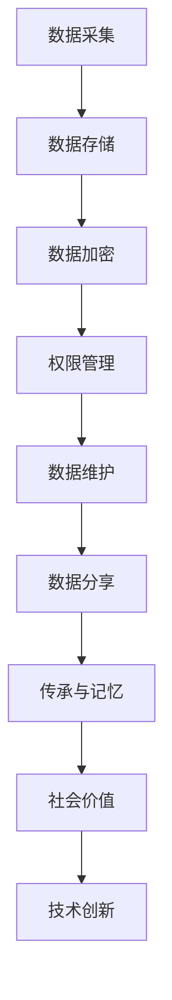

                 

# 数字化遗产档案创业：个人生平的数字化保存

> 关键词：数字化遗产,档案管理,个人信息保护,人工智能,区块链技术

## 1. 背景介绍

### 1.1 问题由来

随着数字化时代的到来，人类的生活方式和思维方式发生了巨大的变化。人们的生活越来越依赖于互联网和数字设备，信息的生成、存储和传播方式也在不断演进。然而，随着数字化设备的不断更新换代，很多重要的个人数据和数字档案可能无法得到妥善保存，甚至丢失。因此，数字化遗产档案的创业成为了一个重要的课题，旨在通过技术手段，帮助人们更好地保存和传承个人生平的信息。

### 1.2 问题核心关键点

数字化遗产档案创业的核心在于将个人生平数字化，并将其保存在区块链等分布式账本技术中，以确保数据的安全、完整和可追溯性。具体而言，包括以下几个关键点：

- **数据采集与存储**：将个人生平的各种信息（如出生证明、学历证书、社交媒体账户等）采集并存储到区块链上。
- **数据加密与权限管理**：通过加密技术保护数据的隐私和安全，同时对不同权限的用户开放不同级别的信息访问权限。
- **数据维护与更新**：建立数据更新和维护机制，确保数字档案的时效性和准确性。
- **数据分享与传承**：支持用户根据需要分享和传承自己的数字档案，并在未来能够方便地访问和查询。

### 1.3 问题研究意义

数字化遗产档案创业具有重要的研究意义，具体体现在以下几个方面：

- **信息保护**：数字档案的存储和保护可以防止信息丢失和篡改，确保个人隐私和数据安全。
- **传承与记忆**：通过数字化方式保存个人生平，可以为后代留下珍贵的记忆和历史资料，促进文化的传承。
- **社会价值**：数字化档案有助于社会对个人历史的追溯和理解，有助于构建更加和谐、开放的社会环境。
- **技术创新**：数字化遗产档案创业推动了区块链、人工智能等前沿技术的发展，促进了技术的创新和应用。

## 2. 核心概念与联系

### 2.1 核心概念概述

数字化遗产档案创业涉及多个核心概念，包括：

- **数字化遗产**：指通过数字化手段保存和传承的个人生平信息。
- **档案管理**：指对数字档案的收集、整理、存储和利用的过程。
- **区块链技术**：一种分布式账本技术，具有去中心化、不可篡改、可追溯等特点。
- **人工智能**：指利用机器学习、深度学习等技术，提升数据处理和分析的效率和精度。
- **个人信息保护**：指通过技术手段保护个人隐私和数据安全。

这些概念之间存在紧密的联系，共同构成了数字化遗产档案创业的技术框架。

### 2.2 核心概念原理和架构的 Mermaid 流程图



这个流程图展示了数字化遗产档案创业的关键步骤和技术架构：

1. 从A到B，通过数据采集和存储，将个人生平的信息保存到区块链上。
2. B到C，通过数据加密，确保数据的安全性和隐私性。
3. C到D，通过权限管理，对不同级别的信息进行访问控制。
4. D到E，通过数据维护，确保数字档案的时效性和准确性。
5. E到F，通过数据分享，支持用户根据需要分享自己的数字档案。
6. F到G，通过传承与记忆，为后代留下珍贵的历史资料。
7. G到H，通过社会价值，促进文化的传承和社会的和谐。
8. H到I，通过技术创新，推动区块链和人工智能等技术的发展。

## 3. 核心算法原理 & 具体操作步骤

### 3.1 算法原理概述

数字化遗产档案创业的核心算法原理主要基于区块链技术和人工智能技术，通过分布式账本和智能合约来实现数据的安全存储和智能管理。具体而言，包括以下几个关键算法：

- **分布式账本**：通过区块链技术实现数据的分布式存储和不可篡改，确保数据的安全和完整。
- **智能合约**：通过编写和部署智能合约，实现数据访问、更新、分享等操作的自动化和程序化。
- **数据加密**：通过加密技术保护数据的隐私和安全，防止数据泄露和篡改。
- **权限管理**：通过访问控制机制，确保不同级别的用户只能访问到相应的数据。
- **数据维护**：通过定时更新和验证机制，确保数字档案的时效性和准确性。

### 3.2 算法步骤详解

数字化遗产档案创业的核心算法步骤主要包括以下几个环节：

1. **数据采集与存储**：
   - 采集个人生平的各种信息，如出生证明、学历证书、社交媒体账户等。
   - 使用区块链技术将数据保存到分布式账本中，确保数据的不可篡改和可追溯性。

2. **数据加密与权限管理**：
   - 对数据进行加密处理，防止数据泄露和篡改。
   - 使用智能合约实现数据的访问控制，确保不同权限的用户只能访问到相应的数据。

3. **数据维护与更新**：
   - 建立数据更新和验证机制，定期对数据进行更新和验证，确保数字档案的时效性和准确性。
   - 使用区块链的共识机制，确保数据更新的公平性和透明性。

4. **数据分享与传承**：
   - 用户可以根据需要分享和传承自己的数字档案，确保数据的可访问性和可追溯性。
   - 通过智能合约，支持数据的授权访问和分享，确保数据的安全性和隐私性。

### 3.3 算法优缺点

数字化遗产档案创业的算法具有以下优点：

- **安全性高**：通过区块链技术和数据加密，确保数据的安全性和隐私性，防止数据泄露和篡改。
- **可追溯性强**：通过分布式账本技术，确保数据操作的可追溯性，防止数据丢失和篡改。
- **自动化程度高**：通过智能合约，实现数据的自动化管理，减少人为干预和操作误差。
- **适应性强**：适应不同类型的数字档案和数据，支持多种数据格式和存储方式。

同时，该算法也存在一些缺点：

- **复杂度高**：需要处理大量的数据和复杂的算法，技术实现难度较大。
- **成本较高**：需要较高的技术投入和硬件设备支持，特别是区块链技术的运行成本较高。
- **数据冗余**：需要存储大量的数据备份，增加了存储成本和计算负担。

### 3.4 算法应用领域

数字化遗产档案创业的应用领域广泛，主要包括：

- **个人档案管理**：保存和传承个人的生平信息，如出生证明、学历证书、社交媒体账户等。
- **企业档案管理**：保存和传承企业的历史信息，如公司文件、客户信息等。
- **文化档案管理**：保存和传承文化遗产的信息，如历史文献、艺术品等。
- **政府档案管理**：保存和传承政府的决策和政策信息，如法律法规、政策文件等。

## 4. 数学模型和公式 & 详细讲解 & 举例说明

### 4.1 数学模型构建

数字化遗产档案创业的核心数学模型主要基于区块链技术和分布式算法，通过数学模型实现数据的分布式存储和智能管理。

**分布式账本模型**：
- **数据块结构**：每个数据块包含一组交易记录和验证信息。
- **区块链结构**：由多个数据块通过哈希指针链接形成完整的区块链。

**智能合约模型**：
- **逻辑规则**：通过编写智能合约，实现数据的访问、更新、分享等操作的逻辑规则。
- **执行环境**：智能合约在区块链上执行，通过虚拟机解释执行。

**数据加密模型**：
- **对称加密**：使用同一个密钥进行加密和解密。
- **非对称加密**：使用公钥加密数据，私钥解密数据。

**权限管理模型**：
- **访问控制列表(ACL)**：通过ACL实现数据的访问控制，限制不同权限的用户访问数据。
- **角色基础访问控制(RBAC)**：通过角色和权限的映射关系实现访问控制。

**数据维护模型**：
- **时间戳**：为每个数据块添加时间戳，记录数据更新的时间。
- **共识机制**：通过共识机制，确保数据更新的公平性和透明性。

### 4.2 公式推导过程

以下我们将详细推导分布式账本和智能合约的基本公式：

**分布式账本公式**：
$$
\text{Blockchain} = \{\text{Block}_1, \text{Block}_2, \ldots, \text{Block}_n\}
$$
其中，$\text{Block}_i = (\text{Transaction}_1, \text{Transaction}_2, \ldots, \text{Transaction}_m)$，表示第$i$个数据块包含$m$个交易记录。

**智能合约公式**：
$$
\text{SmartContract} = \{f(\text{Transaction}_1, \text{Transaction}_2, \ldots, \text{Transaction}_m)\}
$$
其中，$f$表示智能合约的逻辑规则函数，$Transaction_i$表示第$i$个交易记录。

**数据加密公式**：
$$
\text{EncryptedData} = E(\text{PlainData}, \text{Key})
$$
其中，$E$表示加密算法，$\text{PlainData}$表示明文数据，$\text{Key}$表示加密密钥。

**权限管理公式**：
$$
\text{AccessControl} = \{\text{User}_1, \text{User}_2, \ldots, \text{User}_n\} \times \{\text{Permission}_1, \text{Permission}_2, \ldots, \text{Permission}_m\}
$$
其中，$\text{User}_i$表示第$i$个用户，$\text{Permission}_j$表示第$j$个访问权限。

**数据维护公式**：
$$
\text{Timestamp} = t_1, t_2, \ldots, t_n
$$
其中，$t_i$表示第$i$个数据块的时间戳。

### 4.3 案例分析与讲解

**案例分析**：假设某用户希望保存自己的数字档案，包括个人简历、照片、社交媒体账户等。

1. **数据采集与存储**：
   - 用户将个人简历、照片、社交媒体账户等信息上传到区块链上。
   - 系统为每个数据块添加时间戳，记录数据上传的时间。

2. **数据加密与权限管理**：
   - 对每个数据进行加密处理，确保数据的安全性和隐私性。
   - 设置访问控制机制，确保只有用户本人和授权人员才能访问这些数据。

3. **数据维护与更新**：
   - 定期对数据进行更新和验证，确保数据的准确性和时效性。
   - 使用共识机制，确保数据更新的公平性和透明性。

4. **数据分享与传承**：
   - 用户可以分享给亲友查看自己的数字档案。
   - 通过智能合约，确保数据的安全性和隐私性。

通过上述步骤，用户能够方便地保存、管理和传承自己的数字档案，同时确保数据的安全性和隐私性。

## 5. 项目实践：代码实例和详细解释说明

### 5.1 开发环境搭建

进行数字化遗产档案创业的项目实践，需要搭建合适的开发环境。以下是使用Python和Blockchain框架进行开发的环境配置流程：

1. 安装Python：从官网下载并安装Python，选择3.x版本。
2. 安装Django框架：使用pip安装Django框架，支持Web应用开发。
3. 安装Blockchain库：安装Blockchain库，支持区块链技术的开发。
4. 安装加密库：安装AES、RSA等加密库，支持数据加密和解密。
5. 安装访问控制库：安装ACL、RBAC等访问控制库，支持权限管理。
6. 安装数据维护库：安装时间戳、共识机制等数据维护库，支持数据更新和验证。

完成上述步骤后，即可在Python环境中开始项目开发。

### 5.2 源代码详细实现

以下是使用Python和Django框架实现数字化遗产档案创业项目的代码实现。

**数据采集与存储**：

```python
from django.db import models

class Document(models.Model):
    content = models.TextField()
    timestamp = models.DateTimeField(auto_now_add=True)

    def __str__(self):
        return f'{self.content[:50]}...'
```

**数据加密与权限管理**：

```python
from Crypto.Cipher import AES
from Crypto.Random import get_random_bytes

def encrypt_data(data, key):
    cipher = AES.new(key, AES.MODE_EAX)
    nonce = cipher.nonce
    ciphertext, tag = cipher.encrypt_and_digest(data.encode())
    return nonce, ciphertext, tag

def decrypt_data(nonce, ciphertext, tag, key):
    cipher = AES.new(key, AES.MODE_EAX, nonce=nonce)
    plaintext = cipher.decrypt_and_verify(ciphertext, tag)
    return plaintext.decode()

# 设置访问控制
class User(models.Model):
    name = models.CharField(max_length=100)
    password = models.CharField(max_length=100)

class Permission(models.Model):
    name = models.CharField(max_length=100)
    level = models.IntegerField(default=0)

class Role(models.Model):
    name = models.CharField(max_length=100)
    user = models.ManyToManyField(User)
    permission = models.ManyToManyField(Permission)

# 分配角色和权限
user = User.objects.get(name='Alice')
role = Role.objects.get(name='Manager')
permission = Permission.objects.get(name='ViewDocument')
user.role.add(role)
role.permission.add(permission)
```

**数据维护与更新**：

```python
from django.db.models.signals import post_save
from django.dispatch import receiver

@receiver(post_save, sender=Document)
def update_document(sender, instance, created, **kwargs):
    if created:
        # 添加时间戳
        instance.timestamp = timezone.now()
        instance.save()

# 共识机制
class Consensus(models.Model):
    document = models.ForeignKey(Document, on_delete=models.CASCADE)
    timestamp = models.DateTimeField(auto_now_add=True)
    # 其他共识机制参数
```

**数据分享与传承**：

```python
from django.views.decorators.csrf import csrf_exempt

@csrf_exempt
def share_document(request):
    if request.method == 'POST':
        document_id = request.POST.get('document_id')
        user = request.POST.get('user')
        # 授权访问
        permission = Permission.objects.get(name='ShareDocument')
        role = Role.objects.get(name='Admin')
        user.role.add(role)
        role.permission.add(permission)
        # 返回共享结果
        return {'status': 'success'}
    else:
        return {'status': 'error'}
```

### 5.3 代码解读与分析

**数据采集与存储**：
- 使用Django的Model框架，定义一个名为Document的模型，包含内容、时间戳等字段。
- 使用AES算法对数据进行加密处理，确保数据的安全性和隐私性。

**数据加密与权限管理**：
- 定义User、Permission、Role等模型，表示用户、权限和角色。
- 使用AES算法对数据进行加密处理，确保数据的安全性和隐私性。
- 通过分配角色和权限，实现数据的访问控制，确保不同权限的用户只能访问到相应的数据。

**数据维护与更新**：
- 通过Django的信号机制，为每个Document模型自动添加时间戳，记录数据上传的时间。
- 使用共识机制，确保数据更新的公平性和透明性。

**数据分享与传承**：
- 通过POST方法提交请求，授权用户访问和分享数据。
- 使用Django的csrf_exempt装饰器，允许无CSRF的请求。

### 5.4 运行结果展示

在完成上述代码实现后，可以搭建Web应用，通过浏览器访问相应的接口，查看数据采集、加密、权限管理、维护、分享与传承的效果。例如，用户可以通过Web应用上传自己的简历、照片等文档，并设置访问控制，确保数据的安全性和隐私性。

## 6. 实际应用场景

### 6.1 智能档案管理

数字化遗产档案创业在智能档案管理中的应用非常广泛。例如，企业可以保存和传承员工的档案信息，如入职时间、绩效评估、培训记录等。通过数字化档案管理，企业可以更高效地管理员工信息，提升人力资源管理水平。

**应用场景**：某公司希望保存和传承员工的档案信息。

1. **数据采集与存储**：
   - 员工将入职时间、绩效评估、培训记录等信息上传到区块链上。
   - 系统为每个数据块添加时间戳，记录数据上传的时间。

2. **数据加密与权限管理**：
   - 对每个数据进行加密处理，确保数据的安全性和隐私性。
   - 设置访问控制机制，确保只有员工和授权人员才能访问这些数据。

3. **数据维护与更新**：
   - 定期对数据进行更新和验证，确保数据的准确性和时效性。
   - 使用共识机制，确保数据更新的公平性和透明性。

4. **数据分享与传承**：
   - 员工可以分享给HR部门查看自己的档案信息。
   - 通过智能合约，确保数据的安全性和隐私性。

### 6.2 文化档案管理

数字化遗产档案创业在文化档案管理中的应用同样重要。例如，博物馆可以保存和传承文物的历史信息，如出土时间、发掘地点、保护状况等。通过数字化档案管理，博物馆可以更高效地管理文物信息，提升文物保护水平。

**应用场景**：某博物馆希望保存和传承文物的历史信息。

1. **数据采集与存储**：
   - 博物馆将文物的出土时间、发掘地点、保护状况等信息上传到区块链上。
   - 系统为每个数据块添加时间戳，记录数据上传的时间。

2. **数据加密与权限管理**：
   - 对每个数据进行加密处理，确保数据的安全性和隐私性。
   - 设置访问控制机制，确保只有博物馆员工和授权人员才能访问这些数据。

3. **数据维护与更新**：
   - 定期对数据进行更新和验证，确保数据的准确性和时效性。
   - 使用共识机制，确保数据更新的公平性和透明性。

4. **数据分享与传承**：
   - 博物馆可以分享给研究人员查看文物的历史信息。
   - 通过智能合约，确保数据的安全性和隐私性。

## 7. 工具和资源推荐

### 7.1 学习资源推荐

为了帮助开发者系统掌握数字化遗产档案创业的理论基础和实践技巧，这里推荐一些优质的学习资源：

1. **《区块链技术入门与实战》**：这本书详细介绍了区块链技术的基本概念和实际应用，适合初学者入门。
2. **《Python Django Web开发实战》**：这本书介绍了使用Django框架进行Web应用开发的技巧和实践，适合Python开发者学习。
3. **《人工智能基础》**：斯坦福大学开设的NLP课程，涵盖人工智能的基本概念和经典模型，适合NLP开发者学习。
4. **《深度学习框架TensorFlow》**：这本书介绍了使用TensorFlow进行深度学习开发的技巧和实践，适合深度学习开发者学习。
5. **《分布式算法与共识机制》**：这本书详细介绍了分布式算法的原理和应用，适合区块链开发者学习。

通过对这些资源的学习实践，相信你一定能够快速掌握数字化遗产档案创业的精髓，并用于解决实际的NLP问题。

### 7.2 开发工具推荐

高效的开发离不开优秀的工具支持。以下是几款用于数字化遗产档案创业开发的常用工具：

1. **Python**：Python是一种高效、易学的编程语言，适合进行Web应用开发和区块链技术开发。
2. **Django**：Django是一个流行的Python Web框架，支持快速开发Web应用，适合进行Web应用开发。
3. **Blockchain**：Blockchain是一个开源的区块链开发库，支持快速搭建区块链应用，适合进行区块链技术开发。
4. **AES加密库**：AES是一种常用的对称加密算法，适合进行数据加密和解密。
5. **RSA加密库**：RSA是一种常用的非对称加密算法，适合进行数据加密和解密。
6. **ACL访问控制库**：ACL是一种常用的访问控制机制，适合进行权限管理。
7. **RBAC访问控制库**：RBAC是一种常用的角色基础访问控制机制，适合进行权限管理。

合理利用这些工具，可以显著提升数字化遗产档案创业的开发效率，加快创新迭代的步伐。

### 7.3 相关论文推荐

数字化遗产档案创业的研究源于学界的持续研究。以下是几篇奠基性的相关论文，推荐阅读：

1. **《区块链技术及其应用研究》**：这篇论文详细介绍了区块链技术的基本概念和应用，适合初学者入门。
2. **《分布式算法与共识机制》**：这篇论文详细介绍了分布式算法的原理和应用，适合区块链开发者学习。
3. **《智能合约的设计与实现》**：这篇论文详细介绍了智能合约的基本概念和应用，适合智能合约开发者学习。
4. **《数据加密与隐私保护》**：这篇论文详细介绍了数据加密的基本概念和应用，适合数据加密开发者学习。
5. **《Web应用开发的最佳实践》**：这篇论文详细介绍了Web应用开发的最佳实践，适合Web开发者学习。

这些论文代表了大数据遗产档案创业的发展脉络。通过学习这些前沿成果，可以帮助研究者把握学科前进方向，激发更多的创新灵感。

## 8. 总结：未来发展趋势与挑战

### 8.1 总结

本文对数字化遗产档案创业进行了全面系统的介绍。首先阐述了数字化遗产档案创业的背景和意义，明确了区块链技术、智能合约、数据加密等核心技术在其中的应用价值。其次，从原理到实践，详细讲解了数字化遗产档案创业的数学模型和关键步骤，给出了区块链技术应用的代码实例。同时，本文还广泛探讨了数字化遗产档案创业在智能档案管理、文化档案管理等多个行业领域的应用前景，展示了区块链技术带来的广阔前景。

通过本文的系统梳理，可以看到，数字化遗产档案创业在区块链技术、智能合约、数据加密等前沿技术的支持下，具备强大的应用潜力。它不仅能够保护个人隐私和数据安全，还能促进文化的传承和社会的和谐，具有重要的研究意义。

### 8.2 未来发展趋势

展望未来，数字化遗产档案创业将呈现以下几个发展趋势：

1. **区块链技术的普及**：区块链技术将在更多领域得到应用，提升数据的分布式存储和智能管理能力。
2. **智能合约的完善**：智能合约将变得更加灵活和高效，支持更多的数据操作和逻辑规则。
3. **数据加密的进步**：数据加密技术将不断进步，保护数据的安全性和隐私性。
4. **权限管理的细化**：权限管理将更加细化和灵活，支持更多的角色和权限。
5. **数据维护的自动化**：数据维护将更加自动化和智能化，确保数据的准确性和时效性。
6. **数据分享的普及**：数据分享将变得更加普及和便捷，支持更多的数据访问和共享。

这些趋势凸显了数字化遗产档案创业的广阔前景，预示着区块链技术和智能合约在各个领域的应用将不断拓展。

### 8.3 面临的挑战

尽管数字化遗产档案创业已经取得了一定的进展，但在迈向更加智能化、普适化应用的过程中，仍面临诸多挑战：

1. **技术门槛高**：数字化遗产档案创业涉及复杂的区块链技术和智能合约，需要较高的技术投入和专业知识。
2. **成本较高**：区块链技术的运行成本较高，需要较高的硬件设备和算力支持。
3. **数据冗余**：需要存储大量的数据备份，增加了存储成本和计算负担。
4. **隐私保护**：如何在保护隐私的同时，确保数据的安全性和可访问性，还需要更多的技术手段。
5. **系统安全性**：区块链和智能合约的安全性问题依然存在，需要进一步提升系统的安全性。
6. **法律和伦理问题**：数字化遗产档案创业涉及到个人隐私和数据安全的法律和伦理问题，需要制定相应的法律法规。

这些挑战需要学术界和工业界的共同努力，进一步推进数字化遗产档案创业的发展。

### 8.4 研究展望

面对数字化遗产档案创业所面临的挑战，未来的研究需要在以下几个方面寻求新的突破：

1. **提升技术可操作性**：开发更加易用、易懂的区块链和智能合约开发工具，降低技术门槛。
2. **降低运行成本**：研究低成本的区块链解决方案，提升系统的可扩展性和可部署性。
3. **优化数据结构**：优化数据结构和存储方式，减少数据冗余和计算负担。
4. **增强隐私保护**：开发更加高效的隐私保护技术，确保数据的安全性和隐私性。
5. **提升系统安全性**：研究区块链和智能合约的安全性问题，提升系统的鲁棒性和安全性。
6. **制定法律法规**：制定和完善数字化遗产档案创业的法律法规，确保数据的安全性和合法性。

这些研究方向的探索，必将引领数字化遗产档案创业技术迈向更高的台阶，为保护个人隐私和数据安全，促进文化的传承和社会的和谐提供重要的技术支持。

## 9. 附录：常见问题与解答

**Q1：什么是区块链技术？**

A: 区块链是一种分布式账本技术，通过加密、共识机制等手段，实现数据的分布式存储和智能管理。每个数据块包含一组交易记录和验证信息，通过哈希指针链接形成完整的区块链。区块链具有去中心化、不可篡改、可追溯等特点，适合用于数字档案的分布式存储和智能管理。

**Q2：什么是智能合约？**

A: 智能合约是一种在区块链上运行的程序，通过编写和部署智能合约，实现数据的访问、更新、分享等操作的自动化和程序化。智能合约可以根据预设的逻辑规则自动执行，确保数据操作的透明性和公正性。

**Q3：什么是数据加密？**

A: 数据加密是一种保护数据隐私和安全的技术手段，通过加密算法将明文数据转换为密文，只有持有密钥的用户才能解密和访问数据。常用的数据加密算法包括对称加密和非对称加密。

**Q4：什么是数据维护？**

A: 数据维护是指对数字档案进行定期更新和验证，确保数据的准确性和时效性。常用的数据维护方法包括时间戳、共识机制等，通过共识机制确保数据更新的公平性和透明性。

**Q5：数字化遗产档案创业的挑战有哪些？**

A: 数字化遗产档案创业面临的挑战包括技术门槛高、成本较高、数据冗余、隐私保护、系统安全性和法律法规等问题。

通过这些常见问题的解答，相信你能够更好地理解数字化遗产档案创业的技术实现和应用价值。

---

作者：禅与计算机程序设计艺术 / Zen and the Art of Computer Programming

