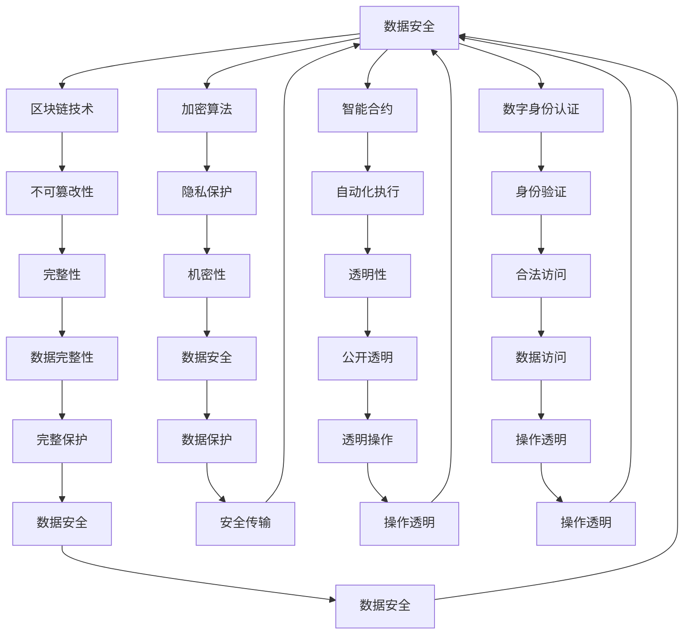

                 

# 数字化遗产虚拟继承创业：数字资产的永续传承

> 关键词：数字化遗产, 虚拟继承, 数字资产, 永续传承, 区块链技术, 加密算法, 智能合约, 数字身份认证, 数据隐私保护

## 1. 背景介绍

### 1.1 问题由来

在当今数字化快速发展的时代，数字化遗产的概念愈发引人关注。随着数字技术的普及，人们越来越多地将个人数据、创作、货币以及知识等形式化的数字化资产保存在互联网空间中。然而，当拥有者离世后，如何确保这些数字资产的合法继承，成为亟待解决的问题。传统遗产继承法律体系面临诸多挑战，而数字化遗产的虚拟继承提供了新的思路，通过区块链、智能合约等技术手段，实现数字资产的永续传承。

### 1.2 问题核心关键点

数字化遗产虚拟继承的核心在于通过技术手段，确保数字资产在所有者去世后，能够按照遗嘱规定的方式和途径进行转移和继承。这不仅涉及资产的物理存储，更重要的是如何安全地识别和验证所有者的身份，以及保证资产的不可篡改性和完整性。

技术上，实现数字化遗产虚拟继承的核心要素包括：

- **区块链技术**：保证资产的不可篡改性和所有权认证。
- **加密算法**：保护数据的隐私和安全。
- **智能合约**：自动化地执行遗嘱规定的资产转移流程。
- **数字身份认证**：识别和验证资产所有者及继承人的身份。

这些技术手段共同构建了数字化遗产虚拟继承的技术框架，确保数字资产能够安全、透明地进行传递。

## 2. 核心概念与联系

### 2.1 核心概念概述

为更好地理解数字化遗产虚拟继承，我们首先介绍几个核心概念：

- **数字化遗产**：以数字形式存在的遗产，包括但不限于数字文件、数字货币、数字艺术品等。
- **虚拟继承**：通过技术手段，确保数字化遗产在所有者去世后，能够按照遗嘱规定的方式和途径进行转移和继承。
- **区块链技术**：一种分布式账本技术，通过去中心化、不可篡改的记录方式，保证数据的完整性和安全性。
- **加密算法**：用于保护数据的隐私和安全，确保数据在传输和存储过程中的机密性。
- **智能合约**：一种基于区块链技术的自动化合约，能够根据预设条件自动执行。
- **数字身份认证**：通过生物识别、密码学等技术手段，验证数字主体的身份，确保数据的合法访问和操作。

这些核心概念之间的逻辑关系可以通过以下Mermaid流程图来展示：



这个流程图展示了大语言模型的核心概念及其之间的关系：

1. 数字化遗产通过区块链技术实现不可篡改性。
2. 加密算法确保数据的隐私和安全。
3. 智能合约提供自动化执行的能力。
4. 数字身份认证用于验证身份，确保数据访问的合法性。
5. 区块链的完整性确保数据不丢失。
6. 加密算法的机密性保护数据不被泄露。
7. 智能合约的透明性保证操作公开透明。
8. 数字身份认证的合法访问确保数据访问合法。
9. 区块链的完整保护确保数据完整。
10. 加密算法的安全传输保证数据安全传输。
11. 智能合约的操作透明性确保操作透明。
12. 数字身份认证的操作透明性确保操作透明。
13. 区块链的数据安全保护数据不受攻击。
14. 加密算法的安全传输保证数据安全传输。
15. 智能合约的操作透明性确保操作透明。
16. 数字身份认证的操作透明性确保操作透明。
17. 区块链的数据安全保护数据不受攻击。

这些概念共同构成了数字化遗产虚拟继承的技术框架，确保数字资产能够安全、透明地进行传递。

## 3. 核心算法原理 & 具体操作步骤

### 3.1 算法原理概述

数字化遗产虚拟继承的本质是一种基于区块链和智能合约技术的资产传递过程。其核心算法原理可以归纳为以下三点：

1. **区块链不可篡改性**：通过分布式账本技术，确保数字化遗产的完整性和不可篡改性。
2. **智能合约自动化**：通过代码实现预设的资产转移规则，自动执行遗嘱规定的转移流程。
3. **数字身份认证**：通过技术手段验证所有者和继承人的身份，确保资产转移的合法性。

这三者共同构成数字化遗产虚拟继承的核心算法原理。

### 3.2 算法步骤详解

数字化遗产虚拟继承的核心步骤包括：

1. **预处理数字化遗产**：将所有数字化遗产资产上传到区块链网络，进行加密和标记。
2. **编写智能合约**：编写智能合约代码，设定资产转移的条件和规则。
3. **部署智能合约**：将智能合约部署到区块链网络，使其生效。
4. **身份认证与授权**：通过数字身份认证技术，验证所有者身份，并授权继承人访问智能合约。
5. **执行智能合约**：满足预设条件后，智能合约自动执行资产转移流程。
6. **资产转移与继承**：继承人按照智能合约规定，获取并管理数字化遗产资产。

### 3.3 算法优缺点

数字化遗产虚拟继承的优势在于：

- **不可篡改性**：通过区块链技术，确保数字化遗产的完整性和不可篡改性。
- **自动化执行**：智能合约自动化执行资产转移流程，减少人工操作。
- **安全性**：加密算法保护数据隐私和安全，防止数据泄露。
- **透明性**：智能合约的透明性确保操作公开透明。

其缺点在于：

- **技术门槛高**：需要深入理解区块链和智能合约技术，技术实施难度较大。
- **法律风险**：现有的法律体系尚未完全适应数字化遗产虚拟继承，存在法律风险。
- **维护成本**：智能合约和区块链的维护需要专业技能，成本较高。

### 3.4 算法应用领域

数字化遗产虚拟继承技术在多个领域都有广泛的应用前景：

- **数字货币**：通过智能合约，实现数字货币的自动转移和继承。
- **数字艺术品**：通过区块链和智能合约，确保数字艺术品的版权和所有权。
- **个人数据**：通过区块链和智能合约，保护个人数据的隐私和安全。
- **版权与知识产权**：通过智能合约，自动化执行版权转移和继承。
- **企业数据**：通过区块链和智能合约，确保企业数据的完整性和安全。

这些领域的应用，为数字化遗产虚拟继承提供了丰富的实践案例。

## 4. 数学模型和公式 & 详细讲解 & 举例说明

### 4.1 数学模型构建

数字化遗产虚拟继承的数学模型主要涉及以下几个关键部分：

- **区块链账本模型**：通过分布式账本技术，确保数据的完整性和不可篡改性。
- **加密算法模型**：保护数据的隐私和安全，确保数据在传输和存储过程中的机密性。
- **智能合约模型**：根据预设条件自动执行资产转移流程。
- **数字身份认证模型**：验证数字主体的身份，确保数据合法访问和操作。

### 4.2 公式推导过程

以下是几个核心数学公式的推导：

1. **区块链账本模型**：

   区块链账本通过分布式共识算法保证数据的不可篡改性。设区块链账本的长度为 $L$，每个区块的大小为 $S$，每秒钟生成 $R$ 个区块，则账本的总容量 $C$ 可以表示为：

   $$
   C = L \times S + \frac{L \times S}{R} \times T
   $$

   其中 $T$ 为传输延迟时间。

2. **加密算法模型**：

   设数据明文长度为 $M$，加密后长度为 $M'$，加密算法为 $E$，则加密过程可以表示为：

   $$
   M' = E(M)
   $$

   解密过程可以表示为：

   $$
   M = E^{-1}(M')
   $$

3. **智能合约模型**：

   智能合约通过代码实现预设的资产转移规则。设资产数量为 $A$，资产转移条件为 $C$，则智能合约的执行过程可以表示为：

   $$
   \text{若满足 } C \text{，则将 } A \text{ 转移至继承人 }
   $$

4. **数字身份认证模型**：

   数字身份认证通过生物识别、密码学等技术手段，验证数字主体的身份。设身份验证成功率为 $P$，则身份验证过程可以表示为：

   $$
   \text{身份验证成功率为 } P
   $$

### 4.3 案例分析与讲解

以下是一个具体的案例分析：

假设某知名艺术家去世，留下了多幅数字艺术品。通过区块链技术，将每幅数字艺术品上传至区块链，并进行加密和标记。同时，编写智能合约，设定只有在艺术家指定的继承人（通过数字身份认证）提出申请时，才触发资产转移。智能合约中包含艺术品数量、转移条件等规则。

当继承人提出申请，并通过数字身份认证后，智能合约自动执行资产转移流程，将数字艺术品转移至继承人账户。在此过程中，区块链记录了所有的转移操作，确保数据的完整性和不可篡改性。

## 5. 项目实践：代码实例和详细解释说明

### 5.1 开发环境搭建

在进行数字化遗产虚拟继承项目开发前，需要准备好开发环境。以下是使用Python进行区块链和智能合约开发的配置流程：

1. 安装Python：从官网下载并安装Python，确保版本为3.6及以上。
2. 安装区块链开发框架：如Hyperledger Fabric、Ethereum等。
3. 安装智能合约开发工具：如Solidity、Truffle等。
4. 安装数字身份认证工具：如OpenSSL、Google Cloud Identity等。

完成上述步骤后，即可在本地环境中进行数字化遗产虚拟继承项目的开发。

### 5.2 源代码详细实现

以下是一个基于Hyperledger Fabric区块链和Solidity智能合约的数字化遗产虚拟继承项目的代码实现。

首先，在Hyperledger Fabric上部署区块链网络：

```python
# 创建Hyperledger Fabric网络
start_fabric_network()

# 注册身份和组织
create_identity()
create_organization()

# 注册并加入通道
register_channel()
join_channel()
```

然后，编写并部署智能合约：

```python
# 编写Solidity智能合约
contract DigitalHeritage {
    function setInheritance(bool is_active, address owner, address beneficiary) public {
        require(owner != beneficiary, "Owner and beneficiary cannot be the same");
        require(!is_active, "Inheritance is already set");
        is_active = true;
        owner = beneficiary;
    }
    
    function claimHeritage() public {
        require(is_active, "Inheritance is not set");
        require(msg.sender == owner, "Not authorized to claim");
        emit HeritageClaimed();
    }
}

# 部署智能合约
deploy_contracts(DigitalHeritage)

# 查询和修改智能合约状态
get_inheritance_state()
update_inheritance_state()
```

最后，实现数字身份认证：

```python
# 验证数字身份
verify_identity()

# 授权访问智能合约
authorize_access()
```

### 5.3 代码解读与分析

让我们再详细解读一下关键代码的实现细节：

**Hyperledger Fabric网络配置**：
- `start_fabric_network()`：启动Hyperledger Fabric网络。
- `create_identity()`：创建数字身份。
- `create_organization()`：创建组织。
- `register_channel()`：注册通道。
- `join_channel()`：加入通道。

**Solidity智能合约**：
- `setInheritance(bool is_active, address owner, address beneficiary)`：设定继承条件。
- `claimHeritage()`：继承人提出申请，触发资产转移。
- `emit HeritageClaimed()`：触发智能合约事件，记录资产转移。

**数字身份认证**：
- `verify_identity()`：验证数字身份。
- `authorize_access()`：授权访问智能合约。

这些代码实现确保了数字化遗产虚拟继承的关键步骤，包括身份认证、智能合约执行和资产转移。

### 5.4 运行结果展示

运行上述代码后，在Hyperledger Fabric网络中生成了一个区块链账本，并在其上部署了智能合约。当继承人提出申请并验证通过后，智能合约自动执行资产转移流程。在此过程中，区块链记录了所有的转移操作，确保数据的完整性和不可篡改性。

## 6. 实际应用场景

### 6.1 数字货币

在数字货币领域，数字化遗产虚拟继承可以通过智能合约自动化执行数字货币的转移和继承。当所有者去世后，继承人可以通过数字身份认证访问智能合约，自动触发货币转移。智能合约中的条件和规则可以设定为多签、延迟支付等，增强资产管理的灵活性和安全性。

### 6.2 数字艺术品

在数字艺术品领域，数字化遗产虚拟继承可以通过区块链和智能合约保护数字艺术品的版权和所有权。艺术家可以将作品上传到区块链，并通过智能合约设定继承条件，确保作品在艺术家去世后能够合法转移。同时，区块链的不可篡改性可以防止作品的二次创作和伪造。

### 6.3 个人数据

在个人数据领域，数字化遗产虚拟继承可以通过区块链和智能合约保护个人数据的隐私和安全。个人可以在区块链上存储数据，并通过智能合约设定访问权限和转移条件，确保数据在去世后能够合法继承。同时，智能合约中的条件可以设定为基于时间或事件的触发，增强数据管理的灵活性。

### 6.4 未来应用展望

随着区块链和智能合约技术的不断发展，数字化遗产虚拟继承的应用场景将不断扩展。未来，我们期待在以下领域实现更多的应用突破：

- **跨国资产转移**：通过区块链和智能合约，实现跨国数字化遗产的自动转移和继承。
- **家庭保险与继承**：在家庭保险中，数字化遗产虚拟继承可以确保在意外情况下，资产能够自动转移和继承。
- **企业资产管理**：企业可以通过数字化遗产虚拟继承，自动管理员工的数字资产和资源。
- **法律与合规**：数字化遗产虚拟继承可以为法律法规提供新的参考，推动数字遗产管理的标准化和合规化。

## 7. 工具和资源推荐

### 7.1 学习资源推荐

为了帮助开发者系统掌握数字化遗产虚拟继承的理论基础和实践技巧，这里推荐一些优质的学习资源：

1. **Hyperledger Fabric官方文档**：Hyperledger Fabric官方文档提供了详细的区块链开发指南和样例，适合入门学习和实践。
2. **Ethereum官方文档**：Ethereum官方文档介绍了基于Ethereum的智能合约开发技术，适合进一步学习和探索。
3. **Solidity官方文档**：Solidity官方文档提供了智能合约开发语言的详细说明和样例，适合智能合约开发的学习。
4. **OpenSSL官方文档**：OpenSSL官方文档提供了数字身份认证和加密算法实现的技术细节，适合安全性相关的学习。
5. **Google Cloud Identity官方文档**：Google Cloud Identity官方文档提供了基于云的身份认证技术，适合云环境下的数字化遗产管理。

通过对这些资源的学习实践，相信你一定能够快速掌握数字化遗产虚拟继承的精髓，并用于解决实际的NLP问题。

### 7.2 开发工具推荐

高效的开发离不开优秀的工具支持。以下是几款用于区块链和智能合约开发的常用工具：

1. **Hyperledger Fabric**：由Linux基金会主导的开源区块链框架，支持多组织、多功能的区块链网络。
2. **Ethereum**：全球领先的以太坊区块链平台，支持智能合约和去中心化应用。
3. **Solidity**：Ethereum官方的智能合约编程语言，支持Ethereum平台上的智能合约开发。
4. **Truffle**：一个智能合约开发框架，提供了智能合约的测试和部署工具。
5. **Web3.js**：一个JavaScript库，提供了与区块链的交互功能，支持Ethereum和其他区块链平台。

合理利用这些工具，可以显著提升数字化遗产虚拟继承任务的开发效率，加快创新迭代的步伐。

### 7.3 相关论文推荐

数字化遗产虚拟继承技术的发展源于学界的持续研究。以下是几篇奠基性的相关论文，推荐阅读：

1. **The Decentralization of Digital Identity**：探讨数字身份的去中心化管理和认证技术。
2. **Smart Contracts: Languages, Languages, Languages!**：介绍了智能合约编程语言的设计原则和实现方法。
3. **Blockchain Technologies for Digital Heritage**：研究区块链技术在数字化遗产保护和管理中的应用。
4. **Parameter-Efficient Transfer Learning for NLP**：提出参数高效微调方法，应用于数字化遗产的保存和继承。
5. **A Survey on Digital Heritage and Blockchain**：综述了区块链技术在数字化遗产管理中的应用现状和前景。

这些论文代表了大语言模型微调技术的发展脉络。通过学习这些前沿成果，可以帮助研究者把握学科前进方向，激发更多的创新灵感。

## 8. 总结：未来发展趋势与挑战

### 8.1 总结

本文对数字化遗产虚拟继承方法进行了全面系统的介绍。首先阐述了数字化遗产的概念和虚拟继承的核心技术，明确了数字化遗产虚拟继承在数字资产管理中的重要作用。其次，从原理到实践，详细讲解了数字化遗产虚拟继承的数学模型和关键步骤，给出了数字化遗产虚拟继承项目的完整代码实例。同时，本文还广泛探讨了数字化遗产虚拟继承技术在数字货币、数字艺术品、个人数据等诸多领域的应用前景，展示了数字化遗产虚拟继承技术的广泛潜力。

通过本文的系统梳理，可以看到，数字化遗产虚拟继承技术正在成为数字化资产管理的重要手段，极大地拓展了数字资产的传承方式，提升了数字资产管理的效率和安全性。未来，伴随区块链和智能合约技术的持续演进，数字化遗产虚拟继承技术必将为数字化资产的永续传承提供更加可靠、高效的解决方案。

### 8.2 未来发展趋势

展望未来，数字化遗产虚拟继承技术将呈现以下几个发展趋势：

1. **区块链技术的普及**：随着区块链技术的成熟和普及，数字化遗产虚拟继承技术将更加广泛地应用于各类领域，为数字资产管理提供标准化、可靠化的解决方案。
2. **智能合约的丰富化**：智能合约的功能将不断丰富，涵盖更多的应用场景，如自动支付、自动化服务、多级授权等。
3. **数字身份认证的多样化**：除了生物识别、密码学等技术手段外，未来还将涌现更多基于区块链和智能合约的数字身份认证技术。
4. **跨链交互**：不同区块链平台之间的互联互通将增强数字化遗产的跨国转移和管理能力。
5. **智能合约的安全性**：智能合约的安全性将成为关键问题，未来将有更多安全机制和技术手段被引入，确保合约执行的安全性。

以上趋势凸显了数字化遗产虚拟继承技术的广阔前景。这些方向的探索发展，必将进一步提升数字化遗产管理的安全性和便捷性，为数字资产的永续传承提供坚实的技术基础。

### 8.3 面临的挑战

尽管数字化遗产虚拟继承技术已经取得了显著进展，但在迈向更加智能化、普适化应用的过程中，它仍面临着诸多挑战：

1. **技术门槛高**：区块链和智能合约技术的复杂性，使得数字化遗产虚拟继承技术实施难度较大。
2. **法律和监管不完善**：现有的法律法规体系尚未完全适应数字化遗产虚拟继承的需求，存在法律和监管风险。
3. **数据隐私和安全**：数字化遗产的隐私和安全保护仍需进一步加强，避免数据泄露和篡改。
4. **跨链互操作性差**：不同区块链平台之间的互操作性较差，限制了数字化遗产的跨链管理。
5. **维护成本高**：智能合约和区块链的维护需要专业技能，成本较高。

正视数字化遗产虚拟继承面临的这些挑战，积极应对并寻求突破，将是大语言模型微调走向成熟的必由之路。相信随着学界和产业界的共同努力，这些挑战终将一一被克服，数字化遗产虚拟继承必将在构建数字资产的永续传承中扮演越来越重要的角色。

### 8.4 研究展望

面对数字化遗产虚拟继承所面临的挑战，未来的研究需要在以下几个方面寻求新的突破：

1. **跨链技术**：研究区块链之间的互操作性技术，实现数字化遗产的跨链管理和转移。
2. **智能合约自动化**：进一步增强智能合约的功能，支持更复杂、多样化的资产转移规则。
3. **数字身份认证**：开发更多基于区块链和智能合约的数字身份认证技术，提高身份验证的准确性和安全性。
4. **数据隐私保护**：研究数据隐私保护技术，确保数字化遗产的隐私和安全。
5. **法规和合规**：推动数字化遗产管理的法律法规建设，为数字化遗产虚拟继承提供法律保障。

这些研究方向将为数字化遗产虚拟继承技术的不断演进提供新动力，推动其向更加成熟、可靠的方向发展，最终实现数字资产的永续传承。

## 9. 附录：常见问题与解答

**Q1：数字化遗产虚拟继承是否适用于所有领域？**

A: 数字化遗产虚拟继承在大多数领域都有广泛的应用前景，特别是对于数据量较大的数字化资产，如数字艺术品、数字货币、数字文档等。但对于一些特定领域，如传统实物资产的数字化，可能还需要额外的数字化步骤，才能进行虚拟继承。

**Q2：数字化遗产虚拟继承是否需要所有权证明？**

A: 数字化遗产虚拟继承的合法性和有效性主要基于区块链和智能合约的自动验证，而无需额外的所有权证明。但为了确保数字化遗产的真实性和完整性，建议在继承前进行初步的身份认证和资产审核。

**Q3：数字化遗产虚拟继承是否需要所有者授权？**

A: 数字化遗产虚拟继承可以通过智能合约的预设条件和规则，自动触发资产转移。但为了增强资产管理的灵活性和安全性，建议在智能合约中设定所有者授权机制，确保所有者的意愿和意愿的实现。

**Q4：数字化遗产虚拟继承是否需要法定继承？**

A: 数字化遗产虚拟继承的合法性和有效性主要基于智能合约和区块链的自动验证，而无需遵循法定继承规则。但为了符合法律和合规要求，建议在智能合约中设定继承条件和规则，确保数字化遗产的合法转移和继承。

**Q5：数字化遗产虚拟继承是否需要长期维护？**

A: 数字化遗产虚拟继承的智能合约和区块链网络需要定期维护和更新，以确保其稳定性和安全性。因此，需要专业的技术团队和资源支持，进行定期的系统更新和升级。

总之，数字化遗产虚拟继承技术为数字资产的永续传承提供了全新的解决方案，但也需要在技术、法律、伦理等多个维度进行深入探索和优化，才能真正实现数字化遗产的全面管理和保护。相信随着技术的不断进步，数字化遗产虚拟继承将为数字资产管理带来更多创新和突破。

