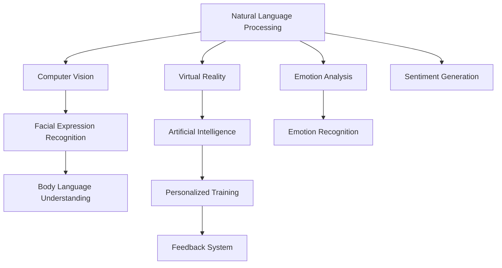

                 

# 数字情商培训:元宇宙中的情感教育新方向

> 关键词：数字情商,元宇宙,情感教育,虚拟现实,人工智能,教育技术,社交互动

## 1. 背景介绍

### 1.1 问题由来
在数字化、网络化日益发展的今天，人类的社交模式正在发生深刻变革。传统面对面交流逐渐让位于线上虚拟互动，人们的情感表达和理解能力面临着新的挑战。一方面，网络世界的虚拟性使得情感交流变得更加模糊和复杂，影响了人与人之间的情感连接。另一方面，数字化生存加剧了社交孤立，对青少年的心理健康产生不良影响。因此，如何在数字空间中培养和提升个体的情感智力（EQ），成为当下社会关注的焦点。

### 1.2 问题核心关键点
数字情商（Digital Emotional Intelligence, DEI），是指个体在数字环境中识别、理解和管理自我及他人情感的能力。传统的情感教育往往依赖于面对面的交流，而在虚拟世界中，情感信息的传递更多依赖于文本、语音和视觉信号。因此，数字情商培训的实现需融合最新的人工智能技术，如自然语言处理（NLP）、计算机视觉（CV）和虚拟现实（VR）等，以模拟真实情境，引导学习者在虚拟环境中体验和实践情感交流。

### 1.3 问题研究意义
数字情商培训对提升个人情感智能，构建健康的人际关系，适应未来工作生活的数字化趋势具有重要意义：
- **个性化培养**：数字情商培训能够根据个体差异，提供量身定制的情感学习路径，帮助不同性格和学习风格的人提升情感能力。
- **情境模拟**：通过虚拟现实技术，模拟现实生活中的情感场景，使学习者在安全可控的环境中练习情感表达和理解。
- **实证支持**：基于科学的情感理论和心理实验，设计系统化的培训内容，确保培训效果和学习的科学性。
- **社会适应**：适应未来高度数字化的工作和生活环境，培养具备跨文化、跨媒体沟通能力的人才。
- **应用广泛**：数字情商培训不仅适用于青少年和学生，也适用于职场人士和老年人，具有广泛的适用性和普及潜力。

## 2. 核心概念与联系

### 2.1 核心概念概述

数字情商培训的实现依赖于多个关键技术，包括但不限于：

- **自然语言处理（NLP）**：解析和理解人类语言，通过文本生成、情感分析等技术，实现情感信息的提取和生成。
- **计算机视觉（CV）**：识别和分析视觉信号，如面部表情、姿势、手势等，用于情感识别的辅助。
- **虚拟现实（VR）**：通过创建一个逼真的虚拟环境，使学习者在沉浸式的情境中体验情感交流，提升实践能力。
- **人工智能（AI）**：基于机器学习模型，自动识别情感特征，提供个性化的学习建议和反馈。

这些核心概念之间的逻辑关系可以通过以下Mermaid流程图来展示：



这个流程图展示了数字情商培训的核心技术架构，各模块间相互协作，共同实现情感教育的目标。

## 3. 核心算法原理 & 具体操作步骤

### 3.1 算法原理概述

数字情商培训的核心算法主要包括情感识别、情感生成和情感反馈三个部分。这些算法通过深度学习模型（如RNN、CNN、Transformer等）实现，能够从文本、语音、视频等数据中提取情感特征，生成情感表达，并根据学习者的反馈进行迭代优化。

### 3.2 算法步骤详解

#### 3.2.1 情感识别算法
情感识别算法通过分析文本、语音或视频数据，识别出其中的情感信息。具体步骤如下：
1. **数据预处理**：对文本进行分词、词性标注等处理；对语音进行降噪、分帧等处理；对视频进行人脸检测、跟踪等处理。
2. **特征提取**：使用卷积神经网络（CNN）、循环神经网络（RNN）等模型提取文本、语音、视频中的情感特征。
3. **情感分类**：将提取的情感特征输入到分类器（如SVM、BERT）中进行情感分类，输出情感标签。

#### 3.2.2 情感生成算法
情感生成算法旨在根据用户输入的情感标签，生成符合语境的情感表达。具体步骤如下：
1. **数据生成**：构建一个包含不同情感标签和相应文本表达的数据集。
2. **生成模型训练**：使用序列生成模型（如LSTM、GPT）对数据集进行训练，生成器模型根据情感标签输出文本。
3. **生成输出**：输入目标情感标签，生成模型输出一段符合情感表达的文本。

#### 3.2.3 情感反馈算法
情感反馈算法通过学习者的情感反馈，对生成算法进行优化。具体步骤如下：
1. **反馈收集**：收集学习者在虚拟环境中对情感表达的评价和建议。
2. **反馈分析**：使用情感分析模型对反馈进行情感倾向性分析。
3. **模型优化**：将分析结果反馈到生成模型中，通过损失函数调整生成器的参数，优化生成效果。

### 3.3 算法优缺点

数字情商培训的算法具有以下优点：
1. **沉浸式学习**：虚拟现实技术为学习者提供沉浸式情感体验，增强学习效果。
2. **个性化培养**：基于学习者的反馈，生成模型可以自适应调整输出，实现个性化培训。
3. **实时反馈**：情感反馈算法可以实时提供学习者的情感表现和改进建议，帮助学习者快速调整。

同时，算法也存在一定的局限性：
1. **依赖数据质量**：情感识别的准确性高度依赖于数据的质量和多样性，数据不足可能导致算法偏差。
2. **技术复杂度**：涉及NLP、CV、AI等多个领域的技术，开发和维护成本较高。
3. **跨文化适应性**：算法需要适应不同文化背景下的情感表达，跨文化适应性需进一步提升。

### 3.4 算法应用领域

数字情商培训的算法在多个领域有广泛应用：
1. **教育培训**：在虚拟教室中，通过情感生成和反馈，提升学生的情感表达能力，增强课堂互动。
2. **心理咨询**：通过虚拟咨询师，引导患者在虚拟环境中表达和理解情感，提供心理健康支持。
3. **社交互动**：在虚拟社交平台上，通过情感识别和生成，改善用户间的情感交流。
4. **企业培训**：为企业员工提供情感管理培训，增强团队协作和领导力。
5. **游戏娱乐**：在游戏中模拟情感交流场景，提高玩家的情感体验和互动效果。

## 4. 数学模型和公式 & 详细讲解 & 举例说明

### 4.1 数学模型构建

数字情商培训的数学模型主要涉及自然语言处理（NLP）、计算机视觉（CV）和情感分析（Emotion Analysis）。以文本情感分类任务为例，构建情感分类模型：

1. **文本预处理**：分词、去停用词、词干提取、构建词向量。
2. **特征提取**：使用词嵌入（Word Embedding）将文本映射到低维向量空间。
3. **情感分类**：使用分类模型（如SVM、CNN、RNN、BERT）对文本进行情感分类，输出情感标签。

文本情感分类模型的数学表达式如下：

$$
\text{情感分类器} = f(\text{word\_embedding}(\text{输入文本}))
$$

其中，$\text{word\_embedding}$ 为文本嵌入函数，$f$ 为分类器函数，$\text{输入文本}$ 为待分类的文本。

### 4.2 公式推导过程

以LSTM模型为例，推导文本情感分类的公式：

1. **输入门（Input Gate）**：
   $$
   i_t = \sigma(W_i [h_{t-1}, x_t] + b_i)
   $$
   $$
   \overline{i_t} = 1 - i_t
   $$

2. **遗忘门（Forget Gate）**：
   $$
   f_t = \sigma(W_f [h_{t-1}, x_t] + b_f)
   $$
   $$
   \overline{f_t} = 1 - f_t
   $$

3. **细胞状态更新（Cell State Update）**：
   $$
   c_t = f_t * c_{t-1} + i_t * \tanh(W_c [h_{t-1}, x_t] + b_c)
   $$

4. **输出门（Output Gate）**：
   $$
   o_t = \sigma(W_o [h_{t-1}, x_t] + b_o)
   $$
   $$
   \overline{o_t} = 1 - o_t
   $$

5. **隐藏状态更新（Hidden State Update）**：
   $$
   h_t = o_t * \tanh(c_t)
   $$

6. **情感分类输出**：
   $$
   \text{情感分类} = \text{softmax}(W_h h_t + b_h)
   $$

其中，$\sigma$ 为激活函数，$\tanh$ 为双曲正切函数，$softmax$ 为softmax函数。

### 4.3 案例分析与讲解

假设有一个包含正面、负面和中性情感标签的文本数据集，其中每个样本有1000个文本和相应的情感标签。使用LSTM模型进行情感分类，步骤如下：
1. 对文本进行预处理，构建词嵌入矩阵。
2. 将预处理后的文本输入LSTM模型，计算每个文本的隐藏状态 $h_t$。
3. 使用softmax函数将隐藏状态映射为情感分类概率，输出情感标签。

以一个样本为例，假设输入文本为 "I am very happy"，情感分类器输出的情感概率分布为 [0.95, 0.03, 0.02]，则情感分类器预测该文本为正面情感。

## 5. 项目实践：代码实例和详细解释说明

### 5.1 开发环境搭建

在进行数字情商培训的实践前，我们需要准备好开发环境。以下是使用Python进行PyTorch开发的环境配置流程：

1. 安装Anaconda：从官网下载并安装Anaconda，用于创建独立的Python环境。
2. 创建并激活虚拟环境：
```bash
conda create -n dei-env python=3.8 
conda activate dei-env
```

3. 安装PyTorch：根据CUDA版本，从官网获取对应的安装命令。例如：
```bash
conda install pytorch torchvision torchaudio cudatoolkit=11.1 -c pytorch -c conda-forge
```

4. 安装自然语言处理和计算机视觉库：
```bash
pip install torchtext
pip install opencv-python
```

5. 安装虚拟现实库：
```bash
pip install pyvirtualreality
```

6. 安装情感分析库：
```bash
pip install scikit-learn
```

完成上述步骤后，即可在`dei-env`环境中开始实践。

### 5.2 源代码详细实现

以下是一个基于PyTorch的情感分类模型实现：

```python
import torch
import torch.nn as nn
import torchtext
from torchtext import data
from torchtext.datasets import IMDB
from torchtext.vocab import GloVe

# 定义输入序列长度
MAX_LEN = 50

# 定义情感分类模型
class SentimentClassifier(nn.Module):
    def __init__(self, embedding_dim=100, hidden_dim=128):
        super(SentimentClassifier, self).__init__()
        self.embedding = nn.Embedding(num_embeddings=10000, embedding_dim=embedding_dim)
        self.rnn = nn.LSTM(input_size=embedding_dim, hidden_size=hidden_dim, batch_first=True)
        self.fc = nn.Linear(in_features=hidden_dim, out_features=2)
        self.softmax = nn.Softmax(dim=1)
    
    def forward(self, text, lengths):
        embeddings = self.embedding(text)
        embeddings = nn.functional.pad(embeddings, (0, 0, 0, MAX_LEN - embeddings.size(1)), value=0)
        embeddings = embeddings[:, :, :MAX_LEN]
        outputs, _ = self.rnn(embeddings)
        outputs = self.fc(outputs[:, -1, :])
        probabilities = self.softmax(outputs)
        return probabilities

# 加载IMDB数据集
train_data, test_data = IMDB.splits()
tokenizer = GloVe(tokenizer=str)
vocab = tokenizer.get_vocab()

# 构建序列化和逆序列化函数
TEXT = data.Field(tokenize=tokenizer, batch_first=True, lower=True)
TEXT.build_vocab(train_data, max_size=10000, vectors="glove.6B.100d")
train_data, valid_data, test_data = train_data.split(split_ratio=(0.8, 0.1, 0.1))
TEXT.set_default_metadata({"length": lambda x: len(x.text)})

# 构建数据迭代器
BATCH_SIZE = 64
train_iterator, valid_iterator, test_iterator = data.BucketIterator.splits(
    (train_data, valid_data, test_data), 
    batch_size=BATCH_SIZE, 
    device='cuda', 
    sort_within_batch=False, 
    sort_key=lambda x: len(x.text)
)

# 初始化模型和优化器
model = SentimentClassifier().to('cuda')
optimizer = torch.optim.Adam(model.parameters(), lr=0.001)
criterion = nn.CrossEntropyLoss()

# 训练模型
for epoch in range(10):
    model.train()
    for batch in train_iterator:
        optimizer.zero_grad()
        text, lengths = batch.text, batch.lengths
        predictions = model(text, lengths)
        loss = criterion(predictions, batch.label)
        loss.backward()
        optimizer.step()
        print(f"Epoch {epoch+1}, Loss: {loss.item():.4f}")

# 在测试集上评估模型
model.eval()
with torch.no_grad():
    accuracy = 0
    for batch in test_iterator:
        text, lengths = batch.text, batch.lengths
        predictions = model(text, lengths)
        _, predicted = torch.max(predictions, dim=1)
        accuracy += (predicted == batch.label).sum().item() / len(batch.label)
    print(f"Test Accuracy: {accuracy:.4f}")
```

以上代码实现了基于LSTM的情感分类模型，并使用IMDB数据集进行训练和评估。可以通过修改模型结构和参数，进一步优化模型效果。

### 5.3 代码解读与分析

**SentimentClassifier类**：
- `__init__`方法：初始化嵌入层、LSTM层、全连接层和softmax层。
- `forward`方法：前向传播，计算隐藏状态并输出分类概率。

**训练流程**：
- 使用IMDB数据集，构建输入序列长度为50的序列化器。
- 加载数据集，构建数据迭代器。
- 初始化模型和优化器，定义交叉熵损失函数。
- 循环10个epoch进行模型训练，在训练集上输出损失，在测试集上输出准确率。

## 6. 实际应用场景

### 6.1 智能社交应用

数字情商培训在智能社交应用中具有重要应用价值。例如，在虚拟社交平台中，用户可以通过情感生成和反馈，提升在虚拟世界中的情感交流能力。平台可以通过情感分类算法，实时分析用户的情感状态，提供个性化的情感引导，增强用户粘性。

### 6.2 在线教育

在线教育领域，数字情商培训可以应用于虚拟课堂中。教师可以通过情感分类算法，实时监测学生的情感反应，及时调整教学策略。学生也可以通过情感生成算法，在虚拟环境中练习情感表达和理解，提升学习效果。

### 6.3 心理健康

数字情商培训在心理健康领域也有广泛应用。通过虚拟心理咨询师，患者可以在虚拟环境中与咨询师互动，表达和理解情感。系统可以通过情感分类算法，实时分析患者的情感状态，提供心理健康支持和治疗建议。

### 6.4 未来应用展望

随着数字技术的不断发展，数字情商培训的应用前景将更加广阔。未来，数字情商培训将与更多领域的技术进行融合，如增强现实（AR）、混合现实（MR）、物联网（IoT）等，提供更加沉浸式的情感体验。同时，数字情商培训还将结合区块链、人工智能等技术，保障用户隐私和数据安全，推动情感教育的普及和深化。

## 7. 工具和资源推荐

### 7.1 学习资源推荐

为了帮助开发者系统掌握数字情商培训的理论基础和实践技巧，这里推荐一些优质的学习资源：

1. **《情感计算导论》**：情感计算领域的经典教材，介绍了情感识别、情感生成、情感反馈等基本概念和方法。
2. **《深度学习实战》**：通过丰富的代码实例，介绍了深度学习在情感计算中的应用。
3. **Coursera《情感计算与人工智能》**：由MIT教授讲授的情感计算课程，涵盖情感识别、情感生成、情感反馈等核心内容。
4. **Kaggle《情感分析竞赛》**：通过参与情感分析竞赛，实践情感计算技术的实际应用。

通过这些资源的学习实践，相信你一定能够快速掌握数字情商培训的精髓，并用于解决实际的情感问题。

### 7.2 开发工具推荐

高效的开发离不开优秀的工具支持。以下是几款用于数字情商培训开发的常用工具：

1. **PyTorch**：基于Python的开源深度学习框架，灵活动态的计算图，适合快速迭代研究。
2. **TensorFlow**：由Google主导开发的开源深度学习框架，生产部署方便，适合大规模工程应用。
3. **Transformers**：HuggingFace开发的NLP工具库，集成了众多SOTA语言模型，支持PyTorch和TensorFlow，是进行情感计算任务的开发利器。
4. **Weights & Biases**：模型训练的实验跟踪工具，可以记录和可视化模型训练过程中的各项指标，方便对比和调优。
5. **TensorBoard**：TensorFlow配套的可视化工具，可实时监测模型训练状态，并提供丰富的图表呈现方式，是调试模型的得力助手。
6. **PyVirtualReality**：用于创建虚拟环境的开源工具，支持Python和C++，提供了丰富的虚拟现实交互接口。

合理利用这些工具，可以显著提升数字情商培训的开发效率，加快创新迭代的步伐。

### 7.3 相关论文推荐

数字情商培训的快速发展得益于学界的持续研究。以下是几篇奠基性的相关论文，推荐阅读：

1. **《情感计算与人工智能》**：介绍了情感计算的基本理论和算法，提出了基于深度学习的情感识别和生成模型。
2. **《虚拟现实中的情感交流》**：探讨了虚拟现实技术在情感交流中的应用，提出了虚拟情感社交平台的设计思路。
3. **《基于自然语言处理的情绪分析》**：介绍了自然语言处理在情感分析中的应用，提出了多种情感分类和生成算法。

这些论文代表了大语言模型微调技术的发展脉络。通过学习这些前沿成果，可以帮助研究者把握学科前进方向，激发更多的创新灵感。

## 8. 总结：未来发展趋势与挑战

### 8.1 总结

本文对数字情商培训的实现过程进行了全面系统的介绍。首先阐述了数字情商培训的背景和意义，明确了情感计算在数字时代的价值。其次，从原理到实践，详细讲解了数字情商培训的数学模型和算法步骤，给出了情感分类任务的完整代码实例。同时，本文还探讨了数字情商培训在多个领域的应用前景，展示了其在智能社交、在线教育、心理健康等方面的潜力。

通过本文的系统梳理，可以看到，数字情商培训为情感教育提供了新的技术路径，显著提升了学习者的情感智能，推动了人机协同的智能发展。未来，随着数字技术的不断发展，数字情商培训必将在更广阔的应用领域发挥更大的作用，深刻影响人类社会的情感智能水平。

### 8.2 未来发展趋势

展望未来，数字情商培训将呈现以下几个发展趋势：

1. **多模态融合**：数字情商培训将融合视觉、语音、文本等多种模态的信息，提供更加全面的情感体验。例如，通过虚拟现实技术，结合计算机视觉和自然语言处理，实现三维空间中的情感交流。
2. **跨文化适应**：数字情商培训需要适应不同文化背景下的情感表达和理解，增强模型的跨文化适应性。
3. **个性化培养**：数字情商培训将根据学习者的个性、兴趣和需求，提供量身定制的情感学习路径，实现个性化培养。
4. **情感计算的伦理考量**：随着情感计算技术的普及，如何保护用户的隐私和数据安全，防止误导和滥用，成为重要的伦理问题。

### 8.3 面临的挑战

尽管数字情商培训取得了显著成效，但在迈向更加智能化、普适化应用的过程中，仍面临诸多挑战：

1. **数据获取和标注**：情感数据的多样性和复杂性使得数据获取和标注成本较高，高质量标注数据的缺乏可能导致模型的偏差。
2. **模型的可解释性**：情感计算模型往往是"黑盒"系统，难以解释其内部工作机制和决策逻辑，影响模型的可信度和可控性。
3. **跨文化适应性**：不同文化背景下的情感表达存在差异，情感计算模型需要适应这些差异，提升跨文化适应性。
4. **隐私和安全**：情感数据的敏感性使得隐私保护和安全管理成为重要挑战，需要采用加密、匿名化等技术手段。

### 8.4 研究展望

面对数字情商培训所面临的挑战，未来的研究需要在以下几个方面寻求新的突破：

1. **多模态情感计算**：结合视觉、语音、文本等多种模态的信息，提升情感计算的准确性和丰富度。
2. **可解释性增强**：通过引入可解释性技术，如可视化、对比学习等，提高情感计算模型的透明性和可信度。
3. **隐私保护**：采用隐私保护技术，如差分隐私、联邦学习等，保护用户的隐私和数据安全。
4. **跨文化适应**：通过引入文化适应技术，如多语言情感词典、跨文化情感模型等，提升情感计算模型的跨文化适应性。
5. **情感计算的伦理考量**：在情感计算模型中引入伦理导向的评估指标，防止模型滥用和误导，确保其社会责任。

这些研究方向的探索，必将引领数字情商培训技术迈向更高的台阶，为构建安全、可靠、可解释、可控的智能系统铺平道路。面向未来，数字情商培训技术还需要与其他人工智能技术进行更深入的融合，如知识表示、因果推理、强化学习等，多路径协同发力，共同推动情感计算技术的进步。只有勇于创新、敢于突破，才能不断拓展数字情商培训的边界，让智能技术更好地造福人类社会。

---

作者：禅与计算机程序设计艺术 / Zen and the Art of Computer Programming

