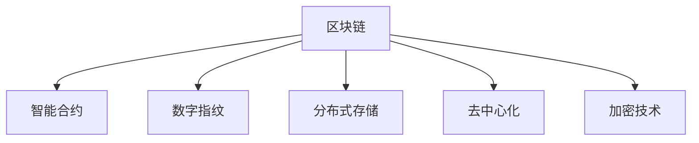

                 

# 数字版权创业：区块链在知识产权中的应用

> 关键词：区块链, 数字版权, 版权保护, 智能合约, 数字指纹, 分布式存储, 去中心化, 加密技术

## 1. 背景介绍

### 1.1 问题由来
在互联网时代，数字内容的创作和传播变得前所未有的便捷，但也带来了日益严峻的版权侵权问题。盗版、非法下载、非授权使用等行为屡见不鲜，给版权方造成了巨大的经济损失。如何有效保护数字版权，成为摆在创作者和版权保护机构面前的重大课题。

数字版权创业的兴起，为这一问题提供了全新的解决方案。通过结合区块链技术和智能合约，可以构建一个去中心化的版权交易平台，实现数字内容的自动确权、追踪和交易。这种平台不仅能够保护创作者的合法权益，还能激发创作者的创作热情，推动内容产业的健康发展。

### 1.2 问题核心关键点
数字版权创业的核心关键点包括：
- **区块链技术**：作为底层基础设施，区块链保证了数据的安全、透明和不可篡改。
- **智能合约**：基于区块链的自动化合约，可以实现版权的自动确权、自动分发和自动交易。
- **数字指纹**：对数字内容进行唯一标识，确保每个作品都是独一无二的。
- **分布式存储**：采用分布式存储技术，保障内容的安全和冗余备份。
- **加密技术**：利用加密技术，确保内容的私密性和完整性。
- **去中心化**：去除中心化的单点故障，提升系统的可靠性和鲁棒性。

这些关键点共同构成了数字版权创业的核心框架，使其能够在知识产权保护中发挥重要作用。

## 2. 核心概念与联系

### 2.1 核心概念概述

为更好地理解区块链在数字版权中的应用，本节将介绍几个密切相关的核心概念：

- **区块链(Blockchain)**：一种去中心化的分布式账本技术，通过加密哈希链接和共识机制，确保数据的安全、透明和不可篡改。
- **智能合约(Smart Contract)**：自动执行的合约，当合约条款达成时，智能合约自动执行约定的操作。
- **数字指纹(Digital Fingerprint)**：对数字内容进行唯一标识，通过加密哈希算法，确保每个作品都是独一无二的。
- **分布式存储(Distributed Storage)**：将数据分散存储在多个节点上，提高数据的安全性和冗余备份能力。
- **去中心化(Decentralization)**：去除中心化的单点故障，提升系统的可靠性和鲁棒性。
- **加密技术(Cryptography)**：利用加密算法保护数据的私密性和完整性，防止未经授权的访问和篡改。

这些核心概念之间的逻辑关系可以通过以下Mermaid流程图来展示：



这个流程图展示了大语言模型的核心概念及其之间的关系：

1. 区块链作为底层基础设施，提供了安全、透明的数据记录机制。
2. 智能合约基于区块链，实现自动化的版权确权和交易操作。
3. 数字指纹用于唯一标识每个数字作品，防止版权纠纷。
4. 分布式存储通过分散数据存储，保障内容的安全和冗余备份。
5. 去中心化去除中心化的单点故障，提升系统的可靠性和鲁棒性。
6. 加密技术利用加密算法保护数据的私密性和完整性，防止未经授权的访问和篡改。

这些概念共同构成了区块链在知识产权保护中的应用框架，使其能够实现高效的版权确权、追踪和交易。

## 3. 核心算法原理 & 具体操作步骤
### 3.1 算法原理概述

数字版权创业的核心算法原理基于区块链技术和智能合约的结合，其核心思想是：通过区块链技术记录和验证版权信息，利用智能合约实现版权的自动确权、分发和交易。具体而言，算法包括以下几个关键步骤：

1. **版权登记**：创作者将作品上传到区块链，并通过智能合约生成版权证明。
2. **版权确权**：智能合约自动验证版权证明的有效性，确认版权归属。
3. **版权交易**：版权方通过智能合约自动分发版权使用权，交易双方自动达成协议。
4. **版权追踪**：区块链上的记录可以追溯版权的使用历史，防止未经授权的使用。

### 3.2 算法步骤详解

以下是区块链在数字版权创业中的详细步骤：

**Step 1: 准备版权数据**
- 创作者将作品上传到区块链，通过加密哈希算法生成数字指纹。
- 数字指纹和版权信息一起存储在区块链上。

**Step 2: 生成版权证明**
- 智能合约根据上传的作品和数字指纹，自动生成版权证明。
- 版权证明包括作品信息、版权归属、数字指纹等关键信息。

**Step 3: 版权确权**
- 版权方在智能合约中登记版权证明，智能合约自动验证版权证明的有效性。
- 智能合约通过共识机制，确认版权归属于指定创作者。

**Step 4: 版权交易**
- 版权方在智能合约中发布版权使用权，如复制权、分发权等。
- 交易双方通过智能合约自动达成协议，智能合约自动执行约定的操作。

**Step 5: 版权追踪**
- 区块链上的记录可以追溯版权的使用历史，防止未经授权的使用。
- 版权方和平台可以通过智能合约自动监测版权使用情况，确保版权权益得到保护。

### 3.3 算法优缺点

区块链在数字版权创业中的优点包括：
1. 安全性高：区块链的分布式账本和加密算法保证了数据的安全和透明。
2. 去中心化：去除中心化的单点故障，提升了系统的可靠性和鲁棒性。
3. 透明度高：区块链的分布式账本保证了数据的透明和可追溯性。
4. 自动化高效：智能合约的自动化操作，提升了版权交易的效率和准确性。
5. 可审计性：区块链上的记录可以追溯，方便版权方和平台进行审计。

但同时也存在一些局限性：
1. 交易成本高：区块链的交易成本较高，增加了版权交易的门槛。
2. 技术复杂：区块链和智能合约的技术门槛较高，需要专业的技术支持。
3. 隐私问题：公开的数据记录可能暴露部分隐私信息。
4. 扩展性差：区块链目前的扩展性较差，处理大规模版权数据时效率较低。
5. 法律问题：不同国家的法律体系不同，区块链版权保护可能存在法律风险。

尽管存在这些局限性，但区块链技术在数字版权保护中具有显著的优势，为版权创业提供了新的解决方案。

### 3.4 算法应用领域

区块链在数字版权创业中的应用领域非常广泛，涉及以下几个方面：

- **版权确权与分发**：通过智能合约实现版权的自动确权和分发，保障创作者的合法权益。
- **版权交易与授权**：构建去中心化的版权交易平台，实现版权的自动交易和授权。
- **版权追踪与监测**：利用区块链的记录功能，实现版权的使用追踪和监测，防止侵权行为。
- **版权认证与认证**：提供版权认证和鉴定的服务，提升版权信息的可信度。
- **版权确权与交易**：构建去中心化的版权确权和交易平台，实现版权的自动化管理。
- **版权管理与维权**：通过区块链技术，实现版权信息的自动化管理和维权。

以上领域涵盖了版权创业的主要应用场景，展示了区块链在知识产权保护中的广泛应用前景。

## 4. 数学模型和公式 & 详细讲解 & 举例说明

### 4.1 数学模型构建

区块链在数字版权创业中的数学模型构建主要涉及以下几个部分：

- **哈希函数(Hash Function)**：对数字内容进行唯一标识，确保每个作品都是独一无二的。
- **加密算法(Cryptography)**：利用加密算法保护数据的私密性和完整性，防止未经授权的访问和篡改。
- **共识机制(Consensus Mechanism)**：通过共识机制，确保区块链上的数据记录是透明和可信的。
- **智能合约(Smart Contract)**：自动执行的合约，当合约条款达成时，智能合约自动执行约定的操作。

### 4.2 公式推导过程

以下是区块链在数字版权创业中的一些核心公式：

**哈希函数**：
$$
H(x) = \text{hash}(x)
$$

其中，$x$ 为输入数据，$H(x)$ 为哈希函数输出。

**加密算法**：
$$
E(k, m) = k \oplus m
$$

其中，$k$ 为密钥，$m$ 为明文，$E(k, m)$ 为加密后的密文。

**共识机制**：
- **工作量证明(Proof of Work, PoW)**：通过计算工作量，确保网络安全。
- **权益证明(Proof of Stake, PoS)**：通过权益分配，确保网络安全。

**智能合约**：
- **自动执行合约**：当合约条款达成时，智能合约自动执行约定的操作。
- **条件判断**：通过条件判断，实现复杂的合约操作。

### 4.3 案例分析与讲解

以下是一个具体的数字版权创业案例分析：

**案例**：一家音乐创作平台，通过区块链技术实现版权保护。

1. **版权登记**：
   - 创作者将歌曲上传到平台，通过哈希算法生成数字指纹。
   - 平台将数字指纹和版权信息一起存储在区块链上，生成版权证明。

2. **版权确权**：
   - 版权方在智能合约中登记版权证明，智能合约自动验证版权证明的有效性。
   - 智能合约通过共识机制，确认版权归属于指定创作者。

3. **版权交易**：
   - 版权方在智能合约中发布版权使用权，如播放权、录制权等。
   - 音乐公司通过智能合约自动支付版权费用，智能合约自动执行约定的操作。

4. **版权追踪**：
   - 平台可以通过区块链上的记录，追溯版权的使用历史，防止未经授权的使用。
   - 版权方和平台可以通过智能合约自动监测版权使用情况，确保版权权益得到保护。

## 5. 项目实践：代码实例和详细解释说明
### 5.1 开发环境搭建

在进行数字版权创业实践前，我们需要准备好开发环境。以下是使用Python进行区块链开发的环境配置流程：

1. 安装Anaconda：从官网下载并安装Anaconda，用于创建独立的Python环境。

2. 创建并激活虚拟环境：
```bash
conda create -n blockchain-env python=3.8 
conda activate blockchain-env
```

3. 安装区块链开发工具包：
```bash
pip install ethereum
pip install web3.py
pip install pysha3
```

4. 安装智能合约开发框架：
```bash
pip install solidity
pip install solc
```

完成上述步骤后，即可在`blockchain-env`环境中开始区块链开发实践。

### 5.2 源代码详细实现

以下是使用Solidity编写智能合约的示例代码：

```solidity
pragma solidity ^0.8.0;

contract CopyrightContract {
    uint256 public id;
    uint256 public creator;
    uint256 public useRight;
    address public licensee;
    bytes32 public fingerprint;
    
    constructor(uint256 _id, uint256 _creator, uint256 _useRight, address _licensee, bytes32 _fingerprint) {
        id = _id;
        creator = _creator;
        useRight = _useRight;
        licensee = _licensee;
        fingerprint = _fingerprint;
    }
    
    function verifyFingerprint() public view returns (bool) {
        return keccak256(abi.encodePacked(fingerprint)) == fingerprint;
    }
    
    function grantUseRight(uint256 _rights) public {
        require(rights != 0, "Use right must be greater than zero.");
        useRight += _rights;
    }
    
    function revokeUseRight(uint256 _rights) public {
        require(rights >= _rights, "Right amount is higher than existing use right.");
        useRight -= _rights;
    }
    
    function licenseTo(address _licensee) public {
        require(_licensee != address(0), "Licensee address is invalid.");
        require(useRight > 0, "No use right available.");
        require(verifyFingerprint(), "Fingerprint verification failed.");
        licensee = _licensee;
    }
}
```

这个示例代码实现了一个基本的版权确权智能合约，包含了版权信息存储、使用权授予和撤销等功能。

### 5.3 代码解读与分析

让我们再详细解读一下关键代码的实现细节：

**CopyrightContract合约**：
- `id`：版权标识符。
- `creator`：版权归属者。
- `useRight`：版权使用权。
- `licensee`：版权使用者。
- `fingerprint`：数字指纹。

**verifyFingerprint函数**：
- 验证数字指纹是否有效。

**grantUseRight函数**：
- 授予版权使用权。

**revokeUseRight函数**：
- 撤销版权使用权。

**licenseTo函数**：
- 将版权授权给新的使用者。

**代码实现**：
- 使用Solidity语言编写智能合约，定义了版权信息的存储和操作。
- 通过`abi.encodePacked`方法将版权信息打包，计算哈希值进行验证。
- 使用`require`语句进行权限检查。
- 通过函数实现版权的使用权授予、撤销和授权等操作。

可以看出，智能合约的代码实现虽然简单，但能够实现复杂的版权确权和交易逻辑。

## 6. 实际应用场景
### 6.1 版权确权与分发

版权确权是数字版权创业的基础，通过智能合约可以实现版权的自动确权和分发。创作者将作品上传到区块链，并通过智能合约生成版权证明。版权方可以在智能合约中设定版权的使用权，授权给特定的使用者。一旦版权被授权，智能合约会自动记录，并确保版权归属和使用的合法性。

### 6.2 版权交易与授权

版权交易是数字版权创业的核心应用场景之一。通过智能合约，版权方可以自动发布版权使用权，并接受版权购买者的支付。交易双方通过智能合约自动达成协议，并自动执行约定的操作。这种方式不仅提高了交易效率，还降低了交易成本和风险。

### 6.3 版权追踪与监测

区块链的记录功能使得版权追踪和监测成为可能。版权方和平台可以通过区块链上的记录，追溯版权的使用历史，防止未经授权的使用。一旦发现版权侵权行为，版权方可以通过智能合约自动启动维权程序，保护自己的合法权益。

### 6.4 未来应用展望

随着区块链技术的不断发展和普及，数字版权创业的应用场景将越来越广泛。未来，区块链在数字版权保护中可能有以下发展趋势：

1. **跨链互操作**：实现不同区块链之间的互操作，提升版权交易的效率和范围。
2. **智能合约自动化**：进一步提升智能合约的自动化程度，实现更复杂的操作逻辑。
3. **去中心化交易**：构建去中心化的版权交易平台，降低版权交易的成本和门槛。
4. **链上治理**：通过区块链上的投票和共识机制，实现版权管理的民主化治理。
5. **数据隐私保护**：加强数据隐私保护，确保版权信息的私密性和安全性。
6. **智能合约隐私**：实现智能合约的隐私保护，防止版权信息泄露。

这些趋势展示了区块链在数字版权保护中的广阔前景，为版权创业提供了新的可能性。

## 7. 工具和资源推荐
### 7.1 学习资源推荐

为了帮助开发者系统掌握数字版权创业的技术基础和实践技巧，这里推荐一些优质的学习资源：

1. 《区块链原理与应用》系列博文：由区块链技术专家撰写，深入浅出地介绍了区块链技术的原理和应用。
2. CS260《密码学与密码协议》课程：斯坦福大学开设的密码学课程，涵盖了密码学的基础理论和应用。
3. 《智能合约编程语言Solidity》书籍：介绍Solidity语言的编程技术和智能合约的开发。
4. Web3官方文档：Web3基金会提供的Web3开发文档，包括智能合约、钱包、DApp等技术。
5. Ethereum官方文档：Ethereum官方提供的开发文档，涵盖以太坊网络、智能合约、DApp等技术。
6. IPFS官方文档：IPFS官方提供的分布式存储技术文档，涵盖基础原理和实际应用。

通过对这些资源的学习实践，相信你一定能够快速掌握区块链在数字版权创业中的技术实现，并用于解决实际的版权保护问题。

### 7.2 开发工具推荐

高效的开发离不开优秀的工具支持。以下是几款用于区块链开发常用的工具：

1. Ethereum：以太坊网络，提供了丰富的智能合约开发环境。
2. Truffle：基于以太坊的开发框架，提供了智能合约的开发、测试和部署工具。
3. Remix：基于以太坊的开发工具，提供了智能合约的在线开发和调试环境。
4. Web3.js：JavaScript库，提供了以太坊网络的API接口，方便开发者进行开发和测试。
5. MetaMask：以太坊钱包，支持智能合约的调用和部署。
6. IPFS浏览器：支持IPFS网络的浏览器，方便开发者进行分布式存储和文件上传。

合理利用这些工具，可以显著提升区块链在数字版权创业的开发效率，加快创新迭代的步伐。

### 7.3 相关论文推荐

区块链在数字版权保护方面的研究和发展受到了广泛关注，以下是几篇奠基性的相关论文，推荐阅读：

1. Satoshi Nakamoto, "Bitcoin: A Peer-to-Peer Electronic Cash System"（比特币白皮书）：区块链技术的起源和核心思想。
2. Vitalik Buterin, "Ethereum Yellow Paper"：以太坊白皮书，介绍了以太坊网络的架构和技术。
3. Daniel O. Brooksbank, "Blockchain Technology: Overview, Applications, and Challenges"：区块链技术的概述和应用挑战。
4. Christian Reusz, "Copyright and Blockchain"：区块链在版权保护中的应用和挑战。
5. Chris Busco, "The Legal and Ethical Landscape of Blockchain Technology"：区块链技术的法律和伦理问题。

这些论文代表了大语言模型微调技术的发展脉络。通过学习这些前沿成果，可以帮助研究者把握学科前进方向，激发更多的创新灵感。

## 8. 总结：未来发展趋势与挑战
### 8.1 总结

本文对区块链在数字版权创业中的应用进行了全面系统的介绍。首先阐述了数字版权创业的背景和核心关键点，明确了区块链在版权确权、分发、交易、追踪和监测中的独特价值。其次，从原理到实践，详细讲解了数字版权创业的数学模型和核心算法，给出了智能合约的代码实现示例。同时，本文还广泛探讨了区块链在版权创业中的实际应用场景，展示了区块链在知识产权保护中的广阔前景。

通过本文的系统梳理，可以看到，区块链技术在数字版权保护中具有显著的优势，为版权创业提供了新的解决方案。区块链通过去中心化、透明和不可篡改的特点，实现了版权的自动确权、追踪和交易，提升了版权管理的效率和可靠性。

### 8.2 未来发展趋势

展望未来，数字版权创业将在以下几个方面发展：

1. **跨链互操作**：实现不同区块链之间的互操作，提升版权交易的效率和范围。
2. **智能合约自动化**：进一步提升智能合约的自动化程度，实现更复杂的操作逻辑。
3. **去中心化交易**：构建去中心化的版权交易平台，降低版权交易的成本和门槛。
4. **链上治理**：通过区块链上的投票和共识机制，实现版权管理的民主化治理。
5. **数据隐私保护**：加强数据隐私保护，确保版权信息的私密性和安全性。
6. **智能合约隐私**：实现智能合约的隐私保护，防止版权信息泄露。

这些趋势展示了数字版权创业的广阔前景，为版权创业提供了新的可能性。

### 8.3 面临的挑战

尽管区块链在数字版权保护中具有显著的优势，但在迈向更加智能化、普适化应用的过程中，它仍面临诸多挑战：

1. **技术复杂**：区块链和智能合约的技术门槛较高，需要专业的技术支持。
2. **扩展性差**：区块链目前的扩展性较差，处理大规模版权数据时效率较低。
3. **隐私问题**：公开的数据记录可能暴露部分隐私信息。
4. **法律问题**：不同国家的法律体系不同，区块链版权保护可能存在法律风险。
5. **成本问题**：区块链的交易成本较高，增加了版权交易的门槛。
6. **共识机制**：不同共识机制有不同的应用场景和效率，需要根据具体情况进行选择。

尽管存在这些挑战，但区块链技术在数字版权保护中具有显著的优势，为版权创业提供了新的解决方案。

### 8.4 研究展望

未来，数字版权创业需要在以下几个方面寻求新的突破：

1. **跨链互操作**：实现不同区块链之间的互操作，提升版权交易的效率和范围。
2. **智能合约自动化**：进一步提升智能合约的自动化程度，实现更复杂的操作逻辑。
3. **去中心化交易**：构建去中心化的版权交易平台，降低版权交易的成本和门槛。
4. **链上治理**：通过区块链上的投票和共识机制，实现版权管理的民主化治理。
5. **数据隐私保护**：加强数据隐私保护，确保版权信息的私密性和安全性。
6. **智能合约隐私**：实现智能合约的隐私保护，防止版权信息泄露。

这些研究方向的探索，必将引领数字版权创业技术迈向更高的台阶，为构建安全、可靠、可解释、可控的智能系统铺平道路。面向未来，数字版权创业还需要与其他人工智能技术进行更深入的融合，如知识表示、因果推理、强化学习等，多路径协同发力，共同推动版权保护系统的进步。

## 9. 附录：常见问题与解答

**Q1：区块链在数字版权保护中有哪些优势？**

A: 区块链在数字版权保护中的优势包括：
1. 安全性高：区块链的分布式账本和加密算法保证了数据的安全和透明。
2. 去中心化：去除中心化的单点故障，提升了系统的可靠性和鲁棒性。
3. 透明度高：区块链的分布式账本保证了数据的透明和可追溯性。
4. 自动化高效：智能合约的自动化操作，提升了版权交易的效率和准确性。
5. 可审计性：区块链上的记录可以追溯，方便版权方和平台进行审计。

**Q2：区块链在数字版权创业中如何实现版权确权？**

A: 区块链在数字版权创业中实现版权确权的过程如下：
1. 创作者将作品上传到区块链，通过哈希算法生成数字指纹。
2. 平台将数字指纹和版权信息一起存储在区块链上，生成版权证明。
3. 版权方在智能合约中登记版权证明，智能合约自动验证版权证明的有效性。
4. 智能合约通过共识机制，确认版权归属于指定创作者。

**Q3：区块链在数字版权创业中如何实现版权交易？**

A: 区块链在数字版权创业中实现版权交易的过程如下：
1. 版权方在智能合约中发布版权使用权，如播放权、录制权等。
2. 音乐公司通过智能合约自动支付版权费用，智能合约自动执行约定的操作。
3. 交易双方通过智能合约自动达成协议，智能合约自动执行约定的操作。

**Q4：区块链在数字版权创业中如何实现版权追踪与监测？**

A: 区块链在数字版权创业中实现版权追踪与监测的过程如下：
1. 版权方和平台可以通过区块链上的记录，追溯版权的使用历史。
2. 一旦发现版权侵权行为，版权方可以通过智能合约自动启动维权程序，保护自己的合法权益。

**Q5：区块链在数字版权创业中如何实现版权信息保护？**

A: 区块链在数字版权创业中实现版权信息保护的过程如下：
1. 区块链的分布式账本和加密算法保证了版权信息的私密性和安全性。
2. 版权方和平台可以通过智能合约自动监测版权使用情况，确保版权权益得到保护。

总之，区块链在数字版权创业中的应用提供了高效、透明的版权保护方案，为版权创业提供了新的解决方案。通过本文的系统梳理，可以看到，区块链技术在数字版权保护中具有显著的优势，为版权创业提供了新的可能性。未来，随着区块链技术的不断发展和普及，数字版权创业的应用场景将越来越广泛，为版权创业提供了新的可能性。

