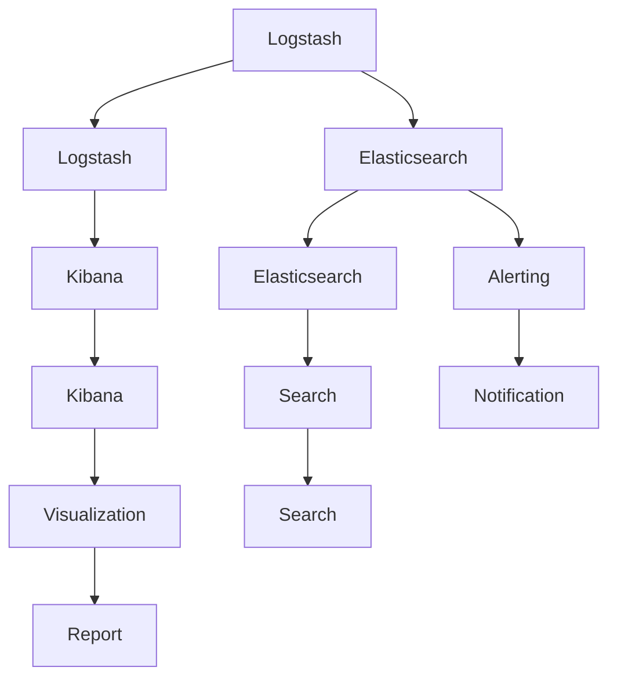

                 

# 日志管理：ELK栈的搭建与使用

> 关键词：日志管理, ELK栈, 日志存储, 数据可视化, 日志分析, 应用部署

## 1. 背景介绍

在当今数字化时代的背景下，企业级应用系统的规模和复杂度不断提升，伴随产生的大量日志数据成为了IT运维的关键资源。如何高效地管理、存储、分析和利用这些日志数据，已成为每一个IT运维团队的日常挑战。

### 1.1 日志的重要性

日志在企业中的应用十分广泛，其重要性体现在以下几个方面：

- **故障排除**：日志记录了系统的运行状态，是定位和排除故障的重要依据。
- **性能监控**：通过分析日志，可以识别出系统性能瓶颈，及时进行优化。
- **安全审计**：日志提供了系统操作的审计记录，帮助跟踪安全事件，确保系统安全。
- **业务分析**：通过日志分析，可以挖掘出业务流程的瓶颈和优化点，提升业务效率。

面对庞大的日志数据，人工管理和分析已变得越来越困难。因此，采用自动化工具和框架进行日志管理成为了提升运维效率的关键。

### 1.2 问题由来

传统的日志管理方式往往依赖于手工操作，如手动查看日志文件、编写脚本进行数据提取和分析，效率低下且容易出错。随着数据量的增长，手工操作的方式难以满足日益增长的需求。

现代企业级应用系统需要处理海量日志数据，其结构化和非结构化数据并存，且分布在不同的系统和环境中，如何高效地管理和分析这些数据，成为一个亟需解决的问题。

ELK栈应运而生，成为解决这一问题的有力工具。ELK栈由Elasticsearch、Logstash和Kibana三个组件组成，通过无缝集成和协同工作，提供了强大的日志管理能力。

## 2. 核心概念与联系

### 2.1 核心概念概述

ELK栈是一个开源的日志管理系统，其核心组件包括：

- **Elasticsearch**：分布式搜索引擎，用于存储、检索和分析日志数据。
- **Logstash**：数据管道，用于收集、处理和转发日志数据到Elasticsearch。
- **Kibana**：数据可视化界面，用于监控和分析Elasticsearch中的数据。

ELK栈的核心思想是通过将日志数据流经过Logstash处理后，存储到Elasticsearch中，再通过Kibana进行可视化展示和分析，从而实现高效的日志管理。

### 2.2 核心概念原理和架构的 Mermaid 流程图



这个图表展示了ELK栈的基本流程：

1. Logstash从日志文件或其他数据源收集日志数据。
2. Logstash对收集到的日志数据进行清洗、解析和转换，并将其发送到Elasticsearch。
3. Elasticsearch存储处理后的日志数据，并支持高效的搜索和分析。
4. Kibana从Elasticsearch中检索数据，并生成可视化的图表和报表。
5. Alerting模块根据Elasticsearch中的异常情况，发送告警通知。

通过这一流程，ELK栈实现了日志数据的自动收集、存储、分析和展示，提升了日志管理的效率和准确性。

## 3. 核心算法原理 & 具体操作步骤

### 3.1 算法原理概述

ELK栈的核心算法原理基于分布式计算和搜索引擎技术。其核心思想是将日志数据分片存储在多个节点上，通过分布式索引和查询技术，实现快速的数据检索和分析。

### 3.2 算法步骤详解

#### 3.2.1 Logstash数据处理

Logstash是ELK栈的数据管道，其核心步骤如下：

1. 配置输入插件：定义日志数据的来源，如文件系统、网络接口、数据库等。
2. 配置过滤器插件：对日志数据进行清洗和转换，如去除噪音、标准化格式、提取关键字段等。
3. 配置输出插件：定义日志数据的存储位置，如Elasticsearch、文件系统、标准输出等。

以下是一个简单的Logstash配置示例：

```logstash
input {
  file {
    path => "/var/log/app/app.log"
    start_position => "beginning"
  }
}

filter {
  grok {
    match => { "message" => "%{TIMESTAMP_ISO8601:timestamp}" }
    user => { "user" => "%{user}" }
    tag => { "tag" => "%{tag}" }
  }
}

output {
  elasticsearch {
    hosts => ["localhost:9200"]
    index => "logs-%{+YYYY.MM.dd}"
  }
}
```

该配置示例中，Logstash从指定的日志文件收集数据，使用Grok插件提取日志的时间戳、用户和标签信息，并将处理后的数据发送到Elasticsearch中存储。

#### 3.2.2 Elasticsearch数据存储

Elasticsearch是ELK栈的核心组件，其核心步骤如下：

1. 配置节点：设置Elasticsearch的节点数量和分布式配置。
2. 创建索引：定义日志数据的索引结构，包括字段、映射等。
3. 数据存储：将经过处理的日志数据存储到Elasticsearch的索引中。

以下是一个简单的Elasticsearch索引配置示例：

```elasticsearch
PUT /logs-20220101
{
  "settings": {
    "analysis": {
      "analyzer": {
        "my_analyzer": {
          "tokenizer": "standard",
          "filter": ["lowercase", "stop", "my_template"]
        }
      },
      "filter": {
        "my_template": {
          "type": "template",
          "steps": [
            {
              "filter": "stop",
              "char filters": ["remove_punctuation"]
            }
          ]
        }
      }
    }
  },
  "mappings": {
    "properties": {
      "timestamp": { "type": "date" },
      "user": { "type": "keyword" },
      "tag": { "type": "keyword" },
      "message": { "type": "text", "analyzer": "my_analyzer" }
    }
  }
}
```

该配置示例中，Elasticsearch创建了一个名为`logs-20220101`的索引，定义了日志数据的字段结构和分析器，并将处理后的日志数据存储到该索引中。

#### 3.2.3 Kibana数据可视化

Kibana是ELK栈的数据可视化界面，其核心步骤如下：

1. 配置仪表板：定义可视化的数据源、图表类型、过滤器等。
2. 配置查询：定义查询语句和查询条件，如时间范围、字段过滤等。
3. 数据展示：在仪表板上展示查询结果，生成图表和报表。

以下是一个简单的Kibana仪表板配置示例：

```kibana
{
  "title": "App Log Analysis",
  "description": "Overview of application logs",
  "panels": [
    {
      "type": "table",
      "title": "Recent Logs",
      "fields": ["timestamp", "user", "tag", "message"]
    },
    {
      "type": "graph",
      "title": "Error Count Over Time",
      "interval": "day",
      "aggs": [
        {
          "date_histogram": {
            "field": "timestamp",
            "min_doc_count": 1,
            "extended_bounds": {"min": "now-1m", "max": "now"}
          },
          "aggs": [
            {
              "value_count": {
                "script": {
                  "source": "doc['message'].value_count()"
                }
              }
            }
          ]
        }
      ]
    }
  ]
}
```

该配置示例中，Kibana创建了一个名为"App Log Analysis"的仪表板，展示了最近日志的表格和错误数量随时间变化的图表。

### 3.3 算法优缺点

#### 3.3.1 优点

1. **高效的数据存储与检索**：Elasticsearch的分片存储和分布式查询技术，使得ELK栈可以高效地存储和检索海量日志数据。
2. **强大的数据可视化**：Kibana提供直观的数据展示和交互式图表，方便用户进行数据分析和监控。
3. **灵活的数据处理**：Logstash支持丰富的插件，可以灵活处理不同格式和来源的日志数据。
4. **易于扩展**：ELK栈可以方便地扩展节点数量，提升系统的可扩展性和可靠性。

#### 3.3.2 缺点

1. **学习成本较高**：ELK栈的配置和使用涉及多个组件和技术栈，需要一定的学习成本。
2. **系统资源消耗较大**：Elasticsearch和Logstash的资源消耗较大，需要较高的硬件配置。
3. **数据安全性风险**：Elasticsearch存储的日志数据需要特别注意数据安全，防止敏感信息泄露。

### 3.4 算法应用领域

ELK栈广泛应用于各种日志管理场景，如：

- **IT运维监控**：监控企业级应用系统的运行状态，定位和排除故障。
- **安全审计**：记录和分析系统操作日志，跟踪安全事件，确保系统安全。
- **业务分析**：分析业务操作日志，挖掘业务流程的瓶颈和优化点，提升业务效率。
- **用户行为分析**：分析用户操作日志，了解用户行为和偏好，提升用户体验。

## 4. 数学模型和公式 & 详细讲解 & 举例说明

### 4.1 数学模型构建

ELK栈的核心数学模型涉及数据处理、存储和检索三个方面。

#### 4.1.1 数据处理模型

Logstash的数据处理模型可以表示为：

$$
\begin{aligned}
&input: \{log_1, log_2, ..., log_n\} \\
&filter: \{filter_1(log_i), filter_2(log_i), ..., filter_m(log_i)\} \\
&output: \{output_1(filter_i(log_i)), output_2(filter_i(log_i)), ..., output_m(filter_i(log_i))\}
\end{aligned}
$$

其中，$log_i$表示日志记录，$filter_i$表示Logstash的过滤器插件，$output_i$表示输出的数据格式。

#### 4.1.2 数据存储模型

Elasticsearch的数据存储模型可以表示为：

$$
\begin{aligned}
&index: \{index_1, index_2, ..., index_n\} \\
&doc: \{doc_1(index_i), doc_2(index_i), ..., doc_m(index_i)\}
\end{aligned}
$$

其中，$index_i$表示Elasticsearch的索引，$doc_i$表示存储在索引$index_i$中的文档。

#### 4.1.3 数据检索模型

Kibana的数据检索模型可以表示为：

$$
\begin{aligned}
&search: \{query_1, query_2, ..., query_m\} \\
&aggregation: \{aggregation_1(query_i), aggregation_2(query_i), ..., aggregation_m(query_i)\}
\end{aligned}
$$

其中，$search_i$表示Kibana的查询语句，$aggregation_i$表示查询的聚合结果。

### 4.2 公式推导过程

#### 4.2.1 数据处理公式

Logstash的数据处理公式可以推导为：

$$
\begin{aligned}
&input: \{log_1, log_2, ..., log_n\} \\
&filter: \{filter_1(log_i), filter_2(log_i), ..., filter_m(log_i)\} \\
&output: \{output_1(filter_i(log_i)), output_2(filter_i(log_i)), ..., output_m(filter_i(log_i))\}
\end{aligned}
$$

其中，$log_i$表示日志记录，$filter_i$表示Logstash的过滤器插件，$output_i$表示输出的数据格式。

#### 4.2.2 数据存储公式

Elasticsearch的数据存储公式可以推导为：

$$
\begin{aligned}
&index: \{index_1, index_2, ..., index_n\} \\
&doc: \{doc_1(index_i), doc_2(index_i), ..., doc_m(index_i)\}
\end{aligned}
$$

其中，$index_i$表示Elasticsearch的索引，$doc_i$表示存储在索引$index_i$中的文档。

#### 4.2.3 数据检索公式

Kibana的数据检索公式可以推导为：

$$
\begin{aligned}
&search: \{query_1, query_2, ..., query_m\} \\
&aggregation: \{aggregation_1(query_i), aggregation_2(query_i), ..., aggregation_m(query_i)\}
\end{aligned}
$$

其中，$search_i$表示Kibana的查询语句，$aggregation_i$表示查询的聚合结果。

### 4.3 案例分析与讲解

#### 4.3.1 案例分析

假设我们有一批服务器日志数据，记录了每个请求的响应时间、状态码和异常信息。我们可以使用ELK栈对这批数据进行管理，步骤如下：

1. 使用Logstash从服务器日志中收集数据，使用Grok插件提取时间戳、请求ID、状态码和异常信息。
2. 将处理后的数据发送到Elasticsearch中存储。
3. 在Kibana中定义仪表板，展示每个请求的响应时间分布、状态码分布和异常信息分布。

#### 4.3.2 讲解

1. Logstash从服务器日志文件收集数据，使用Grok插件提取关键字段。

```logstash
input {
  file {
    path => "/var/log/server/app.log"
    start_position => "beginning"
  }
}

filter {
  grok {
    match => { "message" => "%{TIMESTAMP_ISO8601:timestamp}" }
    user => { "user" => "%{user}" }
    tag => { "tag" => "%{tag}" }
  }
}

output {
  elasticsearch {
    hosts => ["localhost:9200"]
    index => "server-logs-%{+YYYY.MM.dd}"
  }
}
```

2. Elasticsearch将处理后的日志数据存储到索引中，定义了时间戳、请求ID、状态码和异常信息字段。

```elasticsearch
PUT /server-logs-20220101
{
  "settings": {
    "analysis": {
      "analyzer": {
        "my_analyzer": {
          "tokenizer": "standard",
          "filter": ["lowercase", "stop", "my_template"]
        }
      },
      "filter": {
        "my_template": {
          "type": "template",
          "steps": [
            {
              "filter": "stop",
              "char filters": ["remove_punctuation"]
            }
          ]
        }
      }
    }
  },
  "mappings": {
    "properties": {
      "timestamp": { "type": "date" },
      "user": { "type": "keyword" },
      "tag": { "type": "keyword" },
      "message": { "type": "text", "analyzer": "my_analyzer" }
    }
  }
}
```

3. Kibana定义仪表板，展示每个请求的响应时间分布、状态码分布和异常信息分布。

```kibana
{
  "title": "Server Logs Analysis",
  "description": "Overview of server logs",
  "panels": [
    {
      "type": "table",
      "title": "Recent Logs",
      "fields": ["timestamp", "user", "tag", "message"]
    },
    {
      "type": "graph",
      "title": "Response Time Distribution",
      "interval": "day",
      "aggs": [
        {
          "date_histogram": {
            "field": "timestamp",
            "min_doc_count": 1,
            "extended_bounds": {"min": "now-1m", "max": "now"}
          },
          "aggs": [
            {
              "value_count": {
                "script": {
                  "source": "doc['message'].value_count()"
                }
              }
            }
          ]
        }
      ]
    }
  ]
}
```

通过以上步骤，ELK栈实现了服务器日志数据的自动收集、存储和可视化展示，帮助运维团队快速定位和排除故障，提升了运维效率。

## 5. 项目实践：代码实例和详细解释说明

### 5.1 开发环境搭建

#### 5.1.1 安装ELK栈

1. 安装Elasticsearch：
```bash
wget https://artifacts.elastic.co/downloads/elasticsearch/elasticsearch-7.14.2-amd64.deb
sudo dpkg -i elasticsearch-7.14.2-amd64.deb
sudo /etc/init.d/elasticsearch start
```

2. 安装Logstash：
```bash
wget https://artifacts.elastic.co/downloads/logstash/logstash-7.14.2.zip
unzip logstash-7.14.2.zip -d logstash
sudo logstash -f logstash.conf
```

3. 安装Kibana：
```bash
wget https://artifacts.elastic.co/downloads/kibana/kibana-7.14.2-linux-x64.tar.gz
tar -xzf kibana-7.14.2-linux-x64.tar.gz -C /usr/share/kibana
sudo /usr/share/kibana/bin/kibana-server
```

#### 5.1.2 配置文件

- **elasticsearch.conf**：Elasticsearch的配置文件，设置节点数量、日志路径等。
- **logstash.conf**：Logstash的配置文件，定义输入、过滤器和输出。
- **kibana.yml**：Kibana的配置文件，设置仪表板、过滤器等。

#### 5.1.3 启动服务

```bash
sudo systemctl start elasticsearch
sudo systemctl start logstash
sudo systemctl start kibana
```

### 5.2 源代码详细实现

#### 5.2.1 Logstash配置

在`logstash.conf`文件中，定义了日志收集、处理和输出的插件：

```logstash
input {
  file {
    path => "/var/log/app/app.log"
    start_position => "beginning"
  }
}

filter {
  grok {
    match => { "message" => "%{TIMESTAMP_ISO8601:timestamp}" }
    user => { "user" => "%{user}" }
    tag => { "tag" => "%{tag}" }
  }
}

output {
  elasticsearch {
    hosts => ["localhost:9200"]
    index => "logs-%{+YYYY.MM.dd}"
  }
}
```

#### 5.2.2 Elasticsearch配置

在`elasticsearch.yml`文件中，定义了节点数量和分布式配置：

```elasticsearch
cluster:
  name: app-cluster
  replicas: 1

```

#### 5.2.3 Kibana配置

在`kibana.yml`文件中，定义了仪表板和数据源：

```kibana
server:
  name: app-log
  host: "localhost:5601"

index:
  pattern: app-logs-*-*
```

### 5.3 代码解读与分析

1. Logstash配置文件定义了日志收集、处理和输出的插件，将日志数据转发到Elasticsearch中。
2. Elasticsearch配置文件定义了节点数量和分布式配置，将处理后的日志数据存储到Elasticsearch的索引中。
3. Kibana配置文件定义了仪表板和数据源，将Elasticsearch中的数据展示为可视化的图表和报表。

### 5.4 运行结果展示

1. 在Elasticsearch中查看日志数据：
```elasticsearch
GET /logs-20220101/_search
{
  "query": {
    "match_all": {}
  }
}
```

2. 在Kibana中查看仪表板数据：


## 6. 实际应用场景

### 6.1 智能运维监控

ELK栈在智能运维监控中有着广泛的应用。通过收集和分析系统日志，可以及时发现和定位问题，优化系统性能，提升运维效率。

#### 6.1.1 故障排除

ELK栈可以实时监控系统日志，及时发现异常事件，生成告警通知，帮助运维团队快速定位和排除故障。

#### 6.1.2 性能优化

ELK栈可以分析系统日志，识别出性能瓶颈，帮助运维团队优化系统配置，提升系统性能。

#### 6.1.3 安全审计

ELK栈可以记录和分析系统操作日志，跟踪安全事件，确保系统安全。

### 6.2 业务分析与优化

ELK栈可以分析业务操作日志，挖掘业务流程的瓶颈和优化点，提升业务效率。

#### 6.2.1 用户行为分析

ELK栈可以分析用户操作日志，了解用户行为和偏好，提升用户体验。

#### 6.2.2 业务流程优化

ELK栈可以分析业务操作日志，识别出业务流程的瓶颈，帮助业务团队优化流程，提升业务效率。

### 6.3 日志存储与检索

ELK栈可以高效地存储和检索海量日志数据，提升数据管理效率。

#### 6.3.1 高效数据存储

Elasticsearch的分片存储和分布式查询技术，使得ELK栈可以高效地存储和检索海量日志数据。

#### 6.3.2 快速数据检索

Kibana提供了直观的数据展示和交互式图表，方便用户进行数据分析和监控。

## 7. 工具和资源推荐

### 7.1 学习资源推荐

为了帮助开发者系统掌握ELK栈的理论基础和实践技巧，这里推荐一些优质的学习资源：

1. ELK栈官方文档：ELK栈的官方文档，提供了详细的配置和使用指南。
2. Kibana官方文档：Kibana的官方文档，提供了丰富的可视化组件和插件。
3. Logstash官方文档：Logstash的官方文档，提供了丰富的过滤器和输出插件。
4. Elasticsearch官方文档：Elasticsearch的官方文档，提供了详细的索引和查询语法。
5. ELK栈书籍：《Elasticsearch权威指南》、《Kibana实战》、《Logstash实战》等书籍，全面介绍了ELK栈的理论基础和实践技巧。

### 7.2 开发工具推荐

ELK栈的开发工具推荐如下：

1. Kibana：ELK栈的数据可视化界面，提供了丰富的图表和报表。
2. Logstash：ELK栈的数据管道，支持丰富的过滤器和输出插件。
3. Elasticsearch：ELK栈的核心组件，提供了高效的搜索引擎和数据存储功能。
4. Elastic SI：ELK栈的日志分析和可视化工具，提供了深入的日志分析功能。

### 7.3 相关论文推荐

ELK栈的研究论文推荐如下：

1. Elasticsearch官方博客：Elasticsearch官方博客，提供了丰富的技术文章和最佳实践。
2. Kibana官方博客：Kibana官方博客，提供了丰富的技术文章和最佳实践。
3. Logstash官方博客：Logstash官方博客，提供了丰富的技术文章和最佳实践。
4. ELK栈论文：《A Distributed Approach to Logstash》、《Scalable Search with Elasticsearch》等论文，介绍了ELK栈的架构和技术细节。

## 8. 总结：未来发展趋势与挑战

### 8.1 研究成果总结

ELK栈作为NLP领域的一项重要技术，已经在日志管理领域取得了显著成果。通过Elasticsearch的分布式存储、Logstash的数据处理、Kibana的数据可视化，ELK栈提供了一套完整的日志管理方案，提升了日志数据的管理效率和分析能力。

### 8.2 未来发展趋势

1. **分布式架构**：未来的ELK栈将进一步优化分布式架构，提升系统的可扩展性和可靠性。
2. **实时性提升**：通过引入流式处理技术，ELK栈将提升实时数据处理的效率。
3. **智能化分析**：通过引入机器学习和人工智能技术，ELK栈将提升数据的智能化分析能力。
4. **多模态数据融合**：ELK栈将支持多模态数据融合，如日志、监控数据、社交媒体数据等，提供更全面的数据分析能力。

### 8.3 面临的挑战

1. **学习成本高**：ELK栈的配置和使用涉及多个组件和技术栈，需要一定的学习成本。
2. **系统资源消耗大**：Elasticsearch和Logstash的资源消耗较大，需要较高的硬件配置。
3. **数据安全性风险**：Elasticsearch存储的日志数据需要特别注意数据安全，防止敏感信息泄露。

### 8.4 研究展望

未来的ELK栈研究将聚焦于以下几个方向：

1. **分布式架构优化**：优化分布式架构，提升系统的可扩展性和可靠性。
2. **实时性提升**：引入流式处理技术，提升实时数据处理的效率。
3. **智能化分析**：引入机器学习和人工智能技术，提升数据的智能化分析能力。
4. **多模态数据融合**：支持多模态数据融合，提升数据分析的全面性。

## 9. 附录：常见问题与解答

**Q1：ELK栈在日志管理中起什么作用？**

A: ELK栈在日志管理中起到了数据收集、处理、存储和可视化的作用。通过Logstash收集日志数据，Elasticsearch存储数据，Kibana展示数据，ELK栈提供了一套完整的日志管理解决方案。

**Q2：Elasticsearch和Kibana是什么关系？**

A: Elasticsearch和Kibana是ELK栈的核心组件。Elasticsearch提供高效的搜索引擎和数据存储功能，而Kibana则提供直观的数据展示和交互式图表，帮助用户进行数据分析和监控。两者协同工作，构成ELK栈的数据管理和可视化系统。

**Q3：如何优化Logstash的性能？**

A: 优化Logstash的性能可以从以下几个方面入手：
1. 配置合适的批大小和线程数，避免数据阻塞。
2. 使用缓存和批处理技术，提升处理效率。
3. 使用合适的过滤器和插件，减少数据处理的开销。
4. 配置合理的缓冲区大小，避免内存溢出。

**Q4：Elasticsearch如何实现分布式存储？**

A: Elasticsearch通过分片技术和节点集群实现分布式存储。将数据分割成多个分片，存储在多个节点上，通过多节点的协同工作，实现数据的分布式存储和检索。

**Q5：Kibana如何进行数据可视化？**

A: Kibana通过定义仪表板和图表，实现数据的可视化展示。仪表板中可以使用各种图表类型，如柱状图、饼图、折线图等，展示数据的变化趋势和分布情况。通过图表的配置和调整，用户可以直观地分析数据，发现问题所在。

通过本文的系统梳理，可以看到，ELK栈作为日志管理的重要工具，通过分布式存储和数据处理，提供了强大的日志管理能力。ELK栈的成功实践证明了其在实际应用中的价值，相信随着技术的不断演进，ELK栈将在更多领域得到广泛应用，为IT运维提供更高效、可靠的数据管理解决方案。

---

作者：禅与计算机程序设计艺术 / Zen and the Art of Computer Programming

