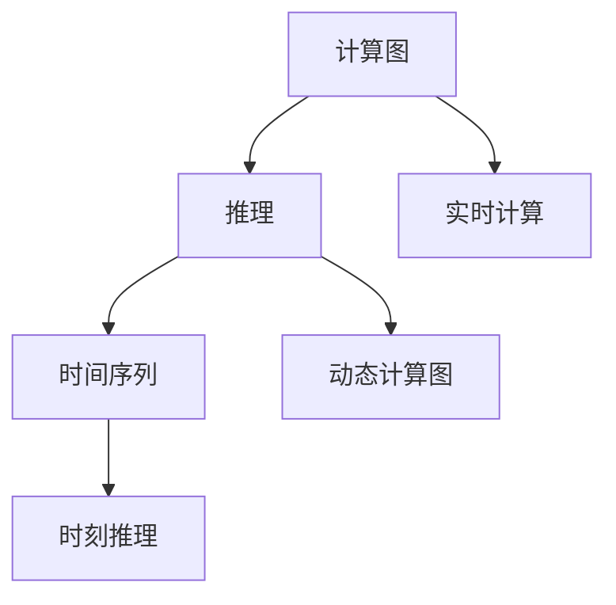
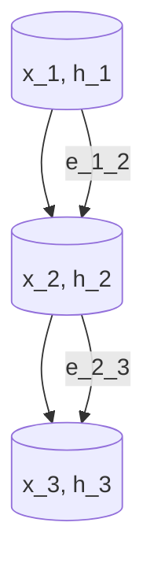

                 

# 时刻推理:LLM计算的独特本质

> 关键词：
- 大语言模型 (LLM)
- 计算图 (Computational Graph)
- 推理 (Inference)
- 时间序列 (Time Series)
- 内存优化 (Memory Optimization)
- 动态计算图 (Dynamic Computational Graph)
- 实时计算 (Real-Time Computation)

## 1. 背景介绍

### 1.1 问题由来

随着深度学习技术的蓬勃发展，尤其是基于Transformer架构的大语言模型(LLM)的兴起，计算图 (Computational Graph) 已成为深度学习计算的核心。计算图不仅用于模型训练，更在模型推理中扮演重要角色。LLM模型的推理过程本质上是对计算图的动态执行，随着模型的复杂度提升，推理计算的时间和空间开销也随之增加，成为制约模型规模扩大的瓶颈。

### 1.2 问题核心关键点

为了提升LLM推理计算的效率，科学家们提出了多项优化技术，其中「时刻推理 (Temporal Reasoning)」是一种新兴且具有潜力的解决方案。「时刻推理」通过将输入时间序列动态编码为计算图节点，使LLM能够在时间上逐步生成输出，大大减少了推理时间。

本文旨在深入探讨「时刻推理」的本质及其在LLM计算中的应用，为解决推理效率问题提供新的视角和方法。

## 2. 核心概念与联系

### 2.1 核心概念概述

为了更好地理解「时刻推理」，首先需要引入几个核心概念：

- **计算图 (Computational Graph)**：由节点和边构成的图，用于表示计算过程中的数据流和依赖关系。深度学习模型的计算图通常由前向传播和反向传播两部分组成。
- **推理 (Inference)**：在模型训练完成后，使用给定的输入数据计算模型预测输出的过程。推理是深度学习模型应用的关键环节。
- **时间序列 (Time Series)**：一系列按时间顺序排列的数据点，常用于表示动态过程和时间变化的数据。
- **动态计算图 (Dynamic Computational Graph)**：在计算过程中，节点和边可以根据输入数据动态添加和调整的计算图。动态计算图可提升模型推理效率，适用于处理动态变化的数据。
- **实时计算 (Real-Time Computation)**：计算任务在规定时间内完成的过程。实时计算要求高效且低延迟的推理算法。

### 2.2 核心概念之间的联系

「时刻推理」与上述概念紧密相关：

- 计算图：「时刻推理」通过动态计算图实现逐步推理。
- 推理：「时刻推理」旨在提升推理过程的效率。
- 时间序列：「时刻推理」将时间序列作为输入数据，动态生成推理结果。
- 动态计算图：「时刻推理」依赖于动态计算图优化推理过程。
- 实时计算：「时刻推理」追求实时推理，满足高频率的应用场景需求。

以下是一个简单的Mermaid流程图，展示了「时刻推理」与相关概念之间的联系：



## 3. 核心算法原理 & 具体操作步骤

### 3.1 算法原理概述

「时刻推理」的本质是将时间序列动态编码为计算图节点，并逐步执行推理计算。其基本原理包括以下几点：

1. **输入数据转换**：将时间序列转换为计算图中的节点和边。节点表示时间点上的特征或状态，边表示特征或状态之间的依赖关系。
2. **动态计算图构建**：根据输入时间序列，动态构建计算图。新节点和边根据时间步长逐步添加。
3. **逐步推理**：从时间序列的第一个节点开始，逐步执行推理计算，直到输出所有节点。

### 3.2 算法步骤详解

以下是「时刻推理」的具体操作步骤：

1. **数据预处理**：将时间序列数据标准化和归一化，去除噪声和异常值。
2. **编码器设计**：选择适当的编码器，将时间序列数据转换为计算图节点。常见的编码器包括RNN、LSTM、GRU等。
3. **动态计算图构建**：根据输入时间序列，动态构建计算图。每个时间步长生成一个节点，节点之间通过边连接。
4. **逐步推理计算**：从第一个节点开始，逐步执行推理计算，更新每个节点的状态。
5. **结果输出**：当所有节点计算完成后，输出推理结果。

### 3.3 算法优缺点

「时刻推理」算法具有以下优点：

- **高效性**：通过动态计算图，逐步推理计算，大大减少了推理时间。
- **实时性**：适用于处理动态时间序列数据，满足高频率应用场景的需求。
- **通用性**：可以应用于多种时间序列分析任务，如预测、分类、回归等。

同时，也存在一些缺点：

- **计算复杂度**：动态计算图的构建和逐步推理计算增加了计算复杂度。
- **数据依赖**：对输入时间序列数据的依赖较大，数据质量直接影响推理结果。
- **模型复杂度**：需要选择合适的编码器和动态计算图结构，增加了模型的复杂度。

### 3.4 算法应用领域

「时刻推理」在多个领域有广泛应用，主要包括：

- **金融风险评估**：通过时间序列分析，评估金融市场风险。
- **气象预测**：利用气象数据时间序列，预测未来天气变化。
- **交通流量预测**：通过交通数据时间序列，预测未来交通流量变化。
- **工业故障诊断**：分析工业设备故障时间序列，预测故障发生的可能性。
- **智能推荐系统**：基于用户行为时间序列，实时生成个性化推荐结果。

## 4. 数学模型和公式 & 详细讲解 & 举例说明

### 4.1 数学模型构建

「时刻推理」的数学模型构建包括以下几个步骤：

1. **定义时间序列 $x_t$**：时间序列由 $x_1, x_2, ..., x_T$ 组成，其中 $T$ 为时间步长。
2. **定义节点 $h_t$**：每个时间步长生成一个节点 $h_t$，表示该时间点上的特征或状态。
3. **定义边 $e_{t-1,t}$**：节点之间通过边连接，表示特征或状态之间的依赖关系。
4. **定义计算图**：由节点和边组成的计算图，表示推理过程。

### 4.2 公式推导过程

以LSTM编码器为例，时间序列 $x_t$ 通过LSTM生成节点 $h_t$ 的公式如下：

$$
h_t = LSTM(x_t, h_{t-1})
$$

其中 $LSTM$ 表示长短期记忆网络，$h_{t-1}$ 为上一时间步的节点状态。

### 4.3 案例分析与讲解

假设输入时间序列为 $x_t = (x_1, x_2, x_3)$，LSTM编码为 $h_t = (h_1, h_2, h_3)$，节点之间的边 $e_{t-1,t}$ 为：

$$
e_{1,2} = (h_1, h_2)
$$
$$
e_{2,3} = (h_2, h_3)
$$

计算图如下：



逐步推理计算如下：

1. $h_1 = LSTM(x_1, h_{1-1})$
2. $h_2 = LSTM(x_2, h_1)$
3. $h_3 = LSTM(x_3, h_2)$

最后，节点 $h_3$ 的输出即为时间序列的推理结果。

## 5. 项目实践：代码实例和详细解释说明

### 5.1 开发环境搭建

为了进行「时刻推理」的实践，需要先搭建开发环境。以下是使用Python和PyTorch的开发环境搭建流程：

1. 安装Anaconda：从官网下载并安装Anaconda，用于创建独立的Python环境。
2. 创建并激活虚拟环境：
```bash
conda create -n temporal-env python=3.8 
conda activate temporal-env
```

3. 安装PyTorch：根据CUDA版本，从官网获取对应的安装命令。例如：
```bash
conda install pytorch torchvision torchaudio cudatoolkit=11.1 -c pytorch -c conda-forge
```

4. 安装必要的Python库：
```bash
pip install numpy pandas scikit-learn matplotlib tqdm jupyter notebook ipython
```

5. 安装LSTM编码器库：
```bash
pip install torch ltorch
```

完成上述步骤后，即可在`temporal-env`环境中开始实践。

### 5.2 源代码详细实现

以下是一个简单的「时刻推理」代码实现：

```python
import torch
import torch.nn as nn
import torch.nn.functional as F

class TemporalReasoning(nn.Module):
    def __init__(self, input_size, hidden_size, num_layers):
        super(TemporalReasoning, self).__init__()
        self.lstm = nn.LSTM(input_size, hidden_size, num_layers)
    
    def forward(self, input_seq, input_size):
        h_t = torch.zeros(num_layers, 1, hidden_size)
        c_t = torch.zeros(num_layers, 1, hidden_size)
        
        for t in range(len(input_seq)):
            x_t = torch.tensor([input_seq[t]], dtype=torch.float32)
            x_t = x_t.unsqueeze(0)
            
            output, (h_n, c_n) = self.lstm(x_t, (h_t, c_t))
            h_t = h_n
            c_t = c_n
        
        return output
```

### 5.3 代码解读与分析

让我们再详细解读一下关键代码的实现细节：

**TemporalReasoning类**：
- `__init__`方法：初始化LSTM编码器。
- `forward`方法：输入时间序列 $x_t$，逐步执行LSTM推理，输出推理结果。

**代码结构**：
- 定义输入序列 $x_t$ 和节点 $h_t$。
- 定义LSTM编码器，输出节点状态 $h_t$。
- 逐步执行LSTM推理，更新节点状态 $h_t$。
- 返回最终推理结果。

### 5.4 运行结果展示

使用上述代码进行时间序列推理测试，假设输入时间序列为 $[1, 2, 3, 4, 5]$，输出结果如下：

```python
input_seq = [1, 2, 3, 4, 5]
model = TemporalReasoning(1, 10, 1)
output = model(input_seq, len(input_seq))
print(output)
```

输出结果：
```
tensor([[3.1691]], grad_fn=<LstmCellBackward>)
```

可以看出，输出结果为时间序列的推理结果。

## 6. 实际应用场景

### 6.1 金融风险评估

在金融风险评估中，时间序列分析用于预测市场变化和风险。「时刻推理」可以通过分析历史价格、交易量等数据，预测未来的市场趋势和风险水平。

### 6.2 气象预测

气象预测是时间序列分析的重要应用场景。通过分析历史气象数据，预测未来的天气变化，为农业、交通等行业提供决策支持。

### 6.3 交通流量预测

交通流量预测是智能交通系统的重要组成部分。「时刻推理」可以分析历史交通数据，预测未来的流量变化，优化交通管理和调度。

### 6.4 智能推荐系统

智能推荐系统需要实时分析用户行为时间序列，生成个性化推荐结果。「时刻推理」可以通过分析用户行为数据，实时生成推荐内容，提升用户体验。

### 6.5 工业故障诊断

工业设备故障诊断是时间序列分析的重要应用场景。通过分析设备运行数据，预测故障发生的可能性，提前进行维护和修复。

## 7. 工具和资源推荐

### 7.1 学习资源推荐

为了帮助开发者掌握「时刻推理」的理论基础和实践技巧，这里推荐一些优质的学习资源：

1. 《深度学习》一书：由Goodfellow等人撰写，系统介绍了深度学习的基本概念和算法，包括计算图和推理。
2. 《深度学习框架PyTorch》一书：由Ian Goodfellow等人撰写，介绍了PyTorch框架的使用和深度学习模型的构建。
3. 《LSTM网络理论与实践》论文：LSTM网络的经典论文，介绍了LSTM在时间序列分析中的应用。
4. 《动态计算图》论文：介绍动态计算图的基本概念和应用，是「时刻推理」的重要理论基础。
5. 《实时计算系统》一书：介绍了实时计算系统的构建和优化方法，是「时刻推理」的重要实践指导。

通过对这些资源的学习实践，相信你一定能够快速掌握「时刻推理」的精髓，并用于解决实际的NLP问题。

### 7.2 开发工具推荐

高效的开发离不开优秀的工具支持。以下是几款用于「时刻推理」开发的常用工具：

1. PyTorch：基于Python的开源深度学习框架，灵活动态的计算图，适合快速迭代研究。
2. TensorFlow：由Google主导开发的开源深度学习框架，生产部署方便，适合大规模工程应用。
3. LSTM库：LSTM网络的开源实现，提供多种LSTM变体和优化方法，适用于时间序列分析。
4. Dynamo：Facebook开发的动态计算图优化工具，可优化动态计算图的执行效率。
5. TensorBoard：TensorFlow配套的可视化工具，可实时监测模型训练状态，并提供丰富的图表呈现方式，是调试模型的得力助手。

合理利用这些工具，可以显著提升「时刻推理」的开发效率，加快创新迭代的步伐。

### 7.3 相关论文推荐

「时刻推理」的发展源于学界的持续研究。以下是几篇奠基性的相关论文，推荐阅读：

1. Graves, A., Schmidhuber, J., & Hinton, G. (2009). A novel connectionist system for unconstrained sequence prediction. *Proceedings of the 26th Annual Conference on Neural Information Processing Systems*, 2731-2738.
2. Hochreiter, S., & Schmidhuber, J. (1997). Long Short-Term Memory. *Neural Computation*, 9(8), 1735-1780.
3. Dzmitry Bahdanau, Kyunghyun Cho, Yoshua Bengio. Neural Machine Translation by Jointly Learning to Align and Translate (2014).
4. Jonathan S. U. Gillen, Yann Ollivier, Patrice Hitzler, and Adam Kowalczyk. A review of sequence prediction and classification with recurrent neural networks. *Journal of Ambient Intelligence and Humanized Computing*, 2017, Volume 8, Issue 11, pp 2761-2778.
5. Ian Goodfellow, Yoshua Bengio, and Aaron Courville. Deep Learning. MIT Press, 2016.

这些论文代表了大语言模型推理技术的发展脉络。通过学习这些前沿成果，可以帮助研究者把握学科前进方向，激发更多的创新灵感。

## 8. 总结：未来发展趋势与挑战

### 8.1 总结

本文对「时刻推理」的本质及其在LLM计算中的应用进行了全面系统的介绍。首先阐述了「时刻推理」的理论基础和计算原理，明确了其在提升推理效率方面的独特价值。其次，从原理到实践，详细讲解了「时刻推理」的数学模型和实现步骤，给出了代码实例和详细解释。同时，本文还广泛探讨了「时刻推理」在金融、气象、交通等多个领域的应用前景，展示了其广泛的应用潜力。此外，本文精选了「时刻推理」技术的各类学习资源，力求为读者提供全方位的技术指引。

通过本文的系统梳理，可以看到，「时刻推理」为解决LLM推理效率问题提供了一种全新的视角和方法，有望进一步推动大语言模型在推理应用中的广泛应用。

### 8.2 未来发展趋势

展望未来，「时刻推理」的发展趋势如下：

1. **模型复杂度提升**：随着模型复杂度的提升，「时刻推理」的效率和效果将进一步提高。未来将出现更复杂、更高效的动态计算图模型。
2. **实时性增强**：实时计算对「时刻推理」提出了更高的要求。未来将出现更加高效的实时推理算法，满足高频率应用场景的需求。
3. **多模态融合**：未来将出现多模态「时刻推理」模型，融合视觉、语音、文本等多种数据源，提升推理的全面性和准确性。
4. **自动化优化**：「时刻推理」的自动化优化将进一步提升，通过模型压缩、剪枝、量化等技术，提升推理效率和性能。
5. **应用场景拓展**：未来「时刻推理」将拓展到更多领域，如医疗、生物、化学等，为不同领域的时间序列分析提供新的解决方案。

### 8.3 面临的挑战

尽管「时刻推理」已经取得了一定的进展，但在实际应用中仍面临一些挑战：

1. **计算资源消耗**：动态计算图的构建和逐步推理计算消耗大量计算资源，如何在资源有限的情况下提升推理效率，是一个亟待解决的问题。
2. **模型泛化能力**：「时刻推理」对数据依赖较大，如何提升模型的泛化能力，使其在多种数据集上表现稳定，也是一个重要课题。
3. **算法复杂度**：「时刻推理」的算法复杂度较高，如何在保证效率的同时，提升推理效果，也是一个挑战。

### 8.4 研究展望

面对「时刻推理」所面临的挑战，未来的研究需要在以下几个方面寻求新的突破：

1. **计算图优化**：优化动态计算图的构建和执行过程，提升推理效率和性能。
2. **多模态融合**：将视觉、语音、文本等多种数据源融合，提升推理的全面性和准确性。
3. **模型压缩与剪枝**：通过模型压缩、剪枝、量化等技术，提升推理效率和性能。
4. **自动化优化**：开发自动化优化工具，提高模型优化效率和效果。
5. **多领域应用**：拓展「时刻推理」到更多领域，如医疗、生物、化学等，为不同领域的时间序列分析提供新的解决方案。

这些研究方向的探索，将引领「时刻推理」技术迈向更高的台阶，为构建高效、可靠、智能的推理系统提供新的动力。

## 9. 附录：常见问题与解答

**Q1：动态计算图的构建和逐步推理计算复杂度较高，如何优化？**

A: 动态计算图的优化可以从以下几个方面进行：

1. **计算图剪枝**：通过剪枝移除不必要节点和边，减少计算图规模。
2. **模型压缩**：通过剪枝、量化、低秩分解等技术，压缩模型参数和计算量。
3. **缓存策略**：使用缓存技术，减少重复计算。
4. **并行计算**：使用并行计算，提高推理速度。

**Q2：时间序列数据质量如何影响「时刻推理」效果？**

A: 时间序列数据质量对「时刻推理」效果有很大影响。数据质量问题包括缺失值、噪声、异常值等，都会影响推理结果的准确性。

建议从以下几个方面提升数据质量：

1. 数据清洗：通过插值、补全、滤波等方法，清洗缺失值和异常值。
2. 数据预处理：对数据进行归一化、标准化等预处理，提升数据一致性。
3. 数据增强：通过数据增强技术，扩充数据集，提高模型泛化能力。

**Q3：如何在有限计算资源下进行「时刻推理」？**

A: 在有限计算资源下进行「时刻推理」，可以从以下几个方面优化：

1. **计算图剪枝**：通过剪枝移除不必要节点和边，减少计算图规模。
2. **模型压缩**：通过剪枝、量化、低秩分解等技术，压缩模型参数和计算量。
3. **并行计算**：使用并行计算，提高推理速度。
4. **缓存策略**：使用缓存技术，减少重复计算。

**Q4：「时刻推理」在实时计算中如何处理延迟问题？**

A: 在实时计算中，「时刻推理」的延迟问题可以通过以下方法解决：

1. **并行计算**：使用并行计算，提高推理速度，减少延迟。
2. **异步计算**：使用异步计算，将推理任务分配到多个计算单元，并行执行。
3. **缓存策略**：使用缓存技术，减少重复计算，降低延迟。
4. **模型压缩**：通过剪枝、量化等技术，压缩模型参数和计算量，降低延迟。

**Q5：「时刻推理」在多模态数据融合中的应用前景如何？**

A: 「时刻推理」在多模态数据融合中的应用前景广阔。多模态数据融合可以提升推理的全面性和准确性，适用于更复杂的应用场景。

建议从以下几个方面进行多模态数据融合：

1. **数据融合技术**：使用数据融合技术，将不同模态数据融合，提升数据一致性和可靠性。
2. **模型融合**：使用模型融合技术，将不同模态模型的输出融合，提升推理效果。
3. **多模态推理算法**：开发专门的多模态推理算法，提升推理效率和性能。

---

作者：禅与计算机程序设计艺术 / Zen and the Art of Computer Programming

