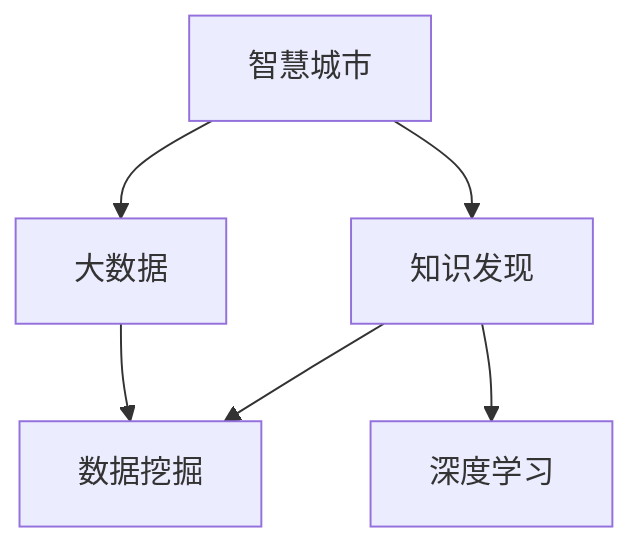

                 

# 智慧城市的大脑：知识发现在城市管理中的应用

> 关键词：智慧城市,知识发现,城市管理,大数据,机器学习

## 1. 背景介绍

### 1.1 问题由来

随着全球城市化进程的加速，智慧城市的建设日益成为国家发展战略的关键部分。智慧城市通过融合物联网、云计算、大数据等技术，实现城市管理智能化、高效化，提升城市公共服务水平和居民生活质量。其中，知识发现(Knowledge Discovery)作为智慧城市大脑的核心功能，能够从海量数据中挖掘出有价值的知识，辅助决策，优化管理，带来显著的社会经济效益。

知识发现是人工智能领域的一个重要分支，它利用数据分析、机器学习等技术，从大规模数据集中自动发现蕴含的知识和规律。在智慧城市中，知识发现能够帮助城市管理者理解城市运作机制，预测发展趋势，优化资源配置，提升城市运行效率。

### 1.2 问题核心关键点

1. **数据源多样性**：智慧城市的数据源广泛，包括交通流量、能源消耗、环境监测、公共安全等多种类型的实时和非实时数据。
2. **数据质量参差不齐**：数据往往存在噪声、缺失、异常等问题，需要预先处理。
3. **知识表示复杂**：知识发现不仅需要提取单一指标，还需要多维度、多时间尺度的综合分析。
4. **结果解释性**：智慧城市决策需要高度的可解释性，以确保结果的可信度和可接受性。
5. **实时性要求**：知识发现需要在较短时间内输出结果，满足城市管理的实时需求。

## 2. 核心概念与联系

### 2.1 核心概念概述

为更好地理解知识发现在智慧城市中的应用，本节将介绍几个关键概念：

- **智慧城市(Smart City)**：通过信息技术的深度应用，使城市运作更加智能化、高效化，提升居民生活质量和城市竞争力。
- **知识发现(Knowledge Discovery)**：通过数据分析、机器学习等技术，从大规模数据中自动发现蕴含的知识和规律。
- **大数据(Big Data)**：指超过传统数据处理工具的规模和速度的数据集合，广泛用于城市管理、公共服务等领域。
- **数据挖掘(Data Mining)**：从大数据中发现、抽取有用的信息和知识的过程。
- **深度学习(Deep Learning)**：利用多层神经网络进行复杂模式识别的机器学习技术。

这些核心概念之间的逻辑关系可以通过以下Mermaid流程图来展示：



这个流程图展示智慧城市与大数据、知识发现、数据挖掘、深度学习之间的关系：

1. 智慧城市通过大数据获取城市运作信息。
2. 数据挖掘从大数据中抽取有用的信息和知识。
3. 知识发现进一步从数据中发现蕴含的知识和规律。
4. 深度学习用于处理高维数据和复杂模式识别。

## 3. 核心算法原理 & 具体操作步骤
### 3.1 算法原理概述

知识发现通常分为三个步骤：数据预处理、特征提取和模型训练。以下将详细介绍每个步骤的算法原理和具体操作步骤。

### 3.2 算法步骤详解

#### 3.2.1 数据预处理

数据预处理是知识发现的重要前提，其目标是通过清洗、标准化、转换等手段，将原始数据转化为可用于分析的格式。

1. **数据清洗**：去除噪声、重复、缺失数据，填补空缺值，处理异常值。
2. **数据标准化**：将数据按一定规则进行归一化处理，如最大最小归一化、Z-score标准化等。
3. **数据转换**：如将类别数据转换为数值型数据，将时间序列数据转换为频率域数据等。

#### 3.2.2 特征提取

特征提取是将原始数据转换为模型可以处理的特征表示的过程。常用的特征提取方法包括：

1. **统计特征**：如均值、方差、偏度、峰度等统计量。
2. **时间序列特征**：如滑动平均、差分、自相关、周期性特征等。
3. **文本特征**：如TF-IDF、词袋模型、词嵌入等。
4. **图像特征**：如颜色直方图、边缘检测、尺度不变特征变换(SIFT)等。

#### 3.2.3 模型训练

模型训练是知识发现的最后一步，其目的是通过构建和训练机器学习模型，从数据中提取知识。常用的模型包括：

1. **监督学习模型**：如决策树、随机森林、支持向量机等。
2. **非监督学习模型**：如聚类、主成分分析(PCA)、独立成分分析(ICA)等。
3. **半监督学习模型**：如自训练、标签传播等。
4. **深度学习模型**：如卷积神经网络(CNN)、循环神经网络(RNN)、长短期记忆网络(LSTM)等。

### 3.3 算法优缺点

知识发现算法具有以下优点：

1. **自动发现知识**：通过算法自动从数据中发现规律和模式，无需人工干预。
2. **数据驱动决策**：基于数据而不是直觉或经验进行决策，提高了决策的科学性和准确性。
3. **模型可解释性**：许多算法可以提供模型的解释和洞察，帮助理解和解释结果。

同时，也存在一些缺点：

1. **数据依赖性强**：知识发现的效果高度依赖数据质量，数据缺失或噪声会影响结果。
2. **算法复杂度高**：复杂的模型可能需要更多的计算资源和时间。
3. **结果易受模型选择影响**：不同的模型对同一数据集可能会得到不同的结果。
4. **结果难以验证**：发现的知识和规律往往难以验证，需要实际应用来检验其有效性。

### 3.4 算法应用领域

知识发现技术在智慧城市中的应用广泛，以下是几个典型领域：

- **交通流量分析**：通过分析交通流量数据，发现交通拥堵、事故多发路段等，优化交通管理和调度。
- **能源消耗优化**：利用能源消耗数据，发现能耗高、效率低的环节，优化能源使用。
- **环境监测**：通过环境监测数据，发现污染源、预测污染趋势，改善环境质量。
- **公共安全管理**：分析安全事件数据，预测风险区域，提升公共安全保障。
- **城市规划和建设**：从城市基础设施数据中提取有价值的信息，辅助城市规划和建设决策。

## 4. 数学模型和公式 & 详细讲解 & 举例说明

### 4.1 数学模型构建

假设我们有一组交通流量数据 $D=\{(x_i,y_i)\}_{i=1}^N$，其中 $x_i$ 表示第 $i$ 个时间点的交通流量，$y_i$ 表示该时间点的天气状况（晴、阴、雨等）。我们可以使用监督学习模型来预测天气对交通流量的影响。

定义模型 $M$ 在输入 $x_i$ 上的预测值为 $M(x_i)$，则在数据集 $D$ 上的经验风险为：

$$
\mathcal{L}(\theta) = \frac{1}{N}\sum_{i=1}^N \ell(M(x_i),y_i)
$$

其中 $\ell$ 为损失函数，$M_{\theta}$ 为模型参数。常用的损失函数包括均方误差损失、交叉熵损失等。

### 4.2 公式推导过程

以线性回归模型为例，假设模型的预测公式为 $M_{\theta}(x_i) = \theta_0 + \theta_1 x_i$，其中 $\theta_0$ 和 $\theta_1$ 为模型参数。损失函数取均方误差损失，则有：

$$
\ell(M(x_i),y_i) = \frac{1}{2}(y_i-M_{\theta}(x_i))^2
$$

代入经验风险公式，得：

$$
\mathcal{L}(\theta) = \frac{1}{2N}\sum_{i=1}^N (y_i-\theta_0 - \theta_1 x_i)^2
$$

使用梯度下降算法对 $\theta_0$ 和 $\theta_1$ 进行优化：

$$
\theta_0 \leftarrow \theta_0 - \eta \frac{1}{N}\sum_{i=1}^N (y_i-\theta_0 - \theta_1 x_i)
$$

$$
\theta_1 \leftarrow \theta_1 - \eta \frac{1}{N}\sum_{i=1}^N (y_i-\theta_0 - \theta_1 x_i)x_i
$$

其中 $\eta$ 为学习率。通过迭代更新参数，直到模型收敛。

### 4.3 案例分析与讲解

以下是一个简单的交通流量预测案例：

假设我们有交通流量数据 $D=\{(x_i,y_i)\}_{i=1}^{100}$，其中 $x_i$ 表示第 $i$ 个时间点的交通流量，$y_i$ 表示该时间点的天气状况（晴、阴、雨等）。我们可以使用线性回归模型进行预测，具体步骤如下：

1. 数据预处理：将 $x_i$ 标准化，将 $y_i$ 转换为数值型数据（晴=1，阴=0，雨=-1）。
2. 特征提取：提取 $x_i$ 的时间序列特征，如滑动平均、差分等。
3. 模型训练：使用线性回归模型进行训练，优化参数 $\theta_0$ 和 $\theta_1$。
4. 结果解释：通过解释模型参数，理解天气对交通流量的影响。

## 5. 项目实践：代码实例和详细解释说明

### 5.1 开发环境搭建

在进行知识发现实践前，我们需要准备好开发环境。以下是使用Python进行Scikit-Learn和Pandas开发的环境配置流程：

1. 安装Anaconda：从官网下载并安装Anaconda，用于创建独立的Python环境。

2. 创建并激活虚拟环境：
```bash
conda create -n knowledge-discovery python=3.8 
conda activate knowledge-discovery
```

3. 安装必要的库：
```bash
conda install numpy pandas scikit-learn statsmodels matplotlib tqdm jupyter notebook ipython
```

4. 安装其他工具：
```bash
pip install beautifulsoup4 numpy pandas scikit-learn statsmodels matplotlib tqdm jupyter notebook ipython
```

完成上述步骤后，即可在`knowledge-discovery`环境中开始知识发现实践。

### 5.2 源代码详细实现

下面我们以交通流量预测为例，给出使用Scikit-Learn库进行知识发现的Python代码实现。

首先，定义数据处理函数：

```python
import pandas as pd
from sklearn.preprocessing import MinMaxScaler, OneHotEncoder

def process_data(data):
    # 数据清洗和处理
    # 去除缺失值和异常值
    data = data.dropna()
    data = data[data['traffic'] > 0]
    data = data.drop_duplicates()

    # 数据标准化
    scaler = MinMaxScaler()
    data['traffic'] = scaler.fit_transform(data[['traffic']])

    # 标签转换
    y = data.pop('weather')
    encoder = OneHotEncoder()
    y = encoder.fit_transform(y.reshape(-1, 1)).toarray()
    y = pd.DataFrame(y, columns=['晴', '阴', '雨'])

    # 特征选择
    X = data.drop('traffic', axis=1)
    return X, y
```

然后，定义模型训练函数：

```python
from sklearn.linear_model import LinearRegression

def train_model(X, y):
    model = LinearRegression()
    model.fit(X, y)
    return model
```

最后，使用上述函数进行数据处理和模型训练：

```python
# 加载数据
data = pd.read_csv('traffic_data.csv')

# 数据处理
X, y = process_data(data)

# 模型训练
model = train_model(X, y)

# 预测交通流量
predictions = model.predict(X)
```

以上就是使用Scikit-Learn对交通流量数据进行线性回归模型训练的完整代码实现。可以看到，得益于Scikit-Learn的强大封装，我们可以用相对简洁的代码完成模型训练和预测。

### 5.3 代码解读与分析

让我们再详细解读一下关键代码的实现细节：

**process_data函数**：
- `dropna`方法：去除包含缺失值的行。
- `drop_duplicates`方法：去除重复的行。
- `MinMaxScaler`类：将数值型数据标准化到[0,1]区间。
- `OneHotEncoder`类：将类别型数据进行独热编码。

**train_model函数**：
- `LinearRegression`类：构建线性回归模型。
- `fit`方法：在训练集上拟合模型。

**数据加载和处理**：
- `pd.read_csv`方法：读取CSV格式的数据文件。

**模型训练**：
- `predict`方法：使用训练好的模型进行预测。

可以看到，Scikit-Learn提供了丰富的机器学习算法，使用起来十分方便。开发者可以根据具体任务选择不同的算法，快速完成模型训练和评估。

## 6. 实际应用场景

### 6.1 交通流量分析

交通流量分析是智慧城市管理中的重要应用之一。通过分析交通流量数据，可以发现交通拥堵、事故多发路段等，优化交通管理和调度。

具体而言，可以收集城市各条道路的交通流量数据，进行时间序列分析和特征提取。通过构建线性回归模型，可以预测特定时间段内的交通流量，辅助交通调度和管理。

### 6.2 能源消耗优化

能源消耗优化是智慧城市节能减排的重要手段。通过分析能源消耗数据，可以发现能耗高、效率低的环节，优化能源使用。

具体而言，可以收集城市各区域的能源消耗数据，进行分类和归一化处理。通过构建聚类算法（如K-means、层次聚类等），可以识别出高能耗的群体，制定节能方案。

### 6.3 环境监测

环境监测是智慧城市建设的基础环节。通过分析环境监测数据，可以发现污染源、预测污染趋势，改善环境质量。

具体而言，可以收集城市各区域的环境监测数据，进行时间序列分析和特征提取。通过构建时间序列模型（如ARIMA、SARIMA等），可以预测未来环境的趋势和变化，辅助环境治理。

### 6.4 公共安全管理

公共安全管理是智慧城市管理中的重要内容。通过分析安全事件数据，可以预测风险区域，提升公共安全保障。

具体而言，可以收集城市各区域的安全事件数据，进行分类和归一化处理。通过构建聚类算法（如K-means、层次聚类等），可以识别出高风险区域，制定安全防范措施。

### 6.5 城市规划和建设

城市规划和建设是智慧城市发展的关键环节。通过分析城市基础设施数据，可以提取有价值的信息，辅助城市规划和建设决策。

具体而言，可以收集城市各区域的基础设施数据，进行分类和归一化处理。通过构建回归模型和聚类算法，可以识别出基础设施建设的瓶颈和重点区域，优化规划方案。

## 7. 工具和资源推荐

### 7.1 学习资源推荐

为了帮助开发者系统掌握知识发现理论基础和实践技巧，这里推荐一些优质的学习资源：

1. 《统计学习方法》：李航著，系统介绍了各种常见的机器学习算法和理论。
2. 《Python机器学习基础教程》：使用Python实现机器学习算法，包含Scikit-Learn等库的详细教程。
3. 《深度学习》：Ian Goodfellow等著，全面介绍了深度学习的基本概念和算法。
4. Kaggle竞赛：参加机器学习和数据挖掘竞赛，实践数据挖掘技术，学习实战经验。
5. Coursera机器学习课程：由斯坦福大学提供，涵盖机器学习的基本理论和实践。

通过对这些资源的学习实践，相信你一定能够快速掌握知识发现的精髓，并用于解决实际的智慧城市问题。

### 7.2 开发工具推荐

高效的开发离不开优秀的工具支持。以下是几款用于知识发现开发的常用工具：

1. Python：强大的脚本语言，适合数据处理和算法实现。
2. R语言：专门用于统计分析和数据挖掘的工具，丰富的库和函数支持。
3. Scikit-Learn：Python机器学习库，提供了丰富的算法实现和数据处理工具。
4. Pandas：Python数据处理库，提供了高效的数据读写、处理和分析工具。
5. Matplotlib和Seaborn：Python绘图库，用于绘制各种统计图表和可视化结果。

合理利用这些工具，可以显著提升知识发现任务的开发效率，加快创新迭代的步伐。

### 7.3 相关论文推荐

知识发现和机器学习的研究发展迅速，以下是几篇奠基性的相关论文，推荐阅读：

1. "Knowledge Discovery in Databases: A Data-Mining Approach"：Tan等著，介绍了数据挖掘的基本概念和方法。
2. "An Introduction to Statistical Learning"：Gareth等著，全面介绍了统计学习的基本理论和算法。
3. "Deep Learning"：Goodfellow等著，介绍了深度学习的基本概念和算法。
4. "Machine Learning Yearning"：Andrew Ng著，提供了机器学习和深度学习的实践经验和策略。

这些论文代表的知识发现技术的发展脉络。通过学习这些前沿成果，可以帮助研究者把握学科前进方向，激发更多的创新灵感。

## 8. 总结：未来发展趋势与挑战

### 8.1 研究成果总结

本文对知识发现技术在智慧城市中的应用进行了全面系统的介绍。首先阐述了知识发现的重要性和作用，明确了其在智慧城市中的关键地位。其次，从原理到实践，详细讲解了知识发现的数学模型和操作步骤，给出了知识发现任务开发的完整代码实例。同时，本文还广泛探讨了知识发现技术在智慧城市中的实际应用场景，展示了其广阔的应用前景。最后，本文精选了知识发现技术的各类学习资源，力求为读者提供全方位的技术指引。

通过本文的系统梳理，可以看到，知识发现技术在智慧城市中的应用前景广阔，具有极大的社会和经济价值。知识发现技术能够从海量数据中挖掘出有价值的知识和规律，为城市管理者提供科学的决策支持，优化资源配置，提升城市运行效率。未来，随着知识发现技术的不断进步，将为智慧城市建设带来更多创新和突破。

### 8.2 未来发展趋势

展望未来，知识发现技术将呈现以下几个发展趋势：

1. **自动化程度提高**：随着自动化机器学习(AutoML)技术的发展，知识发现将更加自动化，无需人工干预即可自动进行特征提取和模型训练。
2. **跨模态知识发现**：将文本、图像、视频等多种模态数据结合，实现更全面的数据理解和分析。
3. **自适应学习**：知识发现模型将具备更强的自适应能力，能够自动调整参数，适应不同的数据分布和应用场景。
4. **联邦学习**：在数据隐私和安全要求更高的场景下，联邦学习技术能够保护数据隐私，同时实现知识共享和协作。
5. **实时化处理**：知识发现系统将具备实时处理能力，能够对实时数据进行实时分析，及时响应城市管理需求。

以上趋势凸显了知识发现技术的广阔前景。这些方向的探索发展，将进一步提升知识发现系统的性能和应用范围，为智慧城市建设提供更强大的数据支持和决策依据。

### 8.3 面临的挑战

尽管知识发现技术在智慧城市中的应用已取得不少进展，但在迈向更加智能化、普适化应用的过程中，它仍面临着诸多挑战：

1. **数据质量问题**：知识发现的效果高度依赖数据质量，如何处理数据缺失、噪声和异常值，是一个亟待解决的问题。
2. **算法复杂度**：复杂的知识发现算法需要更多的计算资源和时间，如何降低算法复杂度，提高系统效率，是未来的研究方向。
3. **结果解释性**：知识发现模型往往难以解释其内部工作机制和决策逻辑，如何在保证模型准确性的同时，提高结果的可解释性，是一个重要的研究方向。
4. **数据隐私保护**：知识发现涉及大量敏感数据，如何保护数据隐私，避免数据泄露，是应用知识发现技术需要考虑的关键问题。
5. **模型鲁棒性**：知识发现模型容易受到数据分布变化的影响，如何在不同数据分布下保持模型的鲁棒性，是一个需要解决的问题。

## 8.4 研究展望

面对知识发现面临的这些挑战，未来的研究需要在以下几个方面寻求新的突破：

1. **数据预处理技术**：发展更高效的数据清洗和标准化方法，提高数据质量，降低数据预处理的复杂度。
2. **轻量级知识发现**：开发轻量级、实时化的知识发现算法，适应智慧城市中的实时数据处理需求。
3. **可解释性研究**：研究知识发现模型的可解释性，提高模型的可解释性，增加决策的可接受性。
4. **联邦学习应用**：在数据隐私和安全要求更高的场景下，研究联邦学习技术在知识发现中的应用，保护数据隐私。
5. **跨模态知识发现**：研究多模态数据融合技术，实现跨模态数据的知识发现，提高知识发现模型的全面性和准确性。

这些研究方向的探索，必将引领知识发现技术迈向更高的台阶，为智慧城市建设提供更强大的数据支持和决策依据。

## 9. 附录：常见问题与解答

**Q1：知识发现是否适用于所有智慧城市应用？**

A: 知识发现技术在智慧城市中的应用非常广泛，但并不是所有应用场景都适合使用知识发现技术。对于数据量较小或数据质量较低的应用场景，可以考虑使用其他方法，如人工分析和规则设计。

**Q2：知识发现的效果如何保证？**

A: 知识发现的效果依赖于数据质量和算法选择。数据预处理是保证知识发现效果的关键步骤，需要保证数据的质量和一致性。此外，需要选择合适的算法和模型，并进行合理的参数调优。

**Q3：如何提高知识发现的效率？**

A: 提高知识发现的效率需要从多个方面入手：
1. 数据预处理：提高数据清洗和标准化的效率，减少数据预处理的耗时。
2. 特征选择：选择具有代表性的特征，减少特征数量，提高模型训练效率。
3. 并行计算：使用分布式计算框架，如Spark、Dask等，提高计算效率。
4. 优化算法：选择高效的算法和模型，并进行参数调优，减少计算资源和时间。

**Q4：知识发现的可解释性如何保障？**

A: 提高知识发现的可解释性需要从多个方面入手：
1. 使用可解释性模型：选择具有可解释性的模型，如决策树、逻辑回归等。
2. 可视化技术：使用可视化工具，如Matplotlib、Seaborn等，可视化模型的特征和决策过程。
3. 特征解释：对模型使用的特征进行解释，帮助理解模型的决策依据。
4. 特征重要性：计算特征的重要性，帮助理解哪些特征对模型的决策影响最大。

这些方法可以有效地提高知识发现的可解释性，增加决策的可接受性。

---

作者：禅与计算机程序设计艺术 / Zen and the Art of Computer Programming

