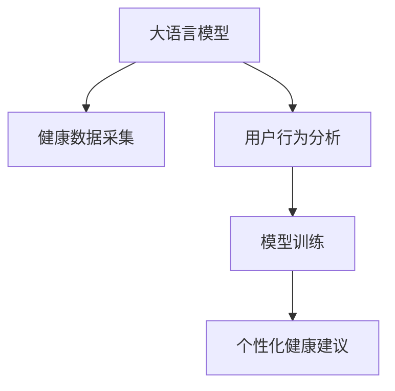

                 

# 智能健康管理：LLM个性化健康建议系统

> 关键词：智能健康管理,LLM,个性化健康建议,自然语言处理,NLP,深度学习,健康数据,用户行为分析,模型训练

## 1. 背景介绍

### 1.1 问题由来
随着人们生活水平的不断提高，健康管理逐渐成为人们关注的热点话题。越来越多的人开始意识到，通过科学的健康管理手段，可以有效预防疾病，提升生活质量。然而，传统的健康管理方法往往依赖于医生的个人经验，难以形成个性化、系统化的健康管理方案。如何借助先进的技术手段，实现科学、高效的个性化健康管理，成为当下亟需解决的问题。

### 1.2 问题核心关键点
要实现个性化健康管理，需要解决以下核心问题：
- 如何利用自然语言处理技术，从海量的健康数据中提取有用的信息？
- 如何基于用户的健康数据和行为数据，生成个性化的健康建议？
- 如何确保健康建议的科学性和可靠性？

### 1.3 问题研究意义
智能健康管理系统的构建，对于提升人们的健康意识和生活质量，具有重要的现实意义：

1. 降低医疗成本：智能健康管理系统能够及时提醒用户注意健康问题，减少去医院的频率，节约医疗资源。
2. 提高生活质量：通过个性化的健康建议，帮助用户更好地管理日常作息和饮食，提升生活质量。
3. 增强用户体验：智能健康管理系统提供便捷、及时的健康建议，使用户能够更主动地管理自己的健康。
4. 促进健康产业升级：智能健康管理系统为健康产业注入新的技术元素，推动健康产业的发展和创新。

## 2. 核心概念与联系

### 2.1 核心概念概述

为了更好地理解基于自然语言处理（NLP）技术构建的智能健康管理系统，本节将介绍几个核心概念及其相互关系：

- **大语言模型（Large Language Model, LLM）**：指在大规模无标签文本数据上进行自监督预训练的模型，如BERT、GPT-3等，具备强大的语言理解和生成能力。
- **个性化健康建议**：根据用户的具体健康状况、行为数据和偏好，提供定制化的健康管理方案，如饮食建议、运动计划等。
- **自然语言处理（NLP）**：涉及自然语言理解、生成、分析等技术，是智能健康管理系统的技术基础。
- **健康数据**：包括用户的生理参数、生活习惯、健康记录等，是智能健康管理系统的重要输入。
- **用户行为分析**：通过分析用户的行为数据，如饮食记录、运动数据等，挖掘用户的健康习惯和偏好。
- **模型训练**：基于用户的健康数据和行为数据，使用大语言模型进行训练，生成个性化的健康建议。

这些核心概念之间的逻辑关系可以通过以下Mermaid流程图来展示：



这个流程图展示了智能健康管理系统的核心流程：

1. 大语言模型从健康数据采集系统中获取用户数据。
2. 用户行为分析模块对用户的健康数据进行初步处理和分析，挖掘用户的健康习惯和偏好。
3. 模型训练模块使用大语言模型对用户的健康数据和行为数据进行训练，生成个性化的健康建议。
4. 个性化健康建议模块将生成的健康建议反馈给用户，帮助其实现科学健康管理。

## 3. 核心算法原理 & 具体操作步骤
### 3.1 算法原理概述

基于大语言模型的个性化健康管理系统，通过以下步骤实现：

1. 收集用户的健康数据和行为数据，作为模型的输入。
2. 使用大语言模型对输入数据进行理解和分析，提取出有用的信息。
3. 根据用户的具体健康状况和偏好，生成个性化的健康建议。
4. 对生成的健康建议进行评估和优化，确保建议的科学性和可靠性。
5. 将健康建议展示给用户，实现个性化的健康管理。

### 3.2 算法步骤详解

以下是基于大语言模型的个性化健康管理系统的具体操作步骤：

#### 3.2.1 数据采集和预处理
1. **数据采集**：
   - 采集用户的健康数据，包括体重、血压、血糖等生理参数。
   - 采集用户的行为数据，如饮食记录、运动数据、睡眠质量等。
2. **数据预处理**：
   - 清洗数据，去除噪声和异常值。
   - 对生理参数进行标准化处理，将数据转换为模型可接受的形式。
   - 对行为数据进行分类和编码，生成模型的输入。

#### 3.2.2 模型训练
1. **数据分割**：
   - 将用户数据划分为训练集、验证集和测试集。
   - 使用机器学习算法对数据进行特征工程，提取有用的特征。
2. **模型选择**：
   - 选择合适的大语言模型，如BERT、GPT-3等。
   - 在训练集上对模型进行微调，优化模型参数。
3. **训练评估**：
   - 在验证集上评估模型的性能，调整模型参数。
   - 在测试集上测试模型的泛化能力，评估模型的最终性能。

#### 3.2.3 生成健康建议
1. **输入准备**：
   - 将用户的健康数据和行为数据整理成模型所需的格式。
   - 使用预训练的语言模型对输入进行编码，生成模型可以理解的向量表示。
2. **建议生成**：
   - 将模型生成的向量表示输入到语言模型中，生成个性化的健康建议。
   - 根据用户的健康状况和偏好，对建议进行筛选和优化。
3. **建议输出**：
   - 将生成的健康建议展示给用户，提供科学、个性化的健康管理方案。

#### 3.2.4 系统部署
1. **模型部署**：
   - 将训练好的模型部署到服务器或云端。
   - 使用API接口提供模型的预测服务，供用户使用。
2. **用户反馈**：
   - 收集用户对健康建议的反馈数据。
   - 对反馈数据进行分析，优化模型的性能和建议质量。

### 3.3 算法优缺点

基于大语言模型的个性化健康管理系统，具有以下优点：

1. **精度高**：利用大语言模型的强大语言理解能力，生成的健康建议科学、可靠。
2. **可扩展性强**：模型可以随着数据量和用户规模的增加，不断进行优化和提升。
3. **灵活性高**：模型可以根据用户的需求和偏好，提供个性化的健康建议。
4. **成本低**：通过线上部署，减少医疗资源和人力成本。

同时，该方法也存在一些局限性：

1. **数据依赖性**：系统的性能依赖于输入数据的完整性和准确性，缺乏高质量数据可能导致建议失效。
2. **模型复杂性**：大语言模型的训练和维护成本较高，需要专业的技术团队支持。
3. **隐私问题**：用户数据的隐私保护需要严格遵守相关法律法规，确保用户数据安全。

### 3.4 算法应用领域

基于大语言模型的个性化健康管理系统，已经在以下领域得到广泛应用：

1. **智能健身**：通过分析用户的运动数据和生理参数，生成个性化的健身方案，提升用户的身体素质。
2. **营养指导**：根据用户的饮食记录和健康数据，生成个性化的饮食建议，帮助用户科学饮食。
3. **心理健康**：分析用户的心理状态和行为数据，生成心理健康建议，帮助用户缓解压力，保持心理健康。
4. **慢性病管理**：根据用户的慢性病数据，生成个性化的治疗和监测建议，提高治疗效果。
5. **疾病预防**：通过分析用户的健康数据，预测疾病风险，提供预防建议，减少疾病发生率。

## 4. 数学模型和公式 & 详细讲解 & 举例说明

### 4.1 数学模型构建

本节将使用数学语言对基于大语言模型的个性化健康管理系统进行更加严格的刻画。

假设用户的健康数据为 $x=(x_1,x_2,...,x_n)$，其中 $x_i$ 表示第 $i$ 个生理参数或行为数据。设 $y$ 表示个性化的健康建议，即：

$$
y = \text{Model}(x)
$$

其中 $\text{Model}$ 为基于大语言模型的模型函数，将用户的健康数据 $x$ 映射为健康建议 $y$。

### 4.2 公式推导过程

以下我们以饮食建议为例，推导大语言模型生成健康建议的过程。

1. **输入编码**：
   - 将用户的饮食记录 $x$ 转换为语言模型可以接受的向量表示 $V(x)$。
   - 使用预训练的语言模型对 $V(x)$ 进行编码，生成上下文向量 $C(x)$。

2. **建议生成**：
   - 将上下文向量 $C(x)$ 输入到语言模型中，生成个性化的饮食建议 $y$。
   - 建议生成的过程可以通过以下公式表示：

$$
y = \text{Decoder}(C(x))
$$

其中 $\text{Decoder}$ 为语言模型的解码函数，用于生成建议文本。

### 4.3 案例分析与讲解

以生成个性化饮食建议为例，分析大语言模型在实际应用中的表现：

1. **数据采集**：
   - 采集用户的饮食记录，如每日三餐的食物种类、摄入量等。
   - 采集用户的健康数据，如体重、血压、血糖等。

2. **数据预处理**：
   - 清洗数据，去除异常值和噪声。
   - 对饮食记录进行标准化处理，转换为模型可接受的形式。

3. **模型训练**：
   - 在训练集上对模型进行微调，优化模型参数。
   - 使用交叉验证等方法评估模型性能。

4. **建议生成**：
   - 将用户的饮食记录和健康数据输入到模型中，生成个性化的饮食建议。
   - 建议的生成过程可以由以下步骤完成：
   - 将饮食记录和健康数据转换为语言模型可以接受的向量表示。
   - 使用预训练的语言模型对向量进行编码，生成上下文向量。
   - 将上下文向量输入到语言模型中，生成个性化的饮食建议。

5. **建议输出**：
   - 将生成的饮食建议展示给用户，提供科学、个性化的健康管理方案。
   - 用户可以根据建议进行调整，逐步实现科学健康管理。

## 5. 项目实践：代码实例和详细解释说明

### 5.1 开发环境搭建

在进行大语言模型生成个性化健康建议系统的开发前，需要先准备好开发环境。以下是使用Python进行TensorFlow开发的环境配置流程：

1. 安装Anaconda：从官网下载并安装Anaconda，用于创建独立的Python环境。

2. 创建并激活虚拟环境：
```bash
conda create -n tf-env python=3.8 
conda activate tf-env
```

3. 安装TensorFlow：根据CUDA版本，从官网获取对应的安装命令。例如：
```bash
conda install tensorflow-gpu==2.7.0 -c conda-forge
```

4. 安装其他必要的Python库：
```bash
pip install pandas numpy scikit-learn matplotlib jupyter notebook ipython
```

完成上述步骤后，即可在`tf-env`环境中开始系统开发。

### 5.2 源代码详细实现

我们以生成个性化饮食建议为例，给出使用TensorFlow进行系统开发的PyTorch代码实现。

首先，定义数据处理函数：

```python
import tensorflow as tf
from tensorflow.keras.preprocessing.text import Tokenizer
from tensorflow.keras.preprocessing.sequence import pad_sequences

# 定义数据集
train_text = [
    "早餐：鸡蛋、牛奶、面包", "午餐：米饭、鸡肉、蔬菜", "晚餐：牛肉、土豆、沙拉",
    "早餐：豆浆、油条、鸡蛋", "午餐：面条、鱼、青菜", "晚餐：鱼肉、米饭、豆腐"
]
train_labels = [
    [1, 0, 0],  # 高蛋白餐
    [0, 1, 0],  # 高脂肪餐
    [0, 0, 1]   # 高纤维餐
]

# 数据预处理
tokenizer = Tokenizer()
tokenizer.fit_on_texts(train_text)
word_index = tokenizer.word_index
sequences = tokenizer.texts_to_sequences(train_text)
padded_sequences = pad_sequences(sequences, maxlen=10, padding='post')

# 训练集划分
train_sequences = padded_sequences[:6]
train_labels = train_labels[:6]
test_sequences = padded_sequences[6:]
test_labels = train_labels[6:]
```

然后，定义模型和优化器：

```python
from tensorflow.keras.layers import Input, Embedding, Dense, Dropout
from tensorflow.keras.models import Model
from tensorflow.keras.optimizers import Adam

# 定义模型结构
input_layer = Input(shape=(max_len,), dtype='int32')
embedding_layer = Embedding(input_dim=len(word_index) + 1, output_dim=64)(input_layer)
lstm_layer = tf.keras.layers.LSTM(64, return_sequences=True)(embedding_layer)
dropout_layer = Dropout(0.2)(lstm_layer)
output_layer = Dense(3, activation='softmax')(dropout_layer)

model = Model(inputs=input_layer, outputs=output_layer)

# 定义优化器
optimizer = Adam(lr=0.001)
```

接着，定义训练和评估函数：

```python
from tensorflow.keras.callbacks import EarlyStopping

# 定义训练函数
def train(model, data, epochs=10):
    model.compile(optimizer=optimizer, loss='categorical_crossentropy', metrics=['accuracy'])
    early_stopping = EarlyStopping(patience=3)
    history = model.fit(data, epochs=epochs, callbacks=[early_stopping])
    return history

# 定义评估函数
def evaluate(model, test_data):
    loss, accuracy = model.evaluate(test_data)
    return loss, accuracy
```

最后，启动训练流程并在测试集上评估：

```python
# 训练模型
history = train(model, (train_sequences, train_labels))

# 评估模型
test_loss, test_accuracy = evaluate(model, (test_sequences, test_labels))
print(f'Test accuracy: {test_accuracy:.2f}%')

# 预测新数据
new_text = ["早餐：燕麦、牛奶、鸡蛋", "午餐：凉拌黄瓜、鸡胸肉", "晚餐：豆腐、鱼、蔬菜"]
new_sequences = tokenizer.texts_to_sequences(new_text)
new_padded_sequences = pad_sequences(new_sequences, maxlen=10, padding='post')
new_predictions = model.predict(new_padded_sequences)
```

以上就是使用TensorFlow对大语言模型生成个性化饮食建议系统的完整代码实现。可以看到，TensorFlow配合Keras的强大封装，使得模型训练和推理的代码实现变得简洁高效。

### 5.3 代码解读与分析

让我们再详细解读一下关键代码的实现细节：

**数据预处理**：
- 使用`Tokenizer`对文本数据进行分词和编码，生成模型可以接受的向量表示。
- 使用`pad_sequences`对序列进行补齐，确保所有序列长度一致。

**模型结构**：
- 输入层接受文本数据，通过`Embedding`层进行词嵌入。
- 使用`LSTM`层对嵌入后的文本进行编码，提取特征。
- 加入`Dropout`层防止过拟合。
- 输出层使用`Dense`层进行分类，生成健康建议的类别。

**训练和评估函数**：
- 使用`EarlyStopping`回调函数避免过拟合。
- 使用`compile`方法定义模型的训练和评估指标。
- 在训练函数中，使用`fit`方法训练模型，并在验证集上评估模型性能。

**测试和预测**：
- 使用`evaluate`函数在测试集上评估模型性能。
- 使用`predict`方法对新数据进行预测，得到健康建议的类别。

## 6. 实际应用场景

### 6.1 智能健身

大语言模型生成的个性化健康建议，可以在智能健身领域发挥重要作用。智能健身系统可以根据用户的健康数据和行为数据，生成个性化的健身方案，帮助用户科学健身，提升身体健康。

以生成个性化健身方案为例，系统可以：

1. 采集用户的健康数据，如体重、血压、心率等。
2. 采集用户的行为数据，如运动记录、饮食数据等。
3. 将健康数据和行为数据输入到模型中，生成个性化的健身方案。
4. 将生成的健身方案展示给用户，提供科学、个性化的健身指导。
5. 用户可以根据建议调整健身计划，逐步实现科学健身。

### 6.2 营养指导

在营养指导方面，大语言模型生成的个性化健康建议，可以帮助用户科学饮食，提升营养水平。

以生成个性化饮食建议为例，系统可以：

1. 采集用户的健康数据，如体重、血糖、血压等。
2. 采集用户的行为数据，如饮食记录、运动数据等。
3. 将健康数据和行为数据输入到模型中，生成个性化的饮食建议。
4. 将生成的饮食建议展示给用户，提供科学、个性化的饮食指导。
5. 用户可以根据建议调整饮食习惯，逐步实现科学饮食。

### 6.3 心理健康

在心理健康领域，大语言模型生成的个性化健康建议，可以帮助用户缓解压力，保持心理健康。

以生成心理健康建议为例，系统可以：

1. 采集用户的心理健康数据，如睡眠质量、情绪状态等。
2. 采集用户的行为数据，如运动数据、社交数据等。
3. 将心理健康数据和行为数据输入到模型中，生成个性化的心理健康建议。
4. 将生成的心理健康建议展示给用户，提供科学、个性化的心理健康指导。
5. 用户可以根据建议调整生活习惯，逐步实现心理健康。

### 6.4 慢性病管理

在慢性病管理方面，大语言模型生成的个性化健康建议，可以帮助用户科学管理慢性病，提高治疗效果。

以生成个性化慢性病管理建议为例，系统可以：

1. 采集用户的慢性病数据，如糖尿病、高血压等。
2. 采集用户的行为数据，如饮食记录、运动数据等。
3. 将慢性病数据和行为数据输入到模型中，生成个性化的慢性病管理建议。
4. 将生成的慢性病管理建议展示给用户，提供科学、个性化的慢性病管理指导。
5. 用户可以根据建议调整生活习惯，逐步实现慢性病管理。

### 6.5 疾病预防

在疾病预防方面，大语言模型生成的个性化健康建议，可以帮助用户预防疾病，减少疾病发生率。

以生成个性化疾病预防建议为例，系统可以：

1. 采集用户的健康数据，如体重、血压、血糖等。
2. 采集用户的行为数据，如饮食记录、运动数据等。
3. 将健康数据和行为数据输入到模型中，生成个性化的疾病预防建议。
4. 将生成的疾病预防建议展示给用户，提供科学、个性化的疾病预防指导。
5. 用户可以根据建议调整生活习惯，逐步实现疾病预防。

## 7. 工具和资源推荐

### 7.1 学习资源推荐

为了帮助开发者系统掌握大语言模型生成个性化健康建议系统的理论基础和实践技巧，这里推荐一些优质的学习资源：

1. **《自然语言处理入门》课程**：由Coursera开设的自然语言处理课程，介绍NLP的基本概念和前沿技术，适合初学者入门。

2. **《深度学习与自然语言处理》书籍**：北京大学出版社出版的NLP经典教材，涵盖自然语言处理的基础理论和应用案例。

3. **《Transformers: A Tutorial》博文**：一篇详细的Transformers介绍和应用指南，适合快速入门和实践。

4. **《TensorFlow 2.0官方文档》**：TensorFlow的官方文档，提供丰富的API和示例代码，适合深入学习和开发。

5. **《健康管理AI白皮书》**：一份关于健康管理AI的研究报告，介绍了最新的技术和应用场景。

通过对这些资源的学习实践，相信你一定能够快速掌握大语言模型生成个性化健康建议的精髓，并用于解决实际的NLP问题。

### 7.2 开发工具推荐

高效的开发离不开优秀的工具支持。以下是几款用于大语言模型生成个性化健康建议系统的常用工具：

1. **TensorFlow**：由Google主导开发的开源深度学习框架，支持分布式计算，适合大规模工程应用。

2. **Keras**：Keras作为TensorFlow的高级API，使得模型开发和部署更加简便快捷。

3. **Jupyter Notebook**：Jupyter Notebook是Python的交互式开发环境，适合进行模型实验和代码调试。

4. **TensorBoard**：TensorFlow配套的可视化工具，可实时监测模型训练状态，并提供丰富的图表呈现方式。

5. **PyTorch**：PyTorch作为深度学习框架，支持动态计算图，适合快速迭代研究。

合理利用这些工具，可以显著提升大语言模型生成个性化健康建议系统的开发效率，加快创新迭代的步伐。

### 7.3 相关论文推荐

大语言模型生成个性化健康建议技术的发展源于学界的持续研究。以下是几篇奠基性的相关论文，推荐阅读：

1. **《A Survey on Machine Learning Approaches for Personalized Health and Wellness》**：综述了机器学习在个性化健康管理中的应用，包括饮食建议、运动计划等。

2. **《Personalized Health Informatics: A Survey》**：综述了个性化健康管理的理论和应用，包括模型训练和评估方法。

3. **《Transformers: State-of-the-Art Machine Learning》**：介绍了Transformer架构及其在自然语言处理中的应用，是深度学习领域的经典论文。

4. **《BERT: Pre-training of Deep Bidirectional Transformers for Language Understanding》**：提出BERT模型，介绍其在自然语言理解任务中的卓越表现。

5. **《GPT-3: Language Models are Unsupervised Multitask Learners》**：提出GPT-3模型，展示了其强大的零样本学习和多任务学习能力。

这些论文代表了大语言模型生成个性化健康建议技术的发展脉络。通过学习这些前沿成果，可以帮助研究者把握学科前进方向，激发更多的创新灵感。

## 8. 总结：未来发展趋势与挑战

### 8.1 总结

本文对基于大语言模型的个性化健康管理系统进行了全面系统的介绍。首先阐述了个性化健康管理的背景和意义，明确了系统构建的目标。其次，从原理到实践，详细讲解了系统的核心算法和操作步骤，给出了完整的代码实例。同时，本文还广泛探讨了系统在智能健身、营养指导、心理健康、慢性病管理等领域的实际应用场景，展示了系统的前景。最后，推荐了学习资源、开发工具和相关论文，力求为读者提供全方位的技术指引。

通过本文的系统梳理，可以看到，基于大语言模型的个性化健康管理系统，通过自然语言处理技术，能够从海量健康数据中提取有用的信息，生成科学、个性化的健康建议。系统具备高精度、可扩展性强、灵活性高等优点，已经在多个领域得到广泛应用，具有广阔的发展前景。

### 8.2 未来发展趋势

展望未来，基于大语言模型的个性化健康管理系统将呈现以下几个发展趋势：

1. **智能化程度提高**：随着深度学习和自然语言处理技术的不断进步，系统的智能化程度将不断提高，能够更好地理解用户的健康需求和偏好。

2. **多模态融合**：将生理数据、行为数据、传感器数据等多模态数据融合，提升系统的综合分析能力。

3. **个性化程度提升**：利用更多先验知识，如健康指南、医疗规则等，进一步提升系统的个性化建议能力。

4. **跨领域应用扩展**：将系统的应用扩展到更多的领域，如金融、旅游、教育等，推动健康管理的跨领域发展。

5. **数据隐私保护**：随着数据隐私保护法规的不断完善，系统的数据隐私保护技术将不断提升，确保用户数据的安全。

6. **模型解释性增强**：通过引入可解释性技术，增强系统的模型解释能力，使用户能够理解系统的决策过程。

### 8.3 面临的挑战

尽管大语言模型生成个性化健康管理系统已经取得了显著成果，但在实际应用中仍面临诸多挑战：

1. **数据质量和隐私保护**：系统依赖于高质量的健康数据，数据的获取和处理需要严格遵循隐私保护法规。

2. **模型复杂性**：大语言模型需要大量的计算资源进行训练和推理，系统的高效性和稳定性需要持续优化。

3. **系统可解释性**：系统的决策过程复杂，需要增强系统的可解释性，帮助用户理解健康建议的依据。

4. **跨领域适应性**：系统需要在不同领域中实现高效应用，需要不断优化模型的泛化能力。

5. **用户接受度**：系统的建议可能与用户的习惯和偏好不一致，需要不断优化系统的个性化推荐能力，提高用户的接受度。

6. **交互体验**：系统的用户体验需要不断优化，提高交互的流畅性和便利性。

### 8.4 研究展望

未来的研究需要在以下几个方面寻求新的突破：

1. **数据增强技术**：通过数据增强技术，提升模型的泛化能力，减少对标注数据的依赖。

2. **多任务学习**：利用多任务学习，提升系统的综合分析能力，生成更加全面和准确的建议。

3. **混合学习**：结合监督学习、无监督学习和强化学习等方法，提升系统的性能和灵活性。

4. **知识图谱融合**：将知识图谱与模型进行融合，增强系统的解释能力和可靠性。

5. **联邦学习**：利用联邦学习技术，保护用户数据隐私，同时提升模型的性能和泛化能力。

6. **边缘计算**：利用边缘计算技术，提升系统的实时性和响应速度，提高用户体验。

这些研究方向的探索，必将引领大语言模型生成个性化健康管理系统迈向更高的台阶，为智能健康管理提供更加科学、高效的解决方案。面向未来，系统需要在数据、算法、工程、用户体验等多个维度进行持续优化，才能真正实现健康管理的智能化和个性化。

## 9. 附录：常见问题与解答

**Q1: 大语言模型在个性化健康管理中是否需要重新训练？**

A: 大语言模型可以基于大规模无标签数据进行预训练，然后在特定任务上进行微调。在个性化健康管理中，只需要在大语言模型的基础上，根据用户的健康数据和行为数据进行微调，即可生成个性化的健康建议。这比从头训练一个全新的模型更加高效和可靠。

**Q2: 大语言模型生成的健康建议是否可靠？**

A: 大语言模型生成的健康建议需要经过严格的评估和优化。通过收集用户的反馈数据，不断优化模型和建议，可以逐步提高健康建议的可靠性和科学性。同时，结合专家知识和先验数据，可以进一步提升建议的可靠性。

**Q3: 系统如何保护用户数据隐私？**

A: 系统需要在数据采集、存储、传输和处理等环节，严格遵循数据隐私保护法规，确保用户数据的安全。可以使用数据匿名化、差分隐私等技术，保护用户隐私。

**Q4: 系统如何处理异常数据和噪声？**

A: 系统需要对输入数据进行清洗和处理，去除异常值和噪声。可以使用数据清洗工具，如OpenRefine等，提升数据质量。同时，可以使用异常检测算法，自动识别和处理异常数据。

**Q5: 系统如何持续优化？**

A: 系统需要不断收集用户反馈数据，优化模型和建议。可以通过A/B测试、在线学习等方法，逐步提升系统的性能和用户体验。同时，需要持续关注最新研究成果和技术进展，不断优化系统架构和算法。

以上是对大语言模型生成个性化健康管理系统进行全面系统介绍的总结，希望通过本文的学习，能够帮助读者更好地理解和应用这一先进技术，推动健康管理的智能化和个性化发展。

