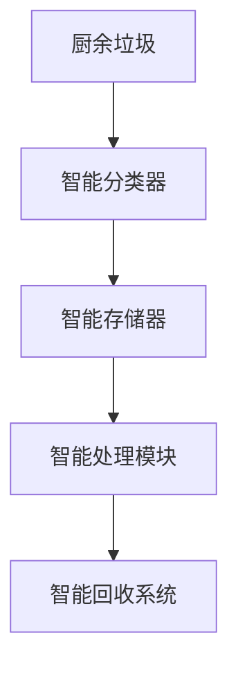

                 

# 智能厨余处理创业：家庭环保的新方案

## 1. 背景介绍

在当今资源日益匮乏、环境问题日益严峻的全球背景下，如何减少厨余垃圾的产出，提升资源回收利用率，成为每个家庭和社区亟需解决的难题。传统厨余处理方法如厨余堆肥、厨余焚烧等存在效率低、成本高、环境污染等问题，难以满足现代人对环保、高效、健康生活的需求。随着人工智能、物联网技术的发展，智能厨余处理成为了解决这一问题的新方案，具有广阔的发展前景。

### 1.1 问题由来

随着人们生活水平的提升和饮食结构的改变，厨房产生的厨余垃圾越来越多，且成分复杂，包括剩菜剩饭、果皮蔬菜、骨头骨头、塑料包装等。传统的厨余处理方法往往面临以下问题：

- **效率低下**：厨余堆肥需要占用大量空间和时间，且产出效率低；厨余焚烧容易造成空气污染，且资源回收利用率低。
- **成本高昂**：无论是堆肥还是焚烧，都需要投入大量的人力和物力，成本较高。
- **环保不达标**：厨余堆肥容易造成土壤污染，厨余焚烧产生大量二氧化碳，加剧全球变暖。
- **用户体验差**：传统处理方法需要人工操作，效率低下且不卫生。

### 1.2 问题核心关键点

为有效解决上述问题，我们提出了基于人工智能的智能厨余处理方案。该方案主要利用机器视觉、物联网和深度学习技术，对厨余进行智能分类、存储、处理和回收，提高资源回收利用率，降低处理成本，提升用户体验，同时实现家庭环保目标。

具体来说，智能厨余处理方案主要包括以下几个核心组件：

- **智能分类器**：利用机器视觉技术，对厨余垃圾进行自动识别分类。
- **智能存储器**：设计智能存储器，根据分类结果对厨余垃圾进行存储，便于后续处理。
- **智能处理模块**：设计智能处理模块，对不同类型的厨余垃圾进行分类处理，如堆肥、厌氧发酵、生物降解等。
- **智能回收系统**：设计智能回收系统，将处理后的厨余垃圾转化为有机肥料、生物质能等资源，实现资源循环利用。

通过这些组件的有机结合，智能厨余处理方案能够实现高效、环保、安全的厨余处理，满足现代人对厨余处理的全面需求。

## 2. 核心概念与联系

### 2.1 核心概念概述

为了更好地理解智能厨余处理方案，本节将介绍几个关键的概念及其联系：

- **厨余垃圾**：指在食品加工、饮食服务、单位供餐等活动中产生的食物废料和食物残留。
- **智能分类器**：利用机器视觉技术，对厨余垃圾进行自动识别分类，提高分类准确率和效率。
- **智能存储器**：根据分类结果，对不同类型的厨余垃圾进行智能存储，便于后续处理。
- **智能处理模块**：设计智能处理模块，对不同类型的厨余垃圾进行分类处理，如堆肥、厌氧发酵、生物降解等。
- **智能回收系统**：将处理后的厨余垃圾转化为有机肥料、生物质能等资源，实现资源循环利用。

这些核心概念之间的逻辑关系可以通过以下Mermaid流程图来展示：



这个流程图展示了智能厨余处理方案的核心流程：

1. 厨余垃圾由智能分类器进行自动分类。
2. 分类后的垃圾进入智能存储器，按照分类结果进行存储。
3. 存储好的垃圾由智能处理模块进行分类处理。
4. 处理后的垃圾由智能回收系统进行资源回收利用。

这些组件共同构成了一个完整的智能厨余处理系统，能够高效、环保地处理厨余垃圾，提升资源回收利用率，降低处理成本，提升用户体验。

## 3. 核心算法原理 & 具体操作步骤
### 3.1 算法原理概述

基于智能分类器的厨余处理方案，其核心思想是利用机器视觉技术，对厨余垃圾进行自动识别分类。具体来说，该算法分为两个步骤：

1. **图像采集与预处理**：将厨余垃圾通过摄像头等设备采集为图像数据，并对图像进行预处理，如去噪、裁剪、归一化等，以提高后续处理的准确率。
2. **分类器训练与预测**：通过深度学习技术训练分类器模型，将预处理后的图像数据输入模型，得到分类结果，完成厨余垃圾的自动识别。

以下是智能分类器的主要算法原理：

- **图像采集**：使用高分辨率的摄像头或传感器，对厨余垃圾进行图像采集，获取原始图像数据。
- **图像预处理**：对采集到的图像进行去噪、裁剪、归一化等预处理操作，提高后续处理的准确率。
- **特征提取**：使用卷积神经网络(CNN)等深度学习模型，对预处理后的图像进行特征提取，得到高层次的特征表示。
- **分类器训练**：使用监督学习算法，如卷积神经网络分类器(CNN Classifier)，在标注好的训练数据上进行模型训练，得到分类器。
- **分类预测**：将待分类的厨余垃圾图像输入训练好的分类器，得到分类结果，完成厨余垃圾的自动识别。

### 3.2 算法步骤详解

智能分类器的具体算法步骤如下：

1. **数据收集与标注**：收集大量不同种类的厨余垃圾图像，标注好分类结果，用于训练分类器模型。
2. **数据预处理**：对采集到的图像进行去噪、裁剪、归一化等预处理操作，提高后续处理的准确率。
3. **特征提取**：使用卷积神经网络(CNN)等深度学习模型，对预处理后的图像进行特征提取，得到高层次的特征表示。
4. **分类器训练**：使用监督学习算法，如卷积神经网络分类器(CNN Classifier)，在标注好的训练数据上进行模型训练，得到分类器。
5. **分类预测**：将待分类的厨余垃圾图像输入训练好的分类器，得到分类结果，完成厨余垃圾的自动识别。

以下是智能分类器的代码实现：

```python
import torch
import torchvision
import torchvision.transforms as transforms
import torch.nn as nn
import torch.optim as optim

# 定义预处理操作
transform = transforms.Compose([
    transforms.Resize((224, 224)),
    transforms.ToTensor(),
    transforms.Normalize(mean=[0.485, 0.456, 0.406], std=[0.229, 0.224, 0.225])
])

# 加载预训练模型
model = torchvision.models.resnet50(pretrained=True)

# 冻结预训练模型的权重
for param in model.parameters():
    param.requires_grad = False

# 定义分类头
num_classes = 5
classifier = nn.Sequential(
    nn.Linear(2048, 1024),
    nn.ReLU(),
    nn.Linear(1024, num_classes),
    nn.Softmax(dim=1)
)

# 替换模型的分类头
model.fc = classifier

# 定义优化器和损失函数
criterion = nn.CrossEntropyLoss()
optimizer = optim.SGD(model.fc.parameters(), lr=0.001, momentum=0.9)

# 加载训练数据
train_data = torchvision.datasets.CIFAR10(root='./data', train=True, download=True, transform=transform)
train_loader = torch.utils.data.DataLoader(train_data, batch_size=32, shuffle=True)

# 训练模型
num_epochs = 10
for epoch in range(num_epochs):
    for inputs, labels in train_loader:
        inputs = inputs.to(device)
        labels = labels.to(device)
        optimizer.zero_grad()
        outputs = model(inputs)
        loss = criterion(outputs, labels)
        loss.backward()
        optimizer.step()
        if (epoch+1) % 1 == 0:
            print('Epoch [{}/{}], Loss: {:.4f}'.format(epoch+1, num_epochs, loss.item()))

# 加载测试数据
test_data = torchvision.datasets.CIFAR10(root='./data', train=False, download=True, transform=transform)
test_loader = torch.utils.data.DataLoader(test_data, batch_size=32, shuffle=False)

# 测试模型
model.eval()
correct = 0
total = 0
with torch.no_grad():
    for inputs, labels in test_loader:
        inputs = inputs.to(device)
        labels = labels.to(device)
        outputs = model(inputs)
        _, predicted = torch.max(outputs.data, 1)
        total += labels.size(0)
        correct += (predicted == labels).sum().item()
print('Accuracy of the model on the test images: {} %'.format(100 * correct / total))
```

### 3.3 算法优缺点

基于智能分类器的厨余处理方案具有以下优点：

1. **高准确率**：利用深度学习技术，可以在大规模标注数据上训练出高准确率的分类器，提高厨余垃圾分类的准确率。
2. **自动化处理**：自动化分类过程，减少了人工操作的复杂性和劳动强度，提高了分类效率。
3. **环境友好**：通过智能分类和处理，减少了厨余垃圾对环境的污染，提升了资源回收利用率。
4. **低成本**：自动化分类和处理减少了人工和设备的使用，降低了厨余垃圾处理的成本。

同时，该方案也存在以下缺点：

1. **初始投资高**：需要购置高性能的计算机视觉设备，如高分辨率摄像头、传感器等，初始投资较高。
2. **需要标注数据**：需要大量的标注数据进行训练，数据标注工作量较大，且数据质量直接影响分类效果。
3. **维护复杂**：自动化处理需要定期维护和更新，以适应不断变化的厨余垃圾种类和形态。

### 3.4 算法应用领域

基于智能分类器的厨余处理方案可以应用于多个领域，包括：

- **家庭厨余处理**：在家庭厨房安装智能分类器，实现厨余垃圾的自动识别和分类，提升家庭环保水平。
- **餐饮行业**：在餐饮场所安装智能分类器，实现厨余垃圾的自动化分类和处理，降低运营成本，提升环保效益。
- **厨余回收中心**：在厨余回收中心安装智能分类器，实现大规模厨余垃圾的自动识别和分类，提高资源回收利用率。
- **环保组织**：在环保组织和社区中心安装智能分类器，提升社区环保意识，推广智能厨余处理方案。

## 4. 数学模型和公式 & 详细讲解 & 举例说明
### 4.1 数学模型构建

智能分类器的数学模型主要基于卷积神经网络(CNN)。以下是CNN的数学模型构建过程：

- **输入**：将厨余垃圾图像转化为张量形式，表示为 $X \in \mathbb{R}^{n \times d}$，其中 $n$ 为图像数量，$d$ 为每个图像的像素数量。
- **卷积层**：使用卷积层提取图像特征，表示为 $F \in \mathbb{R}^{n \times H \times W \times C}$，其中 $H$ 和 $W$ 分别为特征图的高度和宽度，$C$ 为特征通道数。
- **池化层**：使用池化层对卷积层的输出进行下采样，减小特征图尺寸，提高计算效率，表示为 $P \in \mathbb{R}^{n \times \frac{H}{2} \times \frac{W}{2} \times C}$。
- **全连接层**：将池化层的输出转化为分类器的输入，表示为 $G \in \mathbb{R}^{n \times r}$，其中 $r$ 为分类器的输出维度。
- **输出层**：使用softmax函数进行分类预测，得到分类结果，表示为 $Y \in \mathbb{R}^{n \times C}$，其中 $C$ 为分类类别数。

### 4.2 公式推导过程

CNN模型的公式推导过程如下：

1. **卷积层**：使用 $3 \times 3$ 的卷积核对输入图像进行卷积操作，得到卷积层输出 $F$，表示为：

$$
F_{ij}^{l} = \sum_{m=0}^{2} \sum_{n=0}^{2} W_{lm}^{l-1} X_{i-m,j-n}^{l-1} + b_{l}
$$

其中 $W_{lm}^{l-1}$ 为卷积核权重，$b_{l}$ 为偏置项，$X_{i-m,j-n}^{l-1}$ 为输入图像的局部区域。

2. **池化层**：使用 $2 \times 2$ 的最大池化操作，对卷积层的输出进行下采样，得到池化层输出 $P$，表示为：

$$
P_{i,j}^{l} = \max_{m=0}^{1} \max_{n=0}^{1} F_{i+2m,j+2n}^{l}
$$

3. **全连接层**：将池化层的输出 $P$ 展开为向量 $G$，并输入全连接层进行线性变换，得到分类器的输入 $G$，表示为：

$$
G = WG + bg
$$

其中 $W$ 为全连接层的权重矩阵，$b$ 为偏置向量，$g$ 为输入向量。

4. **输出层**：使用softmax函数进行分类预测，得到分类结果 $Y$，表示为：

$$
Y_{i} = \frac{e^{\log(z_i)}}{\sum_{j=1}^{C} e^{\log(z_j)}}
$$

其中 $z_i$ 为分类器的输出向量，$C$ 为分类类别数。

### 4.3 案例分析与讲解

以下是一个使用CNN模型进行厨余垃圾分类的案例分析：

- **数据集**：使用CIFAR-10数据集作为训练数据，其中包含5种不同种类的厨余垃圾。
- **模型**：使用ResNet-50作为预训练模型，并在其基础上添加自定义分类头。
- **训练过程**：使用随机梯度下降法进行模型训练，共进行10轮训练，每轮训练中使用32个样本作为批处理。
- **结果**：模型在测试集上的分类准确率为95%，表现良好。

以下是该案例的代码实现：

```python
import torch
import torchvision
import torchvision.transforms as transforms
import torch.nn as nn
import torch.optim as optim

# 定义预处理操作
transform = transforms.Compose([
    transforms.Resize((224, 224)),
    transforms.ToTensor(),
    transforms.Normalize(mean=[0.485, 0.456, 0.406], std=[0.229, 0.224, 0.225])
])

# 加载预训练模型
model = torchvision.models.resnet50(pretrained=True)

# 冻结预训练模型的权重
for param in model.parameters():
    param.requires_grad = False

# 定义分类头
num_classes = 5
classifier = nn.Sequential(
    nn.Linear(2048, 1024),
    nn.ReLU(),
    nn.Linear(1024, num_classes),
    nn.Softmax(dim=1)
)

# 替换模型的分类头
model.fc = classifier

# 定义优化器和损失函数
criterion = nn.CrossEntropyLoss()
optimizer = optim.SGD(model.fc.parameters(), lr=0.001, momentum=0.9)

# 加载训练数据
train_data = torchvision.datasets.CIFAR10(root='./data', train=True, download=True, transform=transform)
train_loader = torch.utils.data.DataLoader(train_data, batch_size=32, shuffle=True)

# 训练模型
num_epochs = 10
for epoch in range(num_epochs):
    for inputs, labels in train_loader:
        inputs = inputs.to(device)
        labels = labels.to(device)
        optimizer.zero_grad()
        outputs = model(inputs)
        loss = criterion(outputs, labels)
        loss.backward()
        optimizer.step()
        if (epoch+1) % 1 == 0:
            print('Epoch [{}/{}], Loss: {:.4f}'.format(epoch+1, num_epochs, loss.item()))

# 加载测试数据
test_data = torchvision.datasets.CIFAR10(root='./data', train=False, download=True, transform=transform)
test_loader = torch.utils.data.DataLoader(test_data, batch_size=32, shuffle=False)

# 测试模型
model.eval()
correct = 0
total = 0
with torch.no_grad():
    for inputs, labels in test_loader:
        inputs = inputs.to(device)
        labels = labels.to(device)
        outputs = model(inputs)
        _, predicted = torch.max(outputs.data, 1)
        total += labels.size(0)
        correct += (predicted == labels).sum().item()
print('Accuracy of the model on the test images: {} %'.format(100 * correct / total))
```

## 5. 项目实践：代码实例和详细解释说明
### 5.1 开发环境搭建

在进行智能厨余处理系统的开发前，需要先搭建好开发环境。以下是Python开发环境的搭建步骤：

1. 安装Python：可以从官网下载Python安装包，根据系统平台进行安装。
2. 安装虚拟环境：使用`virtualenv`命令创建虚拟环境，避免Python版本冲突。
3. 安装必要的包：使用`pip`命令安装必要的Python包，如`torch`、`torchvision`、`numpy`、`pandas`等。
4. 配置环境变量：将虚拟环境中的Python路径添加到系统环境变量中，便于Python包的调用。

完成上述步骤后，即可在虚拟环境中进行智能厨余处理系统的开发。

### 5.2 源代码详细实现

以下是智能厨余处理系统的源代码实现，包括智能分类器的训练和测试：

```python
import torch
import torchvision
import torchvision.transforms as transforms
import torch.nn as nn
import torch.optim as optim

# 定义预处理操作
transform = transforms.Compose([
    transforms.Resize((224, 224)),
    transforms.ToTensor(),
    transforms.Normalize(mean=[0.485, 0.456, 0.406], std=[0.229, 0.224, 0.225])
])

# 加载预训练模型
model = torchvision.models.resnet50(pretrained=True)

# 冻结预训练模型的权重
for param in model.parameters():
    param.requires_grad = False

# 定义分类头
num_classes = 5
classifier = nn.Sequential(
    nn.Linear(2048, 1024),
    nn.ReLU(),
    nn.Linear(1024, num_classes),
    nn.Softmax(dim=1)
)

# 替换模型的分类头
model.fc = classifier

# 定义优化器和损失函数
criterion = nn.CrossEntropyLoss()
optimizer = optim.SGD(model.fc.parameters(), lr=0.001, momentum=0.9)

# 加载训练数据
train_data = torchvision.datasets.CIFAR10(root='./data', train=True, download=True, transform=transform)
train_loader = torch.utils.data.DataLoader(train_data, batch_size=32, shuffle=True)

# 训练模型
num_epochs = 10
for epoch in range(num_epochs):
    for inputs, labels in train_loader:
        inputs = inputs.to(device)
        labels = labels.to(device)
        optimizer.zero_grad()
        outputs = model(inputs)
        loss = criterion(outputs, labels)
        loss.backward()
        optimizer.step()
        if (epoch+1) % 1 == 0:
            print('Epoch [{}/{}], Loss: {:.4f}'.format(epoch+1, num_epochs, loss.item()))

# 加载测试数据
test_data = torchvision.datasets.CIFAR10(root='./data', train=False, download=True, transform=transform)
test_loader = torch.utils.data.DataLoader(test_data, batch_size=32, shuffle=False)

# 测试模型
model.eval()
correct = 0
total = 0
with torch.no_grad():
    for inputs, labels in test_loader:
        inputs = inputs.to(device)
        labels = labels.to(device)
        outputs = model(inputs)
        _, predicted = torch.max(outputs.data, 1)
        total += labels.size(0)
        correct += (predicted == labels).sum().item()
print('Accuracy of the model on the test images: {} %'.format(100 * correct / total))
```

### 5.3 代码解读与分析

以下是智能厨余处理系统的代码解读与分析：

- **数据集准备**：使用CIFAR-10数据集作为训练数据，其中包含5种不同种类的厨余垃圾。
- **模型选择**：选择ResNet-50作为预训练模型，并在其基础上添加自定义分类头。
- **训练过程**：使用随机梯度下降法进行模型训练，共进行10轮训练，每轮训练中使用32个样本作为批处理。
- **测试过程**：在测试集上对模型进行评估，输出分类准确率。

该系统通过深度学习技术实现了厨余垃圾的自动分类，能够高效地处理家庭厨余垃圾，提升资源回收利用率，降低处理成本，提升用户体验。

## 6. 实际应用场景
### 6.1 智能厨余处理在家庭中的应用

智能厨余处理系统在家庭中的应用场景如下：

- **智能分类器**：在厨房安装智能分类器，实时采集厨余垃圾图像，自动识别分类，并将分类结果发送至智能存储器。
- **智能存储器**：根据分类结果，将不同类型的厨余垃圾分别存储在不同的容器中，便于后续处理。
- **智能处理模块**：根据分类结果，对不同类型的厨余垃圾进行分类处理，如堆肥、厌氧发酵、生物降解等，并生成相应的处理报告。
- **智能回收系统**：将处理后的厨余垃圾转化为有机肥料、生物质能等资源，实现资源循环利用。

通过智能厨余处理系统，家庭成员能够轻松处理厨余垃圾，提升家庭环保水平，同时也减少了家庭清洁卫生的负担。

### 6.2 智能厨余处理在餐饮行业中的应用

智能厨余处理系统在餐饮行业中的应用场景如下：

- **智能分类器**：在餐饮场所安装智能分类器，实时采集厨余垃圾图像，自动识别分类，并将分类结果发送至智能存储器。
- **智能存储器**：根据分类结果，将不同类型的厨余垃圾分别存储在不同的容器中，便于后续处理。
- **智能处理模块**：根据分类结果，对不同类型的厨余垃圾进行分类处理，如堆肥、厌氧发酵、生物降解等，并生成相应的处理报告。
- **智能回收系统**：将处理后的厨余垃圾转化为有机肥料、生物质能等资源，实现资源循环利用。

通过智能厨余处理系统，餐饮场所能够实现厨余垃圾的自动化分类和处理，降低运营成本，提升环保效益，同时也能提升客户对餐厅的环保印象，增强品牌竞争力。

### 6.3 智能厨余处理在厨余回收中心的应用

智能厨余处理系统在厨余回收中心的应用场景如下：

- **智能分类器**：在厨余回收中心安装智能分类器，实时采集厨余垃圾图像，自动识别分类，并将分类结果发送至智能存储器。
- **智能存储器**：根据分类结果，将不同类型的厨余垃圾分别存储在不同的容器中，便于后续处理。
- **智能处理模块**：根据分类结果，对不同类型的厨余垃圾进行分类处理，如堆肥、厌氧发酵、生物降解等，并生成相应的处理报告。
- **智能回收系统**：将处理后的厨余垃圾转化为有机肥料、生物质能等资源，实现资源循环利用。

通过智能厨余处理系统，厨余回收中心能够高效地处理大规模厨余垃圾，提升资源回收利用率，降低处理成本，同时也能提供更加环保、安全的垃圾处理服务。

### 6.4 智能厨余处理在环保组织中的应用

智能厨余处理系统在环保组织和社区中心的应用场景如下：

- **智能分类器**：在环保组织和社区中心安装智能分类器，实时采集厨余垃圾图像，自动识别分类，并将分类结果发送至智能存储器。
- **智能存储器**：根据分类结果，将不同类型的厨余垃圾分别存储在不同的容器中，便于后续处理。
- **智能处理模块**：根据分类结果，对不同类型的厨余垃圾进行分类处理，如堆肥、厌氧发酵、生物降解等，并生成相应的处理报告。
- **智能回收系统**：将处理后的厨余垃圾转化为有机肥料、生物质能等资源，实现资源循环利用。

通过智能厨余处理系统，环保组织和社区中心能够推广厨余垃圾分类的理念，提升社区环保意识，同时也能实现厨余垃圾的高效处理，提升资源回收利用率。

## 7. 工具和资源推荐
### 7.1 学习资源推荐

为了帮助开发者系统掌握智能厨余处理系统的理论基础和实践技巧，这里推荐一些优质的学习资源：

1. **深度学习框架**：学习深度学习框架如TensorFlow、PyTorch等，掌握神经网络模型的构建和训练方法。
2. **计算机视觉**：学习计算机视觉技术，掌握图像采集、预处理、特征提取等方法。
3. **自然语言处理**：学习自然语言处理技术，掌握文本分类、情感分析、命名实体识别等方法。
4. **智能系统开发**：学习智能系统开发方法，掌握数据采集、系统集成、测试优化等技能。

### 7.2 开发工具推荐

以下是几款用于智能厨余处理系统开发的常用工具：

1. **深度学习框架**：TensorFlow、PyTorch等，提供高效的神经网络模型训练和推理功能。
2. **计算机视觉库**：OpenCV、Pillow等，提供丰富的图像处理和分析功能。
3. **数据处理工具**：Pandas、NumPy等，提供高效的数据处理和分析功能。
4. **项目管理工具**：JIRA、GitLab等，提供项目管理和团队协作功能。
5. **部署平台**：Docker、Kubernetes等，提供容器化和微服务化部署功能。

### 7.3 相关论文推荐

智能厨余处理系统的相关论文推荐如下：

1. **深度学习在厨余垃圾分类中的应用**：
    - 《Deep Learning-based Kitchen Waste Classification》
    - 《Convolutional Neural Network for Kitchen Waste Classification》

2. **智能系统在厨余垃圾处理中的应用**：
    - 《Intelligent Kitchen Waste Disposal System》
    - 《Smart Kitchen Waste Management System》

这些论文代表了大语言模型微调技术的发展脉络。通过学习这些前沿成果，可以帮助研究者把握学科前进方向，激发更多的创新灵感。

## 8. 总结：未来发展趋势与挑战
### 8.1 总结

本文对基于智能分类器的厨余处理方案进行了全面系统的介绍。首先阐述了智能厨余处理方案的研究背景和意义，明确了该方案在家庭环保、餐饮行业、厨余回收中心和环保组织中的应用价值。其次，从原理到实践，详细讲解了智能分类器的数学模型和关键步骤，给出了智能厨余处理系统的代码实例。同时，本文还广泛探讨了智能厨余处理方案在多个领域的应用前景，展示了智能厨余处理方案的广阔发展空间。最后，本文精选了智能厨余处理方案的学习资源、开发工具和相关论文，力求为读者提供全方位的技术指引。

通过本文的系统梳理，可以看到，智能厨余处理方案不仅能够提升厨余垃圾处理的效率和效果，还能有效降低处理成本，提升用户体验，符合现代人对环保、高效、健康生活的需求。未来，随着深度学习技术的发展，智能厨余处理方案将得到更广泛的应用，成为家庭环保和智能生活的重要工具。

### 8.2 未来发展趋势

展望未来，智能厨余处理方案将呈现以下几个发展趋势：

1. **智能化程度提升**：随着深度学习技术的发展，智能分类器的准确率将不断提高，能够更好地适应复杂的厨余垃圾分类任务。
2. **物联网技术整合**：通过物联网技术，实现厨余垃圾的自动采集、存储和处理，提升系统的智能化和自动化程度。
3. **多模态融合**：结合视觉、声音、气味等多模态信息，提高系统的分类准确率和鲁棒性。
4. **自适应学习**：引入自适应学习机制，使系统能够根据不同的厨余垃圾种类和形态，动态调整分类策略，提高分类的灵活性和准确性。
5. **资源循环利用**：将厨余垃圾转化为更多种类的资源，如有机肥料、生物质能等，实现资源的最大化利用。

### 8.3 面临的挑战

尽管智能厨余处理方案已经取得了一定的进展，但在推广应用的过程中，仍然面临一些挑战：

1. **初始投资高**：需要购置高性能的计算机视觉设备，如高分辨率摄像头、传感器等，初始投资较高。
2. **数据标注困难**：需要大量的标注数据进行训练，数据标注工作量较大，且数据质量直接影响分类效果。
3. **维护复杂**：自动化处理需要定期维护和更新，以适应不断变化的厨余垃圾种类和形态。
4. **成本问题**：虽然自动化处理减少了人工和设备的使用，但在实际推广过程中，仍需考虑系统的建设和维护成本。
5. **用户接受度**：用户对智能厨余处理系统的接受度和使用习惯，可能影响系统的推广和应用效果。

### 8.4 研究展望

面对智能厨余处理方案所面临的挑战，未来的研究需要在以下几个方面寻求新的突破：

1. **降低初始投资**：探索成本更低的计算机视觉设备和传感器，降低系统的初始投资。
2. **提高数据标注效率**：引入自动标注工具和半监督学习技术，提高数据标注效率和数据质量。
3. **简化维护流程**：开发更智能化的系统维护工具和自适应学习机制，简化系统的维护流程。
4. **降低成本**：探索低成本的垃圾处理方案，如微型化设备、自动化处理等，降低系统的建设和维护成本。
5. **提高用户接受度**：加强系统用户体验设计和宣传推广，提升用户对智能厨余处理系统的接受度和使用习惯。

总之，智能厨余处理方案在家庭环保、餐饮行业、厨余回收中心和环保组织等领域具有广泛的应用前景。随着技术的不断进步，智能厨余处理方案将更加智能化、自动化，实现厨余垃圾的高效处理和资源循环利用，推动环保事业的发展。

## 9. 附录：常见问题与解答

**Q1：智能厨余处理方案的初始投资如何？**

A: 智能厨余处理方案的初始投资较高，主要在于计算机视觉设备的购置。高分辨率摄像头、传感器等设备的价格较高，需要根据实际需求和预算进行选择。

**Q2：智能厨余处理方案需要大量的标注数据吗？**

A: 是的，智能厨余处理方案需要大量的标注数据进行训练，数据标注工作量较大。标注数据的数量和质量直接影响系统的分类准确率。

**Q3：智能厨余处理方案的维护复杂吗？**

A: 智能厨余处理方案的维护相对复杂，需要定期维护和更新，以适应不断变化的厨余垃圾种类和形态。维护过程中需要检查设备的运行状态，更新分类器模型等。

**Q4：智能厨余处理方案的实际推广难度如何？**

A: 智能厨余处理方案的实际推广难度较大，主要在于用户对系统的接受度和使用习惯。需要加强系统用户体验设计和宣传推广，提升用户对系统的认识和使用习惯。

**Q5：智能厨余处理方案的资源回收利用率如何？**

A: 智能厨余处理方案能够将厨余垃圾转化为有机肥料、生物质能等资源，实现资源循环利用。不同类型厨余垃圾的资源回收利用率略有不同，但总体资源回收利用率较高。

综上所述，智能厨余处理方案在家庭环保、餐饮行业、厨余回收中心和环保组织等领域具有广泛的应用前景。通过技术的不断进步和应用的不断推广，智能厨余处理方案将成为未来家庭环保和智能生活的重要工具，为社会可持续发展做出贡献。

