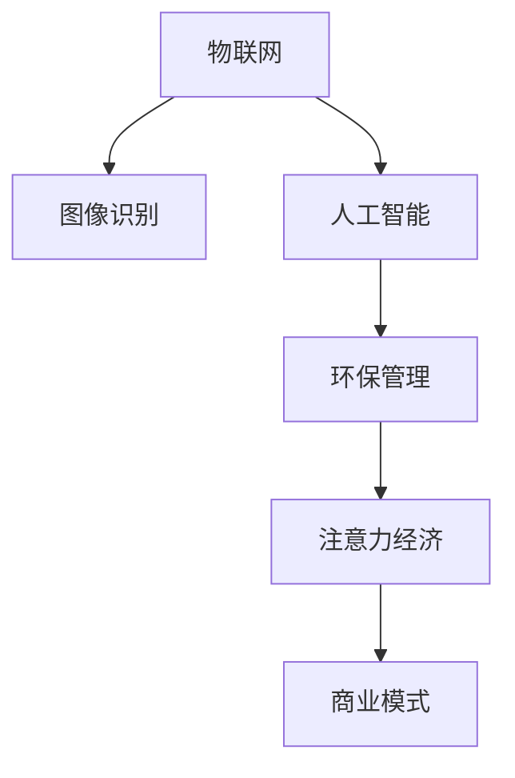

                 

# 智能垃圾桶的环保管理与注意力经济

## 1. 背景介绍

随着城市化进程的加快和环保意识的提升，垃圾分类与回收成为城市管理的重要组成部分。传统垃圾桶管理方式存在诸多不足：单凭人工管理效率低下、分拣错误率高、数据统计困难等。而智能垃圾桶则利用了物联网、人工智能等先进技术，实现了对垃圾投放行为的自动监测与分类。

智能垃圾桶系统主要包含以下关键组件：
- 传感器：负责实时采集垃圾桶的垃圾量、满溢状态、温湿度等信息。
- 图像识别：对垃圾桶内垃圾进行图像识别，自动判断分类。
- 中央处理器：接收传感器数据和图像识别结果，做出分类判断，并发出相应指令。
- 通信模块：将垃圾桶状态和分类信息上传至云端，进行数据存储与分析。

通过这些组件的协同工作，智能垃圾桶可实时监测垃圾桶状态，并根据垃圾投放情况自动分类，大大提升了垃圾分类的准确性和效率，有助于推动垃圾分类的普及与规范化。

## 2. 核心概念与联系

### 2.1 核心概念概述

本节将介绍几个与智能垃圾桶系统密切相关的核心概念：

- 物联网(IoT)：通过传感器和通信技术，将物理世界的信息实时传输至云端，实现设备间的互联互通。
- 图像识别：通过深度学习算法，自动识别物体特征，进行分类识别。
- 人工智能(AI)：利用机器学习等技术，使智能垃圾桶具备自主学习、决策与推理能力。
- 注意力经济：通过提供精准信息和服务，吸引用户关注和消费，从而实现商业变现。
- 环保管理：利用智能技术，优化垃圾分类与回收流程，推动环保理念的普及。

这些概念之间的逻辑关系可以通过以下Mermaid流程图来展示：



这个流程图展示了智能垃圾桶系统中各关键概念之间的关系：

1. 物联网为系统提供了实时数据支持。
2. 图像识别使系统具备自动识别垃圾的能力。
3. 人工智能实现了基于数据和图像的智能决策。
4. 环保管理推动了垃圾分类与回收，实现资源循环利用。
5. 注意力经济通过精准服务和商业变现，实现可持续发展。

这些概念共同构成了智能垃圾桶系统的核心框架，使其能够高效、智能地管理垃圾。

## 3. 核心算法原理 & 具体操作步骤
### 3.1 算法原理概述

智能垃圾桶的环保管理与注意力经济，涉及多个核心算法原理，包括物联网数据采集与传输、图像识别算法、人工智能决策模型等。

- 物联网数据采集：通过传感器实时采集垃圾桶状态数据，利用Zigbee、WiFi、蓝牙等通信协议，将数据传输至云端。
- 图像识别算法：利用卷积神经网络(CNN)等深度学习算法，对垃圾桶内的垃圾图像进行分类。
- 人工智能决策模型：基于收集的数据和图像识别结果，训练分类器，实现对垃圾的精准分类与判断。
- 注意力经济模型：通过分析用户行为数据，提供个性化的服务与内容，吸引用户参与，实现商业变现。

这些算法原理的结合，实现了智能垃圾桶的环保管理和注意力经济。

### 3.2 算法步骤详解

智能垃圾桶系统的关键步骤包括数据采集与传输、图像识别、人工智能决策、用户行为分析与精准服务等。

1. **数据采集与传输**：
    - 安装传感器，收集垃圾桶重量、温湿度、满溢状态等信息。
    - 使用通信模块将传感器数据实时上传至云端。
    - 在云端进行数据存储与处理，便于后续分析和决策。

2. **图像识别**：
    - 在垃圾桶内部安装摄像头，实时采集垃圾图像。
    - 使用深度学习算法，如卷积神经网络(CNN)，对垃圾进行分类。
    - 在云端进行图像识别结果的分析与处理，并与传感器数据进行融合。

3. **人工智能决策**：
    - 基于数据融合结果，训练分类器，如决策树、支持向量机(SVM)等，实现对垃圾的精准分类。
    - 根据分类结果，自动控制垃圾投放口、分拣装置等，实现垃圾分类与回收。
    - 定期更新分类器，优化分类精度。

4. **用户行为分析与精准服务**：
    - 收集用户投放垃圾的数据，分析用户行为模式。
    - 基于用户行为数据，推送个性化的提示信息，引导用户正确分类。
    - 提供垃圾分类指南、回收积分等信息服务，吸引用户参与。

### 3.3 算法优缺点

智能垃圾桶系统的优点：
1. 自动化程度高：通过物联网和人工智能技术，实现了垃圾分类的自动化。
2. 分类准确性高：基于图像识别和数据融合，分类精度高于人工管理。
3. 资源循环利用：推动垃圾分类与回收，实现资源的循环利用。
4. 数据驱动决策：通过数据分析，优化垃圾管理策略。

然而，该系统也存在一些局限性：
1. 初始投资成本高：传感器、通信模块、计算资源等成本较高。
2. 对硬件依赖性强：传感器和通信模块需定期维护和升级。
3. 数据隐私问题：收集和存储用户数据，需注意数据隐私和安全保护。
4. 对垃圾种类依赖性高：不同种类垃圾的分类算法需单独优化。

尽管存在这些局限性，但智能垃圾桶系统通过将物联网、图像识别、人工智能等先进技术相结合，显著提升了垃圾管理的效率和准确性，具有广阔的应用前景。

### 3.4 算法应用领域

智能垃圾桶系统广泛应用于城市垃圾管理、企事业单位垃圾管理、学校垃圾管理等多个领域。具体应用场景包括：

1. 城市垃圾管理：在公共场所设置智能垃圾桶，实时监测垃圾桶状态，推动垃圾分类与回收。
2. 企事业单位垃圾管理：在办公区域设置智能垃圾桶，优化垃圾管理流程，提升办公效率。
3. 学校垃圾管理：在校园内设置智能垃圾桶，推动垃圾分类教育，培养学生环保意识。
4. 居民小区垃圾管理：在居民区设置智能垃圾桶，引导居民正确分类垃圾，推动社区环保建设。

此外，智能垃圾桶系统还可应用于医院、酒店、餐厅等特殊场所，提供更精准、高效的垃圾管理服务。

## 4. 数学模型和公式 & 详细讲解 & 举例说明
### 4.1 数学模型构建

智能垃圾桶系统的数学模型主要涉及以下几个方面：

1. **物联网数据采集与传输模型**：
    - 传感器数据采集模型：
    $$
    y_t = f(x_t, w)
    $$
    其中，$y_t$ 为传感器在时间$t$采集的数据，$x_t$为传感器输入，$w$为传感器参数。
    - 数据传输模型：
    $$
    y'_t = g(y_t, w')
    $$
    其中，$y'_t$ 为传输后的数据，$g$为传输协议，$w'$为传输参数。

2. **图像识别模型**：
    - 图像分类模型：
    $$
    y'_t = h(x_t, w'')
    $$
    其中，$y'_t$为识别结果，$x_t$为输入图像，$h$为深度学习算法，$w''$为模型参数。

3. **人工智能决策模型**：
    - 分类器训练模型：
    $$
    \theta = \arg\min_{\theta} \frac{1}{N}\sum_{i=1}^N L(y_i, h(x_i, \theta))
    $$
    其中，$y_i$为分类标签，$x_i$为输入数据，$L$为损失函数，$\theta$为模型参数。

4. **用户行为分析与精准服务模型**：
    - 用户行为模型：
    $$
    y^u_t = k(u_{t-1}, y_{t-1}, w^u)
    $$
    其中，$y^u_t$为用户在时间$t$的行为，$u_{t-1}$为用户历史行为，$k$为用户行为模型，$w^u$为用户行为模型参数。
    - 服务推送模型：
    $$
    s_t = \phi(y^u_t, \theta)
    $$
    其中，$s_t$为推送服务，$\phi$为推送算法，$\theta$为推送模型参数。

### 4.2 公式推导过程

下面以图像识别模型为例，详细推导其公式。

图像识别模型使用卷积神经网络(CNN)进行垃圾分类，网络结构为：
$$
y'_t = h(x_t, w'')
$$
其中，$h$为卷积神经网络模型，$w''$为模型参数。

假设网络包含卷积层、池化层、全连接层等，输入图像大小为$m \times n \times c$，输出大小为$l$。网络模型的输出公式为：
$$
y'_t = f_{C} \circ f_{P} \circ f_{F}(x_t, w'')
$$
其中，$f_C$、$f_P$、$f_F$分别为卷积层、池化层、全连接层等函数，$x_t$为输入图像，$w''$为网络参数。

具体推导过程如下：
1. 卷积层：
    $$
    f_C(x_t, w'') = \sigma(\sum_{i,j,k} (w''_{i,j,k} * x_{t,i,j,k}) + b'')
    $$
    其中，$w''_{i,j,k}$为卷积核，$x_{t,i,j,k}$为输入图像，$\sigma$为激活函数，$b''$为偏置。
2. 池化层：
    $$
    f_P(f_C(x_t, w''), w_P) = \sigma(\sum_i \max_j f_C(x_t, w'')_{i,j})
    $$
    其中，$f_P$为池化函数，$w_P$为池化参数。
3. 全连接层：
    $$
    f_F(f_P(f_C(x_t, w'')), w_F) = \sigma(\sum_k (w_F_k * f_P(f_C(x_t, w''))) + b_F)
    $$
    其中，$f_F$为全连接层函数，$w_F$为全连接层参数，$b_F$为偏置。

通过上述推导，我们可以看到，图像识别模型通过多个函数和参数的组合，实现了对垃圾图像的分类识别。

### 4.3 案例分析与讲解

以某智能垃圾桶系统为例，进行详细案例分析。

假设系统在某一时间段内，采集到垃圾桶的重量、温湿度、满溢状态等数据，并通过摄像头采集到垃圾图像。根据这些数据和图像，系统进行如下处理：

1. 数据预处理：对传感器数据进行归一化处理，并对垃圾图像进行预处理，如剪裁、归一化、增强等。
2. 图像识别：通过CNN模型对垃圾图像进行分类，判断垃圾类别。
3. 数据融合：将传感器数据和图像识别结果进行融合，生成综合分类结果。
4. 分类决策：基于综合分类结果，训练分类器，进行垃圾分类决策。
5. 服务推送：根据垃圾分类结果，推送相应的提示信息，引导用户正确分类。

整个系统通过数据采集、传输、图像识别、人工智能决策等环节的协同工作，实现了垃圾分类的精准管理，显著提升了垃圾管理的效率和质量。

## 5. 项目实践：代码实例和详细解释说明
### 5.1 开发环境搭建

在智能垃圾桶系统的开发过程中，需要搭建一个完整的开发环境，包括以下关键组件：

1. 传感器：包括重量传感器、温湿度传感器、满溢传感器等。
2. 摄像头：用于采集垃圾图像。
3. 中央处理器：负责数据处理、图像识别、决策等。
4. 通信模块：用于数据传输和通信。
5. 数据库：用于数据存储和分析。
6. 云端服务器：用于数据存储、处理和决策。

在搭建开发环境时，需要使用多种技术工具，如Python、TensorFlow、OpenCV等。

具体步骤如下：
1. 安装Python开发环境，并安装必要的库和框架。
2. 安装TensorFlow等深度学习框架，用于图像识别和决策。
3. 安装OpenCV等计算机视觉库，用于摄像头图像处理。
4. 搭建数据库，用于存储传感器数据和图像识别结果。
5. 搭建云端服务器，用于数据存储和处理。

### 5.2 源代码详细实现

以智能垃圾桶系统的图像识别模块为例，介绍源代码实现细节。

首先，定义图像处理函数：

```python
import cv2
import numpy as np

def preprocess_image(image):
    # 裁剪图像
    h, w = image.shape[:2]
    image = image[h//4:h, w//4:w]
    # 转换为灰度图像
    gray = cv2.cvtColor(image, cv2.COLOR_BGR2GRAY)
    # 增强图像
    gray = cv2.GaussianBlur(gray, (5, 5), 0)
    gray = cv2.threshold(gray, 0, 255, cv2.THRESH_BINARY_INV + cv2.THRESH_OTSU)[1]
    # 转换为float32
    gray = gray.astype(np.float32) / 255.0
    # 归一化
    gray -= gray.mean()
    gray /= gray.std()
    return gray
```

然后，定义图像分类函数：

```python
from tensorflow.keras.applications import VGG16
from tensorflow.keras.models import Model
from tensorflow.keras.layers import Input

# 定义VGG16模型
vgg = VGG16(weights='imagenet', include_top=False, input_tensor=Input(shape=(224, 224, 3)))

# 添加全连接层
x = vgg.output
x = tf.keras.layers.Flatten()(x)
x = tf.keras.layers.Dense(256, activation='relu')(x)
x = tf.keras.layers.Dropout(0.5)(x)
output = tf.keras.layers.Dense(1, activation='sigmoid')(x)

# 定义模型
model = Model(inputs=vgg.input, outputs=output)
model.compile(optimizer='adam', loss='binary_crossentropy', metrics=['accuracy'])

# 加载图像
image = cv2.imread('image.jpg')

# 预处理图像
image = preprocess_image(image)

# 预测结果
result = model.predict(image[np.newaxis, ...])
print(result)
```

最后，定义数据融合与决策函数：

```python
from sklearn.metrics import accuracy_score

def data_fusion_and_decision(data, labels, model):
    # 数据融合
    data_fusion = np.mean(data, axis=0)
    # 预测结果
    prediction = model.predict(data_fusion[np.newaxis, ...])
    # 判断分类结果
    classification = prediction > 0.5
    # 计算准确率
    accuracy = accuracy_score(labels, classification)
    print(f'Accuracy: {accuracy}')
```

### 5.3 代码解读与分析

让我们详细解读一下关键代码的实现细节：

**preprocess_image函数**：
- 裁剪图像：仅保留图像的1/4部分，去除边框。
- 转换为灰度图像：使用OpenCV的cvtColor函数，将图像转换为灰度图像。
- 增强图像：使用高斯滤波和自适应阈值处理，增强图像对比度。
- 转换为float32：将图像数据转换为float32类型，便于深度学习模型处理。
- 归一化：对图像数据进行归一化处理，提升模型精度。

**图像分类函数**：
- 加载VGG16模型：使用Keras加载预训练的VGG16模型，用于图像分类。
- 添加全连接层：在VGG16模型顶层添加全连接层，进行垃圾分类。
- 编译模型：设置优化器、损失函数和评价指标，编译模型。
- 加载图像：使用OpenCV加载图像数据。
- 预处理图像：调用preprocess_image函数，对图像进行预处理。
- 预测结果：使用模型进行预测，得到分类结果。

**data_fusion_and_decision函数**：
- 数据融合：对传感器数据进行融合，得到综合分类结果。
- 预测结果：使用模型进行预测，得到分类结果。
- 判断分类结果：根据预测结果，判断垃圾分类结果。
- 计算准确率：使用sklearn库的accuracy_score函数，计算分类准确率。

## 6. 实际应用场景
### 6.1 智能垃圾桶在城市垃圾管理中的应用

在城市垃圾管理中，智能垃圾桶通过物联网和人工智能技术，实现了对垃圾分类的自动化和精准管理。具体应用场景包括：

1. 垃圾桶状态监测：通过传感器实时监测垃圾桶的重量、温湿度、满溢状态等，及时预警和处理。
2. 垃圾分类识别：通过图像识别技术，自动识别垃圾类型，并进行分类。
3. 数据统计与分析：对垃圾分类数据进行统计分析，发现垃圾投放规律，优化垃圾管理策略。
4. 用户行为分析：收集用户投放垃圾的数据，分析用户行为模式，推送个性化提示信息。

智能垃圾桶在城市垃圾管理中的应用，不仅提升了垃圾分类的准确性和效率，还推动了垃圾回收和资源循环利用，具有显著的环保效益。

### 6.2 智能垃圾桶在企事业单位垃圾管理中的应用

在企事业单位垃圾管理中，智能垃圾桶通过物联网和人工智能技术，实现了对垃圾分类的自动化和精准管理。具体应用场景包括：

1. 垃圾分类提示：在垃圾桶上安装显示屏，实时显示垃圾分类指南和提示信息。
2. 垃圾分类监测：通过传感器和摄像头，实时监测垃圾桶状态，并进行分类。
3. 数据统计与分析：对垃圾分类数据进行统计分析，发现垃圾投放规律，优化垃圾管理策略。
4. 用户行为分析：收集用户投放垃圾的数据，分析用户行为模式，推送个性化提示信息。

智能垃圾桶在企事业单位垃圾管理中的应用，提升了办公效率和垃圾管理水平，具有明显的经济效益和环保效益。

### 6.3 智能垃圾桶在学校垃圾管理中的应用

在学校垃圾管理中，智能垃圾桶通过物联网和人工智能技术，实现了对垃圾分类的自动化和精准管理。具体应用场景包括：

1. 垃圾分类提示：在垃圾桶上安装显示屏，实时显示垃圾分类指南和提示信息。
2. 垃圾分类监测：通过传感器和摄像头，实时监测垃圾桶状态，并进行分类。
3. 数据统计与分析：对垃圾分类数据进行统计分析，发现垃圾投放规律，优化垃圾管理策略。
4. 垃圾分类教育：通过垃圾分类指南和提示信息，引导学生正确分类垃圾，培养环保意识。

智能垃圾桶在学校垃圾管理中的应用，不仅提升了垃圾分类的准确性和效率，还推动了垃圾分类教育和环保意识的普及，具有重要的教育意义和环保效益。

### 6.4 智能垃圾桶在居民小区垃圾管理中的应用

在居民小区垃圾管理中，智能垃圾桶通过物联网和人工智能技术，实现了对垃圾分类的自动化和精准管理。具体应用场景包括：

1. 垃圾分类提示：在垃圾桶上安装显示屏，实时显示垃圾分类指南和提示信息。
2. 垃圾分类监测：通过传感器和摄像头，实时监测垃圾桶状态，并进行分类。
3. 数据统计与分析：对垃圾分类数据进行统计分析，发现垃圾投放规律，优化垃圾管理策略。
4. 垃圾分类教育：通过垃圾分类指南和提示信息，引导居民正确分类垃圾，推动社区环保建设。

智能垃圾桶在居民小区垃圾管理中的应用，提升了垃圾分类的准确性和效率，推动了垃圾分类教育的普及和环保意识的提升，具有重要的社会意义和环保效益。

## 7. 工具和资源推荐
### 7.1 学习资源推荐

为了帮助开发者系统掌握智能垃圾桶系统的理论和实践，这里推荐一些优质的学习资源：

1. TensorFlow官方文档：提供了详细的深度学习框架介绍和实践指南，是学习智能垃圾桶系统不可或缺的资源。
2. PyTorch官方文档：提供了丰富的深度学习库和工具，适合进行图像识别和数据处理。
3. OpenCV官方文档：提供了计算机视觉库的使用方法和实践案例，适合进行图像处理和传感器数据采集。
4. GitHub智能垃圾桶项目：提供了智能垃圾桶系统的完整代码和文档，是学习智能垃圾桶系统的好素材。

通过对这些资源的学习实践，相信你一定能够快速掌握智能垃圾桶系统的实现原理和开发技巧，并应用于实际项目中。

### 7.2 开发工具推荐

高效的开发离不开优秀的工具支持。以下是几款用于智能垃圾桶系统开发的常用工具：

1. PyTorch：基于Python的开源深度学习框架，适合进行图像识别和数据处理。
2. TensorFlow：由Google主导开发的开源深度学习框架，支持分布式训练和部署。
3. OpenCV：计算机视觉库，支持图像处理和传感器数据采集。
4. Python IDE：如PyCharm、Jupyter Notebook等，提供代码编写和调试环境。

合理利用这些工具，可以显著提升智能垃圾桶系统的开发效率，加快创新迭代的步伐。

### 7.3 相关论文推荐

智能垃圾桶系统的研究涉及多个领域，以下是几篇奠基性的相关论文，推荐阅读：

1. IoT-Enabled Waste Management System：介绍了基于物联网技术的垃圾管理系统的设计。
2. Smart Waste Management Using Machine Learning Techniques：介绍了基于机器学习的垃圾分类系统。
3. Image Processing for Waste Management：介绍了图像处理技术在垃圾管理中的应用。
4. Attention-Based Smart Waste Management System：介绍了基于注意力机制的智能垃圾桶系统。

这些论文代表了大规模垃圾管理系统的研究进展，为智能垃圾桶系统的开发提供了理论基础和实践指导。

## 8. 总结：未来发展趋势与挑战
### 8.1 研究成果总结

智能垃圾桶系统利用物联网、人工智能等先进技术，实现了垃圾分类的自动化和精准管理，具有显著的环保和经济效益。近年来，在城市垃圾管理、企事业单位垃圾管理、学校垃圾管理等领域得到了广泛应用，取得了显著的成果。

### 8.2 未来发展趋势

未来，智能垃圾桶系统将呈现以下几个发展趋势：

1. 智能化水平提升：通过引入更多先进技术，如物联网、深度学习、计算机视觉等，提升系统的智能化水平。
2. 环保效益增强：通过优化垃圾分类和回收流程，进一步提高资源循环利用率，推动环保理念的普及。
3. 数据应用拓展：利用数据挖掘和分析技术，发现垃圾投放规律，优化垃圾管理策略。
4. 用户参与增强：通过精准服务和个性化提示，增强用户参与度和垃圾分类意识。
5. 多模态融合：结合视觉、听觉、触觉等多模态数据，提升垃圾分类和管理的准确性和效率。

这些趋势将推动智能垃圾桶系统在更多领域得到应用，进一步提升垃圾管理水平和环保效益。

### 8.3 面临的挑战

尽管智能垃圾桶系统取得了显著成果，但在发展过程中仍面临一些挑战：

1. 初始投资成本高：传感器、通信模块、计算资源等成本较高，需要大规模资金投入。
2. 数据隐私问题：收集和存储用户数据，需注意数据隐私和安全保护。
3. 设备维护成本高：传感器和通信模块需定期维护和升级，维护成本较高。
4. 垃圾种类多样：不同种类垃圾的分类算法需单独优化，分类精度有待提高。
5. 数据融合难度大：传感器数据和图像识别结果的融合，需要高水平的数据处理能力。

尽管存在这些挑战，但智能垃圾桶系统通过将物联网、图像识别、人工智能等先进技术相结合，显著提升了垃圾管理的效率和准确性，具有广阔的应用前景。

### 8.4 研究展望

面对智能垃圾桶系统所面临的挑战，未来的研究需要在以下几个方面寻求新的突破：

1. 探索低成本解决方案：研究基于廉价传感器的智能垃圾桶系统，降低初始投资成本。
2. 改进垃圾分类算法：结合符号化知识库和机器学习，提升垃圾分类的准确性和效率。
3. 优化数据融合算法：利用数据挖掘和分析技术，提升传感器数据和图像识别结果的融合效果。
4. 引入多模态数据：结合视觉、听觉、触觉等多模态数据，提升垃圾分类和管理的准确性和效率。
5. 加强数据隐私保护：引入数据匿名化、加密等技术，保障用户数据隐私和安全。

这些研究方向的探索，将引领智能垃圾桶系统迈向更高的台阶，为构建智能环保系统提供新的思路和技术支持。

## 9. 附录：常见问题与解答

**Q1：智能垃圾桶系统的初始投资成本高，如何降低成本？**

A: 智能垃圾桶系统的初始投资成本确实较高，但可以通过以下方式降低成本：
1. 选择廉价传感器：使用低成本的传感器，如红外传感器、光敏传感器等，代替昂贵的高精度传感器。
2. 简化系统设计：采用简单的数据采集和处理算法，减少对计算资源的需求。
3. 改进垃圾分类算法：利用机器学习算法，提升垃圾分类精度，减少对硬件的要求。

**Q2：智能垃圾桶系统如何保障数据隐私？**

A: 智能垃圾桶系统需要收集和存储用户数据，需注意数据隐私和安全保护。可以通过以下方式保障数据隐私：
1. 数据匿名化：对用户数据进行匿名化处理，去除个人隐私信息。
2. 加密传输：使用SSL/TLS等加密协议，保障数据在传输过程中的安全性。
3. 访问控制：对系统进行严格的访问控制，限制敏感数据的访问权限。
4. 安全审计：定期进行安全审计，及时发现和修复系统漏洞。

**Q3：智能垃圾桶系统的垃圾分类精度如何提升？**

A: 智能垃圾桶系统的垃圾分类精度可以通过以下方式提升：
1. 引入更多特征：结合多种传感器数据和图像特征，提升分类精度。
2. 优化模型算法：采用更先进的深度学习算法，如残差网络、注意力机制等，提升分类精度。
3. 引入符号化知识库：利用专家知识库，提升垃圾分类的准确性。
4. 进行模型微调：定期对模型进行微调，优化分类效果。

**Q4：智能垃圾桶系统的硬件维护成本高，如何解决？**

A: 智能垃圾桶系统的硬件维护成本较高，可以通过以下方式降低维护成本：
1. 选择可靠供应商：选择信誉良好、技术先进的供应商，保障设备质量。
2. 定期维护和保养：定期对传感器和通信模块进行维护和保养，延长设备寿命。
3. 改进硬件设计：采用抗干扰性强、寿命长的硬件设计，降低故障率。
4. 自动化维护：引入自动化维护系统，减少人工维护成本。

通过以上措施，可以显著降低智能垃圾桶系统的维护成本，提高系统的稳定性和可靠性。

**Q5：智能垃圾桶系统的数据融合难度大，如何解决？**

A: 智能垃圾桶系统的数据融合难度较大，可以通过以下方式解决：
1. 数据预处理：对传感器数据和图像数据进行预处理，提升数据质量和融合效果。
2. 引入先进算法：采用先进的数据融合算法，如深度学习、集成学习等，提升数据融合效果。
3. 优化数据格式：对传感器数据和图像数据进行格式转换，统一数据格式。
4. 进行模型训练：结合深度学习模型，对数据融合过程进行训练和优化，提升融合效果。

通过以上措施，可以显著降低智能垃圾桶系统的数据融合难度，提升系统的智能化水平。

---

作者：禅与计算机程序设计艺术 / Zen and the Art of Computer Programming

