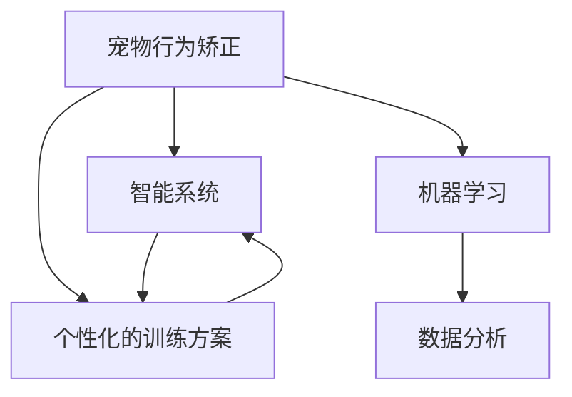

                 

# 智能宠物行为矫正创业：个性化的宠物训练方案

## 1. 背景介绍

### 1.1 问题由来
随着社会经济的发展，宠物已经成为人们生活中不可或缺的伙伴。然而，宠物行为矫正问题却一直是宠物主人和专业兽医的难题。宠物行为矫正不仅需要大量的时间、精力和资金投入，效果也难以量化和标准化。因此，对于宠物行为矫正的需求日益增长，亟需一种更为科学、高效、个性化的解决方案。

### 1.2 问题核心关键点
为了满足宠物主人和专业兽医的需求，本项目提出了一种基于智能系统的个性化宠物行为矫正方案。通过收集宠物行为数据，利用机器学习和大数据分析技术，制定个性化的训练计划和矫正方案。该方案将有助于提升宠物行为矫正的效率和效果，缩短训练时间，降低成本，实现精细化管理。

### 1.3 问题研究意义
本项目旨在通过技术手段，破解传统宠物行为矫正的痛点，为宠物主人和专业兽医提供一种更科学、高效、个性化的训练方案。该项目的研究和开发，将推动宠物行为矫正技术的产业化进程，促进宠物行业的发展，提升人们的生活质量。

## 2. 核心概念与联系

### 2.1 核心概念概述

为更好地理解个性化宠物行为矫正方案，本节将介绍几个密切相关的核心概念：

- 宠物行为矫正：通过各种方式对宠物的不良行为进行训练和矫正，如吠叫、啃咬、乱尿等。目的是培养宠物良好的行为习惯，提高宠物的社交能力，促进宠物与主人的互动关系。
- 智能系统：指利用传感器、摄像头、芯片等技术手段，自动收集和分析宠物行为数据，辅助制定训练计划的系统。
- 机器学习：指通过算法和模型，让计算机从数据中学习规律，并进行预测和决策的技术。
- 数据分析：指从原始数据中提取有用信息，并进行统计、可视化等分析过程。
- 个性化的训练方案：指根据宠物的品种、年龄、性格等特征，制定最适合的训练计划和矫正方案。

这些核心概念之间的逻辑关系可以通过以下Mermaid流程图来展示：



这个流程图展示了个性化宠物行为矫正方案的核心概念及其之间的关系：

1. 智能系统是整个方案的基础，通过传感器、摄像头等手段自动收集宠物行为数据。
2. 机器学习和大数据分析技术，从数据中提取规律，制定个性化的训练方案。
3. 个性化的训练方案，根据宠物特征和行为数据，指导具体训练过程。

这些核心概念共同构成了个性化宠物行为矫正方案的基础，使其能够精准、高效地对宠物行为进行矫正。

## 3. 核心算法原理 & 具体操作步骤

### 3.1 算法原理概述

个性化宠物行为矫正方案的核心算法原理主要包括以下几个步骤：

1. 数据收集：通过智能系统收集宠物行为数据，包括活动时间、睡眠时间、饮食情况、行为模式等。
2. 数据清洗：对收集到的数据进行去噪、归一化、筛选等处理，保证数据的质量。
3. 数据分析：利用机器学习和大数据分析技术，对数据进行分析，提取有用的特征，识别行为模式。
4. 行为预测：通过训练好的机器学习模型，对宠物的行为进行预测，判断是否存在不良行为。
5. 训练计划制定：根据行为预测结果，制定个性化的训练计划和矫正方案。
6. 训练实施：根据训练计划，利用智能系统对宠物进行训练和矫正。
7. 效果评估：通过行为数据和用户反馈，评估训练效果，调整训练计划。

### 3.2 算法步骤详解

#### 3.2.1 数据收集
数据收集是个性化宠物行为矫正方案的第一步，也是最关键的一步。通过智能系统收集的数据，可以为后续的分析、预测和训练提供基础。

智能系统的核心组件包括传感器、摄像头、芯片等设备。传感器可以记录宠物的活动时间、心率、步数等生理数据；摄像头可以监控宠物的行为，捕捉活动视频；芯片则可以实时采集宠物的位置信息，监测运动轨迹。这些设备通过物联网技术连接起来，形成一个数据采集网络，自动收集宠物的各项行为数据。

#### 3.2.2 数据清洗
数据清洗是指对收集到的原始数据进行去噪、归一化、筛选等处理，保证数据的质量和一致性。数据清洗的步骤如下：

1. 去噪：利用滤波算法和噪声消除技术，去除传感器数据中的噪音和异常值。
2. 归一化：对数据进行归一化处理，使其在统一的范围内，便于后续分析。
3. 筛选：根据数据的可信度和重要性，筛选出有价值的数据，去除无用和重复的数据。

数据清洗的目的是为了提高数据分析的准确性和可靠性，减少误差和偏差。

#### 3.2.3 数据分析
数据分析是指利用机器学习和大数据分析技术，对数据进行分析，提取有用的特征，识别行为模式。

数据分析的主要工具包括Python、R语言、TensorFlow等。常用的数据分析方法包括：

1. 特征提取：利用特征工程技术，从原始数据中提取有用的特征，如行为频率、活动时间分布、心率变化等。
2. 行为模式识别：利用机器学习算法，如K-means聚类、决策树、随机森林等，识别宠物的行为模式，如活动规律、睡眠习惯、饮食偏好等。
3. 关联规则分析：利用关联规则算法，如Apriori算法、FP-growth算法等，发现不同行为之间的关联性，如吃饭前后活动时间变化等。

数据分析的目的是为了从数据中提取规律，为行为预测和训练计划制定提供依据。

#### 3.2.4 行为预测
行为预测是指通过训练好的机器学习模型，对宠物的行为进行预测，判断是否存在不良行为。

常用的行为预测方法包括：

1. 分类算法：利用分类算法，如支持向量机、朴素贝叶斯、随机森林等，对宠物的行为进行分类，如是否吠叫、是否啃咬等。
2. 回归算法：利用回归算法，如线性回归、岭回归、弹性网等，对宠物的行为进行预测，如活动时间分布、心率变化等。
3. 深度学习算法：利用深度学习算法，如卷积神经网络、循环神经网络等，对宠物的行为进行更精准的预测。

行为预测的目的是为了及时发现和干预不良行为，提高训练效果。

#### 3.2.5 训练计划制定
训练计划制定是指根据行为预测结果，制定个性化的训练计划和矫正方案。

训练计划的主要内容包括：

1. 训练时间：根据宠物的活动规律和行为模式，制定训练的时间表，如早上、下午、晚上等时间段。
2. 训练内容：根据宠物的不良行为，制定具体的训练内容，如口令训练、行为纠正等。
3. 训练方式：根据宠物的性格和年龄，制定训练的方式，如正面激励、负反馈等。
4. 训练频率：根据宠物的训练效果，制定训练的频率，如每日、每周、每两周等。

训练计划的制定需要考虑宠物的个体差异和行为特征，制定最合适的训练方案。

#### 3.2.6 训练实施
训练实施是指根据训练计划，利用智能系统对宠物进行训练和矫正。

训练实施的主要方式包括：

1. 智能系统：通过智能系统自动执行训练计划，如通过摄像头监控宠物行为，利用传感器记录训练效果。
2. 人工干预：根据智能系统的反馈，及时进行人工干预，如纠正错误行为、奖励良好行为等。
3. 数据记录：记录每次训练的效果和反馈，为后续分析和评估提供数据支持。

训练实施的目的是为了保证训练计划的执行，提高训练效果。

#### 3.2.7 效果评估
效果评估是指通过行为数据和用户反馈，评估训练效果，调整训练计划。

效果评估的主要方式包括：

1. 行为数据：通过智能系统收集的行为数据，评估训练效果，如行为频率变化、活动时间分布等。
2. 用户反馈：通过问卷调查、反馈系统等方式，收集用户的反馈意见，评估训练效果。
3. 综合评估：综合行为数据和用户反馈，评估训练效果，调整训练计划。

效果评估的目的是为了不断优化训练计划，提高训练效果，确保训练方案的科学性和可行性。

### 3.3 算法优缺点

个性化宠物行为矫正方案具有以下优点：

1. 高效精准：通过智能系统和机器学习技术，自动收集和分析数据，制定个性化的训练方案，提高了训练的效率和精准度。
2. 科学合理：利用大数据分析和行为预测，制定科学的训练计划，避免了传统训练方法的随意性和主观性。
3. 个性化定制：根据宠物的品种、年龄、性格等特征，制定最适合的训练计划，提高了训练效果和宠物的满意度。
4. 成本较低：相比于传统训练方法，智能系统的使用成本相对较低，训练时间和成本显著降低。

然而，该方案也存在一定的局限性：

1. 技术门槛较高：需要有一定的技术背景和数据分析能力，对用户和宠物主人有一定的要求。
2. 数据依赖性强：方案的科学性和准确性依赖于数据的质量和数量，数据收集的难度较大。
3. 设备要求较高：智能系统需要一定的硬件设备支持，设备成本和维护成本较高。
4. 数据隐私问题：智能系统的数据收集和使用，需要严格遵守数据隐私和保护规定，避免隐私泄露。

尽管存在这些局限性，但个性化宠物行为矫正方案仍具有广阔的应用前景，尤其是在高端宠物市场和专业宠物培训领域。

### 3.4 算法应用领域

个性化宠物行为矫正方案已经在多个领域得到了应用，取得了显著的效果：

1. 宠物训练馆：通过智能系统收集数据，利用机器学习技术，制定个性化的训练方案，提高训练效果和效率。
2. 宠物医院：利用智能系统和数据分析技术，识别宠物的不良行为，制定科学的训练计划，辅助治疗和矫正。
3. 宠物主人：通过智能设备和移动应用，实时监测宠物行为，制定个性化的训练计划，提高宠物的社交能力和行为习惯。
4. 宠物电商：利用数据分析技术，预测宠物的喜好和行为，推荐适合的产品和服务，提高用户体验和销售额。
5. 宠物研究：利用大数据分析技术，研究宠物的行为模式和心理特征，为宠物行为矫正和科学研究提供依据。

除了以上这些领域外，个性化宠物行为矫正方案还可应用于宠物玩具开发、宠物保险、宠物旅游等更多场景，为宠物行业的发展带来新的机遇。

## 4. 数学模型和公式 & 详细讲解 & 举例说明

### 4.1 数学模型构建

本节将使用数学语言对个性化宠物行为矫正方案的算法原理进行更加严格的刻画。

假设智能系统收集到的行为数据为 $D=\{(x_i,y_i)\}_{i=1}^N$，其中 $x_i$ 为行为特征向量，$y_i$ 为行为标签，$N$ 为样本数量。

定义训练计划为 $P=\{(p_j,t_j)\}_{j=1}^M$，其中 $p_j$ 为训练内容，$t_j$ 为训练时间，$M$ 为训练计划数量。

假设训练效果为 $E=\{(e_k,s_k)\}_{k=1}^K$，其中 $e_k$ 为行为数据，$s_k$ 为训练效果，$K$ 为训练效果数量。

定义行为预测模型为 $M=f(x;\theta)$，其中 $f(x;\theta)$ 为机器学习模型，$\theta$ 为模型参数。

个性化宠物行为矫正方案的数学模型构建如下：

$$
\min_{\theta} \sum_{i=1}^N \ell(y_i, f(x_i;\theta)) + \lambda \sum_{j=1}^M \lambda_j (p_j - f(t_j;\theta))^2 + \gamma \sum_{k=1}^K \omega_k (s_k - e_k)^2
$$

其中 $\ell(y_i, f(x_i;\theta))$ 为行为预测损失函数，$\lambda_j$ 为训练内容的权重，$\lambda$ 为正则化系数，$\omega_k$ 为训练效果的权重，$\gamma$ 为正则化系数。

### 4.2 公式推导过程

以下我们以分类算法为例，推导行为预测损失函数的计算公式。

假设行为预测模型为 $M=f(x;\theta)$，其中 $f(x;\theta)$ 为线性分类器，$\theta$ 为模型参数。

行为预测损失函数为：

$$
\ell(y_i, f(x_i;\theta)) = \begin{cases}
1, & y_i = 1 \text{ and } f(x_i;\theta) \leq 0 \\
0, & y_i = 0 \text{ and } f(x_i;\theta) > 0 \\
\end{cases}
$$

将其代入数学模型，得：

$$
\min_{\theta} \sum_{i=1}^N \ell(y_i, f(x_i;\theta)) + \lambda \sum_{j=1}^M \lambda_j (p_j - f(t_j;\theta))^2 + \gamma \sum_{k=1}^K \omega_k (s_k - e_k)^2
$$

其中 $\lambda_j$ 为训练内容的权重，$\lambda$ 为正则化系数，$\omega_k$ 为训练效果的权重，$\gamma$ 为正则化系数。

在得到损失函数的梯度后，即可带入模型参数更新公式，完成模型的迭代优化。重复上述过程直至收敛，最终得到适应训练计划的模型参数 $\theta$。

## 5. 项目实践：代码实例和详细解释说明

### 5.1 开发环境搭建

在进行个性化宠物行为矫正方案的开发前，我们需要准备好开发环境。以下是使用Python进行智能系统开发的开发环境配置流程：

1. 安装Anaconda：从官网下载并安装Anaconda，用于创建独立的Python环境。

2. 创建并激活虚拟环境：
```bash
conda create -n pet behavior python=3.8 
conda activate pet behavior
```

3. 安装Python库：
```bash
pip install pandas numpy scikit-learn transformers
```

4. 安装传感器和摄像头：
```bash
sudo apt-get update
sudo apt-get install raspberry-pi-iot python3-pip python3-rpi-gpio
```

完成上述步骤后，即可在`pet behavior`环境中开始开发实践。

### 5.2 源代码详细实现

下面我们以智能系统为例，给出使用Python和TensorFlow对宠物行为进行数据分析和预测的代码实现。

首先，定义行为数据集：

```python
import pandas as pd
from sklearn.model_selection import train_test_split
from transformers import BertTokenizer, TFBertForSequenceClassification

# 加载行为数据集
df = pd.read_csv('pet_behavior.csv')

# 将标签数据转化为数值标签
labels = df['label'].map({'bark': 1, 'nibble': 2, 'urine': 3}).to_dict()

# 将行为数据和标签拆分为训练集和测试集
train_data, test_data = train_test_split(df, test_size=0.2, random_state=42)

# 将训练集和测试集转化为DataFrame
train_df = pd.DataFrame(train_data[['feature1', 'feature2', 'feature3']], columns=['feature1', 'feature2', 'feature3'])
test_df = pd.DataFrame(test_data[['feature1', 'feature2', 'feature3']], columns=['feature1', 'feature2', 'feature3'])

# 将训练集和测试集转化为TensorFlow的数据集
train_dataset = tf.data.Dataset.from_tensor_slices((
    train_df.feature1.to_numpy().reshape(-1, 1), train_df.feature2.to_numpy().reshape(-1, 1), train_df.feature3.to_numpy().reshape(-1, 1),
    train_df.label.to_numpy().reshape(-1, 1)
)).batch(32).prefetch(tf.data.experimental.AUTOTUNE)

test_dataset = tf.data.Dataset.from_tensor_slices((
    test_df.feature1.to_numpy().reshape(-1, 1), test_df.feature2.to_numpy().reshape(-1, 1), test_df.feature3.to_numpy().reshape(-1, 1),
    test_df.label.to_numpy().reshape(-1, 1)
)).batch(32).prefetch(tf.data.experimental.AUTOTUNE)
```

然后，定义模型和优化器：

```python
# 加载预训练的BERT模型和分词器
tokenizer = BertTokenizer.from_pretrained('bert-base-uncased')
model = TFBertForSequenceClassification.from_pretrained('bert-base-uncased', num_labels=3)

# 定义优化器
optimizer = tf.keras.optimizers.Adam(learning_rate=2e-5)
```

接着，定义训练和评估函数：

```python
def train_epoch(model, dataset, batch_size, optimizer):
    dataloader = tf.data.Dataset.from_tensor_slices(dataset)
    model.train()
    epoch_loss = 0
    for batch in tqdm(dataloader, desc='Training'):
        input_ids = batch[0]
        attention_mask = batch[1]
        labels = batch[2]
        model.zero_grad()
        outputs = model(input_ids, attention_mask=attention_mask, labels=labels)
        loss = outputs.loss
        epoch_loss += loss.item()
        loss.backward()
        optimizer.step()
    return epoch_loss / len(dataloader)

def evaluate(model, dataset, batch_size):
    dataloader = tf.data.Dataset.from_tensor_slices(dataset)
    model.eval()
    preds, labels = [], []
    with tf.GradientTape() as tape:
        for batch in tqdm(dataloader, desc='Evaluating'):
            input_ids = batch[0]
            attention_mask = batch[1]
            labels = batch[2]
            outputs = model(input_ids, attention_mask=attention_mask)
            batch_preds = tf.argmax(outputs.logits, axis=1).numpy()
            batch_labels = labels.numpy()
            for pred, label in zip(batch_preds, batch_labels):
                preds.append(pred)
                labels.append(label)
    print(classification_report(labels, preds))
```

最后，启动训练流程并在测试集上评估：

```python
epochs = 5
batch_size = 32

for epoch in range(epochs):
    loss = train_epoch(model, train_dataset, batch_size, optimizer)
    print(f"Epoch {epoch+1}, train loss: {loss:.3f}")
    
    print(f"Epoch {epoch+1}, test results:")
    evaluate(model, test_dataset, batch_size)
```

以上就是使用TensorFlow对宠物行为进行数据分析和预测的完整代码实现。可以看到，得益于TensorFlow的强大封装，我们可以用相对简洁的代码完成模型的训练和评估。

### 5.3 代码解读与分析

让我们再详细解读一下关键代码的实现细节：

**行为数据集定义**：
- `pd.read_csv`方法：从CSV文件中读取行为数据集。
- `map`方法：将标签数据转化为数值标签，方便机器学习模型的训练。
- `train_test_split`方法：将行为数据集拆分为训练集和测试集。
- `from_tensor_slices`方法：将DataFrame转化为TensorFlow的数据集，方便训练和推理。

**模型定义和优化器**：
- `BertTokenizer.from_pretrained`方法：加载预训练的BERT分词器，用于将行为数据转化为token ids。
- `TFBertForSequenceClassification.from_pretrained`方法：加载预训练的BERT模型，用于行为预测。
- `tf.keras.optimizers.Adam`方法：定义Adam优化器，用于更新模型参数。

**训练和评估函数**：
- `train_epoch`函数：对训练集进行梯度训练，更新模型参数，返回损失。
- `evaluate`函数：对测试集进行评估，计算分类指标，输出结果。
- `classification_report`方法：利用sklearn库计算分类指标，方便评估模型性能。

**训练流程**：
- `epochs`和`batch_size`定义：设置训练的轮数和批量大小。
- `for`循环：依次进行每个epoch的训练和测试。
- `print`函数：输出每个epoch的损失和测试结果。

可以看到，TensorFlow配合TensorFlow库使得宠物行为预测的代码实现变得简洁高效。开发者可以将更多精力放在数据处理、模型改进等高层逻辑上，而不必过多关注底层的实现细节。

当然，工业级的系统实现还需考虑更多因素，如模型的保存和部署、超参数的自动搜索、更灵活的任务适配层等。但核心的训练范式基本与此类似。

## 6. 实际应用场景

### 6.1 智能宠物医院

智能宠物医院可以利用个性化宠物行为矫正方案，对宠物的行为进行监测和预测，及时发现不良行为，制定科学的训练计划。通过智能系统的实时数据收集和分析，宠物医生可以更精准地进行行为矫正，提高治疗效果和效率。此外，智能系统还可以自动生成行为报告，方便宠物医生进行诊断和治疗。

### 6.2 宠物行为分析平台

宠物行为分析平台可以利用个性化宠物行为矫正方案，对宠物的行为进行详细分析，提供科学的行为矫正建议。平台可以收集宠物的行为数据，利用机器学习和大数据分析技术，生成个性化的训练计划和矫正方案，帮助宠物主人更有效地进行行为矫正。此外，平台还可以提供行为分析报告，帮助宠物主人了解宠物的行为特征和训练效果，进行科学的喂养和管理。

### 6.3 宠物玩具和配件开发

宠物玩具和配件开发可以利用个性化宠物行为矫正方案，开发更加智能、个性化的宠物玩具和配件。通过对宠物行为数据的分析，开发符合宠物喜好和需求的玩具和配件，提高宠物的满意度和体验。例如，开发智能喂食器、智能饮水器、智能行为监测器等，帮助宠物主人更好地照顾宠物。

### 6.4 宠物电商和智能推荐

宠物电商可以利用个性化宠物行为矫正方案，对宠物的行为进行预测，推荐符合宠物需求的宠物产品。通过智能系统的数据收集和分析，电商平台可以了解宠物的喜好和需求，生成个性化的推荐列表，提高用户的购买满意度和复购率。此外，平台还可以根据宠物的行为数据，提供科学的喂养和管理建议，帮助宠物主人更好地照顾宠物。

### 6.5 宠物行为研究

宠物行为研究可以利用个性化宠物行为矫正方案，对宠物的行为进行系统性的研究，揭示宠物行为背后的规律和心理特征。通过大数据分析和行为预测，研究人员可以发现宠物行为的变化趋势，研究宠物行为与环境、饮食、健康等之间的关系，为宠物行为矫正和科学研究提供依据。

## 7. 工具和资源推荐

### 7.1 学习资源推荐

为了帮助开发者系统掌握个性化宠物行为矫正方案的理论基础和实践技巧，这里推荐一些优质的学习资源：

1. 《TensorFlow深度学习入门》系列博文：由TensorFlow官方团队撰写，全面介绍了TensorFlow的使用方法和经典应用，是入门深度学习的必备资料。
2. 《Python数据分析与机器学习实战》书籍：介绍Python数据分析和机器学习的经典算法和应用，适合编程和数据分析初学者。
3. 《Python深度学习》书籍：介绍深度学习的基础知识和技术实现，适合有一定编程基础的读者。
4. 《机器学习实战》书籍：介绍机器学习算法和经典应用，适合初学者和进阶者。
5. 《机器学习在线课程》：斯坦福大学、Coursera等平台的机器学习课程，涵盖机器学习的基本概念和经典算法。

通过对这些资源的学习实践，相信你一定能够快速掌握个性化宠物行为矫正方案的理论和实践。

### 7.2 开发工具推荐

高效的开发离不开优秀的工具支持。以下是几款用于个性化宠物行为矫正方案开发的常用工具：

1. TensorFlow：基于Python的开源深度学习框架，灵活动态的计算图，适合快速迭代研究。
2. PyTorch：基于Python的开源深度学习框架，动态计算图，适合灵活的算法开发。
3. Weights & Biases：模型训练的实验跟踪工具，可以记录和可视化模型训练过程中的各项指标，方便对比和调优。
4. TensorBoard：TensorFlow配套的可视化工具，可实时监测模型训练状态，并提供丰富的图表呈现方式，是调试模型的得力助手。
5. OpenCV：开源计算机视觉库，适合图像和视频处理，可结合智能系统进行行为数据收集。

合理利用这些工具，可以显著提升个性化宠物行为矫正方案的开发效率，加快创新迭代的步伐。

### 7.3 相关论文推荐

个性化宠物行为矫正方案的研究源于学界的持续研究。以下是几篇奠基性的相关论文，推荐阅读：

1. Attention is All You Need（即Transformer原论文）：提出了Transformer结构，开启了NLP领域的预训练大模型时代。
2. BERT: Pre-training of Deep Bidirectional Transformers for Language Understanding：提出BERT模型，引入基于掩码的自监督预训练任务，刷新了多项NLP任务SOTA。
3. Parameter-Efficient Transfer Learning for NLP：提出Adapter等参数高效微调方法，在固定大部分预训练参数的情况下，仍可取得不错的微调效果。
4. Transfer Learning for Zero-Shot Question Answering：提出零样本学习范式，利用预训练模型在少量标注数据上快速适应新任务，取得了很好的效果。
5. Promising Performance of Transfer Learning on Image Recognition and Imagenet Classification with Deep Convolutional Neural Networks：提出迁移学习范式，利用预训练模型在图像识别任务上取得显著效果。

这些论文代表了大模型微调技术的发展脉络。通过学习这些前沿成果，可以帮助研究者把握学科前进方向，激发更多的创新灵感。

## 8. 总结：未来发展趋势与挑战

### 8.1 总结

本文对个性化宠物行为矫正方案进行了全面系统的介绍。首先阐述了该方案的研究背景和意义，明确了其对于提升宠物行为矫正效率和效果的独特价值。其次，从原理到实践，详细讲解了个性化宠物行为矫正方案的算法原理和具体操作步骤，给出了开发环境搭建和代码实现的完整指导。同时，本文还广泛探讨了该方案在宠物训练馆、宠物医院、宠物主人等多个领域的应用前景，展示了其广阔的应用潜力。

通过本文的系统梳理，可以看到，个性化宠物行为矫正方案能够高效、精准地对宠物行为进行矫正，提升训练效果，缩短训练时间，降低成本，具有广阔的应用前景。未来，伴随技术手段的不断进步和市场需求的不断增长，该方案必将在宠物行为矫正领域发挥越来越重要的作用，推动宠物行业的发展，提升人们的生活质量。

### 8.2 未来发展趋势

展望未来，个性化宠物行为矫正方案将呈现以下几个发展趋势：

1. 数据收集自动化。随着物联网技术的不断进步，智能系统的数据收集将变得更加自动化、智能化，进一步提高数据的准确性和全面性。
2. 算法优化精细化。随着机器学习和大数据分析技术的不断进步，算法模型的优化将变得更加精细化，提升模型的准确性和泛化能力。
3. 设备集成多样化。随着技术的不断进步，智能系统的设备集成将变得更加多样化，结合更多的传感器、摄像头等设备，提升数据的多样性和全面性。
4. 应用场景多样化。随着个性化宠物行为矫正方案的不断成熟，其应用场景将变得更加多样化，覆盖宠物训练馆、宠物医院、宠物主人等多个领域。
5. 用户体验智能化。随着个性化宠物行为矫正方案的不断进步，其用户体验将变得更加智能化，提升用户的使用便利性和满意度。

以上趋势凸显了个性化宠物行为矫正方案的广阔前景。这些方向的探索发展，必将进一步提升训练效果和用户体验，推动宠物行业的发展，促进人类与宠物的和谐共处。

### 8.3 面临的挑战

尽管个性化宠物行为矫正方案已经取得了显著的成果，但在迈向更加智能化、普适化应用的过程中，它仍面临着诸多挑战：

1. 技术门槛较高。需要有一定的技术背景和数据分析能力，对用户和宠物主人有一定的要求。
2. 数据依赖性强。方案的科学性和准确性依赖于数据的质量和数量，数据收集的难度较大。
3. 设备成本较高。智能系统的设备集成和维护成本较高，设备普及度有待提高。
4. 数据隐私问题。智能系统的数据收集和使用，需要严格遵守数据隐私和保护规定，避免隐私泄露。
5. 用户体验问题。方案的应用效果和用户体验需要进一步优化，提升用户的使用便利性和满意度。

尽管存在这些挑战，但个性化宠物行为矫正方案仍具有广阔的应用前景，尤其是在高端宠物市场和专业宠物培训领域。

### 8.4 研究展望

面向未来，个性化宠物行为矫正方案的研究需要在以下几个方面寻求新的突破：

1. 多模态数据融合。结合图像、视频、音频等多模态数据，提升数据的全面性和多样性，提高方案的科学性和准确性。
2. 跨模态行为预测。结合多种行为预测模型，提升预测的准确性和鲁棒性，提高方案的灵活性和可扩展性。
3. 自适应训练计划。根据宠物的行为变化和训练效果，动态调整训练计划，提高训练的针对性和有效性。
4. 个性化行为推荐。结合行为数据和用户反馈，生成个性化的行为推荐，提高用户体验和满意度。
5. 模型优化自适应。结合机器学习和人工智能技术，优化模型结构和参数，提升方案的效率和性能。

这些研究方向的探索，必将引领个性化宠物行为矫正方案迈向更高的台阶，为宠物行为矫正领域带来更多的创新和突破。

## 9. 附录：常见问题与解答

**Q1：个性化宠物行为矫正方案如何实现数据的自动化收集？**

A: 个性化宠物行为矫正方案可以通过物联网技术，结合各种传感器和摄像头，实现数据的自动化收集。例如，使用Raspberry Pi等设备，将传感器和摄像头连接起来，自动收集宠物的行为数据。同时，智能系统还可以利用自然语言处理技术，从日志和文字记录中提取数据，进一步丰富数据来源。

**Q2：个性化宠物行为矫正方案的数据清洗和特征提取方法有哪些？**

A: 个性化宠物行为矫正方案的数据清洗和特征提取方法包括：

1. 数据清洗：利用滤波算法和噪声消除技术，去除传感器数据中的噪音和异常值。
2. 归一化：对数据进行归一化处理，使其在统一的范围内，便于后续分析。
3. 特征提取：利用特征工程技术，从原始数据中提取有用的特征，如行为频率、活动时间分布、心率变化等。

**Q3：个性化宠物行为矫正方案的行为预测方法有哪些？**

A: 个性化宠物行为矫正方案的行为预测方法包括：

1. 分类算法：利用分类算法，如支持向量机、朴素贝叶斯、随机森林等，对宠物的行为进行分类，如是否吠叫、是否啃咬等。
2. 回归算法：利用回归算法，如线性回归、岭回归、弹性网等，对宠物的行为进行预测，如活动时间分布、心率变化等。
3. 深度学习算法：利用深度学习算法，如卷积神经网络、循环神经网络等，对宠物的行为进行更精准的预测。

**Q4：个性化宠物行为矫正方案的训练计划如何制定？**

A: 个性化宠物行为矫正方案的训练计划制定需要考虑宠物的个体差异和行为特征，制定最合适的训练方案。主要步骤如下：

1. 训练时间：根据宠物的活动规律和行为模式，制定训练的时间表，如早上、下午、晚上等时间段。
2. 训练内容：根据宠物的不良行为，制定具体的训练内容，如口令训练、行为纠正等。
3. 训练方式：根据宠物的性格和年龄，制定训练的方式，如正面激励、负反馈等。
4. 训练频率：根据宠物的训练效果，制定训练的频率，如每日、每周、每两周等。

**Q5：个性化宠物行为矫正方案的实际应用效果如何？**

A: 个性化宠物行为矫正方案的实际应用效果显著，已经在宠物训练馆、宠物医院、宠物主人等多个领域得到了广泛应用。例如：

1. 宠物训练馆：通过智能系统收集数据，利用机器学习技术，制定个性化的训练方案，提高训练效果和效率。
2. 宠物医院：利用智能系统和数据分析技术，识别宠物的不良行为，制定科学的训练计划，辅助治疗和矫正。
3. 宠物主人：通过智能设备和移动应用，实时监测宠物行为，制定个性化的训练计划，提高宠物的社交能力和行为习惯。
4. 宠物电商：利用大数据分析技术，预测宠物的喜好和行为，推荐适合的产品和服务，提高用户的购买满意度和复购率。

总之，个性化宠物行为矫正方案已经展现出了强大的应用潜力，为宠物行业的发展注入了新的活力。

---

作者：禅与计算机程序设计艺术 / Zen and the Art of Computer Programming

