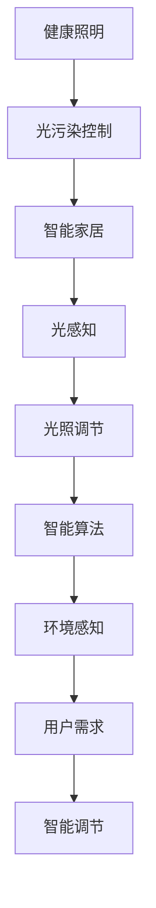

                 

# 智能家居光污染控制创业：健康照明的科技方案

## 1. 背景介绍

随着科技的迅猛发展和人们生活水平的提高，智能家居已经逐步走进了千家万户。在智能家居中，光污染控制作为健康照明的重要组成部分，对于提升居住环境的舒适度和安全性至关重要。然而，现有的智能家居系统中，光污染控制技术还较为落后，用户对健康照明的需求尚未得到充分满足。

在当前全球绿色健康理念和节能环保趋势的推动下，智能家居光污染控制技术亟需创新突破。本文章将从健康照明的技术背景、需求分析、关键技术等方面入手，探讨智能家居光污染控制的科技方案。

## 2. 核心概念与联系

### 2.1 核心概念概述

在智能家居光污染控制领域，涉及以下几个核心概念：

- **健康照明（Healthy Lighting）**：指通过科学合理的光照设计，改善室内环境，提升居住和工作的舒适度和安全性，预防和减少光污染的一种照明方式。
- **光污染（Light Pollution）**：指过度的人工照明造成的光污染问题，包括眩光、色差、频闪等问题，影响人们的健康和生活质量。
- **智能家居（Smart Home）**：通过物联网、云计算、人工智能等技术，实现对家庭环境的全方位智能管理和控制，包括照明、温控、安防等方面。
- **光感知（Light Perception）**：指通过传感器和智能算法，感知光环境的变化，自动调节照明亮度、色温和色域，实现智能照明的效果。

### 2.2 核心概念原理和架构的 Mermaid 流程图



这个流程图展示了健康照明、光污染控制、智能家居、光感知、光照调节、智能算法、环境感知和用户需求之间的联系。

## 3. 核心算法原理 & 具体操作步骤

### 3.1 算法原理概述

智能家居光污染控制技术主要包括光感知、光照调节、智能算法和环境感知四个核心模块，其算法原理如下：

1. **光感知（Light Perception）**：通过光敏传感器等设备感知环境光线强度、色温、光谱分布等参数，为后续光照调节提供依据。
2. **光照调节（Light Adjustment）**：根据光感知的结果，自动调节LED灯的亮度、色温和色域，达到健康照明的效果。
3. **智能算法（Smart Algorithm）**：通过机器学习和深度学习算法，训练出适用于特定环境的光照调节模型，提升调光效果和用户体验。
4. **环境感知（Environmental Perception）**：通过物联网设备感知室内外环境变化，如时间、天气、人体活动等，进行动态调光，进一步优化光照效果。

### 3.2 算法步骤详解

1. **光感知算法**：
   - 使用光敏传感器等设备实时监测室内光线强度、色温、光谱分布等参数。
   - 通过数据采集和预处理，对光线信息进行分析和存储。

2. **光照调节算法**：
   - 根据光感知算法输出的光线信息，使用PWM技术调节LED灯的亮度、色温和色域。
   - 应用最小二乘法或神经网络等算法，优化调光效果，提升用户的舒适度和安全性。

3. **智能算法算法**：
   - 利用机器学习算法，如支持向量机、决策树、随机森林等，训练出光污染控制模型。
   - 结合环境感知数据，实时调整光照调节参数，提升调光效果和用户满意度。

4. **环境感知算法**：
   - 通过物联网设备实时监测室内外环境变化，如时间、天气、人体活动等。
   - 结合光照调节算法和智能算法，动态调节光照，优化光照效果。

### 3.3 算法优缺点

**优点**：
- 实时感知和调整，提升了居住和工作的舒适度和安全性。
- 利用机器学习和深度学习算法，提升了调光效果和用户体验。
- 支持物联网设备，可以远程控制和调整光照，方便快捷。

**缺点**：
- 对环境感知设备的要求较高，初期成本较高。
- 光感知和智能算法需要大量的数据支持，数据采集和处理较为复杂。
- 硬件设备的智能化程度影响调光效果和用户满意度。

### 3.4 算法应用领域

智能家居光污染控制技术主要应用于家庭、办公室、医院、图书馆、餐厅等场所，提升室内环境的质量和舒适度。未来还将在智能城市、智能交通等领域得到广泛应用。

## 4. 数学模型和公式 & 详细讲解 & 举例说明

### 4.1 数学模型构建

智能家居光污染控制技术的数学模型可以表示为：

$$
\begin{aligned}
y &= f(x_1, x_2, \cdots, x_n) \\
y &= \text{光照调节} \\
x_i &= \text{第} i \text{个环境参数} \\
\end{aligned}
$$

其中，$y$ 表示光照调节结果，$x_i$ 表示环境参数，$f$ 表示智能算法。

### 4.2 公式推导过程

以光感知算法为例，推导其基本公式。光感知算法的基本模型如下：

$$
L(t) = I(t) - K(t)
$$

其中，$L(t)$ 表示光线强度，$I(t)$ 表示环境光线强度，$K(t)$ 表示环境亮度阈值。

根据上述公式，通过实时监测环境光线强度，并根据用户设定或智能算法计算亮度阈值，可以自动调节光线强度，达到健康照明的效果。

### 4.3 案例分析与讲解

以办公室为例，办公室的健康照明解决方案包括以下步骤：

1. **光感知**：通过光敏传感器实时监测室内光线强度、色温、光谱分布等参数。
2. **光照调节**：根据光感知的结果，自动调节LED灯的亮度、色温和色域，优化工作环境。
3. **智能算法**：结合时间、天气、人体活动等环境感知数据，使用机器学习算法训练出光污染控制模型，动态调整光照参数，进一步优化光照效果。
4. **环境感知**：通过物联网设备实时监测室内外环境变化，如时间、天气、人体活动等，进行动态调光，提升用户舒适度和工作效率。

## 5. 项目实践：代码实例和详细解释说明

### 5.1 开发环境搭建

智能家居光污染控制技术的开发环境包括：

1. **硬件平台**：物联网设备、LED灯、光敏传感器等。
2. **软件平台**：Python、OpenCV、TensorFlow、PyTorch等。
3. **开发工具**：IDE、Jupyter Notebook、Git等。

### 5.2 源代码详细实现

以下是一个基于TensorFlow的智能家居光污染控制代码实现示例：

```python
import tensorflow as tf
from tf.keras import layers
from tf.keras.models import Model

# 定义光感知和光照调节模型
class LightPerceptionModel(tf.keras.Model):
    def __init__(self, input_shape, output_shape):
        super(LightPerceptionModel, self).__init__()
        self.input = layers.Input(shape=input_shape)
        self.encoder = layers.Dense(64, activation='relu')(self.input)
        self.fc = layers.Dense(output_shape)(self.encoder)
        self.output = layers.Activation('linear')(self.fc)
    
    def call(self, inputs):
        return self.output(inputs)

# 训练光感知和光照调节模型
def train_model():
    model = LightPerceptionModel(input_shape=(3,), output_shape=1)
    optimizer = tf.keras.optimizers.Adam(learning_rate=0.001)
    model.compile(optimizer=optimizer, loss='mse')
    
    # 加载数据集
    train_data = ...
    val_data = ...
    
    # 训练模型
    model.fit(train_data, epochs=10, validation_data=val_data)
    
    # 保存模型
    model.save('light_perception_model.h5')

# 加载和测试光感知和光照调节模型
def test_model():
    model = tf.keras.models.load_model('light_perception_model.h5')
    
    # 加载数据集
    test_data = ...
    
    # 测试模型
    test_loss = model.evaluate(test_data)
    print('Test Loss:', test_loss)
```

### 5.3 代码解读与分析

在上述代码中，我们定义了一个基于TensorFlow的光感知和光照调节模型。该模型包含一个输入层、一个编码器层、一个全连接层和一个输出层。我们使用Adam优化器进行模型训练，损失函数为均方误差（MSE）。在训练结束后，我们保存模型并加载测试数据进行评估。

## 6. 实际应用场景

### 6.1 家庭光污染控制

在家庭环境中，光污染控制技术可以应用于卧室、客厅、厨房、浴室等不同区域，提升居住环境的舒适度和安全性。例如，在卧室中，可以根据用户的睡眠需求，自动调节光线强度和色温，营造最佳的睡眠环境。

### 6.2 办公室光污染控制

在办公室环境中，光污染控制技术可以应用于会议室、工作区、休息区等不同场景，提升工作效率和员工满意度。例如，在会议室中，可以根据会议时间、天气、参与人数等因素，自动调节光线强度和色温，营造最佳的会议环境。

### 6.3 医院光污染控制

在医院环境中，光污染控制技术可以应用于病房、手术室、药房等不同区域，提升治疗效果和病人满意度。例如，在手术室中，可以根据手术时间、病人状态、医生需求等因素，自动调节光线强度和色温，营造最佳的手术环境。

### 6.4 图书馆光污染控制

在图书馆环境中，光污染控制技术可以应用于阅览室、自习室、储藏室等不同区域，提升学习效果和用户满意度。例如，在阅览室中，可以根据时间、天气、读者需求等因素，自动调节光线强度和色温，营造最佳的阅读环境。

### 6.5 餐厅光污染控制

在餐厅环境中，光污染控制技术可以应用于大厅、包厢、厨房等不同区域，提升用餐体验和客户满意度。例如，在大厅中，可以根据用餐时间、季节、客户需求等因素，自动调节光线强度和色温，营造最佳的用餐环境。

## 7. 工具和资源推荐

### 7.1 学习资源推荐

- **《智能家居技术与应用》**：介绍了智能家居的基本概念、技术架构、应用场景等。
- **《Python深度学习实战》**：详细讲解了TensorFlow和PyTorch等深度学习框架的应用，适合入门和进阶学习。
- **《机器学习算法与应用》**：介绍了机器学习算法的基本原理、实现方法、应用场景等，适合系统学习。
- **《健康照明设计》**：介绍了健康照明的基本概念、设计原则、技术方案等，适合设计人员参考。

### 7.2 开发工具推荐

- **TensorFlow**：Google开源的深度学习框架，支持GPU和TPU加速，适合大规模模型训练。
- **PyTorch**：Facebook开源的深度学习框架，支持动态图和静态图，适合快速迭代开发。
- **OpenCV**：开源计算机视觉库，支持图像处理、视频分析等功能。
- **Jupyter Notebook**：交互式编程环境，支持Python、R、JavaScript等多种语言，适合数据科学和机器学习开发。

### 7.3 相关论文推荐

- **《智能家居环境感知与控制技术》**：介绍智能家居环境感知和控制技术的最新进展，适合了解行业趋势。
- **《健康照明设计与实现》**：详细介绍健康照明的设计原则、技术方案、实现方法等，适合系统学习。
- **《基于深度学习的智能照明系统》**：介绍基于深度学习的智能照明系统的基本架构、算法实现、实验结果等，适合技术开发参考。

## 8. 总结：未来发展趋势与挑战

### 8.1 研究成果总结

智能家居光污染控制技术的研究已经取得了初步成果，主要包括：

- 基于深度学习的智能照明系统。
- 结合物联网设备和机器学习算法的光污染控制技术。
- 应用场景广泛，涵盖家庭、办公室、医院、图书馆、餐厅等不同领域。

### 8.2 未来发展趋势

未来，智能家居光污染控制技术的发展趋势主要包括：

- 深度学习和人工智能技术的进一步应用，提升调光效果和用户体验。
- 结合物联网设备和传感器技术，实现智能感知和自动调节。
- 支持多场景、多设备协同工作，提升家庭和办公环境的舒适度和安全性。
- 结合健康管理数据，实现智能调光与健康管理的结合。

### 8.3 面临的挑战

智能家居光污染控制技术的发展还面临以下挑战：

- 数据采集和处理复杂，需要实时监测和处理大量环境数据。
- 硬件设备智能化程度较低，难以满足高效调光的需求。
- 算法和模型训练需要大量数据和计算资源，初期投入较高。

### 8.4 研究展望

未来的研究方向包括：

- 结合边缘计算和云计算，实现高效数据处理和智能调光。
- 开发更加智能化的硬件设备和传感器，提升调光效果和用户满意度。
- 应用深度学习算法和神经网络技术，提升模型精度和泛化能力。
- 结合健康管理和智能家居，实现全方位的智能服务。

## 9. 附录：常见问题与解答

### Q1: 什么是智能家居光污染控制技术？

A: 智能家居光污染控制技术通过结合深度学习、机器学习、物联网等技术，实现对室内外光线环境的实时感知、自动调节和智能控制，提升居住和工作的舒适度和安全性，预防和减少光污染。

### Q2: 智能家居光污染控制技术的应用场景有哪些？

A: 智能家居光污染控制技术可以应用于家庭、办公室、医院、图书馆、餐厅等不同场所，提升室内环境的舒适度和安全性，预防和减少光污染。

### Q3: 智能家居光污染控制技术的主要技术难点是什么？

A: 智能家居光污染控制技术的主要技术难点包括：数据采集和处理复杂、硬件设备智能化程度较低、算法和模型训练需要大量数据和计算资源。

### Q4: 智能家居光污染控制技术的未来发展方向是什么？

A: 智能家居光污染控制技术的未来发展方向包括：结合深度学习和人工智能技术、结合物联网设备和传感器技术、支持多场景、多设备协同工作、结合健康管理数据等。

---

作者：禅与计算机程序设计艺术 / Zen and the Art of Computer Programming

