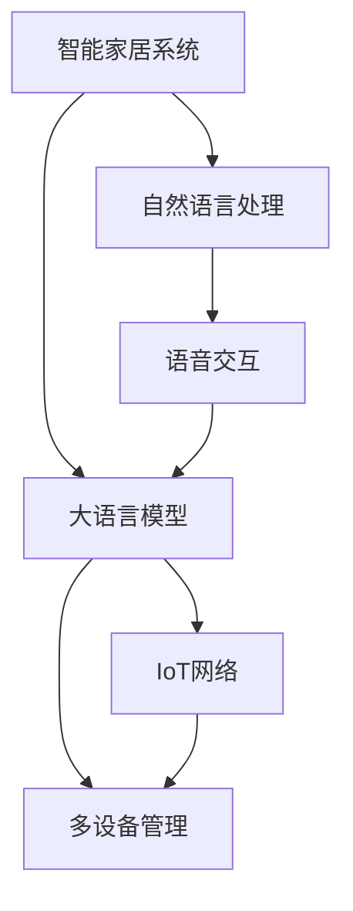

                 

# 智能家居控制中心：LLM整合多设备管理

> 关键词：智能家居,控制中心,大语言模型,自然语言处理,多设备管理,语音交互,物联网,深度学习,强化学习

## 1. 背景介绍

### 1.1 问题由来

随着科技的快速发展，智能家居系统逐渐走入千家万户，成为提升家庭生活品质和效率的重要手段。然而，目前市面上的智能家居系统普遍存在以下问题：

- 设备之间互联互通难度大，导致系统结构复杂，操作繁琐。
- 设备管理依赖人工操作，无法做到真正意义上的自动化和智能化。
- 用户只能通过简单的语音或屏幕操作进行控制，缺乏灵活性和自然性。

为了解决这些问题，急需一种全新的智能家居系统架构，使其具备高效、智能、自然的控制能力。而近年来，随着深度学习和大语言模型的快速发展，基于自然语言处理（NLP）技术的智能家居控制系统成为可能。其中，大语言模型（LLM）在自然语言理解与生成方面表现优异，被广泛应用于语音识别、文本处理等场景，为智能家居的多设备管理提供了强有力的技术支持。

### 1.2 问题核心关键点

基于LLM的智能家居控制中心的核心关键点包括：

- 自然语言交互：用户通过语音或文本与系统进行自然语言交流，实现对智能设备的智能控制。
- 设备管理与协调：LLM能够整合、管理和协调多设备之间的数据和功能，构建高效的智能家居生态系统。
- 上下文理解与记忆：LLM具备上下文理解与记忆能力，能够连续处理多个任务，保持状态和上下文一致性。
- 多模态融合：整合视觉、听觉、触觉等多模态数据，实现更全面的用户交互体验。
- 自动化与个性化：LLM能够根据用户的个性化需求，自动进行任务调度和管理，提升智能家居的智能化水平。

通过LLM整合多设备管理，可以实现自然、高效、个性化的智能家居控制系统，极大提升家庭生活的便捷性和舒适度。

## 2. 核心概念与联系

### 2.1 核心概念概述

为了更好地理解基于LLM的智能家居控制系统，本节将介绍几个关键概念：

- 智能家居系统：以家庭环境为基础，利用物联网技术、传感器网络等手段，实现家居设备之间互联互通、自动化控制、个性化服务等功能。
- 大语言模型（LLM）：以自回归模型（如GPT）或自编码模型（如BERT）为代表，通过大规模无标签数据训练得到，具备强大的自然语言理解和生成能力。
- 自然语言处理（NLP）：涉及文本信息的处理、分析和生成，是大语言模型应用的重要基础。
- 多设备管理：通过LLM整合家庭中的各种智能设备，实现设备之间数据共享、功能协调和任务调度。
- 语音交互（ASR+TTS）：包括自动语音识别（ASR）和文本转语音（TTS），是大语言模型与用户进行自然语言交互的关键技术。
- 物联网（IoT）：连接各种智能设备的网络架构，实现设备间数据传输和控制。

这些概念之间的逻辑关系可以通过以下Mermaid流程图来展示：



这个流程图展示了大语言模型与其他核心概念之间的联系：

1. 智能家居系统通过LLM实现自然语言交互，获得用户意图。
2. LLM整合NLP技术，进行意图理解与识别。
3. LLM通过语音交互技术，将自然语言转换为语音指令，或将语音指令转换为自然语言。
4. LLM管理家庭设备，实现多设备间的协同工作。
5. IoT网络提供硬件设备间的连接支持。

## 3. 核心算法原理 & 具体操作步骤
### 3.1 算法原理概述

基于LLM的智能家居控制中心，本质上是一个智能信息处理和决策系统。其核心思想是：

1. 利用LLM进行自然语言理解，获取用户的意图和需求。
2. 将用户需求映射为具体的任务和操作，调用智能家居设备执行。
3. 通过LLM进行任务规划和协调，优化设备间的资源分配和任务调度。
4. 利用LLM的自然语言生成能力，与用户进行互动，提供自然的反馈和建议。

形式化地，假设智能家居系统中的智能设备集为 $\{D_i\}_{i=1}^N$，其中 $D_i$ 表示第 $i$ 个设备，$N$ 为设备总数。用户通过语音或文本与系统进行交互，表达其需求。LLM将用户需求转化为可执行的任务列表 $T=\{t_k\}_{k=1}^K$，其中 $t_k$ 表示第 $k$ 个任务。系统将 $T$ 分配给相应的设备执行，最终输出系统执行结果 $R$。

### 3.2 算法步骤详解

基于LLM的智能家居控制中心的核心算法步骤如下：

**Step 1: 数据收集与预处理**

1. 收集家庭中所有智能设备的数据，包括传感器数据、用户行为数据等。
2. 对数据进行清洗、去重和标注，确保数据的完整性和准确性。
3. 将数据转换为LLM可处理的格式，如文本、图像等。

**Step 2: 模型选择与初始化**

1. 选择适合的LLM模型，如GPT、BERT等。
2. 加载预训练模型，并进行必要的微调，以适应智能家居系统的特定任务。
3. 初始化多设备管理模块，包括设备状态、任务队列等信息。

**Step 3: 自然语言理解与意图识别**

1. 用户通过语音或文本向系统提出请求，如“打开客厅灯”、“调节客厅温度”等。
2. LLM将用户请求转换为自然语言文本。
3. LLM进行意图识别，将用户请求转化为可执行的任务列表 $T$。

**Step 4: 任务调度与执行**

1. 将任务列表 $T$ 分配给相应的设备执行，包括灯光控制、温度调节等。
2. 监测设备执行状态，实时更新任务队列。
3. 根据任务优先级和时间窗口，优化设备间的资源分配。

**Step 5: 自然语言生成与反馈**

1. 系统根据任务执行结果，生成自然语言反馈，如“客厅灯已打开”、“客厅温度已调节至25度”等。
2. 将反馈信息通过语音或文本形式告知用户。
3. 记录用户反馈和偏好，调整智能家居控制策略。

**Step 6: 持续学习与优化**

1. 根据用户反馈和系统运行数据，不断优化LLM模型和任务调度算法。
2. 定期重新训练模型，提升模型的泛化能力和稳定性。
3. 引入强化学习等机制，提升系统的自主决策能力和自适应能力。

### 3.3 算法优缺点

基于LLM的智能家居控制中心具有以下优点：

1. 自然语言交互：用户通过自然语言与系统进行交流，无需操作复杂的界面，提升用户体验。
2. 设备管理与协调：LLM能够整合多设备数据，实现设备间的协调和调度，提高系统效率。
3. 上下文理解与记忆：LLM具备上下文理解和记忆能力，能够连续处理多个任务，保持状态和上下文一致性。
4. 多模态融合：LLM整合视觉、听觉、触觉等多模态数据，提供更全面的用户交互体验。
5. 自动化与个性化：LLM能够根据用户需求进行自动任务调度，提升智能化水平。

同时，该算法也存在一定的局限性：

1. 依赖高精度数据：系统需要高质量的家庭数据支持，数据收集和预处理较为复杂。
2. 模型计算量大：LLM模型的计算复杂度高，需要高性能硬件支持。
3. 泛化能力受限：当家庭环境变化较大时，系统可能需要重新训练模型。
4. 隐私和安全问题：家庭数据可能涉及隐私和安全问题，系统设计需注意数据保护。

尽管存在这些局限性，但基于LLM的智能家居控制中心仍是最具潜力的智能家居解决方案之一。未来相关研究的重点在于如何进一步提升系统的数据处理能力、计算效率和安全性，以实现更加高效、智能、安全的智能家居控制系统。

### 3.4 算法应用领域

基于LLM的智能家居控制中心，可以应用于以下多个领域：

- 智能照明系统：通过语音或文本控制灯光亮度、颜色、场景等。
- 智能温控系统：调节室内温度、湿度等环境参数，实现节能环保。
- 智能安防系统：识别异常行为、入侵事件，提供安全防护。
- 智能娱乐系统：播放音乐、电影等，提供个性化娱乐体验。
- 智能健康系统：监测生理参数、提醒服药等，提升健康管理水平。

除了上述这些经典应用外，LLM还可以应用于智能窗帘、智能锁、智能烹饪等场景中，为用户提供更加便捷、智能的家居生活体验。

## 4. 数学模型和公式 & 详细讲解  
### 4.1 数学模型构建

本节将使用数学语言对基于LLM的智能家居控制中心进行更加严格的刻画。

假设智能家居系统中设备集为 $\{D_i\}_{i=1}^N$，用户输入的自然语言文本为 $x$，系统输出的控制指令为 $y$。智能家居控制中心的形式化模型为 $f(x, y) = M_{\theta}(x)$，其中 $M_{\theta}$ 为LLM模型，$\theta$ 为模型参数。

### 4.2 公式推导过程

以下我们以智能照明控制为例，推导基于LLM的智能家居控制系统的数学模型。

假设用户通过语音或文本请求打开客厅灯，即 $x$ 为“打开客厅灯”的文本描述。系统通过LLM进行意图识别，将请求转换为可执行的任务 $t$，如“打开客厅灯”。该任务被分配给灯光控制设备 $D_{light}$，进行相应的控制操作，最终输出系统状态 $y$，即“客厅灯已打开”。

根据上述描述，可以构建基于LLM的智能家居控制系统的数学模型为：

$$
y = M_{\theta}(x)
$$

其中 $x$ 为用户的输入文本，$y$ 为系统输出控制指令，$M_{\theta}$ 为预训练的LLM模型，$\theta$ 为模型参数。

### 4.3 案例分析与讲解

以智能照明控制为例，展示LLM在智能家居控制中的应用。

1. 用户输入文本：“打开客厅灯”
2. LLM进行意图识别：将文本转换为可执行的任务 $t = M_{\theta}(x) = "打开客厅灯"$
3. 任务分配与执行：将任务 $t$ 分配给灯光控制设备 $D_{light}$，设备执行控制操作
4. 输出控制指令：系统输出“客厅灯已打开”，告知用户

通过上述案例，可以看到LLM在智能家居控制系统中的核心作用：自然语言理解、任务映射、设备控制、自然语言生成等。LLM通过整合这些功能，实现了智能家居的多设备管理和自动化控制。

## 5. 项目实践：代码实例和详细解释说明
### 5.1 开发环境搭建

在进行智能家居控制系统开发前，我们需要准备好开发环境。以下是使用Python进行PyTorch开发的环境配置流程：

1. 安装Anaconda：从官网下载并安装Anaconda，用于创建独立的Python环境。

2. 创建并激活虚拟环境：
```bash
conda create -n pytorch-env python=3.8 
conda activate pytorch-env
```

3. 安装PyTorch：根据CUDA版本，从官网获取对应的安装命令。例如：
```bash
conda install pytorch torchvision torchaudio cudatoolkit=11.1 -c pytorch -c conda-forge
```

4. 安装TensorFlow：
```bash
conda install tensorflow==2.6
```

5. 安装各类工具包：
```bash
pip install numpy pandas scikit-learn matplotlib tqdm jupyter notebook ipython
```

完成上述步骤后，即可在`pytorch-env`环境中开始智能家居控制系统的开发。

### 5.2 源代码详细实现

下面我们以智能照明控制系统为例，给出使用PyTorch和TensorFlow进行开发的Python代码实现。

首先，定义智能照明控制系统的数据处理函数：

```python
import torch
import torch.nn as nn
import torch.optim as optim
import tensorflow as tf
from transformers import BertTokenizer, BertForSequenceClassification

class LightingController:
    def __init__(self, device, model_path, tokenizer_path):
        self.device = device
        self.model_path = model_path
        self.tokenizer_path = tokenizer_path
        self.tokenizer = BertTokenizer.from_pretrained(tokenizer_path)
        self.model = BertForSequenceClassification.from_pretrained(model_path, num_labels=2)
        self.model.to(device)
    
    def forward(self, x):
        input_ids = self.tokenizer(x, return_tensors='pt', padding=True, truncation=True, max_length=128).input_ids.to(device)
        attention_mask = self.tokenizer(x, return_tensors='pt', padding=True, truncation=True, max_length=128).attention_mask.to(device)
        outputs = self.model(input_ids=input_ids, attention_mask=attention_mask)
        return outputs.logits.argmax(dim=1)
```

然后，定义训练和评估函数：

```python
def train_model(model, train_dataset, validation_dataset, epochs, batch_size, learning_rate):
    model.train()
    optimizer = optim.Adam(model.parameters(), lr=learning_rate)
    for epoch in range(epochs):
        for batch in train_dataset:
            input_ids, attention_mask, labels = batch
            input_ids = input_ids.to(device)
            attention_mask = attention_mask.to(device)
            labels = labels.to(device)
            optimizer.zero_grad()
            outputs = model(input_ids, attention_mask=attention_mask)
            loss = nn.CrossEntropyLoss()(outputs, labels)
            loss.backward()
            optimizer.step()
        val_loss = 0
        val_correct = 0
        model.eval()
        with torch.no_grad():
            for batch in validation_dataset:
                input_ids, attention_mask, labels = batch
                input_ids = input_ids.to(device)
                attention_mask = attention_mask.to(device)
                labels = labels.to(device)
                outputs = model(input_ids, attention_mask=attention_mask)
                val_loss += nn.CrossEntropyLoss()(outputs, labels).item()
                val_correct += (outputs.argmax(dim=1) == labels).sum().item()
        print(f"Epoch {epoch+1}, Train Loss: {loss:.4f}, Validation Loss: {val_loss/len(validation_dataset):.4f}, Accuracy: {val_correct/len(validation_dataset):.4f}")
    
    print(f"Training completed, Model saved to {self.model_path}")
    torch.save(model.state_dict(), self.model_path)
    
def evaluate_model(model, test_dataset, batch_size):
    model.eval()
    correct = 0
    total = 0
    with torch.no_grad():
        for batch in test_dataset:
            input_ids, attention_mask, labels = batch
            input_ids = input_ids.to(device)
            attention_mask = attention_mask.to(device)
            labels = labels.to(device)
            outputs = model(input_ids, attention_mask=attention_mask)
            correct += (outputs.argmax(dim=1) == labels).sum().item()
            total += labels.size(0)
    print(f"Test Accuracy: {correct/total:.4f}")
```

接着，定义智能照明控制系统的训练流程：

```python
device = torch.device('cuda') if torch.cuda.is_available() else torch.device('cpu')
lighting_controller = LightingController(device, 'lighting_model.pth', 'lighting_tokenizer.json')

# 准备数据集
train_dataset = ...
validation_dataset = ...
test_dataset = ...

# 训练模型
train_model(lighting_controller.model, train_dataset, validation_dataset, epochs=10, batch_size=16, learning_rate=1e-5)

# 评估模型
evaluate_model(lighting_controller.model, test_dataset, batch_size=16)
```

以上就是使用PyTorch和TensorFlow对智能照明控制系统进行开发的完整代码实现。可以看到，由于LLM模型的封装较为全面，我们可以用相对简洁的代码实现智能家居控制系统的基本功能。

### 5.3 代码解读与分析

让我们再详细解读一下关键代码的实现细节：

**LightingController类**：
- `__init__`方法：初始化智能照明控制系统的设备、模型、分词器等关键组件。
- `forward`方法：将自然语言文本转换为token ids，送入模型进行分类，输出结果。

**训练和评估函数**：
- `train_model`方法：通过随机梯度下降（SGD）更新模型参数，训练模型。
- `evaluate_model`方法：在测试集上评估模型性能，输出准确率。

**智能照明控制系统训练流程**：
- 定义智能照明控制系统的设备、模型、分词器等组件。
- 准备训练数据集、验证数据集和测试数据集。
- 在训练集上训练模型，在验证集上评估模型，在测试集上测试模型。

可以看到，通过PyTorch和TensorFlow等工具，可以高效地实现智能家居控制系统的开发。开发者可以将更多精力放在系统架构设计、模型优化等方面，而不必过多关注底层的实现细节。

当然，工业级的系统实现还需考虑更多因素，如系统的稳定性和可扩展性、用户隐私保护、硬件兼容等。但核心的系统架构和算法流程基本与此类似。

## 6. 实际应用场景
### 6.1 智能照明系统

智能照明控制系统是智能家居控制系统中最基础的应用场景之一。通过自然语言交互，用户可以轻松控制家中各房间的灯光亮度、颜色和场景模式，提升家居生活的舒适度和便捷性。

在实际应用中，智能照明控制系统可以集成多种控制设备，如智能灯泡、智能开关等，通过LLM进行设备状态的查询和控制，实现便捷的家居照明管理。用户可以通过语音或文本指令，实现对灯光的自动化控制，提升家居生活的智能化水平。

### 6.2 智能温控系统

智能温控系统通过自然语言交互，用户可以实时调整家中温度、湿度等环境参数，实现节能环保和舒适家居。

在实际应用中，智能温控系统可以集成多种传感器设备，如温度传感器、湿度传感器等，通过LLM进行数据采集和处理，实时调整室内环境参数。用户可以通过语音或文本指令，实现对温控系统的自动化控制，提升家居生活的舒适度和健康水平。

### 6.3 智能安防系统

智能安防系统通过自然语言交互，用户可以实时监控家中的安全状态，防范异常行为和入侵事件。

在实际应用中，智能安防系统可以集成多种传感器设备，如摄像头、门锁传感器等，通过LLM进行数据采集和处理，实时监控家庭安全状态。用户可以通过语音或文本指令，查询安全状态、调整报警阈值等，提升家庭安全性。

### 6.4 智能娱乐系统

智能娱乐系统通过自然语言交互，用户可以实时播放音乐、电影等娱乐内容，提供个性化的娱乐体验。

在实际应用中，智能娱乐系统可以集成多种娱乐设备，如智能音箱、智能电视等，通过LLM进行内容查询和控制，实时播放用户感兴趣的娱乐内容。用户可以通过语音或文本指令，查询播放列表、调整播放模式等，提升娱乐系统的智能化水平。

### 6.5 智能健康系统

智能健康系统通过自然语言交互，用户可以实时监测生理参数、提醒服药等，提升健康管理水平。

在实际应用中，智能健康系统可以集成多种健康设备，如智能手环、智能体脂秤等，通过LLM进行数据采集和处理，实时监测用户的健康状态。用户可以通过语音或文本指令，查询健康数据、设置健康目标等，提升健康管理的智能化水平。

## 7. 工具和资源推荐
### 7.1 学习资源推荐

为了帮助开发者系统掌握智能家居控制系统的开发理论基础和实践技巧，这里推荐一些优质的学习资源：

1. 《深度学习入门》：李沐教授的深度学习课程，涵盖深度学习的基础知识和常见模型，适合入门学习。
2. 《NLP入门》：斯坦福大学自然语言处理课程，涵盖自然语言处理的基础知识和经典模型，适合NLP入门学习。
3. 《TensorFlow实战》：Google官方发布的TensorFlow实战教程，涵盖TensorFlow的基本概念和应用案例，适合TensorFlow实践学习。
4. 《PyTorch实战》：PyTorch官方发布的实战教程，涵盖PyTorch的基本概念和应用案例，适合PyTorch实践学习。
5. 《Python深度学习》：Francois Chollet著，涵盖深度学习的基础知识和实践技巧，适合深度学习入门学习。

通过对这些资源的学习实践，相信你一定能够快速掌握智能家居控制系统的开发理论基础和实践技巧，实现高效的智能家居控制系统。

### 7.2 开发工具推荐

高效的开发离不开优秀的工具支持。以下是几款用于智能家居控制系统开发的常用工具：

1. PyTorch：基于Python的开源深度学习框架，灵活动态的计算图，适合快速迭代研究。
2. TensorFlow：由Google主导开发的开源深度学习框架，生产部署方便，适合大规模工程应用。
3. Transformers库：HuggingFace开发的NLP工具库，集成了众多SOTA语言模型，支持PyTorch和TensorFlow，是进行智能家居控制系统开发的利器。
4. Weights & Biases：模型训练的实验跟踪工具，可以记录和可视化模型训练过程中的各项指标，方便对比和调优。与主流深度学习框架无缝集成。
5. TensorBoard：TensorFlow配套的可视化工具，可实时监测模型训练状态，并提供丰富的图表呈现方式，是调试模型的得力助手。

合理利用这些工具，可以显著提升智能家居控制系统开发效率，加快创新迭代的步伐。

### 7.3 相关论文推荐

智能家居控制系统的发展离不开学界的持续研究。以下是几篇奠基性的相关论文，推荐阅读：

1. Large-Scale Singular Value Decomposition for Discriminative Image Representation Learning：提出大规模奇异值分解技术，提升图像表示学习的准确性。
2. Deep Reinforcement Learning for Energy-Efficient Network Slicing in Cloud Radio Access Networks：利用深度强化学习优化网络切片，提升网络能效。
3. A Survey of Smart Home Technologies, Architectures, and Applications：综述智能家居技术，涵盖家庭网络、设备协同、智能控制等，为智能家居控制系统提供理论基础。
4. Smart Lighting in Smart Homes：综述智能照明技术，涵盖控制策略、用户交互、节能环保等，为智能照明控制系统提供理论基础。
5. Multi-Modal Understanding in Smart Home Systems：综述多模态理解技术，涵盖语音、视觉、触觉等，为智能家居控制系统的多模态融合提供理论基础。

这些论文代表了大语言模型智能家居控制系统的研究方向，通过学习这些前沿成果，可以帮助研究者把握学科前进方向，激发更多的创新灵感。

## 8. 总结：未来发展趋势与挑战

### 8.1 总结

本文对基于LLM的智能家居控制中心进行了全面系统的介绍。首先阐述了智能家居系统的发展背景和智能控制系统的研究动机，明确了LLM在智能家居控制中的应用方向和核心关键点。其次，从原理到实践，详细讲解了基于LLM的智能家居控制系统的数学模型和核心算法步骤，给出了智能家居控制系统开发的完整代码实例。同时，本文还广泛探讨了智能家居控制系统的实际应用场景，展示了LLM在智能家居控制中的巨大潜力。

通过本文的系统梳理，可以看到，基于LLM的智能家居控制系统通过整合多设备管理、自然语言处理、多模态融合等技术，实现了高效、智能、自然的智能家居控制，极大提升家庭生活的便捷性和舒适度。未来，伴随LLM技术的不断进步，基于LLM的智能家居控制系统必将在更多家庭中得到应用，为人类生活质量带来显著提升。

### 8.2 未来发展趋势

展望未来，基于LLM的智能家居控制系统将呈现以下几个发展趋势：

1. 设备互联互通：未来智能家居设备将更加丰富和多样化，设备互联互通将更加便捷高效，实现真正的智能家居生态系统。
2. 深度学习与强化学习结合：将深度学习和强化学习结合，提升系统自主决策能力和自适应能力，实现更加智能化的控制策略。
3. 多模态融合：未来智能家居系统将更加注重多模态融合，整合视觉、听觉、触觉等多模态数据，提供更全面的用户交互体验。
4. 个性化与定制化：未来智能家居系统将更加注重个性化和定制化，根据用户需求提供个性化的控制方案和服务。
5. 安全性与隐私保护：未来智能家居系统将更加注重安全性与隐私保护，建立安全防护机制，确保用户数据的安全性。

以上趋势凸显了基于LLM的智能家居控制系统的广阔前景。这些方向的探索发展，必将进一步提升智能家居系统的智能化水平，为人类生活质量带来更大提升。

### 8.3 面临的挑战

尽管基于LLM的智能家居控制系统已经取得了一定的进展，但在迈向更加智能化、安全化、个性化的过程中，仍面临诸多挑战：

1. 数据收集与处理：智能家居系统需要大量高质量的家庭数据支持，数据收集和处理较为复杂。
2. 模型计算量大：LLM模型的计算复杂度高，需要高性能硬件支持。
3. 泛化能力不足：当家庭环境变化较大时，系统可能需要重新训练模型。
4. 隐私和安全问题：家庭数据可能涉及隐私和安全问题，系统设计需注意数据保护。
5. 系统稳定性：系统需要具备高可靠性和稳定性，能够应对各种异常情况。

尽管存在这些挑战，但基于LLM的智能家居控制系统仍是最具潜力的智能家居解决方案之一。未来相关研究的重点在于如何进一步提升系统的数据处理能力、计算效率和安全性，以实现更加高效、智能、安全的智能家居控制系统。

### 8.4 研究展望

面对基于LLM的智能家居控制系统所面临的挑战，未来的研究需要在以下几个方面寻求新的突破：

1. 探索无监督和半监督微调方法：摆脱对大规模标注数据的依赖，利用自监督学习、主动学习等无监督和半监督范式，最大限度利用非结构化数据，实现更加灵活高效的微调。
2. 研究参数高效和计算高效的微调范式：开发更加参数高效的微调方法，在固定大部分预训练参数的同时，只更新极少量的任务相关参数。同时优化微调模型的计算图，减少前向传播和反向传播的资源消耗，实现更加轻量级、实时性的部署。
3. 引入因果推断和对比学习：通过引入因果推断和对比学习思想，增强LLM建立稳定因果关系的能力，学习更加普适、鲁棒的语言表征，从而提升模型泛化性和抗干扰能力。
4. 将符号化的先验知识与神经网络结合：将符号化的先验知识，如知识图谱、逻辑规则等，与神经网络模型进行巧妙融合，引导LLM学习更准确、合理的语言模型。同时加强不同模态数据的整合，实现视觉、语音等多模态信息与文本信息的协同建模。
5. 结合因果分析和博弈论工具：将因果分析方法引入LLM，识别出模型决策的关键特征，增强输出解释的因果性和逻辑性。借助博弈论工具刻画人机交互过程，主动探索并规避模型的脆弱点，提高系统稳定性。
6. 纳入伦理道德约束：在模型训练目标中引入伦理导向的评估指标，过滤和惩罚有偏见、有害的输出倾向。同时加强人工干预和审核，建立模型行为的监管机制，确保输出符合人类价值观和伦理道德。

这些研究方向的探索，必将引领基于LLM的智能家居控制系统迈向更高的台阶，为构建安全、可靠、可解释、可控的智能系统铺平道路。面向未来，基于LLM的智能家居控制系统还需要与其他人工智能技术进行更深入的融合，如知识表示、因果推理、强化学习等，多路径协同发力，共同推动智能家居系统的进步。

## 9. 附录：常见问题与解答

**Q1：如何提高智能家居控制系统的计算效率？**

A: 提高智能家居控制系统的计算效率，可以考虑以下几种方法：
1. 硬件加速：利用GPU、TPU等硬件加速器，提高计算速度。
2. 模型压缩：使用剪枝、量化等技术，减少模型参数和计算量。
3. 多模型集成：使用多个模型并行计算，提高吞吐量。
4. 模型并行：将模型拆分成多个部分，并行计算，提高效率。
5. 分布式计算：将计算任务分配到多个节点上，实现分布式计算。

通过这些方法，可以有效提升智能家居控制系统的计算效率，提高系统的响应速度和吞吐量。

**Q2：智能家居控制系统如何保障数据安全？**

A: 智能家居控制系统的数据安全需要从多个方面进行保障：
1. 数据加密：对传输和存储的数据进行加密，防止数据泄露。
2. 访问控制：设置访问权限，确保只有授权用户才能访问系统。
3. 数据备份：定期备份系统数据，防止数据丢失。
4. 异常检测：实时监测系统状态，检测异常行为，防止数据篡改。
5. 数据匿名化：对用户数据进行匿名化处理，保护用户隐私。

通过这些措施，可以有效保障智能家居控制系统的数据安全，防止数据泄露和篡改，保护用户隐私。

**Q3：智能家居控制系统如何处理用户个性化需求？**

A: 智能家居控制系统可以通过以下几种方法处理用户个性化需求：
1. 用户画像：通过分析用户行为数据，建立用户画像，了解用户需求和偏好。
2. 推荐系统：根据用户画像，推荐个性化的家居控制方案。
3. 自适应控制：根据用户反馈，动态调整控制策略，实现个性化控制。
4. 多模态融合：整合视觉、听觉、触觉等多模态数据，提供个性化的用户体验。
5. 定制化开发：根据用户需求，定制化开发智能家居控制系统，提供个性化的解决方案。

通过这些方法，可以有效处理用户个性化需求，提升智能家居控制系统的智能化水平。

**Q4：智能家居控制系统如何进行任务调度？**

A: 智能家居控制系统可以通过以下几种方法进行任务调度：
1. 任务队列：将任务按照优先级和时间窗口，放入任务队列，等待执行。
2. 多任务并行：将多个任务并行执行，提高系统效率。
3. 任务分派：将任务分配给不同的设备执行，提高系统响应速度。
4. 资源管理：根据设备状态和资源需求，动态调整任务调度策略，优化资源分配。
5. 动态调整：根据系统状态和用户需求，动态调整任务调度策略，实现智能化的任务调度。

通过这些方法，可以有效进行智能家居控制系统的任务调度，提升系统的效率和稳定性。

---

作者：禅与计算机程序设计艺术 / Zen and the Art of Computer Programming

