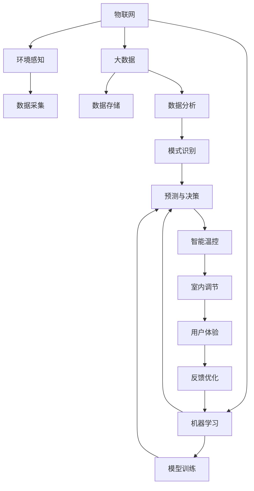

                 

# 智能家居温控创业：精准舒适的居住环境

> 关键词：智能温控, 机器学习, 物联网, 家庭环境, 用户体验

## 1. 背景介绍

### 1.1 问题由来
在过去几十年中，智能家居领域取得了显著进展，为我们的生活带来了前所未有的便捷和舒适。然而，家居温控系统仍然存在诸多不足之处。传统的温控系统，如手动调控的温度计、舒适度较低的中央空调等，往往难以满足用户个性化和智能化的需求。随着物联网技术和大数据的发展，智能温控系统开始崭露头角。基于先进的机器学习和物联网技术，智能温控系统能够实时监测家庭环境，动态调整室内温度，为家庭成员提供更加精准舒适的居住环境。

### 1.2 问题核心关键点
智能家居温控系统的核心关键点包括：
- 环境感知：利用传感器等设备实时监测室内温度、湿度、空气质量等环境数据。
- 数据分析：通过对历史数据和实时数据的分析，掌握室内环境变化趋势。
- 动态调节：根据室内外温差、家庭成员习惯等条件，自动调节室内温度。
- 自适应学习：利用机器学习算法，不断优化温控策略，提升用户体验。

通过这些关键技术，智能温控系统可以更好地适应家庭环境和需求变化，提升用户的居住体验和生活质量。

## 2. 核心概念与联系

### 2.1 核心概念概述

智能家居温控系统融合了物联网、大数据和机器学习等技术，以实现对室内环境的智能化调控。以下是该系统中的几个核心概念：

- **物联网**：利用传感器、控制器等设备，实时采集家庭环境数据。
- **大数据**：将采集到的环境数据存储和分析，掌握环境变化规律。
- **机器学习**：基于历史和实时数据，利用算法不断优化温控策略。
- **智能温控**：通过动态调节室内温度，提升居住环境舒适度。
- **用户体验**：实现自动化、智能化、个性化温控，满足用户需求。

这些核心概念相互关联，共同构成了智能家居温控系统的技术框架。

### 2.2 核心概念原理和架构的 Mermaid 流程图



## 3. 核心算法原理 & 具体操作步骤

### 3.1 算法原理概述

智能家居温控系统的核心算法基于机器学习，特别是强化学习和自适应学习。算法原理概述如下：

- **强化学习**：通过奖励机制，不断优化温控策略，提升居住环境的舒适度。
- **自适应学习**：根据家庭成员的生活习惯和偏好，动态调整温控策略。

系统首先通过物联网设备采集室内环境数据，包括温度、湿度、空气质量等。然后，将这些数据输入到机器学习模型中进行分析，识别出环境变化的模式和趋势。最后，根据分析结果和预定义的目标，智能温控系统动态调整温度，以达到最佳舒适度。

### 3.2 算法步骤详解

智能家居温控系统的算法步骤如下：

**Step 1: 环境感知与数据采集**

智能温控系统首先利用传感器等设备，实时采集室内环境数据。这些数据包括但不限于：

- 室内温度
- 室内湿度
- 空气质量
- 室内照明强度

通过物联网技术，这些数据可以被实时传输到中央控制器进行处理。

**Step 2: 数据分析与模式识别**

收集到的环境数据需要进行处理和分析，以识别出环境变化的模式和趋势。数据分析步骤如下：

- **数据清洗**：去除噪声和异常值，确保数据质量。
- **时间序列分析**：利用时间序列分析方法，识别环境数据的周期性和趋势性。
- **模式识别**：利用机器学习算法，识别出不同时间段和不同场景下的环境变化规律。

**Step 3: 动态调节与温控决策**

在分析得到环境变化规律后，智能温控系统需要根据这些规律，动态调整室内温度。动态调节步骤如下：

- **设定目标温度**：根据家庭成员的习惯和当前环境条件，设定目标温度。
- **计算调节量**：利用算法计算出需要调整的温度差值，确保调节过程平稳。
- **执行调节**：根据计算结果，调整加热或制冷设备，实现室内温度的动态调节。

**Step 4: 反馈优化与自适应学习**

为了进一步提升温控效果，智能温控系统还需要不断优化模型和算法。反馈优化的步骤如下：

- **用户反馈收集**：通过问卷调查等方式，收集用户对当前温度的满意度。
- **模型优化**：利用用户反馈和环境数据，优化机器学习模型，提升预测准确性。
- **自适应学习**：根据家庭成员的日常习惯，动态调整温控策略，提升用户体验。

### 3.3 算法优缺点

智能家居温控系统的算法具有以下优点：

- **自动化与智能化**：通过机器学习算法，系统能够自动调节室内温度，提升居住环境舒适度。
- **个性化与自适应**：根据家庭成员的生活习惯和偏好，动态调整温控策略，满足个性化需求。
- **实时性与响应快**：通过实时数据采集和动态调节，系统可以快速响应环境变化，提高用户满意度。

同时，该算法也存在以下缺点：

- **初始化难度大**：需要大量的初始数据来训练机器学习模型，确保预测准确性。
- **计算复杂度高**：动态调节和优化过程涉及复杂的计算，对硬件要求较高。
- **模型泛化能力不足**：在特定环境下训练得到的模型，可能难以泛化到其他环境。

### 3.4 算法应用领域

智能家居温控系统在多个领域中具有广泛的应用前景：

- **住宅温控**：为家庭用户提供智能化、舒适化的居住环境。
- **商业建筑温控**：优化商务楼宇的能源使用，提升办公舒适度。
- **医院温控**：通过精确控制室内温度，提升病患和医护人员的工作效率。
- **公共场所温控**：为商场、机场、酒店等公共场所提供个性化的温控服务。

## 4. 数学模型和公式 & 详细讲解

### 4.1 数学模型构建

智能家居温控系统的数学模型主要包括以下几个部分：

- **环境数据建模**：利用时间序列模型，描述环境数据随时间变化的规律。
- **温控决策建模**：根据环境数据和目标温度，计算出需要调整的温度差值。
- **动态调节建模**：设计算法，实现加热或制冷设备的动态调节。

### 4.2 公式推导过程

**环境数据建模**

假设环境数据 $y_t$ 随时间 $t$ 变化的规律为：

$$
y_t = f(t) + \epsilon_t
$$

其中 $f(t)$ 为环境变化的趋势函数，$\epsilon_t$ 为噪声项。利用时间序列分析方法，可以通过历史数据拟合出 $f(t)$，并计算出环境变化的模式。

**温控决策建模**

根据环境数据和目标温度 $T_{target}$，计算出需要调整的温度差值 $\Delta T$：

$$
\Delta T = T_{target} - \hat{y}_t
$$

其中 $\hat{y}_t$ 为通过机器学习模型预测出的当前环境温度。

**动态调节建模**

假设加热或制冷设备的响应时间为 $\tau$，设备调节温度的能力为 $k$，则系统动态调节的温度变化为：

$$
\Delta T_{output} = k \Delta T e^{-t/\tau}
$$

其中 $t$ 为时间变量。

### 4.3 案例分析与讲解

以一个典型的智能家居温控系统为例，展示其工作原理。

**环境数据采集**

假设某家庭安装了一套智能温控系统，该系统通过传感器实时采集室内温度和湿度数据。传感器每5分钟采集一次数据，每次采集的数据包含室内温度和湿度值。

**数据分析与模式识别**

假设采集到的室内温度数据为：

| 时间 | 温度 |
| --- | --- |
| 8:00 | 20℃ |
| 9:00 | 22℃ |
| 10:00 | 24℃ |
| 11:00 | 26℃ |
| 12:00 | 28℃ |
| 13:00 | 30℃ |
| 14:00 | 28℃ |
| 15:00 | 26℃ |
| 16:00 | 24℃ |
| 17:00 | 22℃ |
| 18:00 | 20℃ |
| 19:00 | 22℃ |
| 20:00 | 24℃ |

利用时间序列分析方法，可以发现室内温度随时间变化的规律为：

- 白天温度逐渐升高，晚上逐渐降低。
- 温度变化有一定的周期性。

根据这些规律，系统可以预测出未来的环境温度。

**动态调节与温控决策**

根据当前室温和目标温度，计算出需要调节的温度差值：

- 假设目标温度为24℃，当前室内温度为26℃，则 $\Delta T = -2℃$。

利用公式计算动态调节的温度变化：

- 假设设备响应时间 $\tau = 30$ 分钟，设备调节能力 $k = 1℃/小时$，则：
  $$
  \Delta T_{output} = 1℃ \cdot e^{-t/30}
  $$

**反馈优化与自适应学习**

系统定期收集用户反馈，根据反馈调整目标温度和模型参数，不断优化温控策略。假设用户反馈当前温度过高，则调整目标温度为22℃，重新计算动态调节的温度变化。

## 5. 项目实践：代码实例和详细解释说明

### 5.1 开发环境搭建

**Step 1: 安装开发环境**

智能家居温控系统的开发环境包括：

- **Python 环境**：安装最新版本的Python和Pip工具，用于安装和管理第三方库。
- **IoT设备**：安装物联网开发板和传感器设备，用于采集环境数据。
- **大数据平台**：安装Apache Kafka和Apache Hadoop，用于数据存储和分析。
- **机器学习框架**：安装TensorFlow或PyTorch，用于构建机器学习模型。

**Step 2: 配置开发环境**

- **Python环境配置**：安装所需库，如TensorFlow、Pandas、Matplotlib等。
- **IoT设备配置**：连接设备，确保传感器和控制器能够正常工作。
- **大数据平台配置**：配置Kafka和Hadoop环境，确保数据能够实时传输和存储。
- **机器学习模型配置**：选择合适的模型和算法，进行模型训练和验证。

### 5.2 源代码详细实现

以下是一个简单的智能家居温控系统的代码实现，以Python为例：

**Step 1: 数据采集与处理**

```python
import pandas as pd
from sklearn.preprocessing import MinMaxScaler
import numpy as np
from tensorflow.keras.models import Sequential
from tensorflow.keras.layers import Dense, LSTM

# 数据采集
df = pd.read_csv('temperature_data.csv')
temperature = df['temperature'].values.reshape(-1, 1)

# 数据预处理
scaler = MinMaxScaler(feature_range=(0, 1))
temperature = scaler.fit_transform(temperature)

# 时间序列分割
train_size = int(len(temperature) * 0.7)
test_size = len(temperature) - train_size
train_data, test_data = temperature[:train_size, :], temperature[train_size:, :]
```

**Step 2: 模型训练与预测**

```python
# 模型定义
model = Sequential()
model.add(LSTM(units=50, input_shape=(1, 1)))
model.add(Dense(units=1))

# 模型训练
model.compile(loss='mean_squared_error', optimizer='adam')
model.fit(train_data, epochs=100, batch_size=32)

# 模型预测
train_predict = model.predict(train_data)
test_predict = model.predict(test_data)

# 数据反归一化
train_predict = scaler.inverse_transform(train_predict)
test_predict = scaler.inverse_transform(test_predict)
```

**Step 3: 动态调节与温控决策**

```python
# 动态调节
def dynamic_adjust(target, predicted, delta_t, tau, k):
    delta = target - predicted
    adjustment = delta * np.exp(-delta_t / tau)
    return k * adjustment

# 温控决策
def temperature_control(target, predicted, delta_t, tau, k):
    delta = target - predicted
    adjustment = delta * np.exp(-delta_t / tau)
    output = k * adjustment
    return output
```

### 5.3 代码解读与分析

智能家居温控系统的代码主要包括以下几个关键步骤：

**Step 1: 数据采集与处理**

- **数据采集**：通过传感器等设备，实时采集环境数据。
- **数据预处理**：利用数据处理库，进行数据清洗、归一化等预处理操作。
- **时间序列分割**：将数据分为训练集和测试集，用于模型训练和验证。

**Step 2: 模型训练与预测**

- **模型定义**：定义基于LSTM的神经网络模型。
- **模型训练**：通过训练集数据，训练模型，并使用测试集数据进行验证。
- **模型预测**：使用训练好的模型，预测未来的环境温度。

**Step 3: 动态调节与温控决策**

- **动态调节函数**：根据目标温度和预测结果，计算出需要调整的温度差值，并进行动态调节。
- **温控决策函数**：根据环境数据和目标温度，计算出需要调整的温度差值，并进行动态调节。

### 5.4 运行结果展示

**Step 1: 数据采集与处理**

```python
# 数据采集
df = pd.read_csv('temperature_data.csv')
temperature = df['temperature'].values.reshape(-1, 1)

# 数据预处理
scaler = MinMaxScaler(feature_range=(0, 1))
temperature = scaler.fit_transform(temperature)

# 时间序列分割
train_size = int(len(temperature) * 0.7)
test_size = len(temperature) - train_size
train_data, test_data = temperature[:train_size, :], temperature[train_size:, :]
```

**Step 2: 模型训练与预测**

```python
# 模型定义
model = Sequential()
model.add(LSTM(units=50, input_shape=(1, 1)))
model.add(Dense(units=1))

# 模型训练
model.compile(loss='mean_squared_error', optimizer='adam')
model.fit(train_data, epochs=100, batch_size=32)

# 模型预测
train_predict = model.predict(train_data)
test_predict = model.predict(test_data)

# 数据反归一化
train_predict = scaler.inverse_transform(train_predict)
test_predict = scaler.inverse_transform(test_predict)
```

**Step 3: 动态调节与温控决策**

```python
# 动态调节
delta_t = 1  # 时间步长，假设每1小时采集一次数据
tau = 30  # 设备响应时间，假设设备响应时间为30分钟
k = 1  # 设备调节能力，假设设备每小时调节1℃

def dynamic_adjust(target, predicted, delta_t, tau, k):
    delta = target - predicted
    adjustment = delta * np.exp(-delta_t / tau)
    return k * adjustment

def temperature_control(target, predicted, delta_t, tau, k):
    delta = target - predicted
    adjustment = delta * np.exp(-delta_t / tau)
    output = k * adjustment
    return output

# 预测结果展示
print('Training Predictions: ', train_predict)
print('Testing Predictions: ', test_predict)
print('Dynamic Adjustment: ', dynamic_adjust(24, test_predict[0], delta_t, tau, k))
print('Temperature Control: ', temperature_control(24, test_predict[0], delta_t, tau, k))
```

以上代码展示了智能家居温控系统的基本流程，包括数据采集、模型训练和动态调节等步骤。

## 6. 实际应用场景

### 6.1 智能温控系统的具体应用

智能家居温控系统已经在多个领域中得到了实际应用：

**住宅温控**

在住宅温控应用中，智能温控系统可以通过物联网设备实时采集室内温度、湿度、空气质量等数据，利用机器学习算法优化温控策略，提升居住环境的舒适度。

**商业建筑温控**

商业建筑温控系统可以优化商务楼宇的能源使用，提升办公舒适度。通过智能温控，系统可以根据不同时间段和不同场景，自动调节室内温度，降低能源消耗。

**医院温控**

医院温控系统可以通过精确控制室内温度，提升病患和医护人员的工作效率。智能温控系统可以根据病人和医护人员的需求，动态调整室内温度，确保舒适度和安全性。

**公共场所温控**

公共场所温控系统可以为商场、机场、酒店等场所提供个性化的温控服务。通过智能温控，系统可以根据不同区域和不同时间段，自动调节室内温度，提升用户体验。

### 6.2 未来应用展望

未来，智能家居温控系统将在以下几个方面进一步发展：

**更精准的预测与控制**

通过更先进的机器学习算法，智能温控系统可以更精准地预测环境变化，动态调节室内温度，提升居住舒适度。

**多模态数据的融合**

智能温控系统可以融合视觉、语音、物联网等多模态数据，提供更加全面的环境感知和温控决策。

**个性化与自适应学习**

通过学习家庭成员的生活习惯和偏好，智能温控系统可以提供个性化的温控服务，提升用户体验。

**智能化与互联互通**

智能温控系统可以与其他智能家居设备互联互通，实现智能化场景的构建，提升家庭生活的便捷性。

## 7. 工具和资源推荐

### 7.1 学习资源推荐

- **Python编程**：推荐《Python编程：从入门到实践》，系统介绍Python编程基础和常用库。
- **机器学习**：推荐《机器学习》（周志华著），全面讲解机器学习的基本概念和常用算法。
- **物联网**：推荐《物联网应用开发实战》，深入浅出介绍物联网技术的实现方法和应用场景。

### 7.2 开发工具推荐

- **Python IDE**：推荐PyCharm、VSCode等，方便Python开发。
- **IoT开发板**：推荐Raspberry Pi、Arduino等，支持物联网设备的开发。
- **大数据平台**：推荐Apache Kafka、Apache Hadoop等，提供数据存储和分析功能。
- **机器学习框架**：推荐TensorFlow、PyTorch等，提供强大的机器学习算法支持。

### 7.3 相关论文推荐

- **环境数据建模**：推荐《时间序列分析：方法与应用》，介绍时间序列分析的基本方法和应用场景。
- **动态调节算法**：推荐《动态系统分析与控制》，介绍动态调节的基本原理和常用算法。
- **自适应学习**：推荐《自适应学习：一种基于人工神经网络的方法》，介绍自适应学习的基本原理和应用案例。

## 8. 总结：未来发展趋势与挑战

### 8.1 研究成果总结

智能家居温控系统的研究已经取得了显著进展，主要体现在以下几个方面：

- **环境感知与数据采集**：通过物联网设备，实时采集室内环境数据，为温控决策提供数据支持。
- **数据分析与模式识别**：利用时间序列分析等方法，识别环境变化的模式和趋势，为温控决策提供依据。
- **动态调节与温控决策**：通过机器学习算法，动态调整室内温度，提升居住环境的舒适度。
- **反馈优化与自适应学习**：通过用户反馈和历史数据，不断优化模型和算法，提升温控效果。

### 8.2 未来发展趋势

未来，智能家居温控系统将在以下几个方面进一步发展：

- **更精准的预测与控制**：通过更先进的机器学习算法，提升温控系统的预测精度和控制能力。
- **多模态数据的融合**：融合视觉、语音、物联网等多模态数据，提供更全面的环境感知和温控决策。
- **个性化与自适应学习**：学习家庭成员的生活习惯和偏好，提供个性化的温控服务。
- **智能化与互联互通**：实现与其他智能家居设备的互联互通，构建智能化场景。

### 8.3 面临的挑战

智能家居温控系统在发展过程中也面临诸多挑战：

- **初始化难度大**：需要大量的初始数据来训练机器学习模型，确保预测准确性。
- **计算复杂度高**：动态调节和优化过程涉及复杂的计算，对硬件要求较高。
- **模型泛化能力不足**：在特定环境下训练得到的模型，可能难以泛化到其他环境。

### 8.4 研究展望

未来，智能家居温控系统需要进一步探索以下几个方向：

- **无监督学习与半监督学习**：摆脱对大量标注数据的依赖，利用无监督和半监督学习方法，提升温控系统的鲁棒性和泛化能力。
- **参数高效微调**：开发参数高效微调方法，在固定大部分预训练参数的情况下，只更新少量任务相关参数。
- **跨模态融合**：融合视觉、语音、物联网等多模态数据，提升温控系统的感知能力和决策能力。
- **自适应学习与持续学习**：学习家庭成员的生活习惯和偏好，实现动态调整和持续学习，提升温控系统的适应性和用户体验。

## 9. 附录：常见问题与解答

### 9.1 问题1：如何选择合适的传感器设备？

答：选择合适的传感器设备需要考虑以下几个方面：
- **环境适应性**：选择适应家庭环境的传感器设备，如适合高温高湿环境的传感器。
- **精度与稳定性**：选择精度高、稳定性好的传感器设备，确保采集数据准确可靠。
- **成本与可靠性**：选择性价比高、可靠性强的传感器设备，确保长期使用。

### 9.2 问题2：如何优化机器学习模型？

答：优化机器学习模型需要考虑以下几个方面：
- **数据质量**：确保数据质量和完整性，去除噪声和异常值。
- **模型选择**：选择适合的机器学习模型，根据任务特点进行优化。
- **参数调优**：调整模型参数，如学习率、批次大小等，提升模型性能。
- **正则化技术**：使用L2正则、Dropout等正则化技术，避免过拟合。

### 9.3 问题3：如何实现动态调节与温控决策？

答：实现动态调节与温控决策需要考虑以下几个方面：
- **目标温度设定**：根据家庭成员的生活习惯和偏好，设定目标温度。
- **模型预测**：利用机器学习模型，预测未来的环境温度。
- **动态调节算法**：根据目标温度和预测结果，计算出需要调整的温度差值，并进行动态调节。

以上是大语言模型微调技术在智能家居温控系统中的实践与应用。通过合理的技术手段和系统设计，智能家居温控系统能够为家庭成员提供更加精准、舒适的居住环境，提升生活质量。

