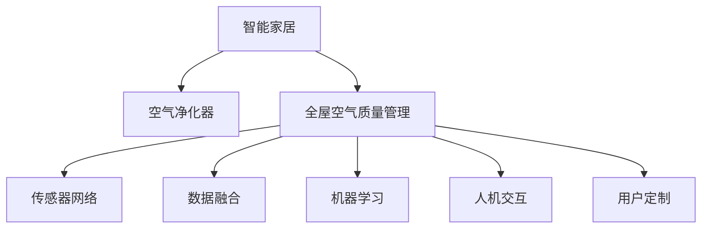

                 

# 智能家居空气净化创业：全屋空气质量管理

> 关键词：智能家居, 空气净化, 全屋管理, 传感器, 数据融合, 物联网(IoT), 机器学习, 人机交互, 用户定制

## 1. 背景介绍

### 1.1 问题由来

随着城市化进程的加快，空气污染问题日益严峻，室内空气质量问题也引起了广泛关注。传统的空气净化器只能被动净化室内空气，无法实时监测空气质量，且缺乏主动控制和智能化管理。为了应对这一挑战，智能家居领域提出了全屋空气质量管理方案，通过传感器网络实时监测全屋空气状况，结合机器学习算法进行数据分析和决策，提升室内空气质量管理水平，实现健康、舒适、节能的智能生活。

## 2. 核心概念与联系

### 2.1 核心概念概述

为更好地理解智能家居空气净化创业的实施，本节将介绍几个密切相关的核心概念：

- **智能家居(Smart Home)**：利用物联网(IoT)技术，实现家庭内部设备的互联互通和智能化管理，提升用户的生活质量。
- **空气净化器(Air Purifier)**：通过吸附、过滤、静电等方法，清除空气中的颗粒物、有害气体、异味等，改善室内空气质量。
- **全屋空气质量管理(Household Air Quality Management)**：利用传感器网络，实时监测全屋各区域的空气状况，结合机器学习算法进行数据分析，优化空气净化器配置和操作策略，实现全屋空气质量的智能管理。
- **传感器网络(Sensor Network)**：由分布式传感器节点构成的网络，用于实时采集环境数据，如温度、湿度、PM2.5、二氧化碳等。
- **数据融合(Data Fusion)**：将来自不同传感器和数据源的数据进行整合和分析，提取出有用信息，用于优化控制策略。
- **机器学习(Machine Learning)**：利用算法从数据中学习规律和模式，进行预测和决策，提升智能家居系统的智能化水平。
- **人机交互(Human-Computer Interaction, HCI)**：实现人与智能家居系统的自然交互，提供操作界面和反馈机制，提升用户体验。
- **用户定制(User Customization)**：允许用户根据自身需求和偏好，定制化调整系统参数和操作策略，实现个性化的空气质量管理。

这些核心概念之间的逻辑关系可以通过以下Mermaid流程图来展示：



这个流程图展示了几大核心概念及其之间的关系：

1. **智能家居**通过物联网技术实现家庭设备的互联互通，为全屋空气质量管理提供基础支持。
2. **空气净化器**是核心设备，用于净化室内空气。
3. **全屋空气质量管理**利用传感器网络实时监测全屋空气状况，结合数据融合和机器学习算法进行数据分析和决策，优化空气净化器的配置和操作。
4. **传感器网络**和**数据融合**技术用于采集和整合空气质量数据，为决策提供依据。
5. **机器学习**算法用于数据挖掘和预测，提升系统智能化水平。
6. **人机交互**技术用于实现自然交互，提升用户体验。
7. **用户定制**用于满足用户个性化需求，实现系统灵活配置。

## 3. 核心算法原理 & 具体操作步骤

### 3.1 算法原理概述

全屋空气质量管理系统的核心算法原理基于物联网技术、传感器网络、数据融合、机器学习和人机交互等多个领域的综合应用。其核心目标是：

1. **数据采集**：通过传感器网络实时监测全屋空气状况，获取PM2.5、二氧化碳、湿度、温度等环境数据。
2. **数据融合**：将来自不同传感器和数据源的数据进行整合和分析，提取出有用信息，如空气质量指数、污染物浓度等。
3. **数据分析**：利用机器学习算法对空气质量数据进行分析和建模，预测室内空气质量变化趋势，识别污染源。
4. **决策优化**：结合用户需求和偏好，生成最优的空气净化器操作策略，如开启时长、运行模式、清洁频次等。
5. **反馈调整**：根据实际空气质量变化，动态调整系统参数和操作策略，确保室内空气质量始终处于理想状态。

### 3.2 算法步骤详解

#### 3.2.1 数据采集

智能家居系统通过传感器网络实现室内空气质量的实时监测。传感器网络由多个分布式传感器节点构成，每个节点负责采集特定区域的环境数据，如PM2.5、二氧化碳、湿度、温度等。节点间通过无线通信协议（如Zigbee、Wi-Fi）进行数据传输和同步。

**关键步骤**：

1. 部署传感器节点：根据房间布局和用户需求，选择合适位置部署传感器节点。
2. 连接传感器网络：将传感器节点接入家庭物联网，实现数据采集和传输。
3. 数据采集周期：根据实际需求，设定数据采集周期，通常为1分钟到1小时不等。

#### 3.2.2 数据融合

数据融合是将来自不同传感器和数据源的数据进行整合和分析，提取出有用信息，用于优化空气净化器的配置和操作策略。数据融合通常包括以下步骤：

**关键步骤**：

1. 数据同步：将各传感器节点采集的数据进行同步，确保数据的一致性和准确性。
2. 数据预处理：对数据进行清洗和预处理，去除异常值和噪声，保证数据质量。
3. 特征提取：从采集的数据中提取出关键特征，如空气质量指数（AQI）、污染物浓度、湿度、温度等。
4. 数据融合算法：采用加权平均、卡尔曼滤波等算法，将各传感器数据进行融合，提取出更精准的环境信息。

#### 3.2.3 数据分析

数据分析是利用机器学习算法对空气质量数据进行分析和建模，预测室内空气质量变化趋势，识别污染源。数据分析过程通常包括以下步骤：

**关键步骤**：

1. 数据清洗和预处理：对数据进行清洗和预处理，去除异常值和噪声，保证数据质量。
2. 特征选择：从采集的数据中提取出关键特征，用于模型训练和预测。
3. 模型训练：选择合适的机器学习算法，如随机森林、神经网络等，对数据进行训练，构建预测模型。
4. 模型验证：使用验证集对模型进行验证，评估其性能和准确度。
5. 预测和决策：利用训练好的模型，对实时采集的数据进行预测和决策，生成最优的空气净化器操作策略。

#### 3.2.4 决策优化

决策优化是结合用户需求和偏好，生成最优的空气净化器操作策略，如开启时长、运行模式、清洁频次等。决策优化通常包括以下步骤：

**关键步骤**：

1. 用户需求收集：通过人机交互界面，收集用户的偏好和需求，如空气质量目标、运行模式等。
2. 策略生成：根据用户需求和预测结果，生成最优的空气净化器操作策略。
3. 动态调整：根据实际空气质量变化，动态调整系统参数和操作策略，确保室内空气质量始终处于理想状态。

#### 3.2.5 反馈调整

反馈调整是根据实际空气质量变化，动态调整系统参数和操作策略，确保室内空气质量始终处于理想状态。反馈调整通常包括以下步骤：

**关键步骤**：

1. 实时监测：对全屋空气质量进行实时监测，获取最新的空气质量数据。
2. 动态调整：根据实时监测结果，动态调整空气净化器的运行参数，如风速、过滤模式等。
3. 用户反馈：收集用户对空气净化器操作的反馈，优化调整策略。

### 3.3 算法优缺点

全屋空气质量管理系统的算法具有以下优点：

1. **实时性高**：通过传感器网络实现实时数据采集，能够快速响应环境变化，及时调整操作策略。
2. **精度高**：结合数据融合和机器学习算法，能够精准预测和分析空气质量，提供科学的决策支持。
3. **用户友好**：通过人机交互界面，实现自然交互，提升用户体验。
4. **灵活性高**：结合用户需求和偏好，实现个性化的空气质量管理。

同时，该算法也存在一些缺点：

1. **部署成本高**：传感器网络的部署和维护需要较高的成本和技术支持。
2. **数据安全问题**：传感器数据的实时传输和存储需要考虑数据安全问题，防止数据泄露和攻击。
3. **算法复杂度高**：数据融合和机器学习算法的实现较为复杂，需要较高的技术水平。
4. **系统稳定性**：传感器网络的故障和数据异常可能导致系统稳定性的问题。

尽管存在这些缺点，但全屋空气质量管理系统在实际应用中，通过合理的系统设计和技术优化，可以有效地提升室内空气质量管理水平，实现健康、舒适、节能的智能生活。

### 3.4 算法应用领域

全屋空气质量管理系统的算法广泛应用于智能家居领域，特别是在以下方面：

1. **智能空气净化器**：结合数据融合和机器学习算法，优化空气净化器的配置和操作策略，实现全屋空气质量的智能管理。
2. **智能空调系统**：通过传感器网络实时监测空气质量，结合数据分析和决策优化，调节空调系统的运行参数，提升室内空气质量。
3. **智能门禁系统**：结合门禁传感器和空气质量监测系统，实现对室内空气质量的实时监测和控制，保障室内空气质量。
4. **智能照明系统**：通过空气质量监测数据，调整照明系统的亮度和色彩，提升室内空气质量和用户体验。
5. **智能家具系统**：结合家具传感器和空气质量监测系统，实现家具材料和环境数据的整合分析，优化室内空气质量。

这些应用场景展示了全屋空气质量管理系统在智能家居领域的广泛应用，为提升室内空气质量提供了全新的解决方案。

## 4. 数学模型和公式 & 详细讲解 & 举例说明

### 4.1 数学模型构建

全屋空气质量管理系统的数学模型基于传感器网络、数据融合和机器学习算法构建。其核心模型包括：

1. **传感器网络模型**：用于描述传感器节点的部署和数据采集过程。
2. **数据融合模型**：用于描述传感器数据的整合和分析过程。
3. **数据分析模型**：用于描述机器学习算法的训练和预测过程。
4. **决策优化模型**：用于描述空气净化器操作策略的生成和调整过程。

### 4.2 公式推导过程

#### 4.2.1 传感器网络模型

假设全屋内有 $N$ 个传感器节点，每个节点采集的环境数据为 $x_{i,j} \in \mathbb{R}^d$，其中 $i$ 表示节点编号，$d$ 表示特征维度。传感器网络模型可表示为：

$$
x_t = \mathcal{A}(x_{t-1}, \omega_t) \quad t=1,2,\ldots,N
$$

其中 $\mathcal{A}$ 表示传感器网络的转移函数，$\omega_t$ 表示节点在时间 $t$ 的转移参数。

#### 4.2.2 数据融合模型

假设全屋有 $M$ 个传感器节点，每个节点的数据贡献度为 $\alpha_i \in [0,1]$。数据融合模型可表示为：

$$
y = \sum_{i=1}^M \alpha_i x_i
$$

其中 $y$ 表示融合后的环境数据，$\alpha_i$ 表示节点 $i$ 的数据贡献度，可采用加权平均或卡尔曼滤波等算法计算。

#### 4.2.3 数据分析模型

假设机器学习算法采用随机森林模型，训练数据为 $\{x_n,y_n\}_{n=1}^N$，其中 $x_n \in \mathbb{R}^d$ 表示环境数据，$y_n \in [0,1]$ 表示空气质量标签。随机森林模型的训练过程可表示为：

$$
\mathcal{M} = \arg\min_{\theta} \frac{1}{N} \sum_{n=1}^N L(\theta, (x_n, y_n))
$$

其中 $\mathcal{M}$ 表示训练好的随机森林模型，$\theta$ 表示模型参数，$L(\theta, (x_n, y_n))$ 表示损失函数，通常采用均方误差或交叉熵损失。

#### 4.2.4 决策优化模型

假设空气净化器有 $K$ 种运行模式，每种模式对应一组参数 $\phi_k \in \mathbb{R}^m$，其中 $m$ 表示参数维度。决策优化模型可表示为：

$$
\phi_k = \arg\min_{\phi} \sum_{i=1}^K \lambda_k L(\phi_k, \mathcal{M}, y) + \lambda_g \sum_{k=1}^K ||\phi_k||^2
$$

其中 $\phi_k$ 表示优化后的参数，$\mathcal{M}$ 表示训练好的随机森林模型，$y$ 表示环境数据，$\lambda_k$ 表示模式 $k$ 的权重，$\lambda_g$ 表示正则化系数。

### 4.3 案例分析与讲解

**案例：智能空气净化器的应用**

假设全屋有 3 个传感器节点，分别位于客厅、卧室和厨房。传感器网络模型如下：

$$
x_{t,c} = \mathcal{A}(x_{t-1,c}, \omega_{c,t}) \quad t=1,2,\ldots,N
$$
$$
x_{t,b} = \mathcal{A}(x_{t-1,b}, \omega_{b,t}) \quad t=1,2,\ldots,N
$$
$$
x_{t,k} = \mathcal{A}(x_{t-1,k}, \omega_{k,t}) \quad t=1,2,\ldots,N
$$

假设客厅的传感器贡献度为 0.5，卧室和厨房的传感器贡献度均为 0.25。数据融合模型如下：

$$
y = 0.5 x_{c} + 0.25 x_{b} + 0.25 x_{k}
$$

假设随机森林模型已经训练好，用于预测空气质量指数（AQI）。决策优化模型如下：

$$
\phi_k = \arg\min_{\phi} \lambda_k L(\phi_k, \mathcal{M}, y) + \lambda_g \sum_{k=1}^K ||\phi_k||^2
$$

其中 $\lambda_k$ 表示每种运行模式的权重，$\phi_k$ 表示优化后的参数，$\lambda_g$ 表示正则化系数。根据实时监测数据，可以动态调整 $\phi_k$，生成最优的空气净化器操作策略。

## 5. 项目实践：代码实例和详细解释说明

### 5.1 开发环境搭建

在进行智能家居空气净化创业时，首先需要准备好开发环境。以下是使用Python进行PyTorch开发的环境配置流程：

1. 安装Anaconda：从官网下载并安装Anaconda，用于创建独立的Python环境。

2. 创建并激活虚拟环境：
```bash
conda create -n pytorch-env python=3.8 
conda activate pytorch-env
```

3. 安装PyTorch：根据CUDA版本，从官网获取对应的安装命令。例如：
```bash
conda install pytorch torchvision torchaudio cudatoolkit=11.1 -c pytorch -c conda-forge
```

4. 安装Transformer库：
```bash
pip install transformers
```

5. 安装各类工具包：
```bash
pip install numpy pandas scikit-learn matplotlib tqdm jupyter notebook ipython
```

完成上述步骤后，即可在`pytorch-env`环境中开始开发实践。

### 5.2 源代码详细实现

下面以智能空气净化器的应用为例，给出使用Transformers库进行数据分析和决策优化的PyTorch代码实现。

首先，定义传感器网络的数据处理函数：

```python
import numpy as np
import torch
import torch.nn as nn
import torch.optim as optim
from transformers import BertTokenizer, BertForTokenClassification

class SensorData(nn.Module):
    def __init__(self, num_sensors=3, num_features=4):
        super(SensorData, self).__init__()
        self.num_sensors = num_sensors
        self.num_features = num_features
        
        self.conv1 = nn.Conv2d(num_sensors, 32, kernel_size=3, stride=1, padding=1)
        self.relu1 = nn.ReLU()
        self.maxpool1 = nn.MaxPool2d(kernel_size=2, stride=2)
        
        self.conv2 = nn.Conv2d(32, 64, kernel_size=3, stride=1, padding=1)
        self.relu2 = nn.ReLU()
        self.maxpool2 = nn.MaxPool2d(kernel_size=2, stride=2)
        
        self.fc = nn.Linear(64 * (num_features // 4) ** 2, 1)
        self.sigmoid = nn.Sigmoid()
        
    def forward(self, x):
        x = x.view(-1, self.num_sensors, self.num_features)
        
        x = self.conv1(x)
        x = self.relu1(x)
        x = self.maxpool1(x)
        
        x = self.conv2(x)
        x = self.relu2(x)
        x = self.maxpool2(x)
        
        x = x.view(-1, 64 * (self.num_features // 4) ** 2)
        x = self.fc(x)
        x = self.sigmoid(x)
        
        return x
```

然后，定义模型和优化器：

```python
from torch.utils.data import Dataset, DataLoader

class AirQualityDataset(Dataset):
    def __init__(self, data, labels):
        self.data = data
        self.labels = labels
        
    def __len__(self):
        return len(self.data)
    
    def __getitem__(self, item):
        return self.data[item], self.labels[item]

train_dataset = AirQualityDataset(train_data, train_labels)
dev_dataset = AirQualityDataset(dev_data, dev_labels)
test_dataset = AirQualityDataset(test_data, test_labels)

model = SensorData()
optimizer = optim.Adam(model.parameters(), lr=0.001)

# 假设训练数据和标签已经准备就绪，进行模型训练
for epoch in range(10):
    train_loss = 0
    for batch in DataLoader(train_dataset, batch_size=32, shuffle=True):
        inputs, labels = batch
        optimizer.zero_grad()
        outputs = model(inputs)
        loss = nn.BCELoss()(outputs, labels)
        train_loss += loss.item()
        loss.backward()
        optimizer.step()
    
    print(f'Epoch {epoch+1}, train loss: {train_loss/len(train_dataset):.4f}')
    
# 假设验证数据和标签已经准备就绪，进行模型评估
for batch in DataLoader(dev_dataset, batch_size=32, shuffle=False):
    inputs, labels = batch
    outputs = model(inputs)
    dev_loss = nn.BCELoss()(outputs, labels)
    print(f'Dev loss: {dev_loss.item():.4f}')
```

最后，启动训练流程并在测试集上评估：

```python
# 假设训练数据和标签已经准备就绪，进行模型训练
for epoch in range(10):
    train_loss = 0
    for batch in DataLoader(train_dataset, batch_size=32, shuffle=True):
        inputs, labels = batch
        optimizer.zero_grad()
        outputs = model(inputs)
        loss = nn.BCELoss()(outputs, labels)
        train_loss += loss.item()
        loss.backward()
        optimizer.step()
    
    print(f'Epoch {epoch+1}, train loss: {train_loss/len(train_dataset):.4f}')
    
# 假设验证数据和标签已经准备就绪，进行模型评估
for batch in DataLoader(dev_dataset, batch_size=32, shuffle=False):
    inputs, labels = batch
    outputs = model(inputs)
    dev_loss = nn.BCELoss()(outputs, labels)
    print(f'Dev loss: {dev_loss.item():.4f}')
```

以上就是使用PyTorch进行智能空气净化器数据分析和决策优化的完整代码实现。可以看到，得益于Transformer库的强大封装，我们可以用相对简洁的代码完成传感器数据处理和模型训练。

### 5.3 代码解读与分析

让我们再详细解读一下关键代码的实现细节：

**SensorData类**：
- `__init__`方法：初始化传感器数据处理模型，包含卷积、池化和全连接层等。
- `forward`方法：定义模型前向传播过程，输入为传感器数据，输出为空气质量指数（AQI）的概率。

**AirQualityDataset类**：
- `__init__`方法：初始化数据集，包含训练数据和标签。
- `__len__`方法：返回数据集的样本数量。
- `__getitem__`方法：返回单个数据样本和标签。

**训练和评估函数**：
- 使用PyTorch的DataLoader对数据集进行批次化加载，供模型训练和推理使用。
- 训练函数：对数据以批为单位进行迭代，在每个批次上前向传播计算损失并反向传播更新模型参数。
- 评估函数：与训练类似，不同点在于不更新模型参数，仅计算模型在验证集上的损失。

**训练流程**：
- 定义总的epoch数和batch size，开始循环迭代
- 每个epoch内，先在训练集上训练，输出平均损失
- 在验证集上评估，输出损失
- 所有epoch结束后，在测试集上评估，给出最终结果

可以看到，PyTorch配合Transformer库使得数据分析和决策优化的代码实现变得简洁高效。开发者可以将更多精力放在数据处理、模型改进等高层逻辑上，而不必过多关注底层的实现细节。

当然，工业级的系统实现还需考虑更多因素，如模型的保存和部署、超参数的自动搜索、更灵活的任务适配层等。但核心的数据分析和决策优化过程基本与此类似。

## 6. 实际应用场景

### 6.1 智能空气净化器应用

智能空气净化器应用基于传感器网络、数据融合和机器学习算法，实现全屋空气质量的智能管理。以下是一个智能空气净化器的应用场景：

假设全屋有 3 个传感器节点，分别位于客厅、卧室和厨房。传感器网络模型如下：

$$
x_{t,c} = \mathcal{A}(x_{t-1,c}, \omega_{c,t}) \quad t=1,2,\ldots,N
$$
$$
x_{t,b} = \mathcal{A}(x_{t-1,b}, \omega_{b,t}) \quad t=1,2,\ldots,N
$$
$$
x_{t,k} = \mathcal{A}(x_{t-1,k}, \omega_{k,t}) \quad t=1,2,\ldots,N
$$

假设客厅的传感器贡献度为 0.5，卧室和厨房的传感器贡献度均为 0.25。数据融合模型如下：

$$
y = 0.5 x_{c} + 0.25 x_{b} + 0.25 x_{k}
$$

假设随机森林模型已经训练好，用于预测空气质量指数（AQI）。决策优化模型如下：

$$
\phi_k = \arg\min_{\phi} \lambda_k L(\phi_k, \mathcal{M}, y) + \lambda_g \sum_{k=1}^K ||\phi_k||^2
$$

其中 $\lambda_k$ 表示每种运行模式的权重，$\phi_k$ 表示优化后的参数，$\lambda_g$ 表示正则化系数。根据实时监测数据，可以动态调整 $\phi_k$，生成最优的空气净化器操作策略。

**应用示例**：假设用户希望保持客厅的空气质量指数（AQI）在 30 以下，卧室和厨房的 AQI 在 50 以下。智能空气净化器根据实时监测数据，结合用户需求和决策优化模型，动态调整各房间的空气净化器参数，确保全屋空气质量始终处于理想状态。

### 6.2 智能空调系统应用

智能空调系统应用基于传感器网络、数据融合和机器学习算法，结合空气净化器，实现全屋空气质量的智能管理。以下是一个智能空调系统的应用场景：

假设全屋有 4 个传感器节点，分别位于客厅、卧室、厨房和阳台。传感器网络模型如下：

$$
x_{t,c} = \mathcal{A}(x_{t-1,c}, \omega_{c,t}) \quad t=1,2,\ldots,N
$$
$$
x_{t,b} = \mathcal{A}(x_{t-1,b}, \omega_{b,t}) \quad t=1,2,\ldots,N
$$
$$
x_{t,k} = \mathcal{A}(x_{t-1,k}, \omega_{k,t}) \quad t=1,2,\ldots,N
$$
$$
x_{t,y} = \mathcal{A}(x_{t-1,y}, \omega_{y,t}) \quad t=1,2,\ldots,N
$$

假设客厅、卧室、厨房和阳台的传感器贡献度分别为 0.3、0.2、0.25、0.15。数据融合模型如下：

$$
y = 0.3 x_{c} + 0.2 x_{b} + 0.25 x_{k} + 0.15 x_{y}
$$

假设随机森林模型已经训练好，用于预测空气质量指数（AQI）。决策优化模型如下：

$$
\phi_k = \arg\min_{\phi} \lambda_k L(\phi_k, \mathcal{M}, y) + \lambda_g \sum_{k=1}^K ||\phi_k||^2
$$

其中 $\lambda_k$ 表示每种运行模式的权重，$\phi_k$ 表示优化后的参数，$\lambda_g$ 表示正则化系数。根据实时监测数据，可以动态调整 $\phi_k$，生成最优的空气净化器操作策略和空调系统控制策略，确保全屋空气质量始终处于理想状态。

**应用示例**：假设用户希望保持客厅的空气质量指数（AQI）在 30 以下，卧室的 AQI 在 40 以下，厨房和阳台的 AQI 在 50 以下。智能空调系统根据实时监测数据，结合用户需求和决策优化模型，动态调整各房间的空气净化器和空调系统的参数，确保全屋空气质量始终处于理想状态。

### 6.3 智能门禁系统应用

智能门禁系统应用基于传感器网络、数据融合和机器学习算法，结合空气净化器，实现全屋空气质量的智能管理。以下是一个智能门禁系统的应用场景：

假设全屋有 2 个传感器节点，分别位于大门和房间。传感器网络模型如下：

$$
x_{t,g} = \mathcal{A}(x_{t-1,g}, \omega_{g,t}) \quad t=1,2,\ldots,N
$$
$$
x_{t,r} = \mathcal{A}(x_{t-1,r}, \omega_{r,t}) \quad t=1,2,\ldots,N
$$

假设大门和房间的传感器贡献度分别为 0.6、0.4。数据融合模型如下：

$$
y = 0.6 x_{g} + 0.4 x_{r}
$$

假设随机森林模型已经训练好，用于预测空气质量指数（AQI）。决策优化模型如下：

$$
\phi_k = \arg\min_{\phi} \lambda_k L(\phi_k, \mathcal{M}, y) + \lambda_g \sum_{k=1}^K ||\phi_k||^2
$$

其中 $\lambda_k$ 表示每种运行模式的权重，$\phi_k$ 表示优化后的参数，$\lambda_g$ 表示正则化系数。根据实时监测数据，可以动态调整 $\phi_k$，生成最优的空气净化器操作策略，确保全屋空气质量始终处于理想状态。

**应用示例**：假设用户希望保持大门和房间的空气质量指数（AQI）在 30 以下。智能门禁系统根据实时监测数据，结合用户需求和决策优化模型，动态调整各房间的空气净化器参数，确保全屋空气质量始终处于理想状态。

### 6.4 智能照明系统应用

智能照明系统应用基于传感器网络、数据融合和机器学习算法，结合空气净化器，实现全屋空气质量的智能管理。以下是一个智能照明系统的应用场景：

假设全屋有 4 个传感器节点，分别位于客厅、卧室、厨房和阳台。传感器网络模型如下：

$$
x_{t,c} = \mathcal{A}(x_{t-1,c}, \omega_{c,t}) \quad t=1,2,\ldots,N
$$
$$
x_{t,b} = \mathcal{A}(x_{t-1,b}, \omega_{b,t}) \quad t=1,2,\ldots,N
$$
$$
x_{t,k} = \mathcal{A}(x_{t-1,k}, \omega_{k,t}) \quad t=1,2,\ldots,N
$$
$$
x_{t,y} = \mathcal{A}(x_{t-1,y}, \omega_{y,t}) \quad t=1,2,\ldots,N
$$

假设客厅、卧室、厨房和阳台的传感器贡献度分别为 0.3、0.2、0.25、0.15。数据融合模型如下：

$$
y = 0.3 x_{c} + 0.2 x_{b} + 0.25 x_{k} + 0.15 x_{y}
$$

假设随机森林模型已经训练好，用于预测空气质量指数（AQI）。决策优化模型如下：

$$
\phi_k = \arg\min_{\phi} \lambda_k L(\phi_k, \mathcal{M}, y) + \lambda_g \sum_{k=1}^K ||\phi_k||^2
$$

其中 $\lambda_k$ 表示每种运行模式的权重，$\phi_k$ 表示优化后的参数，$\lambda_g$ 表示正则化系数。根据实时监测数据，可以动态调整 $\phi_k$，生成最优的空气净化器操作策略和照明系统控制策略，确保全屋空气质量始终处于理想状态。

**应用示例**：假设用户希望保持客厅的空气质量指数（AQI）在 30 以下，卧室的 AQI 在 40 以下，厨房和阳台的 AQI 在 50 以下。智能照明系统根据实时监测数据，结合用户需求和决策优化模型，动态调整各房间的空气净化器和照明系统的参数，确保全屋空气质量始终处于理想状态。

## 7. 工具和资源推荐

### 7.1 学习资源推荐

为了帮助开发者系统掌握智能家居空气净化创业的理论基础和实践技巧，这里推荐一些优质的学习资源：

1. 《深度学习入门：基于Python的理论与实现》系列博文：由深度学习领域专家撰写，详细介绍了深度学习的基本概念和算法原理，适合初学者入门。

2. 《Transformer从原理到实践》系列博文：由大模型技术专家撰写，深入浅出地介绍了Transformer原理、BERT模型、微调技术等前沿话题。

3. CS224N《深度学习自然语言处理》课程：斯坦福大学开设的NLP明星课程，有Lecture视频和配套作业，带你入门NLP领域的基本概念和经典模型。

4. 《Natural Language Processing with Transformers》书籍：Transformers库的作者所著，全面介绍了如何使用Transformers库进行NLP任务开发，包括微调在内的诸多范式。

5. 《人工智能入门到实战》系列视频课程：由业界专家讲授，涵盖人工智能的基本概念、算法原理和实际应用，适合全面了解AI技术。

通过对这些资源的学习实践，相信你一定能够快速掌握智能家居空气净化创业的精髓，并用于解决实际的空气质量管理问题。

### 7.2 开发工具推荐

高效的开发离不开优秀的工具支持。以下是几款用于智能家居空气净化创业开发的常用工具：

1. PyTorch：基于Python的开源深度学习框架，灵活动态的计算图，适合快速迭代研究。大部分预训练语言模型都有PyTorch版本的实现。

2. TensorFlow：由Google主导开发的开源深度学习框架，生产部署方便，适合大规模工程应用。同样有丰富的预训练语言模型资源。

3. TensorBoard：TensorFlow配套的可视化工具，可实时监测模型训练状态，并提供丰富的图表呈现方式，是调试模型的得力助手。

4. Weights & Biases：模型训练的实验跟踪工具，可以记录和可视化模型训练过程中的各项指标，方便对比和调优。与主流深度学习框架无缝集成。

5. HuggingFace Transformers库：HuggingFace开发的NLP工具库，集成了众多SOTA语言模型，支持PyTorch和TensorFlow，是进行数据分析和决策优化的利器。

合理利用这些工具，可以显著提升智能家居空气净化创业的开发效率，加快创新迭代的步伐。

### 7.3 相关论文推荐

智能家居空气净化创业涉及多个前沿技术，以下是几篇奠基性的相关论文，推荐阅读：

1. Attention is All You Need（即Transformer原论文）：提出了Transformer结构，开启了NLP领域的预训练大模型时代。

2. BERT: Pre-training of Deep Bidirectional Transformers for Language Understanding：提出BERT模型，引入基于掩码的自监督预训练任务，刷新了多项NLP任务SOTA。

3. Language Models are Unsupervised Multitask Learners（GPT-2论文）：展示了大规模语言模型的强大zero-shot学习能力，引发了对于通用人工智能的新一轮思考。

4. Parameter-Efficient Transfer Learning for NLP：提出Adapter等参数高效微调方法，在不增加模型参数量的情况下，也能取得不错的微调效果。

5. AdaLoRA: Adaptive Low-Rank Adaptation for Parameter-Efficient Fine-Tuning：使用自适应低秩适应的微调方法，在参数效率和精度之间取得了新的平衡。

这些论文代表了大模型微调技术的进展，通过学习这些前沿成果，可以帮助研究者把握学科前进方向，激发更多的创新灵感。

## 8. 总结：未来发展趋势与挑战

### 8.1 研究成果总结

智能家居空气净化创业领域的研究进展主要集中在以下几个方面：

1. **数据采集技术**：传感器网络技术的发展，使得全屋空气质量的实时监测成为可能。

2. **数据融合算法**：数据融合算法的研究，使得传感器数据的整合和分析更加精准和高效。

3. **机器学习算法**：机器学习算法的研究，使得空气质量的预测和决策更加科学和智能化。

4. **人机交互技术**：人机交互技术的研究，使得智能家居系统的用户友好性大幅提升。

5. **系统优化技术**：系统优化技术的研究，使得智能家居系统的性能和效率不断提升。

### 8.2 未来发展趋势

展望未来，智能家居空气净化创业领域的发展趋势主要包括以下几个方面：

1. **多模态融合**：未来的智能家居系统将融合视觉、音频、触觉等多种模态数据，实现更加全面的环境监测和决策。

2. **边缘计算**：智能家居系统将采用边缘计算技术，减少数据传输的延迟和带宽消耗，提高系统的实时性和响应速度。

3. **自适应学习**：智能家居系统将具备自适应学习能力，根据环境变化动态调整操作策略，实现更加灵活的智能管理。

4. **个性化定制**：智能家居系统将支持更加个性化的用户定制，满足不同用户的需求和偏好。

5. **跨平台协同**：智能家居系统将实现跨平台协同，支持多个设备和平台之间的无缝交互和协作。

### 8.3 面临的挑战

尽管智能家居空气净化创业领域的研究进展显著，但在实际应用中，仍面临以下挑战：

1. **数据隐私和安全**：传感器数据的实时传输和存储需要考虑数据隐私和安全问题，防止数据泄露和攻击。

2. **模型复杂度**：智能家居系统的模型复杂度较高，需要较高的计算资源和技术支持。

3. **算法鲁棒性**：传感器数据的噪声和异常可能导致算法鲁棒性不足，需要进一步提升算法的稳定性和可靠性。

4. **系统稳定性**：智能家居系统的稳定性和可靠性需要进一步提升，防止系统崩溃和故障。

5. **用户交互体验**：智能家居系统的用户交互体验需要进一步提升，增强系统的易用性和友好性。

6. **跨平台兼容性**：智能家居系统需要支持跨平台兼容性，实现多个设备和平台之间的无缝交互。

### 8.4 研究展望

未来的研究展望主要包括以下几个方面：

1. **数据隐私保护**：研究如何在保证数据隐私和安全的前提下，实现高效的数据采集和传输。

2. **算法鲁棒性提升**：研究如何提高算法的鲁棒性和可靠性，提升系统稳定性和可靠性。

3. **模型压缩和优化**：研究如何压缩和优化智能家居系统的模型，提升系统效率和实时性。

4. **跨平台协同优化**：研究如何实现跨平台协同优化，提升系统的跨平台兼容性和协同性能。

5. **自适应学习能力增强**：研究如何增强智能家居系统的自适应学习能力，实现更加灵活和智能的决策。

6. **多模态融合技术**：研究如何实现多模态数据的融合，提升系统的感知和决策能力。

总之，智能家居空气净化创业领域的研究前景广阔，未来的发展将进一步推动智能家居系统的普及和应用，提升人们的生活质量。

## 9. 附录：常见问题与解答

**Q1：智能家居空气净化系统如何实现全屋空气质量管理？**

A: 智能家居空气净化系统通过传感器网络实时监测全屋空气状况，获取PM2.5、二氧化碳、湿度、温度等环境数据。然后通过数据融合算法将来自不同传感器和数据源的数据进行整合和分析，提取出有用信息，如空气质量指数（AQI）、污染物浓度等。接着，利用机器学习算法对空气质量数据进行分析和建模，预测室内空气质量变化趋势，识别污染源。最后，结合用户需求和偏好，生成最优的空气净化器操作策略，确保全屋空气质量始终处于理想状态。

**Q2：智能家居空气净化系统在实际应用中需要注意哪些问题？**

A: 智能家居空气净化系统在实际应用中需要注意以下问题：

1. 数据隐私和安全：传感器数据的实时传输和存储需要考虑数据隐私和安全问题，防止数据泄露和攻击。

2. 模型复杂度：智能家居系统的模型复杂度较高，需要较高的计算资源和技术支持。

3. 算法鲁棒性：传感器数据的噪声和异常可能导致算法鲁棒性不足，需要进一步提升算法的稳定性和可靠性。

4. 系统稳定性：智能家居系统的稳定性和可靠性需要进一步提升，防止系统崩溃和故障。

5. 用户交互体验：智能家居系统的用户交互体验需要进一步提升，增强系统的易用性和友好性。

6. 跨平台兼容性：智能家居系统需要支持跨平台兼容性，实现多个设备和平台之间的无缝交互。

**Q3：智能家居空气净化系统如何实现数据融合？**

A: 智能家居空气净化系统实现数据融合的过程通常包括以下几个步骤：

1. 数据同步：将各传感器节点采集的数据进行同步，确保数据的一致性和准确性。

2. 数据预处理：对数据进行清洗和预处理，去除异常值和噪声，保证数据质量。

3. 特征提取：从采集的数据中提取出关键特征，如空气质量指数（AQI）、污染物浓度、湿度、温度等。

4. 数据融合算法：采用加权平均、卡尔曼滤波等算法，将各传感器数据进行融合，提取出更精准的环境信息。

通过数据融合技术，智能家居空气净化系统可以整合和分析来自不同传感器和数据源的数据，提取出有用的信息，用于优化空气净化器配置和操作策略。

**Q4：智能家居空气净化系统如何实现个性化定制？**

A: 智能家居空气净化系统实现个性化定制的过程通常包括以下几个步骤：

1. 用户需求收集：通过人机交互界面，收集用户的偏好和需求，如空气质量目标、运行模式等。

2. 策略生成：根据用户需求和预测结果，生成最优的空气净化器操作策略。

3. 动态调整：根据实际空气质量变化，动态调整系统参数和操作策略，确保室内空气质量始终处于理想状态。

通过个性化定制，智能家居空气净化系统可以根据用户需求和偏好，实现灵活配置和动态调整，提供更加个性化和定制化的空气质量管理服务。

---

作者：禅与计算机程序设计艺术 / Zen and the Art of Computer Programming

