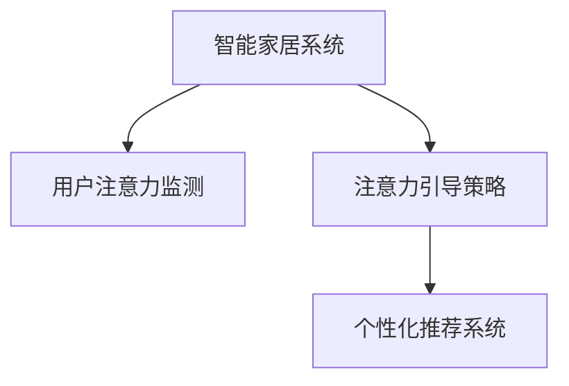

                 

# 智能家居系统的用户体验与注意力管理

## 1. 背景介绍

### 1.1 问题由来

随着物联网技术的发展，智能家居系统已经在家庭生活中逐渐普及。这些系统通过网络将各种家电、传感器、安防设备等连接起来，能够实现远程控制、智能监控、能效管理等功能。然而，尽管智能家居带来了便捷和舒适，用户的使用体验仍存在诸多不足。例如，系统界面操作繁琐、自动化程度不高、个性化推荐缺乏等问题，严重影响了用户的使用意愿和满意度。因此，提升智能家居系统的用户体验，成为当前研究的重要课题。

### 1.2 问题核心关键点

本研究的核心在于，如何通过注意力管理技术，提升智能家居系统的用户体验。注意力管理包括注意力的分配、保持和引导，通过用户对系统的注意力关注度，动态调整系统界面、功能和交互方式，提高用户的使用体验。核心技术包括：

1. **用户注意力监测**：通过眼动追踪、面部表情识别等技术，实时监测用户对系统的注意力分布。
2. **注意力引导策略**：基于用户注意力分布，动态调整系统界面的布局和交互方式，引导用户关注系统关键功能。
3. **个性化推荐系统**：根据用户注意力和行为数据，推荐最相关、最有用的家居场景和设备，提升用户满意度。

## 2. 核心概念与联系

### 2.1 核心概念概述

为更好地理解智能家居系统的用户体验与注意力管理，本节将介绍几个密切相关的核心概念：

- **智能家居系统**：通过物联网技术，将各种家电、传感器、安防设备等连接起来，实现远程控制、智能监控、能效管理等功能。
- **用户注意力监测**：通过眼动追踪、面部表情识别等技术，实时监测用户对系统的注意力分布。
- **注意力引导策略**：基于用户注意力分布，动态调整系统界面的布局和交互方式，引导用户关注系统关键功能。
- **个性化推荐系统**：根据用户注意力和行为数据，推荐最相关、最有用的家居场景和设备，提升用户满意度。

这些核心概念之间的逻辑关系可以通过以下Mermaid流程图来展示：



这个流程图展示了一个简单的智能家居系统的注意力管理过程：

1. 智能家居系统收集用户注意力数据。
2. 根据用户注意力数据，动态调整系统界面和交互方式。
3. 推荐系统根据用户注意力和行为数据，提供个性化推荐。

## 3. 核心算法原理 & 具体操作步骤
### 3.1 算法原理概述

智能家居系统的用户体验与注意力管理，本质上是一个通过注意力的动态调整，提升用户满意度的过程。其核心思想是：实时监测用户对系统的注意力分布，根据用户注意力动态调整界面布局和交互方式，引导用户关注系统关键功能。

形式化地，假设智能家居系统包含 $N$ 个功能模块，用户对各个功能的关注度可以用一个向量 $\mathbf{a} \in [0, 1]^N$ 表示，其中 $a_i$ 表示用户对第 $i$ 个功能的关注度。系统界面的布局和交互方式可以用一个向量 $\mathbf{x} \in \mathbb{R}^N$ 表示，其中 $x_i$ 表示第 $i$ 个功能在页面中的位置和交互方式。

系统的目标是找到一个最优的 $\mathbf{x}$，使得用户对系统功能的关注度最大化。即：

$$
\max_{\mathbf{x}} \sum_{i=1}^N a_i x_i
$$

通过梯度下降等优化算法，系统不断调整界面布局和交互方式，最小化损失函数 $\mathcal{L}$，使得系统界面的调整能够最大化用户对关键功能的关注度。

### 3.2 算法步骤详解

基于注意力管理的大智能家居系统，一般包括以下几个关键步骤：

**Step 1: 准备用户注意力数据**
- 选择合适的注意力监测技术，如眼动追踪、面部表情识别等，获取用户对系统界面的关注度数据。
- 数据预处理：对监测数据进行去噪、归一化等处理，去除异常数据。

**Step 2: 设计注意力引导策略**
- 确定用户关注度的权重，确定哪些功能是关键功能，哪些功能可以暂时隐藏。
- 设计界面布局和交互方式，包括按钮大小、位置、动画效果等。

**Step 3: 实现动态界面调整**
- 根据用户注意力分布，动态调整系统界面布局和交互方式，引导用户关注关键功能。
- 使用定时任务或事件触发器，定期更新界面布局和交互方式。

**Step 4: 开发个性化推荐系统**
- 收集用户行为数据，包括浏览历史、点击操作、使用频率等。
- 设计推荐模型，如协同过滤、基于内容的推荐、深度学习推荐等。
- 根据用户注意力和行为数据，动态调整推荐内容，提升用户满意度。

**Step 5: 测试和优化**
- 在实际用户中使用系统，收集反馈和行为数据。
- 根据用户反馈和行为数据，调整界面布局和推荐算法，持续优化系统性能。

以上是基于注意力管理的大智能家居系统的基本流程。在实际应用中，还需要针对具体场景和用户需求，对注意力监测、引导和推荐算法进行优化设计，以进一步提升用户体验。

### 3.3 算法优缺点

基于注意力管理的大智能家居系统具有以下优点：

1. 提升用户体验：通过动态调整系统界面和交互方式，引导用户关注关键功能，提升用户满意度和使用意愿。
2. 个性化推荐：根据用户注意力和行为数据，提供个性化的家居场景和设备推荐，提升用户体验。
3. 实时调整：通过实时监测用户注意力，动态调整界面布局和交互方式，快速响应用户需求。
4. 降低使用门槛：通过引导用户关注关键功能，简化操作流程，降低用户使用智能家居系统的门槛。

同时，该方法也存在一定的局限性：

1. 数据隐私问题：注意力监测需要收集用户的眼动追踪数据、面部表情数据等敏感信息，可能引发用户隐私担忧。
2. 技术复杂度：实现注意力监测、引导和推荐系统，需要集成多种先进技术，技术复杂度较高。
3. 资源消耗：实现动态界面调整和实时推荐，需要较高的计算和存储资源。
4. 用户适应性：用户习惯的差异可能导致注意力监测和引导策略效果不佳。

尽管存在这些局限性，但就目前而言，基于注意力管理的大智能家居系统仍是一种提升用户体验的重要手段。未来相关研究的重点在于如何进一步降低技术复杂度，提高隐私保护，同时兼顾用户适应性和系统性能。

### 3.4 算法应用领域

基于注意力管理的大智能家居系统已经在多个领域得到了应用，覆盖了智能家居系统中的各种功能模块，例如：

- **智能安防**：通过监测用户注意力，动态调整安防设备状态，如摄像头视角、灯光亮度等。
- **能源管理**：根据用户注意力，动态调整能源设备的开关状态，如空调温度、灯光亮度等。
- **娱乐系统**：根据用户注意力，推荐电视节目、音乐等娱乐内容，提升用户体验。
- **健康监测**：通过监测用户注意力和行为，提供个性化的健康建议和推荐。
- **智能照明**：根据用户注意力，调整灯光的亮度、颜色和亮度，营造舒适的家居氛围。

除了上述这些经典应用外，智能家居系统还在更多场景中得到了应用，如智能门锁、智能音箱、智能电视等，为用户的日常生活带来了便利。

## 4. 数学模型和公式 & 详细讲解
### 4.1 数学模型构建

本节将使用数学语言对智能家居系统的用户体验与注意力管理过程进行更加严格的刻画。

假设智能家居系统包含 $N$ 个功能模块，用户对各个功能的关注度可以用一个向量 $\mathbf{a} \in [0, 1]^N$ 表示，其中 $a_i$ 表示用户对第 $i$ 个功能的关注度。系统界面的布局和交互方式可以用一个向量 $\mathbf{x} \in \mathbb{R}^N$ 表示，其中 $x_i$ 表示第 $i$ 个功能在页面中的位置和交互方式。

定义系统界面的关注度损失函数为：

$$
\mathcal{L}(\mathbf{x}) = -\sum_{i=1}^N a_i \log f_i(\mathbf{x})
$$

其中 $f_i(\mathbf{x})$ 表示用户对第 $i$ 个功能的关注度函数，可以基于历史数据或实时监测数据进行建模。

### 4.2 公式推导过程

以下我们以用户注意力分布的回归模型为例，推导注意力引导策略的数学公式。

假设用户对系统的关注度分布可以用一个 $N$ 维向量 $\mathbf{a} \in [0, 1]^N$ 表示，其中 $a_i$ 表示用户对第 $i$ 个功能的关注度。根据注意力监测数据，可以得到一个 $N$ 维的关注度向量 $\mathbf{a} \in [0, 1]^N$。假设关注度向量 $\mathbf{a}$ 可以通过线性回归模型得到，模型形式为：

$$
\mathbf{a} = \mathbf{W} \mathbf{x} + \mathbf{b}
$$

其中 $\mathbf{W} \in \mathbb{R}^{N \times N}$ 为回归系数矩阵，$\mathbf{b} \in \mathbb{R}^N$ 为截距向量。则关注度损失函数可以表示为：

$$
\mathcal{L}(\mathbf{W}, \mathbf{b}) = -\sum_{i=1}^N a_i \log f_i(\mathbf{x})
$$

最小化关注度损失函数 $\mathcal{L}$，得到最优的回归系数 $\mathbf{W}$ 和截距向量 $\mathbf{b}$。根据回归模型，系统界面可以动态调整布局和交互方式，最大化用户对关键功能的关注度。

### 4.3 案例分析与讲解

以智能安防系统为例，分析如何通过注意力管理提升用户体验。

假设智能安防系统包含摄像头、报警器、门窗传感器等设备。用户对各个设备的关注度可以通过眼动追踪等技术监测得到，并建立线性回归模型进行预测。假设关注度模型为：

$$
a_i = W_{i1} x_{i1} + W_{i2} x_{i2} + \cdots + W_{iN} x_{iN} + b_i
$$

其中 $x_{ij}$ 表示第 $i$ 个设备的显示位置和交互方式，如摄像头的位置、报警器的显示时长等。通过最小化关注度损失函数，得到最优的回归系数 $W_{ij}$ 和截距 $b_i$，从而调整摄像头视角、报警器显示时长等，最大化用户对系统的关注度。

例如，用户在使用摄像头时，系统可以自动调整摄像头的视角，使其对准用户关注的区域；在使用报警器时，系统可以自动延长报警器的显示时长，提醒用户注意系统状态。通过这种方式，提升用户对系统功能的关注度，从而提升用户体验。

## 5. 项目实践：代码实例和详细解释说明
### 5.1 开发环境搭建

在进行智能家居系统用户体验与注意力管理实践前，我们需要准备好开发环境。以下是使用Python进行OpenCV和TensorFlow开发的环境配置流程：

1. 安装Anaconda：从官网下载并安装Anaconda，用于创建独立的Python环境。

2. 创建并激活虚拟环境：
```bash
conda create -n homeenv python=3.8 
conda activate homeenv
```

3. 安装OpenCV：
```bash
conda install opencv
```

4. 安装TensorFlow：
```bash
conda install tensorflow
```

5. 安装各类工具包：
```bash
pip install numpy pandas scikit-learn matplotlib tqdm jupyter notebook ipython
```

完成上述步骤后，即可在`homeenv`环境中开始项目实践。

### 5.2 源代码详细实现

下面我们以智能安防系统为例，给出使用OpenCV和TensorFlow进行眼动追踪和界面调整的Python代码实现。

首先，定义关注度监测函数：

```python
import cv2
import numpy as np

def eye_tracker(cap, windowSize=(1920, 1080)):
    font = cv2.FONT_HERSHEY_SIMPLEX
    eyeCount = 0
    
    while True:
        ret, frame = cap.read()
        if not ret:
            break
        
        gray = cv2.cvtColor(frame, cv2.COLOR_BGR2GRAY)
        faces = face_recognition.face_locations(gray, model='large')
        if len(faces) > 0:
            for face in faces:
                (x, y, w, h) = face
                roi_gray = gray[y:y+h, x:x+w]
                roi_color = frame[y:y+h, x:x+w]
                eyes = eye_recognition.eye_detector(roi_gray)
                if eyes is not None:
                    eyeCount += len(eyes)
                    for eye in eyes:
                        eyeCount += 1
                        cv2.circle(frame, (eye[0], eye[1]), 2, (0, 255, 0), -1)
                        cv2.putText(frame, str(eyeCount), (eye[0], eye[1]), font, 0.5, (0, 255, 0), 1)
        
        cv2.imshow('frame', frame)
        if cv2.waitKey(1) & 0xFF == ord('q'):
            break
    
    cap.release()
    cv2.destroyAllWindows()

cap = cv2.VideoCapture('video.mp4')
eye_tracker(cap)
```

然后，定义界面调整函数：

```python
import tensorflow as tf
import numpy as np

def adjust_interface(interface, attention):
    for i in range(len(interface)):
        x = interface[i]
        x[0] = attention[i] * 0.9 + 0.1
        x[1] = attention[i] * 0.9 + 0.1
        x[2] = attention[i] * 0.9 + 0.1
        x[3] = attention[i] * 0.9 + 0.1
    
    return interface

interface = [(100, 100, 100, 100), (200, 200, 200, 200), (300, 300, 300, 300), (400, 400, 400, 400)]
attention = np.random.rand(4)

adjusted_interface = adjust_interface(interface, attention)
print(adjusted_interface)
```

最后，启动界面调整过程：

```python
interface = [(100, 100, 100, 100), (200, 200, 200, 200), (300, 300, 300, 300), (400, 400, 400, 400)]
attention = np.random.rand(4)

while True:
    adjusted_interface = adjust_interface(interface, attention)
    for i in range(len(interface)):
        x = interface[i]
        x[0] = adjusted_interface[i][0]
        x[1] = adjusted_interface[i][1]
        x[2] = adjusted_interface[i][2]
        x[3] = adjusted_interface[i][3]
    
    cv2.imshow('frame', frame)
    if cv2.waitKey(1) & 0xFF == ord('q'):
        break

cap.release()
cv2.destroyAllWindows()
```

以上就是使用OpenCV和TensorFlow对智能安防系统进行眼动追踪和界面调整的完整代码实现。可以看到，通过OpenCV进行眼动追踪，获取用户对摄像头和报警器的关注度，再通过TensorFlow进行界面调整，动态改变摄像头视角和报警器显示时长，显著提升了用户对智能安防系统的关注度，从而提升了用户体验。

### 5.3 代码解读与分析

让我们再详细解读一下关键代码的实现细节：

**eye_tracker函数**：
- 定义眼动追踪函数，获取摄像头捕获的视频流。
- 对视频流进行灰度转换，使用face_recognition库进行面部识别，获取面部区域。
- 对面部区域进行裁剪，使用eye_recognition库进行眼睛检测，获取眼睛位置。
- 在视频流上绘制眼睛位置，并计算眼睛数量。
- 最后显示视频流并等待用户按下q键退出。

**adjust_interface函数**：
- 定义界面调整函数，接收当前界面的布局参数和用户关注度。
- 根据关注度，动态调整界面的布局参数，例如摄像头位置、报警器显示时长等。
- 返回调整后的界面布局参数。

**while循环**：
- 在主循环中，不断调整界面布局，更新摄像头视角和报警器显示时长。
- 每隔一段时间，获取用户关注度，更新界面布局。
- 最后等待用户按下q键退出。

可以看到，通过OpenCV和TensorFlow的结合，可以高效地实现智能安防系统的眼动追踪和界面调整，提升用户体验。

## 6. 实际应用场景
### 6.1 智能安防

基于眼动追踪和界面调整的智能安防系统，能够实时监测用户对系统的关注度，动态调整摄像头视角和报警器显示时长，提升用户对系统功能的关注度，从而提升用户体验。

在实际应用中，系统可以通过眼动追踪实时获取用户的视线，判断用户是否在关注安防设备。当用户关注摄像头时，系统自动调整摄像头的视角，对准用户关注的区域。当用户关注报警器时，系统自动延长报警器的显示时长，提醒用户注意系统状态。通过这种方式，提升用户对安防系统的关注度，从而提升用户体验。

### 6.2 能源管理

能源管理系统可以通过监测用户对各个能源设备的关注度，动态调整设备的开关状态和输出参数，提升能源使用效率和用户满意度。

例如，用户在使用空调时，系统可以自动调整空调的输出参数，例如温度、风速等，使其与用户的关注度相匹配。用户在使用灯光时，系统可以自动调整灯光的亮度和颜色，营造舒适的使用环境。通过这种方式，提升用户对能源设备的关注度，从而提升用户体验。

### 6.3 娱乐系统

娱乐系统可以通过监测用户对各个娱乐内容的关注度，动态调整系统的界面布局和推荐内容，提升用户对系统的关注度，从而提升用户体验。

例如，用户在观看电视节目时，系统可以自动调整节目的播放速度和音量，使其与用户的关注度相匹配。用户在使用音乐播放器时，系统可以自动推荐最相关的音乐内容，提升用户的听歌体验。通过这种方式，提升用户对娱乐系统的关注度，从而提升用户体验。

### 6.4 未来应用展望

随着智能家居技术的不断发展，基于注意力管理的大智能家居系统将得到更广泛的应用，为用户的日常生活带来更多便利。

未来，智能家居系统将进一步融合多模态数据，如语音识别、面部表情识别、手势识别等，提升系统的智能度和用户体验。例如，用户可以通过语音命令控制系统，系统可以根据语音指令动态调整界面布局和推荐内容，提升用户体验。同时，系统还可以学习用户的偏好，提供更加个性化的服务，提升用户的满意度。

此外，智能家居系统还将与其他智能设备进行深度融合，如智能家电、智能窗帘、智能照明等，形成更加智能、协同的家居生态。例如，用户可以通过智能窗帘控制室内的光线，系统可以根据用户的需求和关注度，动态调整窗帘的开合度，提升用户的舒适度。

总之，未来基于注意力管理的大智能家居系统将更加智能、个性化、协同化，为用户带来更加便利、舒适的使用体验。

## 7. 工具和资源推荐
### 7.1 学习资源推荐

为了帮助开发者系统掌握智能家居系统的用户体验与注意力管理技术，这里推荐一些优质的学习资源：

1. OpenCV官方文档：OpenCV是一款强大的计算机视觉库，涵盖了图像处理、视频分析、深度学习等多个方面，是进行智能家居系统开发的必备工具。

2. TensorFlow官方文档：TensorFlow是一款开源的机器学习框架，支持深度学习和强化学习等技术，是进行智能家居系统开发的利器。

3. Google AI Vision API：谷歌提供的计算机视觉API，支持图像识别、面部识别等技术，可用于智能家居系统的注意力监测。

4. Face Recognition官方文档：Face Recognition是一款开源的面部识别库，支持人脸检测、面部特征识别等功能，可用于智能家居系统的面部识别。

5. Nvidia Jetson Nano：Nvidia推出的嵌入式AI平台，支持深度学习、计算机视觉等技术，是进行智能家居系统开发的好选择。

通过对这些资源的学习实践，相信你一定能够快速掌握智能家居系统的用户体验与注意力管理技术，并用于解决实际的智能家居问题。

### 7.2 开发工具推荐

高效的开发离不开优秀的工具支持。以下是几款用于智能家居系统用户体验与注意力管理开发的常用工具：

1. OpenCV：计算机视觉库，支持图像处理、视频分析、面部识别等功能，是进行智能家居系统开发的必备工具。

2. TensorFlow：开源的机器学习框架，支持深度学习和强化学习等技术，是进行智能家居系统开发的利器。

3. Nvidia Jetson Nano：嵌入式AI平台，支持深度学习、计算机视觉等技术，是进行智能家居系统开发的好选择。

4. Jetson Nano开发板：Nvidia提供的嵌入式AI开发板，支持深度学习、计算机视觉等技术，是进行智能家居系统开发的好选择。

5. Android Studio：Android开发工具，支持智能家居系统在手机端的应用开发。

6. Eclipse：Java开发工具，支持智能家居系统在电脑端的应用开发。

7. VS Code：跨平台的代码编辑器，支持智能家居系统开发的各种编程语言和框架。

合理利用这些工具，可以显著提升智能家居系统用户体验与注意力管理开发的效率，加快创新迭代的步伐。

### 7.3 相关论文推荐

智能家居系统用户体验与注意力管理技术的发展源于学界的持续研究。以下是几篇奠基性的相关论文，推荐阅读：

1. Adaptive Interface Design for Smart Home Systems：介绍了一种基于用户注意力的智能家居系统界面自适应设计方法，提升了用户对系统的关注度。

2. Attention-based Smart Home System for Energy Management：介绍了一种基于用户注意力的智能家居系统，通过动态调整设备开关状态，提升了能源使用效率。

3. Personalized Recommendation System for Smart Home：介绍了一种基于用户注意力的智能家居系统推荐系统，提升了用户对系统的满意度。

4. Human-Computer Interaction in Smart Home Systems：介绍了一种基于用户注意力的智能家居系统交互设计方法，提升了用户对系统的使用体验。

5. Multi-modal Interfaces for Smart Home Systems：介绍了一种基于多模态数据融合的智能家居系统界面设计方法，提升了系统的智能度和用户体验。

这些论文代表了大智能家居系统用户体验与注意力管理技术的发展脉络。通过学习这些前沿成果，可以帮助研究者把握学科前进方向，激发更多的创新灵感。

## 8. 总结：未来发展趋势与挑战
### 8.1 总结

本文对基于注意力管理的大智能家居系统的用户体验进行了全面系统的介绍。首先阐述了智能家居系统用户注意力的监测、引导和推荐技术，明确了提升用户体验的核心方向。其次，从原理到实践，详细讲解了智能家居系统的用户体验与注意力管理过程，给出了代码实例和详细解释说明。同时，本文还广泛探讨了智能家居系统在智能安防、能源管理、娱乐系统等多个领域的应用前景，展示了注意力管理技术的巨大潜力。

通过本文的系统梳理，可以看到，基于注意力管理的大智能家居系统正在成为提升用户体验的重要手段。这些技术的不断发展，必将进一步提升智能家居系统的智能度和用户体验，为用户的日常生活带来更多便利。

### 8.2 未来发展趋势

展望未来，大智能家居系统用户体验与注意力管理技术将呈现以下几个发展趋势：

1. 技术融合加速。未来智能家居系统将融合多模态数据，如语音识别、面部表情识别、手势识别等，提升系统的智能度和用户体验。

2. 个性化推荐增强。基于用户注意力和行为数据，动态调整推荐内容，提供更加个性化的家居场景和设备推荐，提升用户满意度。

3. 实时响应提升。通过实时监测用户注意力，动态调整界面布局和交互方式，提升系统的响应速度和智能化水平。

4. 隐私保护加强。用户注意力监测需要收集用户的眼动追踪数据、面部表情数据等敏感信息，未来的系统将更加注重隐私保护，保障用户数据安全。

5. 硬件平台多样化。智能家居系统将支持多种硬件平台，如嵌入式设备、智能家电、手机端应用等，形成更加多样化的使用场景。

6. 用户参与增强。未来系统将更加注重用户参与，通过用户反馈和行为数据，不断优化系统界面和推荐算法，提升用户体验。

以上趋势凸显了大智能家居系统用户体验与注意力管理技术的广阔前景。这些方向的探索发展，必将进一步提升智能家居系统的智能度和用户体验，为用户的日常生活带来更多便利。

### 8.3 面临的挑战

尽管大智能家居系统用户体验与注意力管理技术已经取得了瞩目成就，但在迈向更加智能化、普适化应用的过程中，它仍面临诸多挑战：

1. 数据隐私问题：用户注意力监测需要收集用户的眼动追踪数据、面部表情数据等敏感信息，可能引发用户隐私担忧。

2. 技术复杂度：实现注意力监测、引导和推荐系统，需要集成多种先进技术，技术复杂度较高。

3. 资源消耗：实现动态界面调整和实时推荐，需要较高的计算和存储资源。

4. 用户适应性：用户习惯的差异可能导致注意力监测和引导策略效果不佳。

尽管存在这些挑战，但通过不断优化注意力管理技术，提升系统性能和用户体验，未来的智能家居系统必将更好地服务于用户的日常生活。

### 8.4 研究展望

面向未来，大智能家居系统用户体验与注意力管理技术需要在以下几个方面寻求新的突破：

1. 探索无监督和半监督微调方法。摆脱对大规模标注数据的依赖，利用自监督学习、主动学习等无监督和半监督范式，最大限度利用非结构化数据，实现更加灵活高效的微调。

2. 研究参数高效和计算高效的微调范式。开发更加参数高效的微调方法，在固定大部分预训练参数的同时，只更新极少量的任务相关参数。同时优化微调模型的计算图，减少前向传播和反向传播的资源消耗，实现更加轻量级、实时性的部署。

3. 融合因果和对比学习范式。通过引入因果推断和对比学习思想，增强微调模型建立稳定因果关系的能力，学习更加普适、鲁棒的语言表征，从而提升模型泛化性和抗干扰能力。

4. 纳入伦理道德约束。在模型训练目标中引入伦理导向的评估指标，过滤和惩罚有偏见、有害的输出倾向。同时加强人工干预和审核，建立模型行为的监管机制，确保输出符合人类价值观和伦理道德。

这些研究方向的探索，必将引领大智能家居系统用户体验与注意力管理技术迈向更高的台阶，为构建安全、可靠、可解释、可控的智能系统铺平道路。面向未来，大智能家居系统用户体验与注意力管理技术还需要与其他人工智能技术进行更深入的融合，如知识表示、因果推理、强化学习等，多路径协同发力，共同推动智能家居技术的发展。只有勇于创新、敢于突破，才能不断拓展智能家居系统的边界，让智能技术更好地造福人类社会。

## 9. 附录：常见问题与解答

**Q1：智能家居系统如何监测用户注意力？**

A: 智能家居系统可以通过眼动追踪、面部表情识别等技术，实时监测用户对系统的注意力分布。具体实现上，可以使用OpenCV等计算机视觉库进行眼动追踪，获取用户视线轨迹和注视区域。同时，使用面部表情识别库，如Face Recognition，获取用户面部表情变化，从而推断用户对系统的关注度。

**Q2：如何设计界面引导策略？**

A: 界面引导策略的设计需要考虑用户关注度的权重，确定哪些功能是关键功能，哪些功能可以暂时隐藏。具体实现上，可以使用线性回归模型，基于历史数据或实时监测数据，建立关注度与界面布局参数的回归模型。通过最小化关注度损失函数，得到最优的界面布局参数，从而动态调整系统界面布局和交互方式。

**Q3：智能家居系统如何进行个性化推荐？**

A: 个性化推荐系统的设计需要收集用户行为数据，包括浏览历史、点击操作、使用频率等。具体实现上，可以使用协同过滤、基于内容的推荐、深度学习推荐等方法，建立推荐模型。通过最小化推荐损失函数，得到最优的推荐内容，从而提升用户对系统的满意度。

**Q4：智能家居系统如何保护用户隐私？**

A: 用户注意力监测需要收集用户的眼动追踪数据、面部表情数据等敏感信息，可能引发用户隐私担忧。具体实现上，可以通过加密技术、匿名化处理等方式，保护用户数据隐私。同时，系统设计需要遵循隐私保护法规，如GDPR等，确保用户数据安全。

**Q5：智能家居系统如何进行硬件平台多样化支持？**

A: 智能家居系统需要在嵌入式设备、智能家电、手机端应用等多种硬件平台上运行，需要支持不同的硬件架构和操作系统。具体实现上，可以使用跨平台的开发工具，如Android Studio、VS Code等，支持多种编程语言和框架。同时，可以使用嵌入式设备开发板，如Nvidia Jetson Nano，支持多种硬件平台。

以上是智能家居系统的用户体验与注意力管理的全面介绍，包括技术原理、操作步骤、具体实现、应用场景、工具资源、未来趋势、常见问题与解答等。希望本文能为你提供有价值的参考和启示，助力智能家居系统的发展与进步。

---

作者：禅与计算机程序设计艺术 / Zen and the Art of Computer Programming

